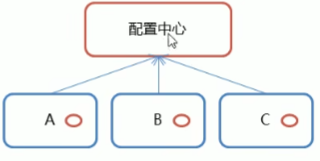
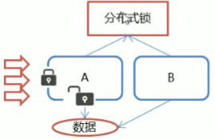
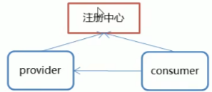
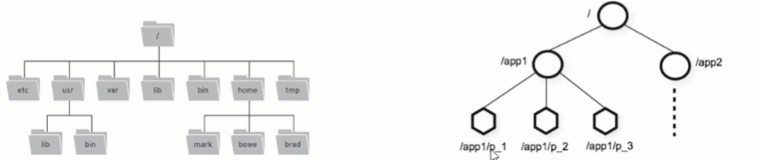
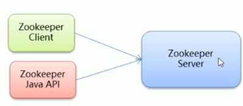
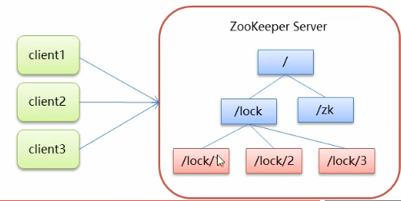
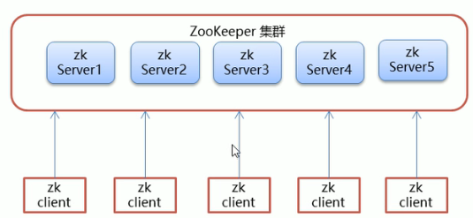
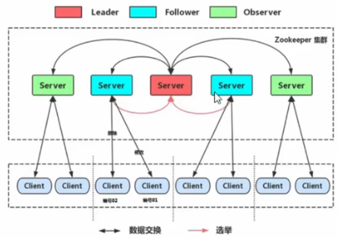

# Zookeeper概念

* Zookeeper是Apache Hadoop项目下的一个子项目，是一个树形目录服务

* Zookeeper翻译过来就是动物园管理员，它是用来管Hadoop（大象）、Hive（蜜蜂）、Pig（小猪）的管理员，简称zk

* Zookeeper是一个分布式的、开源的分布式应用程序的协调服务

* Zookeeper提供的主要功能包括：

  * 配置管理

    

  * 分布式锁

    

  * 集群管理

    

# ZooKeeper命令操作

### Zookeeper数据模型

* Zookeeper是一个树形目录服务，其数据模型和Unix的文件目录树很类似，拥有一个层次化结构

  

* 每个节点都被称为：ZNode，每个节点上都会保存自己的数据和节点信息

* 节点可以拥有子节点，同时也允许少量（1MB）数据存储在该节点之下

* 节点可以分为四大类：

  * PERSISTENT持久化节点
  * EPHEMERAL临时节点：-e
  * PERSISTENT_SEQUENTIAL持久化顺序节点：-s
  * EPHEERAL_SEQUENTIAL临时顺序节点：-es


### Zookeeper服务端常用命令



* 启动ZooKeeper服务：./zkServer.sh start
* 查看ZooKeeper服务状态：./zkServer.sh status
* 停止ZooKeeper服务：./zkServer.sh stop
* 重启ZooKeeper服务：./zkServer.sh restart


### Zookeeper客户端常用命令

* 连接Zookeeper（如果连接本机参数可省略）：./zkClie.sh -server ip:port
* 断开连接：quit
* 查看帮助：help
* 显示指定目录下节点：ls 目录（根节点为/） -s（详细信息）
* 默认操作的都是持久化节点，加上-e为临时节点，加上-s为持久顺序节点，加上-es为临时顺序节点
  * 创建节点：create /节点名 value
  * 删除单个节点（只能删除空节点）：delete /节点名
  * 删除带有子节点的节点：deleteall /节点名
  * 设置节点值：set /节点名 value
  * 获取节点值：get /节点名

# Zookeeper JavaAPI操作

### Curator介绍

* Curator是Apache Zookeeper的java客户端
* 创建的Java API：
  * 原生java API
  * ZkClient
  * Curator
* Curator项目的目标是简化ZooKeeper客户端的使用
* [官网](http://curator.apache.org)


### Curator API常用操作

#### 建立连接

``` java
RetryPolicy retryPolicy = new ExponentialBackoffRetry(3000, 10);
// 第一种方式
// CuratorFramework cf = CuratorFrameworkFactory.newClient(server地址和端口（可以是集群使用逗号隔开）, 会话超时时间单位为ms, 连接超时时间单位为ms, 重试策略);

// 第二种方式
CuratorFramework cf = CuratorFrameworkFactory.builder().connectString("")
    .seesionTimeoutMs(60 * 1000)
    .connectionTimeoutMs(15 * 1000)
    .retryPolicy(retryPolicy).namespace("根节点，此链接后续操作都以此为根节点").build();

// 开启连接
cf.start();
```


#### 添加节点

```java
// 基本创建，没有指定数据则默认将当前客户端的ip作为数据存储
String path = cf.create().forPath("/path");

// 创建节点带数据
String path = cf.create().forPath("/path", value);

// 设置节点的类型，默认为持久
String path = cf.create().withMode(CreateMode.*).forPath("/path", value);

// 创建多级节点
String path = cf.create().creatingParentsIfNeeded().forPath("/path/path2", value);
```


#### 删除节点

```java
// 删除单个节点 delete
cg.delete().forPath("/path");

// 删除带有子节点的节点 deleteall
cg.delete().deletingChildrenIfNeeded.forPath("/path");

// 必须成功的删除
cg.delete().guaranteed().forPath("/path");

// 带有回调方法的删除
cg.delete().guaranteed().inBackground((client, event) -> System.out.println(event)).forPath("/path");
```


#### 修改节点

```java
// 修改数据
cf.setData().forPath("/path", value);

// 根据版本修改
// verison去状态中查询
cf.setData().withVersion(version).forPath("/path", value);
```


#### 查询节点

```java
// 查询数据 get
byte[] data = cf.getData().forPath("/path");

// 查询子节点 ls
List<string> path = cf.getChildren.forPath("/path");

// 查询节点状态信息, ls -s
Stat status = new Stat();
cf.getData.storingStatIn(status).forPath("/path");
```


#### Watch事件监听

* Zookeeper允许用户在指定节点注册一些Watcher，并且在一些特定事件触发的时候，Zookeeper服务端会将事件通知到感兴趣的客户端上去，该机制是Zookkeeper实现分布式协调服务的重要特性。
* Zookeeper中引入Watcher机制来实现了发布/订阅功能，能够让多个订阅者同时监听某一个对象，当对象自身状态变化时，会通知所有订阅者
* Zookeeper原生支持通过注册Watcher来进行事件监听，但是使用并不是特别方便，需要开发人员自己反复注册Watcher，比较繁琐
* Curator引入了Cache来实现对Zookeeper服务端事件的监听
* Zookeeper提供了三种Watcher：
  * NodeCache：指的是监听某一个特定节点
  * PathChildrenCache：监听一个ZNode的子节点
  * TreeCache：可以监控整个树上的所有节点，类似于PathChuldrenCache和NodeCache的组合

```java
// NodeCache
// 1.创建NodeCache
NodeCache cache = new NodeCache(cf, "/path", 是否压缩);

// 2.注册监听
cache.getListenable().addListener(() -> {
    System.out.println("节点变化了");
    // 获取修改后数据
    byte[] data = cache.getCurrentData().getData();
});

// 3.开启监听,设置为true，则开启监听时，加载缓冲数据
cache.start(true);


// PathChildrenCache
// 1.创建PathChildrenCache
PathChildrenCache cache = new PathChildrenCache(cf, "/path", 是否缓存状态信息);

// 2.注册监听
cache.getListenable().addListener((client, event) -> {
    System.out.println(event);
});

// 3.开启监听,设置为true，则开启监听时，加载缓冲数据
cache.start(true);

// TreeCache
// 1.创建TreeCache
TreeCache cache = new TreeCache(cf, "/path");

// 2.注册监听
cache.getListenable().addListener((client, event) -> {
    System.out.println(event);
});

// 3.开启监听,设置为true，则开启监听时，加载缓冲数据
cache.start(true);
```


#### 分布式锁实现

* 概念

  * 在单机应用开发，涉及并发同步的时候，往往采用synchronized或者Lock的方式来解决多线程间的代码同步问题，这时多线程的运行时在同一个jvm之下，没有任何问题
  * 当应用时分布式集群工作的情况下，属于多JVM下的工作环境，跨JVM之间已经无法通过多线程的锁解决同步
  * 则需要一种更高级的锁机制，来处理**跨机器的进程之间的数据同步问题**---分布式锁

* Zookeeper分布式锁原理

  

  * 核心思想：当客户端要获取锁则创建节点，使用完锁，则删除该节点

    1. 客户端获取锁时，在lock节点下创建**临时顺序**节点
    2. 然后获取lock下面的所有子节点，客户端获取到所有子节点之后，如果发现自己创建的子节点序号最小，那么就认为该客户端获取到了锁。使用完锁后，将该节点删除。
    3. 如果发现自己创建的节点并非lock所有子节点中最小的，说明自己还没有获取到锁，此时客户端需要找到比自己小的那个节点，同时对其注册事件监听器，监听删除事件。
    4. 如果发现比自己小的那个节点被删除，则客户端的watcher会收到相应通知，此时再次判断自己创建的节点是否是lock子节点中序号最小的，如果是则获取到了锁，如果不是则重复以上步骤继续获取到比自己小的一个节点并注册监听。

  * 在cuator中有五种锁方案：

    1. InterProcessSemaphoreMutex：分布式排它锁（非可重入锁）
    2. InterProcessMutex：分布式可重入排它锁
    3. InterProcessReadWirteLock：分布式读写锁
    4. InterProcessMultiLock：将多个锁作为单个实体管理的容器
    5. InterrProcessSemaphoreV：共享信号量

  * 案例：模拟售票

    ```java
    // 售票站
    public class Ticket implements Runable {
        private int tickets = 10;
        
        private InterProcessMutext lock;
        
        publick Ticket(){
            lock = new InterProcessMutext(client, "/lock");
        }
        
        @override
        public void run(){
            while(true) {
                // 加锁
                lock.acquire(3, TimeUnit.SECONDS);
                if (tickets > 0) {
                    System.out.println(Thread.currentThread() + ":" + tickets);
                    tcikets--;
                }
                
                //释放锁
                lock.realease();
            }
        }
    }
    
    // 测试
    public class LockTest {
        Ticket tic = new Ticket();
        
        Thread t1 = new Thread(tic, "携程");
        Thread t2 = new Thread(tic, "飞猪");
        
        t1.start();
        t2.start();
    }
    ```


# Zookeeper集群

### Zookeeper集群介绍

Leader选举：



* Serviceid：服务ID

  比如有三台服务器，编号分别是1,2,3。编号越大在选择算法中的权重越大。

* Zxid：数据ID

  服务器中存放的最大数据ID。值越大说明数据越新，在选举算法中数据越新权重越大。

* 在Leader选举的过程中，如果某台Zookeeper获得了超过半数的选票，则此Zookeeper就可以称为Leader了。


### Zookeeper集群角色



在Zookeeper集群服务中心有三个角色：

* Leader领导者：
  1. 处理事务请求
  2. 集群内部各服务器的调度者
* Follower跟随者：
  1. 处理客户端非事务请求，转发事务请求给Leader服务器
  2. 参与Leader选举投票
* Observer观察者
  1. 处理客户端非事务请求，转发事务请求给Leader服务器