### 线性表

线性表是最基本、最简单、也是最常用的一种数据结构。一个线性表是n个具有相同特性的数据元素的有限序列。


前驱元素： 

​    若A元素在B元素的前面，则称A为B的前驱元素 

后继元素： 

​    若B元素在A元素的后面，则称B为A的后继元素

**线性表的特征：**数据元素之间具有一种“一对一”的逻辑关系。 

    1. 第一个数据元素没有前驱，这个数据元素被称为头结点；
    1. 最后一个数据元素没有后继，这个数据元素被称为尾结点； 
    1. 除了第一个和最后一个数据元素外，其他数据元素有且仅有一个前驱和一个后继。 

如果把线性表用数学语言来定义，则可以表示为(a1,...ai-1,ai,ai+1,...an)，ai-1领先于ai,ai领先于ai+1，称ai-1是ai的 前驱元素，ai+1是ai的后继元素

**线性表的分类：** 

​        线性表中数据存储的方式可以是顺序存储，也可以是链式存储，按照数据的存储方式不同，可以把线性表分为顺序 表和链表。

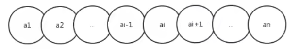

#### 1.1顺序表

顺序表是在计算机内存中以数组的形式保存的线性表，线性表的顺序存储是指用一组地址连续的存储单元，依次存 储线性表中的各个元素、使得线性表中在逻辑结构上相邻的数据元素存储在相邻的物理存储单元中，即通过数据元 素物理存储的相邻关系来反映数据元素之间逻辑上的相邻关系。

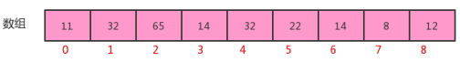

##### 1.1.1顺序表的实现

**顺序表API设计：**

| 类名   | SequenceList<T>                                                                                                                                                                                                                                                                                                                                                                                         |
| ---- | ------------------------------------------------------------------------------------------------------------------------------------------------------------------------------------------------------------------------------------------------------------------------------------------------------------------------------------------------------------------------------------------------------- |
| 构造方法 | SequenceList(int capacity)：创建容量为capacity的SequenceList对象                                                                                                                                                                                                                                                                                                                                                 |
| 成员方法 | 1.public void clear()：空置线性表  <br>2.publicboolean isEmpty()：判断线性表是否为空，是返回true，否返回false <br/>3.public int length():获取线性表中元素的个数 <br/>4.public T get(int i):读取并返回线性表中的第i个元素的值 <br/>5.public void insert(int i,T t)：在线性表的第i个元素之前插入一个值为t的数据元素。 <br/>6.public void insert(T t):向线性表中添加一个元素t <br/>7.public T remove(int i):删除并返回线性表中第i个数据元素。 <br/>8.public int indexOf(T t):返回线性表中首次出现的指定的数据元素的位序号，若不存在，则返 回-1。 |
| 成员变量 | 1.private T[] eles：存储元素的数组 <br/>2.private int N:当前线性表的长度                                                                                                                                                                                                                                                                                                                                                |

**顺序表的代码实现：**

```java
//顺序表代码
public class SequenceList<T> {
    //存储元素的数组
    private T[] eles;
    //记录当前顺序表中的元素个数
    private int N;
    //构造方法
    public SequenceList(int capacity){
        eles = (T[])new Object[capacity];
        N=0;
    }
    //将一个线性表置为空表
    public void clear(){
        N=0;
    }
    //判断当前线性表是否为空表
    public boolean isEmpty(){
        return N==0;
    }
    //获取线性表的长度
    public int length(){
        return N;
    }
    //获取指定位置的元素
    public T get(int i){
        if (i<0 || i>=N){
            throw new RuntimeException("当前元素不存在！");
        }
        return eles[i];
    }
    //向线型表中添加元素t
    public void insert(T t){
        if (N==eles.length){
            throw new RuntimeException("当前表已满");
        }
        eles[N++] = t;
    }
    //在i元素处插入元素t
    public void insert(int i,T t){
        if (i==eles.length){
            throw new RuntimeException("当前表已满");
        }
        if (i<0 || i>N){
            throw new RuntimeException("插入的位置不合法");
        }
        //把i位置空出来，i位置及其后面的元素依次向后移动一位
        for (int index=N;index>i;index--){
            eles[index]=eles[index-1];
        }
        //把t放到i位置处
        eles[i]=t;
        //元素数量+1
        N++;
    }
    //删除指定位置i处的元素，并返回该元素
    public T remove(int i){
        if (i<0 || i>N-1){
            throw new RuntimeException("当前要删除的元素不存在");
        }
        //记录i位置处的元素
        T result = eles[i];
        //把i位置后面的元素都向前移动一位
        for (int index=i;index<N-1;index++){
            eles[index]=eles[index+1];
        }
        //当前元素数量-1
        N--;
        return result;
    }
    //查找t元素第一次出现的位置
    public int indexOf(T t){
        if(t==null){
            throw new RuntimeException("查找的元素不合法");
        }
        for (int i = 0; i < N; i++) {
            if (eles[i].equals(t)){
                return i;
            }
        }
        return -1;
    }
}
//测试代码
public class SequenceListTest {
    public static void main(String[] args) {
        //创建顺序表对象
        SequenceList<String> sl = new SequenceList<>(10);
        //测试插入
        sl.insert("姚明");
        sl.insert("科比");
        sl.insert("麦迪");
        sl.insert(1,"詹姆斯");
        //测试获取
        String getResult = sl.get(1);
        System.out.println("获取索引1处的结果为："+getResult);
        //测试删除
        String removeResult = sl.remove(0);
        System.out.println("删除的元素是："+removeResult);
        //测试清空
        sl.clear();
        System.out.println("清空后的线性表中的元素个数为:"+sl.length());
    }
}
```

##### 1.1.2顺序表的遍历

一般作为容器存储数据，都需要向外部提供遍历的方式，因此我们需要给顺序表提供遍历方式。

在java中，遍历集合的方式一般都是用的是foreach循环，如果想让我们的SequenceList也能支持foreach循环，则 需要做如下操作：

    1. 让SequenceList实现Iterable接口，重写iterator方法； 
    1. 在SequenceList内部提供一个内部类SIterator,实现Iterator接口，重写hasNext方法和next方法；

代码：

```java
//顺序表代码
import java.util.Iterator;
public class SequenceList<T> implements Iterable<T>{
    //存储元素的数组
    private T[] eles;
    //记录当前顺序表中的元素个数
    private int N;
    //构造方法
    public SequenceList(int capacity){
        eles = (T[])new Object[capacity];
        N=0;
    }
    //将一个线性表置为空表
    public void clear(){
        N=0;
    }
    //判断当前线性表是否为空表
    public boolean isEmpty(){
        return N==0;
    }
    //获取线性表的长度
    public int length(){
        return N;
    }
    //获取指定位置的元素
    public T get(int i){
        if (i<0 || i>=N){
            throw new RuntimeException("当前元素不存在！");
        }
        return eles[i];
    }
    //向线型表中添加元素t
    public void insert(T t){
        if (N==eles.length){
            throw new RuntimeException("当前表已满");
        }
        eles[N++] = t;
    }
    //在i元素处插入元素t
    public void insert(int i,T t){
        if (i==eles.length){
            throw new RuntimeException("当前表已满");
        }
        if (i<0 || i>N){
            throw new RuntimeException("插入的位置不合法");
        }
        //把i位置空出来，i位置及其后面的元素依次向后移动一位
        for (int index=N;index>i;index--){
            eles[index]=eles[index-1];
        }
        //把t放到i位置处
        eles[i]=t;
        //元素数量+1
        N++;
    }
    //删除指定位置i处的元素，并返回该元素
    public T remove(int i){
        if (i<0 || i>N-1){
            throw new RuntimeException("当前要删除的元素不存在");
        }
        //记录i位置处的元素
        T result = eles[i];
        //把i位置后面的元素都向前移动一位
        for (int index=i;index<N-1;index++){
            eles[index]=eles[index+1];
        }
        //当前元素数量-1
        N--;
        return result;
    }
    //查找t元素第一次出现的位置
    public int indexOf(T t){
        if(t==null){
            throw new RuntimeException("查找的元素不合法");
        }
        for (int i = 0; i < N; i++) {
            if (eles[i].equals(t)){
                return i;
            }
        }
        return -1;
    }
    //打印当前线性表的元素
    public void showEles(){
        for (int i = 0; i < N; i++) {
            System.out.print(eles[i]+" ");
        }
        System.out.println();
    }
    @Override
    public Iterator iterator() {
        return new SIterator();
    }
    private class SIterator implements Iterator{
        private int cur;
        public SIterator(){
            this.cur=0;
        }
        @Override
        public boolean hasNext() {
            return cur<N;
        }
        @Override
        public T next() {
            return eles[cur++];
        }
    }
}
//测试代码
public class Test {
    public static void main(String[] args) throws Exception {
        SequenceList<String> squence = new SequenceList<>(5);
        //测试遍历
        squence.insert(0, "姚明");
        squence.insert(1, "科比");
        squence.insert(2, "麦迪");
        squence.insert(3, "艾佛森");
        squence.insert(4, "卡特");
        for (String s : squence) {
            System.out.println(s);
        }
    }
}
```

##### 1.1.3顺序表的容量可变

在之前的实现中，当我们使用SequenceList时，先new SequenceList(5)创建一个对象，创建对象时就需要指定容 器的大小，初始化指定大小的数组来存储元素，当我们插入元素时，如果已经插入了5个元素，还要继续插入数 据，则会报错，就不能插入了。这种设计不符合容器的设计理念，因此我们在设计顺序表时，应该考虑它的容量的 伸缩性。 

考虑容器的容量伸缩性，其实就是改变存储数据元素的数组的大小，那我们需要考虑什么时候需要改变数组的大 小？ 

1.添加元素时： 

​        添加元素时，应该检查当前数组的大小是否能容纳新的元素，如果不能容纳，则需要创建新的容量更大的数组，我 们这里创建一个是原数组两倍容量的新数组存储元素。

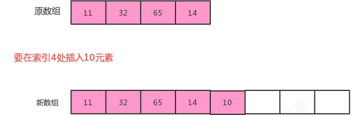

2.移除元素时： 

​        移除元素时，应该检查当前数组的大小是否太大，比如正在用100个容量的数组存储10个元素，这样就会造成内存 空间的浪费，应该创建一个容量更小的数组存储元素。如果我们发现数据元素的数量不足数组容量的1/4，则创建 一个是原数组容量的1/2的新数组存储元素。

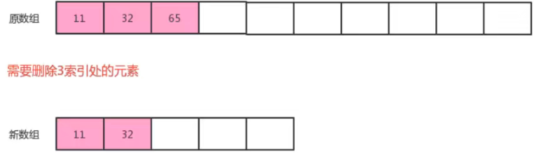

**顺序表的容量可变代码：**

```java
//顺序表代码
public class SequenceList<T> implements Iterable<T>{
    //存储元素的数组
    private T[] eles;
    //记录当前顺序表中的元素个数
    private int N;
    //构造方法
    public SequenceList(int capacity){
        eles = (T[])new Object[capacity];
        N=0;
    }
    //将一个线性表置为空表
    public void clear(){
        N=0;
    }
    //判断当前线性表是否为空表
    public boolean isEmpty(){
        return N==0;
    }
    //获取线性表的长度
    public int length(){
        return N;
    }
    //获取指定位置的元素
    public T get(int i){
        if (i<0 || i>=N){
            throw new RuntimeException("当前元素不存在！");
        }
        return eles[i];
    }
    //向线型表中添加元素t
    public void insert(T t){
        if (N==eles.length){
            resize(eles.length*2);
        }
        eles[N++] = t;
    }
    //在i元素处插入元素t
    public void insert(int i,T t){
        if (i<0 || i>N){
            throw new RuntimeException("插入的位置不合法");
        }
        //元素已经放满了数组，需要扩容
        if (N==eles.length){
            resize(eles.length*2);
        }
        //把i位置空出来，i位置及其后面的元素依次向后移动一位
        for (int index=N-1;index>i;index--){
            eles[index]=eles[index-1];
        }
        //把t放到i位置处
        eles[i]=t;
        //元素数量+1
        N++;
    }
    //删除指定位置i处的元素，并返回该元素
    public T remove(int i){
        if (i<0 || i>N-1){
            throw new RuntimeException("当前要删除的元素不存在");
        }
        //记录i位置处的元素
        T result = eles[i];
        //把i位置后面的元素都向前移动一位
        for (int index=i;index<N-1;index++){
            eles[index]=eles[index+1];
        }
        //当前元素数量-1
        N--;
        //当元素已经不足数组大小的1/4,则重置数组的大小
        if (N>0 && N<eles.length/4){
            resize(eles.length/2);
        }
        return result;
    }
    //查找t元素第一次出现的位置
    public int indexOf(T t){
        if(t==null){
            throw new RuntimeException("查找的元素不合法");
        }
        for (int i = 0; i < N; i++) {
            if (eles[i].equals(t)){
                return i;
            }
        }
        return -1;
    }
    //打印当前线性表的元素
    public void showEles(){
        for (int i = 0; i < N; i++) {
            System.out.print(eles[i]+" ");
        }
        System.out.println();
    }
    @Override
    public Iterator iterator() {
        return new SIterator();
    }
    private class SIterator implements Iterator{
        private int cur;
        public SIterator(){
            this.cur=0;
        }
        @Override
        public boolean hasNext() {
            return cur<N;
        }
        @Override
        public T next() {
            return eles[cur++];
        }
    }
    //改变容量
    private void resize(int newSize){
        //记录旧数组
        T[] temp = eles;
        //创建新数组
        eles = (T[]) new Object[newSize];
        //把旧数组中的元素拷贝到新数组
        for (int i = 0; i < N; i++) {
            eles[i] = temp[i];
        }
    }
    public int capacity(){
        return eles.length;
    }
}
//测试代码
public class Test {
    public static void main(String[] args) throws Exception {
        SequenceList<String> squence = new SequenceList<>(5);
        //测试遍历
        squence.insert(0, "姚明");
        squence.insert(1, "科比");
        squence.insert(2, "麦迪");
        squence.insert(3, "艾佛森");
        squence.insert(4, "卡特");
        System.out.println(squence.capacity());
        squence.insert(5,"aa");
        System.out.println(squence.capacity());
        squence.insert(5,"aa");
        squence.insert(5,"aa");
        squence.insert(5,"aa");
        squence.insert(5,"aa");
        squence.insert(5,"aa");
        System.out.println(squence.capacity());
        squence.remove(1);
        squence.remove(1);
        squence.remove(1);
        squence.remove(1);
        squence.remove(1);
        squence.remove(1);
        squence.remove(1);
        System.out.println(squence.capacity());
    }
}
```

##### 1.1.4顺序表的时间复杂度

get(i):不难看出，不论数据元素量N有多大，只需要一次eles[i]就可以获取到对应的元素，所以时间复杂度为O(1); 

insert(int i,T t):每一次插入，都需要把i位置后面的元素移动一次，随着元素数量N的增大，移动的元素也越多，时 间复杂为O(n); 

remove(int i):每一次删除，都需要把i位置后面的元素移动一次，随着数据量N的增大,移动的元素也越多，时间复 杂度为O(n); 

由于顺序表的底层由数组实现，数组的长度是固定的，所以在操作的过程中涉及到了容器扩容操作。这样会导致顺 序表在使用过程中的时间复杂度不是线性的，在某些需要扩容的结点处，耗时会突增，尤其是元素越多，这个问题越明显

##### 1.1.5 java中ArrayList实现

java中ArrayList集合的底层也是一种顺序表，使用数组实现，同样提供了增删改查以及扩容等功能。 

    1. 是否用数组实现； 
    1. 有没有扩容操作；
    1. 有没有提供遍历方式

#### 1.2链表

之前我们已经使用顺序存储结构实现了线性表，我们会发现虽然顺序表的查询很快，时间复杂度为O(1),但是增删的 效率是比较低的，因为每一次增删操作都伴随着大量的数据元素移动。这个问题有没有解决方案呢？有，我们可以 使用另外一种存储结构实现线性表，链式存储结构。 

链表是一种物理存储单元上非连续、非顺序的存储结构，其物理结构不能直观的表示数据元素的逻辑顺序，数据元 素的逻辑顺序是通过链表中的指针链接次序实现的。链表由一系列的结点（链表中的每一个元素称为结点）组成， 结点可以在运行时动态生成。

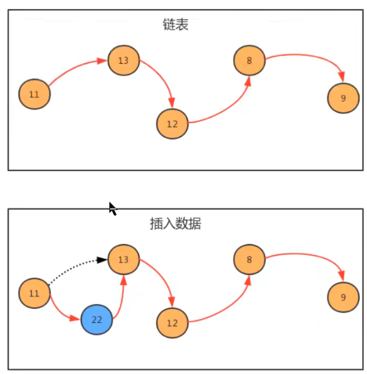

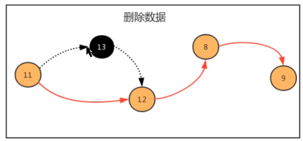

那我们如何使用链表呢？按照面向对象的思想，我们可以设计一个类，来描述结点这个事物，用一个属性描述这个 结点存储的元素，用来另外一个属性描述这个结点的下一个结点。

**结点API设计：**

| 类名   | Node                              |
| ---- | --------------------------------- |
| 构造方法 | Node(T t,Node next)：创建Node对象      |
| 成员变量 | T item:存储数据 <br>Node next：指向下一个结点 |

**结点类实现：**

```java
public class Node<T> {
    //存储元素
    public T item;
    //指向下一个结点
    public Node next;
    public Node(T item, Node next) {
        this.item = item;
        this.next = next;
    }
}
```

**生成链表：**

```java
public static void main(String[] args) throws Exception {
    //构建结点
    Node<Integer> first = new Node<Integer>(11, null);
    Node<Integer> second = new Node<Integer>(13, null);
    Node<Integer> third = new Node<Integer>(12, null);
    Node<Integer> fourth = new Node<Integer>(8, null);
    Node<Integer> fifth = new Node<Integer>(9, null);
    //生成链表
    first.next = second;
    second.next = third;
    third.next = fourth;
    fourth.next = fifth;
}
```

##### 1.2.1单向链表

单向链表是链表的一种，它由多个结点组成，每个结点都由一个数据域和一个指针域组成，数据域用来存储数据， 指针域用来指向其后继结点。链表的头结点的数据域不存储数据，指针域指向第一个真正存储数据的结点。

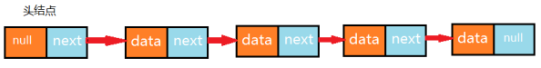

###### 1.2.1.1 单向链表API设计

| 类名    | LinkList<T>                                                                                                                                                                                                                                                                                                                                                                                              |
| ----- | -------------------------------------------------------------------------------------------------------------------------------------------------------------------------------------------------------------------------------------------------------------------------------------------------------------------------------------------------------------------------------------------------------- |
| 构造方法  | LinkList()：创建LinkList对象                                                                                                                                                                                                                                                                                                                                                                                  |
| 成员方法  | 1.public void clear()：空置线性表  <br/>2.publicboolean isEmpty()：判断线性表是否为空，是返回true，否返回false <br/>3.public int length():获取线性表中元素的个数 <br/>4.public T get(int i):读取并返回线性表中的第i个元素的值 <br/>5.public void insert(T t)：往线性表中添加一个元素； <br/>6.public void insert(int i,T t)：在线性表的第i个元素之前插入一个值为t的数据元素。 <br/>7.public T remove(int i):删除并返回线性表中第i个数据元素。 <br/>8.public int indexOf(T t):返回线性表中首次出现的指定的数据元素的位序号，若不存在，则 返回-1。 |
| 成员内部类 | private class Node:结点类                                                                                                                                                                                                                                                                                                                                                                                   |
| 成员变量  | 1.private Node head:记录首结点 <br/>2.private int N:记录链表的长度                                                                                                                                                                                                                                                                                                                                                   |

###### 1.2.1.2单向链表代码实现

```java
//单向列表代码
import java.util.Iterator;
public class LinkList<T> implements Iterable<T> {
    //记录头结点
    private Node head;
    //记录链表的长度
    private int N;
    public LinkList(){
        //初始化头结点
        head = new Node(null,null);
        N=0;
    }
    //清空链表
    public void clear(){
        head.next=null;
        head.item=null;
        N=0;
    }
    //获取链表的长度
    public int length(){
        return N;
    }
    //判断链表是否为空
    public boolean isEmpty(){
        return N==0;
    }
    //获取指定位置i出的元素
    public T get(int i){
        if (i<0||i>=N){
            throw new RuntimeException("位置不合法！");
        }
        Node n = head.next;
        for (int index = 0; index < i; index++) {
            n = n.next;
        }
        return n.item;
    }
    //向链表中添加元素t
    public void insert(T t){
        //找到最后一个节点
        Node n = head;
        while(n.next!=null){
            n = n.next;
        }
        Node newNode = new Node(t, null);
        n.next = newNode;
        //链表长度+1
        N++;
    }
    //向指定位置i处，添加元素t
    public void insert(int i,T t){
        if (i<0||i>=N){
            throw new RuntimeException("位置不合法！");
        }
        //寻找位置i之前的结点
        Node pre = head;
        for (int index = 0; index <=i-1; index++) {
            pre = pre.next;
        }
        //位置i的结点
        Node curr = pre.next;
        //构建新的结点，让新结点指向位置i的结点
        Node newNode = new Node(t, curr);
        //让之前的结点指向新结点
        pre.next = newNode;
        //长度+1
        N++;
    }
    //删除指定位置i处的元素，并返回被删除的元素
    public T remove(int i){
        if (i<0 || i>=N){
            throw new RuntimeException("位置不合法");
        }
        //寻找i之前的元素
        Node pre = head;
        for (int index = 0; index <=i-1; index++) {
            pre = pre.next;
        }
        //当前i位置的结点
        Node curr = pre.next;
        //前一个结点指向下一个结点，删除当前结点
        pre.next = curr.next;
        //长度-1
        N--;
        return curr.item;
    }
    //查找元素t在链表中第一次出现的位置
    public int indexOf(T t){
        Node n = head;
        for (int i = 0;n.next!=null;i++){
            n = n.next;
            if (n.item.equals(t)){
                return i;
            }
        }
        return -1;
    }
    //结点类
    private class Node{
        //存储数据
        T item;
        //下一个结点
        Node next;
        public Node(T item, Node next) {
            this.item = item;
            this.next = next;
        }
    }
    @Override
    public Iterator iterator() {
        return new LIterator();
    }
    private class LIterator implements Iterator<T>{
        private Node n;
        public LIterator() {
            this.n = head;
        }
        @Override
        public boolean hasNext() {
            return n.next!=null;
        }
        @Override
        public T next() {
            n = n.next;
            return n.item;
        }
    }
}
//测试代码
public class Test {
    public static void main(String[] args) throws Exception {
        LinkList<String> list = new LinkList<>();
        list.insert(0,"张三");
        list.insert(1,"李四");
        list.insert(2,"王五");
        list.insert(3,"赵六");
        //测试length方法
        for (String s : list) {
            System.out.println(s);
        }
        System.out.println(list.length());
        System.out.println("-------------------");
        //测试get方法
        System.out.println(list.get(2));
        System.out.println("------------------------");
        //测试remove方法
        String remove = list.remove(1);
        System.out.println(remove);
        System.out.println(list.length());
        System.out.println("----------------");;
        for (String s : list) {
            System.out.println(s);
        }
    }
}
```

##### 1.2.2双向链表

双向链表也叫双向表，是链表的一种，它由多个结点组成，每个结点都由一个数据域和两个指针域组成，数据域用 来存储数据，其中一个指针域用来指向其后继结点，另一个指针域用来指向前驱结点。链表的头结点的数据域不存 储数据，指向前驱结点的指针域值为null，指向后继结点的指针域指向第一个真正存储数据的结点。

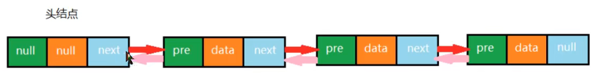

按照面向对象的思想，我们需要设计一个类，来描述结点这个事物。由于结点是属于链表的，所以我们把结点类作 为链表类的一个内部类来实现

###### 1.2.2.1结点API设计

| 类名   | Node                                                     |
| ---- | -------------------------------------------------------- |
| 构造方法 | Node(T t,Node pre,Node next)：创建Node对象                    |
| 成员变量 | T item:存储数据 <br/>Node next：指向下一个结点 <br/>Node pre:指向上一个结点 |

###### 1.2.2.2双向链表API设计

| 类名    | TowWayLinkList<T>                                                                                                                                                                                                                                                                                                                                                                                                                                                               |
| ----- | ------------------------------------------------------------------------------------------------------------------------------------------------------------------------------------------------------------------------------------------------------------------------------------------------------------------------------------------------------------------------------------------------------------------------------------------------------------------------------- |
| 构造方法  | TowWayLinkList()：创建TowWayLinkList对象                                                                                                                                                                                                                                                                                                                                                                                                                                             |
| 成员方法  | 1.public void clear()：空置线性表  <br/>2.publicboolean isEmpty()：判断线性表是否为空，是返回true，否返回false <br/>3.public int length():获取线性表中元素的个数 <br/>4.public T get(int i):读取并返回线性表中的第i个元素的值 <br/>5.public void insert(T t)：往线性表中添加一个元素； <br/>6.public void insert(int i,T t)：在线性表的第i个元素之前插入一个值为t的数据元素。 <br/>7.public T remove(int i):删除并返回线性表中第i个数据元素。 <br/>8.public int indexOf(T t):返回线性表中首次出现的指定的数据元素的位序号，若不存在，则 返回-1。 <br/>9.public T getFirst():获取第一个元素 <br/>10.public T getLast():获取最后一个元素 |
| 成员内部类 | private class Node:结点类                                                                                                                                                                                                                                                                                                                                                                                                                                                          |
| 成员变量  | 1.private Node first:记录首结点 <br/>2.private Node last:记录尾结点 <br/>3.private int N:记录链表的长度                                                                                                                                                                                                                                                                                                                                                                                          |

###### 1.2.2.3双向链表代码实现

```java
//双向链表代码
import java.util.Iterator;
public class TowWayLinkList<T> implements Iterable<T>{
    //首结点
    private Node head;
    //最后一个结点
    private Node last;
    //链表的长度
    private int N;
    public TowWayLinkList() {
        last = null;
        head = new Node(null,null,null);
        N=0;
    }
    //清空链表
    public void clear(){
        last=null;
        head.next=last;
        head.pre=null;
        head.item=null;
        N=0;
    }
    //获取链表长度
    public int length(){
        return N;
    }
    //判断链表是否为空
    public boolean isEmpty(){
        return N==0;
    }
    //插入元素t
    public void insert(T t){
        if (last==null){
            last = new Node(t,head,null);
            head.next = last;
        }else{
            Node oldLast = last;
            Node node = new Node(t, oldLast, null);
            oldLast.next = node;
            last = node;
        }
        //长度+1
        N++;
    }
    //向指定位置i处插入元素t
    public void insert(int i,T t){
        if (i<0 || i>=N){
            throw new RuntimeException("位置不合法");
        }
        //找到位置i的前一个结点
        Node pre = head;
        for (int index = 0; index < i; index++) {
            pre = pre.next;
        }
        //当前结点
        Node curr = pre.next;
        //构建新结点
        Node newNode = new Node(t, pre, curr);
        curr.pre= newNode;
        pre.next = newNode;
        //长度+1
        N++;
    }
    //获取指定位置i处的元素
    public T get(int i){
        if (i<0||i>=N){
            throw new RuntimeException("位置不合法");
        }
        //寻找当前结点
        Node curr = head.next;
        for (int index = 0; index <i; index++) {
            curr = curr.next;
        }
        return curr.item;
    }
    //找到元素t在链表中第一次出现的位置
    public int indexOf(T t){
        Node n= head;
        for (int i=0;n.next!=null;i++){
            n = n.next;
            if (n.next.equals(t)){
                return i;
            }
        }
        return -1;
    }
    //删除位置i处的元素，并返回该元素
    public T remove(int i){
        if (i<0 || i>=N){
            throw new RuntimeException("位置不合法");
        }
        //寻找i位置的前一个元素
        Node pre = head;
        for (int index = 0; index <i ; index++) {
            pre = pre.next;
        }
        //i位置的元素
        Node curr = pre.next;
        //i位置的下一个元素
        Node curr_next = curr.next;
        pre.next = curr_next;
        curr_next.pre = pre;
        //长度-1；
        N--;
        return curr.item;
    }
    //获取第一个元素
    public T getFirst(){
        if (isEmpty()){
            return null;
        }
        return head.next.item;
    }
    //获取最后一个元素
    public T getLast(){
        if (isEmpty()){
            return null;
        }
        return last.item;
    }
    @Override
    public Iterator<T> iterator() {
        return new TIterator();
    }
    private class TIterator implements Iterator{
        private Node n = head;
        @Override
        public boolean hasNext() {
            return n.next!=null;
        }
        @Override
        public Object next() {
            n = n.next;
            return n.item;
        }
    }
    //结点类
    private class Node{
        public Node(T item, Node pre, Node next) {
            this.item = item;
            this.pre = pre;
            this.next = next;
        }
        //存储数据
        public T item;
        //指向上一个结点
        public Node pre;
        //指向下一个结点
        public Node next;
    }
}
//测试代码
public class Test {
    public static void main(String[] args) throws Exception {
        TowWayLinkList<String> list = new TowWayLinkList<>();
        list.insert("乔峰");
        list.insert("虚竹");
        list.insert("段誉");
        list.insert(1,"鸠摩智");
        list.insert(3,"叶二娘");
        for (String str : list) {
            System.out.println(str);
        }
        System.out.println("----------------------");
        String tow = list.get(2);
        System.out.println(tow);
        System.out.println("-------------------------");
        String remove = list.remove(3);
        System.out.println(remove);
        System.out.println(list.length());
        System.out.println("--------------------");
        System.out.println(list.getFirst());
        System.out.println(list.getLast());
    }
}
```

###### 1.2.2.4java中LinkedList实现

java中LinkedList集合也是使用双向链表实现，并提供了增删改查等相关方法 

    1. 底层是否用双向链表实现； 
    1. 结点类是否有三个域

##### 1.2.3链表的复杂度分析

get(int i):每一次查询，都需要从链表的头部开始，依次向后查找，随着数据元素N的增多，比较的元素越多，时间 复杂度为O(n) 

insert(int i,T t):每一次插入，需要先找到i位置的前一个元素，然后完成插入操作，随着数据元素N的增多，查找的 元素越多，时间复杂度为O(n); 

remove(int i):每一次移除，需要先找到i位置的前一个元素，然后完成插入操作，随着数据元素N的增多，查找的元 素越多，时间复杂度为O(n) 

相比较顺序表，链表插入和删除的时间复杂度虽然一样，但仍然有很大的优势，因为链表的物理地址是不连续的， 它不需要预先指定存储空间大小，或者在存储过程中涉及到扩容等操作,,同时它并没有涉及的元素的交换。 

相比较顺序表，链表的查询操作性能会比较低。因此，如果我们的程序中查询操作比较多，建议使用顺序表，增删 操作比较多，建议使用链表。

##### 1.2.4链表反转

单链表的反转，是面试中的一个高频题目。 

**需求：** 

原链表中数据为：1->2->3>4

反转后链表中数据为：4->3->2->1

**反转API：**

```java
public void reverse()：对整个链表反转
public Node reverse(Node curr)：反转链表中的某个结点curr,并把反转后的curr结点返回
```

使用递归可以完成反转，递归反转其实就是从原链表的第一个存数据的结点开始，依次递归调用反转每一个结点， 直到把最后一个结点反转完毕，整个链表就反转完毕。

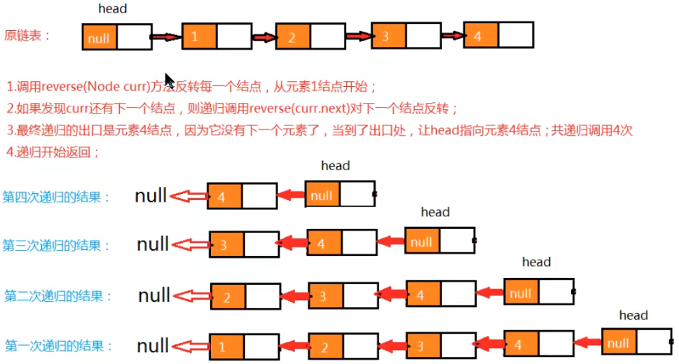

**代码:**

```java
public void reverse(){
    if (N==0){
        //当前是空链表，不需要反转
        return;
    }
    reverse(head.next);
}
/**
*
* @param curr 当前遍历的结点
* @return 反转后当前结点上一个结点
*/
public Node reverse(Node curr){
    //已经到了最后一个元素
    if (curr.next==null){
        //反转后，头结点应该指向原链表中的最后一个元素
        head.next=curr;
        return curr;
    }
    //当前结点的上一个结点
    Node pre = reverse(curr.next);
    pre.next = curr;
    //当前结点的下一个结点设为null
    curr.next=null;
    //返回当前结点
    return curr;
}
//测试代码
public class Test {
    public static void main(String[] args) throws Exception {
        LinkList<Integer> list = new LinkList<>();
        list.insert(1);
        list.insert(2);
        list.insert(3);
        list.insert(4);
        for (Integer i : list) {
            System.out.print(i+" ");
        }
        System.out.println();
        System.out.println("--------------------");
        list.reverse();
        for (Integer i : list) {
            System.out.print(i+" ");
        }
    }
}
```

##### 1.2.5 快慢指针

快慢指针指的是定义两个指针，这两个指针的移动速度一块一慢，以此来制造出自己想要的差值，这个差值可以然 我们找到链表上相应的结点。一般情况下，快指针的移动步长为慢指针的两倍

###### 1.2.5.1中间值问题

我们先来看下面一段代码，然后完成需求。

```java
//测试类
public class Test {
    public static void main(String[] args) throws Exception {
        Node<String> first = new Node<String>("aa", null);
        Node<String> second = new Node<String>("bb", null);
        Node<String> third = new Node<String>("cc", null);
        Node<String> fourth = new Node<String>("dd", null);
        Node<String> fifth = new Node<String>("ee", null);
        Node<String> six = new Node<String>("ff", null);
        Node<String> seven = new Node<String>("gg", null);
        //完成结点之间的指向
        first.next = second;
        second.next = third;
        third.next = fourth;
        fourth.next = fifth;
        fifth.next = six;
        six.next = seven;
        //查找中间值
        String mid = getMid(first);
        System.out.println("中间值为："+mid);
    }
    /**
* @param first 链表的首结点
* @return 链表的中间结点的值
*/
    public static String getMid(Node<String> first) {
        return null;
    }
    //结点类
    private static class Node<T> {
        //存储数据
        T item;
        //下一个结点
        Node next;
        public Node(T item, Node next) {
            this.item = item;
            this.next = next;
        }
    }
}
```

**需求：**

请完善测试类Test中的getMid方法，可以找出链表的中间元素值并返回。 

利用快慢指针，我们把一个链表看成一个跑道，假设a的速度是b的两倍，那么当a跑完全程后，b刚好跑一半，以 此来达到找到中间节点的目的。 

如下图，最开始，slow与fast指针都指向链表第一个节点，然后slow每次移动一个指针，fast每次移动两个指针。

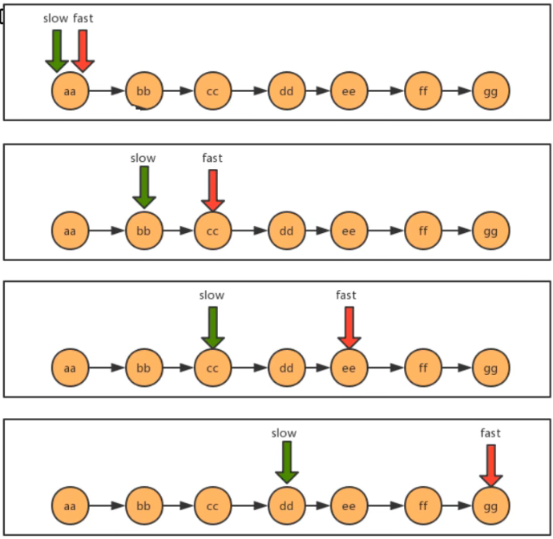

**代码：**

```java
/**
* @param first 链表的首结点
* @return 链表的中间结点的值
*/
public static String getMid(Node<String> first) {
    Node<String> slow = first;
    Node<String> fast = first;
    while(fast!=null && fast.next!=null){
        fast=fast.next.next;
        slow=slow.next;
    }
    return slow.item;
}
```

###### 1.2.5.2 单向链表是否有环问题

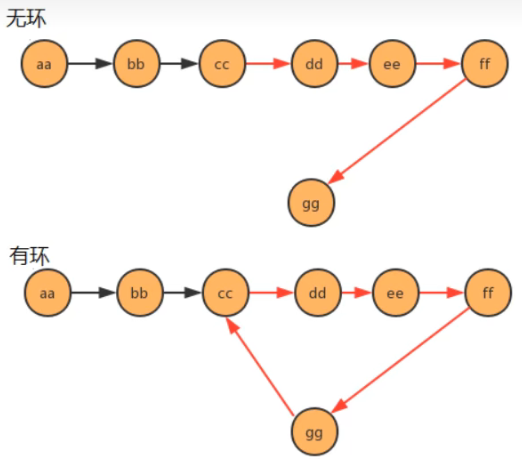

看下面代码，完成需求：

```java
//测试类
public class Test {
    public static void main(String[] args) throws Exception {
        Node<String> first = new Node<String>("aa", null);
        Node<String> second = new Node<String>("bb", null);
        Node<String> third = new Node<String>("cc", null);
        Node<String> fourth = new Node<String>("dd", null);
        Node<String> fifth = new Node<String>("ee", null);
        Node<String> six = new Node<String>("ff", null);
        Node<String> seven = new Node<String>("gg", null);
        //完成结点之间的指向
        first.next = second;
        second.next = third;
        third.next = fourth;
        fourth.next = fifth;
        fifth.next = six;
        six.next = seven;
        //产生环
        seven.next = third;
        //判断链表是否有环
        boolean circle = isCircle(first);
        System.out.println("first链表中是否有环："+circle);
    }
    /**
* 判断链表中是否有环
* @param first 链表首结点
* @return ture为有环，false为无环
*/
    public static boolean isCircle(Node<String> first) {
        return false;
    }
    //结点类
    private static class Node<T> {
        //存储数据
        T item;
        //下一个结点
        Node next;
        public Node(T item, Node next) {
            this.item = item;
            this.next = next;
        }
    }
}
```

**需求：**

请完善测试类Test中的isCircle方法，返回链表中是否有环。 

使用快慢指针的思想，还是把链表比作一条跑道，链表中有环，那么这条跑道就是一条圆环跑道，在一条圆环跑道 中，两个人有速度差，那么迟早两个人会相遇，只要相遇那么就说明有环。

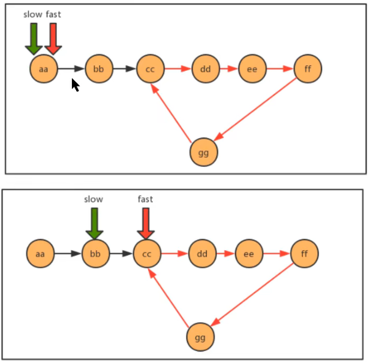

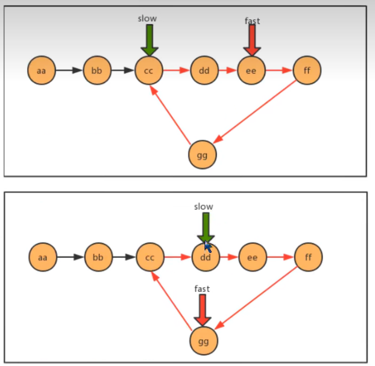

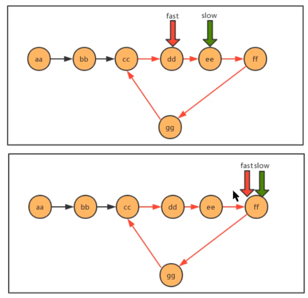

**代码：**

```java
/**
* 判断链表中是否有环
* @param first 链表首结点
* @return ture为有环，false为无环
*/
public static boolean isCircle(Node<String> first) {
    Node<String> slow = first;
    Node<String> fast = first;
    while(fast!=null && fast.next!=null){
        fast = fast.next.next;
        slow = slow.next;
        if (fast.equals(slow)){
            return true;
        }
    }
    return false;
}
```

###### 1.2.5.3有环链表入口问题

同样看下面这段代码，完成需求：

```java
//测试类
public class Test {
    public static void main(String[] args) throws Exception {
        Node<String> first = new Node<String>("aa", null);
        Node<String> second = new Node<String>("bb", null);
        Node<String> third = new Node<String>("cc", null);
        Node<String> fourth = new Node<String>("dd", null);
        Node<String> fifth = new Node<String>("ee", null);
        Node<String> six = new Node<String>("ff", null);
        Node<String> seven = new Node<String>("gg", null);
        //完成结点之间的指向
        first.next = second;
        second.next = third;
        third.next = fourth;
        fourth.next = fifth;
        fifth.next = six;
        six.next = seven;
        //产生环
        seven.next = third;
        //查找环的入口结点
        Node<String> entrance = getEntrance(first);
        System.out.println("first链表中环的入口结点元素为："+entrance.item);
    }
    /**
* 查找有环链表中环的入口结点
* @param first 链表首结点
* @return 环的入口结点
*/
    public static Node getEntrance(Node<String> first) {
        return null;
    }
    //结点类
    private static class Node<T> {
        //存储数据
        T item;
        //下一个结点
        Node next;
        public Node(T item, Node next) {
            this.item = item;
            this.next = next;
        }
    }
}
```

**需求：**

请完善Test类中的getEntrance方法，查找有环链表中环的入口结点。 

当快慢指针相遇时，我们可以判断到链表中有环，这时重新设定一个新指针指向链表的起点，且步长与慢指针一样 为1，则慢指针与“新”指针相遇的地方就是环的入口。证明这一结论牵涉到数论的知识，这里略，只讲实现。

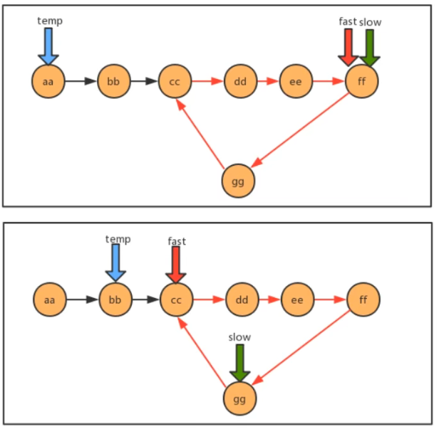

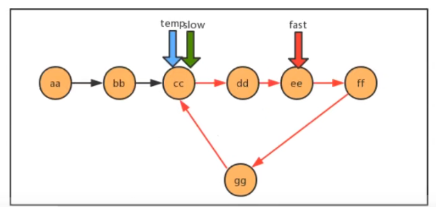

**代码：**

```java
/**
* 查找有环链表中环的入口结点
* @param first 链表首结点
* @return 环的入口结点
*/
public static Node getEntrance(Node<String> first) {
    Node<String> slow = first;
    Node<String> fast = first;
    Node<String> temp = null;
    while(fast!=null && fast.next!=null){
        fast = fast.next.next;
        slow=slow.next;
        if (fast.equals(slow)){
            temp = first;
            continue;
        }
        if (temp!=null){
            temp=temp.next;
            if (temp.equals(slow)){
                return temp;
            }
        }
    }
    return null;
}
```

##### 1.2.6循环链表

循环链表，顾名思义，链表整体要形成一个圆环状。在单向链表中，最后一个节点的指针为null，不指向任何结 点，因为没有下一个元素了。要实现循环链表，我们只需要让单向链表的最后一个节点的指针指向头结点即可。

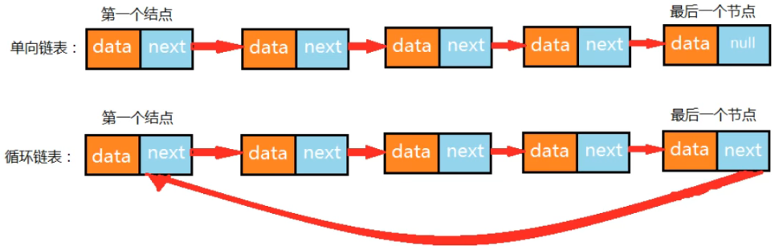

**循环链表的构建：**

```java
public class Test {
    public static void main(String[] args) throws Exception {
        //构建结点
        Node<Integer> first = new Node<Integer>(1, null);
        Node<Integer> second = new Node<Integer>(2, null);
        Node<Integer> third = new Node<Integer>(3, null);
        Node<Integer> fourth = new Node<Integer>(4, null);
        Node<Integer> fifth = new Node<Integer>(5, null);
        Node<Integer> six = new Node<Integer>(6, null);
        Node<Integer> seven = new Node<Integer>(7, null);
        //构建单链表
        first.next = second;
        second.next = third;
        third.next = fourth;
        fourth.next = fifth;
        fifth.next = six;
        six.next = seven;
        //构建循环链表,让最后一个结点指向第一个结点
        seven.next = first;
    }
}
```

##### 1.2.7约瑟夫问题

**问题描述：** 

​        传说有这样一个故事，在罗马人占领乔塔帕特后，39 个犹太人与约瑟夫及他的朋友躲到一个洞中，39个犹太人决 定宁愿死也不要被敌人抓到，于是决定了一个自杀方式，41个人排成一个圆圈，第一个人从1开始报数，依次往 后，如果有人报数到3，那么这个人就必须自杀，然后再由他的下一个人重新从1开始报数，直到所有人都自杀身亡 为止。然而约瑟夫和他的朋友并不想遵从。于是，约瑟夫要他的朋友先假装遵从，他将朋友与自己安排在第16个与 第31个位置，从而逃过了这场死亡游戏 。 

**问题转换：** 

​        41个人坐一圈，第一个人编号为1，第二个人编号为2，第n个人编号为n。 

1. 编号为1的人开始从1报数，依次向后，报数为3的那个人退出圈；

2. 自退出那个人开始的下一个人再次从1开始报数，以此类推；

3. 求出最后退出的那个人的编号。
   
   **图示：**

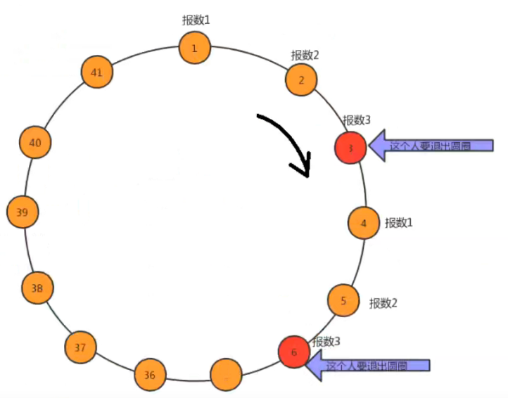

**解题思路：**

    1. 构建含有41个结点的单向循环链表，分别存储1~41的值，分别代表这41个人；
    1. 使用计数器count，记录当前报数的值；
    1. 遍历链表，每循环一次，count++； 
    1. 判断count的值，如果是3，则从链表中删除这个结点并打印结点的值，把count重置为0；

**代码:**

```java
public class Test {
    public static void main(String[] args) throws Exception {
        //1.构建循环链表
        Node<Integer> first = null;
        //记录前一个结点
        Node<Integer> pre = null;
        for (int i = 1; i <= 41; i++) {
            //第一个元素
            if (i==1){
                first = new Node(i,null);
                pre = first;
                continue;
            }
            Node<Integer> node = new Node<>(i,null);
            pre.next = node;
            pre = node;
            if (i==41){
                //构建循环链表，让最后一个结点指向第一个结点
                pre.next=first;
            }
        }
        //2.使用count，记录当前的报数值
        int count=0;
        //3.遍历链表，每循环一次，count++
        Node<Integer> n = first;
        Node<Integer> before = null;
        while(n!=n.next){
            //4.判断count的值，如果是3，则从链表中删除这个结点并打印结点的值，把count重置为0；
            count++;
            if (count==3){
                //删除当前结点
                before.next = n.next;
                System.out.print(n.item+",");
                count=0;
                n = n.next;
            }else{
                before=n;
                n = n.next;
            }
        }
        /*打印剩余的最后那个人*/
        System.out.println(n.item);
    }
}
```

#### 1.3栈

##### 1.3.1 栈概述

###### 1.3.1.1 生活中的栈

存储货物或供旅客住宿的地方,可引申为仓库、中转站 。例如我们现在生活中的酒店，在古时候叫客栈，是供旅客 休息的地方，旅客可以进客栈休息，休息完毕后就离开客栈。


###### 1.3.1.2 计算机中的栈

我们把生活中的栈的概念引入到计算机中，就是供数据休息的地方，它是一种数据结构，数据既可以进入到栈中， 又可以从栈中出去。 

栈是一种基于先进后出(FILO)的数据结构，是一种只能在一端进行插入和删除操作的特殊线性表。它按照先进后出 的原则存储数据，先进入的数据被压入栈底，最后的数据在栈顶，需要读数据的时候从栈顶开始弹出数据（最后一 个数据被第一个读出来）。 

我们称数据进入到栈的动作为压栈，数据从栈中出去的动作为弹栈。

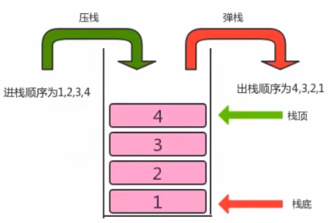

##### 1.3.2 栈的实现

###### 1.3.2.1 栈API设计

| 类名   | Stack<T>                                                                                                                                                  |
| ---- | --------------------------------------------------------------------------------------------------------------------------------------------------------- |
| 构造方法 | Stack)：创建Stack对象                                                                                                                                          |
| 成员方法 | 1.public boolean isEmpty()：判断栈是否为空，是返回true，否返回false <br/>2.public int size():获取栈中元素的个数 <br/>3.public T pop():弹出栈顶元素 <br/>4.public void push(T t)：向栈中压入元素t |
| 成员变量 | 1.private Node head:记录首结点 <br/>2.private int N:当前栈的元素个数                                                                                                   |

###### 1.3.2.2 栈代码实现

```java
//栈代码
import java.util.Iterator;
public class Stack<T> implements Iterable<T>{
    //记录首结点
    private Node head;
    //栈中元素的个数
    private int N;
    public Stack() {
        head = new Node(null,null);
        N=0;
    }
    //判断当前栈中元素个数是否为0
    public boolean isEmpty(){
        return N==0;
    }
    //把t元素压入栈
    public void push(T t){
        Node oldNext = head.next;
        Node node = new Node(t, oldNext);
        head.next = node;
        //个数+1
        N++;
    }
    //弹出栈顶元素
    public T pop(){
        Node oldNext = head.next;
        if (oldNext==null){
            return null;
        }
        //删除首个元素
        head.next = head.next.next;
        //个数-1
        N--;
        return oldNext.item;
    }
    //获取栈中元素的个数
    public int size(){
        return N;
    }
    @Override
    public Iterator<T> iterator() {
        return new SIterator();
    }
    private class SIterator implements Iterator<T>{
        private Node n = head;
        @Override
        public boolean hasNext() {
            return n.next!=null;
        }
        @Override
        public T next() {
            Node node = n.next;
            n = n.next;
            return node.item;
        }
    }
    private class Node{
        public T item;
        public Node next;
        public Node(T item, Node next) {
            this.item = item;
            this.next = next;
        }
    }
}
//测试代码
public class Test {
    public static void main(String[] args) throws Exception {
        Stack<String> stack = new Stack<>();
        stack.push("a");
        stack.push("b");
        stack.push("c");
        stack.push("d");
        for (String str : stack) {
            System.out.print(str+" ");
        }
        System.out.println("-----------------------------");
        String result = stack.pop();
        System.out.println("弹出了元素："+result);
        System.out.println(stack.size());
    }
}
```

##### 1.3.3 案例

###### 1.3.3.1 括号匹配问题

**问题描述:**

```java
给定一个字符串，里边可能包含"()"小括号和其他字符，请编写程序检查该字符串的中的小括号是否成对出现。

例如：
"(上海)(长安)"：正确匹配
"上海((长安))"：正确匹配
"上海(长安(北京)(深圳)南京)":正确匹配
"上海(长安))"：错误匹配
"((上海)长安"：错误匹配
```

**示例代码：**

```java
public class BracketsMatch {
    public static void main(String[] args) {
        String str = "(上海(长安)())";
        boolean match = isMatch(str);
        System.out.println(str+"中的括号是否匹配："+match);
    }
    /**
    * 判断str中的括号是否匹配
    * @param str 括号组成的字符串
    * @return 如果匹配，返回true，如果不匹配，返回false
    */
    public static boolean isMatch(String str){
        return false;
    }
}
```

请完善 isMath方法。

**分析：**

1. 创建一个栈用来存储左括号
2. 从左往右遍历字符串，拿到每一个字符
3. 判断该字符是不是左括号，如果是，放入栈中存储
4. 判断该字符是不是右括号，如果不是，继续下一次循环
5. 如果该字符是右括号，则从栈中弹出一个元素t；
6. 判断元素t是否为null，如果不是，则证明有对应的左括号，如果不是，则证明没有对应的左括号
7. 循环结束后，判断栈中还有没有剩余的左括号，如果有，则不匹配，如果没有，则匹配

```flow
st=>start: 开始
op1=>operation: 创建一个栈对象：Stack chars = new Stack()用来存储左括号
op2=>operation: 从左往右一次遍历字符串，拿到每一个字符
con1=>condition: 判断字符是否是左括号
con2=>condition: 判断字符是否是右括号
op3=>operation: 该字符入栈
op4=>operation: 从chars栈中弹出一个元素t
con3=>condition: 判断栈中弹出的元素t是否为null
con4=>condition: 是否到达字符串的末尾
con5=>condition: 判断栈chars中是否还有左括号
e1=>end: 返回false
e2=>end: 返回true
e3=>end: 返回false

st->op1->op2->con1
con1(yes)->op3
con1(no,bottom)->con2
con2(yes)->op4->con3
con2(no,left)->con1
con3(yes)->e1
con3(no,bottom)->con4
con4(no,left)->con1
con4(yes, bottom)->con5
con5(yes)->e3
con5(no)->e2
```

**代码实现：**

```java
public class BracketsMatch {
    public static void main(String[] args) {
        String str = "(fdafds(fafds)())";
        boolean match = isMatch(str);
        System.out.println(str + "中的括号是否匹配：" + match);
    }
    /**
* 判断str中的括号是否匹配
*
* @param str 括号组成的字符串
* @return 如果匹配，返回true，如果不匹配，返回false
*/
    public static boolean isMatch(String str) {
        //1.创建一个栈用来存储左括号
        Stack<String> chars = new Stack<>();
        //2.从左往右遍历字符串，拿到每一个字符
        for (int i = 0; i < str.length(); i++) {
            String currChar = str.charAt(i) + "";
            //3.判断该字符是不是左括号，如果是，放入栈中存储
            if (currChar.equals("(")) {
                chars.push(currChar);
            } else if (currChar.equals(")")) {//4.判断该字符是不是右括号，如果不是，继续下一次循环
                    //5.如果该字符是右括号，则从栈中弹出一个元素t；
                    String t = chars.pop();
                //6.判断元素t是否为null，如果不是，则证明有对应的左括号，如果不是，则证明没有对应的左括号
                    if (t == null) {
                        return false;
                    }
            }
        }
        //7.循环结束后，判断栈中还有没有剩余的左括号，如果有，则不匹配，如果没有，则匹配
        if (chars.size() == 0) {
            return true;
        } else {
            return false;
        }
    }
}
```

###### 1.3.3.2 逆波兰表达式求值问题

逆波兰表达式求值问题是我们计算机中经常遇到的一类问题，要研究明白这个问题，首先我们得搞清楚什么是逆波 兰表达式？要搞清楚逆波兰表达式，我们得从中缀表达式说起。 

**中缀表达式：** 

​        中缀表达式就是我们平常生活中使用的表达式，例如：1+3*2,2-(1+3)等等，中缀表达式的特点是：二元运算符总 是置于两个操作数中间。 

​        中缀表达式是人们最喜欢的表达式方式，因为简单，易懂。但是对于计算机来说就不是这样了，因为中缀表达式的 运算顺序不具有规律性。不同的运算符具有不同的优先级，如果计算机执行中缀表达式，需要解析表达式语义，做 大量的优先级相关操作。 

**逆波兰表达式(后缀表达式)：** 

​        逆波兰表达式是波兰逻辑学家J・卢卡西维兹(J・ Lukasewicz)于1929年首先提出的一种表达式的表示方法，后缀表 达式的特点：运算符总是放在跟它相关的操作数之后。

| 中缀表达式     | 逆波兰表达式  |
| --------- | ------- |
| a+b       | ab+     |
| a+(b-c)   | abc-+   |
| a+(b-c)*d | abc-d*+ |
| a*(b-c)+d | abc-*d+ |

**需求：** 

​        给定一个只包含加减乘除四种运算的逆波兰表达式的数组表示方式，求出该逆波兰表达式的结果。

```java
public class ReversePolishNotation {
    public static void main(String[] args) {
        //中缀表达式3*（17-15）+18/6的逆波兰表达式如下
        String[] notation = {"3", "17", "15", "-", "*","18", "6","/","+"};
        int result = caculate(notation);
        System.out.println("逆波兰表达式的结果为："+result);
    }
    /**
    * @param notaion 逆波兰表达式的数组表示方式
    * @return 逆波兰表达式的计算结果
    */
    public static int caculate(String[] notaion){
        return -1;
    }
}
```

完善caculate方法，计算出逆波兰表达式的结果。

**分析：**

1. 创建一个栈对象oprands存储操作数
2. 从左往右遍历逆波兰表达式，得到每一个字符串
3. 判断该字符串是不是运算符，如果不是，把该该操作数压入oprands栈中
4. 如果是运算符，则从oprands栈中弹出两个操作数o1,o2
5. 使用该运算符计算o1和o2，得到结果result
6. 把该结果压入oprands栈中
7. 遍历结束后，拿出栈中最终的结果返回

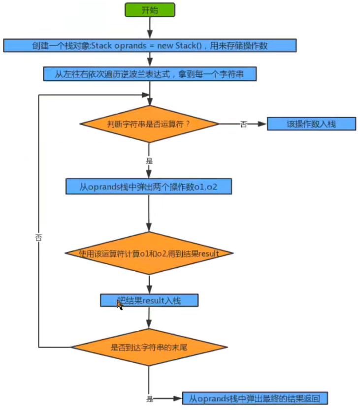

**代码实现：**

```java
public class ReversePolishNotation {
    public static void main(String[] args) {
        //中缀表达式3*（17-15）+18/6的逆波兰表达式如下
        String[] notation = {"3", "17", "15", "-", "*", "18", "6", "/", "+"};
        int result = caculate(notation);
        System.out.println("逆波兰表达式的结果为：" + result);
    }
    /**
* @param notaion 逆波兰表达式的数组表示方式
* @return 逆波兰表达式的计算结果
*/
    public static int caculate(String[] notaion) {
        //1.创建一个栈对象oprands存储操作数
        Stack<Integer> oprands = new Stack<>();
        //2.从左往右遍历逆波兰表达式，得到每一个字符串
        for (int i = 0; i < notaion.length; i++) {
            String curr = notaion[i];
            //3.判断该字符串是不是运算符，如果不是，把该该操作数压入oprands栈中
            Integer o1;
            Integer o2;
            Integer result;
            switch (curr) {
                case "+":
                    //4.如果是运算符，则从oprands栈中弹出两个操作数o1,o2
                    o1 = oprands.pop();
                    o2 = oprands.pop();
                    //5.使用该运算符计算o1和o2，得到结果result
                    result = o2 + o1;
                    //6.把该结果压入oprands栈中
                    oprands.push(result);
                    break;
                case "-":
                    //4.如果是运算符，则从oprands栈中弹出两个操作数o1,o2
                    o1 = oprands.pop();
                    o2 = oprands.pop();
                    //5.使用该运算符计算o1和o2，得到结果result
                    result = o2 - o1;
                    //6.把该结果压入oprands栈中
                    oprands.push(result);
                    break;
                case "*":
                    //4.如果是运算符，则从oprands栈中弹出两个操作数o1,o2
                    o1 = oprands.pop();
                    o2 = oprands.pop();
                    //5.使用该运算符计算o1和o2，得到结果result
                    result = o2 * o1;
                    //6.把该结果压入oprands栈中
                    oprands.push(result);
                    break;
                case "/":
                    //4.如果是运算符，则从oprands栈中弹出两个操作数o1,o2
                    o1 = oprands.pop();
                    o2 = oprands.pop();
                    //5.使用该运算符计算o1和o2，得到结果result
                    result = o2 / o1;
                    //6.把该结果压入oprands栈中
                    oprands.push(result);
                    break;
                default:
                    oprands.push(Integer.parseInt(curr));
                    break;
            }
        }
        //7.遍历结束后，拿出栈中最终的结果返回
        Integer result = oprands.pop();
        return result;
    }
}
```

#### 1.4 队列

队列是一种基于先进先出(FIFO)的数据结构，是一种只能在一端进行插入,在另一端进行删除操作的特殊线性表，它 按照先进先出的原则存储数据，先进入的数据，在读取数据时先读被读出来。

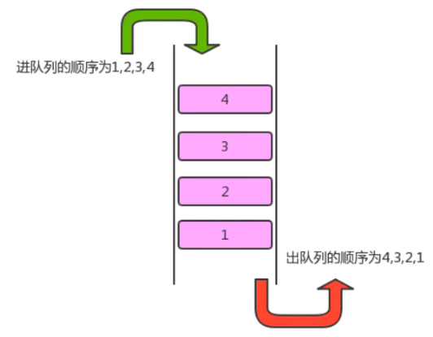

##### 1.4.1 队列的API设计

| 类名   | Queue<T>                                                                                                                                                                 |
| ---- | ------------------------------------------------------------------------------------------------------------------------------------------------------------------------ |
| 构造方法 | Queue()：创建Queue对象                                                                                                                                                        |
| 成员方法 | 1.public boolean isEmpty()：判断队列是否为空，是返回true，否返回false <br/>2.public int size():获取队列中元素的个数 <br/>3.public T dequeue():从队列中拿出一个元素 <br/>4.public void enqueue(T t)：往队列中插入一个元素 |
| 成员变量 | 1.private Node head:记录首结点 <br/>2.private int N:当前栈的元素个数 <br/>3.private Node last:记录最后一个结点                                                                                |

##### 1.4.2 队列的实现

```java
//队列代码
import java.util.Iterator;
public class Queue<T> implements Iterable<T>{
    //记录首结点
    private Node head;
    //记录最后一个结点
    private Node last;
    //记录队列中元素的个数
    private int N;
    public Queue() {
        head = new Node(null,null);
        last=null;
        N=0;
    }
    //判断队列是否为空
    public boolean isEmpty(){
        return N==0;
    }
    //返回队列中元素的个数
    public int size(){
        return N;
    }
    //向队列中插入元素t
    public void enqueue(T t){
        if (last==null){
            last = new Node(t,null);
            head.next=last;
        }else{
            Node oldLast = last;
            last = new Node(t,null);
            oldLast.next=last;
        }
        //个数+1
        N++;
    }
    //从队列中拿出一个元素
    public T dequeue(){
        if (isEmpty()){
            return null;
        }
        Node oldFirst = head.next;
        head.next = oldFirst.next;
        N--;
        if (isEmpty()){
            last=null;
        }
        return oldFirst.item;
    }
    @Override
    public Iterator<T> iterator() {
        return new QIterator();
    }
    private class QIterator implements Iterator<T>{
        private Node n = head;
        @Override
        public boolean hasNext() {
            return n.next!=null;
        }
        @Override
        public T next() {
            Node node = n.next;
            n = n.next;
            return node.item;
        }
    }
    private class Node{
        public T item;
        public Node next;
        public Node(T item, Node next) {
            this.item = item;
            this.next = next;
        }
    }
}
//测试代码
public class Test {
    public static void main(String[] args) throws Exception {
        Queue<String> queue = new Queue<>();
        queue.enqueue("a");
        queue.enqueue("b");
        queue.enqueue("c");
        queue.enqueue("d");
        for (String str : queue) {
            System.out.print(str+" ");
        }
        System.out.println("-----------------------------");
        String result = queue.dequeue();
        System.out.println("出列了元素："+result);
        System.out.println(queue.size());
    }
}
```
