### 二叉树入门

之前我们实现的符号表中，不难看出，符号表的增删查操作，随着元素个数N的增多，其耗时也是线性增多的，时
间复杂度都是O(n),为了提高运算效率，接下来我们学习树这种数据结构。  

#### 1.1树的基本定义

树是我们计算机中非常重要的一种数据结构，同时使用树这种数据结构，可以描述现实生活中的很多事物，例如家
谱、单位的组织架构、等等。

树是由n（n>=1）个有限结点组成一个具有层次关系的集合。把它叫做“树”是因为它看起来像一棵倒挂的树，也就
是说它是根朝上，而叶朝下的。  

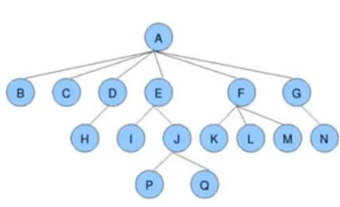

树具有以下特点：
    1. 每个结点有零个或多个子结点；
     2. 没有父结点的结点为根结点；
     3. 每一个非根结点只有一个父结点；
     4. 每个结点及其后代结点整体上可以看做是一棵树，称为当前结点的父结点的一个子树；  

#### 1.2 树的相关术语

**结点的度：**

​        一个结点含有的子树的个数称为该结点的度；

**叶结点：**

​        度为0的结点称为叶结点，也可以叫做终端结点

**分支结点：**

​        度不为0的结点称为分支结点，也可以叫做非终端结点

**结点的层次：**

​        从根结点开始，根结点的层次为1，根的直接后继层次为2，以此类推

**结点的层序编号：**  

​        将树中的结点，按照从上层到下层，同层从左到右的次序排成一个线性序列，把他们编成连续的自然数。  

**树的度：**

​        树中所有结点的度的最大值

**树的高度(深度)：**

​        树中结点的最大层次

**森林：**

​        m（m>=0）个互不相交的树的集合，将一颗非空树的根结点删去，树就变成一个森林；给森林增加一个统一的根
结点，森林就变成一棵树  

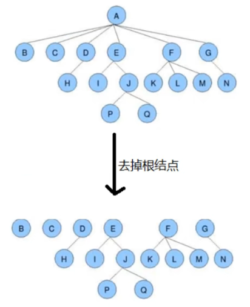

**孩子结点：**

​        一个结点的直接后继结点称为该结点的孩子结点

**双亲结点(父结点)：**

​        一个结点的直接前驱称为该结点的双亲结点

**兄弟结点：**

​        同一双亲结点的孩子结点间互称兄弟结点  

#### 1.3 二叉树的基本定义

二叉树就是度不超过2的树(每个结点最多有两个子结点)  

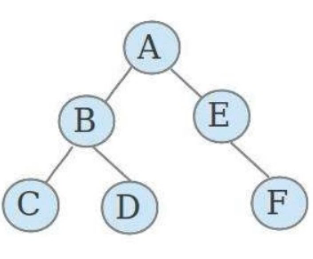

**满二叉树：**  

​        一个二叉树，如果每一个层的结点数都达到最大值，则这个二叉树就是满二叉树  

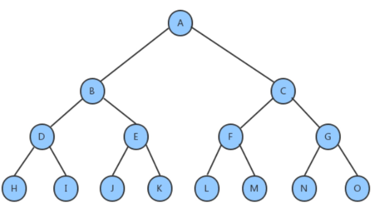

**完全二叉树：**  

​        叶节点只能出现在最下层和次下层，并且最下面一层的结点都集中在该层最左边的若干位置的二叉树  

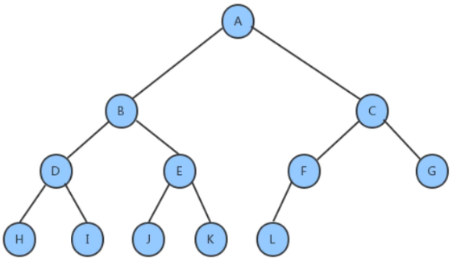

#### 1.4 二叉查找树的创建

##### 1.4.1二叉树的结点类

根据对图的观察，我们发现二叉树其实就是由一个一个的结点及其之间的关系组成的，按照面向对象的思想，我们设计一个结点类来描述结点这个事物。  

**结点类API设计：**  

| 类名   | Node<Key,Value>                                                                                                |
| ---- | -------------------------------------------------------------------------------------------------------------- |
| 构造方法 | Node(Key key, Value value, Node left, Node right)：创建Node对象                                                     |
| 成员变量 | 1.public Node left:记录左子结点<br/>2.public Node right:记录右子结点<br/>3.public Key key:存储键<br/>4.public Value value:存储值 |

**代码实现：**  

```java
private class Node<Key,Value>{
    //存储键
    public Key key;
    //存储值
    private Value value;
    //记录左子结点
    public Node left;
    //记录右子结点
    public Node right;
    public Node(Key key, Value value, Node left, Node right) {
        this.key = key;
        this.value = value;
        this.left = left;
        this.right = right;
    }
}
```

##### 1.4.2 二叉查找树API设计

| 类名   | BinaryTree<Key extends Comparable<Key>,Value value>                                                                                                                                                                                                                                                                                                                                                              |
| ---- | ---------------------------------------------------------------------------------------------------------------------------------------------------------------------------------------------------------------------------------------------------------------------------------------------------------------------------------------------------------------------------------------------------------------- |
| 构造方法 | BinaryTree()：创建BinaryTree对象                                                                                                                                                                                                                                                                                                                                                                                      |
| 成员变量 | 1.private Node root:记录根结点<br/>2.private int N:记录树中元素的个数                                                                                                                                                                                                                                                                                                                                                          |
| 成员方法 | 1. public void put(Key key,Value value):向树中插入一个键值对<br/>2.private Node put(Node x, Key key, Value val)：给指定树x上，添加键一个键值对，并返回添<br/>加后的新树<br/>3.public Value get(Key key):根据key，从树中找出对应的值<br/>4.private Value get(Node x, Key key):从指定的树x中，找出key对应的值<br/>5.public void delete(Key key):根据key，删除树中对应的键值对<br/>6.private Node delete(Node x, Key key):删除指定树x上的键为key的键值对，并返回删除后的<br/>新树<br/>7.public int size():获取树中元素的个数 |

##### 1.4.3 二叉查找树实现

**插入方法put实现思想：**

1. 如果当前树中没有任何一个结点，则直接把新结点当做根结点使用
2. 如果当前树不为空，则从根结点开始：
   1. 如果新结点的key小于当前结点的key，则继续找当前结点的左子结点；
   2. 如果新结点的key大于当前结点的key，则继续找当前结点的右子结点；
   3. 如果新结点的key等于当前结点的key，则树中已经存在这样的结点，替换该结点的value值即可。  


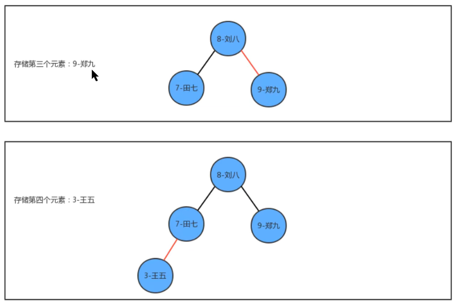

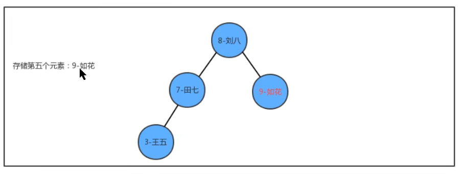

**查询方法get实现思想：**

从根节点开始：

1. 如果要查询的key小于当前结点的key，则继续找当前结点的左子结点；
2. 如果要查询的key大于当前结点的key，则继续找当前结点的右子结点；
3. 如果要查询的key等于当前结点的key，则树中返回当前结点的value。  

**删除方法delete实现思想：**

1. 找到被删除结点；
2. 找到被删除结点右子树中的最小结点minNode
3. 删除右子树中的最小结点
4. 让被删除结点的左子树称为最小结点minNode的左子树，让被删除结点的右子树称为最小结点minNode的右子树
5. 让被删除结点的父节点指向最小结点minNode  

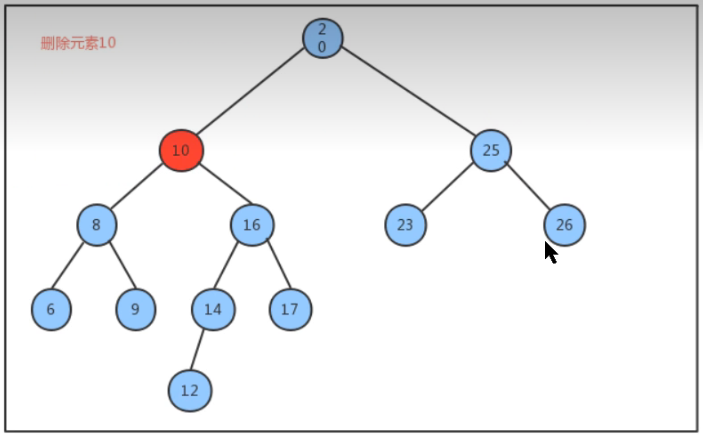

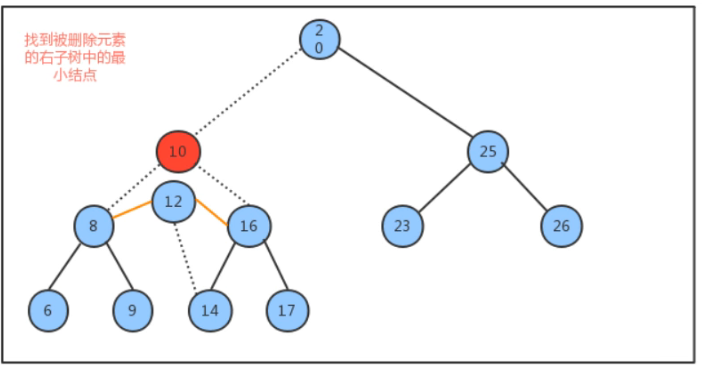

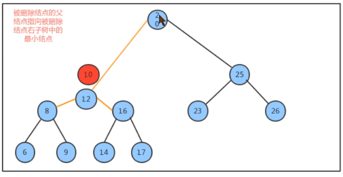

**代码：**  

```java
//二叉树代码
public class BinaryTree<Key extends Comparable<Key>, Value> {
    //记录根结点
    private Node root;
    //记录树中元素的个数
    private int N;
    //获取树中元素的个数
    public int size() {
        return N;
    } 
    //向树中添加元素key-value
    public void put(Key key, Value value) {
        root = put(root, key, value);
    } 
    //向指定的树x中添加key-value,并返回添加元素后新的树
    private Node put(Node x, Key key, Value value) {
        if (x == null) {
            //个数+1
            N++;
            return new Node(key, value, null, null);
        } 
        int cmp = key.compareTo(x.key);
        if (cmp > 0) {
            //新结点的key大于当前结点的key，继续找当前结点的右子结点
            x.right = put(x.right, key, value);
        } else if (cmp < 0) {
            //新结点的key小于当前结点的key，继续找当前结点的左子结点
            x.left = put(x.left, key, value);
        } else {
            //新结点的key等于当前结点的key，把当前结点的value进行替换
            x.value = value;
        } 
        return x;
    } 
    //查询树中指定key对应的value
    public Value get(Key key) {
        return get(root, key);
    } 
    //从指定的树x中，查找key对应的值
    public Value get(Node x, Key key) {
        if (x == null) {
            return null;
        } 
        int cmp = key.compareTo(x.key);
        if (cmp > 0) {
            //如果要查询的key大于当前结点的key，则继续找当前结点的右子结点；
            return get(x.right, key);
        } else if (cmp < 0) {
            //如果要查询的key小于当前结点的key，则继续找当前结点的左子结点；
            return get(x.left, key);
        } else {
            //如果要查询的key等于当前结点的key，则树中返回当前结点的value。
            return x.value;
        }
    } 
    //删除树中key对应的value
    public void delete(Key key) {
        root = delete(root, key);
    } 
    //删除指定树x中的key对应的value，并返回删除后的新树
    public Node delete(Node x, Key key) {
        if (x == null) {
            return null;
        } 
        int cmp = key.compareTo(x.key);
        if (cmp > 0) {
            //新结点的key大于当前结点的key，继续找当前结点的右子结点
            x.right = delete(x.right, key);
        } else if (cmp < 0) {
            //新结点的key小于当前结点的key，继续找当前结点的左子结点
            x.left = delete(x.left, key);
        } else {
             //个数-1
            N--;
            //新结点的key等于当前结点的key,当前x就是要删除的结点
            //1.如果当前结点的右子树不存在，则直接返回当前结点的左子结点
            if (x.right == null) {
                return x.left;
            } 
            //2.如果当前结点的左子树不存在，则直接返回当前结点的右子结点
            if (x.left == null) {
                return x.right;
            } 
            //3.当前结点的左右子树都存在
            //3.1找到右子树中最小的结点
            Node minNode = x.right;
            while (minNode.left != null) {
                minNode = minNode.left;
            } 
            //3.2删除右子树中最小的结点
            Node n = x.right;
            while (n.left != null) {
                if (n.left.left == null) {
                    n.left = null;
                } else {
                    n = n.left;
                }
            } 
            //3.3让被删除结点的左子树称为最小结点minNode的左子树，让被删除结点的右子树称为最小结点minNode的右子树
            minNode.left = x.left;
            minNode.right = x.right;
            //3.4让被删除结点的父节点指向最小结点minNode
            x = minNode;

        } 
        return x;
    } 
    private class Node {
        //存储键
        public Key key;
        //存储值
        private Value value;
        //记录左子结点
        public Node left;
        //记录右子结点
        public Node right;
        public Node(Key key, Value value, Node left, Node right) {
            this.key = key;
            this.value = value;
            this.left = left;
            this.right = right;
        }
    }
} 
//测试代码
public class Test {
    public static void main(String[] args) throws Exception {
        BinaryTree<Integer, String> bt = new BinaryTree<>();
        bt.put(4, "二哈");
        bt.put(1, "张三");
        bt.put(3, "李四");
        bt.put(5, "王五");
        System.out.println(bt.size());
        bt.put(1,"老三");
        System.out.println(bt.get(1));
        System.out.println(bt.size());
        bt.delete(1);
        System.out.println(bt.size());
    }
}
```

##### 1.4.4 二叉查找树其他便捷方法

###### 1.4.4.1 查找二叉树中最小的键

在某些情况下，我们需要查找出树中存储所有元素的键的最小值，比如我们的树中存储的是学生的排名和姓名数据，那么需要查找出排名最低是多少名？这里我们设计如下两个方法来完成：  

| public Key min()         | 找出树中最小的键         |
| ------------------------ | ---------------- |
| private Node min(Node x) | 找出指定树x中，最小键所在的结点 |

```java
//找出整个树中最小的键
public Key min(){
    return min(root).key;
} 
//找出指定树x中最小的键所在的结点
private Node min(Node x){
    if (x.left!=null){
        return min(x.left);
    }else{
        return x;
    }
}
```

###### 1.4.4.2 查找二叉树中最大的键

在某些情况下，我们需要查找出树中存储所有元素的键的最大值，比如比如我们的树中存储的是学生的成绩和学生的姓名，那么需要查找出最高的分数是多少？这里我们同样设计两个方法来完成：  

| public Key max()        | 找出树中最大的键         |
| ----------------------- | ---------------- |
| public Node max(Node x) | 找出指定树x中，最大键所在的结点 |

```java
//找出整个树中最大的键
public Key max(){
    return max(root).key;
} 
//找出指定树x中最大键所在的结点
public Node max(Node x){
    if (x.right!=null){
        return max(x.right);
    }else{
        return x;
    }
}
```

#### 1.5 二叉树的基础遍历

很多情况下，我们可能需要像遍历数组数组一样，遍历树，从而拿出树中存储的每一个元素，由于树状结构和线性结构不一样，它没有办法从头开始依次向后遍历，所以存在如何遍历，也就是按照什么样的**搜索路径**进行遍历的问题。  

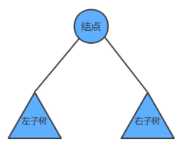

我们把树简单的画作上图中的样子，由一个根节点、一个左子树、一个右子树组成，那么按照根节点什么时候被访问，我们可以把二叉树的遍历分为以下三种方式：

1. 前序遍历；
   先访问根结点，然后再访问左子树，最后访问右子树
2. 中序遍历；
   先访问左子树，中间访问根节点，最后访问右子树
3. 后序遍历；
   先访问左子树，再访问右子树，最后访问根节点

如果我们分别对下面的树使用三种遍历方式进行遍历，得到的结果如下：  

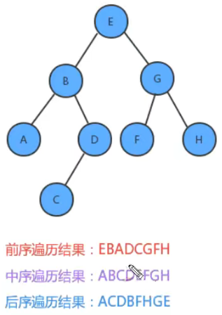

##### 1.5.1 前序遍历

我们在4.4中创建的树上，添加前序遍历的API：

```java
public Queue<Key> preErgodic()：使用前序遍历，获取整个树中的所有键
private void preErgodic(Node x,Queue<Key> keys)：使用前序遍历，把指定树x中的所有键放入到keys队列中
```

实现过程中，我们通过前序遍历，把,把每个结点的键取出，放入到队列中返回即可。  

**实现步骤：**

1. 把当前结点的key放入到队列中;
2. 找到当前结点的左子树，如果不为空，递归遍历左子树
3. 找到当前结点的右子树，如果不为空，递归遍历右子树

**代码：**

```java
//使用前序遍历，获取整个树中的所有键
public Queue<Key> preErgodic(){
    Queue<Key> keys = new Queue<>();
    preErgodic(root,keys);
    return keys;
} 
//使用前序遍历，把指定树x中的所有键放入到keys队列中
private void preErgodic(Node x,Queue<Key> keys){
    if (x==null){
        return;
    }
    //1.把当前结点的key放入到队列中;
    keys.enqueue(x.key);
    //2.找到当前结点的左子树，如果不为空，递归遍历左子树
    if (x.left!=null){
        preErgodic(x.left,keys);
    } 
    //3.找到当前结点的右子树，如果不为空，递归遍历右子树
    if (x.right!=null){
        preErgodic(x.right,keys);
    }
} 
//测试代码
public class Test {
    public static void main(String[] args) throws Exception {
        BinaryTree<String, String> bt = new BinaryTree<>();
        bt.put("E", "5");
        bt.put("B", "2");
        bt.put("G", "7");
        bt.put("A", "1");
        bt.put("D", "4");
        bt.put("F", "6");
        bt.put("H", "8");
        bt.put("C", "3");
        Queue<String> queue = bt.preErgodic();
        for (String key : queue) {
            System.out.println(key+"="+bt.get(key));
        }
    }
}
```

##### 1.5.2 中序遍历

我们在4.4中创建的树上，添加前序遍历的API：

```java
public Queue<Key> midErgodic()：使用中序遍历，获取整个树中的所有键
private void midErgodic(Node x,Queue<Key> keys)：使用中序遍历，把指定树x中的所有键放入到keys队列中  
```

**实现步骤：**  

1. 找到当前结点的左子树，如果不为空，递归遍历左子树
2. 把当前结点的key放入到队列中;
3. 找到当前结点的右子树，如果不为空，递归遍历右子树  

**代码：**  

```java
//使用中序遍历，获取整个树中的所有键
public Queue<Key> midErgodic(){
    Queue<Key> keys = new Queue<>();
    midErgodic(root,keys);
    (x==null){
        return;
    } 
    //1.找到当前结点的左子树，如果不为空，递归遍历左子树
    if (x.left!=null){
        midErgodic(x.left,keys);
    } 
    //2.把当前结点的key放入到队列中;
    keys.enqueue(x.key);
    //3.找到当前结点的右子树，如果不为空，递归遍历右子树
    if (x.right!=null){
        midErgodic(x.right,keys);
    }
}
//测试代码
public class Test {
    public static void main(String[] args) throws Exception {
        BinaryTree<String, String> bt = new BinaryTree<>();
        bt.put("E", "5");
        bt.put("B", "2");
        bt.put("G", "7");
        bt.put("A", "1");
        bt.put("D", "4");
        bt.put("F", "6");
        bt.put("H", "8");
        bt.put("C", "3");
        Queue<String> queue = bt.midErgodic();
        for (String key : queue) {
            System.out.println(key+"="+bt.get(key));
        }
    }
}
```

##### 1.5.3 后序遍历

我们在4.4中创建的树上，添加前序遍历的API：  

```java
public Queue<Key> afterErgodic()：使用后序遍历，获取整个树中的所有键
private void afterErgodic(Node x,Queue<Key> keys)：使用后序遍历，把指定树x中的所有键放入到keys队列中
```

**实现步骤：**  

1. 找到当前结点的左子树，如果不为空，递归遍历左子树
2. 找到当前结点的右子树，如果不为空，递归遍历右子树
3. 把当前结点的key放入到队列中;  

**代码：**  

```java
//使用后序遍历，获取整个树中的所有键
public Queue<Key> afterErgodic(){
    Queue<Key> keys = new Queue<>();
    afterErgodic(root,keys);
    return keys;
} 
//使用后序遍历，把指定树x中的所有键放入到keys队列中
private void afterErgodic(Node x,Queue<Key> keys){
    if (x==null){
        return;
    } 
    //1.找到当前结点的左子树，如果不为空，递归遍历左子树
    if (x.left!=null){
        afterErgodic(x.left,keys);
    } 
    //2.找到当前结点的右子树，如果不为空，递归遍历右子树
    if (x.right!=null){
        afterErgodic(x.right,keys);
    } 
    //3.把当前结点的key放入到队列中;
    keys.enqueue(x.key);
} 
//测试代码
public class Test {
    public static void main(String[] args) throws Exception {
        BinaryTree<String, String> bt = new BinaryTree<>();
        bt.put("E", "5");
        bt.put("B", "2");
        bt.put("G", "7");
        bt.put("A", "1");
        bt.put("D", "4");
        bt.put("F", "6");
        bt.put("H", "8");
        bt.put("C", "3");
        Queue<String> queue = bt.afterErgodic();
        for (String key : queue) {
            System.out.println(key+"="+bt.get(key));
        }
    }
}
```

#### 1.6 二叉树的层序遍历

所谓的层序遍历，就是从根节点（第一层）开始，依次向下，获取每一层所有结点的值，有二叉树如下：  

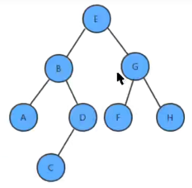

那么层序遍历的结果是：EBGADFHC

我们在4.4中创建的树上，添加层序遍历的API：  

```mariadb
public Queue<Key> layerErgodic()：使用层序遍历，获取整个树中的所有键
```

**实现步骤：**

1. 创建队列，存储每一层的结点；

2. 使用循环从队列中弹出一个结点：
   
   1. 获取当前结点的key；
   2. 如果当前结点的左子结点不为空，则把左子结点放入到队列中
   3. 如果当前结点的右子结点不为空，则把右子结点放入到队列中  
   
   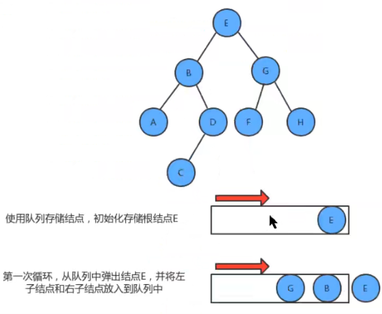
   
   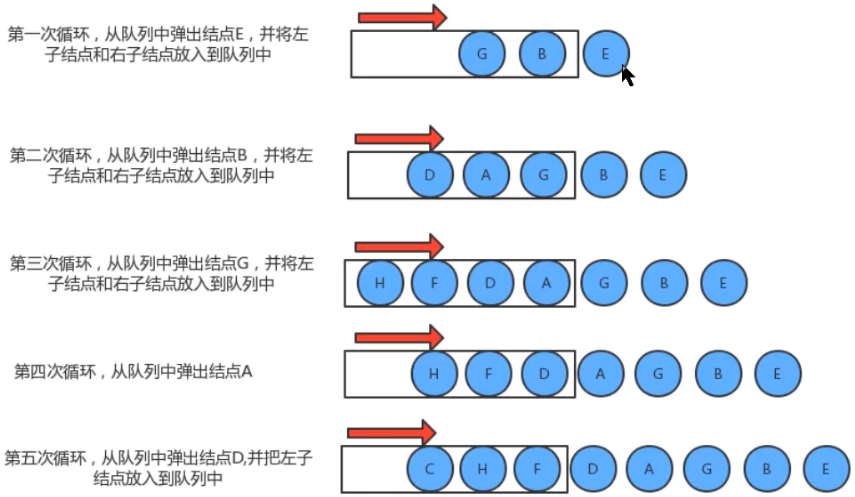
   
   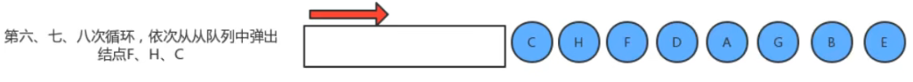

**代码：**  

```java
//使用层序遍历得到树中所有的键
public Queue<Key> layerErgodic(){
    Queue<Key> keys = new Queue<>();
    Queue<Node> nodes = new Queue<>();
    nodes.enqueue(root);
    while(!nodes.isEmpty()){
        Node x = nodes.dequeue();
        keys.enqueue(x.key);
        if (x.left!=null){
            nodes.enqueue(x.left);
        } 

        if (x.right!=null){
            nodes.enqueue(x.right);
        }
    }
    return keys;
}
//测试代码
public class Test {
    public static void main(String[] args) throws Exception {
        BinaryTree<String, String> bt = new BinaryTree<>();
        bt.put("E", "5");
        bt.put("B", "2");
        bt.put("G", "7");
        bt.put("A", "1");
        bt.put("D", "4");
        bt.put("F", "6");
        bt.put("H", "8");
        bt.put("C", "3");
        Queue<String> queue = bt.layerErgodic();
        for (String key : queue) {
            System.out.println(key+"="+bt.get(key));
        }
    }
}
```

#### 1.7 二叉树的最大深度问题

**需求：**  

给定一棵树，请计算树的最大深度（树的根节点到最远叶子结点的最长路径上的结点数）;  

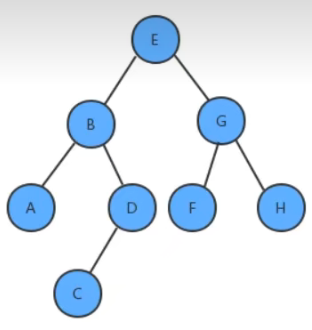

上面这棵树的最大深度为4。  

**实现：**  

我们在1.4中创建的树上，添加如下的API求最大深度：  

```markdown
public int maxDepth()：计算整个树的最大深度
private int maxDepth(Node x):计算指定树x的最大深度
```

**实现步骤：**

1. 如果根结点为空，则最大深度为0；
2. 计算左子树的最大深度；
3. 计算右子树的最大深度；
4. 当前树的最大深度=左子树的最大深度和右子树的最大深度中的较大者+1  

**代码：**  

```java
//计算整个树的最大深度
public int maxDepth() {
    return maxDepth(root);
} 
//计算指定树x的最大深度
private int maxDepth(Node x) {
    //1.如果根结点为空，则最大深度为0；
    if (x == null) {
        return 0;
    } 
    int max = 0;
    int maxL = 0;
    int maxR = 0;
    //2.计算左子树的最大深度；
    if (x.left != null) {
        maxL = maxDepth(x.left);
    } 
    //3.计算右子树的最大深度；
    if (x.right != null) {
        maxR = maxDepth(x.right);
    } 
    //4.当前树的最大深度=左子树的最大深度和右子树的最大深度中的较大者+1
    max = maxL > maxR ? maxL + 1 : maxR + 1;
    return max;
} 
//测试代码
public class Test {
    public static void main(String[] args) throws Exception {
        BinaryTree<String, String> bt = new BinaryTree<>();
        bt.put("E", "5");
        bt.put("B", "2");
        bt.put("G", "7");
        bt.put("A", "1");
        bt.put("D", "4");
        bt.put("F", "6");
        bt.put("H", "8");
        bt.put("C", "3");
        int i = bt.maxDepth();
        System.out.println(i);
    }
}
```

#### 1.8 折纸问题

**需求：**

请把一段纸条竖着放在桌子上，然后从纸条的下边向上方对折1次，压出折痕后展开。此时 折痕是凹下去的，即折痕突起的方向指向纸条的背面。如果从纸条的下边向上方连续对折2 次，压出折痕后展开，此时有三条折痕，从上到下依次是下折痕、下折痕和上折痕。

给定一 个输入参数N，代表纸条都从下边向上方连续对折N次，请从上到下打印所有折痕的方向 例如：N=1时，打印： down；N=2时，打印： down down up  

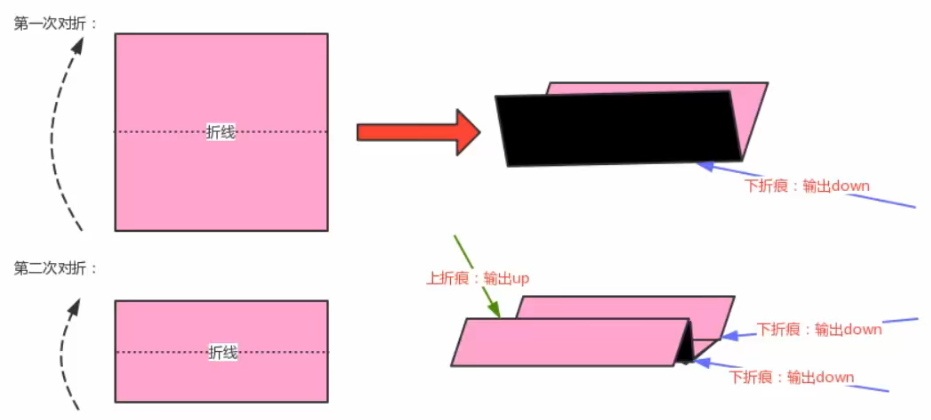

**分析：**

我们把对折后的纸张翻过来，让粉色朝下，这时把第一次对折产生的折痕看做是根结点，那第二次对折产生的下折痕就是该结点的左子结点，而第二次对折产生的上折痕就是该结点的右子结点，这样我们就可以使用树型数据结构来描述对折后产生的折痕。

这棵树有这样的特点：

1. 根结点为下折痕；
2. 每一个结点的左子结点为下折痕；
3. 每一个结点的右子结点为上折痕；  

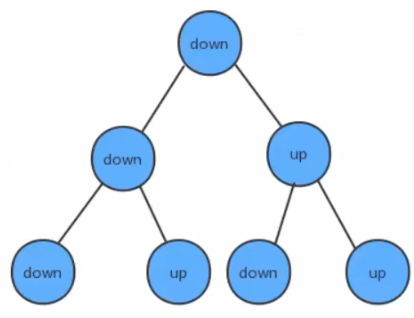

**实现步骤：**

1. 定义结点类
2. 构建深度为N的折痕树；
3. 使用中序遍历，打印出树中所有结点的内容；

**构建深度为N的折痕树：**

1. 第一次对折，只有一条折痕，创建根结点；
2. 如果不是第一次对折，则使用队列保存根结点；
3. 循环遍历队列：
   1. 从队列中拿出一个结点；
   2. 如果这个结点的左子结点不为空，则把这个左子结点添加到队列中；
   3. 如果这个结点的右子结点不为空，则把这个右子结点添加到队列中；
   4. 判断当前结点的左子结点和右子结点都不为空，如果是，则需要为当前结点创建一个值为down的左子结点，一个值为up的右子结点。  

**代码：**  

```java
public class PaperFolding {
    public static void main(String[] args) {
        //构建折痕树
        Node tree = createTree(3);
        //遍历折痕树，并打印
        printTree(tree);
    } 
    //3.使用中序遍历，打印出树中所有结点的内容；
    private static void printTree(Node tree) {
        if (tree==null){
            return;
        } 
        printTree(tree.left);
        System.out.print(tree.item+",");
        printTree(tree.right);
    } 
    //2.构建深度为N的折痕树；
    private static Node createTree(int N) {
        Node root = null;
        for (int i = 0; i <N ; i++) {
            if (i==0){
                //1.第一次对折，只有一条折痕，创建根结点；
                root = new Node("down",null,null);    
            }else{
                //2.如果不是第一次对折，则使用队列保存根结点；
                Queue<Node> queue = new Queue<>();
                queue.enqueue(root);
                //3.循环遍历队列：
                while(!queue.isEmpty()){
                    //3.1从队列中拿出一个结点；
                    Node tmp = queue.dequeue();
                    //3.2如果这个结点的左子结点不为空，则把这个左子结点添加到队列中；
                    if (tmp.left!=null){
                        queue.enqueue(tmp.left);
                    } 
                    //3.3如果这个结点的右子结点不为空，则把这个右子结点添加到队列中；
                    if (tmp.right!=null){
                        queue.enqueue(tmp.right);
                    } 
                    //3.4判断当前结点的左子结点和右子结点都不为空，如果是，则需要为当前结点创建一个值为down的左子结点，一个值为up的右子结点。
                    if (tmp.left==null && tmp.right==null){
                        tmp.left = new Node("down",null,null);
                        tmp.right = new Node("up",null,null);
                    }
                }
            }
        } 
        return root;
    } 
    //1.定义结点类
    private static class Node{
        //存储结点元素
        String item;
        //左子结点
        Node left;
        //右子结点
        Node right;
        public Node(String item, Node left, Node right) {
            this.item = item;
            this.left = left;
            this.right = right;
        }
    }
}
```
