### 图的入门

#### 1.1 图的实际应用

​        在现实生活中，有许多应用场景会包含很多点以及点点之间的连接，而这些应用场景我们都可以用即将要学习的图这种数据结构去解决。

**地图：**

​        我们生活中经常使用的地图，基本上是由城市以及连接城市的道路组成，如果我们把城市看做是一个一个的点，把道路看做是一条一条的连接，那么地图就是我们将要学习的图这种数据结构。  

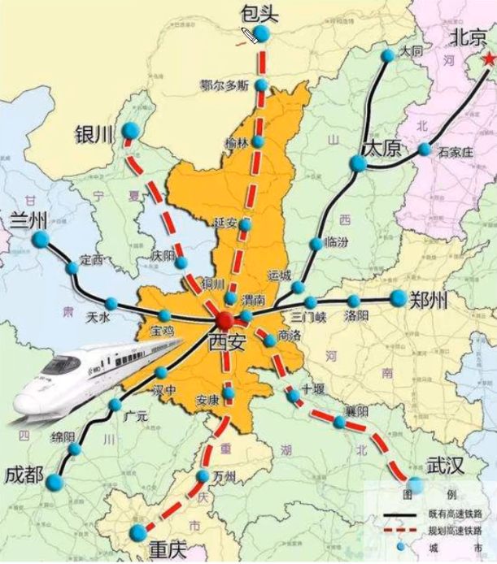

**电路图：**  

​        下面是一个我们生活中经常见到的集成电路板，它其实就是由一个一个触点组成，并把触点与触点之间通过线进行连接，这也是我们即将要学习的图这种数据结构的应用场景  


#### 1.2 图的定义及分类

**定义：** 图是由一组顶点和一组能够将两个顶点相连的边组成的 集合

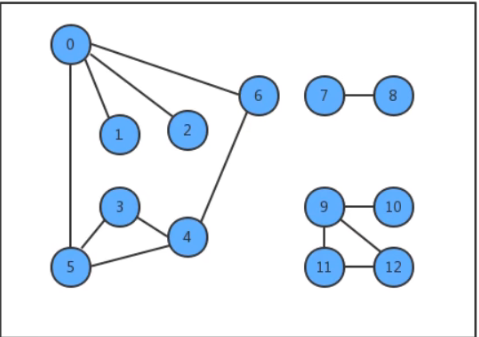

**特殊的图：**  

1. 自环：即一条连接一个顶点和其自身的边；
2. 平行边：连接同一对顶点的两条边；  

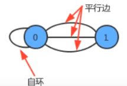

**图的分类：**        

按照连接两个顶点的边的不同，可以把图分为以下两种：

1. 无向图：边仅仅连接两个顶点，没有其他含义；
2. 有向图：边不仅连接两个顶点，并且具有方向；  

#### 1.3 无向图

##### 1.3.1 图的相关术语

**相邻顶点：**

​        当两个顶点通过一条边相连时，我们称这两个顶点是相邻的，并且称这条边依附于这两个顶点。

**度：**

​        某个顶点的度就是依附于该顶点的边的个数

**子图：**

​        是一幅图的所有边的子集(包含这些边依附的顶点)组成的图；

**路径：**

​        是由边顺序连接的一系列的顶点组成

**环：**

​        是一条至少含有一条边且终点和起点相同的路径  

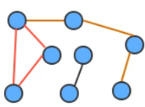

**连通图：**

​        如果图中任意一个顶点都存在一条路径到达另外一个顶点，那么这幅图就称之为连通图  

**连通子图：**

​        一个非连通图由若干连通的部分组成，每一个连通的部分都可以称为该图的连通子图  

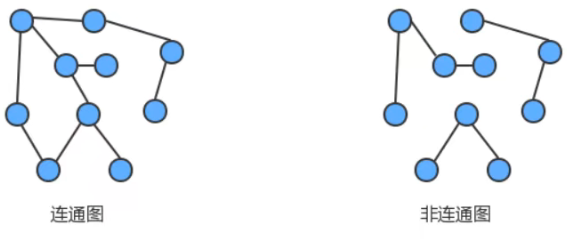

##### 1.3.2 图的存储结构

要表示一幅图，只需要表示清楚以下两部分内容即可：

1. 图中所有的顶点；
2. 所有连接顶点的边；

常见的图的存储结构有两种：邻接矩阵和邻接表  

###### 1.3.2.1 邻接矩阵

1. 使用一个V*V的二维数组int[V][V] adj,把索引的值看做是顶点；
2. 如果顶点v和顶点w相连，我们只需要将adj[v][w]和adj[w][v]的值设置为1,否则设置为0即可。  

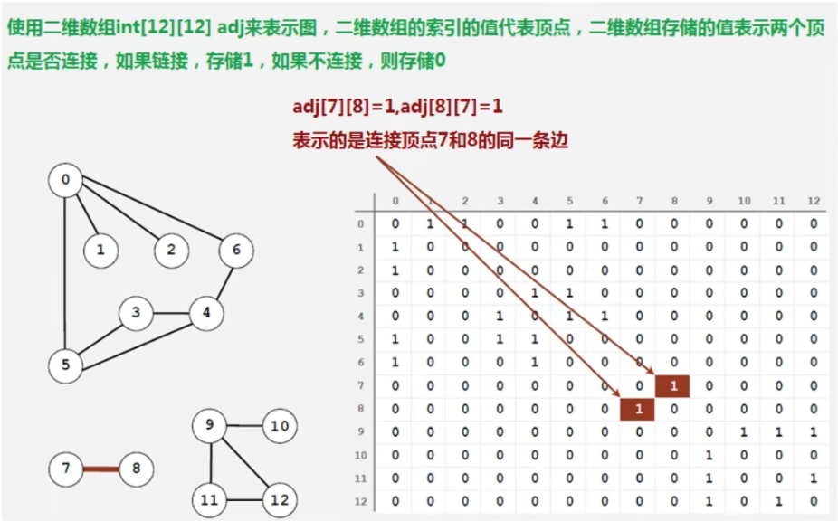

很明显，邻接矩阵这种存储方式的空间复杂度是V^2的，如果我们处理的问题规模比较大的话，内存空间极有可能
不够用。  

###### 1.3.2.2 邻接表

1. 使用一个大小为V的数组 Queue[V] adj，把索引看做是顶点；
2. 每个索引处adj[v]存储了一个队列，该队列中存储的是所有与该顶点相邻的其他顶点  

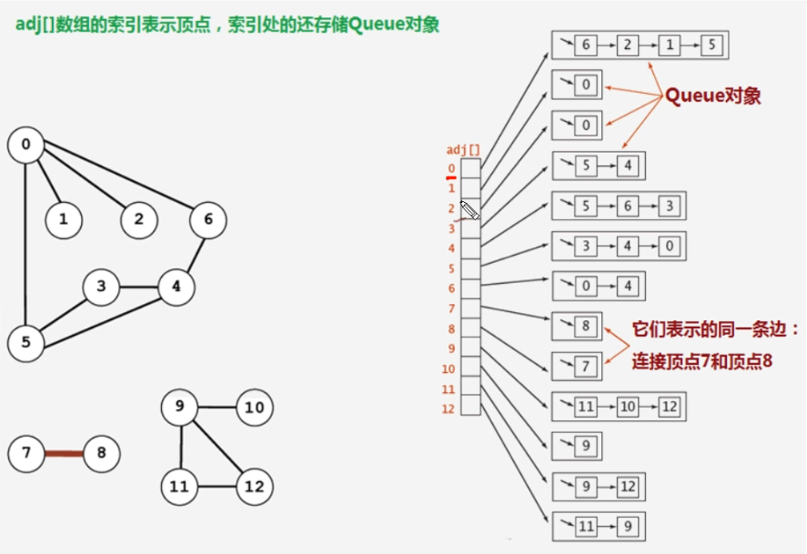

很明显，邻接表的空间并不是线性级别的，所以后面我们一直采用邻接表这种存储形式来表示图。  

##### 1.3.3 图的实现

###### 1.3.3.1 图的API设计

| 类名   | Graph                                                                                                                                                    |
| ---- | -------------------------------------------------------------------------------------------------------------------------------------------------------- |
| 构造方法 | Graph(int V)：创建一个包含V个顶点但不包含边的图                                                                                                                           |
| 成员方法 | 1.public int V():获取图中顶点的数量<br/>2.public int E():获取图中边的数量<br/>3.public void addEdge(int v,int w):向图中添加一条边 v-w<br/>4.public Queue adj(int v)：获取和顶点v相邻的所有顶点 |
| 成员变量 | 1.private final int V: 记录顶点数量<br/>2.private int E: 记录边数量<br/>3.private Queue[] adj: 邻接表                                                                  |

###### 1.3.3.2 代码实现

```java
public class Graph {
    //顶点数目
    private final int V;
    //边的数目
    private int E;
    //邻接表
    private Queue<Integer>[] adj;
    public Graph(int V){
        //初始化顶点数量
        this.V = V;
        //初始化边的数量
        this.E=0;
        //初始化邻接表
        this.adj = new Queue[V];
        //初始化邻接表中的空队列
        for (int i = 0; i < adj.length; i++) {
            adj[i] = new Queue<Integer>();
        }
    } 
    //获取顶点数目
    public int V(){
        return V;
    } 
    //获取边的数目
    public int E(){
        return E;
    } 
    //向图中添加一条边 v-w
    public void addEdge(int v, int w) {
        //把w添加到v的链表中，这样顶点v就多了一个相邻点w
        adj[v].enqueue(w);
        //把v添加到w的链表中，这样顶点w就多了一个相邻点v
        adj[w].enqueue(v);
        //边的数目自增1
        E++;
    } 
    //获取和顶点v相邻的所有顶点
    public Queue<Integer> adj(int v){
        return adj[v];
    }
}
```

##### 1.3.4 图的搜索

在很多情况下，我们需要遍历图，得到图的一些性质，例如，找出图中与指定的顶点相连的所有顶点，或者判定某个顶点与指定顶点是否相通，是非常常见的需求。

有关图的搜索，最经典的算法有深度优先搜索和广度优先搜索，接下来我们分别讲解这两种搜索算法。  

###### 1.3.4.1 深度优先搜索

所谓的深度优先搜索，指的是在搜索时，如果遇到一个结点既有子结点，又有兄弟结点，那么先找子结点，然后找兄弟结点。  

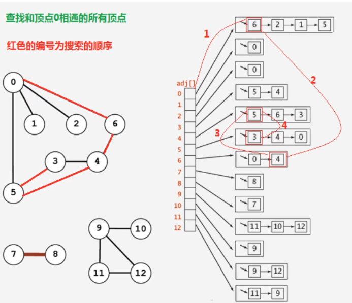

很明显，在由于边是没有方向的，所以，如果4和5顶点相连，那么4会出现在5的相邻链表中，5也会出现在4的相邻链表中，那么为了不对顶点进行重复搜索，应该要有相应的标记来表示当前顶点有没有搜索过，可以使用一个布尔类型的数组 boolean[V] marked,索引代表顶点，值代表当前顶点是否已经搜索，如果已经搜索，标记为true，如果没有搜索，标记为false；  

**API设计：**

| 类名   | DepthFirstSearch                                                                                                                                      |
| ---- | ----------------------------------------------------------------------------------------------------------------------------------------------------- |
| 构造方法 | DepthFirstSearch(Graph G,int s)：构造深度优先搜索对象，使用深度优先搜索找出G图中s顶点的所有相通顶点                                                                                    |
| 成员方法 | 1.private void dfs(Graph G, int v)：使用深度优先搜索找出G图中v顶点的所有相通顶点<br/>2.public boolean marked(int w):判断w顶点与s顶点是否相通<br/>3.public int count():获取与顶点s相通的所有顶点的总数 |
| 成员变量 | 1.private boolean[] marked: 索引代表顶点，值表示当前顶点是否已经被搜索<br/>2.private int count：记录有多少个顶点与s顶点相通                                                              |

**代码：**  

```java
public class DepthFirstSearch {
    //索引代表顶点，值表示当前顶点是否已经被搜索
    private boolean[] marked;
    //记录有多少个顶点与s顶点相通
    private int count;
    //构造深度优先搜索对象，使用深度优先搜索找出G图中s顶点的所有相邻顶点
    public DepthFirstSearch(Graph G,int s){
        //创建一个和图的顶点数一样大小的布尔数组
        marked = new boolean[G.V()];
        //搜索G图中与顶点s相同的所有顶点
        dfs(G,s);
    } 
    //使用深度优先搜索找出G图中v顶点的所有相邻顶点
    private void dfs(Graph G, int v){
        //把当前顶点标记为已搜索
        marked[v]=true;
        //遍历v顶点的邻接表，得到每一个顶点w
        for (Integer w : G.adj(v)){
            //如果当前顶点w没有被搜索过，则递归搜索与w顶点相通的其他顶点
            if (!marked[w]){
                dfs(G,w);
            }
        } 
        //相通的顶点数量+1
        count++;
    } 
    //判断w顶点与s顶点是否相通
    public boolean marked(int w){
        return marked[w];
    } 
    //获取与顶点s相通的所有顶点的总数
    public int count(){
        return count;
    }
}
```

###### 1.3.4.2 广度优先搜索

所谓的深度优先搜索，指的是在搜索时，如果遇到一个结点既有子结点，又有兄弟结点，那么先找兄弟结点，然后找子结点。  

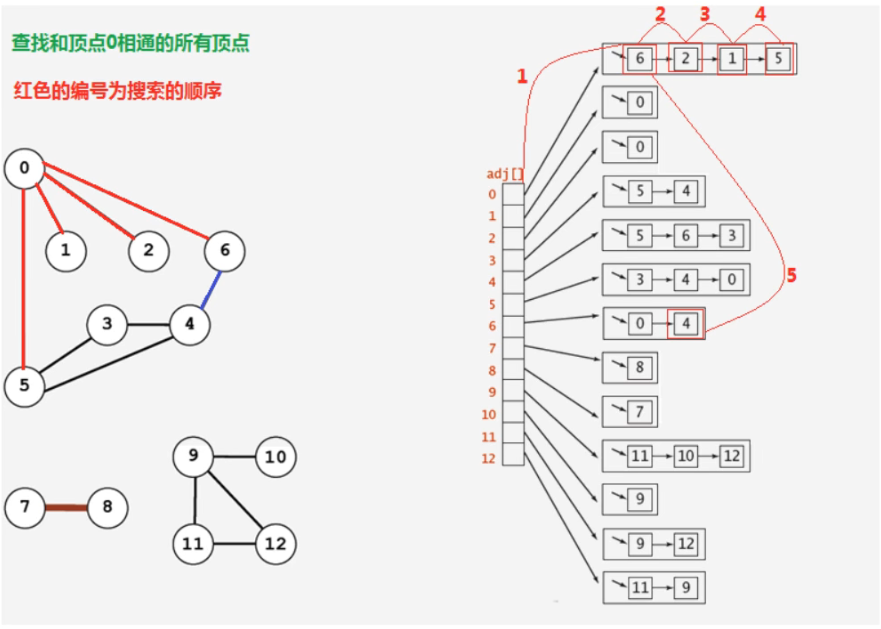

**API设计：**  

| 类名   | BreadthFirstSearch                                                                                                                                    |
| ---- | ----------------------------------------------------------------------------------------------------------------------------------------------------- |
| 构造方法 | BreadthFirstSearch(Graph G,int s)：构造广度优先搜索对象，使用广度优先搜索找出G图中s顶点的所有相邻顶点                                                                                  |
| 成员方法 | 1.private void bfs(Graph G, int v)：使用广度优先搜索找出G图中v顶点的所有相邻顶点<br/>2.public boolean marked(int w):判断w顶点与s顶点是否相通<br/>3.public int count():获取与顶点s相通的所有顶点的总数 |
| 成员变量 | 1.private boolean[] marked: 索引代表顶点，值表示当前顶点是否已经被搜索<br/>2.private int count：记录有多少个顶点与s顶点相通<br/>3.private Queue waitSearch: 用来存储待搜索邻接表的点                 |

**代码：**  

```java
public class BreadthFirstSearch {
    //索引代表顶点，值表示当前顶点是否已经被搜索
    private boolean[] marked;
    //记录有多少个顶点与s顶点相通
    private int count;
    //用来存储待搜索邻接表的点
    private Queue<Integer> waitSearch;
    //构造广度优先搜索对象，使用广度优先搜索找出G图中s顶点的所有相邻顶点
    public BreadthFirstSearch(Graph G, int s) {
        //创建一个和图的顶点数一样大小的布尔数组
        marked = new boolean[G.V()];
        //初始化待搜索顶点的队列
        waitSearch = new Queue<Integer>();
        //搜索G图中与顶点s相同的所有顶点
        dfs(G, s);
    } 
    //使用广度优先搜索找出G图中v顶点的所有相邻顶点
    private void dfs(Graph G, int v) {
        //把当前顶点v标记为已搜索
        marked[v]=true;
        //把当前顶点v放入到队列中，等待搜索它的邻接表
        waitSearch.enqueue(v);
        //使用while循环从队列中拿出待搜索的顶点wait，进行搜索邻接表
        while(!waitSearch.isEmpty()){
            Integer wait = waitSearch.dequeue();
            //遍历wait顶点的邻接表，得到每一个顶点w
            for (Integer w : G.adj(wait)) {
                //如果当前顶点w没有被搜索过，则递归搜索与w顶点相通的其他顶点
                if (!marked[w]) {
                    dfs(G, w);
                }
            }
        } 
        //相通的顶点数量+1
        count++;
    } 
    //判断w顶点与s顶点是否相通
    public boolean marked(int w) {
        return marked[w];
    } 
    //获取与顶点s相通的所有顶点的总数
    public int count() {
        return count;
    }
}
```

##### 1.3.5 案例-畅通工程续1

某省调查城镇交通状况，得到现有城镇道路统计表，表中列出了每条道路直接连通的城镇。省政府“畅通工程”的目标是使全省任何两个城镇间都可以实现交通（但不一定有直接的道路相连，只要互相间接通过道路可达即可）。目前的道路状况，9号城市和10号城市是否相通？9号城市和8号城市是否相通？

在我们的测试数据文件夹中有一个trffic_project.txt文件，它就是诚征道路统计表，下面是对数据的解释：  

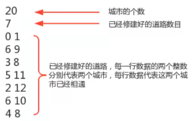

总共有20个城市，目前已经修改好了7条道路，问9号城市和10号城市是否相通？9号城市和8号城市是否相通？  

**解题思路：**  

1. 创建一个图Graph对象，表示城市；
2. 分别调用addEdge(0,1),addEdge(6,9),addEdge(3,8),addEdge(5,11),addEdge(2,12),addEdge(6,10),addEdge(4,8)，表示已经修建好的道路把对应的城市连接起来；
3. 通过Graph对象和顶点9，构建DepthFirstSearch对象或BreadthFirstSearch对象；
4. 调用搜索对象的marked(10)方法和marked(8)方法，即可得到9和城市与10号城市以及9号城市与8号城市是否相通。  

**代码：**  

```java
public class Traffic_Project2 {
    public static void main(String[] args) throws Exception {
        //创建输入流
        BufferedReader reader = new BufferedReader(new InputStreamReader(Traffic_Project2.class.getClassLoader().getResourceAsStream("traffic_project.txt")));
        //读取城市数目，初始化Graph图
        int number = Integer.parseInt(reader.readLine());
        Graph G = new Graph(number);
        //读取已经修建好的道路数目
        int roadNumber = Integer.parseInt(reader.readLine());
        //循环读取已经修建好的道路，并调用addEdge方法
        for (int i = 0; i < roadNumber; i++) {
            String line = reader.readLine();
            int p = Integer.parseInt(line.split(" ")[0]);
            int q = Integer.parseInt(line.split(" ")[1]);
            G.addEdge(p, q);
        }
        //根据图G和顶点9构建图的搜索对象
        //BreadthFirstSearch search = new BreadthFirstSearch(G,9);
        DepthFirstSearch search = new DepthFirstSearch(G, 9);
        //调用搜索对象的marked(10)方法和marked(8)方法
        boolean flag1 = search.marked(10);
        boolean flag2 = search.marked(8);
        System.out.println("9号城市和10号城市是否已相通：" + flag1);
        System.out.println("9号城市和8号城市是否已相通：" + flag2);
    }
}                                                                        
```

##### 1.3.6 路径查找

在实际生活中，地图是我们经常使用的一种工具，通常我们会用它进行导航，输入一个出发城市，输入一个目的地城市，就可以把路线规划好，而在规划好的这个路线上，会路过很多中间的城市。这类问题翻译成专业问题就是：从s顶点到v顶点是否存在一条路径？如果存在，请找出这条路径。  

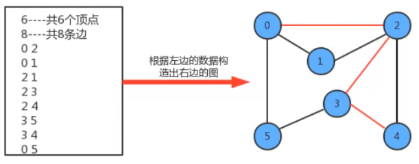

例如在上图上查找顶点0到顶点4的路径用红色标识出来,那么我们可以把该路径表示为 0-2-3-4。  

###### 1.3.6.1 路径查找API设计

| 类名   | DepthFirstPaths                                                                                                                                                             |
| ---- | --------------------------------------------------------------------------------------------------------------------------------------------------------------------------- |
| 构造方法 | DepthFirstPaths(Graph G,int s)：构造深度优先搜索对象，使用深度优先搜索找出G图中起点为s的所有路径                                                                                                            |
| 成员方法 | 1.private void dfs(Graph G, int v)：使用深度优先搜索找出G图中v顶点的所有相邻顶点<br/>2.public boolean hasPathTo(int v):判断v顶点与s顶点是否存在路径<br/>3.public Stack pathTo(int v):找出从起点s到顶点v的路径(就是该路径经过的顶点) |
| 成员变量 | 1.private boolean[] marked: 索引代表顶点，值表示当前顶点是否已经被搜索<br/>2.private int s:起点<br/>3.private int[] edgeTo:索引代表顶点，值代表从起点s到当前顶点路径上的最后一个顶点                                           |

###### 1.3.6.2 路径查找实现

我们实现路径查找，最基本的操作还是得遍历并搜索图，所以，我们的实现暂且基于深度优先搜索来完成。其搜索的过程是比较简单的。我们添加了edgeTo[]整型数组，这个整型数组会记录从每个顶点回到起点s的路径。

如果我们把顶点设定为0，那么它的搜索可以表示为下图：  

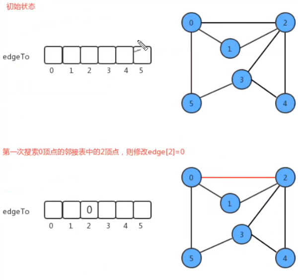

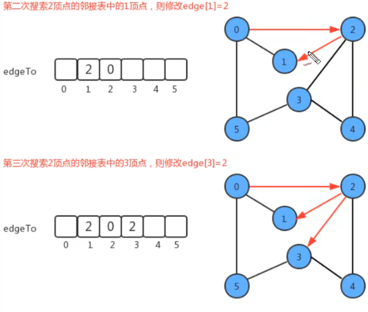

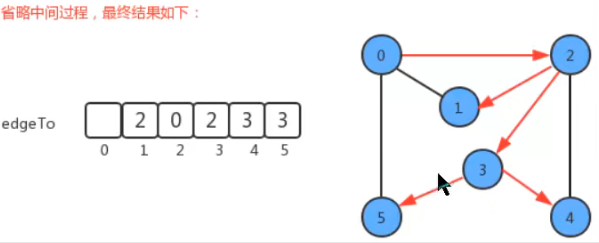

根据最终edgeTo的结果，我们很容易能够找到从起点0到任意顶点的路径；  

**代码：**  

```java
public class DepthFirstPaths {
    //索引代表顶点，值表示当前顶点是否已经被搜索
    private boolean[] marked;
    //起点
    private int s;
    //索引代表顶点，值代表从起点s到当前顶点路径上的最后一个顶点
    private int[] edgeTo;
    //构造深度优先搜索对象，使用深度优先搜索找出G图中起点为s的所有路径
    public DepthFirstPaths(Graph G, int s){
        //创建一个和图的顶点数一样大小的布尔数组
        marked = new boolean[G.V()];
        //创建一个和图顶点数一样大小的整型数组
        edgeTo = new int[G.V()];
        //初始化顶点
        this.s=s;
        //搜索G图中起点为s的所有路径
        dfs(G,s);
    } 
    //使用深度优先搜索找出G图中v顶点的所有相邻顶点
    private void dfs(Graph G, int v){
        //把当前顶点标记为已搜索
        marked[v]=true;
        //遍历v顶点的邻接表，得到每一个顶点w
        for (Integer w : G.adj(v)){
            //如果当前顶点w没有被搜索过，则将edgeTo[w]设置为v,表示w的前一个顶点为v，并递归搜索与w顶
            点相通的其他顶点
                if (!marked[w]){
                    edgeTo[w]=v;
                    dfs(G,w);
                }
        }
    } 
    //判断w顶点与s顶点是否存在路径
    public boolean hasPathTo(int v){
        return marked[v];
    } 
    //找出从起点s到顶点v的路径(就是该路径经过的顶点)
    public Stack<Integer> pathTo(int v){
        //当前v顶点与s顶点不连通，所以直接返回null，没有路径
        if (!hasPathTo(v)){
            return null;
        } 
        //创建路劲中经过的顶点的容器
        Stack<Integer> path = new Stack<Integer>();
        //第一次把当前顶点存进去，然后将x变换为到达当前顶点的前一个顶点edgeTo[x],在把前一个顶点存进
        去，继续将x变化为到达前一个顶点的前一个顶点，继续存，一直到x的值为s为止，相当于逆推法，最后把s放进去
            for (int x = v;x!=s;x=edgeTo[x]){
                //把当前顶点放入容器
                path.push(x);
            } 
        //把起点s放入容器
        path.push(s);
        return path;
    }
} 
//测试代码
public class DepthFirstPathsTest {
    public static void main(String[] args) throws Exception {
        //创建输入流
        BufferedReader reader = new BufferedReader(new InputStreamReader(DepthFirstPathsTest.class.getClassLoader().getResourceAsStream("road_find.txt")));
        //读取城市数目，初始化Graph图
        int number = Integer.parseInt(reader.readLine());
        Graph G = new Graph(number);
        //读取城市的连通道路
        int roadNumber = Integer.parseInt(reader.readLine());
        //循环读取道路，并调用addEdge方法
        for (int i = 0; i < roadNumber; i++) {
            String line = reader.readLine();
            int p = Integer.parseInt(line.split(" ")[0]);
            int q = Integer.parseInt(line.split(" ")[1]);
            G.addEdge(p, q);
        } 
        //根据图G和顶点0路径查找对象
        DepthFirstPaths paths = new DepthFirstPaths(G, 0);
        //调用查找对象的pathTo(4)方法得到路径
        Stack<Integer> path = paths.pathTo(4);
        //遍历打印
        StringBuilder sb = new StringBuilder();
        for (Integer v : path) {
            sb.append(v+"-");
        } s
            b.deleteCharAt(sb.length()-1);
        System.out.println(sb);
    }
}
```
