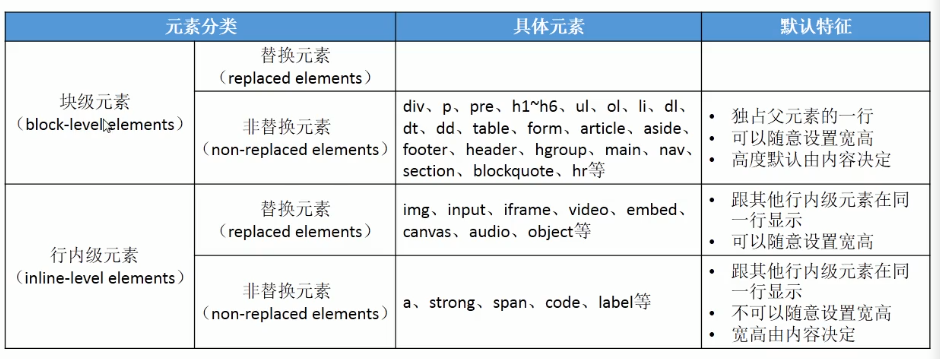

### css：层叠样式表（cascading style sheet）
1. 官方文档：https://www.w3.org/
2. MDN：https://developer.mozilla.org/zh-CN/
3. caniuse：https://caniuse.com/#home
4. css编码： @charset 'utf-8'
5. 颜色网站：flatuicolors.com
### 使用方式
1. 内联样式：直接以属性的形式写在html标签内 
    ``` html
        <div style="color:red;">div</div>
    ```
2. 内联样式表：放在head元素内集中管理
    ``` html
        <head>
            <style type="text/css">
                div {
                   color: red;
                }
            </style>
        </head>
    ```
3. 外联样式表：通过link标签或@imort引入的外部css文件
    ```html
       <head>
           <link rel="stylesheet" href="./test.css"/>
      
           <style type="text/css">
                @import url(./test.css)
           </style>
       </head> 
    ```
### css基础选择器
1. 通配选择器：通配选择器匹配所有元素,其可以和任意选择器一起使用，但和直接使用其他选择器效果一样，如*.warning和.warning效果完全相同
    ``` html
        <style type="text/css">
            *[lang^=en]{color:green;}
            *.warning {color:red;}
            *#maincontent {border: 1px solid blue;}
            * {
                color: red
             }
            /* 在css3中可以和内部空间组合使用，
                1. ns|*：会匹配到ns空间下的所有元素
                2. *|*：会匹配到所有空间下的所有元素
                3. |*：会匹配到所有没有空间的元素
            */
        </style>
    ```
2. 元素选择器：通过节点名称匹配元素
   ``` css
      // 元素 {样式声明 }
      span {
           background-color: DodgerBlue;
           color: #ffffff;
      }
   ```
3. 类选择器：过元素上的class属性来匹配以.开始
     ``` html
        <style type="text/css">
            .类名 {样式声明 }
      
            .class-name {
                color: red;
             }
        </style>
    ```
4. id选择器：通过元素上的id属性来匹配以#开头
     ``` html
        <style type="text/css">
            #id属性值 {样式声明 }
      
            #id {
                color: red;
             }
        </style>
    ```
5. 属性选择器：通过已经存在的属性名或属性值匹配属性元素
   * [attr]：表示带有以 attr 命名的属性的元素
   * [attr=value]：表示带有以 attr 命名的属性，且属性值为 value 的元素
   * [attr~=value]：表示带有以 attr 命名的属性的元素，并且该属性是一个以空格作为分隔的值列表，其中至少有一个值为 value
   * [attr|=value]：表示带有以 attr 命名的属性的元素，属性值为“value”或是以“value-”为前缀
   * [attr^=value]：表示带有以 attr 命名的属性，且属性值是以 value 开头的元素
   * [attr$=value]：表示带有以 attr 命名的属性，且属性值是以 value 结尾的元素
   * [attr*=value]：表示带有以 attr 命名的属性，且属性值至少包含一个 value 值的元素
   * [attr operator value i]：在属性选择器的右方括号前添加一个用空格隔开的字母 i（或 I），可以在匹配属性值时忽略大小写
   ``` css
   /* 存在title属性的<a> 元素 */
   a[title] {
   color: purple;
   }
   
   /* 存在href属性并且属性值匹配"https://example.org"的<a> 元素 */
   a[href="https://example.org"] {
   color: green;
   }
   
   /* 存在href属性并且属性值包含"example"的<a> 元素 */
   a[href*="example"] {
   font-size: 2em;
   }
   
   /* 存在href属性并且属性值结尾是".org"的<a> 元素 */
   a[href$=".org"] {
   font-style: italic;
   }
   
   /* 存在class属性并且属性值包含以空格分隔的"logo"的<a>元素 */
   a[class~="logo"] {
   padding: 2px;
   }
   ```
6. 选择器列表（并集选择器或并集组合器以,隔开）：选择所有能被列表中的任意一个选择器选中的
   ``` css
   element, element, element { style properties }
   /* 选择所有 <span> 和 <div> 元素 */
   span, div {
   border: red 2px solid;
   }
   ```
7. 交集选择器
   ```css
   选择器直接连接，中间无空格如下表示两个选择器同时满足
   selector1selector2{
   }
   ```
8. 后代选择器：通常用单个空格表示，组合了两个选择器，如果第二个选择器匹配的元素具有与第一个选择器匹配的祖先（父母、父母的父母等）元素，则它们被选则
   ``` css
   selector1 selector2 {
   /* property declarations */
   }
   ```
9. 子选择器：当使用>选择符分隔两个元素时，它只会匹配那些作为第一个元素的直接后代（子元素）的第二元素
   ``` css
   元素1 > 元素2 {样式声明 }
   div > span {
   background-color: DodgerBlue;
   }
   ```
10. 通用兄弟选择器：位置无须紧邻，只须同层级，A~B 选择A元素之后所有同层级B元素。
    ``` css
    p ~ span {
    color: red;
    }
    ```
11. 相邻兄弟选择器：以+分隔两个选择器，当第二个元素紧跟在第一个元素之后，并且两个元素都是同属于同一个父元素，则第二个元素被选中
    ```css
    former_element + target_element { style properties }
      
    /* 图片后面紧跟着的段落将被选中 */
    img + p {
    font-style: bold;
    }
    ```
### 伪类和伪元素
1. 伪类（pseudo-classes）：不需要想class一样在元素上标注，常见的伪类有：
   * 动态伪类（dynamic pseudo-classes）：注意编写顺序为LVFHA，否则可能会导致有些选择器不生效
     * :link一般用于a标签表示未访问
     * :visited一般用于a标签表示已访问
     * :hover可以用在a元素以外的其它元素表示鼠标悬浮于元素之上
     * :active可以用在a元素以外的其它元素表示鼠标选中该元素左键并未放开
     * :focus通常用于表单元素，获取到焦点，注意a元素也有焦点可用tab键切换到a元素上
   * 目标伪类（target pseudo-classes）：
     * :target可以选中被选中的锚点
   * 语言伪类（language pseudo-classes）：
     * :language()
   * 元素状态伪类（UI element states pseudo-classes）：
     * :enabled
     * :disabled
     * :checked
   * 结构伪类（structural pseudo-classes）：
     * :nth-child()参数为数字，选中第几个子元素；参数为n时，n代表自然数（0,1,2,3.....），即代表所有子元素；参数为2n时则表示偶数（2,4,6,8....）；2n+1或2n-1为奇数，为负数时表示前几个如-n+3，参数是n时依此类推
     * :nth-last-child()方向与nth-child相反，即倒着数
     * :nth-of-type()其会排除不是要选中的元素类型，如p:nth-of-type(3)，它只管子元素是p元素的，其它类型的不管直接忽略
     * :nth-last-of-type()方向与上相反
     * :first-child第一个子元素
     * :last-child最后一个子元素
     * :first-of-type第一个各种类型的子元素
     * :last-of-type最后一个各种类型的子元素
     * :root根元素就是html元素
     * :only-child父元素中的唯一子元素
     * :only-of-type父元素中唯一该类型的子元素
     * :empty元素内容为空
   * 否定伪类（negation pseudo-classes）：
     * :not()括号中为一个简单选择器
2. 伪元素（pseudo-classes）单冒号双冒号都可以，便于与伪类区分使用双冒号，伪元素可以看成行内元素，宽度高度对其无效
   * ::first-line第一行
   * ::first-letter第一个字符
   * ::before其中可以使用content属性在元素的前面加入内容，且直接在这个选择器中可以设置该伪元素的相关属性
   * ::after在元素的后面加入内容，其和::before一样context内容即使为空也不能删除content否则无效
### css属性
1. 常用属性
   * color：前景色，字体颜色
   * background：为以下几个background的缩写属性，常用改格式是image position/size repeat attachment color，只有在有size时它必须放在position后面，别的都无顺序
     * background-color：背景色
     * background-image：设置元素的背景图片，其会盖在background-color的上面但不是覆盖，不会撑起内容，即当元素没有宽高背景图也就不展示
         * url()：可以设置多个用逗号隔开，默认显示第一个，当第一个不存在时显示第二个依此类推
     * background-repeat：默认值为按需重复来覆盖整个背景图片所在区域，最后一个图像会被裁剪（repeat，repeat-x，repeat-y），图像尽可能的重复但不会裁剪（space），铺满整个区域不留空隙，但会根据浏览器的计算进行伸展或收缩（round），不重复（no-repeat）
     * background-size：背景图片多大就显示多大-默认值（auto）、覆盖即拉伸占满（cover）、铺满宽度或高度等比缩放（contain）、百分比（x% y%）、具体大小（*px *px）
     * background-position：设置图片位置
         * 可以输入具体值*px *px
         * 水平、竖直方向都有三个固定值：center、left、right和center、top、bottom，当只有水平方向值时，竖直方向默认居中
     * background-attachment：背景图片跟随元素一起滚动-默认值（scroll）、背景图片跟随元素以及元素内容一起滚动（local）、背景图片相对于浏览器窗口固定（fixed）
   * font-size：字体大小，单位可以为px，em，rem和百分比等，google默认字体大小为16px
   * display：块级（block）、行内级（inline）、行内块（inline-block）、隐藏（none，元素不再占用空间）、列表的块级显示（list-item）、table中使用的块级（table、table-row-group、table-row、inline-table）
   * width/height：宽度和高度，其对内联元素无效，值为百分比时相对的应该是它的包含块
   * visibility：控制元素是否可见，显示（visible）、隐藏（hidden，元素还是会占有原先的空间）
   * overflow：用于控制元素溢出时的行为，超出依然显示（visible，默认值），溢出的内容直接裁剪（hidden），溢出的内容被裁剪但是可以通过滚动查看（scroll），根据内容是否溢出决定是否提供滚动机制（auto）
   * overflow-x、overflow-y：效果同上，只是单独确定x或y轴的行为
   * outline：类似于border，但其只是边框的轮廓不会增加元素的大小，经常用在div可以作为调试技巧看页面布局
   * transform：允许旋转、缩放、倾斜或平移，旋转，旋转方向为顺时针（rotate（-45deg）），移动（translate(120px, 50%)-百分比时是相对于自身的宽高），缩放（scale(2, 0.5)），倾斜（skew(30deg, 20deg)）
   * cursor：设置光标在元素上面的样式，默认-浏览器决定（auto）、操作系统决定（default）、手型（pointer）、一条竖线（text）
   * box-shadow：盒子阴影效果，inset? && <length>{2,4}&&<color>?
       * length
         * 第一个length：水平方向的偏移，正数往右偏移
         * 第二个length：垂直方向的偏移，正数往下偏移
         * 第三个length：模糊半径
         * 第四个length：四周向外延伸
       * color：设置颜色
       * inset：外框阴影变成内框阴影
2. 文本属性（通常子元素会继承）
   * text-decoration：用于设置文字的装饰线。值为：无任何装饰线（none）、上划线（overline）、下划线（underline）、删除线（line-through）
   * text-transform：用于设置文字的大小写转换，值为：没有任何影响（none）、每个单词首字符变为大写（capitalize）、所有字符大写（uppercase）、所有字符小写（lowercase）
   * text-indent：首行缩进，值可以为px、em、rem（根元素的字体大小root em）等，在text-indent中时em为此文本自己的字体大小，即1em为一个字的大小
   * text-align：设置元素内容在元素中的水平对齐方式，其值为左对齐（left）、右对齐（right）、居中（center）、两端对齐但是它对最后一行没有效果要设置最后一行的话要使用text-align-last（justify）
   * letter-spacing：字母间距
   * word-spacing：单词间距
   * word-break：单词默认情况下是不允许断掉的，即超出宽度后也不会换行，可以使用此属性
3. 文字属性（通常子元素会继承）
   * font-size：字体大小，这里面的em和百分都是相对于父元素的font-size大小，1em为100%，2em为200%
   * font-family：设置文字的字体，为了防止设置的字体刚好操作系统中不存在我们可以设置多个字体用逗号隔开，其会从头开始找直到找到为止，如果都没有则使用默认字体。一般情况下英文字体只适用英文，中文字体既支持中文也支持英文，那么如果就是想分别使用不一样的中英文字体则要把英文字体放在前面
   * font-weight：设置文字的粗细，值为100|200|300|400|500|600|700|800|900，每个数字表示一个重量，特殊值normal（400）、bold（700）
   * font-style：设置文字的常规、斜体显示，值为常规显示（normal）、字体的斜体显示前提是字体本身支持斜体（italic）、文本倾斜显示其为让文字倾斜（oblique）
   * font-variant：可以影响小写字母的显示形式，值为normal、small-caps（将小写字母替换为缩小过的大写字母）
   * line-height：设置文本的最小行高，可以简单理解为一行文字所占据的高度，严格来说其为两行文字基线之间的间距，因为行距为等分所以它就是一行文字的高度，height为元素整体的高度，注意区分。行高可以用来做垂直居中，当height和line-height相等时就居中了
   * font：是一个缩写属性，可以一次性设置以上的所有属性，字体大小和行高的设置方式为font-size/line-height，并且font-family必须在其后面，其他三个属性在其前面顺序随意
   * text-shadow：文字阴影，<length>{2,3}&&<color>?
4. 列表属性（可继承）：正常设置为none不使用列表默认的东西，而是通过自定义内容和css来控制
   * list-style-type：不显示序号标记（none），实心圆（disc），空心圆（circle）,实心方块（square），数字（decimal），大写罗马字符（upper-roman）、小写罗马字符（lower-roman），小写字母（lower-alpha）等
   * list-style-image：序号替换成图片，值为url()
   * list-style-position：序号内容包在列表内容内（inside）、放在列表内容外（outside）
   * list-style:缩写属性，一般使用的值为none，不使用列表自带的序号等，通过自定义的内容和css来实现
5. 表格属性
   * border-collapse：用来决定表格的边框是分开还是合并，分开（separate），合并（collapse）
   * border-spacing：指定相邻单元格边框之间的距离，只适用于边框分离模式
### css特性
1. 继承：一个元素如果没有设置某属性，就会跟随父元素的值，如果自身有设置值则使用自身设置的值，宽、高、背景色等属性不会继承，但可以使用inherit来强制继承。**注意css属性继承的是计算值而不是字面量** 
2. 层叠：css允许多个相同名字的css属性层叠在同一个元素上
   * 基本层叠（相同的选择器）：后面写的属性会把前面写的属性层叠掉
   * 当选择器不同时就不能按照基本层叠来理解，每个选择器都有自己对应的权重，权重越高就使用谁。通常我们使用以下方式来计算个选择器的权重，只是通常这么做非严格定义，比较的时候从优先级高的选择器开始比较：
     * !important可以认为权重为10000，即可以使用其来排除元素从框架等其他地方获得的属性
     * 内联样式权重可认为1000
     * id选择器的权重为100
     * 类选择器、属性选择器、伪类选择器的权重为10
     * 元素、伪元素选择器的权重为1方便计算
     * 通配符为0
### 元素类型
1. 按显示方式分
   1. 块级元素（block-level elements）：和其它元素不能在同一行显示，独占父元素一行
      * div、p、h、ul、ol、li、dl、dt、dd、table、form、header、main、footer、nav、section、hr等
   2. 行内元素（inline-level elements）：多个行内级元素可以再父元素的同一行中显示
      * a、img、span、strong、code、iframe、label、input、button、canvas、embed、video、audio等
2. 根据元素的内容类型分：行内替换元素（inline-block）可以设置宽高，非替换元素才不能设置宽高，其宽高由内容决定
   1. 替换元素（replaced element）：元素本身没有实际内容，浏览器根据元素的类型和属性来决定元素的具体显示内容
      * img、input、iframe、video、audio、embed、canvas等
   2. 非替换元素（non-replaced element）：和替换元素相反，元素本身是有实际内容的，浏览器会直接将其内容显示出来，而不需要根据元素类型和属性来判断到底显示什么内容     
   
### 解决行内级元素换行产生空格问题的几种方法
1. 去除元素之间的空格、换行
2. 元素间的换行使用注释包裹
3. 设置父元素的font-size为0，然后在元素中重新设置自己需要的font-size（Safari上不支持）
4. 给元素加float
### 盒子模型
1. html中的每一个元素都可以看做是一个盒子，可以具备四个属性：内容（content），内边距（padding），边框（border）以及外边距（margin）
2. box-sizing：设置盒子的尺寸计算方式，设置宽度和高度时只是指定内容的宽高，默认值（content-box），实际要的宽度和高度是内容+内边距+边框的宽高（border-box）
3. 内容属性（content）：
   * width：设置内容宽度
   * min-width：最小宽度
   * max-width：最大宽度
   * height：设置内容高度
   * min-height：最小高度
   * max-height：最大高度
4. 内边距（padding）：
   * 四个方向：padding-top、padding-right、padding-bottom、padding-left
   * 简写（padding）：顺序为顺时针，且上下、左右可以合并为一个，如果缺少left的值就使用right的值，缺少bottom则使用top的值
   * top、bottom对行内非替换元素有效但是其不占据空间，即会延伸到别的元素内部
5. 边框（border）：
   * 边框的宽度
     * border-top-width、border-right-width、border-bottom-width、border-left-width
     * border-width为简写
   * 边框颜色
     * border-top-color、border-right-color、border-bottom-color、border-left-color
     * border-color为简写
   * 边框样式：无（none）、点状（dotted）、虚线（dashed）、实线（solid）、双重实线（double）、槽（groove）、脊（ridge）、陷入式（inset）、突出式（outset）
     * border-top-style、border-right-style、border-bottom-style、border-left-style
     * border-style为简写
   * border为以上三类属性的简写且也可以分成四个写：border-top、border-right、border-bottom、border-left
   * 圆角属性：border- * - * -radius、border-radius,值可以为px，也可以为百分比其参考的是当前元素的border+padding+width
   * top、bottom对行内非替换元素有效但是其不占据空间，即会延伸到别的元素内部
6. 外边距（margin）：
   * 四个方向：margin-top、padding-right、margin-bottom、margin-left
   * 简写：margin，规律和内边距相同
   * 值为百分比时是相对于父元素的宽高
   * 上下margin折叠（合并）：块级元素margin的上下会合并两个元素设置的值，即如果上行的元素设置了bottom并且下行设置了top则实际的空间只有一个，但是左右不会产生合联
   * margin-top传递：如果块级元素的顶部线和父元素的顶部线重叠，那么margin-top会传递到父元素
   * margin-bottom传递：如果块级元素的底部线和父元素的底部线重叠，并且父元素的高度是auto，那么这个块级元素的margin-bottom值会传递给父元素
   * top、bottom对行内非替换元素无效
   * 解决传递的方法：
     * 给父元素设置padding-top、padding-bottom使它们不会重合
     * 给父元素设置边框也可以使它们不会重叠
     * 触发结界（BFC，block format context）：浮动可以触发，设置一个元素的overflow为非visible也可以触发
### 水平居中：不同类型的方式
1. 普通文本：text-align
2. 行内元素：text-align
3. 行内替换元素：text-align
4. 行内块级元素：text-align
5. 块级元素：margin：0 auto
### 元素嵌套总结
1. 块级元素和行内块级元素，可以嵌套任意的元素
2. 行内元素一般只包含行内元素
3. 特殊情况：p元素不能包含其他块级元素
### 定位
1. 标准流（Normal Flow）：在标准流中无论是div还是span都是从左往右，从上到下排，互相之间不存在层叠现象。默认情况下元素都是按照标准流进行排布
2. 在标准流中，可以使用margin、padding对元素进行定位，但是通常会影响到标准流中其他元素的定位效果，不便于实现元素的层叠的效果
3. position：除static外，通过left、right、top、bottom来设置元素的具体位置
    * 静态定位（在标准流中就是静态定位）：static
    * 相对定位：relative
        * 相对自身在标准流中的位置，会保留原先占用空间并且不会挤压其它元素的位置
        * 写百分比时相对于父元素的宽高
        * 用于不影响其它元素位置的情况下对元素进行微调
    * 绝对定位：absolute
      * 设置后和固定定位一样脱离标准流
      * 向上找父元素直到找到父元素的定位为非static就开始相对于此父元素来做定位，子绝父相
      * 定位参照对象的宽度=left + right + margin-left + margin-right + 绝对定位元素的实际占用宽度
      * 定位参照对象的高度=top + bottom + margin-top + margin-bottom + 绝对定位元素的实际占用高度
    * 固定定位：fixed
      * 相对于浏览器的视口进行固定，脱离标准流，不会继续占据原先的位置
    * 粘性定位元素：sticky
      * 偏移值不会影响任何其它元素的位置
      * 总是创建一个新的层叠上下文，即一个sticky元素会固定在离它最近的一个拥有滚动机制的祖先上
4. 浮动：float
   * 元素一旦浮动：
     * 脱离标准流
     * 浮动元素之间不能层叠，父元素空间不够则换行
     * 朝着向左或向右方向移动，直到自己的边界紧贴着包含块或者其它浮动元素的边界为止
     * 如果元素向左（右）浮动，浮动元素的左（右）边界不能超出包含块的左右边界
     * 浮动元素不能与行内级内容包括行内块级元素的内容层叠，行内级内容将会被浮动元素推出
     * 行内级元素、inline-block元素浮动后，其顶部将与所在行的顶部对齐
     * 浮动元素的顶端不能超过包含块的顶端，也不能超过之前所有浮动元素的顶端
   * 默认值-不浮动：none
   * 向左浮动：left
   * 向右浮动：right
   * 浮动常用的场景：
     * 解决行内元素由于换行符产生的空格
     * 用于布局，布局建议不要使用display：inline-block，因为其会受到里面内容基线的影响
   * 解决一行排列布局的最后一个元素的margin-right：
       * 给每一行的最后一个元素总是加一个class通过类选择器去除这个margin-right
       * 通过伪类选择器，会有兼容性的问题
       * .container 固定的宽度 > .wrap + 负margin  > 很多item
5. 层叠关系：通过z-index来设置层叠关系
    * 标准元素：标准流中的元素时不存在层叠的
    * 定位元素：定位元素会层叠到标准流元素的上面
      * 定位元素之间可以使用z-index，前提是定位元素非static
    * 浮动元素
    * 层叠从底向上为：标准元素->浮动元素->定位元素
6. 脱标元素的特点
    * 可以随意设置高度
    * 宽高默认由内容决定
    * 不再受标准流的约束
    * 不再给父元素汇报宽高数据
### 颜色设置
1. 英文单词，即基本颜色的关键字，如red、green、black、blue等，但其表现的颜色种类有限
2. RGB颜色：即以红（red）、绿色（green）、蓝色（blue）三个颜色的通道变化及叠加来得到各式各样的颜色
   * 十进制表示时每个颜色的取值范围为0~255，表示方法为rgb(0, 0, 0)所有都是0的情况为黑色，所有都为255时为白色
   * 十六进制表示时每个颜色的取值范围为0~ff，写法为#ffffff的形式，#0f0此种形式表示#00ff00的简写
3. RGBA中的a为alpha，设置透明度，其值为0~1，为1时完全不透明，为零时完全透明
4. 当background-color:transparent,表示rgba全为0，即全透明
### emmet语法：使用tab键快速生成
1. 生成html元素
   * !和html:5都可以快速生成html5文件结构
   * 生成子代的元素：div > p > span > strong
   * 生成兄弟元素：h2 + div + p
   * 上一层级：^
   * 生成多个：*
   * 分组：()
   * 属性：类使用.，id使用#，普通属性使用[]多个使用空格隔开，生成多个元素时可以使用$占位符生成下标值从1开始
   * 内容：{}，生成多个元素时可以使用$占位符生成下标值从1开始
   * 隐式标签：当什么都不写时默认为div标签如.wrap生成`<div class="wrap"></div>`；另外如ul、ol之类的内部固定为li标签，则内部的li也可以省略
2. 生成css，正常为首字母缩写
   * 生成基本属性：w20+h30+m40+p10，则分别生成width、height、margin、padding
   * fz：font-size
   * fw：font-weight
   * lh：line-height
   * bgc：background-color
