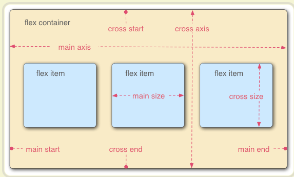
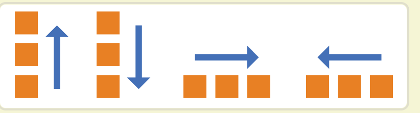
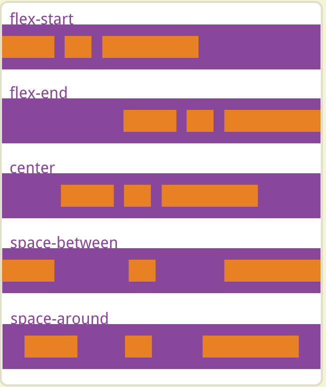
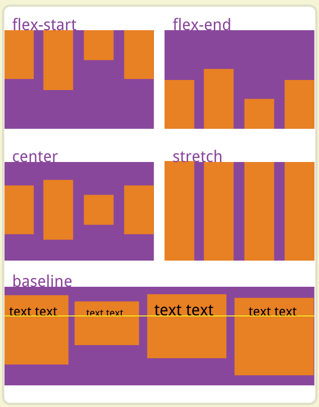
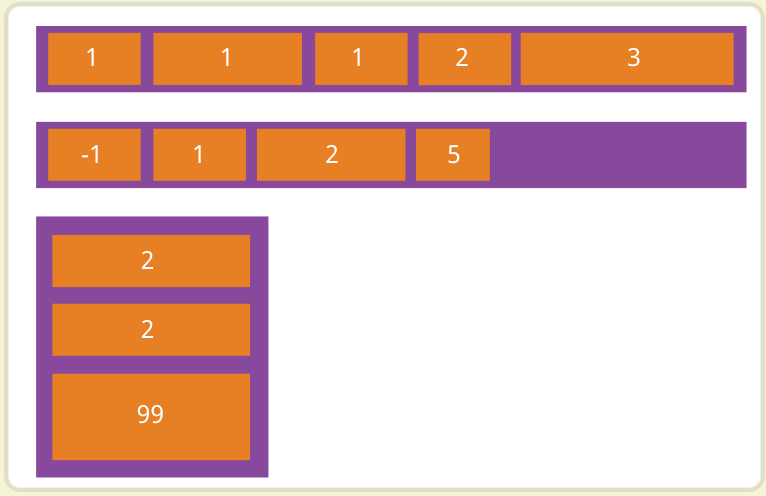
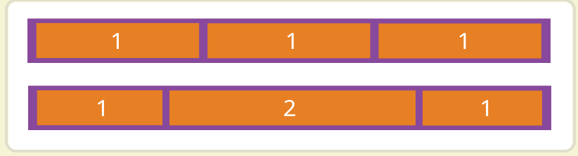
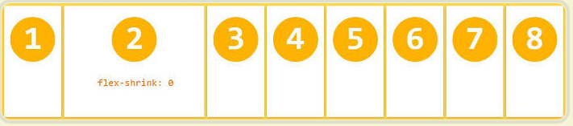

## 传统布局
布局的传统解决方案基于[盒状模型](https://developer.mozilla.org/en-US/docs/Web/CSS/CSS_Box_Model/Introduction_to_the_CSS_box_model),
依赖[display](https://developer.mozilla.org/en-US/docs/Web/CSS/display)属性、[position](https://developer.mozilla.org/en-US/docs/Web/CSS/position)属性、
[float](https://developer.mozilla.org/en-US/docs/Web/CSS/float)属性。其对于特殊的布局非常不方便，如垂直居中等。
## flex布局（弹性布局）
flex布局可以简便、完整、响应式地实现各种页面布局，并得到了所有浏览器的支持。
### flex使用
任何一个容器都可以指定为flex布局。设为flex布局后，子元素的float、clear和vertical-align属性将失效
```css
.box {
  display: flex;
}
```
行内元素也可以是用flex。
```css
.box {
  display: inline-flex;
}
```
Webkit内核的浏览器，必须加上-webkit前缀
```css
.box {
  display: -webkit-flex; /* safari */
  display: flex;
}
```
### 基本概念
采用flex布局的元素称为Flex容器，它的所有子元素自动成为容器成员为flex项目  
     
容器默认存在两根轴：水平的主轴（main axis）和垂直的交叉轴（cross axis）。主轴的开始位置（与边框的交叉点）叫做main start，结束位置叫做main end；
交叉轴的开始位置叫做cross start，结束位置叫做cross end。  
项目默认延主轴排列，单个项目占据的主轴空间叫做main size，占据交叉轴空间叫做cross size
### 容器的属性
* flex-direction
* flex-wrap
* flex-flow
* justify-content
* align-items
* align-content
#### flex-direction属性
其决定主轴的方向，即项目排列的方向
* row（默认值）:主轴为水平方向，起点在左端
* row-reverse:主轴为水平方向，起点在又端
* column:主轴为垂直方向，起点在上沿
* column-reverse:主轴为垂直方向，起点在下沿
```css
.box {
  flex-direction: row | row-reverse | column | column-reverse;
}
``` 
     
#### flex-wrap属性
默认情况下项目都排在轴线上，flex-wrap属性定义如果一条轴线排不下，如何换行
* nowrap（默认）:不换行
* wrap:换行,第一行在上方
* wrap-reverse:换行第一行在下方        
      
```css
.box {
  flex-wrap: nowrap | wrap | wrap-reverse;
}
```
#### flex-flow属性
其是flex-direction属性和flex-wrap属性的简写，默认为row nowrap     
```css
.box {
  flex-flow: <flex-direction> <flex-wrap>;
}
```
#### justify-content属性
该属性定义了项目在主轴上的对齐方式       
* flex-start（默认）:左对齐
* flex-end:右对齐
* center:居中
* space-between:两端对齐，项目之间的间隔相等
* space-around:每个项目两侧的间隔相等，项目之间的间隔比项目与边框的间隔大一倍  
```css
.box {
  justify-content: flex-start | flex-end | center | space-between | space-around;
}
```
       
#### align-items属性
该属性定义项目交叉轴上如何对齐  
* stretch（默认）：如果项目未设置高度或者设为auto，将占满整个容器的高度   
* flex-start：交叉轴的起点对齐
* flex-end：交叉轴的终点对齐
* center：交叉轴的中点对齐
* baseline：项目的第一行文字的基线对齐        
```css
.box {
  align-items: flex-start | flex-end | center | baseline | stretch;
}
```
       
#### align-content属性
该属性定义了多根轴线的对齐方式，如果项目只有一根轴线该属性不起作用       
* stretch（默认）：轴线占满整个交叉轴
* flex-start：与交叉轴的起点对齐
* flex-end：与交叉轴的中点对齐
* center：与交叉轴的中点对齐
* space-between：与交叉轴两端对齐，轴线之间的间隔平均分
* space-aroung：每根轴线两侧间隔相等
### 项目的属性
* order
* flex-grow
* flex-shrink
* flex-basis
* flex
* align-self
#### order属性
该属性定义项目的排列顺序，数值越小，排列越靠前，默认为0
```css
.item {
  order: <integer>;
}
```
       
#### flex-grow属性
该属性定义项目的放大比例，默认为0，即如果存在剩余空间，也不放大
```css
.item {
  flex-grow: <number>;
}
```
     
如果所有项目的flex-grow属性都为1，则它们将等分剩余空间。如果一个项目的flex-grow属性为2，其他项目都为1，则前者占据的剩余空间将比其他项多一倍        
#### flex-shrink属性
该属性定义了项目缩小比例，默认为1，即如果空间不足，该项目将缩小        
```css
.item {
  flex-shrink: <number>
}
```
       
如果所有项目的flex-shrink属性都为1，当空间不足时都将等比缩小。如果一个项目的flex-shrink为0，其余项目为1，则空间不足，前者不缩小。负值对该属性无效
#### flex-basis属性
该属性定义了再分配多余空间之前，项目占据的主轴空间，浏览器根据这个属性计算主轴是否有多余空间，默认值为auto
```css
.item {
  flex-basis: <lenth> | auto;
}
```
设置为固定值时，则项目将占据固定空间
#### flex属性
该属性是flex-grow、flex-shrink和flex-basis的简写，默认值为0、1、aouto，后来那个值为可选
```css
.item {
  flex: none | [ <'flex-grow'> <'flex-shrink'>? || <'flex-basis'> ]
}
```
该属性有两个快捷值：auto (1 1 auto) 和 none (0 0 auto)。
#### align-self属性
该属性允许单个项目有与其它项目不一样的对齐方式，可覆盖align-items属性，默认值为auto，表示继承父元素的align-items属性，如果没有父元素，则等同于stretch         
```css
.item {
  align-self: auto | flex-start | flex-end | center | baseline | stretch;
}
```
