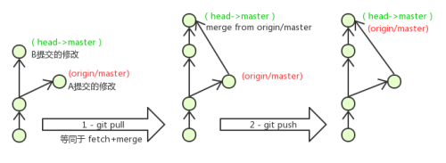

## 一、版本控制器的方式

- 集中式版本控制工具

  集中式版本控制工具，版本库是集中存放在中央服务器的，team里每个人work时从中央服务器下载代 码，是必须联网才能工作，局域网或互联网。个人修改后然后提交到中央版本库。如SVN和CVS

- 分布式版本控制工具

  分布式版本控制系统没有“中央服务器”，每个人的电脑上都是一个完整的版本库，这样工作的时候，无 需要联网了，因为版本库就在你自己的电脑上。多人协作只需要各自的修改推送给对方，就能互相看到对方的 修改了。如git

## 二、Git

​		Git是分布式的，Git不需要有中心服务器，我们每台电脑拥有的东西都是一样的。我们使用Git并且有个 中心服务器，仅仅是为了方便交换大家的修改，但是这个服务器的地位和我们每个人的PC是一样的。我们可以 把它当做一个开发者的pc就可以就是为了大家代码容易交流不关机用的。没有它大家一样可以工作，只不 过“交换”修改不方便而已。


## 三、Git工作流程


1. clone（克隆）：从远程仓库中克隆代码到本地仓库
2. checkout（检出）：从本地仓库中检出一个仓库分支然后进行修订
3. add（添加）：在提交前先将代码提交到暂存区
4. commit（提交）：提交到本地仓库。本地仓库中保存修改的各个历史版本
5. fetch（抓取）：从远程库，抓取到本地仓库，不进行任何的合并动作，一般操作比较少
6. pull（拉取）：从远程拉到本地库，自动进行合并（merge），然后放到工作区，相当于fetch+merge
7. push（推送）：修改完后，需要和团队成员共享代码时，将代码推送到远程仓库

## 四、Git环境配置

下载地址：**https://git-scm.com/download**

安装完成后右键菜单：

- Git GUI：Git提供的图形界面工具
- Git Bash：Git提供的命令行工具

### 1. 基本配置

- 打开Git Bash设置用户信息

  ```bash
  git config --global user.name "lql"
  git config --global user.email ""
  ```

- 查看配置信息

  ```bash
  git config --global user.name
  git config --global user.email
  ```

- 解决GitBash乱码问题

  ```bash
  # 打开Git Bash执行
  git config --global core.quotepath false
  
  # ${git_home}/etc/bash.bashrc文件最后加入
  export LANG="zh_CN.UTF-8"
  export LC_ALL="zh_CN.UTF-8"
  ```

### 2. 为常用指令配置别名

1. 打开用户目录，创建`.bashrc`文件

2. 在`.bashrc`文件中输入

   ```
   #用于输出git提交日志
   alias git-log='git log --pretty=oneline --all --graph --abbrev-commit'
   #用于输出当前目录所有文件及基本信息
   alias ll='ls -al'
   ```

## 五、获取本地仓库

要使用Git对代码进行版本控制，首先需要获得本地仓库

1. 在电脑的任意位置创建一个空目录作为本地Git仓库

2. 进入这个目录，点击右键打开Git Bash窗口

3. 执行命令git init

4. 如果创建成功后可咋子文件夹下看到隐藏的`.git`目录

   

## 六、基础操作指令

Git工作目录下对于文件的修改（增加、删除、更新）会存在几个状态，这些修改的状态会随着执行Git的命令而发生变化。


### 1. 查看修改的状态（status）

查看修改的状态（暂存区、工作区）：`git status`

### 2. 添加工作区到暂存区（add）

添加工作区一个或多个文件的修改到暂存区：`git add 单个文件名|通配符`，将所有修改加入暂存区：`git add .`

### 3. 提交暂存区到本地仓库（commit）

提交暂存区内容到本地仓库的当前分支：`git commit -m '注释内容'`

### 4. 查看提交日志（log）

`git-log [option]`

- options
  - --all：显示所有分支
  - --pretty=oneline 将提交信息显示为一行
  - --abbrev-commit使得输出的commitId更简短
  - --graph以图的形式显示

### 5. 版本回退

版本切换：`git reset --hard commitID`

查看已经删除的提交记录：`git reflog`

### 6. 添加文件至忽略列表

一般总会有写文件无需纳入Git的管理，因此也不需要它们总出现在未跟踪文件列表。在此情况下，可以再工作目录中创建一个名为`.gitignore`的文件，列出要忽略的文件模式

```bash
#no .a files
*.a
# but do track lib.a, even though you're ignoring .a files above
!lib.a
# only ignore the TODO file in the current directory, not subdir/TODO
/TODO
# ignore all files in the build/ directory
build/
# ignore doc/notes.txt, but not doc/server/arch.txt
doc/*.txt
# ignore all .pdf files in the doc/ directory
doc/**/*.pdf

```

## 七、分支

几乎所有的版本控制系统都以某种形式支持分支。 使用分支意味着你可以把你的工作从开发主线上分离 开来进行重大的Bug修改、开发新的功能，以免影响开发主线。 

### 1. 查看本地分支 

命令：git branch 

### 2. 创建本地分支 

命令：git branch 分支名 

### 3. 切换分支(checkout) 

命令：git checkout 分支名 

还可以直接切换到一个不存在的分支（创建并切换） 

命令：git checkout -b 分支名 

### 4. 合并分支(merge) 

一个分支上的提交可以合并到另一个分支 ，通常是将其他分支合并到master分支

命令：git merge 分支名称 ：将分支名代表的分支合并到当前分支

### 5. 删除分支 

不能删除当前分支，只能删除其他分支 

git branch -d b1 删除分支时，需要做各种检查 

git branch -D b1 不做任何检查，强制删除 

### 6. 解决冲突 

当两个分支上对文件的修改可能会存在冲突，例如同时修改了同一个文件的同一行，这时就需要手动解 决冲突，解决冲突步骤如下： 

- 处理文件中冲突的地方 
- 将解决完冲突的文件加入暂存区(add) 
- 提交到仓库(commit) 

冲突部分的内容处理如下所示：


### 7. 开发中分支使用原则与流程

几乎所有的版本控制系统都以某种形式支持分支。 使用分支意味着你可以把你的工作从开发主线上分离 开来进行重大的Bug修改、开发新的功能，以免影响开发主线。 

在开发中，一般有如下分支使用原则与流程： 

- master （生产） 分支 

  线上分支，主分支，中小规模项目作为线上运行的应用对应的分支； 

- develop（开发）分支 

  是从master创建的分支，一般作为开发部门的主要开发分支，如果没有其他并行开发不同期上线 要求，都可以在此版本进行开发，阶段开发完成后，需要是合并到master分支,准备上线。 

- feature/xxxx分支 

  从develop创建的分支，一般是同期并行开发，但不同期上线时创建的分支，分支上的研发任务完 成后合并到develop分支。 

- hotfix/xxxx分支

  从master派生的分支，一般作为线上bug修复使用，修复完成后需要合并到master、test、 develop分支。 

- 还有一些其他分支，在此不再详述，例如test分支（用于代码测试）、pre分支（预上线分支）等 等。


## 八、Git远程仓库

### 1. 常用的托管服务[远程仓库]

[GitHub](https://github.com/)  [Gitee](https://gitee.com)

### 2. 操作远程仓库

1. 添加远程仓库

   ```bash
   # 先初始化本地库，然后与已创建的远程库进行对接
   git remote add <远端名> <仓库路径>
   # 远端名称，默认是origin，取决于远端服务器设置
   # 仓库路径，从远端服务器获取此URL
   # 例如: git remote add origin git@gitee.com:czbk_zhang_meng/git_test.git
   ```

2. 查看远程仓库

   git remote

3. 推送到远程仓库

   ```bash
   git push [-f] [--set-upstream] [远端名称 [本地分支名][:远端分支名] ]
   # 如果远程分支名和本地分支名称相同，则可以只写本地分支
   git push origin master
   # -f 表示强制覆盖
   # --set-upstream 推送到远端的同时并且建立起和远端分支的关联关系。
   git push --set-upstream origin master
   # 如果当前分支已经和远端分支关联，则可以省略分支名和远端名。
   git push 将master分支推送到已关联的远端分支。
   ```

4. 本地分支与远程分支的关联关系

   git branch -vv

5. 从远程仓库克隆

   git clone <仓库路径> [本地目录]：本地目录可以省略，会自动生成一个目录

6. 从远程仓库中抓取和拉取

   远程分支和本地的分支一样，可以进行merge操作，只是需要先把远端仓库里的更新都下载到本 地，再进行操作。 

   - 抓取 命令：git fetch [remote name] [branch name] 
     - 抓取指令就是将仓库里的更新都抓取到本地，不会进行合并 黑马程序员 北京昌平校区 
     - 如果不指定远端名称和分支名，则抓取所有分支。 
   - 拉取 命令：git pull [remote name] [branch name] 
     - 拉取指令就是将远端仓库的修改拉到本地并自动进行合并，等同于fetch+merge 
     - 如果不指定远端名称和分支名，则抓取所有并更新当前分支。

   - 在test01这个本地仓库进行一次提交并推送到远程仓库
   		
   - 在另一个仓库将远程提交的代码拉取到本地仓库

	
	
7. 解决合并冲突

   ​		在一段时间，A、B用户修改了同一个文件，且修改了同一行位置的代码，此时会发生合并冲突。 

   ​		A用户在本地修改代码后优先推送到远程仓库，此时B用户在本地修订代码，提交到本地仓库后，也需要 推送到远程仓库，此时B用户晚于A用户，故需要先拉取远程仓库的提交，经过合并后才能推送到远端分 支,如下图所示。

   

   ​		在B用户拉取代码时，因为A、B用户同一段时间修改了同一个文件的相同位置代码，故会发生合并冲 突。 

   远程分支也是分支，所以合并时冲突的解决方式也和解决本地分支冲突相同相同
