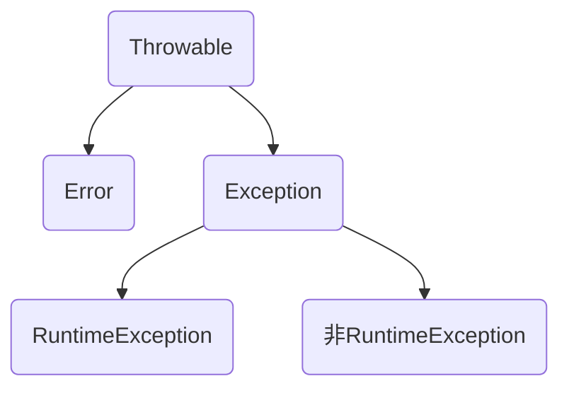
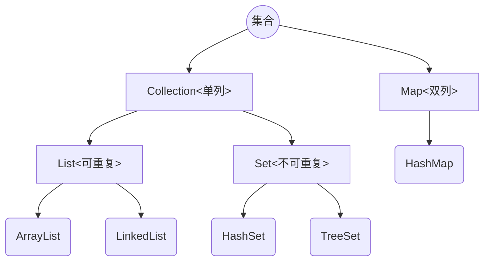
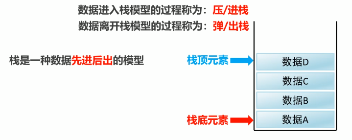
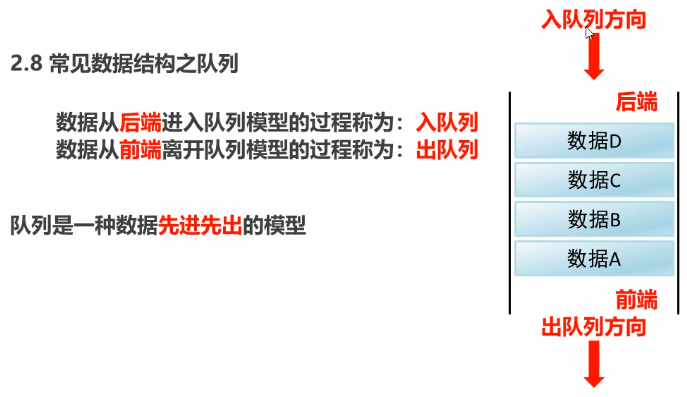
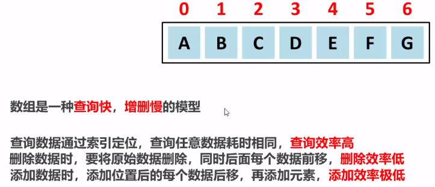
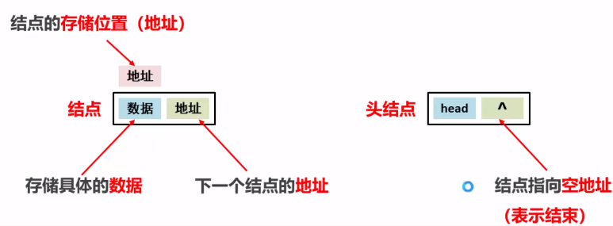
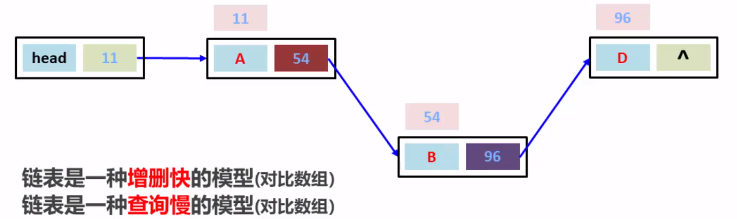
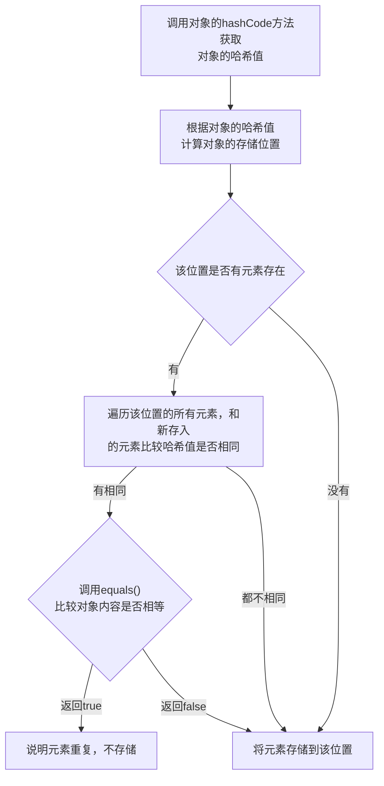
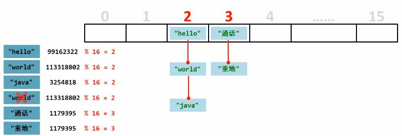

## 八、 抽象类

### 1.  概述

在Java中，一个**没有方法体**的方法应该定义为**抽象方法**，而类中如果有**抽象方法**，该类必须定义为**抽象类**。

```java
// abstract 关键字为抽象的意思，抽象类渴望被继承，不能被实例化
public abstract class Animal {
	public abstract eat();
}
```

### 2. 抽象类的特点

- 抽象类和抽象方法必须使用**abstract**关键字修饰
- 抽象类中不一定有抽象方法，有抽象方法的类一定是抽象类
- 抽象类不能实例化，其必须通过子类对象实例化，即多态方式
- 抽象类的子类要么重写抽象类中的所有抽象方法，要么其本身也是抽象类

### 3. 抽象类的成员特点

- 可以有成员变量，成员变量可以是变量也可以是常量
- 可以有构造方法，但是不能实例化，构造方法用于子类访问父类数据的初始化
- 可以有成员方法，可以是抽象的（限定子类必须完成某些动作）也可以是非抽象的（提高代码复用性）

## 九、 接口

### 1 .  概述

接口就是一种**公共的规范标准**，只要符合规范标准，大家都可以通用

Java中的接口更多的体现在**对行为的抽象**

```java
// 使用interface声明接口
public interface Interface {

}

// 通过implements关键字来实现接口，接口可以实现多个，实现接口必须实现所有抽象方法
public class InterfaceDemo implements Interface {}

// 接口也可以继承接口
public interface Interface1 extends Interface{}
```

### 2. 接口的特点

- 成员变量只能是常量，默认修饰符：**public static final**可以省略不写
- 接口没有构造方法，因为接口主要是对行为进行抽象，是没有具体的存在的，当一个类如果没有父类，默认继承自Object，所以当一个类没有父类时，构造方法里第一行无论显示还是隐式的super()调用的都是Object的无参构造方法，其是java中最顶层的父类
- 成员方法只能是抽象方法，默认修饰符为：**public abstract**可以省略

### 3. 类和接口的关系

- 类和类的关系：继承关系，只能单继承，但是可以多层继承
- 类和接口的关系：实现关系，可以单实现，也可以是多实现，还可以继承一个类的同时实现多个接口
- 接口和接口的关系：继承关系，可以单继承，也可以多继承

### 4. 抽象类和接口的区别

|      | 抽象类                                                 | 接口                                                 |
| ---- | ------------------------------------------------------ | ---------------------------------------------------- |
| 成员 | 变量，常量；<br />有构造方法<br />抽象方法和非抽象方法 | 常量<br />抽象方法                                   |
| 关系 | 类与类之间为继承关系，单继承                           | 接口与接口之间为继承关系，可以是单继承也可以是多继承 |
| 设计 | 对某类事物（类）抽象，包括属性、行为                   | 对行为抽象，主要是行为                               |

### 5. 形参与返回值问题

- 形参和返回值是类时，需要的都是该类及其子类的对象
- 形参和返回值是抽象类时，需要的是抽象类的子类对象
- 形参和返回值是接口时，需要的是该接口的实现类对象

## 十、 内部类

### 1. 概述

内部类：就是在一个类中定义另一个类。如在一个类A的内部定义一个类B，类B就被称为内部类

```java
public class 类名{
	修饰符 class 类名{
		
	}
}
```

内部类的访问特点：

- 内部类可以直接访问外部类的成员，包括私有
- 外部类要访问非静态内部类的成员，必须创建内部类的对象
- 外部类的加载及实例化并不会加载内部类，只有在第一次使用时才会加载和初始化，本质上JVM并不关心什么是内部类，Java语言编译器（例如javac、ECJ）在将Java源码编译到Class文件的过程中，将内部类做了“解糖”，给其添加一些必要的转换之后将其提升为跟顶层类一样的形式，然后后面就不再有内部类与否的区别了。

内部类的分类：

- 在类的成员位置：成员内部类
- 在类的局部位置：局部内部类

### 2.  成员内部类

```java
// 非静态内部类、常规内部类
// 外部类
public class Outer {
    // 内部类
    public class Inner {
        
    }
}

// 成员内部类的使用
// 外部类名.内部类名 对象名 = 外部类对象.内部类对象
Outer.Inner oi = new Outer().new Inner();

// 正常情况下非静态内部类通常用于隐藏某部分实现，因此常用private修饰，通过外部类的方法来访问内部类的方法
// 外部类
public class Outer {
    // 内部类
    private class Inner {
        public void show() {
            
        }
    }
    
    public void method() {
        Inner inner = new Inner();
        inner.show();
    }
}

// 静态内部类，通常也称为嵌套类
// 能从嵌套类的对象中访问非静态的外围类对象
public class Outer {
    // 内部类
    public static class Inner {
        public void show() {
            
        }
    }
}

// 此时要创建嵌套类的对象，并不需要外围类的对象
Outer.Inner oi = Outer.Inner();

// 正常情况下使用
public class Outer {
    // 内部类
    public static class Inner {
        private static void show() {
            
        }
    }
    
    public void method() {
        Inner.show();
    }
}
```

### 3. 局部内部类

```java
// 局部内部类是在方法中定义的类，所以外界是无法直接使用的，需要在方法内部创建对象并使用
// 该类可以直接访问外部类的成员，也可以访问方法内部的局部变量
// 外部类
public class Outer {
	private int num = 10;

    public void method() {
         // 局部内部类不能有权限修饰符
        class Inner {
     		public void show() {
				System.out.println(num);
            }
        }
        
        // 直接在方法中使用
        Inner i = new Inner();
        i.show();
    }
}
```

### 4. 匿名内部类（实际也是局部内部类）

前提：存在一个类或者接口，这里的类可以是具体类也可以是抽象类

```java
// 主要用于重写或实现方法，本质上是一个继承了该类或者实现了该接口的子类匿名对象
new 类名或接口名() {
	重写方法;
}

new Inner() {
    public void show() {
        
    }
}
```

## 十一、 常用API

### 1. Math

类`Math`包含用于执行基本数字运算的方法，其内部定义的变量和方法都是静态的，可以直接通过类名使用

| 方法名                                       | 说明                                                 |
| -------------------------------------------- | ---------------------------------------------------- |
| public static int abs(int a)                 | 返回`int`值的绝对值                                  |
| public static int max(int a, int b)          | 返回两个`int`值中较大的`int`                         |
| public static int min(int a, int b)          | 返回两个`int`值中较小的`int`                         |
| public static double floor(double a)         | 返回小于或等于参数的最大double值等于一个整数         |
| public static double ceil(double a)          | 返回大于或等于参数的最小double值等于一个整数         |
| public static long round(double a)           | 按照四舍五入返回最接近参数的int                      |
| public static double random()                | 返回带有正号的`double`值，大于或等于`0.0`且小于`1.0` |
| public static double pow(double a, double b) | 返回a的b此幂的值                                     |

### 2. System

| 方法名                                 | 说明                                                 |
| -------------------------------------- | ---------------------------------------------------- |
| public static void exit(int status)    | 终止当前运行的Java虚拟机，非零状态代码表示异常终止。 |
| public static long currentTimeMillis() | 以毫秒为单位返回当前时间。                           |

### 3. Object

类`Object`是类层次结构的根。每个类都可以将Object作为超类，所有类都直接或间接的继承自该类。

| 方法名                                     | 说明                                                         |
| ------------------------------------------ | ------------------------------------------------------------ |
| public String toString()                   | 返回对象的字符串表示形式。                                   |
| public boolean equals(Object obj)          | 指示某个其他对象是否“等于”此对象，通常需要在重写此方法时覆盖`hashCode`方法 |
| public int hashCode()                      | 返回对象的哈希码值                                           |
| public final Class<?> getClass()           | 返回此`Object`的运行时类                                     |
| protected Object clone()                   | 创建并返回此对象的副本。如果对象的类不支持`Cloneable`接口。  |
| public final void notify()                 | 唤醒正在此对象监视器上等待的单个线程。                       |
| public final void notifyAll()              | 唤醒等待此对象监视器的所有线程。                             |
| public final void wait()                   | 导致当前线程等待它被唤醒，通常是*通知*或*中断* 。            |
| public final void wait(long timeoutMillis) | 导致当前线程等待它被唤醒，通常是*通知*或*中断* ，或者直到经过一定时间后自动唤醒 |

### 4. Arrays

#### 4.1 冒泡排序

一种排序方式，对要进行排序的数据中相邻的数据进行两两比较，将较大的数据放在后面，一次对所有的数据进行操作，直至所有数据按要求完成排序。

```java
public class BubbleSort {

    public static void main (String[] args) {
        int[] arr = new int[]{32, 12, 3, 2, 123, 34, 21};

        bubbleSort(arr);
        print(arr);
    }

    public static void bubbleSort(int[] arr) {
        if(arr == null || arr.length <= 1) {
            return;
        }

        for (int i = 0; i < arr.length - 1; i++) {
            for (int j = 0; j < arr.length - i - 1; j++) {
                if (arr[j] > arr[j + 1]) {
                    arr[j] = arr[j] ^ arr[j + 1];
                    arr[j + 1] = arr[j] ^ arr[j + 1];
                    arr[j] = arr[j] ^ arr[j + 1];
                }
            }
        }
    }

    public static void print(int[] arr) {
        for(int i = 0; i < arr.length; i++) {
            System.out.print(arr[i] + "\t");
        }
    }
}
```

#### 4.2 Arrays常用方法

| 方法名                                   | 说明                                                         |
| ---------------------------------------- | ------------------------------------------------------------ |
| public static void sort(int[] a)         | 将指定的数组按升序排序。                                     |
| public static String toString(int[] a)   | 返回指定数组内容的字符串表示形式。 字符串表示由数组元素的列表组成，用方括号括起来（ `"[]"` ）。 相邻元素由字符`", "` （逗号后跟空格）分隔。 |
| public static <T> List<T> asList(T... a) | 返回由指定数组支持的固定大小的列表，其只是指定数组的列表视图，并不是真正的列表，无列表的add和remove方法 |

### 5. 基本类型包装类

#### 5.1 概述

将基本类型封装成对象的好处在于可以在对象中定义更多的功能方法操作该数据。

常用操作之一：用于基本类型与字符串之间的转换

| 基本数据类型 | 包装类    |
| ------------ | --------- |
| byte         | Byte      |
| short        | Short     |
| int          | Integer   |
| long         | Long      |
| float        | Float     |
| double       | Double    |
| char         | Character |
| boolean      | Boolean   |

#### 5.2 Integer类创建

```java
// 返回表示指定的 int值的 Integer实例
// 自动装箱实际也是调用此方法
Integer.valueOf(int i)
// 返回一个 Integer实例，字符串中必须是数字
Integer.valueOf(String s)
// 返回 Integer对象，第二个参数为表名字符串内的数字的进制
Integer.valueOf(String s, int radix)
```

#### 5.3 int和Sring的相互转换

```java
// 通过加号
int number = 18;
String s = number + "";

// 通过String API
String s1 = String.valueOf(number);

// 通过先转成Integer再转
Integer i = Integer.valueOf(s1);
// 自动拆箱实际也调用了该方法
int x = i.intValue();

// 字符串直接转成int
int x1 = Integer.parseInt(s);
```

#### 5.4 自动装箱和拆箱

- 装箱：把基本数据类型转换为对应的包装类类型

- 拆箱：把包装类类型转换为对应的基本数据类型

  ```java
  // 如果对包装类型进行操作，最好对包装类进行null值判断
  // 自动装箱
  // Integer i = Integer.valueOf(100);
  Integer i = 100;
  
  // 自动拆箱
  // int x = i.intValue();
  int x = i;
  ```

  

### 6. 日期类

####  6.1 Date类构造方法

| 构造方法                                                     | 说明                                                         |
| ------------------------------------------------------------ | ------------------------------------------------------------ |
| **[Date](https://www.apiref.com/java11-zh/java.base/java/util/Date.html#())**() | 分配 `Date`对象并对其进行初始化，使其表示分配时间，精确到毫秒，当前时间。 |
| **[Date](https://www.apiref.com/java11-zh/java.base/java/util/Date.html#(long))**(long date) | 分配 `Date`对象并初始化为表示从自标准基准时间（称为“纪元”）以来的指定毫秒数，即1970年1月1日00:00:00 GMT。 |

#### 6.2 Date类常用方法

| 方法名                         | 说明                                                         |
| ------------------------------ | ------------------------------------------------------------ |
| public long getTime()          | 返回自此 `Date`对象表示的1970年1月1日00:00:00 GMT以来的毫秒数。 |
| public void setTime(long time) | 将此 `Date`对象设置为表示格林威治标准时间1970年1月1日00:00:00之后的 `time`毫秒的时间点。 |

#### 6.3 SimpleDateFormat类

SimpleDateFormat是一个具体的类，用于以区域设置敏感的方式格式化和解析日期。

常用的模式字母及对应关系：

| 字母 | 说明            |
| ---- | --------------- |
| y    | 年              |
| M    | 月              |
| d    | 日              |
| H    | 小时， 24小时制 |
| h    | 小时，12小时制  |
| m    | 分              |
| s    | 秒              |
| S    | 毫秒            |

#### 6.4 SimpleDateFormat的构造方法

| 方法名                                  | 说明                                                   |
| --------------------------------------- | ------------------------------------------------------ |
| public SimpleDateFormat()               | 构造一个`SimpleDateFormat`使用默认模式和日期格式       |
| public SimpleDateFormat(String pattern) | 构造一个`SimpleDateFormat`使用给定的模式和默认日期格式 |

#### 6.5 格式化和解析日期

| 方法名                                | 说明                               |
| ------------------------------------- | ---------------------------------- |
| public final String format(Date date) | 将日期格式化成日期/时间字符串      |
| public Date parse(String source)      | 从给定字符串的开始即系文本生成日期 |

#### 6.6 工具类

```
public class DateUtils extends org.apache.commons.lang3.time.DateUtils
{
    public static String YYYY = "yyyy";

    public static String YYYY_MM = "yyyy-MM";

    public static String YYYY_MM_DD = "yyyy-MM-dd";

    public static String YYYYMMDDHHMMSS = "yyyyMMddHHmmss";

    public static String YYYY_MM_DD_HH_MM_SS = "yyyy-MM-dd HH:mm:ss";
    
    private static String[] parsePatterns = {
            "yyyy-MM-dd", "yyyy-MM-dd HH:mm:ss", "yyyy-MM-dd HH:mm", "yyyy-MM", 
            "yyyy/MM/dd", "yyyy/MM/dd HH:mm:ss", "yyyy/MM/dd HH:mm", "yyyy/MM",
            "yyyy.MM.dd", "yyyy.MM.dd HH:mm:ss", "yyyy.MM.dd HH:mm", "yyyy.MM"};

    /**
     * 获取当前Date型日期
     * 
     * @return Date() 当前日期
     */
    public static Date getNowDate()
    {
        return new Date();
    }

    /**
     * 获取当前日期, 默认格式为yyyy-MM-dd
     * 
     * @return String
     */
    public static String getDate()
    {
        return dateTimeNow(YYYY_MM_DD);
    }

    public static final String getTime()
    {
        return dateTimeNow(YYYY_MM_DD_HH_MM_SS);
    }

    public static final String dateTimeNow()
    {
        return dateTimeNow(YYYYMMDDHHMMSS);
    }

    public static final String dateTimeNow(final String format)
    {
        return parseDateToStr(format, new Date());
    }

    public static final String dateTime(final Date date)
    {
        return parseDateToStr(YYYY_MM_DD, date);
    }

    public static final String parseDateToStr(final String format, final Date date)
    {
        return new SimpleDateFormat(format).format(date);
    }

    public static final Date dateTime(final String format, final String ts)
    {
        try
        {
            return new SimpleDateFormat(format).parse(ts);
        }
        catch (ParseException e)
        {
            throw new RuntimeException(e);
        }
    }

    /**
     * 日期路径 即年/月/日 如2018/08/08
     */
    public static final String datePath()
    {
        Date now = new Date();
        return DateFormatUtils.format(now, "yyyy/MM/dd");
    }

    /**
     * 日期路径 即年/月/日 如20180808
     */
    public static final String dateTime()
    {
        Date now = new Date();
        return DateFormatUtils.format(now, "yyyyMMdd");
    }

    /**
     * 日期型字符串转化为日期 格式
     */
    public static Date parseDate(Object str)
    {
        if (str == null)
        {
            return null;
        }
        try
        {
            return parseDate(str.toString(), parsePatterns);
        }
        catch (ParseException e)
        {
            return null;
        }
    }
    
    /**
     * 获取服务器启动时间
     */
    public static Date getServerStartDate()
    {
        long time = ManagementFactory.getRuntimeMXBean().getStartTime();
        return new Date(time);
    }

    /**
     * 计算相差天数
     */
    public static int differentDaysByMillisecond(Date date1, Date date2)
    {
        return Math.abs((int) ((date2.getTime() - date1.getTime()) / (1000 * 3600 * 24)));
    }

    /**
     * 计算两个时间差
     */
    public static String getDatePoor(Date endDate, Date nowDate)
    {
        long nd = 1000 * 24 * 60 * 60;
        long nh = 1000 * 60 * 60;
        long nm = 1000 * 60;
        // long ns = 1000;
        // 获得两个时间的毫秒时间差异
        long diff = endDate.getTime() - nowDate.getTime();
        // 计算差多少天
        long day = diff / nd;
        // 计算差多少小时
        long hour = diff % nd / nh;
        // 计算差多少分钟
        long min = diff % nd % nh / nm;
        // 计算差多少秒//输出结果
        // long sec = diff % nd % nh % nm / ns;
        return day + "天" + hour + "小时" + min + "分钟";
    }
}
```

#### 6.7 Calendar类

Calendar是为某一时刻和一组日历字段之间的转换提供了一些方法，并为操作日历字段提供了一些方法。

Calendar提供了一个类方法getInstance用于获取Calendar对象，其日历字段已使用当前日期和时间初始化：`Calendar rightNow = Calendar.getInstance()`

| 方法名                                                | 说明                                                   |
| ----------------------------------------------------- | ------------------------------------------------------ |
| public int get(int field)                             | 返回给定日历字段的值                                   |
| public abstract void add(int field, int amount)       | 根据日历的规则，将指定的时间量添加或减去给定的日历字段 |
| public final void set(int year, int mounth, int date) | 设置当前日历的年月日                                   |

## 十二、 异常

### 1. 概述

异常：就是程序出现了不正常的情况

异常体系：



Error：严重问题，不需要处理，一般也处理不了，如硬件问题之类

Exception：称为异常类，它表示程序本身可以处理的问题

- RuntimeException：在编译期是不检查的，出现问题后，需要修改代码
- 非RuntimeException：编译期就必须处理，否则程序不能通过编译，就更不能正常运行

### 2. JVM的默认处理方案

如果程序出现了问题，我们没有做任何处理，最终JVM会做默认的处理

- 把异常的名称、异常的原因及异常出现的位置等信息输出在了控制台
- 程序停止执行

### 3. 异常处理

如果程序出现了问题，处理方式有两种：

- try…catch..

  ```java
  // 执行流程：
  // 程序从try里面的代码开始执行
  // 出现异常会自动生成一个异常类对象，该异常对象将被提交给Java运行时系统
  // 当Java运行时系统接收到异常类对象时，会到catch中去找匹配的异常类，找到后进行异常的处理
  // 执行完毕之后，程序还可以继续往下执行
  try {
  	// 可能出现异常的代码
  }catch (异常类名 变量名) {
      // 异常处代码
  }finally {
      // 此处代码一定会执行，常用于关闭资源
  }
  ```

- throws

  虽然有try..catch..可以处理异常进行处理，但是并不是所有的情况我们都有权限进行异常的处理，也就是说有些时候出现的异常是处理不了的，此时我们采用throws的处理方案

  ```java
  // 此格式跟在方法的括号后面，意思为将异常往上层方法中抛出，由上层来决定是否继续抛出还是解决，如果都不处理，最后将由jvm来处理，结果就是打印异常信息，结束程序运行
  throws 异常类名
  ```

### 4. Throwable的成员方法

| 方法名                        | 说明                            |
| ----------------------------- | ------------------------------- |
| public String getMessage()    | 返回此throwable的详细消息字符串 |
| public String toString()      | 返回此刻抛出的简短描述          |
| public void printStackTrace() | 把异常的错误信息输出在控制台    |

### 5. 编译时异常和运行时异常的区别

Java中的异常被分为两大类：**编译时异常**和**运行时异常**，也被称为**受检查异常**和**非受检异常**，所有的RuntimeException类及其子类被称为运行时异常，其他的异常都是编译时异常。

- 编译时异常：必须显示处理，否则程序就会发生错误，无法通过编译
- 运行时异常：无需显示处理，也可以和编译时异常一样处理

### 6. 自定义异常

```java
public class 异常类名 extends Exception {
    // 无参构造
    // 带参构造
}

public class ScoreException extends Exception {
    public ScoreException() {}
    
    public ScoreException(String message) {
        super(message)
    }
}

// 在需要抛出异常时使用此语句
throw new ScoreException("分数异常");
```

Throws和throw的区别

| throws                                       | throw                              |
| -------------------------------------------- | ---------------------------------- |
| 用在方法声明后面跟的是异常类名               | 用在方法体内，跟的是异常对象       |
| 表示抛出异常，由该方法的调用者来处理         | 表示抛出异常，由方法体内的语句处理 |
| 表示出现异常的一种可能性，并不一定会发生异常 | 执行throw一定抛出了某种异常        |

## 十三、集合框架

### 1. 概述

集合类的特点：提供一种存储空间可变的存储模型，存储的数据容量可以随时发生改变

### 2. 集合类体系结构



### 3. Collection

#### 3.1 概述

Collection集合：

- 单列集合的顶层接口，它表示一组对象，这些对象也称为Collection的元素
- JDK不提供此接口的任何直接实现，它提供更具体的子接口（如Set和List）实现

#### 3.2 Collection集合对象的创建和基本使用

- 多态的方式

- 具体的实现类ArrayList

  ```java
  // 创建
  Collection<String> c = new ArrayList<String>();
  
  // 添加元素
  c.add("hello");
  c.add("world");
  c.add("java");
  
  // 打印集合,[hello, word, java]
  System.out.println(c);
  ```

#### 3.3 Collection集合常用方法

| 方法名                     | 说明                               |
| -------------------------- | ---------------------------------- |
| boolean add(E e)           | 添加元素                           |
| boolean remove(E e)        | 从集合中移除指定元素               |
| void clear()               | 清空集合中的元素                   |
| boolean contains(Object o) | 判断集合中是否存在指定的元素       |
| boolean isEmpty()          | 判断集合是否为空                   |
| int size()                 | 集合的长度，也就是集合中元素的个数 |

#### 3.4 Collection集合的遍历

Iterator：迭代器，集合的专用遍历方式

- Iterator<E> iteratior()：返回此集合中元素的迭代器，通过集合的 iteratior()方法得到
- 迭代器是通过集合的 iteratior()方法得到，所以说它是依赖于集合而存在的

Iterator中的常用方法：

- E next()：返回迭代器中的下一个元素
- boolean hasNext()：如果迭代器具有更多元素，返回true

```java
// 创建
Collection<String> c = new ArrayList<String>();

// 添加元素
c.add("hello");
c.add("world");
c.add("java");

// 创建迭代器
Iterator<String> it = c.iterator();
while(it.hasNext()) {
    System.out.println(it.next());
}
```

### 4. List

#### 4.1 概述

概述：

- 有序集合（序列），用户可以精确控制列表中每个元素的插入位置，也可以通过整数索引访问元素，并搜索列表中的元素
- 与Set集合不同，列表通常允许重复的元素

特点：

- 有序：存储和取出的元素顺序一致
- 可重复：存储的元素可以重复

#### 4.2 List集合特有方法

| 方法名                         | 说明                                   |
| ------------------------------ | -------------------------------------- |
| void add(int index, E element) | 此集合中的指定位置插入指定的元素       |
| E remove(int index)            | 删除指定索引处的元素，返回被删除的元素 |
| E set(int index, E element)    | 修改指定索引处的元素，返回被修改的元素 |
| E get(int index)               | 返回指定索引处的元素                   |

#### 4.3 并发修改异常

```java
List<String> list = new ArrayList<String>();

list.add("hello");
list.add("world");
list.add("java");

// 会报并发修改异常，因为在循环体中添加了元素，但是itr.next()时会判断集合是否修改过，修改过则报错
// next()方法每次都会做预期修改值和实际修改值是否一样的判断
Iterator itr = list.iterator();
while(itr.hasNext()){
    String s7 = (String) itr.next();
    if(s7.equals("world")) {
        list.add("javaee");
    }
}

// 使用for循环可以解决此问题
 for(int i = 0; i < list.size(); i++) {
     if("world".equals(list.get(i))) {
         list.add("javaee");
     }
 }
```

#### 4.4 ListIterator

ListIterator：列表迭代器

- 通过List集合的listIterator()方法得到，所以他是List集合特有的迭代器
- 允许程序沿任一方向遍历列表的列表迭代器，在迭代期间修改列表，并获取列表中迭代器的当前位置

ListIterator中的常用方法

| 方法                  | 说明                                                         |
| --------------------- | ------------------------------------------------------------ |
| E next()              | 返回迭代中的下一个元素                                       |
| boolean hasNext()     | 如果迭代器具有更多元素，则返回true                           |
| E previos()           | 返回迭代中的上一个元素                                       |
| boolean hasPrevious() | 如果迭代器在反方向遍历列表时具有更多元素，则返回true         |
| void add(E e)         | 将指定的元素插入列表，添加后会将**实际修改值**赋值给**预期修改值** |

#### 4.5 增强for循环

增强for：简化数组和Collection集合的遍历

- 实现Iterable接口的类允许其对象成为增强型for语句的目标
- JDK5之后新增，其内部原理是一个Iterator迭代器

```java
for(元素数据类型 变量名：数组或者Collection集合) {
	// 在此处使用变量即可，该变量就是元素
}

// 其内部原理是一个Iterator迭代器，也会有并发修改异常
int[] arr = {1, 2, 3, 4, 5};
for(int i : arr) {
	System.out.println(i);
}
```

#### 4.6 数据结构

数据结构是计算机存储、组织数据的方式。是指相互之间存在一种或多种特定关系的数据元素的集合。通常情况下，精心选择的数据结构可以带来更高的运行或者存储效率。

#### 4.7  栈



#### 4.8 队列



#### 4.9 数组



#### 4.10 链表





#### 4.11 List集合子类特点

List集合常用子类：ArrayList、LinkedList

- ArrayList：底层数据结构是数组，查询快，增删慢
- LinkedList：底层数据结构是链表，查询慢，增删快

#### 4.12 LinkedList集合的特有功能

| 方法名                    | 说明                             |
| ------------------------- | -------------------------------- |
| public void addFirst(E e) | 在该列表开头插入指定的元素       |
| public void addLast(E e)  | 在该列表末尾追加元素             |
| public E getFirst()       | 返回此列表中的第一个元素         |
| public E getLast()        | 返回此列表中的最后一个元素       |
| public E removeFirst()    | 从此列表中删除并返回第一个元素   |
| public E removeLast()     | 从此列表中删除并返回最后一个元素 |

### 5. Set

#### 5.1 Set集合特点

- 不包含重复元素的集合
- 没有带索引的方法，所以不能使用普通for循环遍历

#### 5.2 哈希值

哈希值：是JDK根据对象的**地址**或者**字符串**或者**数字**算出来的int类型的**数值**。

Object中的**public int hashCode()**方法可以返回**对象的哈希值**。

特点：

- 同一个对象多次调用**hashCode()**方法返回的哈希值是相同的
- 默认情况下，不同对象的哈希值是不相同的
- 通过方法重写，可以实现不同对象的哈希值是相同的

#### 5.3 HashSet特点

- 底层数据结构是哈希表
- 对集合的迭代顺序不作任何保证，也就是说不保证存储和取出的元素顺序一致
- 没有带索引的方法，所以不能使用普通for循环
- 由于是Set集合，所以是不包含重复元素的集合

#### 5.4 HashSet集合保证元素唯一性方法

HashSet集合存储元素要保证唯一性，需要重写**hashCode()**和**equals()**方法，添加元素过程：



#### 5.5 哈希表

- JDK8之前，底层采用**数组+链表**实现，可以说是一个元素为链表的数组
- JDK8以后，在长度比较长的时候，底层使用了红黑树实现了优化



#### 5.6 LinkedHashSet特点

- 哈希表和链表实现的Set接口，具有可预测的迭代次序
- 由链表保证元素有序，也就是说元素的存储和取出顺序是一致的
- 由哈希表保证元素唯一，也就是说没有重复的元素

#### 5.7 TreeSet特点

- 元素有序，这里的顺序不是指存储和取出顺序，而是按照一定的规则进行排序，具体排序方式取决于构造方法
  - TreeSet()：根据元素的自然排序进行排序
  - TreeSet(Comparator comparator)：根据指定的比较器进行排序
- 没有带索引的方法，所以不能使用普通for循环遍历
- 由于是Set集合，所以不包含重复元素的集合

#### 5.8 自然排序Comparable的使用

- 使用TreeSet的无参构造方法
- 对象必须实现Comparable接口
- 实现compareTo方法， 返回值为 1-放后面,0-相等,-1-放前面，**等于0**时表示相等，但是set又不能放重复元素，所以不能简单的只比较某个属性，应该所有的属性按主次来比较

#### 5.9 比较器排序Comparator的使用

- 使用TreeSet的带参构造方法
- 并在构造方法中传入Comparator比较器， 返回值为 1-放后面,0-相等,-1-放前面，**等于0**时表示相等，但是set又不能放重复元素，所以不能简单的只比较某个属性，应该所有的属性按主次来比较

### 6. 泛型

#### 6.1 概述

其在JDK5中引入，提供了编译时类型安全检测机制，该机制允许在编译时检测到非法的类型。

本质是**参数化类型**，也就是说操作的数据类型被指定为一个参数。

参数化类型，顾名思义就是**将类型由原来的具体的类型参数化，然后再使用/调用时传入具体的类型**。

这种参数类型可以用在类、方法和接口，分别被称为泛型类，泛型方法、泛型接口。

格式：

- <类型>：指定一种类型的格式，这里的类型可以看成是形参
- <类型1，类型2…>：指定多种类型的格式，多种类型之间用逗号隔开。也可以看成是形参
- 将来具体调用时给定的类型可以看成是实参，并且实参的类型只能是引用数据类型，调用时如果不传具体类型，则默认为Object类型

好处：

- 把运行时期的问题提前到了编译期间
- 避免了强制类型转换

#### 6.2 泛型类

```java
// 修饰符 class 类名<类型>{}
// 下面的T可以随便写为任意标识，常见的如T、E、K、V等形式的参数常用于标识泛型
public class Generic<T> {}
```

#### 6.3 泛型方法

```java
// 泛型方法表示该方法的形参可以接收任意类型的数据
// 修饰符<类型> 返回值类型  方法名(类型 变量名){  }
// 注意和泛型类中方法使用泛型区分，主要是方法修饰符后面的区别
// 使用泛型可以替代方法重载
public <T>  void show(T t) {}
```

#### 6.4 泛型接口

```java
// 修饰符 interface 类名<类型>{}
public interface Generic<T> {}
```

#### 6.5 类型通配符

为了表示各种泛型List的父类，可以使用类型通配符

* 类型通配符：**<?>**
* List<?>：表示元素类型未知的List，它的元素可以匹配任何类型
* 这种带通配符的List仅表示它是各种泛型List的父类，并不能把元素添加到其中

如果不希望List<?>是任何泛型List的父类，只希望她代表某一类泛型List的父类，可以使用类型通配符的上限：

- 类型通配符上限：**<? extends 类型>**
- List<? extends Number>：表示类型是**Number或者其子类型**

类型通配符的下限：

- 类型通配符下限：**<? super 类型>**
- List<? super Number>：表示类型是**Number或者父类型**

### 7. 可变参数

可变参数又称参数个数可变，用作方法的形参出现，那么方法参数个数就是可变的。

- 可变参数其实是一个数组
- 如果一个方法有多个参数，包含可变参数，**可变参数要放在最后**

```java
// 修饰符 返回值类型 方法名(数据类型... 方法名){}
// 内部会将方法调用时传入的参数封装成一个数组
public static sum(int... a){}
```

### 8. Map

#### 8.1 概述

- Map<K, V>是一个接口，K是键的类型，V是值的类型
- 将键映射到值的对象，不能包含重复的键，每个键可以映射到最多一个值

```java
Map<String, String> map = new HashMap<String, String>();

map.put("01", "curry");
map.put("02", "kobe");
map.put("03", "james");
map.put("03", "allen");

System.out.println(map);
```

#### 8.2 Map集合的基本功能

| 方法名                              | 说明                                 |
| ----------------------------------- | ------------------------------------ |
| V put(K key,V value)                | 添加元素                             |
| V remove(Object  key)               | 根据键删除键值对元素                 |
| void clear()                        | 移除所有的键值对元素                 |
| boolean contrainsKey(Object key)    | 判断集合是否包含指定的键             |
| boolean containsValue(Object value) | 判断集合是否包含指定的值             |
| boolean isEmpty()                   | 判断集合是否为空                     |
| int size()                          | 集合的长度，也就是集合中键值对的个数 |

#### 8.3 Map集合的获取功能

| 方法名                          | 说明                     |
| ------------------------------- | ------------------------ |
| V get(Object key)               | 根据键获取值             |
| Set<K> keySet()                 | 获取所有键的集合         |
| Collection<V> values()          | 获取所有值的集合         |
| Set<Map.Entry<K, V>> entrySet() | 获取所有键值对对象的集合 |

#### 8.4 Map集合的遍历

```java
Map<String, String> map = new HashMap<String, String>();

map.put("01", "curry");
map.put("02", "kobe");
map.put("03", "james");
map.put("03", "allen");

Set<String> keySet = map.keySet();
for(String key : keySet) {
    System.out.println(map.get(key));
}

Set<Map.Entry<String, String>> entrySet = map.entrySet();
for(Map.Entry<String, String> entry : entrySet) {
    System.out.println(entry.getKey() + ", " + entry.getVlue());
}
```

### 9. Collections

Collections类是针对集合操作的工具类。

常用方法有：

| 方法                                                         | 说明                                                         |
| ------------------------------------------------------------ | ------------------------------------------------------------ |
| public static <T extends [Comparable](https://www.apiref.com/java11-zh/java.base/java/lang/Comparable.html)<? super T>> void sort([List](https://www.apiref.com/java11-zh/java.base/java/util/List.html)<T> list) | 根据其元素的[natural ordering](https://www.apiref.com/java11-zh/java.base/java/lang/Comparable.html) ，将指定列表按升序排序。 |
| public static <T> void sort(List<T> list, Comparator<? super T> c) | 根据指定比较器引发的顺序对指定列表进行排序。                 |
| public static void reverse(List<?> list)                     | 反转指定列表中元素的顺序。                                   |
| public static void shuffle(List<?> list)                     | 使用默认的随机源随机置换指定的列表。                         |

