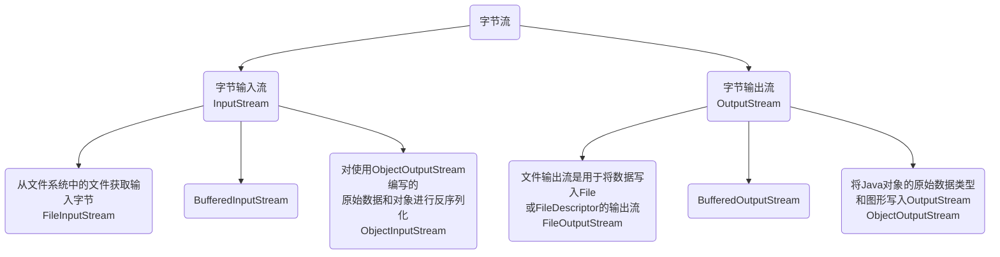
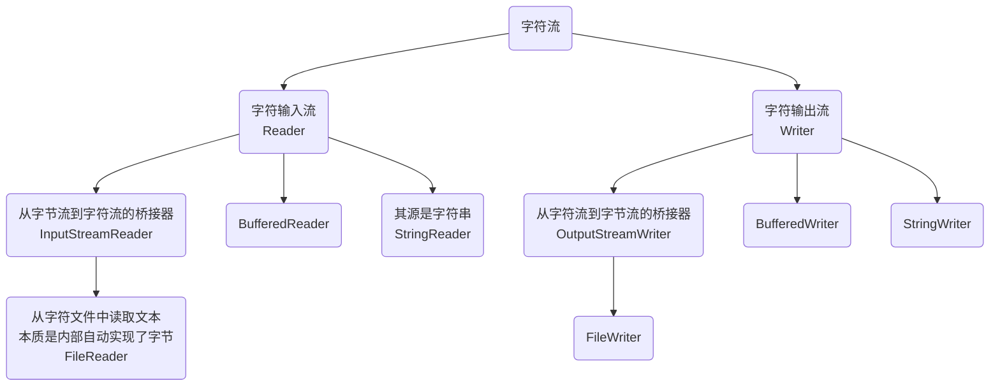
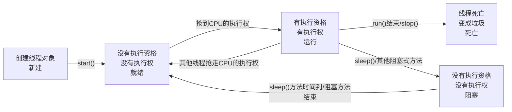

## 十四、 IO流

### 1. File

#### 1.1 概述和构造方法

File：它是文件和目录路径名的抽象表示

- 文件和目录是可以通过File封装成对象的
- 对于File而言，其封装的并不是一个真正存在的文件，仅仅是一个路径名而已。它可以是存在的，也可以是不存在的。将来是要通过具体的操作把这个路径的内容转换为具体存在的。

构造方法：

| 方法名                                                       | 说明                                                         |
| ------------------------------------------------------------ | ------------------------------------------------------------ |
| **[File](https://www.apiref.com/java11-zh/java.base/java/io/File.html#(java.lang.String))**([String](https://www.apiref.com/java11-zh/java.base/java/lang/String.html) pathname) | 通过将给定的路径名字符串转换为抽象路径名来创建新的 `File`实例。 |
| **[File](https://www.apiref.com/java11-zh/java.base/java/io/File.html#(java.lang.String,java.lang.String))**([String](https://www.apiref.com/java11-zh/java.base/java/lang/String.html) parent, [String](https://www.apiref.com/java11-zh/java.base/java/lang/String.html) child) | 从父路径名字符串和子路径名字符串创建新的 `File`实例。        |
| **[File](https://www.apiref.com/java11-zh/java.base/java/io/File.html#(java.io.File,java.lang.String))**([File](https://www.apiref.com/java11-zh/java.base/java/io/File.html) parent, [String](https://www.apiref.com/java11-zh/java.base/java/lang/String.html) child) | 从父抽象路径名和子路径名字符串创建新的 `File`实例。          |
| **[File](https://www.apiref.com/java11-zh/java.base/java/io/File.html#(java.net.URI))**([URI](https://www.apiref.com/java11-zh/java.base/java/net/URI.html) uri) | 通过将给定的 `file:` URI转换为抽象路径名来创建新的 `File`实例。 |

```java
// 并未要求一定存在
// 三者输出都为：E:\demo\java.txt
File f1 = new File("E:/demo/java.txt");
System.out.println(f1);

File f2 = new File("E:/demo", "java.txt");
System.out.println(f2);

File f3 = new File("E:/demo");
File f4 = new File(f3, "java.txt");
System.out.println(f4);
```

#### 1.2 File类创建功能

| 方法名                                            | 说明                                                         |
| ------------------------------------------------- | ------------------------------------------------------------ |
| public boolean createNewFile() throws IOException | 当且仅当具有此名称的文件尚不存在时，以原子方式创建由此抽象路径名命名的新空文件。 |
| public boolean mkdir()                            | 创建此抽象路径名指定的目录。                                 |
| public boolean mkdirs()                           | 创建此抽象路径名指定的目录，包括任何必需但不存在的父目录。   |

```java
// 路径为相对路径时，默认java运行时默认的工作目录为当前目录，/开始为根路径
File f1 = new File("E:/demo/java");
// 返回true/false，会自动创建不存在的上级目录，该目录存在是返回false
f1.mkdirs();

// 返回true/false，父目录不存在或该目录已存在时返回false，不会报错
f1.mkdir();

// 目录必须存在，否则报错，如果文件不存在，就创建文件，返回true，如果文件存在就不创建，返回false
f1.createNewFile();

```

#### 1.3 File类判断和获取功能

| 方法名                          | 说明                                                         |
| ------------------------------- | ------------------------------------------------------------ |
| public boolean isDirectory()    | 测试此抽象路径名表示的文件是否为目录                         |
| public boolean isFile()         | 测试此抽象路径名表示的文件是否为普通文件                     |
| public boolean exists()         | 测试此抽象路径名表示的文件或目录是否存在                     |
| public String getAbsolutePath() | 返回此抽象路径名的绝对路径名字符串                           |
| public String getPath()         | 将此抽象路径名转换为路径名字符串                             |
| public String getName()         | 返回此抽象路径名表示的文件或目录的名称                       |
| public String[] list()          | 返回一个字符串数组，用于命名此抽象路径名表示的目录中的文件和目录 |
| public File[] listFiles()       | 返回一个抽象路径名数组，表示此抽象路径名表示的目录中的文件   |

#### 1.4 File类删除功能

| 方法名                  | 说明                                                         |
| ----------------------- | ------------------------------------------------------------ |
| public boolean delete() | 删除此抽象路径名表示的文件或目录。 **如果此路径名表示目录，则该目录必须为空才能被删除** |

### 2. 字节流

#### 2.1 IO流概述和分类

IO流概述：

- IO：输入/输出（Input/Output）
- 流：是一种抽象概念，是对数据传输的总称。也就是说数据在设备间的传输称为流，流的本质是数据传输
- IO流就是用来处理设备间数据传输问题的：文件复制、文件上传、文件下载

分类：

- 按照数据的流向：
  - 输入流（输入到内存）：读数据
  - 输出流（从内存输出）：写数据
- 按照数据类型来分：
  - 字节流：
    - 字节输入流、字节输出流
  - 字符流：
    - 字符输入流、字符输出流

#### 2.2 字节流写数据

字节流抽象基类：

- InputStream：这个抽象类是表示字节输入流的所有类的超类
- OutputStream：这个抽象类是表示字节输出流的所有类的超类
- 子类特点：子类名称都是以其父类名作为子类名的后缀

```java
// 使用FileOutputStream（文件输出流）将数据写入File
// FileOutpuStream(String name)：创建文件输出流以指定的名称写入文件
// 创建字节输出流对象
// 做了三件事：
//      1. 调用系统功能创建了文件，默认情况下会覆盖已有文件
//      2. 创建了字节输出流对象
//      3. 让字节输出流对象指向创建好的文件
FileOutputStream stream = new FileOutputStream("javase/java.txt");

// void write(int b)：将指定的字节写入此文件输出流
stream.write(97);

// write(byte[] b)：将b.length字节从指定的字节数组写入输出流
// byte[] bytes = {97, 98, 99, 100, 101};
// String中byte[] getBytes()
byte[] bytes = "abcde".getBytes();
stream.write(bytes);

// write(byte[] b, int off, int len)：将len字节从指定的字节数开始，从偏移量off开始写入输出流
byte[] bytes1 = "abcdef".getBytes();
stream.write(bytes1, 2, 3);

// 最后释放资源
// void flush()：刷新此输出流并强制写出任何缓冲的输出字节
// void close()：关闭此文件输出流并释放与此流相关联的任何系统资源
stream.flush();
stream.close();
```

#### 2.4 字节流写数据的3种方式

| 方法                              | 说明                                                         |
| --------------------------------- | ------------------------------------------------------------ |
| void write(int b)                 | 将指定的字节写入输出流<br>一次写一个字节数据                 |
| write(byte[] b)                   | 将b.length字节从指定的字节数组写入输出流<br>一次写一个字节数组数据 |
| write(byte[] b, int off, int len) | 将len字节从指定的字节数开始，从偏移量off开始写入输出流<br>一次写一个字节数组的部分数据 |

#### 2.5 字节流写数据问题

```java
// 处理异常
FileOutputStream stream;
try{
    // 追加写入
    // FileOutputStream(String name, boolean append)：创建文件输出流以写入具有指定名称的文件，第二个参数为true，则字节将写入文件的末尾而不是开头
    stream = new FileOutputStream("javase/java.txt", true);

    // 换行问题
    //      windows：\r\n
    //      linux：\n
    //      mac：\r
    for (int i = 0; i < 10; i++) {
        stream.write("hello".getBytes());
        stream.write("\r\n".getBytes());
    }
}catch (IOException e) {
    e.printStackTrace();
}finally {
    // finally一般用于执行所有清除操作，如IO流的释放资源
    // finally块中的语句一定会执行，除非JVM退出
    try {
        if (stream != null) {
            stream.flush();
        }
    } catch (IOException e) {
        e.printStackTrace();
    }
    try {
        if (stream != null) {
            stream.close();
        }
    } catch (IOException e) {
        e.printStackTrace();
    }
}

// try-with-resources方式
// try-with-resources 是JDK 7中一个新的异常处理机制，它能够很容易地关闭在 try-catch 语句块中使用的资源
// try-with-resources 语句确保了每个资源在语句结束时关闭。所有实现了 java.lang.AutoCloseable 接口（其中，它包括实现了 java.io.Closeable 的所有对象），可以使用作为资源。
 try (FileOutputStream stream = new FileOutputStream("javase/java.txt", true)) {

 }  catch (IOException e) {
     e.printStackTrace();
 }
```

#### 2.6 字节流读数据（一次读一个字节数据）

```java
// FileInputStream:从文件系统中的文件获取输入字节
// FileInputStream(String name)：通过打开与实际文件的连接来创建 FileInputStream ，该文件由文件系统中的路径名 name命名。
// 创建字节输入流对象
try (FileInputStream stream = new FileInputStream("javase/java.txt")) {
    int read;
    // 调用字节流对象的读数据方法，一次读取一个字节
    while ( (read = stream.read()) != -1) {
        System.out.println((char) read);
    }
    
    // 一次读完数据
    // int available()：返回可以从此输入流中读取（或跳过）的剩余字节数的估计值
    byte[] bytes = new byte[stream.available()];
    stream.read(bytes);
    System.out.println(new String(bytes));
} catch (IOException e) {
    e.printStackTrace();
}

// 复制文件
try (FileInputStream stream = new FileInputStream("javase/java.txt");
             FileOutputStream outputStream = new FileOutputStream("javase/java-copy.txt")
        ) {
            byte[] bytes = new byte[stream.available()];
            stream.read(bytes);
            outputStream.write(bytes);
        } catch (IOException e) {
            e.printStackTrace();
        }

```

#### 2.7 字节流读数据的3中方法

| 方法                                        | 说明                                                         |
| ------------------------------------------- | ------------------------------------------------------------ |
| public int read()                           | 从此输入流中读取一个字节的数据。 如果尚未提供输入，此方法将阻塞。<br>返回数据的下一个字节，如果到达文件的末尾， `-1` |
| public int read(byte[] b)                   | 从此输入流`b.length`最多`b.length`个字节的数据读入一个字节数组。 此方法将阻塞，直到某些输入可用。<br/>如果由于文件末尾已到达而没有更多数据， `-1` ，否则返回读取的长度 |
| public int read(byte[] b, int off, int len) | 从此输入流`len`最多`len`字节的数据读入一个字节数组。 如果`len`不为零，则该方法将阻塞，直到某些输入可用; 否则，不读取任何字节，返回`0` 。<br/>如果由于文件末尾已到达而没有更多数据， `-1` ，否则返回读取的长度 |

#### 2.8 字节缓冲流

- BufferedOutputStream：该类实现缓冲输出流，通过设置这样的输出流，应用程序可以将底层输出流写入字节，而不必为写入的每个字节导致底层系统的调用

- BufferedInputStream：将创建一个内部缓冲区数组，当从流中读取或跳过字节时，内部缓冲区将根据需要从所包含的输入流中重新填充，一次很多字节

  ```java
  try (
      // 创建输入、输出流对象
      // 实际内部维护了一个byte数组，本质还是使用的FileInputStream和FileOutputStream
      BufferedInputStream stream = new BufferedInputStream(new FileInputStream("javase/java.txt"));
      BufferedOutputStream outputStream = new BufferedOutputStream(new FileOutputStream("javase/java-copy.txt"))
  ) {
  	// stream.transferTo(outputStream);
      final byte[] bytes = new byte[8 * 1027];
      int copySize;
      while ((copySize = stream.read(bytes)) != -1) {
          outputStream.write(bytes, 0, copySize);
      }
  } catch (IOException e) {
  	e.printStackTrace();
  }
  ```

#### 2.9 小结



### 3. 字符流

#### 3.1 字符流的作用

由于字节流操作中文不是特别方便，所以java提供了字符流

- **字符流 = 字节流 + 编码表**
- 用字节流赋值文本文件时，文本文件也会有编码问题，没有指定编码也没出现问题，原因是最终底层操作会自动进行字节拼接成中文：汉字在存储时，无论选择哪种编码存储，第一个字节都是负数

#### 3.2 编码表

- 计算机中储存的信息都是用**二进制**数表示的，英文、汉字等字符是二进制转换之后的结果
- 按照某种规则，将字符存储到计算机中，称为**编码**。反之，将存储在计算机中的二进制数按照某种规则解析出来，称为**解码**。按照A编码存储，必须安装A编码解析，这样才能显示正确的文本符号，否则就会导致乱码。
  - 字符编码就是一套自然语言的字符与二进制数之间的对应规则(A, 65)

字符集：

- 是一个系统支持的所有字符的集合，包括各国文字、标点符号、图形符号、数字等
- 计算机要准确的存储和识别各种字符集符号，就需要进行字符编码，一套字符集必然至少有一套字符编码。常见字符集有ASCII字符集、GBXXX字符集、Unicode字符集等
- ASCII（美国信息交换标准代码）：
  - 是基于拉丁字母的一套电脑编码系统，用于显示现代英语，主要包括控制符（回车键、退格、换行符等）和可显示字符（英文大小写、阿拉伯数字和西文符号）
  - 基本的ASCII字符集，使用7位表示一个字符，共128字符。ASCII的扩展字符集使用8位表示一个字符，共256字符，方便支持欧洲常用字符。
- GBXXX字符集：
  - GB2312：简体中文码表，一个小于127的字符的意义与ASCII相同，但大于127的字符连在一起时，就表示一个汉字，大约可以组合包含7000多个简体汉字，此外数学符号、罗马希腊的字母、日文的假名等都编进去了，连在ASCII里本来就有的数字、标点、字母都统统重新编了两个字节长的编码，这就是常说的“全角”字符，而原来在127号一下的那些就叫“半角”字符
  - GBK：最常用的中文码表，是在GB2312标准基础上的扩展规范，使用了双字节编码方案，共收录了21003个汉字，完全兼容GB2312标准，同时支持繁体汉字以及日韩汉字等
  - GB18030：最新的中文码表，收录汉字70244个，采用多字节编码，每个字可以由1个、2个或4个字节组成，支持中国国内少数民族的文字，同时支持繁体汉字以及日韩汉字等
- Unicode字符集：
  - 为表达任意语言的任意字符而设计，是业界的一种标准，也称为统一码、标准万国码。它最多使用4个字节的数字来表达每个字母、符号或者文字。有三种编码方案，UTF-8、UTF-16和UTF32。最为常用的是UTF-8编码
  - UTF-8编码可以用来表示Unicode标准中任意字符，它是电子邮件、网页及其他存储或传送文字的应用中，优先采用的编码。互联网工程工作小组要求所有互联网协议都必须支持UTF-8编码，它使用一至四个字节为每个字符编码
    - 128个US-ASCII字符，只需要一个字节编码
    - 拉丁文等字符，需要两个字节编码
    - 大部分常用字（含中文），使用三个字节编码
    - 其他极少使用的Unicode辅助字符，使用四字节编码

#### 3.3 字符串中的编码解码问题

编码：

- byte[ ] getBytes()：使用平台的默认字符集将该String编码为一系列字节，将结果存储到新的字节数组中
- byte[ ] getBytes(String charsetName)：使用指定的字符集将该String编码为一系列字节，将结果存储到新的字节数组中

解码

- String(byte[ ] bytes)：通过使用平台默认字符集解码指定的字节组数来构造新的String
- String(byte[ ] bytes, String charsetName)：通过指定的字符集解码指定的字节数组来构造新的String

```java
 // 编码
 String s = "中国";

// [-28, -72, -83, -27, -101, -67]
// byte[] bytes1 = s.getBytes();

// [-28, -72, -83, -27, -101, -67]
// byte[] bytes2 = s.getBytes("UTF-8");

// [-42, -48, -71, -6]
byte[] bytes3 = s.getBytes("GBK");
System.out.println(Arrays.toString(bytes3));

// 解码
// 中国
// String s1 = new String(bytes1);

// 涓浗
// String s2 = new String(bytes2, "GBK");

// 中国
String gbk = new String(bytes3, "GBK");
System.out.println(gbk);

```

#### 3.4 字符流中的编解码问题

字符流抽象基类：

- Reader：字符输入流的抽象类
- Writer：字符输出流的抽象类

字符流中和编码解码问题相关的两个类：

- InputStreamReader
- OutputStreamReader

```java
// 默认编码方式
try (OutputStreamWriter writer = new OutputStreamWriter(new FileOutputStream("javase/java.txt"));
     InputStreamReader reader = new InputStreamReader(new FileInputStream("javase/java-copy.txt"))
    ) {
    writer.write("中国");

    int read;
    while ((read = reader.read()) != -1) {
        System.out.print((char) read);
    }

} catch (IOException e) {
    e.printStackTrace();
}

// 指定编码方式
try (OutputStreamWriter writer = new OutputStreamWriter(new FileOutputStream("javase/java.txt"), "UTF-8");
     InputStreamReader reader = new InputStreamReader(new FileInputStream("javase/java-copy.txt"), "UTF-8")
    ) {
    writer.write("中国");
    // 最终写入时是依赖于FilieInputSsteam记得要flush才会真正写入
    writer.flush();

    int read;
    while ((read = reader.read()) != -1) {
        System.out.print((char) read);
    }

} catch (IOException e) {
    e.printStackTrace();
}
```

#### 3.5 字符流写数据的5种方式

| 方法名                                    | 说明                   |
| ----------------------------------------- | ---------------------- |
| void write(int c)                         | 写一个字符             |
| void write(char[] cbuf)                   | 写一个字符数组         |
| void write(char[] cbuf, int off, int len) | 写一个字符数组的一部分 |
| void write(String str)                    | 写一个字符串           |
| write(String str, int off, int len)       | 写一个字符串的一部分   |

#### 3.6 字符流读数据的2种方式

| 方法名                 | 说明                   |
| ---------------------- | ---------------------- |
| int read()             | 一次读一个字符数据     |
| int read(char[ ] cbuf) | 一次读一个字符数组数据 |

#### 3.7 字符缓冲流（原理和字节缓冲流类型，由api内部帮我们维护一个数组）

- BufferedWriter：将文本写入字符输出流，缓冲字符，以提供当个字符，数组和字符串的高效写入，可以指定缓冲区大小，或者可以接收默认大小。
- BufferedReader：从字符输入流读取文本，缓冲字符，以提供字符，数组和行的高效读取，可以指定缓冲区大小，或者可以使用默认大小。

#### 3.8 字符缓冲流特有功能

- BufferedWriter：
  - void newLine()：写一行行分隔符，行分隔符字符串由系统数据定义
- BufferedReader：
  - String readLine()：读一行文字。结果包含内容的字符串，不包括任何终止字符，如果流的结尾已经到达，则为null

#### 3.9 小结



### 4. 特殊操作流

#### 4.1 标准输入/输出流

System类中有两个静态的成员变量：

- public static final InputStream in：标准输入流。通常该流对应于键盘输入或由主机环境或用户指定的另一个输入源，Scanner就是jdk帮我包装好的字符流
- public static final PrintStream out：标准输出流。通常该流对应于显示输出或由主机环境或用户指定的另一个输出设备

#### 4.2 打印流

分类：

- 字节打印流：PrintStream
- 字符打印流：PrintWriter

打印流的特点：

- 只负责输出数据，不负责读取数据
- 有自己特有方法

#### 4.3 对象序列化流

对象序列化：就是将对象保存到磁盘中，或者在网络中传输对象

这种机制就是使用一个字节序列表示一个对象，该字节序列包含：对象类型、对象的数据和对象中存储的属性等信息

字节序列写到文件之后，相当于文件中持久保存了一个对象的信息

反之，该字节序列还可以从文件中读取回来，重构对象，对它进行反序列化

对象序列化流和对象反序列化流：

- 对象序列化流：ObjectOutputStream
- 对象反序列化流：ObjectInputStream

问题：

- 对象序列化后，当修改了对象对应的类文件，反序列化会报错，jdk序列**serialVersionUID**序列化版本号区分，序列化后的对象与类是否匹配，如果想要兼容而非不想报错则可以在类中自定义**SerialVersionUID**，如`private static final long serialVersionUID = 42L`
- 如果一个对象中的某个成员变量的值不想被序列化，这可以对这个成员变量使用**transient**关键字修饰，该关键字标记的成员变量不参与序列化过程

#### 4.4 Properties

概述：

- 是一个Map体系的集合类，其父类为HashTable

  - 作为集合的特有方法

    | 方法名                                       | 说明                                                         |
    | -------------------------------------------- | ------------------------------------------------------------ |
    | Object setProperty(String key, String value) | 调用`Hashtable`方法`put`                                     |
    | public String getProperty(String key)        | 在此属性列表中搜索具有指定键的属性                           |
    | Set<String> stringPropertyNames()            | 从此属性列表返回一组不可修改的键，其中键及其对应的值是字符串 |

    ```java
    // 创建集合对象
    Properties properties = new Properties();
    
    // 存储元素
    properties.put("item001", "curry");
    properties.put("item002", "kobe");
    properties.put("item003", "james");
    
    properties.setProperty("item004", "allen");
    System.out.println(properties.getProperty("item001"));
    
    // 遍历集合
    Set<Object> keySet = properties.keySet();
    for (Object o : keySet) {
        System.out.println("o = " + o);
        System.out.println("properties.get(o) = " + properties.get(o));
    }
    
    Set<String> names = properties.stringPropertyNames();
    for (String key : names) {
        System.out.println(key + "," + properties.getProperty(key));
    }
    ```

- Properties可以保存到流中或从流中加载

  - Properties和IO流结合的方法

    | 方法名                                        | 说明                                                         |
    | --------------------------------------------- | ------------------------------------------------------------ |
    | void load(InputStream inStream)               | 从输入字节流中读取属性列表（键和元素对）                     |
    | void load(Reader reader)                      | 从输入字符流中读取属性列表（键和元素对）                     |
    | void store(OutputStream out, String comments) | 将此`Properties`表中的此属性列表（键和元素对）以适合使用[`load(InputStream)`](https://www.apiref.com/java11-zh/java.base/java/util/Properties.html#load(java.io.InputStream))方法加载到`Properties`表的格式写入输出流 |
    | void store(Writer writer, String comments)    | 将此`Properties`表中的此属性列表（键和元素对）以适合使用[`load(Reader)`](https://www.apiref.com/java11-zh/java.base/java/util/Properties.html#load(java.io.Reader))方法的格式写入输出字符流 |

    ```java
    // 将键值对写入文件
    // 创建集合对象
    Properties properties = new Properties();
    
    properties.setProperty("item001", "curry");
    properties.setProperty("item002", "kobe");
    properties.setProperty("item003", "james");
    properties.setProperty("item004", "allen");
    
    FileWriter writer = new FileWriter("javase/fw.txt");
    properties.store(writer, null);
    writer.close();
    
    // 从文件中加载键值对
    Properties properties = new Properties();
    
    FileReader fileReader = new FileReader("javase/fw.txt");
    properties.load(fileReader);
    fileReader.close();
    
    Set<String> names = properties.stringPropertyNames();
    for (String key : names) {
        System.out.println(key + "," + properties.getProperty(key));
    }
    ```

## 十五、 多线程

### 1. 实现多线程

#### 1.1 进程

进程：是正在运行的程序

- 是系统进行资源分配和调用的独立单位
- 每一个进程都有它自己的内存空间和系统资源

#### 1.2 线程

线程：是进程中的单个顺序控制流，是一条执行路径

- 单线程：一个进程如果只有一条执行路径，则称为单线程程序
- 多线程：一个进程如果有多条执行路径，则称为多线程程序

#### 1.3 多线程的实现方式

- 继承Thread类

  - Thread中
    - 

  ```java
  // 定义线程
  // 继承Thread的
  public class MyThread extends Thread{
  
      public MyThread() {}
      
      public MyThread(String name) {
          super(name);
      }
      
      // 重写run方法
      @Override
      public void run() {
          for (int i = 0; i < 100; i++) {
              System.out.println(i);
          }
      }
  }
  
  // 执行线程
  // 创建线程对象
  MyThread thread = new MyThread();
  MyThread thread1 = new MyThread();
  
  // run方法并不会另外启动线程，而是常规方法调用
  // thread.run();
  // thread.run();
  
  // void start()才会新建线程开始，并且Java虚拟机会调用此线程的run方法
  thread.start();
  thread1.start();
  ```

- 声明一个实现Runnable接口的类

  ```java
  // 实现Runnable接口并实现run方法
  public class MyRunnableDemo implements Runnable{
      @Override
      public void run() {
          for (int i = 0; i < 100; i++) {
              // 其并不是Thread类，没有getName()方法
              // System.out.println(getName());
              
              // 要使用Thread的静态方法来获取
              System.out.println(Thread.currentThread().getName() + ":" + i);
          }
      }
  }
  
  // 创建Runnable实现类的对象
  MyRunnableDemo demo = new MyRunnableDemo();
  
  // 创建线程对象
  // Thread t1 = new Thread(demo);
  Thread t1 = new Thread(demo, "test1");
  Thread t2 = new Thread(demo, "test2");
  
  // 启动线程
  t1.start();
  t2.start();
  ```

#### 1.4 设置和获取线程名称的方法

- void setName(String name)：将此线程的名称更改为等于参数name

- String getName()：返回此线程的名称

  ```java
  // 定义线程
  // 继承Thread的
  public class MyThread extends Thread{
  
      public MyThread() {}
      
      public MyThread(String name) {
          super(name);
      }
      
      // 重写run方法
      @Override
      public void run() {
          for (int i = 0; i < 100; i++) {
              // getName() 获取当前线程的名称
              System.out.println(getName() + "：" + i);
          }
      }
  }
  
  // 执行线程
  MyThread thread = new MyThread();
  MyThread thread1 = new MyThread();
  
  // 使用构造方法给线程起名字，必须在自定义线程类中实现构造方法
  // MyThread thread1 = new MyThread("test1");
  
  // static Tread currentThread() 返回当前正在执行的线程对象的引用
  System.out.println(Tread.currentThread().getName());
  
  // 默认名称为："Thread-" + nextThreadNum，使用setName可以覆盖默认名称
  thread.setName("test1");
  thread1.setName("test2");
  
  thread.start();
  thread1.start();
  ```

####  1.5 线程调度

线程有两种调度模型（**Java使用的是抢占式调度模型**）：

- 分时调度模型：所有线程轮流拥有CPU的使用权，平均分配给每个线程占用CPU的时间片
- 抢占式调度模型：优先让优先级高的线程使用CPU，如果线程的优先级相同，那么会随机选择一个，优先级高的线程获取的CPU时间片相对多一些

如果计算机只有一个CPU，那么CPU在某一个时刻只能执行一条指令，线程只有得到CPU时间片，也就是使用权，才可以执行指令。所以说多线程程序的执行时有**随机性**，因为谁抢到CPU的使用权不一定。

Thread类中设置和获取线程优先级的方法：

- public final int getPriority()：返回此线程的优先级

- public final void setPriority(int newPriority)：更改此线程的优先级

  ```java
  // 创建线程对象
  MyThread thread = new MyThread();
  MyThread thread1 = new MyThread();
  MyThread thread2 = new MyThread();
  
  
  thread.setName("test1");
  thread1.setName("test2");
  thread2.setName("test3");
  
  // 获取优先级， 默认优先级为5
  /*System.out.println(thread.getPriority());
          System.out.println(thread1.getPriority());
          System.out.println(thread2.getPriority());*/
  
  // 设置线程优先级，最小为1，最大为10，默认为5
  // 数值越大优先级越高，优先级高仅代表其获取时间片几率高
  thread.setPriority(Thread.MAX_PRIORITY); // 10
  thread1.setPriority(Thread.MIN_PRIORITY); // 1
  thread2.setPriority(Thread.NORM_PRIORITY); // 5
  
  thread.start();
  thread1.start();
  thread2.start();
  ```

#### 1.6 线程控制

| 方法名                         | 说明                                                         |
| ------------------------------ | ------------------------------------------------------------ |
| static void sleep(long millis) | 使当前正在执行的线程停留（暂停执行）指定的毫秒数             |
| void join()                    | 等待这个线程死亡，即其它线程必须等待调用了join方法的线程死亡才能执行 |
| void setDaemom(boolean on)     | 将此线程标记为守护线程，当运行的线程都是守护线程时，Java虚拟机将退出 |

```java
public class MyThread extends Thread{

    @Override
    public void run() {
        for (int i = 0; i < 100; i++) {
            System.out.println(getName() + "：" + i);
            /*try {
                // 暂停一秒
                Thread.sleep(1000);
            } catch (InterruptedException e) {
                e.printStackTrace();
            }*/
        }
    }
}

MyThread thread = new MyThread();
MyThread thread1 = new MyThread();
MyThread thread2 = new MyThread();


thread.setName("test1");
thread1.setName("test2");
thread2.setName("test3");

 // 设置主线的线程名
Thread.currentThread().setName("main");

// 当线程设置为守护线程时，所有线程会跟着主线一起消亡
thread.setDaemon(true);
thread1.setDaemon(true);
thread2.setDaemon(true);

// 使用join方法等待这个线程死亡
thread.start();
try {
    // 等到thread线程执行完，之后的两个线程才会执行
    thread.join();
} catch (InterruptedException e) {
    e.printStackTrace();
}
thread1.start();
thread2.start();

  for (int i = 0; i < 10; i++) {
      System.out.println(Thread.currentThread().getName() + ":" + i);
  }
```

#### 1.7 线程生命周期



### 2. 线程同步

#### 2.1 卖票案例

```java
// 模拟买票任务
public class SellTicket implements Runnable{
    // 100张票
    private int tickets = 100;

    @Override
    public void run() {
        // 相同的票出现了多次，出现负数的情况也类似
        while (true) {
            // tickets = 100
            // t1，t2，t3
            // 假设t1线程抢到CPU的执行权
            if (tickets > 0) {
                try {
                    // 通过sleep()方法模拟出票时间
                    Thread.sleep(100);

                    // t1线程休息100毫秒
                    // t2线程抢到CPU的执行权，t2线程就开始执行，执行到这里的时候，t2线程休息100毫秒
                    // t3线程抢到了CPU的执行权，执行到这里的时候，t3线程休息100毫秒
                } catch (InterruptedException e) {
                    e.printStackTrace();
                }

                // 假设线程按照顺序醒过来
                // t1抢到CPU的执行权，则输出第100张票
                System.out.println(Thread.currentThread().getName() + "正在出售第" + tickets + "张票");
                // t2抢到CPU的执行权，则输出第100张票
                // t3抢到CPU的执行权，则输出第100张票
                tickets--;
                // 如果三个线程还是按照顺序来，这里就执行了3次--的操作，最终票变成了97
            }
        }

    }
}

// 模拟买票场景
SellTicket ticket = new SellTicket();

Thread t1 = new Thread(ticket, "窗口1");
Thread t2 = new Thread(ticket, "窗口2");
Thread t3 = new Thread(ticket, "窗口3");

t1.start();
t2.start();
t3.start();
```

#### 2.2 卖票案例数据安全问题的解决

出现问题的原因：

- 是否是多线程环境
- 是否有共享数据
- 是否有多条语句操作共享数据

解决多线程安全问题的基本思想：**让程序没有安全问题的环境**

实现：

- 把多条语句操作共享数据的代码锁起来，让任意时刻只能有一个线程执行即可
- Java提供了同步代码块的方式来解决

#### 2.3 同步代码块

锁多条语句操作共享数据，可以使用同步代码块实现

好处和弊端：

- 好处：解决了多线程的数据安全问题
- 弊端：当线程很多时，因为每个线程都会去判断同步上的锁，这是很耗费资源的，无形中会降低程序的运行效率

```java
/*
synchronized(任意对象) {
	多条语句操作共享数据代码
}

synchronized(任意对象)：就相当于给代码加锁了，任意对象就可以看成一把锁，注意多个线程使用的锁应该是同一把
*/

// 模拟买票任务
public class SellTicket implements Runnable{
    // 100张票
    private int tickets = 100;
    private Object object = new Object();

    @Override
    public void run() {
        while (true) {
            // 同步代码块，加锁
            synchronized (object) {
                if (tickets > 0) {
                    try {
                        Thread.sleep(100);
                    } catch (InterruptedException e) {
                        e.printStackTrace();
                    }

                    System.out.println(Thread.currentThread().getName() + "正在出售第" + tickets + "张票");
                    tickets--;
                }
            }
        }

    }
}

```

#### 2.4 同步方法

同步方法：就是把synchronized关键字加到方法上

对于非static方法相当于锁是this，就是对象本身，同一个对象中所有加了synchronize的方法只能一次调用一个

```java
修饰符 synchronized 返回值类型 方法名(参数) {}
```

对于static方法，锁的是整个类对象，相当于X.class，该类中所有加了synchronized的静态方法一次只能调一个

```java
修饰符 static synchronized 返回值类型 方法名(参数) {}
```

#### 2.5 线程安全的类

- StringBuffer：
  - 线程安全，可变的字符序列
  - JDK5开始，被StringBuilder替代。通常应该使用StringBuilder类，因为它支持所有相同的操作，但它更快，因为它不执行同步
- Vector：
  - JDK2开始，该类改进实现了List接口，使其成为Java Conllections Framework的成员，与新的集合实现不同，Vector被同步。如果不需要线程安全的实现，建议使用ArrayList代替Vector
- Hashtable：
  - 该类实现了哈希表，它将键映射到值。任何非null对象都可以用作键或值
  - JDK2开始，该类进行了改进，实现了Map接口，使其成为Java Conllections Framework的成员，与新的集合实现不同，Hashtable被同步。如果不需要线程安全的实现，建议使用HashMap代替Hashtable

#### 2.6 Lock锁

JDK5以后提供了一个新的所对象Lock，Lock实现提供比使用synchronized方法和语句可以获得更广泛的锁定操作。

Lock中提供了获得锁和释放锁的方法：

- void lock()：获得锁
- void unlock()：释放锁

Lock是接口不能直接实例化，示例采用它的实现类ReentrantLock来实例化

```java
// 模拟买票任务
public class SellTicket implements Runnable{
    // 100张票
    private int tickets = 100;
    // 创建锁对象
    private Lock lock = new ReentrantLock();

    @Override
    public void run() {
        while (true) {
            try {
                // 加锁
                lock.lock();
                if (tickets > 0) {
                    try {
                        Thread.sleep(100);
                    } catch (InterruptedException e) {
                        e.printStackTrace();
                    }

                    System.out.println(Thread.currentThread().getName() + "正在出售第" + tickets + "张票");
                    tickets--;
                }
            }finally {
                // 释放锁
                lock.unlock();
            }
            
        }

    }
}

```

### 3. 生产者消费者问题

为了体现生产和消费过程中的等待和唤醒，Java提供了几个方法供我们使用，这几个方法在Object类中：

| 方法名             | 说明                                                         |
| ------------------ | ------------------------------------------------------------ |
| void wait()        | 导致当前线程等待，直到另一个线程调用该对象的notify()方法或notifyAll()方法 |
| void notify（）    | 唤醒正在等待对象监视器的单个线程                             |
| void notifyall（） | 唤醒正在等待对象监视器的所有线程                             |

```java
// 奶箱类，提供存储牛奶和获取牛奶的操作
public class Box {
    // 表示第几瓶奶
    private int milk;

    // 定义一个成员变量，表示奶箱的状态
    private boolean state = false;

    // 提供存储牛奶和获取牛奶的操作
    // 必须加上synchronized，否则wait方法没有对象监视器，会报错
    public synchronized void put(int milk) {
        // 如果有牛奶，等待消费
        if (state) {
            try {
                wait();
            }catch (InterruptedException e) {
                e.printStackTrace();
            }
        }

        // 如果没有牛奶，就生产牛奶
        this.milk = milk;
        System.out.println("送奶工将第" + this.milk + "瓶奶放入奶箱");

        // 生产完毕后，修改奶箱状态
        state = true;
        // 唤醒其他等待的线程
        notifyAll();
    }

    public synchronized void get() {
        // 如果没有牛奶，等待生产
        if (!state) {
            try {
                wait();
            } catch (InterruptedException e) {
                e.printStackTrace();
            }
        }

        // 如果有牛奶，就消费牛奶
        System.out.println("用户拿到第" + this.milk + "瓶奶");

        // 消费完毕后修改奶箱状态
        state = false;
        notifyAll();
    }
}

// 生产者
public class Producer implements Runnable{
    private Box b;

    public Producer(Box b) {
        this.b = b;
    }

    @Override
    public void run() {
        for (int i = 1; i <= 5; i++) {
            b.put(i);
        }
    }
}

// 消费者
public class Customer implements Runnable{
    private Box b;

    public Customer(Box b) {
        this.b = b;
    }

    @Override
    public void run() {
        while (true) {
            b.get();
        }
    }
}


// 创建奶箱对象
Box b = new Box();

// 创建生产者对象，并将奶箱对象传入用于存储牛奶
Producer p = new Producer(b);

// 创建消费者对象，并将奶箱对象传入用于获取牛奶
Customer c = new Customer(b);

// 创建两个线程，分别执行生产者和消费者
Thread t1 = new Thread(p);
Thread t2 = new Thread(c);

// 启动线程
t1.start();
t2.start();
```

