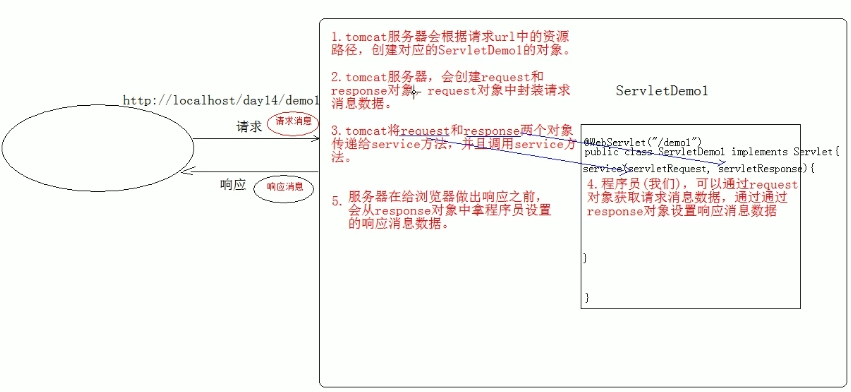

JavaEE：Java语言在企业级开发中使用的技术规范的总和，一共规定了13项大的规范

## 一、XML

### 1. 概述

Extensible Markup Language 可扩展标记语言

- 可扩展：标签都是自定义的。 <user>  <student>
- 功能
  - 存储数据
    - 配置文件
    - 在网络中传输
- xml与html的区别
  - xml标签都是自定义的，html标签是预定义。
  - xml的语法严格，html语法松散
  - xml是存储数据的，html是展示数据

### 2. 语法

#### 2.1 基本语法

1. xml文档的后缀名 .xml
2.  xml第一行必须定义为文档声明
3. xml文档中有且仅有一个根标签
4. 属性值必须使用引号(单双都可)引起来
5. 标签必须正确关闭
6. xml标签名称区分大小写

#### 2.2 示例

```xml
<?xml version='1.0' ?>
<users>
    <user id='1'>
        <name>zhangsan</name>
        <age>23</age>
        <gender>male</gender>
        <br/>
    </user>

    <user id='2'>
        <name>lisi</name>
        <age>24</age>
        <gender>female</gender>
    </user>
</users>
```

#### 2.3 组成部分

1. 文档声明
   - 格式：<?xml 属性列表 ?>
   - 属性列表
     - version：版本号，必须的属性
     - encoding：编码方式。告知解析引擎当前文档使用的字符集，默认值：ISO-8859-1
     - standalone：是否独立
       - yes：不依赖其他文件
       - no：依赖其他文件
2. 指令：结合css的
   - `<?xml-stylesheet type="text/css" href="a.css" ?>`
3. 标签：标签名称自定义的
   - 名称可以包含字母、数字以及其他的字符 
   - 名称不能以数字或者标点符号开始 
   - 名称不能以字母 xml（或者 XML、Xml 等等）开始 
   - 名称不能包含空格 
4. 属性：id属性值唯一
5. 文本
   - CDATA区：在该区域中的数据会被原样展示
     - 格式：  `<![CDATA[ 数据 ]]>`

#### 2.4 约束

1. 分类

- DTD：一种简单的约束技术
- Schema：一种复杂的约束技术

2. DTD

- 引入dtd文档到xml文档中
  - 内部dtd：将约束规则定义在xml文档中
  - 外部dtd：将约束的规则定义在外部的dtd文件中
    - 本地：`<!DOCTYPE 根标签名 SYSTEM "dtd文件的位置">`
    - 网络：`<!DOCTYPE 根标签名 PUBLIC "dtd文件名字" "dtd文件的位置URL">`

3. Schema

- 引入

  - 填写xml文档的根元素
  - 引入xsi前缀.  `xmlns:xsi="http://www.w3.org/2001/XMLSchema-instance"`
  - 引入xsd文件命名空间.  `xsi:schemaLocation="http://www.itcast.cn/xml  student.xsd"`
  - 为每一个xsd约束声明一个前缀,作为标识  `xmlns:前缀名="http://www.itcast.cn/xml" `

  ```xml
  <students   xmlns:xsi="http://www.w3.org/2001/XMLSchema-instance"
  					xmlns="http://www.itcast.cn/xml"
  					xsi:schemaLocation="http://www.itcast.cn/xml  student.xsd">
  ```

### 3. 解析

操作xml文档，将文档中的数据读取到内存中

#### 3.1 操作xml文档

- 解析(读取)：将文档中的数据读取到内存中
- 写入：将内存中的数据保存到xml文档中。持久化的存储

#### 3.2 解析xml的方式

- DOM：将标记语言文档一次性加载进内存，在内存中形成一颗dom树
  - 优点：操作方便，可以对文档进行CRUD的所有操作
  - 缺点：占内存
- SAX：逐行读取，基于事件驱动的
  - 优点：不占内存。
  - 缺点：只能读取，不能增删改

#### 3.3 xml常见的解析器

- JAXP：sun公司提供的解析器，支持dom和sax两种思想
- DOM4J：一款非常优秀的解析器
- Jsoup：jsoup 是一款Java 的HTML解析器，可直接解析某个URL地址、HTML文本内容。它提供了一套非常省力的API，可通过DOM，CSS以及类似于jQuery的操作方法来取出和操作数据
- PULL：Android操作系统内置的解析器，sax方式的

#### 3.4 Jsoup

- 步骤
  1. 导入jar包
  2.  获取Document对象
  3. 获取对应的标签Element对象
  4. 获取数据

```java
 //2.1获取student.xml的path
String path = JsoupDemo1.class.getClassLoader().getResource("student.xml").getPath();
//2.2解析xml文档，加载文档进内存，获取dom树--->Document
Document document = Jsoup.parse(new File(path), "utf-8");
//3.获取元素对象 Element
Elements elements = document.getElementsByTag("name");
		
System.out.println(elements.size());
//3.1获取第一个name的Element对象
Element element = elements.get(0);
//3.2获取数据
String name = element.text();
System.out.println(name);
```

- 对象的使用

  - Jsoup：工具类，可以解析html或xml文档，返回Document
    - parse：解析html或xml文档，返回Document
      - parse(File in, String charsetName)：解析xml或html文件的
      - parse(String html)：解析xml或html字符串
      - parse(URL url, int timeoutMillis)：通过网络路径获取指定的html或xml的文档对象
  - Document：文档对象。代表内存中的dom树
    - 获取Element对象
      - getElementById(String id)：根据id属性值获取唯一的element对象
      - getElementsByTag(String tagName)：根据标签名称获取元素对象集合
      - getElementsByAttribute(String key)：根据属性名称获取元素对象集合
      - getElementsByAttributeValue(String key, String value)：根据对应的属性名和属性值获取元素对象集合
  - Elements：元素Element对象的集合。可以当做 ArrayList<Element>来使用
  - Element：元素对象
    - 获取子元素对象
      - getElementById(String id)：根据id属性值获取唯一的element对象
      - getElementsByTag(String tagName)：根据标签名称获取元素对象集合
      - getElementsByAttribute(String key)：根据属性名称获取元素对象集合
      - getElementsByAttributeValue(String key, String value)：根据对应的属性名和属性值获取元素对象集合
    - 获取属性值
      - String attr(String key)：根据属性名称获取属性值
    - 获取文本内容
      - String text():获取所有子标签的文本内容
      - String html():获取所有子标签的所有内容(包括字标签的字符串内容)
  - Node：节点对象
    - 是Document和Element的父类

- 快捷查询方式

  - selector:选择器

    - 使用的方法：Elements select(String cssQuery)

  -  XPath：XPath即为XML路径语言，它是一种用来确定XML（标准通用标记语言的子集）文档中某部分位置的语言

    - 使用Jsoup的Xpath需要额外导入jar包。

    - 查询w3cshool参考手册，使用xpath的语法完成查询

      ```java
      //1.获取student.xml的path
      String path = JsoupDemo6.class.getClassLoader().getResource("student.xml").getPath();
      //2.获取Document对象
      Document document = Jsoup.parse(new File(path), "utf-8");
      			
      //3.根据document对象，创建JXDocument对象
      JXDocument jxDocument = new JXDocument(document);
      			
      //4.结合xpath语法查询
      //4.1查询所有student标签
      List<JXNode> jxNodes = jxDocument.selN("//student");
      for (JXNode jxNode : jxNodes) {
          System.out.println(jxNode);
      }
      			
      System.out.println("--------------------");
      			
      //4.2查询所有student标签下的name标签
      List<JXNode> jxNodes2 = jxDocument.selN("//student/name");
      for (JXNode jxNode : jxNodes2) {
          System.out.println(jxNode);
      }
      			
      System.out.println("--------------------");
      			
      //4.3查询student标签下带有id属性的name标签
      List<JXNode> jxNodes3 = jxDocument.selN("//student/name[@id]");
      for (JXNode jxNode : jxNodes3) {
          System.out.println(jxNode);
      }
      System.out.println("--------------------");
      //4.4查询student标签下带有id属性的name标签 并且id属性值为itcast
      			
      List<JXNode> jxNodes4 = jxDocument.selN("//student/name[@id='itcast']");
      for (JXNode jxNode : jxNodes4) {
          System.out.println(jxNode);
      }
      ```

## 二、web相关概念

### 1. 软件架构

1. C/S：客户端/服务器端
2. B/S：浏览器/服务器端

### 2. 资源分类

1. 静态资源：所有用户访问后，得到的结果都是一样的，称为静态资源.静态资源可以直接被浏览器解析
    - 如： html,css,JavaScript
 2. 动态资源:每个用户访问相同资源后，得到的结果可能不一样。称为动态资源。动态资源被访问后，需要先转换为静态资源，在返回给浏览器
    - 如：servlet/jsp,php,asp....

### 3. 网络通信三要素

1. IP：电子设备(计算机)在网络中的唯一标识。
2. 端口：应用程序在计算机中的唯一标识。 0~65535
3. 传输协议：规定了数据传输的规则
   - 基础协议：
     - tcp:安全协议，三次握手。 速度稍慢
     - udp：不安全协议。 速度快

## 三、web服务器软件

### 1. 服务器

* 服务器：安装了服务器软件的计算机
* 服务器软件：接收用户的请求，处理请求，做出响应
* web服务器软件：接收用户的请求，处理请求，做出响应。
  * 在web服务器软件中，可以部署web项目，让用户通过浏览器来访问这些项目
  * web容器

### 2. 常见的java相关的web服务器软件

* webLogic：oracle公司，大型的JavaEE服务器，支持所有的JavaEE规范，收费的。
* webSphere：IBM公司，大型的JavaEE服务器，支持所有的JavaEE规范，收费的。
* JBOSS：JBOSS公司的，大型的JavaEE服务器，支持所有的JavaEE规范，收费的。
* Tomcat：Apache基金组织，中小型的JavaEE服务器，仅仅支持少量的JavaEE规范servlet/jsp。开源的，免费的。

### 3. tomcat

1. 下载：http://tomcat.apache.org/
2. 安装：解压压缩包即可
   - 注意：安装目录建议不要有中文和空格
3. 卸载：删除目录就行了
4. 启动
   - bin/startup.bat ,双击运行该文件即可
   - 访问：浏览器输入：http://localhost:8080 回车访问自己
   - 问题：
     - 黑窗口一闪而过
       - 原因： 没有正确配置JAVA_HOME环境变量
       - 解决方案：正确配置JAVA_HOME环境变量
     - 启动报错
       - 找到占用的端口号，并且找到对应的进程，杀死该进程
         - netstat -ano
       - 修改自身的端口号
         - conf/server.xml
         - `<Connector port="8888" protocol="HTTP/1.1"
           connectionTimeout="20000"
           redirectPort="8445" />`
         - 一般会将tomcat的默认端口号修改为80。80端口号是http协议的默认端口号
           - 好处：在访问时，就不用输入端口号
5. 关闭
   - 正常关闭
     - bin/shutdown.bat
     - ctrl+c
   - 强制关闭
     - 关闭启动窗口
6. 配置
   - 部署项目的方式
     - 直接将项目放到webapps目录下即可
       - /hello：项目的访问路径-->虚拟目录
       - 简化部署：将项目打成一个war包，再将war包放置到webapps目录下。war包会自动解压缩
     - 配置conf/server.xml文件
       - 在`<Host>`标签体中配置`<Context docBase="D:\hello" path="/hehe" />`
         - docBase:项目存放的路径
         - path：虚拟目录
     - 在conf\Catalina\localhost创建任意名称的xml文件。在文件中编写`<Context docBase="D:\hello" />`
       - 虚拟目录：xml文件的名称
   - 静态项目和动态项目
     - 目录结构
       - java动态项目的目录结构
         - -- 项目的根目录
           - -- WEB-INF目录
             - -- web.xml：web项目的核心配置文件
             - -- classes目录：放置字节码文件的目录
             - -- lib目录：放置依赖的jar包

## 四、Servlet（server applet）

### 1. 概述

运行在服务器端的小程序

- Servlet就是一个接口，定义了Java类被浏览器访问到(tomcat识别)的规则
- 将来我们自定义一个类，实现Servlet接口，复写方法

### 2. 简单使用

1. 创建JavaEE项目

2. 定义一个类，实现Servlet接口

   `public class ServletDemo1 implements Servlet`

3. 实现接口中的抽象方法

4. 配置Servlet

   - 在web.xml中配置

     ```xml
     <!--配置Servlet -->
     <servlet>
         <servlet-name>demo1</servlet-name>
         <servlet-class>cn.itcast.web.servlet.ServletDemo1</servlet-class>
     </servlet>
     
     <servlet-mapping>
         <servlet-name>demo1</servlet-name>
         <url-pattern>/demo1</url-pattern>
     </servlet-mapping>
     ```

### 3. 执行原理

1. 当服务器接受到客户端浏览器的请求后，会解析请求URL路径，获取访问的Servlet的资源路径
2. 查找web.xml文件，是否有对应的<url-pattern>标签体内容
3. 如果有，则在找到对应的<servlet-class>全类名
4. tomcat会将字节码文件加载进内存，并且创建其对象
5. 调用其方法

### 4. Servlet中的生命周期方法

1. 被创建：执行init方法，只执行一次
   - Servlet什么时候被创建？
     - 默认情况下，第一次被访问时，Servlet被创建
     - 可以配置执行Servlet的创建时机。
       - 在<servlet>标签下配置，默认值为-1
         - 第一次被访问时，创建<load-on-startup>的值为负数
         - 在服务器启动时，创建<load-on-startup>的值为0或正整数
   - Servlet的init方法，只执行一次，说明一个Servlet在内存中只存在一个对象，Servlet是单例的
     - 多个用户同时访问时，可能存在线程安全问题
     - 解决：尽量不要在Servlet中定义成员变量。即使定义了成员变量，也不要对修改值
2. 提供服务：执行service方法，执行多次
   - 每次访问Servlet时，Service方法都会被调用一次。
3. 被销毁：执行destroy方法，只执行一次
   - Servlet被销毁时执行。服务器关闭时，Servlet被销毁
   - 只有服务器正常关闭时，才会执行destroy方法
   - destroy方法在Servlet被销毁之前执行，一般用于释放资源

### 5. Servlet3.0

1. 支持注解配置。可以不需要web.xml了

2. 使用

   - 创建JavaEE项目，选择Servlet的版本3.0以上，可以不创建web.xml

   - 定义一个类，实现Servlet接口

   - 复写方法

   - 在类上使用@WebServlet注解，进行配置`@WebServlet("资源路径")`

     ```java
     @Target({ElementType.TYPE})
     @Retention(RetentionPolicy.RUNTIME)
     @Documented
     public @interface WebServlet {
         String name() default "";//相当于<Servlet-name>
     
         String[] value() default {};//代表urlPatterns()属性配置
     
         String[] urlPatterns() default {};//相当于<url-pattern>
     
         int loadOnStartup() default -1;//相当于<load-on-startup>
     
         WebInitParam[] initParams() default {};
     
         boolean asyncSupported() default false;
     
         String smallIcon() default "";
     
         String largeIcon() default "";
     
         String description() default "";
     
         String displayName() default "";
     }
     ```

### 6. Servlet的体系结构

Servlet -- 接口
			|
GenericServlet -- 抽象类
			|
HttpServlet  -- 抽象类

- GenericServlet：将Servlet接口中其他的方法做了默认空实现，只将service()方法作为抽象
  - 将来定义Servlet类时，可以继承GenericServlet，实现service()方法即可
- HttpServlet：对http协议的一种封装，简化操作
  - 定义类继承HttpServlet
  - 复写doGet/doPost方法

### 7. Servlet相关配置

urlpartten:Servlet访问路径

- 一个Servlet可以定义多个访问路径 ： @WebServlet({"/d4","/dd4","/ddd4"})
- 路径定义规则
  - /xxx：路径匹配
  - /xxx/xxx:多层路径，目录结构
  - *.do：扩展名匹配

## 五、HTTP

### 1. 概述

Hyper Text Transfer Protocol 超文本传输协议

- 传输协议：定义了客户端和服务器端通信时，发送数据的格式
- 特点
  - 基于TCP/IP的高级协议
  - 默认端口号:80
  - 基于请求/响应模型的:一次请求对应一次响应
  - 无状态的：每次请求之间相互独立，不能交互数据
- 历史版本
  - 1.0：每一次请求响应都会建立新的连接
  - 1.1：复用连接

### 2. 请求消息数据格式

#### 2.1 请求行

请求方式     请求url     请求协议/版本
  GET        /login.html	  HTTP/1.1

- 请求方式
  - HTTP协议有7种请求方式，常用的有2种
    - GET
      - 请求参数在请求行中，在url后
      - 请求的url长度有限制的
      - 不太安全
    - POST
      - 请求参数在请求体中
      - 请求的url长度没有限制的
      - 相对安全

#### 2.2 请求头：客户端浏览器告诉服务器一些信息

请求头名称: 请求头值

- 常见的请求头
  - User-Agent：浏览器告诉服务器，访问使用的浏览器版本信息
    - 可以在服务器端获取该头的信息，解决浏览器的兼容性问题
  - Referer：`http://localhost/login.html`
    - 告诉服务器，当前请求从哪里来
      - 作用
        - 防盗链
        - 统计工作

#### 2.3 请求空行

空行，就是用于分割POST请求的请求头，和请求体的。

#### 2.4 请求体(正文)

封装POST请求消息的请求参数的

```http
POST /login.html	HTTP/1.1
Host: localhost
User-Agent: Mozilla/5.0 (Windows NT 6.1; Win64; x64; rv:60.0) Gecko/20100101 Firefox/60.0
Accept: text/html,application/xhtml+xml,application/xml;q=0.9,*/*;q=0.8
Accept-Language: zh-CN,zh;q=0.8,zh-TW;q=0.7,zh-HK;q=0.5,en-US;q=0.3,en;q=0.2
Accept-Encoding: gzip, deflate
Referer: http://localhost/login.html
Connection: keep-alive
Upgrade-Insecure-Requests: 1

username=zhangsan	

```

### 3. 响应消息数据格式

#### 3.1 响应行

- 格式：协议/版本  响应状态码   状态码描述，HTTP/1.1 200 ok
  - 响应状态码：服务器告诉客户端浏览器本次请求和响应的一个状态
    - 状态码都是3位数字
    - 分类：
      - 1XX：服务器接收客户端消息，但没有接收完成，等待一段时间后，发送此状态码
      - 2XX：如200，代表成功
      - 3XX：如302（重定向），304（没有更改，访问缓存）
      - 4XX：客户端错误，404（请求路径没有对应的资源），405（请求方式没有对应的方法）
      - 5XX：服务器端错误，500（服务器内部出现异常）

#### 3.2 响应头

- 格式：头名称:值
- 常见响应头：
  - Content-Type：服务器告诉客户端本次响应体数据格式以及编码格式
  - Content-disposition：服务器告诉客户端以什么方式打开响应数据
    - in-line：默认值，在当前页面内打开
    - attachment;filename=xxx：以附件形式打开响应体，文件下载

#### 3.3 响应空行

空行，就是用于分割响应头和响应体。

#### 3.4 响应体

传输的数据

## 六、Request

### 1. request对象和response对象的原理 

- request和response对象是由服务器创建的

- request对象是来获取请求消息，response对象是来设置响应消息

  

### 2. request对象继承体系结构

ServletRequest		--	接口
			|	继承
HttpServletRequest	-- 接口
			|	实现
org.apache.catalina.connector.RequestFacade 类(tomcat)

### 3. request功能

#### 3.1 获取请求消息数据

1. 获取请求行数据
   - GET /day14/demo1?name=zhangsan HTTP/1.1
   - 方法
     - 获取请求方式 ：GET     `String getMethod() `
     - 获取虚拟目录：/day14   `String getContextPath()`
     - 获取Servlet路径: /demo1   `String getServletPath()`
     - 获取get方式请求参数：name=zhangsan   `String getQueryString()`
     - 获取请求URI：/day14/demo1   
       - `String getRequestURI():		/day14/demo1`   
       - `StringBuffer getRequestURL()  :http://localhost/day14/demo1`
       - URL:统一资源定位符 ： `http://localhost/day14/demo1`  如中华人民共和国
       - URI：统一资源标识符 : /day14/demo1  如共和国
     - 获取协议及版本：HTTP/1.1  `String getProtocol()`
     - 获取客户机的IP地址：`String getRemoteAddr()`
2. 获取请求头数据
   - `String getHeader(String name)`:通过请求头的名称获取请求头的值
   - `Enumeration<String> getHeaderNames()`:获取所有的请求头名称
3. 获取请求体数据
   - 请求体：只有POST请求方式，才有请求体，在请求体中封装了POST请求的请求参数
   - 步骤
     - 获取流对象
       - BufferedReader getReader()：获取字符输入流，只能操作字符数据
       - ServletInputStream getInputStream()：获取字节输入流，可以操作所有类型数据
     - 从流对象中拿数据

#### 3.2 其他功能

1. 获取请求参数通用方式：不论get还是post请求方式都可以使用下列方法来获取请求参数
   - String getParameter(String name):根据参数名称获取参数值    username=zs&password=123
   - String[] getParameterValues(String name):根据参数名称获取参数值的数组  hobby=xx&hobby=game
   - Enumeration<String> getParameterNames():获取所有请求的参数名称
   - Map<String,String[]> getParameterMap():获取所有参数的map集合
   - 中文乱码问题
     - get方式：tomcat 8 已经将get方式乱码问题解决了
     - post方式：会乱码
       - 解决：在获取参数前，设置request的编码request.setCharacterEncoding("utf-8");
2. 请求转发：一种在服务器内部的资源跳转方式
   - 通过request对象获取请求转发器对象：RequestDispatcher getRequestDispatcher(String path)
   - 使用RequestDispatcher对象来进行转发：forward(ServletRequest request, ServletResponse response) 
   - 特点
     - 浏览器地址栏路径不发生变化
     - 只能转发到当前服务器内部资源中
     - 转发是一次请求
3. 共享数据
   - 域对象：一个有作用范围的对象，可以在范围内共享数据
   - request域：代表一次请求的范围，一般用于请求转发的多个资源中共享数据
   - 方法
     - void setAttribute(String name,Object obj):存储数据
     - Object getAttitude(String name):通过键获取值
     - void removeAttribute(String name):通过键移除键值对
4. 获取ServletContext：ServletContext getServletContext()

```java
public class User {

    private int id;
    private String username;
    private String password;


    public int getId() {
        return id;
    }

    public void setId(int id) {
        this.id = id;
    }

    public String getUsername() {
        return username;
    }

    public void setUsername(String username) {
        this.username = username;
    }

    public String getPassword() {
        return password;
    }

    public void setPassword(String password) {
        this.password = password;
    }

    @Override
    public String toString() {
        return "User{" +
            "id=" + id +
            ", username='" + username + '\'' +
            ", password='" + password + '\'' +
            '}';
    }
}


/**
* JDBC工具类 使用Durid连接池
*/
public class JDBCUtils {

    private static DataSource ds ;

    static {

        try {
            //1.加载配置文件
            Properties pro = new Properties();
            //使用ClassLoader加载配置文件，获取字节输入流
            InputStream is = JDBCUtils.class.getClassLoader().getResourceAsStream("druid.properties");
            pro.load(is);

            //2.初始化连接池对象
            ds = DruidDataSourceFactory.createDataSource(pro);

        } catch (IOException e) {
            e.printStackTrace();
        } catch (Exception e) {
            e.printStackTrace();
        }
    }

    /**
    * 获取连接池对象
    */
    public static DataSource getDataSource(){
        return ds;
    }


    /**
    * 获取连接Connection对象
    */
    public static Connection getConnection() throws SQLException {
        return  ds.getConnection();
    }
}

/**
* 操作数据库中User表的类
*/
public class UserDao {

    //声明JDBCTemplate对象共用
    private JdbcTemplate template = new JdbcTemplate(JDBCUtils.getDataSource());

    /**
    * 登录方法
    * @param loginUser 只有用户名和密码
    * @return user包含用户全部数据,没有查询到，返回null
    */
    public User login(User loginUser){
        try {
            //1.编写sql
            String sql = "select * from user where username = ? and password = ?";
            //2.调用query方法
            User user = template.queryForObject(sql, new BeanPropertyRowMapper<User>(User.class),loginUser.getUsername(), loginUser.getPassword());
            
            return user;
        } catch (DataAccessException e) {
            e.printStackTrace();//记录日志
            return null;
        }
    }
}

@WebServlet("/loginServlet")
public class LoginServlet extends HttpServlet {

    @Override
    protected void doGet(HttpServletRequest req, HttpServletResponse resp) throws ServletException, IOException {
        //1.设置编码
        req.setCharacterEncoding("utf-8");
        //2.获取请求参数
        String username = req.getParameter("username");
        String password = req.getParameter("password");
        //3.封装user对象
        User loginUser = new User();
        loginUser.setUsername(username);
        loginUser.setPassword(password);

        //4.调用UserDao的login方法
        UserDao dao = new UserDao();
        User user = dao.login(loginUser);

        //5.判断user
        if(user == null){
            //登录失败
            req.getRequestDispatcher("/failServlet").forward(req,resp);
        }else{
            //登录成功
            //存储数据
            req.setAttribute("user",user);
            //转发
            req.getRequestDispatcher("/successServlet").forward(req,resp);
        }

    }

    @Override
    protected void doPost(HttpServletRequest req, HttpServletResponse resp) throws ServletException, IOException {
        this.doGet(req,resp);
    }
}

@WebServlet("/successServlet")
public class SuccessServlet extends HttpServlet {
    protected void doPost(HttpServletRequest request, HttpServletResponse response) throws ServletException, IOException {
        //获取request域中共享的user对象
        User user = (User) request.getAttribute("user");

        if(user != null){
            //给页面写一句话

            //设置编码
            response.setContentType("text/html;charset=utf-8");
            //输出
            response.getWriter().write("登录成功！"+user.getUsername()+",欢迎您");
        }


    }		


@WebServlet("/failServlet")
public class FailServlet extends HttpServlet {
    protected void doPost(HttpServletRequest request, HttpServletResponse response) throws ServletException, IOException {
        //给页面写一句话

        //设置编码
        response.setContentType("text/html;charset=utf-8");
        //输出
        response.getWriter().write("登录失败，用户名或密码错误");
        
    }

    protected void doGet(HttpServletRequest request, HttpServletResponse response) throws ServletException, IOException {
        this.doPost(request,response);
    }
}

    
// 1. login.html中form表单的action路径的写法
//     虚拟目录+Servlet的资源路径

// 2. BeanUtils工具类，简化数据封装
//     用于封装JavaBean的
//    1. JavaBean：标准的Java类
//		1. 要求：
//			1. 类必须被public修饰
//			2. 必须提供空参的构造器
//			3. 成员变量必须使用private修饰
//			4. 提供公共setter和getter方法
//		2. 功能：封装数据


//     2. 成员变量：
//			属性：setter和getter方法截取后的产物
//			例如：getUsername() --> Username--> username


//		3. 方法：
//			1. setProperty()
//			2. getProperty()
//populate(Object obj , Map map):将map集合的键值对信息，封装到对应的JavaBean对象中
```

## 七、Response

### 1. 功能：设置响应消息

1. 设置响应行
    - 格式：协议/版本  响应状态码   状态码描述，HTTP/1.1 200 ok
    - 设置状态码：setStatus(int sc) 
2. 设置响应头：setHeader(String name, String value) 
3. 设置响应体：
    - 获取输出流
      - 字符输出流：PrintWriter getWriter()
      - 字节输出流：ServletOutputStream getOutputStream()
    - 使用输出流，将数据输出到客户端浏览器

### 2. 重定向

1. 重定向：资源跳转的方式

   ```java
   //1. 设置状态码为302
   response.setStatus(302);
   //2.设置响应头location
   response.setHeader("location","/day15/responseDemo2");
   
   
   //简单的重定向方法
   response.sendRedirect("/day15/responseDemo2");
   ```

2. 重定向的特点:redirect

   - 地址栏发生变化
   - 重定向可以访问其他站点(服务器)的资源
   - 重定向是两次请求。不能使用request对象来共享数据

3. 转发的特点：forward

   - 转发地址栏路径不变
   - 转发只能访问当前服务器下的资源
   - 转发是一次请求，可以使用request对象来共享数据

4. 路径写法

   - 路径分类
     - 相对路径：通过相对路径不可以确定唯一资源
       - 如：./index.html
       - 不以/开头，以.开头路径
       - 规则：找到当前资源和目标资源之间的相对位置关系
         - ./：当前目录，可以不写，默认就是./
         - ../:上一级目录
     - 绝对路径：通过绝对路径可以确定唯一资源
       - 如：http://localhost/day15/responseDemo2
       - 以/开头的路径
       - 规则：判断定义的路径是给谁用的？判断请求将来从哪儿发出
         - 给客户端浏览器使用：需要加虚拟目录(项目的访问路径)
           - 建议虚拟目录动态获取：request.getContextPath()
           -  <a> , <form> 重定向...
         - 给服务器使用：不需要加虚拟目录
           - 转发路径

### 3. 服务器输出字符数据到浏览器

1. 步骤：

   - 获取字符输出流
   - 输出数据

2.  乱码问题

   - PrintWriter pw = response.getWriter();获取的流的默认编码是ISO-8859-1

   - 设置该流的默认编码，setCharsetEncoding()，此方法只能设置流的编码，并不能告诉客户端要使用什么编码去解码

   - 使用以下方法设置编码并告诉浏览器响应体使用的编码

     ```java
     //简单的形式，设置编码，是在获取流之前设置
     response.setContentType("text/html;charset=utf-8");
     ```

### 4. 服务器输出字节数据到浏览器

1. 获取字节输出流
2. 输出数据

### 5. 验证码

1. 本质：图片

2. 目的：防止恶意表单注册

   ```java
   @WebServlet("/checkCodeServlet")
   public class CheckCodeServlet extends HttpServlet {
   
       @Override
       protected void doPost(HttpServletRequest req, HttpServletResponse resp) throws ServletException, IOException {
           int width = 100;
           int height = 50;
           // 创建对象，在内存中图片
           BufferedImage image = new BufferedImage(width, height, BufferedImage.TYPE_INT_RGB);
   
           // 美化图片
           // 获取画笔对象
           Graphics g = image.getGraphics();
           // 设置画笔颜色
           g.setColor(Color.pink);
           // 填充背景色
           g.fillRect(0, 0, width, height);
   
           // 画边框
           g.setColor(Color.CYAN);
           g.drawRect(0, 0, width - 1, height - 1);
   
           String str = "ABCDEFGHIJKLMNOPQRSTUVWXYZabcdefghijklmnopqrstuvwxyz0123456789";
   
           // 生成随机坐标
           Random random = new Random();
   
           // 写验证码
           g.setColor(Color.white);
           for (int i = 1; i <= 4; i++) {
               int index = random.nextInt(str.length());
               char ch = str.charAt(index);
   
               g.drawString(String.valueOf(ch), width / 5 * i, height / 2);
   
           }
   
           // 画干扰性
           g.setColor(Color.green);
           // 随机生成坐标点
           for (int i = 0; i < 10; i++) {
               int x1 = random.nextInt(width);
               int y1 = random.nextInt(height);
   
               int x2 = random.nextInt(width);
               int y2 = random.nextInt(height);
   
               g.drawLine(x1, y1, x2, y2);
           }
   
   
           // 将图片输出到页面展示
           ImageIO.write(image, "jpg", resp.getOutputStream());
       }
   
       @Override
       protected void doGet(HttpServletRequest req, HttpServletResponse resp) throws ServletException, IOException {
           this.doPost(req, resp);
       }
   }
   ```

## 八、ServletContext

### 1. 概述

代表整个web应用，可以和程序的容器(服务器)来通信

### 2. 获取

1. 通过request对象获取    `request.getServletContext();`
2. 通过HttpServlet获取   `this.getServletContext();`

### 3. 功能

1. 获取MIME类型

   - MIME类型:在互联网通信过程中定义的一种文件数据类型
     - 格式： 大类型/小类型   text/html		image/jpeg
   - 获取：String getMimeType(String file)  

2. 域对象：共享数据，范围为整个应用范围

   - setAttribute(String name,Object value)
   - getAttribute(String name)
   - removeAttribute(String name)

3. 获取文件的真实(服务器)路径

   - 方法：String getRealPath(String path) 

     ```java
      String b = context.getRealPath("/b.txt");//web目录下资源访问
      System.out.println(b);
      
      String c = context.getRealPath("/WEB-INF/c.txt");//WEB-INF目录下的资源访问
      System.out.println(c);
      
      String a = context.getRealPath("/WEB-INF/classes/a.txt");//src目录下的资源访问
      System.out.println(a);
     ```

## 九、会话技术

### 1. 概述

1. 会话：一次会话中包含多次请求和响应。
   - 一次会话：浏览器第一次给服务器资源发送请求，会话建立，直到有一方断开为止
2. 功能：在一次会话的范围内的多次请求间，共享数据
3. 方式
   - 客户端会话技术：Cookie
   - 服务器端会话技术：Session

### 2. Cookie

1. 客户端会话技术，将数据保存到客户端

2. 使用步骤

   - 创建Cookie对象，绑定数据
     - new Cookie(String name, String value) 
   - 发送Cookie对象
     - response.addCookie(Cookie cookie) 
   - 获取Cookie，拿到数据
     - Cookie[]  request.getCookies()

3. 实现原理

   基于响应头set-cookie和请求头cookie实现

   

4. cookie的细节

   - 一次可以发送多个cookie
     - 可以创建多个Cookie对象，使用response调用多次addCookie方法发送cookie即可
   - cookie在浏览器中保存时间
     - 默认情况下，当浏览器关闭后，Cookie数据被销毁
     - 持久化存储
       - setMaxAge(int seconds)
         - 正数：将Cookie数据写到硬盘的文件中。持久化存储。并指定cookie存活时间，时间到后，cookie文件自动失效
         - 负数：默认值
         - 零：删除cookie信息
   - cookie存中文
     - 在tomcat 8 之前 cookie中不能直接存储中文数据
       - 需要将中文数据转码---一般采用URL编码(%E3)
     - 在tomcat 8及之后，cookie支持中文数据。特殊字符还是不支持，建议使用URL编码存储，URL解码解析
   - cookie共享问题
     - 假设在一个tomcat服务器中，部署了多个web项目，那么在这些web项目中cookie能不能共享
       - 默认情况下cookie不能共享
       - setPath(String path):设置cookie的获取范围。默认情况下，设置当前的虚拟目录
         * 如果要共享，则可以将path设置为"/"
     - 不同的tomcat服务器间cookie共享问题
       - setDomain(String path):如果设置一级域名相同，那么多个服务器之间cookie可以共享
         * setDomain(".baidu.com"),那么tieba.baidu.com和news.baidu.com中cookie可以共享

5. Cookie的特点和作用

   - cookie存储数据在客户端浏览器
   - 浏览器对于单个cookie 的大小有限制(4kb) 以及 对同一个域名下的总cookie数量也有限制(20个)
   - 作用
     - cookie一般用于存储少量的不太敏感的数据
     - 在不登录的情况下，完成服务器对客户端的身份识别

```java
//1. 访问一个Servlet，如果是第一次访问，则提示：您好，欢迎您首次访问。
//2. 如果不是第一次访问，则提示：欢迎回来，您上次访问时间为:显示时间字符串
@WebServlet("/cookieTest")
public class CookieTest extends HttpServlet {
    protected void doPost(HttpServletRequest request, HttpServletResponse response) throws ServletException, IOException {
        //设置响应的消息体的数据格式以及编码
        response.setContentType("text/html;charset=utf-8");
        
        //1.获取所有Cookie
        Cookie[] cookies = request.getCookies();
        boolean flag = false;//没有cookie为lastTime
        //2.遍历cookie数组
        if(cookies != null && cookies.length > 0){
            for (Cookie cookie : cookies) {
                //3.获取cookie的名称
                String name = cookie.getName();
                //4.判断名称是否是：lastTime
                if("lastTime".equals(name)){
                    //有该Cookie，不是第一次访问
                    
                    flag = true;//有lastTime的cookie
                    
                    //设置Cookie的value
                    //获取当前时间的字符串，重新设置Cookie的值，重新发送cookie
                    Date date  = new Date();
                    SimpleDateFormat sdf = new SimpleDateFormat("yyyy年MM月dd日 HH:mm:ss");
                    String str_date = sdf.format(date);
                    System.out.println("编码前："+str_date);
                    //URL编码
                    str_date = URLEncoder.encode(str_date,"utf-8");
                    System.out.println("编码后："+str_date);
                    cookie.setValue(str_date);
                    //设置cookie的存活时间
                    cookie.setMaxAge(60 * 60 * 24 * 30);//一个月
                    response.addCookie(cookie);
		
                    
                    //响应数据
                    //获取Cookie的value，时间
                    String value = cookie.getValue();
                    System.out.println("解码前："+value);
                    //URL解码：
                    value = URLDecoder.decode(value,"utf-8");
                    System.out.println("解码后："+value);
                    response.getWriter().write("<h1>欢迎回来，您上次访问时间为:"+value+"</h1>");
                    
                    break;
		
		                }
		            }
		        }
		
		
		        if(cookies == null || cookies.length == 0 || flag == false){
		            //没有，第一次访问
		
		            //设置Cookie的value
		            //获取当前时间的字符串，重新设置Cookie的值，重新发送cookie
		            Date date  = new Date();
		            SimpleDateFormat sdf = new SimpleDateFormat("yyyy年MM月dd日 HH:mm:ss");
		            String str_date = sdf.format(date);
		            System.out.println("编码前："+str_date);
		            //URL编码
		            str_date = URLEncoder.encode(str_date,"utf-8");
		            System.out.println("编码后："+str_date);
		
		            Cookie cookie = new Cookie("lastTime",str_date);
		            //设置cookie的存活时间
		            cookie.setMaxAge(60 * 60 * 24 * 30);//一个月
		            response.addCookie(cookie);
		
		            response.getWriter().write("<h1>您好，欢迎您首次访问</h1>");
		        }
		
		
		    }
		
		    protected void doGet(HttpServletRequest request, HttpServletResponse response) throws ServletException, IOException {
		        this.doPost(request, response);
		    }
		}
```

### 3. Session

1. 服务器端会话技术，在一次会话的多次请求间共享数据，将数据保存在服务器端的对象中。HttpSession

2. 使用

   - 获取HttpSession对象： `HttpSession session = request.getSession();`
   - 使用HttpSession对象： 
     - Object getAttribute(String name)  
     - void setAttribute(String name, Object value)
     - void removeAttribute(String name)  

3. 原理

   Session的实现是依赖于Cookie的

   

4. 细节

   - 当客户端关闭后，服务器不关闭，两次获取session是否为同一个

     - 默认情况下不是

     -  如果需要相同，则可以创建Cookie,键为JSESSIONID，设置最大存活时间，让cookie持久化保存

       ```java
        Cookie c = new Cookie("JSESSIONID",session.getId());
       c.setMaxAge(60*60);
       response.addCookie(c);
       ```

   - 客户端不关闭，服务器关闭后，两次获取的session是否为同一个

     - 不是同一个，但是要确保数据不丢失。tomcat自动完成以下工作
       - session的钝化
         - 在服务器正常关闭之前，将session对象序列化到硬盘上
       - session的活化
         - 在服务器启动后，将session文件转化为内存中的session对象即可

   - session什么时候被销毁

     - 服务器关闭

     - session对象调用invalidate() 

     - session默认失效时间 30分钟

       - 选择性配置修改	

         ```xml
         <session-config>
         	<session-timeout>30</session-timeout>
         </session-config>
         ```

5. session的特点

   - session用于存储一次会话的多次请求的数据，存在服务器端
   - session可以存储任意类型，任意大小的数据

6. session与Cookie的区别

   - session存储数据在服务器端，Cookie在客户端
   - session没有数据大小限制，Cookie有
   - session数据安全，Cookie相对于不安全

## 十、JSP

### 1. 概述

Java Server Pages： java服务器端页面

- 可以理解为：一个特殊的页面，其中既可以指定定义html标签，又可以定义java代码
- 用于简化书写

### 2. 原理

JSP本质上就是一个Servlet


### 3. 注释

1. html注释： `<!-- -->`:只能注释html代码片段
2. jsp注释：`<%-- --%>`：可以注释所有

### 4. 指令

- 作用：用于配置JSP页面，导入资源文件
- 格式：<%@ 指令名称 属性名1=属性值1 属性名2=属性值2 ... %>
- 分类
  - page： 配置JSP页面的
    - contentType：等同于response.setContentType()
      - 设置响应体的mime类型以及字符集
      - 设置当前jsp页面的编码（只能是高级的IDE才能生效，如果使用低级工具，则需要设置pageEncoding属性设置当前页面的字符集）
    - import：导包
    - errorPage：当前页面发生异常后，会自动跳转到指定的错误页面
    - isErrorPage：标识当前也是是否是错误页面
      - true：是，可以使用内置对象exception
      - false：否。默认值。不可以使用内置对象exception
  - include： 页面包含的。导入页面的资源文件
    - <%@include file="top.jsp"%>
  - taglib： 导入资源
    - <%@ taglib prefix="c" uri="http://java.sun.com/jsp/jstl/core" %>
      - prefix：前缀，自定义的

### 5. JSP的脚本：JSP定义Java代码的方式

1. <%  代码 %>：定义的java代码，在service方法中。service方法中可以定义什么，该脚本中就可以定义什么
2.  <%! 代码 %>：定义的java代码，在jsp转换后的java类的成员位置
3. <%= 代码 %>：定义的java代码，会输出到页面上。输出语句中可以定义什么，该脚本中就可以定义什么

### 6. JSP的内置对象

- 在jsp页面中不需要获取和创建，可以直接使用的对象
- jsp一共有9个内置对象
  - pageContext：真实类型为PageContext，当前页面共享数据，还可以获取其他八个内置对象
  - request：真实类型为HttpServletRequest
  - response：真实类型为HttpServletResponse
  - out：字符输出流对象。真实类型为JspWriter，可以将数据输出到页面上。和response.getWriter()类似
    - response.getWriter()和out.write()的区别
      - 在tomcat服务器真正给客户端做出响应之前，会先找response缓冲区数据，再找out缓冲区数据
      - response.getWriter()数据输出永远在out.write()之前
  - session：真实类型为HttpSession
  - application：真实类型为ServletContext，所有用户间共享数据
  - page：真实类型为Object，当前页面(Servlet)的对象  this
  - config：真实类型为ServletConfig，Servlet的配置对象
  - exception：真实类型为Throwable，异常对象
