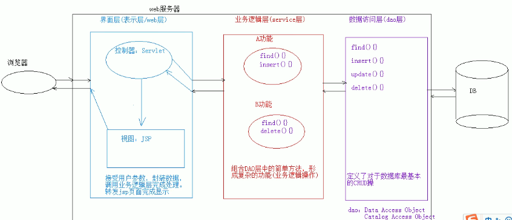
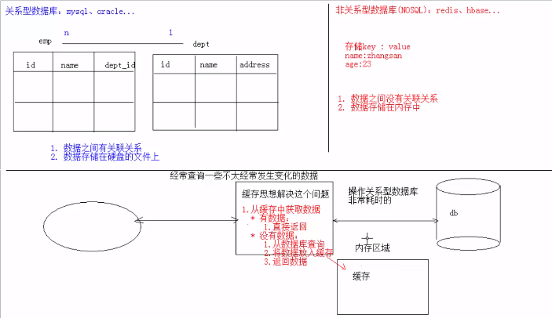

## 十一、MVC模式

### 1. JSP演变史

1. 早期只有servlet，只能使用response输出标签数据，非常麻烦
2. 后来有jsp，简化了Servlet的开发，如果过度使用jsp，在jsp中即写大量的java代码，又写html标签，造成难于维护，难于分工协作
3. 再后来，java的web开发，借鉴mvc开发模式，使得程序的设计更加合理

### 2. MVC

1. M：Model，模型。JavaBean
   - 完成具体的业务操作，如：查询数据库，封装对象
2. V：View，视图。JSP
   - 展示数据
3. C：Controller，控制器。Servlet
   - 获取用户的输入
   - 调用模型
   - 将数据交给视图进行展示

### 3. 优缺点

- 优点
  - 耦合性低，方便维护，可以利于分工协作
  - 重用性高
- 缺点
  - 使得项目架构变得复杂，对开发人员要求高

### 4. 三层架构：软件设计架构

- 界面层(表示层)：用户看到得界面。用户可以通过界面上的组件和服务器进行交互

- 业务逻辑层：处理业务逻辑的

- 数据访问层：操作数据存储文件

  

## 十二、EL表达式

### 1. 概述

Expression Language 表达式语言

### 2. 作用

替换和简化jsp页面中java代码的编写

### 3. 语法

${表达式}

### 4. 注意事项

jsp默认支持el表达式的。如果要忽略el表达式

- 设置jsp中page指令中：isELIgnored="true" 忽略当前jsp页面中所有的el表达式
- `\${表达式}·`：忽略当前这个el表达式

### 5. 使用

1. 运算：运算符
   - 算数运算符： + - * /(div) %(mod)
   - 比较运算符： > < >= <= == !=
   - 逻辑运算符： &&(and) ||(or) !(not)
   - 空运算符： empty
     - 用于判断字符串、集合、数组对象是否为null或者长度是否为0
       - ${empty list}:判断字符串、集合、数组对象是否为null或者长度为0
       - ${not empty str}:表示判断字符串、集合、数组对象是否不为null 并且 长度>0
2. 获取值
   - el表达式只能从域对象中获取值
   - 语法
     - ${域名称.键名}：从指定域中获取指定键的值
       - 域名称
         - pageScope		--> pageContext
         - requestScope 	--> request
         - sessionScope 	--> session
         - applicationScope --> application（ServletContext）
     - ${键名}：表示依次从最小的域中查找是否有该键对应的值，直到找到为止
     - 获取对象、List集合、Map集合的值
       - 对象：${域名称.键名.属性名}
         - 本质上会去调用对象的getter方法
       - List集合：${域名称.键名[索引]}
       - Map集合
         - ${域名称.键名.key名称}
         - ${域名称.键名["key名称"]}
3. 隐式对象
   - el表达式中有11个隐式对象
   - pageContext
     - 获取jsp其他八个内置对象

## 十三、JSTL

### 1.概述

Java Server Pages Tag Library  JSP标准标签库：是由Apache组织提供的开源的免费的jsp标签		<标签>

### 2. 作用

用于简化和替换jsp页面上的java代码

### 3.使用

- 导入jstl相关jar包
- 引入标签库：taglib指令：  <%@ taglib %>
- 使用标签

### 4. 常用的JSTL标签

1. if:相当于java代码的if语句
   - 属性
     - test 必须属性，接受boolean表达式
       - 如果表达式为true，则显示if标签体内容，如果为false，则不显示标签体内容
       - 一般情况下，test属性值会结合el表达式一起使用
   - 注意
     - c:if标签没有else情况，想要else情况，则可以在定义一个c:if标签
2. choose:相当于java代码的switch语句
   - 使用choose标签声明         			相当于switch声明
   - 使用when标签做判断         			相当于case
   - 使用otherwise标签做其他情况的声明    	相当于default
3. foreach:相当于java代码的for语句

## 十四、Filter

### 1. 概述

web中的过滤器：当访问服务器的资源时，过滤器可以将请求拦截下来，完成一些特殊的功能

过滤器的作用：一般用于完成通用的操作。如：登录验证、统一编码处理、敏感字符过滤等

### 2. 使用

1. 步骤

   - 定义一个类，实现接口Filter
   - 复写方法
   - 配置拦截路径
     -  web.xml
     - 注解

2. 示例

   ```java
   @WebFilter("/*")//访问所有资源之前，都会执行该过滤器
   public class FilterDemo1 implements Filter {
       @Override
       public void init(FilterConfig filterConfig) throws ServletException {
   			
       }
   			
       @Override
       public void doFilter(ServletRequest servletRequest, ServletResponse servletResponse, FilterChain filterChain) throws IOException, ServletException {
           System.out.println("filterDemo1被执行了....");
   			
   			
           //放行
           filterChain.doFilter(servletRequest,servletResponse);
           
       }
   			
       @Override
       public void destroy() {
           
       }
   }
   ```

### 3. 过滤器细节

1. web.xml配置

   ```xml
   <filter>
       <filter-name>demo1</filter-name>
       <filter-class>cn.itcast.web.filter.FilterDemo1</filter-class>
   </filter>
   <filter-mapping>
       <filter-name>demo1</filter-name>
       <!-- 拦截路径 -->
       <url-pattern>/*</url-pattern>
   </filter-mapping>
   ```

2. 过滤器执行流程

   - 执行过滤器
   - 执行放行后的资源
   - 回来执行过滤器放行代码下边的代码

3. 过滤器生命周期方法

   - init:在服务器启动后，会创建Filter对象，然后调用init方法。只执行一次。用于加载资源
   - doFilter:每一次请求被拦截资源时，会执行。执行多次
   - destroy:在服务器关闭后，Filter对象被销毁。如果服务器是正常关闭，则会执行destroy方法。只执行一次。用于释放资源

4. 过滤器配置详解

   - 拦截路径配置
     - 具体资源路径： /index.jsp，只有访问index.jsp资源时，过滤器才会被执行
     - 拦截目录： /user/*	访问/user下的所有资源时，过滤器都会被执行
     - 后缀名拦截： *.jsp，访问所有后缀名为jsp资源时，过滤器都会被执行
     - 拦截所有资源：/*		访问所有资源时，过滤器都会被执行
   - 拦截方式配置：资源被访问的方式
     - 注解配置
       - 设置dispatcherTypes属性
         - REQUEST：默认值。浏览器直接请求资源
         - FORWARD：转发访问资源
         - INCLUDE：包含访问资源
         -  ERROR：错误跳转资源
         - ASYNC：异步访问资源
     - web.xml配置
       - 设置<dispatcher></dispatcher>标签即可

5. 过滤器链(配置多个过滤器)

   - 执行顺序：如果有两个过滤器：过滤器1和过滤器2
     - 过滤器1
     - 过滤器2
     - 资源执行
     - 过滤器2
     - 过滤器1
   - 过滤器先后顺序问题
     - 注解配置：按照类名的字符串比较规则比较，值小的先执行
     - web.xml配置： <filter-mapping>谁定义在上边，谁先执行

## 十五、Listener

### 1. 概述

web的三大组件之一：当事件源上发生某个事件后，执行监听器代码

- 事件监听机制
  - 事件	：一件事情
  - 事件源 ：事件发生的地方
  - 监听器 ：一个对象
  - 注册监听：将事件、事件源、监听器绑定在一起

### 2. ServletContextListener:监听ServletContext对象的创建和销毁

- 方法

  - void contextDestroyed(ServletContextEvent sce) ：ServletContext对象被销毁之前会调用该方法
  - void contextInitialized(ServletContextEvent sce) ：ServletContext对象创建后会调用该方法

- 步骤

  - 定义一个类，实现ServletContextListener接口

  - 复写方法

  -  配置

    - web.xml

      ```xml
      <!-- 指定初始化参数<context-param> -->
      <listener>
          <listener-class>cn.itcast.web.listener.ContextLoaderListener</listener-class>
      </listener>
      ```

    - 注解：@WebListener

## 十六、AJAX

### 1. 概述

ASynchronous JavaScript And XML：异步的JavaScript 和 XML

- 异步和同步：客户端和服务器端相互通信的基础上
  - 客户端必须等待服务器端的响应。在等待的期间客户端不能做其他操作——同步
  - 客户端不需要等待服务器端的响应。在服务器处理请求的过程中，客户端可以进行其他的操作——异步

Ajax 是一种在无需重新加载整个网页的情况下，能够更新部分网页的技术，提升用户的体验

通过在后台与服务器进行少量数据交换，Ajax 可以使网页实现异步更新。这意味着可以在不重新加载整个网页的情况下，对网页的某部分进行更新。

传统的网页（不使用 Ajax）如果需要更新内容，必须重载整个网页页面

### 2.实现方式

1. 原生的JS实现方式

   ```javascript
   //1.创建核心对象
   var xmlhttp;
   if (window.XMLHttpRequest)
   {// code for IE7+, Firefox, Chrome, Opera, Safari
       xmlhttp=new XMLHttpRequest();
   }
   else
   {// code for IE6, IE5
       xmlhttp=new ActiveXObject("Microsoft.XMLHTTP");
   }
   
   //2. 建立连接
   /*
   参数：
   1. 请求方式：GET、POST
   * get方式，请求参数在URL后边拼接。send方法为空参
   * post方式，请求参数在send方法中定义
   2. 请求的URL：
   3. 同步或异步请求：true（异步）或 false（同步）
   */
   xmlhttp.open("GET","ajaxServlet?username=tom",true);
   
   //3.发送请求
   xmlhttp.send();
   
   //4.接受并处理来自服务器的响应结果
   //获取方式 ：xmlhttp.responseText
   //什么时候获取？当服务器响应成功后再获取
   
   //当xmlhttp对象的就绪状态改变时，触发事件onreadystatechange。
   xmlhttp.onreadystatechange=function()
   {
       //判断readyState就绪状态是否为4，判断status响应状态码是否为200
       if (xmlhttp.readyState==4 && xmlhttp.status==200)
       {
           //获取服务器的响应结果
           var responseText = xmlhttp.responseText;
           alert(responseText);
       }
   }
   ```

2. JQeury实现方式

   ```javascript
   // 语法：$.ajax({键值对});
   //使用$.ajax()发送异步请求
   $.ajax({
       url:"ajaxServlet1111" , // 请求路径
       type:"POST" , //请求方式
       //data: "username=jack&age=23",//请求参数
       data:{"username":"jack","age":23},
       success:function (data) {
           alert(data);
       },//响应成功后的回调函数
       error:function () {
           alert("出错啦...")
       },//表示如果请求响应出现错误，会执行的回调函数
   
       dataType:"text"//设置接受到的响应数据的格式
   });
   /* $.get()：发送get请求
       * 语法：$.get(url, [data], [callback], [type])
       * 参数：
       * url：请求路径
       * data：请求参数
       * callback：回调函数
       * type：响应结果的类型
    */
   
   /* $.post()：发送post请求
       * 语法：$.post(url, [data], [callback], [type])
       * 参数：
       * url：请求路径
       * data：请求参数
       * callback：回调函数
       * type：响应结果的类型
       */
   ```

## 十七、JSON

### 1. 概述

JavaScript Object Notation：JavaScript对象表示法

```javascript
Person p = new Person();
p.setName("张三");
p.setAge(23);
p.setGender("男");

var p = {"name":"张三","age":23,"gender":"男"};
```

- json现在多用于存储和交换文本信息的语法
- 进行数据的传输
- JSON 比 XML 更小、更快，更易解析

### 2. 语法

1. 基本规则

   - 数据在名称/值对中：json数据是由键值对构成的

     - 键用引号(单双都行)引起来，也可以不使用引号
     - 值得取值类型
       - 数字（整数或浮点数）
       - 字符串（在双引号中）
       - 逻辑值（true 或 false）
       - 数组（在方括号中）	{"persons":[{},{}]}
       - 对象（在花括号中） {"address":{"province"："陕西"....}}
       - null
     - 数据由逗号分隔：多个键值对由逗号分隔
     - 花括号保存对象：使用{}定义json 格式
     - 方括号保存数组：[]

   - 获取数据

     - json对象.键名

     - json对象["键名"]

     - 数组对象[索引]

     - 遍历

       ```javascript
       //1.定义基本格式
       var person = {"name": "张三", age: 23, 'gender': true};
       
       var ps = [{"name": "张三", "age": 23, "gender": true},
                 {"name": "李四", "age": 24, "gender": true},
                 {"name": "王五", "age": 25, "gender": false}];
       
       
       
       
       //获取person对象中所有的键和值
       //for in 循环
       /* for(var key in person){
       //这样的方式获取不行。因为相当于  person."name"
       //alert(key + ":" + person.key);
       alert(key+":"+person[key]);
       }*/
       
       //获取ps中的所有值
       for (var i = 0; i < ps.length; i++) {
           var p = ps[i];
           for(var key in p){
               alert(key+":"+p[key]);
           }
       }
       ```

### 3. JSON数据和Java对象的相互转换

- JSON解析器
  - 常见的解析器：Jsonlib，Gson，fastjson，jackson
- JSON转为Java对象
  - 导入jackson的相关jar包
  - 创建Jackson核心对象 ObjectMapper
  - 调用ObjectMapper的相关方法进行转换：readValue(json字符串数据,Class)
- Java对象转换JSON
  - 导入jackson的相关jar包
  - 创建Jackson核心对象 ObjectMapper
  - 调用ObjectMapper的相关方法进行转换
    - 转换方法
      - writeValue(参数1，obj)，参数1为：
        - File：将obj对象转换为JSON字符串，并保存到指定的文件中
        - Writer：将obj对象转换为JSON字符串，并将json数据填充到字符输出流中
        - OutputStream：将obj对象转换为JSON字符串，并将json数据填充到字节输出流中
      - writeValueAsString(obj):将对象转为json字符串
    - 注解
      - @JsonIgnore：排除属性
      - @JsonFormat：属性值得格式化，@JsonFormat(pattern = "yyyy-MM-dd")
    - 复杂java对象转换
      - List：数组
      - Map：对象格式一致

## 十八、redis

### 1. 概述

redis是一款高性能的NOSQL系列的非关系型数据库



NOSQL：

- NoSQL(NoSQL = Not Only SQL)，意即“不仅仅是SQL”，是一项全新的数据库理念，泛指非关系型的数据库。
  			随着互联网web2.0网站的兴起，传统的关系数据库在应付web2.0网站，特别是超大规模和高并发的SNS类型的web2.0纯动态网站已经显得力不从心，暴露了很多难以克服的问题，而非关系型的数据库则由于其本身的特点得到了非常迅速的发展。NoSQL数据库的产生就是为了解决大规模数据集合多重数据种类带来的挑战，尤其是大数据应用难题。

- NOSQL和关系型数据库比较

  - 优点

    - 成本：nosql数据库简单易部署，基本都是开源软件，不需要像使用oracle那样花费大量成本购买使用，相比关系型数据库价格便宜
    - 查询速度：nosql数据库将数据存储于缓存之中，关系型数据库将数据存储在硬盘中，自然查询速度远不及nosql数据库
    - 存储数据的格式：nosql的存储格式是key,value形式、文档形式、图片形式等等，所以可以存储基础类型以及对象或者是集合等各种格式，而数据库则只支持基础类型
    - 扩展性：关系型数据库有类似join这样的多表查询机制的限制导致扩展很艰难

  - 缺点

    - 维护的工具和资料有限，因为nosql是属于新的技术，不能和关系型数据库10几年的技术同日而语
    - 不提供对sql的支持，如不支持sql这样的工业标准，将产生一定用户的学习和使用成本
    - 不提供关系型数据库对事务的处理

  - 非关系型数据库的优势

    - 性能：NOSQL是基于键值对的，可以想象成表中的主键和值的对应关系，而且不需要经过SQL层的解析，所以性能非常高
    - 可扩展性同样也是因为基于键值对，数据之间没有耦合性，所以非常容易水平扩展

  - 关系型数据库的优势

    - 复杂查询可以用SQL语句方便的在一个表以及多个表之间做非常复杂的数据查询
    - 事务支持使得对于安全性能很高的数据访问要求得以实现。对于这两类数据库，对方的优势就是自己的弱势，反之亦然

  - 总结

    关系型数据库与NoSQL数据库并非对立而是互补的关系，即通常情况下使用关系型数据库，在适合使用NoSQL的时候使用NoSQL数据库，
    让NoSQL数据库对关系型数据库的不足进行弥补。
    一般会将数据存储在关系型数据库中，在nosql数据库中备份存储关系型数据库的数据

- 主流的NOSQL产品

  - 键值(Key-Value)存储数据库
    - 相关产品： Tokyo Cabinet/Tyrant、Redis、Voldemort、Berkeley DB
    - 典型应用： 内容缓存，主要用于处理大量数据的高访问负载
    - 数据模型： 一系列键值对
    - 优势： 快速查询
    - 劣势： 存储的数据缺少结构化
  - 列存储数据库
    - 相关产品：Cassandra, HBase, Riak
    - 典型应用：分布式的文件系统
    - 数据模型：以列簇式存储，将同一列数据存在一起
    - 优势：查找速度快，可扩展性强，更容易进行分布式扩展
    - 劣势：功能相对局限
  - 文档型数据库
    - 相关产品：CouchDB、MongoDB
    - 典型应用：Web应用（与Key-Value类似，Value是结构化的）
    - 数据模型： 一系列键值对
    - 优势：数据结构要求不严格
    - 劣势： 查询性能不高，而且缺乏统一的查询语法
  - 图形(Graph)数据库
    - 相关数据库：Neo4J、InfoGrid、Infinite Graph
    - 典型应用：社交网络
    - 数据模型：图结构
    - 优势：利用图结构相关算法
    - 需要对整个图做计算才能得出结果，不容易做分布式的集群方案

- Redis

  - Redis是用C语言开发的一个开源的高性能键值对（key-value）数据库，官方提供测试数据，50个并发执行100000个请求,读的速度是110000次/s,写的速度是81000次/s ，且Redis通过提供多种键值数据类型来适应不同场景下的存储需求，目前为止Redis支持的键值数据类型如下
    - 字符串类型 string
    - 哈希类型 hash
    - 列表类型 list
    - 集合类型 set
    - 有序集合类型 sortedset
  - redis的应用场景
    - 缓存（数据查询、短连接、新闻内容、商品内容等等）
    - 聊天室的在线好友列表
    - 任务队列。（秒杀、抢购、12306等等）
    - 应用排行榜
    - 网站访问统计
    - 数据过期处理（可以精确到毫秒）
    - 分布式集群架构中的session分离

### 2. 下载安装

1. 官网：https://redis.io
2. 中文网：http://www.redis.net.cn/
3. 解压直接可以使用
   - redis.windows.conf：配置文件
   - redis-cli.exe：redis的客户端
   - redis-server.exe：redis服务器端

### 3. 命令操作

- redis的数据结构
  - redis存储的是：key,value格式的数据，其中key都是字符串，value有5种不同的数据结构
    - value的数据结构
      - 字符串类型 string
      - 哈希类型 hash ： map格式
      - 列表类型 list ： linkedlist格式。支持重复元素
      - 集合类型 set  ： 不允许重复元素
      - 有序集合类型 sortedset：不允许重复元素，且元素有顺序
- 字符串类型 string
  - 存储： set key value
  - 获取： get key
  - 删除： del key
- 哈希类型 hash
  - 存储： hset key field value
  - 获取
    - hget key field: 获取指定的field对应的值
    - hgetall key：获取所有的field和value
  - 删除： hdel key field
- 列表类型 list:可以添加一个元素到列表的头部（左边）或者尾部（右边）
  - 添加
    - lpush key value: 将元素加入列表左表
    - rpush key value：将元素加入列表右边
  - 获取
    - lrange key start end ：范围获取
  - 删除
    - lpop key： 删除列表最左边的元素，并将元素返回
    - rpop key： 删除列表最右边的元素，并将元素返回
- 集合类型 set ： 不允许重复元素
  - 存储：sadd key value
  - 获取：smembers key:获取set集合中所有元素
  - 删除：srem key value:删除set集合中的某个元素	
- 有序集合类型 sortedset：不允许重复元素，且元素有顺序.每个元素都会关联一个double类型的分数。redis正是通过分数来为集合中的成员进行从小到大的排序
  - 存储：zadd key score value
  - 获取：zrange key start end [withscores]
  - 删除：zrem key value
- 通用命令
  - keys * : 查询所有的键
  - type key ： 获取键对应的value的类型
  - del key：删除指定的key value
  - flushall：清空所有数据

### 4. 持久化

1. redis是一个内存数据库，当redis服务器重启，获取电脑重启，数据会丢失，我们可以将redis内存中的数据持久化保存到硬盘的文件中

2. redis持久化机制

   - RDB：默认方式，不需要进行配置，默认就使用这种机制

     - 在一定的间隔时间中，检测key的变化情况，然后持久化数据

     - 编辑redis.windwos.conf文件

       ```properties
       #   after 900 sec (15 min) if at least 1 key changed
       save 900 1
       #   after 300 sec (5 min) if at least 10 keys changed
       save 300 10
       #   after 60 sec if at least 10000 keys changed
       save 60 10000
       ```

     - 重新启动redis服务器，并指定配置文件名称

       - `D:\JavaWeb2018\day23_redis\资料\redis\windows-64\redis-2.8.9>redis-server.exe redis.windows.conf`

   - AOF：日志记录的方式，可以记录每一条命令的操作。可以每一次命令操作后，持久化数据

     - 编辑redis.windwos.conf文件

       ```properties
       appendonly no（关闭aof） --> appendonly yes （开启aof）
       
       # appendfsync always ： 每一次操作都进行持久化
       appendfsync everysec ： 每隔一秒进行一次持久化
       # appendfsync no	 ： 不进行持久化
       ```

### 5. Java客户端 Jedis

1. Jedis: 一款java操作redis数据库的工具

2. 使用步骤

   - 下载jedis的jar包

   - 使用

     ```java
     //1. 获取连接
     Jedis jedis = new Jedis("localhost",6379);
     //2. 操作
     jedis.set("username","zhangsan");
     //3. 关闭连接
     jedis.close();
     ```

3. Jedis操作各种redis中的数据结构

   - 字符串类型 string

     ```java
     // set,get
     //1. 获取连接
     Jedis jedis = new Jedis();//如果使用空参构造，默认值 "localhost",6379端口
     //2. 操作
     //存储
     jedis.set("username","zhangsan");
     //获取
     String username = jedis.get("username");
     System.out.println(username);
     		
     //可以使用setex()方法存储可以指定过期时间的 key value
     jedis.setex("activecode",20,"hehe");//将activecode：hehe键值对存入redis，并且20秒后自动删除该键值对
     ```

   - 哈希类型 hash ： map格式 

     ```java
     //hset,hget,hgetAll
     //1. 获取连接
     Jedis jedis = new Jedis();//如果使用空参构造，默认值 "localhost",6379端口
     //2. 操作
     // 存储hash
     jedis.hset("user","name","lisi");
     jedis.hset("user","age","23");
     jedis.hset("user","gender","female");
     
     // 获取hash
     String name = jedis.hget("user", "name");
     System.out.println(name);
     
     
     // 获取hash的所有map中的数据
     Map<String, String> user = jedis.hgetAll("user");
     
     // keyset
     Set<String> keySet = user.keySet();
     for (String key : keySet) {
         //获取value
         String value = user.get(key);
         System.out.println(key + ":" + value);
     }
     
     //3. 关闭连接
     jedis.close();
     ```

   - 列表类型 list ： linkedlist格式。支持重复元素

     ```java
     //lpush / rpush
     //lpop / rpop
     //lrange start end : 范围获取
     
     //1. 获取连接
     Jedis jedis = new Jedis();//如果使用空参构造，默认值 "localhost",6379端口
     //2. 操作
     // list 存储
     jedis.lpush("mylist","a","b","c");//从左边存
     jedis.rpush("mylist","a","b","c");//从右边存
     
     // list 范围获取
     List<String> mylist = jedis.lrange("mylist", 0, -1);
     System.out.println(mylist);
     
     // list 弹出
     String element1 = jedis.lpop("mylist");//c
     System.out.println(element1);
     
     String element2 = jedis.rpop("mylist");//c
     System.out.println(element2);
     
     // list 范围获取
     List<String> mylist2 = jedis.lrange("mylist", 0, -1);
     System.out.println(mylist2);
     
     //3. 关闭连接
     jedis.close();
     ```

   - 集合类型 set  ： 不允许重复元素

     ```java
     // sadd
     //smembers:获取所有元素
     
     //1. 获取连接
     Jedis jedis = new Jedis();//如果使用空参构造，默认值 "localhost",6379端口
     //2. 操作
     
     
     // set 存储
     jedis.sadd("myset","java","php","c++");
     
     // set 获取
     Set<String> myset = jedis.smembers("myset");
     System.out.println(myset);
     
     //3. 关闭连接
     jedis.close();
     ```

   - 有序集合类型 sortedset：不允许重复元素，且元素有顺序

     ```java
     //zadd
     //zrange
     
     //1. 获取连接
     Jedis jedis = new Jedis();//如果使用空参构造，默认值 "localhost",6379端口
     //2. 操作
     // sortedset 存储
     jedis.zadd("mysortedset",3,"亚瑟");
     jedis.zadd("mysortedset",30,"后裔");
     jedis.zadd("mysortedset",55,"孙悟空");
     
     // sortedset 获取
     Set<String> mysortedset = jedis.zrange("mysortedset", 0, -1);
     
     System.out.println(mysortedset);
     
     
     //3. 关闭连接
     jedis.close();
     ```

### 6.jedis连接池： JedisPool

1. 使用

   - 创建JedisPool连接池对象

   - 调用方法 getResource()方法获取Jedis连接

     ```java
     //0.创建一个配置对象
     JedisPoolConfig config = new JedisPoolConfig();
     config.setMaxTotal(50);
     config.setMaxIdle(10);
     
     //1.创建Jedis连接池对象
     JedisPool jedisPool = new JedisPool(config,"localhost",6379);
     
     //2.获取连接
     Jedis jedis = jedisPool.getResource();
     //3. 使用
     jedis.set("hehe","heihei");
     
     
     //4. 关闭 归还到连接池中
     jedis.close();
     ```

2. 连接池工具类

   ```java
   public class JedisPoolUtils {
   
       private static JedisPool jedisPool;
   
       static{
           //读取配置文件
           InputStream is = JedisPoolUtils.class.getClassLoader().getResourceAsStream("jedis.properties");
           //创建Properties对象
           Properties pro = new Properties();
           //关联文件
           try {
               pro.load(is);
           } catch (IOException e) {
               e.printStackTrace();
           }
           //获取数据，设置到JedisPoolConfig中
           JedisPoolConfig config = new JedisPoolConfig();
           config.setMaxTotal(Integer.parseInt(pro.getProperty("maxTotal")));
           config.setMaxIdle(Integer.parseInt(pro.getProperty("maxIdle")));
   
           //初始化JedisPool
           jedisPool = new JedisPool(config,pro.getProperty("host"),Integer.parseInt(pro.getProperty("port")));
   
   
   
       }
   
   
       /**
       * 获取连接方法
       */
       public static Jedis getJedis(){
           return jedisPool.getResource();
       }
   }
   ```
