## 一、概述

Maven 是一个项目管理工具，它包含了一个项目对象模 型 (POM：Project Object Model)，一组标准集合，一个项目生命周期(Project Lifecycle)，一个依赖管 理系统(Dependency Management System)，和用来运行定义在生命周期阶段(phase)中插件(plugin)目标 (goal)的逻辑。

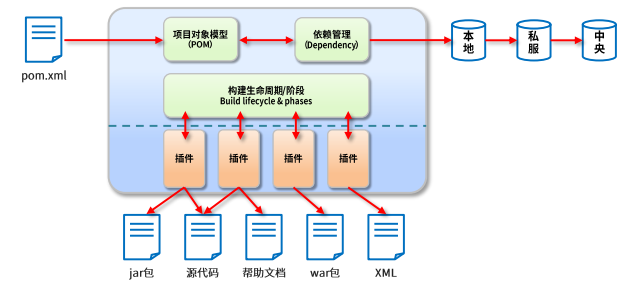

作用

- 项目构建：提供标准的、跨平台的自动化项目构建方式
- 依赖管理：方便快捷的管理项目依赖的资源（jar包），避免资源间的版本冲突问题
- 统一开发结构：提供标准的、统一的项目结构

## 二、下载与安装

1. 官网：http://maven.apache.org/
2. 安装
   - 依赖Java，需要配置JAVA_HOME
   - 设置Maven自身的运行环境，配置MAVEN_HOME，并将bin路径配置在path中
   - 使用MVN在cmd中测试是否成功

## 三、Maven基础概念

### 1. 仓库

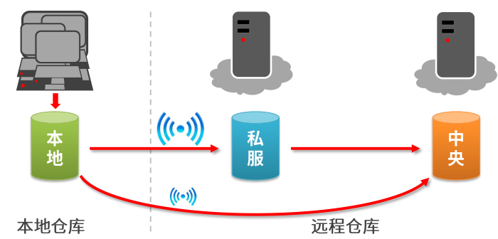

- 仓库：用于存储资源，包含各种jar包
- 仓库分类：
  - 本地仓库：自己电脑上存储资源的仓库，连接远程仓库获取资源
  - 远程仓库：非本机电脑上的仓库，为本地仓库提供资源
    - 中央仓库：Maven团队维护，存储所有资源的仓库
    - 私服：部门、公司范围内存储资源的仓库，从中央仓库获取资源
- 私服的作用
  - 保护具有版权的资源，包含购买或自主研发的jar

### 2. 坐标

- Maven中的坐标用于描述仓库中资源的位置：https://repo1.maven.org/maven2/

- Maven坐标主要组成

  - groupId：定义当前Maven项目隶属组织名称（通常是域名反写，如org.mybatis）
  - artifactId：定义当前Maven项目名称（通常是模块名称，如CRM、SMS）
  - version：定义当前项目版本号
  - packaging：定义该项目的打包方式

- 作用

  使用唯一表示，唯一性定位资源位置，通过该标识可以将资源的识别与下载工作交由机器完成

### 3. 本地仓库配置

- Maven启动后，会自动保存下载的资源到本地仓库

  - 默认位置

    ```xml
    <!-- 当前目录位置为登录用户名所在目录下的.m2文件夹中 -->
    <localRepository>${user.home}/.m2/repository</localRepository>
    ```

  - 自定义位置

    ```xml
    <localRepository>D:\maven\repository</localRepository>
    ```

### 4. 远程仓库配置

Maven默认连接的仓库位置

```xml
<repositories>
	<repository>
        <id>central</id>
        <name>Central Repository</name>
        <url>https://repo.maven.apache.org/maven2</url>
        <layout>default</layout>
        <snapshots>
            <enabled>false</enabled>
        </snapshots>
    </repository>
</repositories>
```

### 5. 镜像仓库配置

在setting文件中配置阿里云镜像仓库

```xml
<mirrors>
    <!--配置具体的仓库的下载镜像 -->
    <mirror>
        <!-- 此镜像的唯一标识符，用来区分不同的mirror元素 -->
        <id>nexus-aliyun</id>
        <!-- 对那种仓库进行镜像，就是替代哪个仓库-->
        <mirrorOf>central</mirrorOf>
        <!-- 镜像名称-->
        <name>Nexus aliyun</name>
        <!-- 镜像URL -->
        <url>http://maven.aliyun.com/nexus/content/groups/public</url>
    </mirror>
</mirrors>
```

### 6. 全局setting与用户setting的区别

- 全局setting定义了当前计算机中的Maven公共配置
- 用户setting定义了当前用户的配置

## 四、构建Maven项目

### 1. Maven工程目录结构

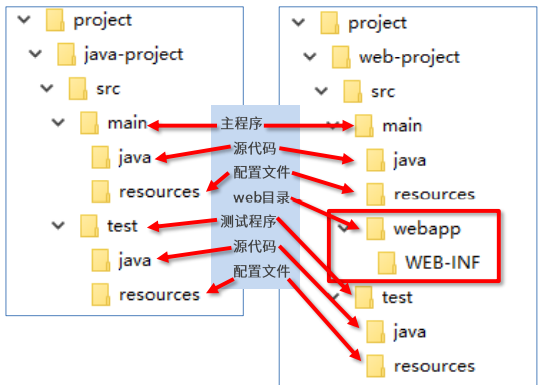

在src同层目录下创建pom.xml

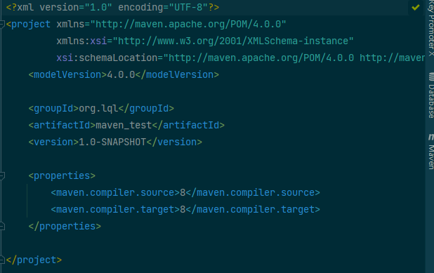

### 2. Maven项目构建命令

Maven构建命令使用mvn开头，后面添加功能参数，可以一次执行多个命令，使用空格分隔

```
mvn compile			 #编译
mvn clean 			 #清理
mvn test 			 #测试
mvn package 		 #打包
mvn install 		 #安装到本地仓库
```

### 3. 骨架创建工程

- 创建工程

  ```
  mvn archetype:generate
  -DgroupId={project-packaging} 
  -DartifactId={project-name} 
  -DarchetypeArtifactId=maven-archetype-quickstart
  -DinteractiveMode=false
  ```

- 创建java工程

  ```
  mvn archetype:generate 
  -DgroupId=com.itheima 
  -DartifactId=java-project 
  -DarchetypeArtifactId=maven-archetype-quickstart 
  -Dversion=0.0.1-snapshot 
  -DinteractiveMode=false
  ```

- 创建web工程

  ```
  mvn archetype:generate 
  -DgroupId=com.itheima 
  -DartifactId=web-project 
  -DarchetypeArtifactId=maven-archetype-webapp 
  -Dversion=0.0.1-snapshot 
  -DinteractiveMode=false 
  ```

### 4. Tomcat7运行插件

```xml
<build>
    <plugins>
        <plugin>
            <groupId>org.apache.tomcat.maven</groupId>
            <artifactId>tomcat7-maven-plugin</artifactId>
            <version>2.1</version>
            <configuration>
                <port>80</port>
                <path>/</path>
            </configuration>
        </plugin>
    </plugins>
</build>

```

## 五、依赖管理

### 1. 依赖配置

依赖指当前项目运行所需的jar，一个项目可以设置多个依赖

```xml
<!-- 设置当前项目所依赖的所有jar-->
<dependencies>
    <!-- 设置具体的依赖-->
    <dependency>
        <!-- 依赖所属群组id-->
        <groupId>junit</groupId>
        <!-- 依赖所属项目id-->
        <artifactId>junit</artifactId>
        <!-- 依赖版本号-->
        <version>4.12</version>
    </dependency>
</dependencies>
```

### 2. 依赖传递

- 直接依赖：在当前项目中通过依赖配置建立的依赖关系

- 间接依赖：被依赖的资源如果依赖其他资源，当前项目间接依赖其他资源

  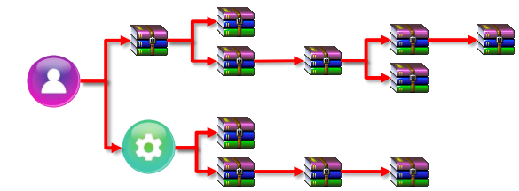

### 3. 依赖传递冲突问题

- 路径优先：当依赖中出现相同的资源时，层级越深，优先级越低，层级越浅，优先级越高

- 声明优先：当资源在相同层级被依赖时，配置顺序靠前的覆盖配置顺序靠后的

- 特殊优先：当同级配置了相同资源的不同版本，后配置的覆盖先配置的

  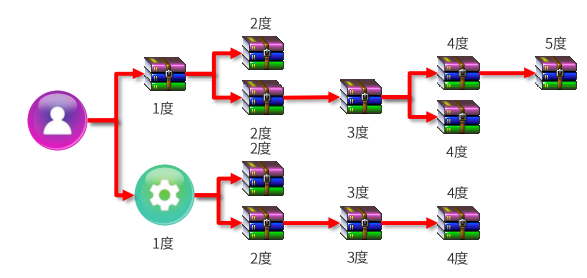

### 4. 可选依赖

可选依赖指对外隐藏当前所依赖的资源—–不透明

```xml
<dependency>
    <groupId>junit</groupId>
    <artifactId>junit</artifactId>
    <version>4.12</version>
    <optional>true</optional>
</dependency>
```

### 5. 依赖排除

排除依赖指主动断开依赖的资源，被排除的资源无需指定版本

```xml
<dependency>
    <groupId>junit</groupId>
    <artifactId>junit</artifactId>
    <version>4.12</version>
    <exclusions>
        <exclusion>
            <groupId>org.hamcrest</groupId>
            <artifactId>hamcrest-core</artifactId>
        </exclusion>
    </exclusions>
</dependency>
```

### 6. 依赖范围

- 依赖的jar默认情况可以再任何地方使用，可以通过scope标签设定其作用范围
- 作用范围：默认为compile
  - 主程序范围（main文件夹范围内）
  - 测试程序范围（test文件夹范围内）
  - 是否参与打包（package指令范围内）

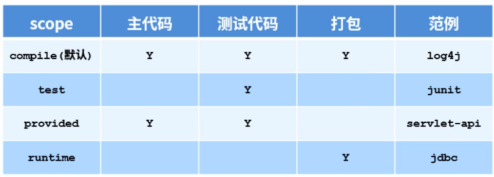

### 7. 依赖范围传递性

带有依赖范围的资源在进行传递时，作用范围将受到影响

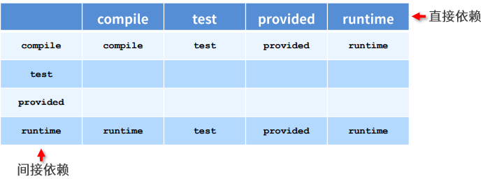

## 六、生命周期与插件

### 1. 项目构建生命周期

Maven构建生命周期描述的是一次构建过程经历了多少个事件


- Maven对项目构建的生命周期划分为3套
  - clean：清理工作
  - default：核心工作，如编译、测试、打包、部署等
  - site：产生报告，发布站点等

### 2. clean生命周期

- prec-clean：执行一些需要clean之前完成的工作
- clean：移除所有上一次构建生成的文件
- post-clean：执行一些需要在clean之后立刻完成的工作

### 3. default构建生命周期

- validate（校验）：校验项目是否正确并且所有必要的信息可以完成项目的构建过程
- initialize（初始化）：初始化构建状态，如设置属性值
- generate-sources（生成源代码）：生成包含在编译阶段中的任何源代码
- process-sources（处理源代码）：处理源代码，如过滤任意值
- generate-resources（生成资源文件）：生成将会包含在项目中的资源文件
- process-resources（处理资源文件）：复制和处理资源到目标目录，为打包阶段做好准备
- **compile**（编译）：编译项目的源代码
- process-classes（处理类文件）：处理编译生成的文件，如对java class文件做字节码改善优化
- generate-test-sources（生成测试源代码）：生成包含在编译阶段中的任何测试源代码
- process-test-sources（处理测试源代码）：处理测试源代码，如过滤任意值
- generate-test-resources（生成测试资源文件）：为测试创建资源文件
- process-test-resources（处理测试资源文件）：复制和处理测试资源到目标目录
- **test-compile**（编译测试源码）：编译测试源代码到测试目标目录
- process-test-classes（处理测试类文件）：处理测试源码编译生成的文件
- **test**（测试）：使用合适的单元测试框架运行测试
- prepare-package（准备打包）：在实际打包之前，执行任何的必要操作为打包做准备
- **package**（打包）：将编译后的代码打包成可分发格式的文件，如jar、war或者ear文件
- pre-integration-test（集成测试前）：在执行集成测试前进行必要的动作，如搭建需要的环境
- integration-test（集成测试）：处理和部署项目到可以运行集成测试环境中
- post-integration-test（集成测试后）：在执行集成测试完成后进行必要的动作，如清理集成测试环境
- verify（验证）：运行任意的检查来验证项目包有效且达到质量标准
- **install**（安装）：安装项目包到本地仓库，这样项目包可以用作其他本地项目的依赖
- deploy（部署）：将最终项目包赋值到远程仓库中与其他开发者和项目共享

### 4. site构建生命周期

- prec-site：执行一些需要在生成站点文档之前完成的工作
- site：生成项目的站点文档
- post-site：执行一些需要在生成站点文档之后完成的工作，并且为部署做准备
- site-deploy：将生成的站点文档部署到特定的服务器上

### 5. 插件

1. 插件与生命周期内的阶段绑定，在执行到对应生命周期时执行对应的插件功能

2. 默认maven在各个生命周期上绑定有预设的功能

3. 通过插件可以定义其他功能

   ```xml
   <build>
       <plugins>
           <plugin>
               <groupId>org.apache.maven.plugins</groupId>
               <artifactId>maven-source-plugin</artifactId>
               <version>2.2.1</version>
               <executions>
                   <execution>
                       <goals>
                           <goal>jar</goal>
                       </goals>
                       <phase>generate-test-resources</phase>
                   </execution>
               </executions>
           </plugin>
       </plugins>
   </build>
   ```

## 七、分模块开发与设计

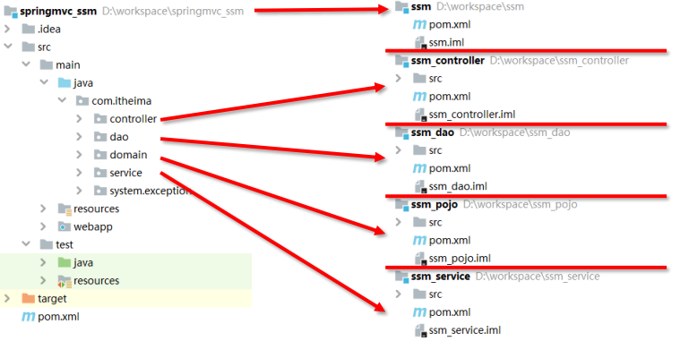

## 八、聚合

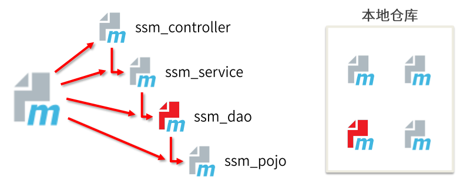

- 作用：聚合用于快速构建maven工程，一次性构建多个项目模块

- 制作方式

  - 创建一个空模块，打包类型定义为pom

    ```xml
    <packaging>pom</packaging>
    ```

  - 定义当前模块进行构建操作时相关联的其他模块名称

    ```xml
    <!-- 参与聚合操作的模块最终执行顺序与模块间的依赖关系有关，与配置顺序无关-->
    <modules>
        <module>../ssm_controller</module>
        <module>../ssm_service</module>
        <module>../ssm_dao</module>
        <module>../ssm_pojo</module>
    </modules>
    ```

## 九、继承

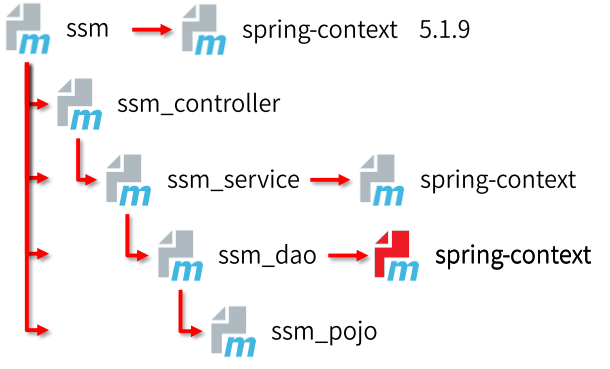

### 作用

通过继承可以实现在子工程中沿用父工程中的配置

- maven中的基础与java中的继承相似，在子工程中配置继承关系

### 制作方式

- 在子工程中声明其父工程坐标与对应的位置

  ```xml
  <!-- 定义该工程的父工程-->
  <parent>
      <groupId>com.itheima</groupId>
      <artifactId>ssm</artifactId>
      <version>1.0-SNAPSHOT</version>
      <!-- 填写父工程的pom文件 -->
      <relativePath>../ssm/pom.xml</relativePath>
  </parent>
  ```

### 继承依赖定义

- 在父工程中定义依赖管理

  ```xml
  <!-- 声明此处进行依赖管理-->
  <dependencyManagement>
      <!-- 具体的依赖-->
      <dependencies>
          <!--spring环境 -->
          <dependency>
              <groupId>org.springframework</groupId>
              <artifactId>spring-context</artifactId>
              <version>5.1.9.RELEASE</version>
          </dependency>
          <dependencies>
  <dependencyManagement>
  ```

### 继承依赖使用

- 在子工程中定义依赖关系，无需声明依赖版本，版本参照父工程中依赖的版本

  ```xml
  <dependencies>
      <!--spring环境 -->
      <dependency>
          <groupId>org.springframework</groupId>
          <artifactId>spring-context</artifactId>
      </dependency>
  </dependencies>
  ```

### 继承的资源

- groupId：项目组id，项目坐标的核心元素
- version：项目版本，项目坐标的核心因素
- description：项目的描述信息
- organization：项目的组织信息
- inceptionYear：项目的创始年份
- url：项目的URL地址
- developers：项目的开发者信息
- contributors：项目的贡献值信息
- distributionManagerment：项目的部署信息
- issueManagement：项目的缺陷跟踪系统信息
- ciManagement：项目的持续集成系统信息
- scm：项目的版本控制系统信息
- malilingLists：项目的邮件列表信息
- properties：自定义的Maven属性
- dependencies：项目的依赖配置
- dependencyManagement：项目的依赖管理配置
- repositories：项目的仓库配置
- build：包括项目的源码目录配置、输出目录配置、插件配置、插件管理配置等
- reporting：包括项目的报告输出目录配置、报告插件配置等

### 继承与聚合

- 作用
  - 聚合用于快速构建项目
  - 继承用于快速配置
- 相同点
  - 聚合与继承的pom.xml文件打包方式均为pom，可以将两种关系制作到同一个pom文件中
  - 聚合与继承均属于设计性模块，并无实际的模块内容
- 不同点
  - 聚合是在当前模块中配置关系，聚合可以感知到参与聚合的模块有哪些
  - 继承是子模块中配置关系，父模块无法感知哪些子模块继承了自己

## 十、属性

### 属性类别

1. 自定义属性

   - 作用

     - 等同于定义变量，方便统一维护

   - 格式

     ```xml
     <!-- 定义自定义属性-->
     <properties>
         <spring.version>5.1.9.RELEASE</spring.version>
         <junit.version>4.12</junit.version>
     </properties>
     ```

   - 调用

     ```xml
     <dependency>
         <groupId>org.springframework</groupId>
         <artifactId>spring-context</artifactId>
         <version>${spring.version}</version>
     </dependency>
     ```

2. 内置属性

   - 作用

     - 使用maven内置属性快速配置

   - 调用

     ```xml
     ${basedir}
     ${version}
     ```

3. setting属性

   - 作用

     - 使用maven配置文件setting.xml中的标签属性，用于动态配置

   - 调用

     ```
     ${settings.localRepository}
     ```

4. java系统属性

   - 作用

     - 读取java系统属性

   - 调用

     ```
     ${user.home}
     ```

   - 系统属性查询方式

     ```
     mvn help:system
     ```

5. 环境变量属性

   - 作用

     - 使用maven配置文件setting.xml中的标签属性，用于动态配置

   - 调用

     ```
     ${env.JAVA_HOME}
     ```

   - 环境变量属性查询方式

     ```
     mvn help:system
     ```

## 十一、版本管理

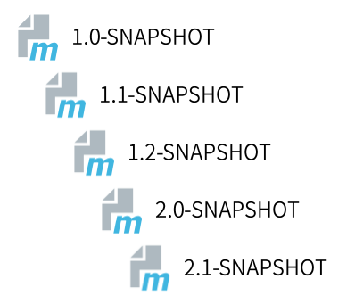

### 工程版本

- SNAPSHOT（快照版本）
  - 项目开发过程中，为方便团队成员合作，解决模块间相互依赖和实时更新的问题，开发者对每个模块进行构建的时候，输出的临时性版本叫快照版本（测试阶段版本）
  - 快照版本会随着开发的进展不断更新
- RELEASE（发布版本）
  - 项目开发到进入阶段里程碑后，向团队外部发布较为稳定的版本，这种版本所对应的构建文件是稳定的，即便进行功能的后续开发，也会改变当前发布版本内容，这种版本称为发布版本

### 工程版本号约定

- 约定规范
  - 主版本.次版本.增量版本.里程碑版本
  - 主版本：表示项目重大架构的变更，如spring5相较于spring4的迭代
  - 次版本：表示由较大的功能增加和变化，或全面系统地修复漏洞
  - 增量版本：表示由重大漏洞的修复
  - 里程碑版本：表名一个版本的里程碑（版本内部），这样的版本同下一个正式版本相比，相对来说不是很稳定，有待更多的测试

## 十二、资源配置

### 资源配置多文件维护

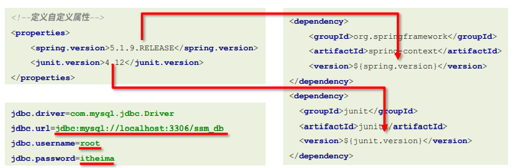

### 配置文件引用pom属性

- 作用

  - 在任意配置文件中加载pom文件中定义的属性

- 调用格式：`${jdbc.url}`

- 开启配置文件加载pom属性

  ```xml
  <!-- 配置资源文件对应的信息-->
  <resources>
      <resource>
          <!-- 设定配置文件对应的位置目录，支持使用属性动态设定路径-->
          <directory>${project.basedir}/src/main/resources</directory>
          <!-- 开启对配置文件的资源加载过滤-->
          <filtering>true</filtering>
      </resource>
  </resources>
  ```

## 十三、多环境开发配置

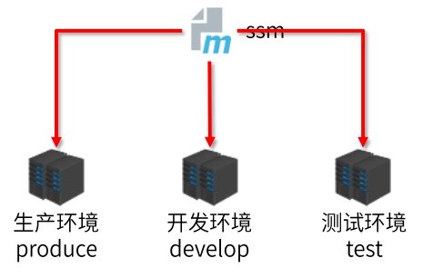

### 多环境配置

```xml
<!-- 创建多环境-->
<profiles>
    <!-- 定义具体的环境：生成环境-->
    <profile>
        <!-- 定义环境对应的唯一名称-->
        <id>pro_env</id>
        <!-- 定义环境专用的属性值-->
        <properties>
            <jdbc.url>jdbc:mysql://127.1.1.1:3306/ssm_db</jdbc.url>
        </properties>
        <!-- 设置默认启动-->
        <activation>
            <activeByDefault>true</activeByDefault>
        </activation>
    </profile>
    <!--  定义具体的环境：开发环境-->
    <profile>
        <id>dev_env</id>
        ……
    </profile>
</profiles>
```

### 加载指定环境

- 作用
  - 加载指定环境配置
- 调用格式：`mvn 指令 -P  环境定义id`

## 十四、跳过测试

1. 命令：`mvn 指令 -D skipTests`

2. 使用配置跳过测试

   ```xml
   <plugin>
       <artifactId>maven-surefire-plugin</artifactId>
       <version>2.22.1</version>
       <configuration>
           <skipTests>true</skipTests><!-- 设置跳过测试-->
           <includes> <!-- 包含指定的测试用例-->
               <include>**/User*Test.java</include>
           </includes>
           <excludes><!-- 排除指定的测试用例-->
               <exclude>**/User*TestCase.java</exclude>
           </excludes>
       </configuration>
   </plugin>
   ```

## 十五、私服

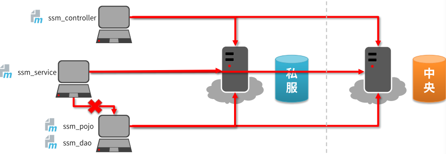

### Nexus

- Nexus是Sonatype公司的一款maven私服产品
- 下载地址：https://help.sonatype.com/repomanager3/download

### Nexus安装、启动与配置

- 启动服务器：`nexus.exe /run  nexus`
- 访问服务器（默认端口8081）：http://localhost:8081
- 修改基础配置信息
  - 安装路径下etc目录中nexus-default.properties文件保存有nexus基础配置信息
- 修改服务器运行配置信息
  - 安装路径下bin目录nexus.vmoptions文件保存有nexus文件保存有nexus服务器启动对应的配置信息

### 私服资源获取

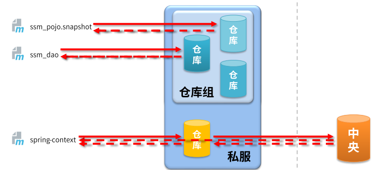

### 仓库分类

- 宿主仓库hosted
  - 保存无法从中央仓库获取的资源
    - 自主研发
    - 第三方非开源项目
- 代理仓库proxy
  - 代理远程仓库，通过nexus访问其他公共仓库，如中央仓库
- 仓库组group
  - 将若干仓库组成一个群组，简化配置
  - 仓库组不能保存资源，属于设计性仓库

### 资源上传

上传资源时提供对应的信息

- 保存的位置（宿主仓库）
- 资源文件
- 对应坐标

### idea中资源上传与下载

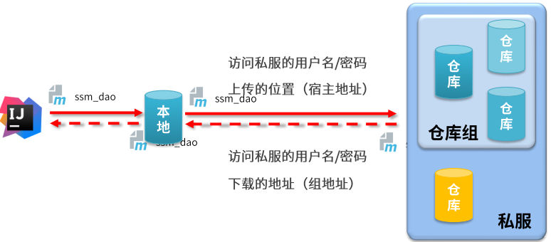

- 访问私服配置（本地仓库访问私服）

  - 配置本地仓库防伪私服的权限（setting.xml）

    ```xml
    <servers>
        <server>
            <id>heima-release</id>
            <username>admin</username>
            <password>admin</password>
        </server>
        <server>
            <id>heima-snapshots</id>
            <username>admin</username>
            <password>admin</password>
        </server>
    </servers>
    ```

  - 配置本地仓库资源来源（setting.xml）

    ```xml
    <mirrors>
        <mirror>
            <id>nexus-heima</id>
            <mirrorOf>*</mirrorOf>
            <url>http://localhost:8081/repository/maven-public/</url>
        </mirror>
    </mirrors>
    ```

- 访问私服配置（项目工程访问私服）

  - 配置当前项目访问私服上传资源的保存位置（pom.xml）

    ```xml
    <mirrors>
        <mirror>
            <id>nexus-heima</id>
            <mirrorOf>*</mirrorOf>
            <url>http://localhost:8081/repository/maven-public/</url>
        </mirror>
    </mirrors>
    ```

  - 发布资源到私服命令：`mvn deploy`

