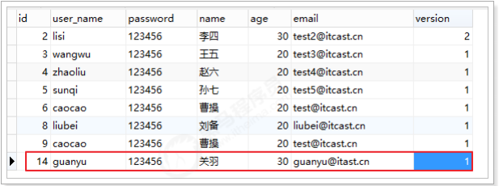
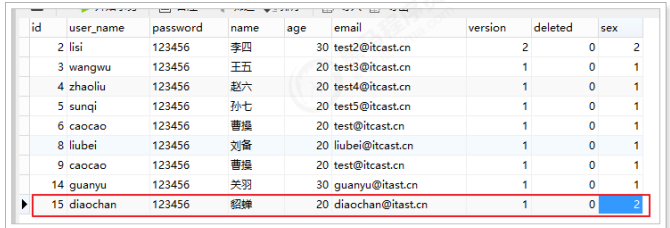
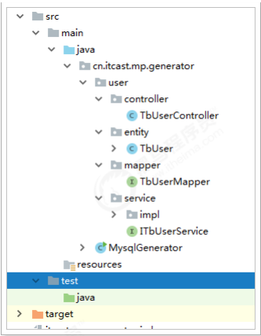
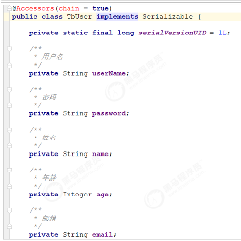
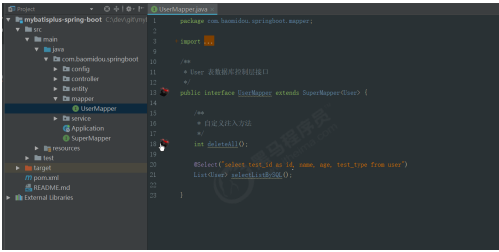

## 一、 ActiveRecord

ActiveRecord（简称AR）一直广受动态语言（ PHP 、 Ruby 等）的喜爱，而 Java 作为准静态语言，对于 ActiveRecord 往往只能感叹其优雅

> 什么是ActiveRecord？ 
>
> ActiveRecord也属于ORM（对象关系映射）层，由Rails最早提出，遵循标准的ORM模型：表映射到记录，记 录映射到对象，字段映射到对象属性。配合遵循的命名和配置惯例，能够很大程度的快速实现模型的操作，而 且简洁易懂。 
>
> ActiveRecord的主要思想是： 
>
> * 每一个数据库表对应创建一个类，类的每一个对象实例对应于数据库中表的一行记录；通常表的每个字段 在类中都有相应的Field； 
> * ActiveRecord同时负责把自己持久化，在ActiveRecord中封装了对数据库的访问，即CURD;
> * ActiveRecord是一种领域模型(Domain Model)，封装了部分业务逻辑；

### 1.1 开启AR之旅

在MP中，开启AR非常简单，只需要将实体对象继承Model即可。

```java
package cn.itcast.mp.pojo;
import com.baomidou.mybatisplus.annotation.IdType;
import com.baomidou.mybatisplus.annotation.TableField;
import com.baomidou.mybatisplus.annotation.TableId;
import com.baomidou.mybatisplus.annotation.TableName;
import com.baomidou.mybatisplus.extension.activerecord.Model;
import lombok.AllArgsConstructor;
import lombok.Data;
import lombok.NoArgsConstructor;
@Data
@NoArgsConstructor
@AllArgsConstructor
public class User extends Model<User> {
    private Long id;
    private String userName;
    private String password;
    private String name;
    private Integer age;
    private String email;
}
```

### 1.2 根据主键查询

```java
@RunWith(SpringRunner.class)
@SpringBootTest
public class UserMapperTest {
    @Autowired
    private UserMapper userMapper;
    @Test
    public void testAR() {
        User user = new User();
        user.setId(2L);
        User user2 = user.selectById();
        System.out.println(user2);
    }
}
```

### 1.3  新增数据

``` java
@RunWith(SpringRunner.class)
@SpringBootTest
public class UserMapperTest {
    @Autowired
    private UserMapper userMapper;
    @Test
    public void testAR() {
        User user = new User();
        user.setName("刘备");
        user.setAge(30);
        user.setPassword("123456");
        user.setUserName("liubei");
        user.setEmail("liubei@itcast.cn");
        boolean insert = user.insert();
        System.out.println(insert);
    }
}
```

结果：

```java
[main] [cn.itcast.mp.mapper.UserMapper.insert]-[DEBUG] ==> Preparing: INSERT INTO
tb_user ( user_name, password, name, age, email ) VALUES ( ?, ?, ?, ?, ? )
[main] [cn.itcast.mp.mapper.UserMapper.insert]-[DEBUG] ==> Parameters: liubei(String),
123456(String), 刘备(String), 30(Integer), liubei@itcast.cn(String)
[main] [cn.itcast.mp.mapper.UserMapper.insert]-[DEBUG] <== Updates: 1
```


### 1.4 更新操作

```java
@RunWith(SpringRunner.class)
@SpringBootTest
public class UserMapperTest {
    @Autowired
    private UserMapper userMapper;
    @Test
    public void testAR() {
        User user = new User();
        user.setId(8L);
        user.setAge(35);
        boolean update = user.updateById();
        System.out.println(update);
    }
}
```

结果：

```java
[main] [cn.itcast.mp.mapper.UserMapper.updateById]-[DEBUG] ==> Preparing: UPDATE
tb_user SET age=? WHERE id=?
[main] [cn.itcast.mp.mapper.UserMapper.updateById]-[DEBUG] ==> Parameters: 35(Integer),
8(Long)
[main] [cn.itcast.mp.mapper.UserMapper.updateById]-[DEBUG] <== Updates: 1
```


### 1.5 删除操作

```java
@RunWith(SpringRunner.class)
@SpringBootTest
public class UserMapperTest {
    @Autowired
    private UserMapper userMapper;
    @Test
    public void testAR() {
        User user = new User();
        user.setId(7L);
        boolean delete = user.deleteById();
        System.out.println(delete);
    }
}
```

结果：

```java
[main] [cn.itcast.mp.mapper.UserMapper.deleteById]-[DEBUG] ==> Preparing: DELETE FROM
tb_user WHERE id=?
[main] [cn.itcast.mp.mapper.UserMapper.deleteById]-[DEBUG] ==> Parameters: 7(Long)
[main] [cn.itcast.mp.mapper.UserMapper.deleteById]-[DEBUG] <== Updates: 1
```

### 1.6 根据条件查询

```java
@RunWith(SpringRunner.class)
@SpringBootTest
public class UserMapperTest {
    @Autowired
    private UserMapper userMapper;
    @Test
    public void testAR() {
        User user = new User();
        QueryWrapper<User> userQueryWrapper = new QueryWrapper<>();
        userQueryWrapper.le("age","20");
        List<User> users = user.selectList(userQueryWrapper);
        for (User user1 : users) {
            System.out.println(user1);
        }
    }
}
```

结果：

```java
[main] [cn.itcast.mp.mapper.UserMapper.selectList]-[DEBUG] ==> Preparing: SELECT
id,user_name,password,name,age,email FROM tb_user WHERE age <= ?
[main] [cn.itcast.mp.mapper.UserMapper.selectList]-[DEBUG] ==> Parameters: 20(String)
[main] [cn.itcast.mp.mapper.UserMapper.selectList]-[DEBUG] <== Total: 2
User(id=2, userName=lisi, password=123456, name=李四, age=20, email=test2@itcast.cn,
address=null)
User(id=6, userName=caocao, password=123456, name=曹操, age=20, email=test@itcast.cn,
address=null)
```


## 二、Oracle 主键Sequence

在mysql中，主键往往是自增长的，这样使用起来是比较方便的，如果使用的是Oracle数据库，那么就不能使用自增 长了，就得使用Sequence 序列生成id值了。

### 2.1 部署Oracle环境

为了简化环境部署，这里使用Docker环境进行部署安装Oracle。

``` shell
#拉取镜像
docker pull sath89/oracle-12c
#创建容器
docker create --name oracle -p 1521:1521 sath89/oracle-12c
#启动
docker start oracle && docker logs -f oracle
#下面是启动过程
Database not initialized. Initializing database.
Starting tnslsnr

Copying database files
1% complete
3% complete
11% complete
18% complete
26% complete
37% complete
Creating and starting Oracle instance
40% complete
45% complete
50% complete
55% complete
56% complete
60% complete
62% complete
Completing Database Creation
66% complete
70% complete
73% complete
85% complete
96% complete
100% complete
Look at the log file "/u01/app/oracle/cfgtoollogs/dbca/xe/xe.log" for further details.
Configuring Apex console
Database initialized. Please visit http://#containeer:8080/em
http://#containeer:8080/apex for extra configuration if needed
Starting web management console
PL/SQL procedure successfully completed.
Starting import from '/docker-entrypoint-initdb.d':
ls: cannot access /docker-entrypoint-initdb.d/*: No such file or directory
Import finished
Database ready to use. Enjoy! ;)
#通过用户名密码即可登录
用户名和密码为： system/oracle
```

### 2.2 创建表以及序列

```sql
--创建表，表名以及字段名都要大写
CREATE TABLE "TB_USER" (
"ID" NUMBER(20) VISIBLE NOT NULL ,
"USER_NAME" VARCHAR2(255 BYTE) VISIBLE ,
"PASSWORD" VARCHAR2(255 BYTE) VISIBLE ,
"NAME" VARCHAR2(255 BYTE) VISIBLE ,
"AGE" NUMBER(10) VISIBLE ,
"EMAIL" VARCHAR2(255 BYTE) VISIBLE
)
--创建序列
CREATE SEQUENCE SEQ_USER START WITH 1 INCREMENT BY 1
```

### 2.3 jdbc驱动包

由于版权原因，不能直接通过maven的中央仓库下载oracle数据库的jdbc驱动包，所以需要将驱动包安装到 本地仓库。

```shell
#ojdbc8.jar文件在资料中可以找到
mvn install:install-file -DgroupId=com.oracle -DartifactId=ojdbc8 -Dversion=12.1.0.1 -Dpackaging=jar -Dfile=ojdbc8.jar
```

安装完成后的坐标：

```xml
<dependency>
    <groupId>com.oracle</groupId>
    <artifactId>ojdbc8</artifactId>
    <version>12.1.0.1</version>
</dependency>
```

### 2.4 修改application.properties

对于application.properties的修改，需要修改2个位置，分别是：

```properties
#数据库连接配置
spring.datasource.driver-class-name=oracle.jdbc.OracleDriver
spring.datasource.url=jdbc:oracle:thin:@192.168.31.81:1521:xe
spring.datasource.username=system
spring.datasource.password=oracle
#id生成策略
mybatis-plus.global-config.db-config.id-type=input
```

### 2.5 配置序列

使用Oracle的序列需要做2件事情：

1. 需要配置MP的序列生成器到Spring容器：

   ```java
   package cn.itcast.mp;
   import com.baomidou.mybatisplus.extension.incrementer.OracleKeyGenerator;
   import com.baomidou.mybatisplus.extension.plugins.PaginationInterceptor;
   import org.mybatis.spring.annotation.MapperScan;
   import org.springframework.context.annotation.Bean;
   import org.springframework.context.annotation.Configuration;
   @Configuration
   @MapperScan("cn.itcast.mp.mapper") //设置mapper接口的扫描包
   public class MybatisPlusConfig {
       /**
       * 分页插件
       */
       @Bean
       public PaginationInterceptor paginationInterceptor() {
           return new PaginationInterceptor();
       }
       /**
       * 序列生成器
       */
       @Bean
       public OracleKeyGenerator oracleKeyGenerator(){
           return new OracleKeyGenerator();
       }
   }
   ```

2. 在实体对象中指定序列的名称：

   ```java
   @KeySequence(value = "SEQ_USER", clazz = Long.class)
   public class User{
   ......
   }
   ```

### 2.6 测试

```java
package cn.itcast.mp;
import cn.itcast.mp.mapper.UserMapper;
import cn.itcast.mp.pojo.User;
import org.junit.Test;
import org.junit.runner.RunWith;
import org.springframework.beans.factory.annotation.Autowired;
import org.springframework.boot.test.context.SpringBootTest;
import org.springframework.test.context.junit4.SpringRunner;
import java.util.List;
@RunWith(SpringRunner.class)
@SpringBootTest
public class UserMapperTest {
    @Autowired
    private UserMapper userMapper;
    @Test
    public void testInsert(){
        User user = new User();
        user.setAge(20);
        user.setEmail("test@itcast.cn");
        user.setName("曹操");
        user.setUserName("caocao");
        user.setPassword("123456");
        int result = this.userMapper.insert(user); //返回的result是受影响的行数，并不是自增
        后的id
            System.out.println("result = " + result);
        System.out.println(user.getId()); //自增后的id会回填到对象中
    }
    @Test
    public void testSelectById(){
        User user = this.userMapper.selectById(8L);
        System.out.println(user);
    }
}
```


## 三、 插件

### 3.1 mybatis的插件机制

MyBatis 允许你在已映射语句执行过程中的某一点进行拦截调用。默认情况下，MyBatis 允许使用插件来拦截的方法 调用包括：

* Executor (update, query, flushStatements, commit, rollback, getTransaction, close, isClosed)
* ParameterHandler (getParameterObject, setParameters)
* ResultSetHandler (handleResultSets, handleOutputParameters)
* StatementHandler (prepare, parameterize, batch, update, query)

可以拦截Executor接口的部分方法，比如update，query，commit，rollback等方法，还有其他接口的 一些方法等。

总体概括为：

* 拦截执行器的方法
* 拦截参数的处理
* 拦截结果集的处理
* 拦截结果集的处理

拦截器示例：

```java
package cn.itcast.mp.plugins;
import org.apache.ibatis.executor.Executor;
import org.apache.ibatis.mapping.MappedStatement;
import org.apache.ibatis.plugin.*;
import java.util.Properties;
@Intercepts({@Signature(
    type= Executor.class,
    method = "update",
    args = {MappedStatement.class,Object.class})})
public class MyInterceptor implements Interceptor {
    @Override
    public Object intercept(Invocation invocation) throws Throwable {
        //拦截方法，具体业务逻辑编写的位置
        return invocation.proceed();
    }
    @Override
    public Object plugin(Object target) {
        //创建target对象的代理对象,目的是将当前拦截器加入到该对象中
        return Plugin.wrap(target, this);
    }
    @Override
    public void setProperties(Properties properties) {
        //属性设置
    }
}
```

注入到Spring容器：

```java
/**
* 自定义拦截器
*/
@Bean
public MyInterceptor myInterceptor(){
    return new MyInterceptor();
}
```

或者通过xml配置，mybatis-config.xml：

```xml
<?xml version="1.0" encoding="UTF-8" ?>
<!DOCTYPE configuration
PUBLIC "-//mybatis.org//DTD Config 3.0//EN"
"http://mybatis.org/dtd/mybatis-3-config.dtd">
<configuration>
    <plugins>
        <plugin interceptor="cn.itcast.mp.plugins.MyInterceptor"></plugin>
    </plugins>
</configuration>

```

### 3.2 执行分析插件

在MP中提供了对SQL执行的分析的插件，可用作阻断全表更新、删除的操作，注意：该插件仅适用于开发环境，不 适用于生产环境。

SpringBoot配置：

```java
@Bean
public SqlExplainInterceptor sqlExplainInterceptor(){
    SqlExplainInterceptor sqlExplainInterceptor = new SqlExplainInterceptor();
    List<ISqlParser> sqlParserList = new ArrayList<>();
    // 攻击 SQL 阻断解析器、加入解析链
    sqlParserList.add(new BlockAttackSqlParser());
    sqlExplainInterceptor.setSqlParserList(sqlParserList);
    return sqlExplainInterceptor;
}
```

测试：

```java
@Test
public void testUpdate(){
    User user = new User();
    user.setAge(20);
    int result = this.userMapper.update(user, null);
    System.out.println("result = " + result);
}
```

结果：

```tex
Caused by: com.baomidou.mybatisplus.core.exceptions.MybatisPlusException: Prohibition
of table update operation
at
com.baomidou.mybatisplus.core.toolkit.ExceptionUtils.mpe(ExceptionUtils.java:49)
at com.baomidou.mybatisplus.core.toolkit.Assert.isTrue(Assert.java:38)
at com.baomidou.mybatisplus.core.toolkit.Assert.notNull(Assert.java:72)
at
com.baomidou.mybatisplus.extension.parsers.BlockAttackSqlParser.processUpdate(BlockAtt
ackSqlParser.java:45)
at
com.baomidou.mybatisplus.core.parser.AbstractJsqlParser.processParser(AbstractJsqlPars
er.java:92)
at
com.baomidou.mybatisplus.core.parser.AbstractJsqlParser.parser(AbstractJsqlParser.java
:67)
at
com.baomidou.mybatisplus.extension.handlers.AbstractSqlParserHandler.sqlParser(Abstrac
tSqlParserHandler.java:76)
at
com.baomidou.mybatisplus.extension.plugins.SqlExplainInterceptor.intercept(SqlExplainI
nterceptor.java:63)
at org.apache.ibatis.plugin.Plugin.invoke(Plugin.java:61)
at com.sun.proxy.$Proxy70.update(Unknown Source)
at
org.apache.ibatis.session.defaults.DefaultSqlSession.update(DefaultSqlSession.java:197
)
... 41 more
```

可以看到，当执行全表更新时，会抛出异常，这样有效防止了一些误操作。

### 3.3 性能分析插件

性能分析拦截器，用于输出每条 SQL 语句及其执行时间，可以设置最大执行时间，超过时间会抛出异常。

> 该插件只用于开发环境，不建议生产环境使用。

配置：

``` xml
<?xml version="1.0" encoding="UTF-8" ?>
<!DOCTYPE configuration
PUBLIC "-//mybatis.org//DTD Config 3.0//EN"
"http://mybatis.org/dtd/mybatis-3-config.dtd">
<configuration>
    <plugins>
        <!-- SQL 执行性能分析，开发环境使用，线上不推荐。 maxTime 指的是 sql 最大执行时长 -->
        <plugin interceptor="com.baomidou.mybatisplus.extension.plugins.PerformanceInterceptor">
            <property name="maxTime" value="100" />
            <!--SQL是否格式化 默认false-->
            <property name="format" value="true" />
        </plugin>
    </plugins>
</configuration>
```

执行结果：

``` tex
Time：11 ms - ID：cn.itcast.mp.mapper.UserMapper.selectById
Execute SQL：
	SELECT
        id,
        user_name,
        password,
        name,
        age,
        email
	FROM
		tb_user
	WHERE
		id=7
```

可以看到，执行时间为11ms。如果将maxTime设置为1，那么，该操作会抛出异常。

```tex
Caused by: com.baomidou.mybatisplus.core.exceptions.MybatisPlusException: The SQL execution time is too large, please optimize !
	at com.baomidou.mybatisplus.core.toolkit.ExceptionUtils.mpe(ExceptionUtils.java:49)
	at com.baomidou.mybatisplus.core.toolkit.Assert.isTrue(Assert.java:38)
	................
```

### 3.4 乐观锁插件

#### 3.4.1 主要适用场景

意图：

当要更新一条记录的时候，希望这条记录没有被别人更新 

乐观锁实现方式： 

* 取出记录时，获取当前version 
* 更新时，带上这个version 
* 执行更新时， set version = newVersion where version = oldVersion 
* 如果version不对，就更新失败

#### 3.4.2 插件配置

spring xml:

```xml
<bean class="com.baomidou.mybatisplus.extension.plugins.OptimisticLockerInterceptor"/>
```

spring boot:

```java
@Bean
public OptimisticLockerInterceptor optimisticLockerInterceptor() {
    return new OptimisticLockerInterceptor();
}
```

#### 3.4.3 注解实体字段

需要为实体字段添加@Version注解。

1. 为表添加version字段，并且设置初始值为1：

   ```sql
   ALTER TABLE `tb_user`
   ADD COLUMN `version` int(10) NULL AFTER `email`;
   
   UPDATE `tb_user` SET `version`='1';
   ```

2. 为User实体对象添加version字段，并且添加@Version注解：

   ```java
   @Version
   private Integer version;
   ```

#### 3.4.4 测试

测试用例：

```java
@Test
public void testUpdate(){
    User user = new User();
    user.setAge(30);
    user.setId(2L);
    user.setVersion(1); //获取到version为1
    int result = this.userMapper.updateById(user);
    System.out.println("result = " + result);
}
```

执行日志：

```tex
[main] [com.baomidou.mybatisplus.extension.parsers.BlockAttackSqlParser]-[DEBUG]
Original SQL: UPDATE tb_user SET age=?,
version=? WHERE id=? AND version=?
[main] [com.baomidou.mybatisplus.extension.parsers.BlockAttackSqlParser]-[DEBUG]
parser sql: UPDATE tb_user SET age = ?, version = ? WHERE id = ? AND version = ?
[main] [org.springframework.jdbc.datasource.DataSourceUtils]-[DEBUG] Fetching JDBC
Connection from DataSource
[main] [org.mybatis.spring.transaction.SpringManagedTransaction]-[DEBUG] JDBC
Connection [HikariProxyConnection@540206885 wrapping
com.mysql.jdbc.JDBC4Connection@27e0f2f5] will not be managed by Spring
[main] [cn.itcast.mp.mapper.UserMapper.updateById]-[DEBUG] ==> Preparing: UPDATE
tb_user SET age=?, version=? WHERE id=? AND version=?
[main] [cn.itcast.mp.mapper.UserMapper.updateById]-[DEBUG] ==> Parameters:
30(Integer), 2(Integer), 2(Long), 1(Integer)
[main] [cn.itcast.mp.mapper.UserMapper.updateById]-[DEBUG] <== Updates: 1
[main] [org.mybatis.spring.SqlSessionUtils]-[DEBUG] Closing non transactional
SqlSession [org.apache.ibatis.session.defaults.DefaultSqlSession@30135202]
result = 1
```

可以看到，更新的条件中有version条件，并且更新的version为2。 

如果再次执行，更新则不成功。这样就避免了多人同时更新时导致数据的不一致。

#### 3.4.5 特别说明

* 支持的数据类型只有:int,Integer,long,Long,Date,Timestamp,LocalDateTime 
* 整数类型下 newVersion = oldVersion + 1 
* newVersion 会回写到 entity 中 
* 仅支持 updateById(id) 与 update(entity, wrapper) 方法 
* 在 update(entity, wrapper) 方法下, wrapper 不能复用!!!


## 四、 Sql 注入器

在MP中，通过AbstractSqlInjector将BaseMapper中的方法注入到了Mybatis容器，这样这些方法才 可以正常执行。 

那么，如果需要扩充BaseMapper中的方法，又该如何实现呢？

### 4.1 编写MyBaseMapper

```java
package cn.itcast.mp.mapper;
import com.baomidou.mybatisplus.core.mapper.BaseMapper;
import java.util.List;
public interface MyBaseMapper<T> extends BaseMapper<T> {
    List<T> findAll();
}
```

其他的Mapper都可以继承该Mapper，这样实现了统一的扩展。

如：

```java
package cn.itcast.mp.mapper;
import cn.itcast.mp.pojo.User;
public interface UserMapper extends MyBaseMapper<User> {
    User findById(Long id);
}
```

### 4.2 编写MySqlInjector

如果直接继承AbstractSqlInjector的话，原有的BaseMapper中的方法将失效，所以选择继承DefaultSqlInjector 进行扩展。

```java
package cn.itcast.mp.sqlInjector;
import com.baomidou.mybatisplus.core.injector.AbstractMethod;
import com.baomidou.mybatisplus.core.injector.DefaultSqlInjector;
import java.util.List;
public class MySqlInjector extends DefaultSqlInjector {
    @Override
    public List<AbstractMethod> getMethodList() {
        List<AbstractMethod> methodList = super.getMethodList();
        methodList.add(new FindAll());
        // 再扩充自定义的方法
        list.add(new FindAll());
        return methodList;
    }
}
```

### 4.3 编写FindAll

```java
package cn.itcast.mp.sqlInjector;
import com.baomidou.mybatisplus.core.enums.SqlMethod;
import com.baomidou.mybatisplus.core.injector.AbstractMethod;
import com.baomidou.mybatisplus.core.metadata.TableInfo;
import org.apache.ibatis.mapping.MappedStatement;
import org.apache.ibatis.mapping.SqlSource;
public class FindAll extends AbstractMethod {
    @Override
    public MappedStatement injectMappedStatement(Class<?> mapperClass, Class<?> modelClass, TableInfo tableInfo) {
        String sqlMethod = "findAll";
        String sql = "select * from " + tableInfo.getTableName();
        SqlSource sqlSource = languageDriver.createSqlSource(configuration, sql, modelClass);
        return this.addSelectMappedStatement(mapperClass, sqlMethod, sqlSource, modelClass, tableInfo);
    }
}
```

### 4.4 注册到Spring容器

```java
/**
* 自定义SQL注入器
*/
@Bean
public MySqlInjector mySqlInjector(){
    return new MySqlInjector();
}
```

### 4.5 测试

```java
@Test
public void testFindAll(){
    List<User> users = this.userMapper.findAll();
    for (User user : users) {
        System.out.println(user);
    }
}
```

输出的SQL：

```tex
[main] [cn.itcast.mp.mapper.UserMapper.findAll]-[DEBUG] ==> Preparing: select * from
tb_user
[main] [cn.itcast.mp.mapper.UserMapper.findAll]-[DEBUG] ==> Parameters:
[main] [cn.itcast.mp.mapper.UserMapper.findAll]-[DEBUG] <== Total: 10
```


## 五、自动填充功能

有些时候我们可能会有这样的需求，插入或者更新数据时，希望有些字段可以自动填充数据，比如密码、version 等。在MP中提供了这样的功能，可以实现自动填充。

### 5.1 添加@TableField注解

```java
@TableField(fill = FieldFill.INSERT) //插入数据时进行填充
private String password;
```

为password添加自动填充功能，在新增数据时有效。 

FieldFill提供了多种模式选择：

```java
public enum FieldFill {
    /**
    * 默认不处理
    */
    DEFAULT,
    /**
    * 插入时填充字段
    */
    INSERT,
    /**
    * 更新时填充字段
    */
    UPDATE,
    /**
    * 插入和更新时填充字段
    */
    INSERT_UPDATE
}

```

### 5.2 编写MyMetaObjectHandler

```java
package cn.itcast.mp.handler;
import com.baomidou.mybatisplus.core.handlers.MetaObjectHandler;
import org.apache.ibatis.reflection.MetaObject;
import org.springframework.stereotype.Component;
@Component
public class MyMetaObjectHandler implements MetaObjectHandler {
    @Override
    public void insertFill(MetaObject metaObject) {
        Object password = getFieldValByName("password", metaObject);
        if(null == password){
            //字段为空，可以进行填充
            setFieldValByName("password", "123456", metaObject);
        }
    }
    @Override
    public void updateFill(MetaObject metaObject) {
    }
}
```

### 5.3 测试

```java
@Test
public void testInsert(){
    User user = new User();
    user.setName("关羽");
    user.setUserName("guanyu");
    user.setAge(30);
    user.setEmail("guanyu@itast.cn");
    user.setVersion(1);
    int result = this.userMapper.insert(user);
    System.out.println("result = " + result);
}
```

结果：




## 六、 逻辑删除

开发系统时，有时候在实现功能时，删除操作需要实现逻辑删除，所谓逻辑删除就是将数据标记为删除，而并非真正 的物理删除（非DELETE操作），查询时需要携带状态条件，确保被标记的数据不被查询到。这样做的目的就是避免 数据被真正的删除。

### 6.1 修改表结构

为tb_user表增加deleted字段，用于表示数据是否被删除，1代表删除，0代表未删除。

```sql
ALTER TABLE `tb_user`
ADD COLUMN `deleted` int(1) NULL DEFAULT 0 COMMENT '1代表删除，0代表未删除' AFTER `version`;
```

同时，也修改User实体，增加deleted属性并且添加@TableLogic注解：

```java
@TableLogic
private Integer deleted;
```

### 6.2 配置

application.properties：

```properties
# 逻辑已删除值(默认为 1)
mybatis-plus.global-config.db-config.logic-delete-value=1
# 逻辑未删除值(默认为 0)
mybatis-plus.global-config.db-config.logic-not-delete-value=0
```

### 6.3 测试

```java
@Test
public void testDeleteById(){
    this.userMapper.deleteById(2L);
}
```

执行的SQL：

```tex
[main] [cn.itcast.mp.mapper.UserMapper.deleteById]-[DEBUG] ==> Preparing: UPDATE
tb_user SET deleted=1 WHERE id=? AND deleted=0
[main] [cn.itcast.mp.mapper.UserMapper.deleteById]-[DEBUG] ==> Parameters: 2(Long)
[main] [cn.itcast.mp.mapper.UserMapper.deleteById]-[DEBUG] <== Updates: 1
```


测试查询：

```java
@Test
public void testSelectById(){
    User user = this.userMapper.selectById(2L);
    System.out.println(user);
}
```

执行的SQL：

```tex
[main] [cn.itcast.mp.mapper.UserMapper.selectById]-[DEBUG] ==> Preparing: SELECT
id,user_name,password,name,age,email,version,deleted FROM tb_user WHERE id=? AND
deleted=0
[main] [cn.itcast.mp.mapper.UserMapper.selectById]-[DEBUG] ==> Parameters: 2(Long)
[main] [cn.itcast.mp.mapper.UserMapper.selectById]-[DEBUG] <== Total: 0
```


## 七、 通用枚举

解决了繁琐的配置，让 mybatis 优雅的使用枚举属性！

### 7.1 修改表结构

```sql
ALTER TABLE `tb_user`
ADD COLUMN `sex` int(1) NULL DEFAULT 1 COMMENT '1-男，2-女' AFTER `deleted`;
```

### 7.2 定义枚举

```java
package cn.itcast.mp.enums;
import com.baomidou.mybatisplus.core.enums.IEnum;
import com.fasterxml.jackson.annotation.JsonValue;
public enum SexEnum implements IEnum<Integer> {
    MAN(1,"男"),
    WOMAN(2,"女");
    private int value;
    private String desc;
    SexEnum(int value, String desc) {
        this.value = value;
        this.desc = desc;
    }
    @Override
    public Integer getValue() {
        return this.value;
    }
    @Override
    public String toString() {
        return this.desc;
    }
}
```

### 7.3 配置

```properties
# 枚举包扫描
mybatis-plus.type-enums-package=cn.itcast.mp.enums
```

### 7.4 修改实体

```java
private SexEnum sex;
```

### 7.5 测试

测试插入数据：

```java
@Test
public void testInsert(){
    User user = new User();
    user.setName("貂蝉");
    user.setUserName("diaochan");
    user.setAge(20);
    user.setEmail("diaochan@itast.cn");
    user.setVersion(1);
    user.setSex(SexEnum.WOMAN);
    int result = this.userMapper.insert(user);
    System.out.println("result = " + result);
}
```

SQL：

```tex
[main] [cn.itcast.mp.mapper.UserMapper.insert]-[DEBUG] ==> Preparing: INSERT INTO
tb_user ( user_name, password, name, age, email, version, sex ) VALUES ( ?, ?, ?, ?, ?,
?, ? )
[main] [cn.itcast.mp.mapper.UserMapper.insert]-[DEBUG] ==> Parameters:
diaochan(String), 123456(String), 貂蝉(String), 20(Integer), diaochan@itast.cn(String),
1(Integer), 2(Integer)
[main] [cn.itcast.mp.mapper.UserMapper.insert]-[DEBUG] <== Updates: 1
```



查询：

```java
@Test
public void testSelectById(){
    User user = this.userMapper.selectById(2L);
    System.out.println(user);
}
```

结果：

```tex
[main] [cn.itcast.mp.mapper.UserMapper.selectById]-[DEBUG] ==> Preparing: SELECT
id,user_name,password,name,age,email,version,deleted,sex FROM tb_user WHERE id=? AND
deleted=0
[main] [cn.itcast.mp.mapper.UserMapper.selectById]-[DEBUG] ==> Parameters: 2(Long)
[main] [cn.itcast.mp.mapper.UserMapper.selectById]-[DEBUG] <== Total: 1
User(id=2, userName=lisi, password=123456, name=李四, age=30, email=test2@itcast.cn,
address=null, version=2, deleted=0, sex=女)
```

从测试可以看出，可以很方便的使用枚举了。 

查询条件时也是有效的：

```java
@Test
public void testSelectBySex() {
    QueryWrapper<User> wrapper = new QueryWrapper<>();
    wrapper.eq("sex", SexEnum.WOMAN);
    List<User> users = this.userMapper.selectList(wrapper);
    for (User user : users) {
        System.out.println(user);
    }
}
```

SQL：

```tex
[main] [cn.itcast.mp.mapper.UserMapper.selectList]-[DEBUG] ==> Preparing: SELECT
id,user_name,password,name,age,email,version,deleted,sex FROM tb_user WHERE deleted=0
AND sex = ?
[main] [cn.itcast.mp.mapper.UserMapper.selectList]-[DEBUG] ==> Parameters: 2(Integer)
[main] [cn.itcast.mp.mapper.UserMapper.selectList]-[DEBUG] <== Total: 3
```


## 八、 代码生成器

AutoGenerator 是 MyBatis-Plus 的代码生成器，通过 AutoGenerator 可以快速生成 Entity、Mapper、Mapper XML、Service、Controller 等各个模块的代码，极大的提升了开发效率。

效果：


### 8.1 创建工程

```xml
<?xml version="1.0" encoding="UTF-8"?>
<project xmlns="http://maven.apache.org/POM/4.0.0"
         xmlns:xsi="http://www.w3.org/2001/XMLSchema-instance"
         xsi:schemaLocation="http://maven.apache.org/POM/4.0.0
                             http://maven.apache.org/xsd/maven-4.0.0.xsd">
    <modelVersion>4.0.0</modelVersion>
    <parent>
        <groupId>org.springframework.boot</groupId>
        <artifactId>spring-boot-starter-parent</artifactId>
        <version>2.1.4.RELEASE</version>
    </parent>
    <groupId>cn.itcast.mp</groupId>
    <artifactId>itcast-mp-generator</artifactId>
    <version>1.0-SNAPSHOT</version>
    <dependencies>
        <dependency>
            <groupId>org.springframework.boot</groupId>
            <artifactId>spring-boot-starter-test</artifactId>
            <scope>test</scope>
        </dependency>
        <!--mybatis-plus的springboot支持-->
        <dependency>
            <groupId>com.baomidou</groupId>
            <artifactId>mybatis-plus-boot-starter</artifactId>
            <version>3.1.1</version>
        </dependency>
        <dependency>
            <groupId>com.baomidou</groupId>
            <artifactId>mybatis-plus-generator</artifactId>
            <version>3.1.1</version>
        </dependency>
        <dependency>
            <groupId>org.springframework.boot</groupId>
            <artifactId>spring-boot-starter-freemarker</artifactId>
        </dependency>
        <!--mysql驱动-->
        <dependency>
            <groupId>mysql</groupId>
            <artifactId>mysql-connector-java</artifactId>
            <version>5.1.47</version>
        </dependency>
        <dependency>
            <groupId>org.slf4j</groupId>
            <artifactId>slf4j-log4j12</artifactId>
        </dependency>
    </dependencies>
    <build>
        <plugins>
            <plugin>
                <groupId>org.springframework.boot</groupId>
                <artifactId>spring-boot-maven-plugin</artifactId>
            </plugin>
        </plugins>
    </build>
</project>
```

### 8.2 代码

```java
package cn.itcast.mp.generator;
import java.util.ArrayList;
import java.util.List;
import java.util.Scanner;
import com.baomidou.mybatisplus.core.exceptions.MybatisPlusException;
import com.baomidou.mybatisplus.core.toolkit.StringPool;
import com.baomidou.mybatisplus.core.toolkit.StringUtils;
import com.baomidou.mybatisplus.generator.AutoGenerator;
import com.baomidou.mybatisplus.generator.InjectionConfig;
import com.baomidou.mybatisplus.generator.config.DataSourceConfig;
import com.baomidou.mybatisplus.generator.config.FileOutConfig;
import com.baomidou.mybatisplus.generator.config.GlobalConfig;
import com.baomidou.mybatisplus.generator.config.PackageConfig;
import com.baomidou.mybatisplus.generator.config.StrategyConfig;
import com.baomidou.mybatisplus.generator.config.TemplateConfig;
import com.baomidou.mybatisplus.generator.config.po.TableInfo;
import com.baomidou.mybatisplus.generator.config.rules.NamingStrategy;
import com.baomidou.mybatisplus.generator.engine.FreemarkerTemplateEngine;
/**
* <p>
* mysql 代码生成器演示例子
* </p>
*/
public class MysqlGenerator {
    /**
    * <p>
    * 读取控制台内容
    * </p>
    */
    public static String scanner(String tip) {
        Scanner scanner = new Scanner(System.in);
        StringBuilder help = new StringBuilder();
        help.append("请输入" + tip + "：");
        System.out.println(help.toString());
        if (scanner.hasNext()) {
            String ipt = scanner.next();
            if (StringUtils.isNotEmpty(ipt)) {
                return ipt;
            }
        }
        throw new MybatisPlusException("请输入正确的" + tip + "！");
    }
    /**
    * RUN THIS
    */
    public static void main(String[] args) {
        // 代码生成器
        AutoGenerator mpg = new AutoGenerator();
        // 全局配置
        GlobalConfig gc = new GlobalConfig();
        String projectPath = System.getProperty("user.dir");
        gc.setOutputDir(projectPath + "/src/main/java");
        gc.setAuthor("itcast");
        gc.setOpen(false);
        mpg.setGlobalConfig(gc);
        // 数据源配置
        DataSourceConfig dsc = new DataSourceConfig();
        dsc.setUrl("jdbc:mysql://127.0.0.1:3306/mp?useUnicode=true&useSSL=false&characterEncoding=utf8");
        // dsc.setSchemaName("public");
        dsc.setDriverName("com.mysql.jdbc.Driver");
        dsc.setUsername("root");
        dsc.setPassword("root");
        mpg.setDataSource(dsc);
        // 包配置
        PackageConfig pc = new PackageConfig();
        pc.setModuleName(scanner("模块名"));
        pc.setParent("cn.itcast.mp.generator");
        mpg.setPackageInfo(pc);
        // 自定义配置
        InjectionConfig cfg = new InjectionConfig() {
            @Override
            public void initMap() {
                // to do nothing
            }
        };
        List<FileOutConfig> focList = new ArrayList<>();
        focList.add(new FileOutConfig("/templates/mapper.xml.ftl") {
            @Override
            public String outputFile(TableInfo tableInfo) {
                // 自定义输入文件名称
                return projectPath + "/itcast-mpgenerator/src/main/resources/mapper/" + pc.getModuleName()
                    + "/" + tableInfo.getEntityName() + "Mapper" +
                    StringPool.DOT_XML;
            }
        });
        cfg.setFileOutConfigList(focList);
        mpg.setCfg(cfg);
        mpg.setTemplate(new TemplateConfig().setXml(null));
        // 策略配置
        StrategyConfig strategy = new StrategyConfig();
        strategy.setNaming(NamingStrategy.underline_to_camel);
        strategy.setColumnNaming(NamingStrategy.underline_to_camel);
        //
        strategy.setSuperEntityClass("com.baomidou.mybatisplus.samples.generator.common.BaseEntity");
        strategy.setEntityLombokModel(true);
        //
        strategy.setSuperControllerClass("com.baomidou.mybatisplus.samples.generator.common.BaseController");
        strategy.setInclude(scanner("表名"));
        strategy.setSuperEntityColumns("id");
        strategy.setControllerMappingHyphenStyle(true);
        strategy.setTablePrefix(pc.getModuleName() + "_");
        mpg.setStrategy(strategy);
        // 选择 freemarker 引擎需要指定如下加，注意 pom 依赖必须有！
        mpg.setTemplateEngine(new FreemarkerTemplateEngine());
        mpg.execute();
    }
}
```

### 8.3 测试


代码已生成：



实体对象：




## 九、 MybatisX 快速开发插件

MybatisX 是一款基于 IDEA 的快速开发插件，为效率而生。 

安装方法：打开 IDEA，进入 File -> Settings -> Plugins -> Browse Repositories，输入 mybatisx 搜索并安装。 

功能： Java 与 XML 调回跳转 Mapper 方法自动生成 XML


