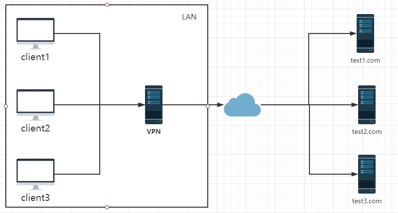
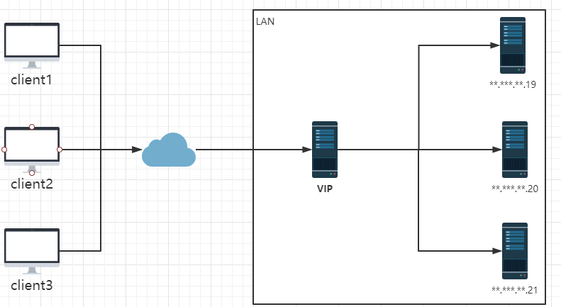

## nginx是什么
    nginx是一个高性能http和反向代理服务器，主要功能代理、负载均衡、动静分离。
## 应用场景

1. http 服务器。Nginx 是一个 http 服务可以独立提供 http 服务。可以做网页静态服务器
2. 虚拟主机。可以实现在一台服务器虚拟出多个网站。例如个人网站使用的虚拟主机
3. 反向代理，负载均衡。当网站的访问量达到一定程度后，单台服务器不能满足用户的请求时，需要用多台服务器集群可以使用 nginx 做反向代理。并且多台服务器可以平均分担负载，不会因为某台服务器负载高宕机而某台服务器闲置的情况

## 正向代理

    
    正向代理是在用户端，比如访问某些国外网站时vpn设置在用户浏览器端，浏览器先访问vpn地址，vpn再转发请求，并最后将请求结果原路返回。
## 反向代理
    
    反向代理是作用于服务器端，是一个虚拟IP。对于一个用户的请求会转发到多个后端服务器中的一台来处理具体请求。
## nginx配置文件（nginx.conf）
```
#全局块
#user  nobody;
worker_processes  1;

#event块
events {
    worker_connections  1024;
}

#http块
http {
    #http全局块
    include       mime.types;
    default_type  application/octet-stream;
    sendfile        on;
    keepalive_timeout  65;
    #server块
    server {
        #server全局块
        listen       8000;
        server_name  localhost;
        #location块
        location / {
            root   html;
            index  index.html index.htm;
        }
        error_page   500 502 503 504  /50x.html;
        location = /50x.html {
            root   html;
        }
    }
    #这边可以有多个server块
    server {
      ...
    }
}
```
### 反向代理配置
```
    #http块
    http {
        #http全局块
        include       mime.types;
        default_type  application/octet-stream;
        sendfile        on;
        keepalive_timeout  65;
        #server块
        #首先在http中添加upstream节点（负载均衡）
        #upstream upstreamName {}
        upstream testUpstream {
            #weight为权重
            server 192.168.30.1 weight=3;
            server 192.168.30.2 weight=1;
        }
        
        server {
            #server全局块
            listen       8000;  # 监听的端口
            server_name  localhost;# 域名或ip
            #location块
            location / {# 访问路径配置
                root   html;# 根目录
                index  index.html index.htm;# 默认首页
                #加入代理
                proxy_pass http://testUpstream
            }
            error_page   500 502 503 504  /50x.html;# 错误页面
            location = /50x.html {
                root   html;
            }
        }
        #这边可以有多个server块
        server {
          ...
    }
```
## nginx命令
```
    #检查配置文件是否正确
    nginx -t
    
    #重新加载配置文件
    nginx -s reload
    
    #退出
    nginx -s stop
    
    #安全退出
    nginx -s quit
```
