## 一、设计模式-代理模式

``` tex
	代理模式：给某一个对象提供一个代理对象，并由代理对象控制对源对象的引用。代理就是一个人或一个机构代表另一个人或者一个机构采取行动。某些情况下，客户不想或者b能够直接引用一个对象，代理对象可以在客户和目标对象直接起到中介的作用。客户端分辨不出代理主题对象与真实主题对象。代理模式可以并不知道真正的被代理对象，而仅仅持有一个被代理对象的接口，这时候代理对象不能够创建被代理对象，被代理对象必须有系统的
其他角色代为创建并传入。
	为什么要使用代理模式呢？
	第一，它有间接的特点，可以起到中介隔离作用。就好比在租房的时候，房东可能不在本地，而短期内又不能赶回来，此时中介的出场，就作为房东的代理实现和我们签订承租合同。而我们和房东之间就没有耦合了。
	第二，它有增强的功能。还以租房为例，我们首先考虑的是找一个靠谱的中介，由中介给我们提供房源信息，并且告诉我们房屋的细节，合同的细节等等。当然我们也可以自己去找一些个人出租的房屋，但是在这之中，我们要了解租赁合同，房屋验收，租金监管等情况，这无疑对我们是繁重的工作。而有了中介作为我们的代理中间人，他把了解到的信息告诉我们，我们一样可以租到房子，而不必做那些繁重的工作。
```


## 二、AOP思想及实现原理

### 1、AOP思想

``` tex
	在软件业，AOP为Aspect Oriented Programming的缩写，意为：面向切面编程，通过预编译方式和运行期动态代理实现程序功能的统一维护的一种技术。AOP是OOP的延续，是软件开发中的一个热点，也是Spring框架中的一个重要内容，是函数式编程的一种衍生范型。利用AOP可以对业务逻辑的各个部分进行隔离，从而使得业务逻辑各部分之间的耦合度降低，提高程序的可重用性，同时提高了开发的效率。
```

### 2、实现原理

``` tex
	在上面的概念中描述出aop的实现原理是基于动态代理技术实现的。下面是针对动态代理的一些介绍：
	特点：
		字节码随用随创建，随用随加载
	分类：
		基于接口的动态代理，基于子类的动态代理
	作用：
		不修改源码的基础上对方法增强
	基于接口的动态代理：
		提供者是：JDK官方
		使用要求：被代理类最少实现一个接口。
		涉及的类：Proxy
		创建代理对象的方法：newProxyInstance
		方法的参数：
			ClassLoader：类加载器。用于加载代理对象的字节码的。和被代理对象使用相同的类加载器。固定写法。
			Class[]：字节码数组。用于给代理对象提供方法。和被代理对象具有相同的方法。被代理类是一个普通类：被代理类对象.getClass().getInterfaces();被代理类是一个接口：new Class[]{被代理了.class}它也是固定写法
			InvocationHanlder：要增强的方法。此处是一个接口，我们需要提供它的实现类。通常写的是匿名内部类。增强的代码谁用谁写。

	基于子类的动态代理
		提供者是：第三方cglib包，在使用时需要先导包(maven工程导入坐标即可)
		使用要求：被代理类不能是最终类，不能被final修饰
		涉及的类：Enhancer
		创建代理对象的方法：create
		方法的参数：
			Class：字节码。被代理对象的字节码。可以创建被代理对象的子类，还可以获取被代理对象的类加载器。
			Callback：增强的代码。谁用谁写。通常都是写一个接口的实现类或者匿名内部类。Callback中没有任何方法，所以我们一般使用它的子接口：MethodInterceptor
			
```


### 3. Spring 中AOP的术语

```tex
Joinpoint(连接点):所谓连接点是指那些被拦截到的点。在spring中,指的是方法,因为spring只支持方法类型的连接点。
Pointcut(切入点):所谓切入点是指我们要对哪些Joinpoint进行拦截的定义。
Advice(通知/增强):所谓通知是指拦截到Joinpoint之后所要做的事情就是通知。通知的类型：前置通知,后置通知,异常通知,最终通知,环绕通知。
Introduction(引介):引介是一种特殊的通知在不修改类代码的前提下, 可以在运行期为类动态地添加一些方法或Field。
Target(目标对象):代理的目标对象。
Weaving(织入):是指把增强应用到目标对象来创建新的代理对象的过程。spring采用动态代理织入，而AspectJ采用编译期织入和类装载期织入。
Proxy（代理）:一个类被AOP织入增强后，就产生一个结果代理类。
Aspect(切面):是切入点和通知（引介）的结合。
```


## 三、Spring注解驱动AOP开发入门

### 1、概述

```tex
a.Spring的aop是基于ioc的。所以需要有spring的ioc基础。
b.本章节只是对aop的使用做基本功能展示
```

### 2、注解驱动入门案例介绍

```tex
需求：
	实现在执行service方法时输出执行日志。（除了业务层外，表现层和持久层也可以实现）
```

### 3、案例实现

``` java
public class User implements Serializable {
    private String id;
    private String username;
    private String password;
    private String email;
    private Date birthday;
    private String gender;
    private String mobile;
    private String nickname;
}

/**
* 业务层接口：
*/
public interface UserService {
    /**
	* 保存用户
	* @param user
	*/
    void save(User user);
}

/**
* 用户的业务层实现类
*/
@Service("userService")
public class UserServiceImpl implements UserService{
    @Override
    public void save(User user) {
        System.out.println("保存用："+user);
    }
}

/**
* 记录日志的工具类
*/
@Component
@Aspect
public class LogUtil {
	/**
	* 通用切入点表达式
	*/
	@Pointcut("execution(*org.lql.service.impl.*.*(..))")
	private void pt1(){}
    
    /**
	* 最终通知
	*/
    @After("pt1()")
    public void afterLog(){
        System.out.println("无论切入点方法执行是否有异常都记录日志");
    }
    
    /**
	* 环绕通知
	*/
    @Around("pt1()")
    public Object arountPrintLog(ProceedingJoinPoint pjp){
        //1.定义返回值
        Object rtValue = null;
        try{
            //前置通知
            System.out.println("执行切入点方法前记录日志");
            //2.获取方法执行所需的参数
            Object[] args = pjp.getArgs();
            //3.执行切入点方法
            rtValue = pjp.proceed(args);
            //后置通知
            System.out.println("正常执行切入点方法后记录日志");
        }catch (Throwable t){
            //异常通知
            System.out.println("执行切入点方法产生异常后记录日志");
        }finally {
            //最终通知
            System.out.println("无论切入点方法执行是否有异常都记录日志");
        }
        return rtValue;
    }
}

/**
* 配置类
*/
@Configuration
@ComponentScan("org.lql")
@EnableAspectJAutoProxy
public class SpringConfiguration {
}

/**
* 测试类：
* spring的aop环境准备
*/
public class SpringAOPTest {
    public static void main(String[] args) {
        //1.获取容器
        AnnotationConfigApplicationContext ac = new
            AnnotationConfigApplicationContext(SpringConfiguration.class);
        //2.获取bean对象
        UserService userService =
            ac.getBean("userService",UserService.class);
        //3.准备数据
        User user = new User();
        user.setId("1");
        user.setUsername("test");
        user.setNickname("泰斯特");
        //4.执行方法
        userService.save(user);
    }
}
```


## 四、AOP常用注解分析

### 1、用于开启注解AOP支持的

#### 1.1、@EnableAspectJAutoProxy

##### 1.1.1、源码

```java
@Target(ElementType.TYPE)
@Retention(RetentionPolicy.RUNTIME)
@Documented
@Import(AspectJAutoProxyRegistrar.class)
public @interface EnableAspectJAutoProxy {
    /**
* Indicate whether subclass‐based (CGLIB) proxies are to be created
as opposed
* to standard Java interface‐based proxies. The default is {@code
false}.
*/
    boolean proxyTargetClass() default false;
    /**
* Indicate that the proxy should be exposed by the AOP framework as
a {@code ThreadLocal}
* for retrieval via the {@link
org.springframework.aop.framework.AopContext} class.
* Off by default, i.e. no guarantees that {@code AopContext} access
will work.
* @since 4.3.1
*/
    boolean exposeProxy() default false;
}
```


##### 1.1.2、说明

```tex
作用：
	表示开启spring对注解aop的支持。它有两个属性，分别是指定采用的代理方是否暴露代理对象，通过AopContext可以进行访问。从定义可以看得出，它引入AspectJAutoProxyRegister.class对象，该对象是基于注解@EnableAspectJAutoProxy注册一个AnnotationAwareAspectJAutoProxyCreator，该对象通过调用AopConfigUtils.registerAspectJAnnotationAutoProxyCreatorIfNecessary(registry);注册一个aop代理对象生成器。关于AnnotationAwareAspectJAutoProxyCreator请参考第五章第二小节《AnnotationAwareAspectJAutoProxyCreator对象的分析》

属性：
	proxyTargetClass：
		指定是否采用cglib进行代理。默认值是false，表示使用jdk的代理。
	exposeProxy：
		指定是否暴露代理对象，通过AopContext可以进行访问。
使用场景：
	当我们注解驱动开发时，在需要使用aop实现某些功能的情况下，都需要用到此注解。
```


##### 1.1.3、示例

```java
@Configuration
@ComponentScan("org.lql")
@EnableAspectJAutoProxy
public class SpringConfiguration {
}
```


### 2、用于配置切面的

#### 2.1、@Aspect

##### 2.1.1、源码

```java
/**
* Aspect declaration
*
* @author <a href="mailto:alex AT gnilux DOT com">Alexandre Vasseur</a>
*/
@Retention(RetentionPolicy.RUNTIME)
@Target(ElementType.TYPE)
public @interface Aspect {
    /**
	* Per clause expression, defaults to singleton aspect
	* <p/>
	* Valid values are "" (singleton), "perthis(...)", etc
	*/
    public String value() default "";
}
```


##### 2.1.2、说明

```tex
作用：
	声明当前类是一个切面类。
属性：
	value:
		默认我们的切面类应该为单例的。但是当切面类为一个多例类时，指定预处理的切入点表达式。
		用法是perthis(切入点表达式)。
		它支持指定切入点表达式，或者是用@Pointcut修饰的方法名称（要求全限定方法名）
使用场景：
	此注解也是一个注解驱动开发aop的必备注解。
```


##### 2.1.3、示例

```java
/**
* 记录日志的工具类
*/
@Component
@Scope("prototype")//注意：通常情况下我们的切面类是不需要多例的。
@Aspect(value="execution(* org.lql.service.impl.*.*(..))")
public class LogUtil {
    /**
	* 用于配置当前方法是一个前置通知
	*/
    @Before("execution(* com.itheima.service.impl.*.*(..))")
    public void printLog(){
        System.out.println("执行打印日志的功能");
    }
}
```


### 3、用于配置切入点表达式的

#### 3.1、@Pointcut

##### 3.1.1、源码

```java
/**
* Pointcut declaration
*
* @author <a href="mailto:alex AT gnilux DOT com">Alexandre Vasseur</a>
*/
@Retention(RetentionPolicy.RUNTIME)
@Target(ElementType.METHOD)
public @interface Pointcut {
    /**
	* The pointcut expression
	* We allow "" as default for abstract pointcut
	*/
    String value() default "";
    
    /**
	* When compiling without debug info, or when interpreting pointcuts at runtime,
	* the names of any arguments used in the pointcut are not available.
	* Under these circumstances only, it is necessary to provide the arg names in
	* the annotation ‐ these MUST duplicate the names used in the annotated method.
	* Format is a simple comma‐separated list.
	*/
    String argNames() default "";
}
```


##### 3.1.2、说明

```tex
作用：
	此注解是用于指定切入点表达式的。
属性：
	value:
		用于指定切入点表达式。表达式的配置详解请参考第五章节第三小节《切入点表达式的写法》
	argNames:
		用于指定切入点表达式的参数。参数可以是execution中的，也可以是args中的。通常情况下不使用此属性也可以获得切入点方法参数。
使用场景：
	在实际开发中，当我们的多个通知需要执行，同时增强的规则确定的情况下，就可以把切入点表达式通用化。此注解就是代替xml中的<aop:pointcut>标签，实现切入点表达式的通用化。
```


##### 3.1.3、示例

```java
@Component
@Aspect
public class LogUtil {
    /**
	* 通用切入点表达式
	* 在value属性的中使用了&&符号，表示并且的关系。
	* &&符号后面的args和execution一样，都是切入点表达式支持的关键字，表示匹配参数。指定的内容
	* 可以是全限定类名，或者是名称。当指定参数名称时，要求与方法中形参名称相
同。
	* argNames属性，是定义参数的名称，该名称必须和args关键字中的名称一致。
	*/
    @Pointcut(value = "execution(* com.itheima.service.impl.*.*
              (com.itheima.domain.User))&& args(user)",argNames = "user")
        private void pt1(User user){}
}
```


### 4、用于配置通知的

#### 4.1、@Before

##### 4.1.1、源码

```java
/**
* Before advice
*
* @author <a href="mailto:alex AT gnilux DOT com">Alexandre Vasseur</a>
*/
@Retention(RetentionPolicy.RUNTIME)
@Target(ElementType.METHOD)
public @interface Before {
    /**
	* The pointcut expression where to bind the advice
	*/
    String value();
    
    /**
	* When compiling without debug info, or when interpreting pointcuts at runtime,
	* the names of any arguments used in the advice declaration are not available.
	* Under these circumstances only, it is necessary to provide the arg names in
	* the annotation ‐ these MUST duplicate the names used in the annotated method.
	* Format is a simple comma‐separated list.
	*/
    String argNames() default "";
}
```


##### 4.1.2、说明

```tex
作用：
	被此注解修饰的方法为前置通知。前置通知的执行时间点是在切入点方法执行之前。
属性：
	value:
		用于指定切入点表达式。可以是表达式，也可以是表达式的引用。
	argNames:
		用于指定切入点表达式参数的名称。它要求和切入点表达式中的参数名称一致。通常不指定也可以获取切入点方法的参数内容。
使用场景：
	在实际开发中，我们需要对切入点方法执行之前进行增强， 此时就用到了前置通知。在通知（增强的方法）中需要获取切入点方法中的参数进行处理时，就要配合切入点表达式参数来使用。
```


##### 4.1.3、示例

```java
/**
* 前置通知
*/
@Before(value = "pt1(user)",argNames = "user")
public void beforeLog(User user){
    System.out.println("执行切入点方法前记录日志"+user);
}
```


#### 4.2、@AfterReturning

##### 4.2.1、源码

```java
/**
* After returning advice
*
* @author <a href="mailto:alex AT gnilux DOT com">Alexandre Vasseur</a>
*/
@Retention(RetentionPolicy.RUNTIME)
@Target(ElementType.METHOD)
public @interface AfterReturning {
    /**
	* The pointcut expression where to bind the advice
	*/
    String value() default "";
    /**
	* The pointcut expression where to bind the advice, overrides "value" when specified
	*/
    String pointcut() default "";
    /**
	* The name of the argument in the advice signature to bind the returned value to
	*/
    String returning() default "";
    /**
	* When compiling without debug info, or when interpreting pointcuts at runtime,
	* the names of any arguments used in the advice declaration are not available.
	* Under these circumstances only, it is necessary to provide the arg names in
	* the annotation ‐ these MUST duplicate the names used in the annotated method.
	* Format is a simple comma‐separated list.
	*/
    String argNames() default "";
}
```


##### 4.2.2、说明

```tex
作用：
	用于配置后置通知。后置通知的执行是在切入点方法正常执行之后执行。
	需要注意的是，由于基于注解的配置时,spring创建通知方法的拦截器链时，后置通知在最终通知之后，所以会先执行@After注解修饰的方法。
属性：
	value:
		用于指定切入点表达式，可以是表达式，也可以是表达式的引用。
	pointcut:
		它的作用和value是一样的。
	returning:
		指定切入点方法返回值的变量名称。它必须和切入点方法返回值名称一致。
	argNames:
		用于指定切入点表达式参数的名称。它要求和切入点表达式中的参数名称一致。通常不指定也可以获取切入点方法的参数内容。
使用场景：
	此注解是用于配置后置增强切入点方法的。被此注解修饰方法会在切入点方法正常执行之后执行。在我们实际开发中，像提交事务，记录访问日志，统计方法执行效率等等都可以利用后置通知实现。
```


##### 4.2.3、示例

```java
// 切入点方法：
@Override
public User findById(String id) {
    System.out.println("切入点方法开始执行。。。");
    User user = new User();
    user.setId(id);
    user.setUsername("heima");
    user.setNickname("黑马小王子");
    return user;
}

/**
* 后置通知
*/
@AfterReturning(value = "execution(* org.lql.service.impl.*.*(..))&&args(param)",returning = "user")
public void afterReturningLog(String param,Object user){
    System.out.println("正常执行切入点方法后记录日志，切入点方法的参数是："+param);
    System.out.println("正常执行切入点方法后记录日志，切入点方法的返回值是："+user);
}
```


#### 4.3、@AfterThrowing

##### 4.3.1、源码

```java
/**
* After throwing advice
*
* @author <a href="mailto:alex AT gnilux DOT com">Alexandre Vasseur</a>
*/
@Retention(RetentionPolicy.RUNTIME)
@Target(ElementType.METHOD)
public @interface AfterThrowing {
    /**
	* The pointcut expression where to bind the advice
	*/
    String value() default "";
    /**
	* The pointcut expression where to bind the advice, overrides "value" when specified
	*/
    String pointcut() default "";
    /**
	* The name of the argument in the advice signature to bind the thrown exception to
	*/
    String throwing() default "";
    /**
	* When compiling without debug info, or when interpreting pointcuts at runtime,
	* the names of any arguments used in the advice declaration are not available.
	* Under these circumstances only, it is necessary to provide the arg names in
	* the annotation ‐ these MUST duplicate the names used in the annotated method.
	* Format is a simple comma‐separated list.
	*/
    String argNames() default "";
}
```


##### 4.3.2、说明

```tex
作用：
	用于配置异常通知。
属性：
	value:
		用于指定切入点表达式，可以是表达式，也可以是表达式的引用。
	pointcut:
		它的作用和value是一样的。
	throwing:
		指定切入点方法执行产生异常时的异常对象变量名称。它必须和异常变量名称一致。
	argNames:
		用于指定切入点表达式参数的名称。它要求和切入点表达式中的参数名称一致。通常不指定也可以获取切入点方法的参数内容。
使用场景：
	用此注解修饰的方法执行时机是在切入点方法执行产生异常之后执行。
```


##### 4.3.3、示例

```java
// 切入点方法：
@Override
public User findById(String id) {
    System.out.println("切入点方法开始执行。。。");
    User user = new User();
    user.setId(id);
    user.setUsername("heima");
    user.setNickname("黑马小王子");
    int i=1/0;
    return user;
}

/**
* 异常通知
*/
@AfterThrowing(value = "execution(* org.lql.service.impl.*.*(..))&&args(param)",throwing = "e")
public void afterThrowingLog(String param,Throwable e){
    System.out.println("执行切入点方法产生异常后记录日志,切入点方法的参数是："+param);
    System.out.println("执行切入点方法产生异常后记录日志,切入点方法的异常是："+e);
}

```


#### 4.4、@After

##### 4.4.1、源码

````java
/**
* After finally advice
*
* @author <a href="mailto:alex AT gnilux DOT com">Alexandre Vasseur</a>
*/
@Retention(RetentionPolicy.RUNTIME)
@Target(ElementType.METHOD)
public @interface After {
    /**
	* The pointcut expression where to bind the advice
	*/
    String value();
    /**
	* When compiling without debug info, or when interpreting pointcuts at runtime,
	* the names of any arguments used in the advice declaration are not available.
	* Under these circumstances only, it is necessary to provide the arg names in
	* the annotation ‐ these MUST duplicate the names used in the annotated method.
	* Format is a simple comma‐separated list.
	*/
    String argNames() default "";
}
````


##### 4.4.2、说明

```tex
作用：
	用于指定最终通知。
属性：
	value:
		用于指定切入点表达式，可以是表达式，也可以是表达式的引用。
	argNames:
		用于指定切入点表达式参数的名称。它要求和切入点表达式中的参数名称一致。通常不指定也可以获取切入点方法的参数内容。
使用场景：
	最终通知的执行时机，是在切入点方法执行完成之后执行，无论切入点方法执行是否产生异常最终通知都会执行。所以被此注解修饰的方法，通常都是做一些清理操作。
```


##### 4.4.3、示例

```java
/**
* 最终通知
*/
@After(value = "execution(* org.lql.service.impl.*.*(..))")
public void afterLog(){
	System.out.println("无论切入点方法执行是否有异常都记录日志");
}
```


#### 4.5、@Around

##### 4.5.1、源码

````java
/**
* Around advice
*
* @author <a href="mailto:alex AT gnilux DOT com">Alexandre Vasseur</a>
*/
@Retention(RetentionPolicy.RUNTIME)
@Target(ElementType.METHOD)
public @interface Around {
    /**
	* The pointcut expression where to bind the advice
	*/
    String value();
    
    /**
	* When compiling without debug info, or when interpreting pointcuts at runtime,
	* the names of any arguments used in the advice declaration are not available.
	* Under these circumstances only, it is necessary to provide the arg names in
	* the annotation ‐ these MUST duplicate the names used in the annotated method.
	* Format is a simple comma‐separated list.
	*/
    String argNames() default "";
}
````


##### 4.5.2、说明

```tex
作用：
	用于指定环绕通知。
属性：
	value:
		用于指定切入点表达式，可以是表达式，也可以是表达式的引用。
	argNames:
		用于指定切入点表达式参数的名称。它要求和切入点表达式中的参数名称一致。通常不指定也可以获取切入点方法的参数内容。
使用场景：
	环绕通知有别于前面介绍的四种通知类型。它不是指定增强方法执行时机的，而是spring为我们提供的一种可以通过编码的方式手动控制增强方法何时执行的机制。
```


##### 4.5.3、示例

```java
/**
* 环绕通知
*/
@Around("execution(* org.lql.service.impl.*.*(..))")
public Object arountPrintLog(ProceedingJoinPoint pjp){
    //1.定义返回值
    Object rtValue = null;
    try{
        //前置通知
        System.out.println("执行切入点方法前记录日志");
        //2.获取方法执行所需的参数
        Object[] args = pjp.getArgs();
        //3.执行切入点方法
        rtValue = pjp.proceed(args);
        //后置通知
        System.out.println("正常执行切入点方法后记录日志");
    }catch (Throwable t){
        //异常通知
        System.out.println("执行切入点方法产生异常后记录日志");
    }finally {
        //最终通知
        System.out.println("无论切入点方法执行是否有异常都记录日志");
    }
    return rtValue;
}
```


### 5、用于扩展目标类的

#### 5.1、@DeclareParents

##### 5.1.1、源码

```java
/**
* Declare parents mixin annotation
*/
@Retention(RetentionPolicy.RUNTIME)
@Target(ElementType.FIELD)
public @interface DeclareParents {
    /**
	* The target types expression
	*/
    String value();
    /**
	* Optional class defining default implementation
	* of interface members (equivalent to defining
	* a set of interface member ITDs for the
	* public methods of the interface).
	*/
    Class defaultImpl() default DeclareParents.class;
    // note ‐ a default of "null" is not allowed,
    // hence the strange default given above.
}
```


##### 5.1.2、说明

```tex
作用：
	用于给被增强的类提供新的方法。（实现新的接口）
属性：
	value:
		用于指定目标类型的表达式。当在全限定类名后面跟上+时，表示当前类及其子类
	defaultImpl:
		指定提供方法或者字段的默认实现类。
使用场景：
	当我们已经完成了一个项目的某个阶段开发，此时需要对已完成的某个类加入一些新的方法，我们首先想到的是写一个接口，然后让这些需要方法的类实现此接口，但是如果目标类非常复杂，牵一发而动全身，改动的话可能非常麻烦。此时就可以使用此注解，然后建一个代理类，同时代理该类和目标类。
```


##### 5.1.3、示例

```java
/**
* 已有业务层接口和实现类
* 业务层接口
*/
public interface UserService {
    /**
	* 模拟保存用户
	* @param user
	*/
    void saveUser(User user);
}

@Service("userService")
public class UserServiceImpl implements UserService {
    @Override
    public void saveUser(User user) {
        System.out.println("执行了保存用户" + user);
    }
}

/**
* 需要加入的新方法：
*/
public interface ValidateService {
    boolean checkUser(User user);
}

public class ValidateServiceImpl implements ValidateService {
    @Override
    public boolean checkUser(User user) {
        if(user.getNickname().contains("孙子")){
            return false;
        }
        return true;
    }
}

/**
* AOP切面类的配置
* 记录日志的工具类
*/
@Component
@Aspect
public class LogUtil {
    @DeclareParents(value = "org.lql.service.UserService+",defaultImpl = ValidateServiceImpl.class)
    private ValidateService validateService;
    
    /**
	* 用于配置当前方法是一个前置通知
	*/
    @Before(value = "org.lql.pointcuts.MyPointcut.pointcut1() && args(user) && this(validateService)")
    public void printLog(User user,ValidateService validateService){
        //第二种触发方式
        boolean check = validateService.checkUser(user);
        if(check) {
            System.out.println("执行打印日志的功能");
        }else {
            throw new IllegalStateException("名称非法");
        }
    }
}

/**
* spring核心配置类：
*/
@Configuration
@ComponentScan("org.lql")
@EnableAspectJAutoProxy
public class SpringConfiguration {
}

/**
* 测试类：
* 有两种触发方式：
* 第一种触发方式：在使用时自行强转新引入接口类型，然后调用方法。例如：测试类中的代码
* 第二种触发方式：在通知类中，使用this关键字，引入新目标类对象，调用方法触发。例如：切面类
*/
public class SpringPointcutTest {
    public static void main(String[] args) {
        //1.创建容器
        AnnotationConfigApplicationContext ac = new
            AnnotationConfigApplicationContext(SpringConfiguration.class);
        //2.获取对象
        UserService userService =
            ac.getBean("userService",UserService.class);
        //3.执行方法
        User user = new User();
        user.setId("1");
        user.setUsername("test");
        user.setNickname("孙子1");
        //第一种触发方式
        // ValidateService validateService = (ValidateService)userService;
        // boolean check = validateService.checkUser(user);
        // if(check) {
        userService.saveUser(user);
        // }
    }
}
```


#### 5.2、@EnableLoadTimeWeaving

##### 5.2.1、源码

```java
@Target(ElementType.TYPE)
@Retention(RetentionPolicy.RUNTIME)
@Documented
@Import(LoadTimeWeavingConfiguration.class)
public @interface EnableLoadTimeWeaving {
    /**
	* Whether AspectJ weaving should be enabled.
    */
    AspectJWeaving aspectjWeaving() default AspectJWeaving.AUTODETECT;
    /**
	* AspectJ weaving enablement options.
	*/
    enum AspectJWeaving {
        /**
		* Switches on Spring‐based AspectJ load‐time weaving.
		*/
        ENABLED,
        /**
		* Switches off Spring‐based AspectJ load‐time weaving (even if a
		* "META‐INF/aop.xml" resource is present on the classpath).
		*/
        DISABLED,
        /**
		* Switches on AspectJ load‐time weaving if a "META‐INF/aop.xml" resource
		* is present in the classpath. If there is no such resource, then AspectJ
		* load‐time weaving will be switched off.
		*/
        AUTODETECT;
    }
}
```


###### 5.2.2、说明

```tex
作用：
	用于切换不同场景下实现增强。
属性：
	aspectjWeaving：是否开启LTW的支持。
		ENABLED 开启LTW
		DISABLED 不开启LTW
		AUTODETECT 如果类路径下能读取到META‐INF/aop.xml文件,则开启LTW,否则关闭
使用场景：
	在Java 语言中，从织入切面的方式上来看，存在三种织入方式：编译期织入、类加载期织入和运行期织入。编译期织入是指在Java编译期，采用特殊的编译器，将切面织入到Java类中；而类加载期织入则指通过特殊的类加载器，在类字节码加载到JVM时，织入切面；运行期织入则是采用CGLib工具或JDK动态代理进行切面的织入。
	AspectJ提供了两种切面织入方式，第一种通过特殊编译器，在编译期，将AspectJ语言编写的切面类织入到Java类中，可以通过一个Ant或Maven任务来完成这个操作；第二种方式是类加载期织入，也简称为LTW（Load Time Weaving）
```


##### 5.2.3、示例

```java
/**
* 切面类：
*/
//@Component
@Aspect
public class LoadTimeWeavingAspect {
    /**
* 增强方法
* @param pjp
* @return
* @throws Throwable
*/
    @Around("pointcut()")
    public Object profile(ProceedingJoinPoint pjp) throws Throwable {
        //1.创建秒表对象
        StopWatch sw = new StopWatch(getClass().getSimpleName());
        try {
            //2.记录执行
            sw.start(pjp.getSignature().getName());
            //3.调用切入点方法并返回
            return pjp.proceed();
        } finally {
            //4.停止计时
            sw.stop();
            //5.输出
            System.out.println(sw.prettyPrint());
        }
	}
    /**
    * 切入点表达式
    */
    @Pointcut("execution(* org.lql.service.impl.*.*(..))")
    public void pointcut() {
    }
}

/**
* 配置类
*/
@Configuration
@ComponentScan("org.lq")
//@EnableAspectJAutoProxy
@EnableLoadTimeWeaving(aspectjWeaving =
EnableLoadTimeWeaving.AspectJWeaving.ENABLED)
public class SpringConfiguration {
}
```


##### 5.2.4、运行设置

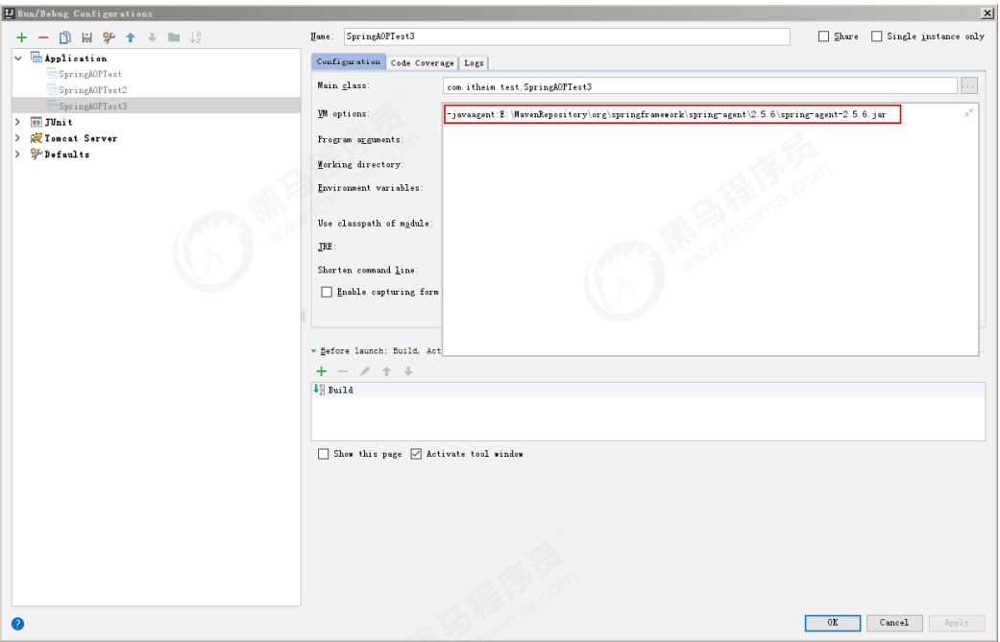


## 五、AOP注解执行过程及核心对象的分析

### 1、执行过程分析

#### 1.1、加载@EnableAspectJAutoproxy注解

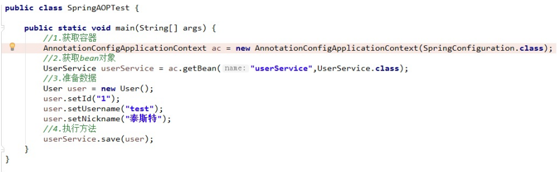

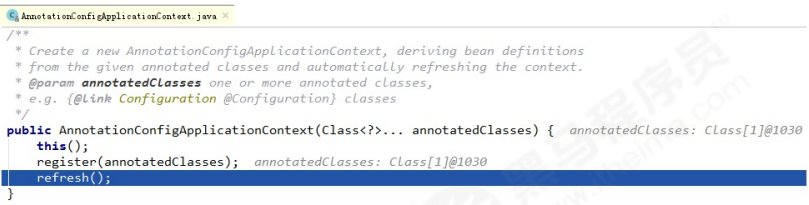

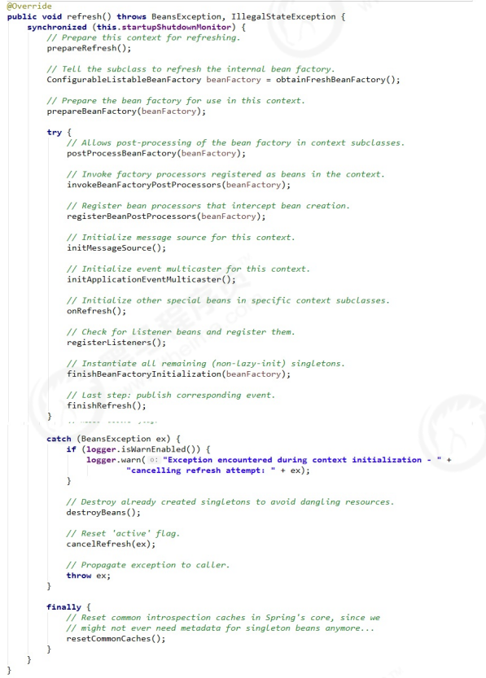

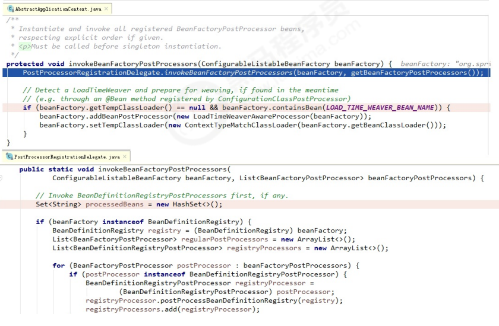

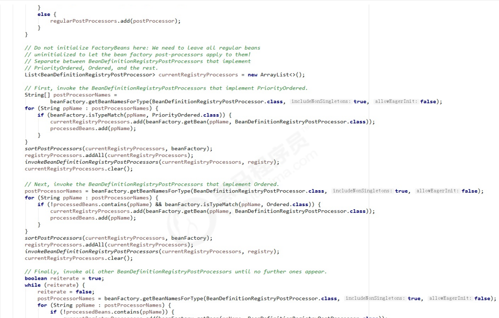


#### 1.2、解析切入点表达式

```java
//spring在解析切入点表达式时，是通过一个类进行封装的。这个类是Pointcut接口的实现类。
/**
* Core Spring pointcut abstraction.
*
* <p>A pointcut is composed of a {@link ClassFilter} and a {@link
MethodMatcher}.
* Both these basic terms and a Pointcut itself can be combined to build
up combinations
* (e.g. through {@link
org.springframework.aop.support.ComposablePointcut}).
*
* @author Rod Johnson
* @see ClassFilter
* @see MethodMatcher
* @see org.springframework.aop.support.Pointcuts
* @see org.springframework.aop.support.ClassFilters
* @see org.springframework.aop.support.MethodMatchers
*/
public interface Pointcut {
    /**
* Return the ClassFilter for this pointcut.
* @return the ClassFilter (never {@code null})
*/
    ClassFilter getClassFilter();
    /**
* Return the MethodMatcher for this pointcut.
* @return the MethodMatcher (never {@code null})
*/
    MethodMatcher getMethodMatcher();
    /**
* Canonical Pointcut instance that always matches.
*/
    Pointcut TRUE = TruePointcut.INSTANCE;
}

/**
* @author colyer
*
*/
public class PointcutImpl implements Pointcut {
    private final String name;
    private final PointcutExpression pc;
    private final Method baseMethod;
    private final AjType declaringType;
    private String[] parameterNames = new String[0];
    protected PointcutImpl(String name, String pc, Method method, AjType
                           declaringType, String pNames) {
        this.name = name;
        this.pc = new PointcutExpressionImpl(pc);
        this.baseMethod = method;
        this.declaringType = declaringType;
        this.parameterNames = splitOnComma(pNames);
    }
    /* (non‐Javadoc)
* @see org.aspectj.lang.reflect.Pointcut#getPointcutExpression()
*/
    public PointcutExpression getPointcutExpression() {
        return pc;
    }
    public String getName() {
        return name;
    }
    public int getModifiers() {
        return baseMethod.getModifiers();
    }
    public AjType<?>[] getParameterTypes() {
        Class<?>[] baseParamTypes = baseMethod.getParameterTypes();
        AjType<?>[] ajParamTypes = new AjType<?>[baseParamTypes.length];
        for (int i = 0; i < ajParamTypes.length; i++) {
            ajParamTypes[i] = AjTypeSystem.getAjType(baseParamTypes[i]);
        }
        return ajParamTypes;
    }
    public AjType getDeclaringType() {
        return declaringType;
    }
    public String[] getParameterNames() {
        return parameterNames;
    }
    private String[] splitOnComma(String s) {
        StringTokenizer strTok = new StringTokenizer(s,",");
        String[] ret = new String[strTok.countTokens()];
        for (int i = 0; i < ret.length; i++) {
            ret[i] = strTok.nextToken().trim();
        }
        return ret;
    }
    public String toString() {
        StringBuffer sb = new StringBuffer();
        sb.append(getName());
        sb.append("(");
        AjType<?>[] ptypes = getParameterTypes();
        for (int i = 0; i < ptypes.length; i++) {
            sb.append(ptypes[i].getName());
            if (this.parameterNames != null && this.parameterNames[i] !=
                null) {
                sb.append(" ");
                sb.append(this.parameterNames[i]);
            }
            if (i+1 < ptypes.length) sb.append(",");
        }
        sb.append(") : ");
        sb.append(getPointcutExpression().asString());
        return sb.toString();
    }
}
```

加载流程如下图所示：

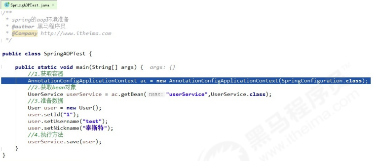

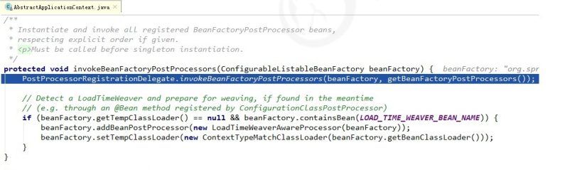

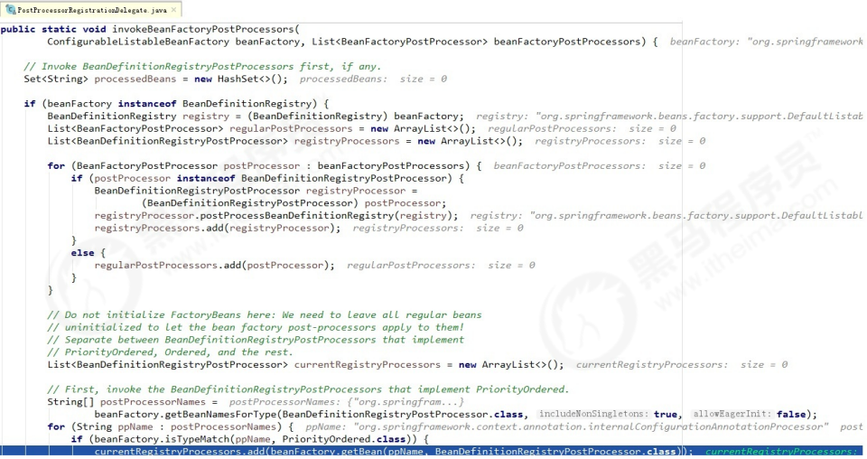


#### 1.3、解析通知注解

##### 1.3.1、初始化通知注解的Map

```java
//首先在执行初始化时容器创建时，spring框架把和通知相关的注解都放到一个受保护的内部类中了。
/**
*
*/
public abstract class AbstractAspectJAdvisorFactory implements AspectJAdvisorFactory {
    /**
* 类中的其他代码略
*/
    /**
* 受保护的静态内部类。在静态代码块中定义着和通知类型相关的注解。
*/
    protected static class AspectJAnnotation<A extends Annotation> {
        private static final String[] EXPRESSION_ATTRIBUTES = new
            String[] {"pointcut", "value"};
        private static Map<Class<?>, AspectJAnnotationType>
            annotationTypeMap = new HashMap<>(8);
        static {
            annotationTypeMap.put(Pointcut.class,
                                  AspectJAnnotationType.AtPointcut);
            annotationTypeMap.put(Around.class,
                                  AspectJAnnotationType.AtAround);
            annotationTypeMap.put(Before.class,
                                  AspectJAnnotationType.AtBefore);
            annotationTypeMap.put(After.class,
                                  AspectJAnnotationType.AtAfter);
            annotationTypeMap.put(AfterReturning.class,
                                  AspectJAnnotationType.AtAfterReturning);
            annotationTypeMap.put(AfterThrowing.class,
                                  AspectJAnnotationType.AtAfterThrowing);
        }
        //内部类的其余代码略
    }
    //其余代码略
}
```


##### 1.3.2、构建通知的拦截器链


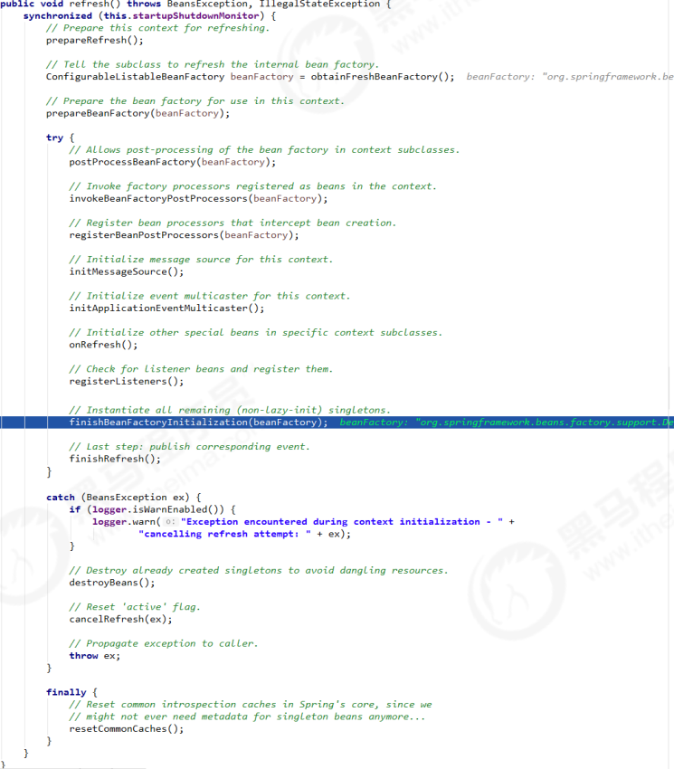

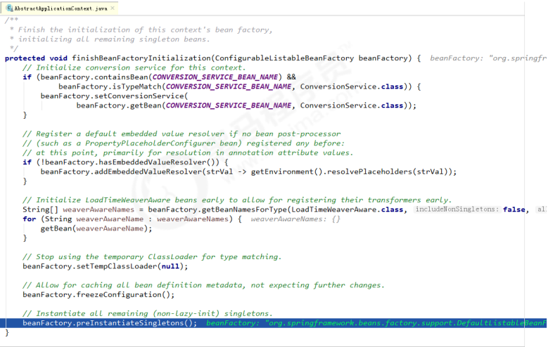

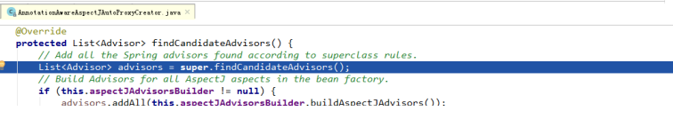


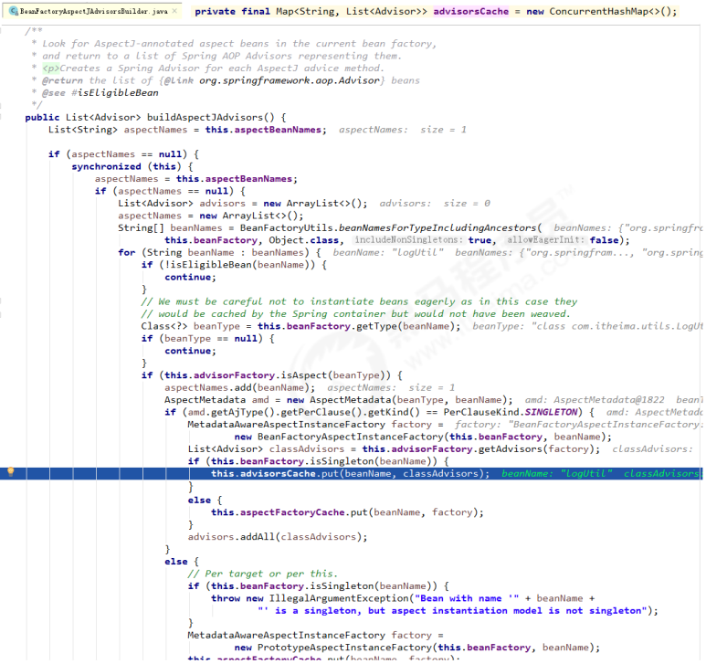


#### 1.4、执行方法

```tex
通过上一小节的分析，我们看到spring在初始化容器时已经把要执行的通知都存入了一个集
合中。接下来当执行我们的切入点方法时，spring会按照通知的类型，顺序调用。
```

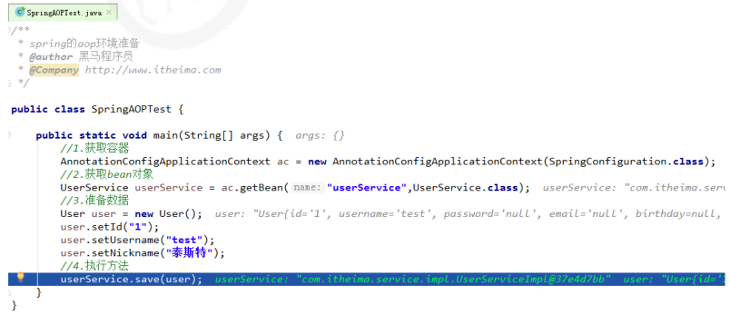

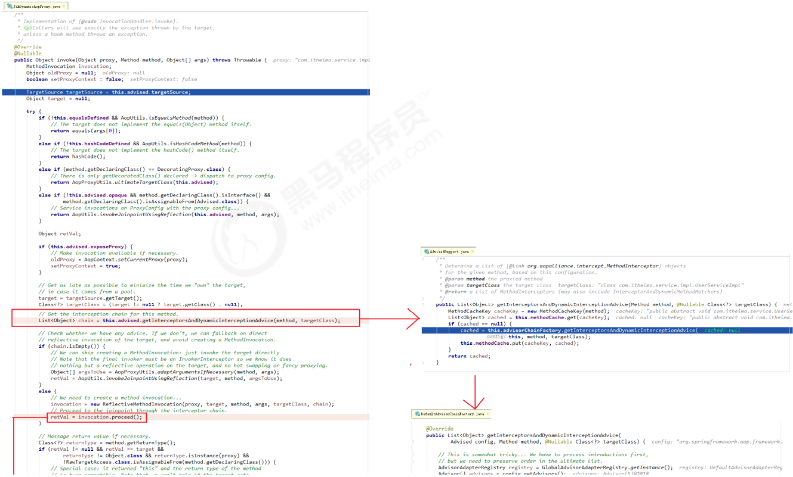

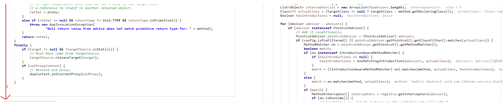

### 2、AnnotationAwareAspectJAutoProxyCreator对象 的分析

#### 2.1、类视图

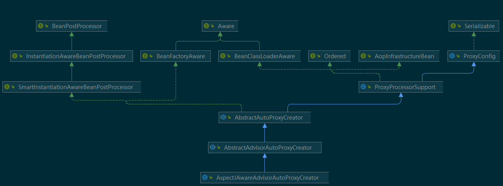


#### 2.2、加载过程

##### 2.2.1、执行父类AbstractAutoProxyCreator中的postProcessAfterInitialization() 方法

```java
public Object postProcessAfterInitialization(Object bean, String beanName) throws BeansException {
    if (bean != null) {
        // 首先根据bean的class和name构建出key
        Object cacheKey = this.getCacheKey(bean.getClass(), beanName);
        // 判断是否需要创建指定的bean
        if (!this.earlyProxyReferences.contains(cacheKey)) {
            return this.wrapIfNecessary(bean, beanName, cacheKey);
        }
    }
    return bean;
}
//构建key的源码：
protected Object getCacheKey(Class<?> beanClass, String beanName) {
    return beanClass.getName() + "_" + beanName;
}
```


##### 2.2.2、判断是否需要增强或已经被增强过了

```java
protected Object wrapIfNecessary(Object bean, String beanName, Object cacheKey) {
    // 如果已经处理过了
    if (this.targetSourcedBeans.contains(beanName)) {
        return bean;
    }
    // 如果不需要进行AOP增强
    else if (this.nonAdvisedBeans.contains(cacheKey)) {
        return bean;
    }
    // 判断这个Bean是不是基础设施类，或者配置了跳过自动代理
    else if (!this.isInfrastructureClass(bean.getClass()) &&
             !this.shouldSkip(bean.getClass(), beanName)) {
        // 获取需要进行增强的方法
        Object[] specificInterceptors =
            this.getAdvicesAndAdvisorsForBean(bean.getClass(), beanName,
                                              (TargetSource)null);
        // 如果获取到了要增强的方法，如果有则需要针对这些需要增强的方法创建代理
        对象
            if (specificInterceptors != DO_NOT_PROXY) {
                this.advisedBeans.add(cacheKey);
                // 创建代理
                Object proxy = this.createProxy(bean.getClass(), beanName, specificInterceptors, new SingletonTargetSource(bean));
                this.proxyTypes.put(cacheKey, proxy.getClass());
                return proxy;
            } else {
                this.nonAdvisedBeans.add(cacheKey);
                return bean;
            }
    } else {
        this.nonAdvisedBeans.add(cacheKey);
        return bean;
    }
}
```


##### 2.2.3、判断是否为基础类（通知类）

```java
/**
* 判断是否为基础设施类，基础设施了不需要代理。
* Advisor、Advice、AopInfrastructureBean这3个类属于基础设施类。
*/
protected boolean isInfrastructureClass(Class<?> beanClass) {
    boolean retVal = Advisor.class.isAssignableFrom(beanClass) || Advice.class.isAssignableFrom(beanClass) || AopInfrastructureBean.class.isAssignableFrom(beanClass);
    if (retVal && this.logger.isTraceEnabled()) {
        this.logger.trace("Did not attempt to auto‐proxy infrastructure class [" + beanClass.getName() + "]");
    }
    return retVal;
}
```


##### 2.2.4、获取增强的代码

```java
protected Object[] getAdvicesAndAdvisorsForBean(Class beanClass, String beanName, TargetSource targetSource) {
    List advisors = this.findEligibleAdvisors(beanClass, beanName);
    return advisors.isEmpty() ? DO_NOT_PROXY : advisors.toArray();
}

protected List<Advisor> findEligibleAdvisors(Class beanClass, String beanName) {
    List<Advisor> candidateAdvisors = this.findCandidateAdvisors();
    List<Advisor> eligibleAdvisors =
        this.findAdvisorsThatCanApply(candidateAdvisors, beanClass, beanName);
    this.extendAdvisors(eligibleAdvisors);
    if (!eligibleAdvisors.isEmpty()) {
        eligibleAdvisors = this.sortAdvisors(eligibleAdvisors);
    }
    return eligibleAdvisors;
}
```


##### 2.2.5、根据增强创建代理对象

```java
protected Object createProxy(Class<?> beanClass, String beanName, Object[] specificInterceptors, TargetSource targetSource) {
    ProxyFactory proxyFactory = new ProxyFactory();
    proxyFactory.copyFrom(this);
    int var8;
    int var9;
    if (!this.shouldProxyTargetClass(beanClass, beanName)) {
        Class[] targetInterfaces =
            ClassUtils.getAllInterfacesForClass(beanClass, this.proxyClassLoader);
        Class[] var10 = targetInterfaces;
        var9 = targetInterfaces.length;
        for(var8 = 0; var8 < var9; ++var8) {
            Class<?> targetInterface = var10[var8];
            proxyFactory.addInterface(targetInterface);
        }
    }
    Advisor[] advisors = this.buildAdvisors(beanName, specificInterceptors);
    Advisor[] var11 = advisors;
    var9 = advisors.length;
    for(var8 = 0; var8 < var9; ++var8) {
        Advisor advisor = var11[var8];
        proxyFactory.addAdvisor(advisor);
    }
    proxyFactory.setTargetSource(targetSource);
    this.customizeProxyFactory(proxyFactory);
    proxyFactory.setFrozen(this.freezeProxy);
    if (this.advisorsPreFiltered()) {
        proxyFactory.setPreFiltered(true);
    }
    return proxyFactory.getProxy(this.proxyClassLoader);
}

```


##### 2.2.6、总结

```tex
1.首先进行创建cacheKey
2.判断是否已经处理过了
3.判断是不是不需要增强
4.判断是不是基础设施类或者是不是需要跳过的bean
5.获取增强器
6.根据增强器进行创建代理对象
```


### 3、切入点表达式总结

#### 3.1、切入点表达式概念及作用

```tex
概念：
	指的是遵循特定的语法用于捕获每一个种类的可使用连接点的语法。
作用：
	用于对符合语法格式的连接点进行增强。
```


#### 3.2、按照用途分类

```tex
主要的种类：
	方法执行：execution(MethodSignature)
	方法调用：call(MethodSignature)
	构造器执行：execution(ConstructorSignature)
	构造器调用：call(ConstructorSignature)
    类初始化：staticinitialization(TypeSignature)
	属性读操作：get(FieldSignature)
	属性写操作：set(FieldSignature)
	例外处理执行：handler(TypeSignature)
	对象初始化：initialization(ConstructorSignature)
	对象预先初始化：preinitialization(ConstructorSignature)
```


#### 3.2、切入点表达式的关键字

```java
支持的AspectJ切入点指示符如下：
	execution：用于匹配方法执行的连接点；
	within：用于匹配指定类型内的方法执行；
	this：用于匹配当前AOP代理对象类型的执行方法；注意是AOP代理对象的类型匹配，这
	样就可能包括引入接口也类型匹配；
	target：用于匹配当前目标对象类型的执行方法；注意是目标对象的类型匹配，这样就不包括引入接口也类型匹配；
	args：用于匹配当前执行的方法传入的参数为指定类型的执行方法；
	@within：用于匹配所以持有指定注解类型内的方法；
	@target：用于匹配当前目标对象类型的执行方法，其中目标对象持有指定的注解；
	@args：用于匹配当前执行的方法传入的参数持有指定注解的执行；
	@annotation：用于匹配当前执行方法持有指定注解的方法；
	bean：Spring AOP扩展的，AspectJ没有对于指示符，用于匹配特定名称的Bean对象的执行方法；
	reference pointcut：表示引用其他命名切入点，只有@ApectJ风格支持，Schema风格不支持。
```


#### 3.3、切入点表达式的通配符

```tex
AspectJ类型匹配的通配符：
	*：匹配任何数量字符；
	..：匹配任何数量字符的重复，如在类型模式中匹配任何数量子包；而在方法参数模式中匹配任何数量参数。
	+：匹配指定类型的子类型；仅能作为后缀放在类型模式后边。
说明：
	java.lang.String 匹配String类型；
	java.*.String 匹配java包下的任何“一级子包”下的String类型；
	如匹配java.lang.String，但不匹配java.lang.ss.String
	java..* 匹配java包及任何子包下的任何类型;
	如匹配java.lang.String、java.lang.annotation.Annotation
	java.lang.*ing 匹配任何java.lang包下的以ing结尾的类型；
	java.lang.Number+ 匹配java.lang包下的任何Number的自类型；
	如匹配java.lang.Integer，也匹配java.math.BigInteger
```


#### 3.4、切入点表达式的逻辑条件

&&  and 

|| or

! not

