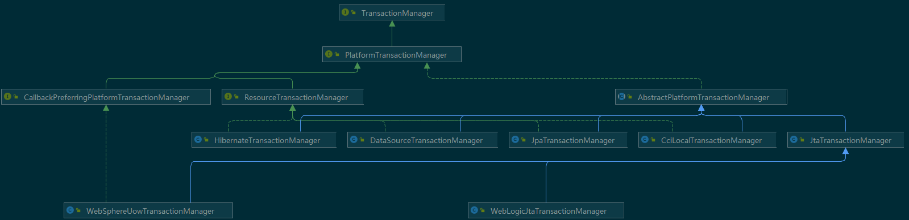
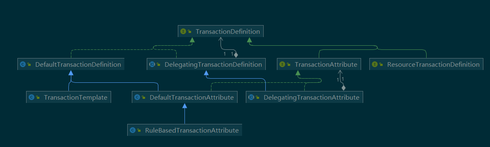
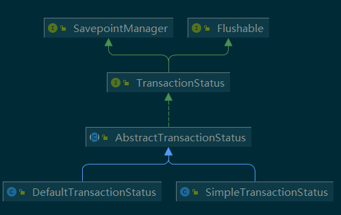

## 一、Spring中对的Jdbc封装

### 1、JdbcTemplate

#### 1.1、概述

##### 1.1.1、基本介绍

```tex
	Spring对数据库的操作在jdbc上面做了基本的封装，让开发者在操作数据库时只需关注SQL语句和查询结果处理器，即可完成功能（当然，只使用JdbcTemplate，还不能摆脱持久层实现类的编写）。
	在配合spring的IoC功能，可以把DataSource注册到JdbcTemplate之中。同时利用spring基于aop的事务即可完成简单的数据库CRUD操作。
	JdbcTemplate的限定命名为org.springframework.jdbc.core.JdbcTemplate。要使用JdbcTemlate需要导入spring-jdbc和spring-tx两个坐标。
```

##### 1.1.2、源码

```java
/**
* JdbcTemplate实现了JdbcOperations接口，操作方法都定义在此接口中
*/
public class JdbcTemplate extends JdbcAccessor implements JdbcOperations {
    /**
    * 使用默认构造函数构建JdbcTemplate
    */
    public JdbcTemplate() {
    }
    /**
	* 通过数据源构建JdbcTemplate
	*/
    public JdbcTemplate(DataSource dataSource) {
        setDataSource(dataSource);
        afterPropertiesSet();
    }
    /**
    * 当使用默认构造函数构建时，提供了设置数据源的方法
    */
    public void setDataSource(@Nullable DataSource dataSource) {
        this.dataSource = dataSource;
    }
}

```

##### 1.1.3、方法说明

```tex
JdbcTemplate主要提供以下五类方法：
	execute方法：
		可以用于执行任何SQL语句，一般用于执行DDL语句；
	update方法及batchUpdate方法：
		update方法用于执行新增、修改、删除等语句；batchUpdate方法用于执行批处理相关语句；
	query方法及queryForXXX方法：
		用于执行查询相关语句；
	call方法：
		用于执行存储过程、函数相关语句。
```


#### 1.2、入门案例

##### 1.2、入门案例

```xml
<dependencies>
    <dependency>
        <groupId>org.springframework</groupId>
        <artifactId>spring-context</artifactId>
        <version>5.1.6.RELEASE</version>
    </dependency>
    <dependency>
        <groupId>org.springframework</groupId>
        <artifactId>spring-jdbc</artifactId>
        <version>5.1.6.RELEASE</version>
    </dependency>
    <dependency>
        <groupId>mysql</groupId>
        <artifactId>mysql-connector-java</artifactId>
        <version>5.1.45</version>
    </dependency>
    <dependency>
        <groupId>org.springframework</groupId>
        <artifactId>spring-test</artifactId>
        <version>5.1.6.RELEASE</version>
    </dependency>
    <dependency>
        <groupId>junit</groupId>
        <artifactId>junit</artifactId>
        <version>4.12</version>
    </dependency>
</dependencies>
```

##### 1.2.2、编写实体类

```java
public class Account implements Serializable{
    private Integer id;
    private String name;
    private Double money;
    public Integer getId() {
    }
    public void setId(Integer id) {
        this.id = id;
    }
    public String getName() {
        return name;
    }
    public void setName(String name) {
        this.name = name;
    }
    public Double getMoney() {
        return money;
    }
    public void setMoney(Double money) {
        this.money = money;
    }
}
```

##### 1.2.3、编写配置类

```java
@Configuration
@Import(JdbcConfig.class)
@PropertySource("classpath:jdbc.properties")
public class SpringConfiguration {
}
```

```java
@Configuration
@Import(JdbcConfig.class)
@PropertySource("classpath:jdbc.properties")
public class SpringConfiguration {

    @Bean
    public DataSource createDataSource(){
        DriverManagerDataSource dataSource = new
            DriverManagerDataSource(url,username,password);
        dataSource.setDriverClassName(driver);
        return dataSource;
    }
}
```

##### 1.2.4、编写配置文件

```properties
jdbc.driver=com.mysql.jdbc.Driver
jdbc.url=jdbc:mysql://localhost:3306/spring_ioc
jdbc.username=root
jdbc.password=1234
```

##### 1.2.5、测试方法

```java
@RunWith(SpringJUnit4ClassRunner.class)
@ContextConfiguration(classes = SpringConfiguration.class)
public class SpringJdbcTemplateUseTest {
    @Autowired
    private JdbcTemplate jdbcTemplate;
    @Test
    public void testSave(){
        jdbcTemplate.update("insert into account(name,money)values(?,?)","ccc",1234f);
    }
    @Test
    public void testUpdate(){
        jdbcTemplate.update("update account set name=?,money=? where id=?","ccc",2345f,1);
    }
    @Test
    public void testDelete(){
        jdbcTemplate.update("delete from account where id = ?",1);
    }
    @Test
    public void testFindOne(){
        // List<Account> accounts = jdbcTemplate.query("select * from account where id = ?",new BeanPropertyRowMapper<Account>(Account.class),1);
        Account account = jdbcTemplate.queryForObject("select * from account where id = ?",new BeanPropertyRowMapper<Account>(Account.class),1);
        System.out.println(account);
    }
    @Test
    public void testFindAll(){
        List<Account> accounts = jdbcTemplate.query("select * from account ",new BeanPropertyRowMapper<Account>(Account.class));
        for(Account account : accounts){
            System.out.println(account);
        }
    }
    @Test
    public void testFindCount(){
        Long count = jdbcTemplate.queryForObject("select count(*) from account where money > ?",Long.class,999d);
        System.out.println(count);
    }
    @Test
    public void testQueryForList(){
        // List<Map<String,Object>> list = jdbcTemplate.queryForList("select *
        from account where money > ?",999f);
            // for(Map<String,Object> map : list){
            // for(Map.Entry<String,Object> me : map.entrySet()) {
            // System.out.println(me.getKey()+","+me.getValue());
            // }
            // }
            List<Double> list = jdbcTemplate.queryForList("select money from account where money > ?", Double.class,999f);
        for(Double money : list){
            System.out.println(money);
        }
    }
    @Test
    public void testQueryForMap(){
        Map<String,Object> map = jdbcTemplate.queryForMap("select * from account where id = ?", 2);
        for(Map.Entry me:map.entrySet()){
            System.out.println(me.getKey()+","+me.getValue());
        }
    }
    @Test
    public void testQueryForRowSet(){
        SqlRowSet rowSet = jdbcTemplate.queryForRowSet("select * from account where money > ?",999d);
        System.out.println(rowSet);
        if(rowSet instanceof ResultSetWrappingSqlRowSet){
            while(rowSet.next()) {
                ResultSetWrappingSqlRowSet resultSetWrappingSqlRowSet =
                    (ResultSetWrappingSqlRowSet) rowSet;
                String name = resultSetWrappingSqlRowSet.getString("name");
                System.out.println(name);
            }
        }
    }
}
```

#### 1.3、LobHandler和LobCreator 

##### 1.3.1、准备环境

```java
public class Userinfo implements Serializable {
    private Integer id;
    private byte[] images;
    private String description;
    public Integer getId() {
        return id;
    }
    public void setId(Integer id) {
        this.id = id;
    }
    public byte[] getImages() {
        return images;
    }
    public void setImages(byte[] images) {
        this.images = images;
    }
    public String getDescription() {
        return description;
    }
    public void setDescription(String description) {
        this.description = description;
    }
    @Override
    public String toString() {
        return "Userinfo{" + "id=" + id + ", images=" + Arrays.toString(images) + ", description='" + description + '\'' + '}';
    }
}
```

```java
/**
* 在JdbcConfig中加入如下代码
*/
@Bean
public LobHandler createLobHandler(){
return new DefaultLobHandler();
}
```

```java
@RunWith(SpringJUnit4ClassRunner.class)
@ContextConfiguration(classes = SpringConfiguration.class)
public class SpringJdbcTemplateUseTest {
    @Autowired
    private JdbcTemplate jdbcTemplate;
    @Autowired
    private LobHandler lobHandler;
    @Test
    public void testWrite(){
        try {
            FileSystemResource res = new FileSystemResource("C:\\Users\\zhy\\Desktop\\6.jpg");
            byte[] mockImg = FileCopyUtils.copyToByteArray(res.getFile());
            Userinfo userinfo = new Userinfo();
            userinfo.setId(3);
            userinfo.setImages(mockImg);
            userinfo.setDescription("Spring对数据库的操作在jdbc上面做了基本的封装，让开发者在操作数据库时只需关注SQL语句和查询结果处理器，即可完成功能（当然，只使用JdbcTemplate，还不能摆脱持久层实现类的编写）。\t\n" + 
                                    "\t在配合spring的IoC功能，可以把DataSource注册到JdbcTemplate之中。同时利用spring基于aop的事务即可完成简单的数据库CRUD操作。\n" + 
                                    " JdbcTemplate的限定命名为org.springframework.jdbc.core.JdbcTemplate。要使用JdbcTemlate需要导入spring-jdbc和spring-tx两个坐标。");
            jdbcTemplate.execute("insert into userinfo(id,image,description)values(?,?,?)", new AbstractLobCreatingPreparedStatementCallback(lobHandler) {
                @Override
                protected void setValues(PreparedStatement ps, LobCreator
                                         lobCreator) throws SQLException, DataAccessException {
                    ps.setInt(1,3);
                    lobCreator.setBlobAsBytes(ps, 2,userinfo.getImages() );
                    lobCreator.setClobAsString(ps,3,userinfo.getDescription());
                }
            });
        }catch (Exception e){
            e.printStackTrace();
        }
    }
    @Test
    public void testRead(){
        // List list = jdbcTemplate.query("select * from userinfo where id=?",new BeanPropertyRowMapper<Userinfo>(Userinfo.class),3);
        Userinfo userinfo = jdbcTemplate.query("select * from userinfo where id=?", new ResultSetExtractor<Userinfo>() {
            @Override
            public Userinfo extractData(ResultSet rs) throws
                SQLException, DataAccessException {
                Userinfo userinfo = null;
                if(rs.next()){
                    int id = rs.getInt(1);
                    byte[] image = lobHandler.getBlobAsBytes(rs, 2);
                    String description =
                        lobHandler.getClobAsString(rs,3);
                    userinfo = new Userinfo();
                    userinfo.setId(id);
                    userinfo.setImages(image);
                    userinfo.setDescription(description);
                }
                return userinfo;
            }
        },3);
        System.out.println(userinfo);
    }
}
```


### 2、NamedParameterJdbcTemplate

#### 2.1、概述

##### 2.1.1、基本介绍

```tex
	在经典的 JDBC 用法中, SQL 参数是用占位符 ? 表示,并且受到位置的限制. 定位参数的问题在于,一旦参数的顺序发生变化, 就必须改变参数绑定.在 Spring JDBC 框架中, 绑定 SQL 参数的另一种选择是使用具名参数(named parameter).
	那么什么是具名参数？
具名参数: SQL 按名称(以冒号开头)而不是按位置进行指定. 具名参数更易于维护, 也提升了可读性. 具名参数由框架类在运行时用占位符取代
具名参数只在 NamedParameterJdbcTemplate 中得到支持。NamedParameterJdbcTemplate可以使用全部jdbcTemplate方法。
```

##### 2.1.2、源码

```java
/**
* 通过观察源码我们发现，NamedParameterJdbcTemplate里面封装了一个JdbcTemplate对象
* 只不过把它看成了接口类型JdbcOperations。
*/
public class NamedParameterJdbcTemplate implements NamedParameterJdbcOperations
{
    /** The JdbcTemplate we are wrapping. */
    private final JdbcOperations classicJdbcTemplate;
    /**
    * 使用DataSource 构建一个NamedParameterJdbcTemplate
    */
    public NamedParameterJdbcTemplate(DataSource dataSource) {
        Assert.notNull(dataSource, "DataSource must not be null");
        this.classicJdbcTemplate = new JdbcTemplate(dataSource);
    }
    /**
    * 使用JdbcOperations 构建一个NamedParameterJdbcTemplate
    */
    public NamedParameterJdbcTemplate(JdbcOperations classicJdbcTemplate) {
        Assert.notNull(classicJdbcTemplate, "JdbcTemplate must not be null");
        this.classicJdbcTemplate = classicJdbcTemplate;
    }
    //其余代码略
}
```


#### 2.2、入门案例

##### 2.2.1、导入坐标

```xml
<dependencies>
    <dependency>
        <groupId>org.springframework</groupId>
        <artifactId>spring-context</artifactId>
        <version>5.1.6.RELEASE</version>
    </dependency>
    <dependency>
        <groupId>org.springframework</groupId>
        <artifactId>spring-jdbc</artifactId>
        <version>5.1.6.RELEASE</version>
    </dependency>
    <dependency>
        <groupId>mysql</groupId>
        <artifactId>mysql-connector-java</artifactId>
        <version>5.1.45</version>
    </dependency>
    <dependency>
        <groupId>org.springframework</groupId>
        <artifactId>spring-test</artifactId>
        <version>5.1.6.RELEASE</version>
    </dependency>
    <dependency>
        <groupId>junit</groupId>
        <artifactId>junit</artifactId>
        <version>4.12</version>
    </dependency>
</dependencies>
```

##### 2.2.2、编写实体类

```java
/**
* @author 黑马程序员
* @Company http://www.itheima.com
*/
public class Account implements Serializable{
    private Integer id;
    private String name;
    private Double money;
    public Integer getId() {
        return id;
    }
    public void setId(Integer id) {
        this.id = id;
    }
    public String getName() {
        return name;
    }
    public void setName(String name) {
        this.name = name;
    }
    public Double getMoney() {
        return money;
    }
    public void setMoney(Double money) {
        this.money = money;
    }
}
```

##### 2.2.3、编写配置类

```java
@Configuration
@Import(JdbcConfig.class)
@PropertySource("classpath:jdbc.properties")
public class SpringConfiguration {
}
```

```java
public class JdbcConfig {
    @Value("${jdbc.driver}")
    private String driver;
    @Value("${jdbc.url}")
    private String url;
    @Value("${jdbc.username}")
    private String username;
    @Value("${jdbc.password}")
    private String password;
    @Bean
    public JdbcTemplate createJdbcTemplate(DataSource dataSource){
        return new JdbcTemplate(dataSource);
    }
    @Bean
    public DataSource createDataSource(){
        DriverManagerDataSource dataSource = new
            DriverManagerDataSource(url,username,password);
        dataSource.setDriverClassName(driver);
        return dataSource;
    }
    @Bean
    public NamedParameterJdbcTemplate createNamedJdbcTemplate(JdbcTemplate
                                                              jdbcTemplate){
        return new NamedParameterJdbcTemplate(jdbcTemplate);
    }
}
```

##### 2.2.4、编写配置文件

```properties
jdbc.driver=com.mysql.jdbc.Driver
jdbc.url=jdbc:mysql://localhost:3306/spring_ioc
jdbc.username=root
jdbc.password=1234
```

##### 2.2.5、测试方法

```java
@RunWith(SpringJUnit4ClassRunner.class)
@ContextConfiguration(classes = SpringConfiguration.class)
public class SpringJdbcTemplateUseTest {
    @Autowired
    private NamedParameterJdbcTemplate namedParameterJdbcTemplate;
    @Autowired
    private JdbcTemplate jdbcTemplate;
    @Test
    public void testFindMore(){
        // List<Account> accounts = jdbcTemplate.query("select * from account where id in (?,?)",new Object[]{1,2},new BeanPropertyRowMapper<Account>(Account.class));
        Map<String,List<Integer>> map = new HashMap<>();
        List<Integer> list = new ArrayList<>();
        list.add(1);
        list.add(2);
        map.put("ids",list);
        List<Account> accounts = namedParameterJdbcTemplate.query("select * from account where id in (:ids)",map,new BeanPropertyRowMapper<Account>(Account.class));
        System.out.println(accounts);
    }
    @Test
    public void testNamedParameter(){
        Account account = new Account();
        account.setName("test");
        account.setMoney(12345d);
        BeanMap beanMap = BeanMap.create(account);
        namedParameterJdbcTemplate.update("insert into account(name,money)values(:name,:money)",beanMap);
    }
}
```


### 3、JdbcTemplate的实现原理

#### 3.1、自定义JdbcTemplate

##### 3.1.1、创建工程并导入坐标

```xml
<dependencies>
    <dependency>
        <groupId>com.alibaba</groupId>
        <artifactId>druid</artifactId>
        <version>1.1.10</version>
    </dependency>
    <dependency>
        <groupId>mysql</groupId>
        <artifactId>mysql-connector-java</artifactId>
        <version>5.1.45</version>
    </dependency>
</dependencies>
```

##### 3.1.2、编写自定义JdbcTemplate

```java
/**
* 自定义JdbcTemplate
*/
public class JdbcTemplate {
    //定义数据源
    private DataSource dataSource;
    //通过构造函数给数据源赋值
    public JdbcTemplate(DataSource dataSource){
        this.dataSource = dataSource;
    }
    //通过set方法给数据源赋值
    public void setDataSource(DataSource dataSource) {
        this.dataSource = dataSource;
    }
    /**
* 查询方法
* @param sql sql语句
* @param rsh 结果集处理器
* @param params sql语句的参数
* @return
*/
    public Object query(String sql, ResultSetHandler rsh , Object... params){
        //1.判断是否有数据源，没有数据源就直接抛异常
        if(dataSource == null){
            throw new NullPointerException("DataSource can not empty!");
        }
        //2.定义连接和处理对象
        Connection connection = null;
        PreparedStatement pstm = null;
        ResultSet rs = null;
        try {
            //2.获取连接
            connection = dataSource.getConnection();
            //3.获取预处理对象
            pstm = connection.prepareStatement(sql);
            //4.获取参数元信息
            ParameterMetaData pmd = pstm.getParameterMetaData();
            //5.获取参数个数
            int parameterCount = pmd.getParameterCount();
            //6.验证参数
            if(parameterCount > 0){
                if(params == null ){
                    throw new NullPointerException("Parameter can not be null !");
                }
                if(parameterCount != params.length){
                    throw new IllegalArgumentException("Incorrect parameter count: expected " + String.valueOf(parameterCount) +", actual "+String.valueOf(params.length));
                }
                //7.给参数赋值
                for(int i=0;i<parameterCount;i++){
                    pstm.setObject((i+1),params[i]);
                }
            }
            //8.验证通过，执行SQL语句
            rs = pstm.executeQuery();
            //9.处理结果集：策略模式
            return rsh.handle(rs);
        }catch (Exception e){
            throw new RuntimeException(e);
        }finally {
            release(connection,pstm,rs);
        }
    }
    /**
* 增删改操作
* @param sql
* @param params
* @return
*/
    public int update(String sql,Object... params){
        //1.判断是否有数据源，没有数据源就直接抛异常
        if(dataSource == null){
            throw new NullPointerException("DataSource can not empty!");
        }
        //2.定义连接和处理对象
        Connection connection = null;
        PreparedStatement pstm = null;
        try {
            //2.获取连接
            connection = dataSource.getConnection();
            //3.获取预处理对象
            pstm = connection.prepareStatement(sql);
            //4.获取参数元信息
            ParameterMetaData pmd = pstm.getParameterMetaData();
            //5.获取参数个数
            int parameterCount = pmd.getParameterCount();
            //6.验证参数
            if(parameterCount > 0){
                if(params == null ){
                    throw new NullPointerException("Parameter can not be null !");
                }
                if(parameterCount != params.length){
                    throw new IllegalArgumentException("Incorrect parameter count: expected "+ String.valueOf(parameterCount) +", actual "+String.valueOf(params.length));
                }
                //7.给参数赋值
                for(int i=0;i<parameterCount;i++){
                    pstm.setObject((i+1),params[i]);
                }
            }
            //8.验证通过，执行SQL语句
            return pstm.executeUpdate();
        }catch (Exception e){
            throw new RuntimeException(e);
        }finally {
            release(connection,pstm,null);
        }
    }
    private void release(Connection conn, PreparedStatement pstm, ResultSet rs){
        if(rs != null){
            try {
                rs.close();
            }catch (Exception e){
                e.printStackTrace();
            }
        }
        if(pstm != null){
            try {
                pstm.close();
            }catch (Exception e){
                e.printStackTrace();
            }
        }
        if(conn != null){
            try {
                conn.close();
            }catch (Exception e){
                e.printStackTrace();
            }
        }
    }
}
```


#### 3.2、自定义RowMapper

##### 3.2.1、定义接口

```java
public interface ResultSetHandler<T> {
    /**
    * @param rs
    * @return
    */
    Object handle(ResultSet rs)throws Exception;
}
```

##### 3.2.2、提供不同实现

```java
public class BeanHandler<T> implements ResultSetHandler {
    private Class<T> requiredType;
    private BeanListHandler<T> beanListHandler;
    /**
    * 覆盖默认无参构造
    * @param requriedType
    */
    public BeanHandler(Class requriedType){
        this.requiredType = requriedType;
    }
    public BeanHandler(BeanListHandler beanListHandler) {
        this.beanListHandler = beanListHandler;
    }
    @Override
    public T handle(ResultSet rs) throws Exception{
        //判断BeanListHandler是否有值
        if(beanListHandler != null){
            return beanListHandler.handle(rs).get(0);
        }
        //1.定义返回值
        T bean = null;
        //2.由于是查询一个，所以只需判断rs能往下走，不用while循环即可
        if(rs.next()){
            //3.实例化bean对象
            bean = requiredType.newInstance();
            //4.获取参数元信息
            ResultSetMetaData rsmd = rs.getMetaData();
            //5.取出参数个数
            int columnCount = rsmd.getColumnCount();
            //6.遍历参数个数
            for(int i=0;i<columnCount;i++){
                //7.取出列名称
                String columnLabel = rsmd.getColumnLabel(i+1);
                //8.取出列的值
                Object value = rs.getObject(columnLabel);
                //9.创建实体类的属性描述器，使用内省填充对象数据
                PropertyDescriptor pd = new
                    PropertyDescriptor(columnLabel,requiredType);
                //10.获取属性的写方法
                Method method = pd.getWriteMethod();
                //11.填充数据
                method.invoke(bean,value);
            }
        }
        //返回
        return bean;
    }
}
```

```java
public class BeanListHandler<T> implements ResultSetHandler {
    private Class<T> requiredType;
    /**
    * 覆盖默认无参构造
    * @param requriedType
    */
    public BeanListHandler(Class requriedType){
        this.requiredType = requriedType;
    }
    @Override
    public List<T> handle(ResultSet rs) throws Exception{
        //1.定义返回值
        List<T> list = new ArrayList();
        T bean = null;
        T bean = null;
        北京市昌平区建材城西路金燕龙办公楼一层 电话：400-618-9090
            3.3、测试
            3.3.1、创建测试工程并导入坐标
            //2.由于是查询一个，所以只需判断rs能往下走，不用while循环即可
            while(rs.next()){
                //3.实例化bean对象
                bean = requiredType.newInstance();
                //4.获取参数元信息
                ResultSetMetaData rsmd = rs.getMetaData();
                //5.取出参数个数
                int columnCount = rsmd.getColumnCount();
                //6.遍历参数个数
                for(int i=0;i<columnCount;i++){
                    //7.取出列名称
                    String columnLabel = rsmd.getColumnLabel(i+1);
                    //8.取出列的值
                    Object value = rs.getObject(columnLabel);
                    //9.创建实体类的属性描述器，使用内省填充对象数据
                    PropertyDescriptor pd = new
                        PropertyDescriptor(columnLabel,requiredType);
                    //10.获取属性的写方法
                    Method method = pd.getWriteMethod();
                    //11.填充数据
                    method.invoke(bean,value);
                }
                //12.给list填充数据
                list.add(bean);
            }
        //返回
        return list;
    }
}
```


#### 3.3、测试

##### 3.3.1、创建测试工程并导入坐标

```xml
<dependencies>
    <dependency>
        <groupId>org.springframework</groupId>
        <artifactId>spring-context</artifactId>
        <version>5.1.6.RELEASE</version>
    </dependency>
    <dependency>
        <groupId>mysql</groupId>
        <artifactId>mysql-connector-java</artifactId>
        <version>5.1.45</version>
    </dependency>
    <dependency>
        <groupId>org.springframework</groupId>
        <artifactId>spring-test</artifactId>
        <version>5.1.6.RELEASE</version>
    </dependency>
    <dependency>
        <groupId>junit</groupId>
        <artifactId>junit</artifactId>
        <version>4.12</version>
    </dependency>
    <dependency>
        <groupId>com.alibaba</groupId>
        <artifactId>druid</artifactId>
        <version>1.1.10</version>
    </dependency>
    <dependency>
        <groupId>com.itheima</groupId>
        <artifactId>tx02_designjdbctemplate</artifactId>
        <version>1.0-SNAPSHOT</version>
    </dependency>
</dependencies>
```

##### 3.3.2、编写实体类

```java
public class Account implements Serializable{
    private Integer id;
    private String name;
    private Double money;
    public Integer getId() {
        return id;
    }
    public void setId(Integer id) {
        this.id = id;
    }
    public String getName() {
        return name;
    }
    public void setName(String name) {
        this.name = name;
    }
    public Double getMoney() {
        return money;
    }
    public void setMoney(Double money) {
        this.money = money;
    }
}
```

##### 3.3.3、编写配置类

```java
@Configuration
@Import(JdbcConfig.class)
@PropertySource("classpath:jdbc.properties")
public class SpringConfiguration {
}
```

```java
public class JdbcConfig {
    @Value("${jdbc.driver}")
    private String driver;
    @Value("${jdbc.url}")
    private String url;
    @Value("${jdbc.username}")
    private String username;
    @Value("${jdbc.password}")
    private String password;
    @Bean
    public JdbcTemplate createJdbcTemplate(DataSource dataSource){
        return new JdbcTemplate(dataSource);
    }
    @Bean
    public DataSource createDataSource(){
        DruidDataSource dataSource = new DruidDataSource();
        dataSource.setDriverClassName(driver);
        dataSource.setUrl(url);
        dataSource.setUsername(username);
        dataSource.setPassword(password);
        return dataSource;
    }
}
```

##### 3.3.4、编写配置文件

```properties
jdbc.driver=com.mysql.jdbc.Driver
jdbc.url=jdbc:mysql://localhost:3306/spring_ioc
jdbc.username=root
jdbc.password=1234
```

##### 3.3.5、编写测试类

```java
@RunWith(SpringJUnit4ClassRunner.class)
@ContextConfiguration(classes = SpringConfiguration.class)
public class SpringJdbcTemplateUseTest {
    @Autowired
    private JdbcTemplate jdbcTemplate;
    @Test
    public void testSave(){
        jdbcTemplate.update("insert into account(name,money)values(?,?)","ccc",1234f);
    }
    @Test
    public void testUpdate(){
        jdbcTemplate.update("update account set name=?,money=? where id=?","ccc",2345f,1);
    }
    @Test
    public void testDelete(){
        jdbcTemplate.update("delete from account where id = ?",1);
    }
    @Test
    public void testFindOne(){
        Account account = (Account)jdbcTemplate.query("select * from account where id = ?",new BeanHandler(Account.class),1);
        System.out.println(account);
    }
    @Test
    public void testFindAll(){
        List<Account> accounts = (List<Account>)jdbcTemplate.query("select * from account ",new BeanListHandler<Account>(Account.class));
        for(Account account : accounts){
            System.out.println(account);
        }
    }
}
```


#### 3.4、策略模式

```tex
	策略模式（Strategy Pattern） 也叫 政策模式（Policy Pattern）。指的是对象具备某个行为，但是在不同的场景中，该行为有不同的实现。
	举例：比如有三个人相约去爬山，实现目标就是从山底登到山顶，这个实现的过程有很多种，比如，走上山顶，坐缆车上山顶，甚至做直升机上山顶等等。那么每一种实现目标的过程即为一种策略。
	策略模式的应用场景非常广泛，通常情况下，需要两个条件：
		第一：数据已经有了。
		第二：目的明确。
	在满足这两个条件下，达成目标的过程就是策略。通常这个达成目标的过程有使用者自己实现。因为每个需求场景不一样，只有当前使用者最清楚当前的需求。
	策略模式是面向接口编程思想的具体体现，通常情况下，作为设计者会暴露出来一个接口，同时可以提供一些接口实现，也可以不提供，而让使用者根据具体情况去编写具体实现代码。以达到灵活的扩展目的。

```


## 二、Spring中的事务

### 1、API介绍

#### 1.1、PlatformTransactionManager和它的实现类

##### 1.1.1、作用

```tex
	此接口是Spring的事务管理器核心接口。Spring本身并不支持事务实现，只是负责提供标准，应用底层支持什么样的事务，需要提供具体实现类。此处也是策略模式的具体应用。在Spring框架中，也为我们内置了一些具体策略，例如：DataSourceTransactionManager,HibernateTransactionManager，JpaTransactionManager,JtaTransactionManager等等。（JpaTransactionManager和HibernateTransactionManager事务管理器在spring-orm包中）
```

##### 1.1.2、类视图



##### 1.1.3、方法说明

```java
public interface PlatformTransactionManager {
    /**
    * 获取事务状态信息
    */
    TransactionStatus getTransaction(@Nullable TransactionDefinition definition)
        throws TransactionException;
    /**
    * 提交事务
    */
    void commit(TransactionStatus status) throws TransactionException;
    /**
    * 回滚事务
    */
    void rollback(TransactionStatus status) throws TransactionException;
}
```


#### 1.2、TransactionDefinition

##### 1.2.1、作用

```tex
	此接口是Spring中事务可控属性的顶层接口，里面定义了事务的一些属性以及获取属性的方法。例如：事务的传播行为，事务的隔离级别，事务的只读，事务的超时等等。通常情况下，我们在开发中都可以配置这些属性，以求达到最佳效果。配置的方式支持xml和注解。
```

##### 1.2.2、类视图



##### 1.2.3、定义信息说明

```java
public interface TransactionDefinition {
    /**
    * REQUIRED:如果当前没有事务，就新建一个事务，如果已经存在一个事务中，加入到这个事务中。一般的选择（默认值）
    */
    int PROPAGATION_REQUIRED = 0;
    /**
    * SUPPORTS:支持当前事务，如果当前没有事务，就以非事务方式执行（没有事务）
    */
    int PROPAGATION_SUPPORTS = 1;
    /**
    * MANDATORY：使用当前的事务，如果当前没有事务，就抛出异常
    */
    int PROPAGATION_MANDATORY = 2;
    /**
    * REQUERS_NEW:新建事务，如果当前在事务中，把当前事务挂起。
    */
    int PROPAGATION_REQUIRES_NEW = 3;
    /**
    * NOT_SUPPORTED:以非事务方式执行操作，如果当前存在事务，就把当前事务挂起
    */
    int PROPAGATION_NOT_SUPPORTED = 4;
    /**
    * NEVER:以非事务方式运行，如果当前存在事务，抛出异常
    */
    int PROPAGATION_NEVER = 5;
    /**
    * NESTED:如果当前存在事务，则在嵌套事务内执行。如果当前没有事务，则执行REQUIRED类似的操作。
    */
    int PROPAGATION_NESTED = 6;
    /**
    * 事务的隔离级别默认值，当取值-1时，会采用下面的4个值其中一个。
    * (不同数据库的默认隔离级别不一样)
    */
    int ISOLATION_DEFAULT = -1;
    /**
    * 事务隔离级别为：读未提交
    * 执行效率最高，但什么错误情况也无法避免
    */
    int ISOLATION_READ_UNCOMMITTED = Connection.TRANSACTION_READ_UNCOMMITTED;
    /**
    * 事务隔离级别为：读已提交
    * 可以防止脏读的发生，但是无法防住不可重复读和幻读的发生
    */
    int ISOLATION_READ_COMMITTED = Connection.TRANSACTION_READ_COMMITTED;
    /**
    * 事务隔离级别为：可重复读
    * 可以防止脏读和不可重复读的发生，但是无法防住幻读的发生
    */
    int ISOLATION_REPEATABLE_READ = Connection.TRANSACTION_REPEATABLE_READ;
    /**
    * 事务隔离级别为：串行化
    * 此时所有错误情况均可防住，但是由于事务变成了独占模式（排他模式），因此效率最低
    */
    int ISOLATION_SERIALIZABLE = Connection.TRANSACTION_SERIALIZABLE;
    /**
    * 超时限制。默认值是-1，没有超时限制。如果有，以秒为单位进行设置。
    */
    int TIMEOUT_DEFAULT = -1;
    /**
    * 获取事务传播行为
    */
    int getPropagationBehavior();
    /**
    * 获取事务隔离级别
    */
    int getIsolationLevel();
    /**
    * 获取事务超时时间
    */
    int getTimeout();
    /**
    * 获取事务是否只读
    */
    boolean isReadOnly();
    /**
    * 获取事务名称
    */
    @Nullable
    String getName();
}
```


#### 1.3、TransactionStatus

##### 1.3.1、作用

```tex
此接口是事务运行状态表示的顶层接口，里面定义着获取事务运行状态的一些方法。
```

##### 1.3.2、类视图



##### 1.3.3、方法说明

```java
public interface TransactionStatus extends SavepointManager, Flushable {
    /**
    * 是否一个新的事务
    */
    boolean isNewTransaction();
    /**
    * 是否包含存储点
    */
    boolean hasSavepoint();
    /**
    * 设置事务回滚
    */
    void setRollbackOnly();
    /**
    * 是否是只回滚事务
    */
    boolean isRollbackOnly();
    /**
    * 刷新事务
    */
    @Override
    void flush();
    /**
    * 事务是否已经完成(标识就是提交或者回滚了)
    */
    boolean isCompleted();
}
```


### 2、入门案例

#### 2.1、前置说明

```tex
1、Spring中事务控制的分类：
	编程式事务：通过编码的方式，实现事务控制
	声明式事务：通过配置的方式，实现事务控制。
	本案例中，采用的是声明式事务，且注解驱动的方式配置。
2、案例的选择
	本案例采用的是经典转账案例测试事务控制
```


#### 2.2、环境搭建

##### 2.2.1、导入坐标

```xml
<dependencies>
    <dependency>
        <groupId>org.springframework</groupId>
        <artifactId>spring-context</artifactId>
        <version>5.1.6.RELEASE</version>
    </dependency>
    <dependency>
        <groupId>org.springframework</groupId>
        <artifactId>spring-jdbc</artifactId>
        <version>5.1.6.RELEASE</version>
    </dependency>
    <dependency>
        <groupId>mysql</groupId>
        <artifactId>mysql-connector-java</artifactId>
        <version>5.1.45</version>
    </dependency>
    <dependency>
        <groupId>org.springframework</groupId>
        <artifactId>spring-test</artifactId>
        <version>5.1.6.RELEASE</version>
    </dependency>
    <dependency>
        <groupId>junit</groupId>
        <artifactId>junit</artifactId>
        <version>4.12</version>
    </dependency>
</dependencies>
```

##### 2.2.2、编写基础代码

```java
/**
* 账户的实体类
*/
public class Account implements Serializable{
    private Integer id;
    private String name;
    private Double money;
    public Integer getId() {
        return id;
    }
    public void setId(Integer id) {
        this.id = id;
    }
    public String getName() {
        return name;
    }
    public void setName(String name) {
        this.name = name;
    }
    public Double getMoney() {
        return money;
    }
    public void setMoney(Double money) {
        this.money = money;
    }
    @Override
    public String toString() {
        return "Account{" + "id=" + id + ", name='" + name + '\'' + ", money=" + money + '}';
    }
}

```

```java
/**
* 账户的业务层接口
*/
public interface AccountService {
    /**
    * 转账
    * @param sourceName 转出账户名称
    * @param targetName 转入账户名称
    * @param money 转账金额
    */
    void transfer(String sourceName,String targetName,Double money);
}
```

```java
/**
* 账户的业务层实现
*/
@Service("accountService")
public class AccountServiceImpl implements AccountService {
    @Override
    public void transfer(String sourceName, String targetName, Double money) {
        //1.根据名称查询转出账户
        Account source = accountDao.findByName(sourceName);
        //2.根据名称查询转入账户
        Account target = accountDao.findByName(targetName);
        //3.转出账户减钱
        source.setMoney(source.getMoney() - money);
        //4.转入账户加钱
        target.setMoney(target.getMoney() + money);
        //5.更新转出账户
        accountDao.update(source);
        int i=1/0;//模拟转账异常
        //6.更新转入账户
        accountDao.update(target);
    }
}
```

```java
/**
* 账户的持久层接口
*/
public interface AccountDao {
    /**
    * 更新账户
    * @param account
    */
    void update(Account account);
    /**
    * 根据名称查询账户
    * @param name
    * @return
    */
    Account findByName(String name);
}
```

```java
/**
* 账户的持久层实现
*/
@Repository
public class AccountDaoImpl implements AccountDao {
    @Autowired
    private JdbcTemplate jdbcTemplate;
    @Override
    public void update(Account account) {
        jdbcTemplate.update("update account set name=?,money=? where id =?",account.getName(),account.getMoney(),account.getId());
    }
    @Override
    public Account findByName(String name) {
        List<Account> accounts = jdbcTemplate.query("select * from account where name = ?",new BeanPropertyRowMapper<Account>(Account.class),name);
        if(accounts.isEmpty()){
            return null;
        }
        if(accounts.size() > 1){
            throw new IllegalArgumentException("账户名不唯一");
        }
        return accounts.get(0);
    }
}
```

##### 2.2.3、编写配置类和配置文件

```java
@Configuration
@Import(JdbcConfig.class)
@PropertySource("classpath:jdbc.properties")
@EnableTransactionManagement
public class SpringConfiguration {
}

public class JdbcConfig {
    @Value("${jdbc.driver}")
    private String driver;
    @Value("${jdbc.url}")
    private String url;
    @Value("${jdbc.username}")
    private String username;
    @Value("${jdbc.password}")
    private String password;
    @Bean
    public JdbcTemplate createJdbcTemplate(DataSource dataSource){
        return new JdbcTemplate(dataSource);
    }
    @Bean
    public DataSource createDataSource(){
        DriverManagerDataSource dataSource = new
            DriverManagerDataSource(url,username,password);
        dataSource.setDriverClassName(driver);
        return dataSource;
    }
}
```

```properties
jdbc.driver=com.mysql.jdbc.Driver
jdbc.url=jdbc:mysql://localhost:3306/spring_ioc
jdbc.username=root
jdbc.password=1234
```


#### 2.3、测试结果

```java
/**
* 测试案例的执行
*/
@RunWith(SpringJUnit4ClassRunner.class)
@ContextConfiguration(classes = SpringConfiguration.class)
public class SpringBasicAnnoTest {
    @Autowired
    private AccountService accountService;
    @Test
    public void testTransfer(){
        accountService.transfer("aaa","bbb",100d);
    }
}
```


### 3、事务中的注解

#### 3.1、@EnableTransactionManagement

##### 3.1.1、作用

```tex
	此注解是Spring支持注解事务配置的标志。表明Spring开启注解事务配置的支持。是注解驱动开发事务配置的必备注解。
```

##### 3.1.2、源码

```java
@Target(ElementType.TYPE)
@Retention(RetentionPolicy.RUNTIME)
@Documented
@Import(TransactionManagementConfigurationSelector.class)
public @interface EnableTransactionManagement {
    /**
    * 指定基于目标类代理还是基于接口代理。
    * 默认采用JDK官方的基于接口代理。
    */
    boolean proxyTargetClass() default false;
    /**
    * 指定事务通知是如何执行的。默认是通过代理方式执行的。
    * 如果是同一个类中调用的话，请采用AdviceMode.ASPECTJ
    */
    AdviceMode mode() default AdviceMode.PROXY;
    /**
    * 指示在特定连接点应用多个通知时事务处理的执行顺序。
    * 默认值是：最低优先级（Integer.MAX_VALUE）
    */
    int order() default Ordered.LOWEST_PRECEDENCE;
}
```

##### 3.1.3、源码分析

```tex
1、@EnableTransactionManagement
	通过在@Import注解中传入TransactionManagementConfigurationSelector类，会给容器中导入两个组件：
	AutoProxyRegistrar
	ProxyTransactionManagementConfiguration
2、AutoProxyRegistrar：
	给容器中注册一个 InfrastructureAdvisorAutoProxyCreator 组件；
	利用后置处理器机制在对象创建以后，包装对象，返回一个代理对象（增强器），代理对象执行方法利用拦截器链进行调用。
3、ProxyTransactionManagementConfiguration使用@Configuration注解修饰，表明是一个配置类。
	3.1、transactionAdvisor方法：
		给容器中注册事务增强器transactionAdvisor；
	3.2、transactionAttributeSource方法：
		事务增强器要用事务注解的信息，AnnotationTransactionAttributeSource解析事务注解
	3.3、transactionInterceptor方法：
		返回值是：事务拦截器transactionInterceptor：
		TransactionInterceptor；保存了事务属性信息，事务管理器；
		TransactionInterceptor本身是一个 MethodInterceptor，MethodInterceptor在spring-aop的课程中已经分析过了。在目标方法执行的时候，会getAdvisors()获取拦截器链，并执行拦截器链，当只有事务拦截器时：
			1）、先获取事务相关的属性
			2）、再获取PlatformTransactionManager，如果事先没有添加指定任何transactionmanger，最终会从容器中按照类型获取一个PlatformTransactionManager；
			3）、执行目标方法
				如果正常，利用事务管理器，提交事务
				如果异常，获取到事务管理器，利用事务管理回滚操作；
```


#### 3.2、@Transactional

##### 3.2.1、作用

```tex
	此注解是Spring注解配置事务的核心注解，无论是注解驱动开发还是注解和XML混合开发，只有涉及配置事务采用注解的方式，都需要使用此注解。
	通过源码我们看到，该注解可以出现在接口上，类上和方法上。分别表明：
		接口上：当前接口的所有实现类中重写接口的方法有事务支持。
		类上：当前类中所有方法有事务支持。
		方法上：当前方法有事务的支持。
		优先级：
			方法上>类上>接口上。
```

##### 3.2.2、源码

```java
@Target({ElementType.METHOD, ElementType.TYPE})
@Retention(RetentionPolicy.RUNTIME)
@Inherited
@Documented
public @interface Transactional {
    /**
    * 指定事务管理器的唯一标识
    */
    @AliasFor("transactionManager")
    String value() default "";
    /**
    * 指定事务管理器的唯一标识
    */
    @AliasFor("value")
    String transactionManager() default "";
    /**
    * 指定事务的传播行为
    */
    Propagation propagation() default Propagation.REQUIRED;
    /**
    * 指定事务的隔离级别
    */
    Isolation isolation() default Isolation.DEFAULT;
    /**
    * 指定事务的超时时间
    */
    int timeout() default TransactionDefinition.TIMEOUT_DEFAULT;
    /**
    * 指定事务是否只读
    */
    boolean readOnly() default false;
    /**
    * 通过指定异常类的字节码，限定事务在特定情况下回滚
    */
    Class<? extends Throwable>[] rollbackFor() default {};
    /**
    * 通过指定异常类的全限定类名，限定事务在特定情况下回滚
    */
    String[] rollbackForClassName() default {};
    /**
    * 通过指定异常类的字节码，限定事务在特定情况下不回滚
    */
    Class<? extends Throwable>[] noRollbackFor() default {};
    /**
    * 通过指定异常类的全限定类名，限定事务在特定情况下不回滚
    */
    String[] noRollbackForClassName() default {};
}
```

##### 3.2.3、源码分析

```java
// 1、在@EnableTransactionManagement注解中，有一个导入器： TransactionManagementConfigurationSelector，导入器中在AdiviceMode为默认值PROXY时，往容器中注入了两个bean对象，AutoProxyRegistrar和ProxyTransactionManagementConfiguration。
//通过@Import注解，Spring定义了一个事务管理配置类的导入器。
@Import(TransactionManagementConfigurationSelector.class)
public @interface EnableTransactionManagement {
    //其余代码略
}
// 2、ProxyTransactionManagementConfiguration类中的一个方法：
@Bean
@Role(BeanDefinition.ROLE_INFRASTRUCTURE)
public TransactionAttributeSource transactionAttributeSource() {
    //创建了一个注解事务的属性解析对象
    return new AnnotationTransactionAttributeSource();
}
// 3、AnnotationTransactionAttributeSource类的实例化
/**
*/
public class AnnotationTransactionAttributeSource extends
    AbstractFallbackTransactionAttributeSource
    implements Serializable {
    //用于存放解析后的集合
    private final Set<TransactionAnnotationParser> annotationParsers;
    /**
* 默认构造函数
*/
    public AnnotationTransactionAttributeSource() {
        this(true);
    }
    /**
* 带参构造（表明是否为public方法）
*/
    public AnnotationTransactionAttributeSource(boolean publicMethodsOnly) {
        this.publicMethodsOnly = publicMethodsOnly;
        //判断是不是jta或者是ejp
        if (jta12Present || ejb3Present) {
            this.annotationParsers = new LinkedHashSet<>(4);
            this.annotationParsers.add(new SpringTransactionAnnotationParser());
            //jta
            if (jta12Present) {
                this.annotationParsers.add(new
                                           JtaTransactionAnnotationParser());
            }
            //ejp
            if (ejb3Present) {
                this.annotationParsers.add(new
                                           Ejb3TransactionAnnotationParser());
            }
        }
        else {
            //当都不是的时候，构建一个SpringTransactionAnnotationParser（事务注解解析
            器）
                this.annotationParsers = Collections.singleton(new
                                                               SpringTransactionAnnotationParser());
        }
    }
}
4、SpringTransactionAnnotationParser的注解解析：
    public class SpringTransactionAnnotationParser implements
        TransactionAnnotationParser, Serializable {
        /**
* 根据传入被注解的元素解析。
* 可以是Method,Field,Class,Package,Construct等等。
*/
        @Override
        @Nullable
        public TransactionAttribute parseTransactionAnnotation(AnnotatedElement
                                                               element) {
            AnnotationAttributes attributes =
                AnnotatedElementUtils.findMergedAnnotationAttributes(
                element, Transactional.class, false, false);
            if (attributes != null) {
                //调用根据传入注解属性解析
                return parseTransactionAnnotation(attributes);
            }
            else {
                return null;
            }
        }
        /**
* 根据传入注解解析
*/
        public TransactionAttribute parseTransactionAnnotation(Transactional ann) {
            return
                parseTransactionAnnotation(AnnotationUtils.getAnnotationAttributes(ann, false,
                                                                                   false));
        }
        /**
* 根据传入的注解属性解析
*/
        protected TransactionAttribute
            parseTransactionAnnotation(AnnotationAttributes attributes) {
            RuleBasedTransactionAttribute rbta = new
                RuleBasedTransactionAttribute();
            Propagation propagation = attributes.getEnum("propagation");
            rbta.setPropagationBehavior(propagation.value());
            Isolation isolation = attributes.getEnum("isolation");
            rbta.setIsolationLevel(isolation.value());
            rbta.setTimeout(attributes.getNumber("timeout").intValue());
            rbta.setReadOnly(attributes.getBoolean("readOnly"));
            rbta.setQualifier(attributes.getString("value"));
            List<RollbackRuleAttribute> rollbackRules = new ArrayList<>();
            for (Class<?> rbRule : attributes.getClassArray("rollbackFor")) {
                rollbackRules.add(new RollbackRuleAttribute(rbRule));
            }
            for (String rbRule : attributes.getStringArray("rollbackForClassName"))
            {
                rollbackRules.add(new RollbackRuleAttribute(rbRule));
            }
            for (Class<?> rbRule : attributes.getClassArray("noRollbackFor")) {
                rollbackRules.add(new NoRollbackRuleAttribute(rbRule));
            }
            for (String rbRule :
                 attributes.getStringArray("noRollbackForClassName")) {
                rollbackRules.add(new NoRollbackRuleAttribute(rbRule));
            }
            rbta.setRollbackRules(rollbackRules);
            return rbta;
        }
        //其余代码略
    }

```


#### 3.3、@TransactionEventListener

##### 3.3.1、作用

```tex
	它是spring在4.2版本之后加入的注解。用于配置一个事务的事件监听器。使我们在事务提交和回滚前后可以做一些额外的功能。例如：对事务执行监控，执行中同步做一些操作等等。
```

##### 3.3.2、示例

```java
public class MyApplicationEvent extends ApplicationEvent {
    public MyApplicationEvent(Object source ) {
        super(source);
    }
}

@Component
public class MyTransactionEventListener {
    @TransactionalEventListener(phase = TransactionPhase.AFTER_COMMIT)
    public void doSomething(MyApplicationEvent event){
        Map map = (Map)event.getSource();
        System.out.println("事务提交后执行===转出账户是："+map.get("sourceName")+",转入账户是："+map.get("targetName")+",转账金额是："+map.get("money"));
    }
    @TransactionalEventListener(phase = TransactionPhase.AFTER_ROLLBACK)
    public void otherSomething(MyApplicationEvent event){
        Map map = (Map)event.getSource();
        System.out.println("事务回滚后执行===转出账户是："+map.get("sourceName")+",转入账户是："+map.get("targetName")+",转账金额是："+map.get("money"));
    }
}

@Service("accountService")
@Transactional
public class AccountServiceImpl implements AccountService {
    @Autowired
    private AccountDao accountDao;
    @Autowired
    private ApplicationEventPublisher applicationEventPublisher;
    @Override
    public void transfer(String sourceName, String targetName, Double money) {
        try {
            //1.根据名称查询转出账户
            Account source = accountDao.findByName(sourceName);
            //2.根据名称查询转入账户
            Account target = accountDao.findByName(targetName);
            //3.转出账户减钱
            source.setMoney(source.getMoney() - money);
            //4.转入账户加钱
            target.setMoney(target.getMoney() + money);
            //5.更新转出账户
            accountDao.update(source);
            //模拟转账异常
            // int i = 1 / 0;
            //6.更新转入账户
            accountDao.update(target);
        }finally {
            Map<String,Object> map = new HashMap<>();
            map.put("sourceName",sourceName);
            map.put("targetName",targetName);
            map.put("money",money);
            applicationEventPublisher.publishEvent(new MyApplicationEvent(map));
        }
    }
}
```

##### 3.3.3、源码

```java
@Target({ElementType.METHOD, ElementType.ANNOTATION_TYPE})
@Retention(RetentionPolicy.RUNTIME)
@Documented
@EventListener
public @interface TransactionalEventListener {
    /**
    * 指定事务监听器的执行是在何时。
    * 取值有：
    * 事务提交之前
    * 事务提交之后 默认值
    * 事务回滚之后
    * 事务执行完成之后
    */
    TransactionPhase phase() default TransactionPhase.AFTER_COMMIT;
    /**
    * 若没有事务的时候，对应的event是否已经执行 默认值为false表示 没事务就不执行了
    */
    boolean fallbackExecution() default false;
    /**
    * 指定事件类的字节码
    */
    @AliasFor(annotation = EventListener.class, attribute = "classes")
    Class<?>[] value() default {};
    /**
    * 它和value属性的作用是一样的
    */
    @AliasFor(annotation = EventListener.class, attribute = "classes")
    Class<?>[] classes() default {};
    /**
    * 用于指定执行事件处理器的条件。取值是基于Spring的el表达式编写的。
    */
    String condition() default "";
}
```

##### 3.3.4、源码分析

```java
// 1、在IoC容器加载时，执行AbstractApplicationContext的refresh()方法，一共十二个步骤，在执行到
// Instantiate all remaining (non-lazy-init) singletons.
finishBeanFactoryInitialization(beanFactory);//触发其他单例bean的加载
// 2、AbstractApplicationContext的finishBeanFactoryInitialization方法执行时，初始化剩余的单例bean对象。
/**
* 初始化剩余单例bean对象的方法
*/
protected void
    finishBeanFactoryInitialization(ConfigurableListableBeanFactory beanFactory) {
    //方法中的其他代码略
    //初始化剩余单例bean对象.调用的是DefaultListableBeanFactory类中的preInstantiateSingletons方法。
    beanFactory.preInstantiateSingletons();
}
// 3、DefaultListableBeanFactory类中的preInstantiateSingletons方法中执行了afterSingletonsInstantiated()方法。此方法是SmartInitializingSingleton接口中声明的。具体实现类包含：EventListenerMethodProcessor事件监听器方法处理器。
// 4、EventListenerMethodProcessor中的afterSingletonsInstantiated会被执行，该方法中包含处理bean的方法：processBean。
// 5、在processBean方法中调用了创建事件监听器的方法createApplicationListener。该方法是EventListenerFactory接口中声明的方法。
// 6、TransactionalEventListenerFactory类实现了EventListenerFactory接口，并重写了createApplicationListener方法。
/**
* 重写接口中的创建监听器方法
*/
@Override
public ApplicationListener<?> createApplicationListener(String beanName, Class<?> type, Method method) {
    return new ApplicationListenerMethodTransactionalAdapter(beanName, type, method);
}
//7、ApplicationListenerMethodTransactionalAdapter的实例化。至此，解析TransactionalEventListener注解的过程完成。
/**
* 构造函数源码
*/
public ApplicationListenerMethodTransactionalAdapter(String beanName, Class<?>
                                                     targetClass, Method method) {
    super(beanName, targetClass, method);
    TransactionalEventListener ann = AnnotatedElementUtils.findMergedAnnotation(method,TransactionalEventListener.class);
    if (ann == null) {
        throw new IllegalStateException("No TransactionalEventListener annotation found on method: " + method);
    }
    this.annotation = ann;
}                            
```

### 4、事务中涉及类的源码分析

#### 4.1、TransactionTemplate

```java
/**
* 此类是用于编程式事务的模板对象
*/
public class TransactionTemplate extends DefaultTransactionDefinition 	implements TransactionOperations, InitializingBean {
    /** 定义日志组件. */
    protected final Log logger = LogFactory.getLog(getClass());
    /** 定义事务管理器对象*/
    @Nullable
    private PlatformTransactionManager transactionManager;
    /**
    * 默认构造函数
    */
    public TransactionTemplate() {
    }
    /**
    * 通过事务管理器构建事务模板对象
    */
    public TransactionTemplate(PlatformTransactionManager transactionManager) {
        this.transactionManager = transactionManager;
    }
    /**
    * 通过事务管理器和事务定义信息构建模板对象
    */
    public TransactionTemplate(PlatformTransactionManager transactionManager, TransactionDefinition transactionDefinition) {
        super(transactionDefinition);
        this.transactionManager = transactionManager;
    }
    /**
    * 当使用默认构造函数构建事务模板对象时，可以通过此方法注入事务管理器
    */
    public void setTransactionManager(@Nullable PlatformTransactionManager transactionManager) {
        this.transactionManager = transactionManager;
    }
    /**
    * 获取使用的事务管理器对象
    */
    @Nullable
    public PlatformTransactionManager getTransactionManager() {
        return this.transactionManager;
    }
    /**
    * 重写InitializingBean接口中的方法，意为初始化时验证是否有事务管理器
    */
    @Override
    public void afterPropertiesSet() {
        if (this.transactionManager == null) {
            throw new IllegalArgumentException("Property 'transactionManager' is required");
        }
    }
    /**
    * 编程事务控制的核心方法,重写的是TransactionOperations接口中的方法
    */
    @Override
    @Nullable
    public <T> T execute(TransactionCallback<T> action) throws TransactionException {
        Assert.state(this.transactionManager != null, "No PlatformTransactionManager set");
        //判断当前事务管理器是否为CallbackPreferringPlatformTransactionManager类型，如果是的话，直接使用该接口实现类中的execute方法执行。而无需继续让PlatformTransactionManager的实现类控制事务，当前坐标环境下它只有一个实现类：WebSphereUowTransactionManager。
        if (this.transactionManager instanceof CallbackPreferringPlatformTransactionManager) {
            return ((CallbackPreferringPlatformTransactionManager)
                    this.transactionManager).execute(this, action);
        }
        else {
            //需要借助PlatformTransactionManager的实现类控制事务。
            TransactionStatus status = this.transactionManager.getTransaction(this);
            T result;
            try {
                //执行TransactionCallback中的doInTransaction方法，此处又是策略模式。
                //spring只提供了一个接口（还有一个抽象实现类），而具体需要事务支持的业务代
                码由使用者提供。
                    result = action.doInTransaction(status);
            }
            catch (RuntimeException | Error ex) {
                // 当doInTransaction执行有异常时事务回滚
                rollbackOnException(status, ex);
                throw ex;
            }
            catch (Throwable ex) {
                // 当doInTransaction执行有无法预知的异常时，事务回滚。
                rollbackOnException(status, ex);
                throw new UndeclaredThrowableException(ex, "TransactionCallback threw undeclared checked exception");
            }
            //没有异常的话，事务提交
            this.transactionManager.commit(status);
            //返回执行结果（有可能是结果集，也有可能是影响数据库记录的行数）
            return result;
        }
    }
    /**
    * 回滚事务的方法
    */
    private void rollbackOnException(TransactionStatus status, Throwable ex)
        throws TransactionException {
        Assert.state(this.transactionManager != null, "No PlatformTransactionManager set");
        logger.debug("Initiating transaction rollback on application exception", ex);
        try {
            //执行事务管理器中提供的回滚方法。
            this.transactionManager.rollback(status);
        }
        catch (TransactionSystemException ex2) {
            logger.error("Application exception overridden by rollback exception", ex);
            ex2.initApplicationException(ex);
            throw ex2;
        }
        catch (RuntimeException | Error ex2) {
            logger.error("Application exception overridden by rollback exception", ex);
            throw ex2;
        }
    }
    /**
    * 重写equals方法
    */
    @Override
    public boolean equals(Object other) {
        return (this == other || (super.equals(other) && (!(other instanceof TransactionTemplate) || getTransactionManager() == ((TransactionTemplate) other).getTransactionManager())));
    }
}
```


#### 4.2、DataSourceUtils

```java
/**
* spring中数据源的工具类。
* 里面定义着获取连接的方法
*/
public abstract class DataSourceUtils {
    /**
    * 获取连接的方法，它本身没有任何操作而是调用了doGetConnection
    */
    public static Connection getConnection(DataSource dataSource) throws CannotGetJdbcConnectionException {
        try {
            //真正获取连接的方法
            return doGetConnection(dataSource);
        }
        catch (SQLException ex) {
            throw new CannotGetJdbcConnectionException("Failed to obtain JDBC Connection", ex);
        }
        catch (IllegalStateException ex) {
            throw new CannotGetJdbcConnectionException("Failed to obtain JDBC Connection: " + ex.getMessage());
        }
    }
    /**
    * 真正从数据源中获取连接的方法
    */
    public static Connection doGetConnection(DataSource dataSource) throws SQLException {
        Assert.notNull(dataSource, "No DataSource specified");
        //通过事务同步管理器对象获取连接持有者对象
        ConnectionHolder conHolder = (ConnectionHolder)TransactionSynchronizationManager.getResource(dataSource);
        //当连接持有者不为null时，并且再满足连接持有者有连接或者是同步的事务其中任何一个条件，则直接返回连接持有者的连接对象。（synchronizedWithTransaction默认值为false。但是在DataSourceTransactionManager中的doBegin方法中对synchronizedWithTransaction属性赋值为true了。
        if (conHolder != null && (conHolder.hasConnection() || conHolder.isSynchronizedWithTransaction())) {
            conHolder.requested();
            //如果ConnectionHandle为null，则返回false，此处取反。就表示
            ConnectionHandle为null时，进入if代码块中，给ConnectionHolder设置一个连接
                if (!conHolder.hasConnection()) {
                    logger.debug("Fetching resumed JDBC Connection from DataSource");
                    conHolder.setConnection(fetchConnection(dataSource));
                }
            //返回ConnectionHolder对象中的连接
            return conHolder.getConnection();
        }
        logger.debug("Fetching JDBC Connection from DataSource");
        //如果不满足上面的条件，则从数据源中获取一个连接
        Connection con = fetchConnection(dataSource);
        //判断是否激活了事务同步器
        if (TransactionSynchronizationManager.isSynchronizationActive()) {
            try {
                //在激活同步的条件下，如果ConnectionHolder为null就创建连接持有者对象
                ConnectionHolder holderToUse = conHolder;
                if (holderToUse == null) {
                    //创建连接持有者对象
                    holderToUse = new ConnectionHolder(con);
                }
                else {
                    //直接使用已经存在的连接持有者，并把获取到的连接填充进去
                    holderToUse.setConnection(con);
                }
                holderToUse.requested();
                //注册同步器
                TransactionSynchronizationManager.registerSynchronization(new ConnectionSynchronization(holderToUse, dataSource));
                //设置snchronizedWithTransaction属性为true
                holderToUse.setSynchronizedWithTransaction(true);
                //当新创建了连接持有者时
                if (holderToUse != conHolder) {
                    //从名称为Transactional resources的ThreadLocal中获取绑定的Map，并把数据源和ConnectionHolder存入map中
                    TransactionSynchronizationManager.bindResource(dataSource,holderToUse);
                }
            }
            catch (RuntimeException ex) {
                // Unexpected exception from external delegation call -> close Connection and rethrow.
                releaseConnection(con, dataSource);
                throw ex;
            }
        }
        //此时如果激活了事务同步管理器，则返回当前线程的连接。如果没激活，返回的就是数据源中拿到的连接。
        return con;
    }
    /**
    * 从数据源中获取一个连接的方法，此时没有和线程绑定
    */
    private static Connection fetchConnection(DataSource dataSource) throws SQLException {
        //从数据源中获取一个连接
        Connection con = dataSource.getConnection();
        //如果没有，则表示数据源中没有连接
        if (con == null) {
            throw new IllegalStateException("DataSource returned null from getConnection(): " + dataSource);
        }
        //返回拿到的连接对象
        return con;
    }
    //其余代码略
}
```


#### 4.3、TransactionSynchronizationManager

```java
/**
* 事务的同步管理器类，实现连接和线程绑定从而控制事务的核心类
* 它是个抽象类，但是没有任何子类 因为它所有的方法都是静态的
*/
public abstract class TransactionSynchronizationManager {
    // 定义了很多ThreadLocal
    // 应用代码随事务的声明周期绑定的对象 比如：DataSourceTransactionManager有这么做：
    //TransactionSynchronizationManager.bindResource(obtainDataSource(),txObject.getConnectionHolder());
    // TransactionSynchronizationManager.bindResource(obtainDataSource(),suspendedResources);
    // 简单理解为当前线程的数据存储中心~~~~
    rivate static final ThreadLocal<Map<Object, Object>> resources = new NamedThreadLocal<>("Transactional resources");
    // 使用的同步器，用于应用扩展
    // TransactionSynchronization同步器是最为重要的一个扩展点~~~ 这里是个set 所以每个线程都可以注册N多个同步器
    private static final ThreadLocal<Set<TransactionSynchronization>> synchronizations = new NamedThreadLocal<>("Transaction synchronizations");
    // 事务的名称
    private static final ThreadLocal<String> currentTransactionName = new NamedThreadLocal<>("Current transaction name");
    // 事务是否是只读
    private static final ThreadLocal<Boolean> currentTransactionReadOnly = new NamedThreadLocal<>("Current transaction read-only status");
    // 事务的隔离级别
    private static final ThreadLocal<Integer> currentTransactionIsolationLevel = new NamedThreadLocal<>("Current transaction isolation level");
    // 事务是否开启 actual：真实的
    private static final ThreadLocal<Boolean> actualTransactionActive = new NamedThreadLocal<>("Actual transaction active");
    // 判断是否是开启了和线程绑定机制。当开启了之后，我们通过DataSourceUtils获取的连接就是当前线程的连接了。
    public static boolean isSynchronizationActive() {
        return (synchronizations.get() != null);
    }
    /**
* 初始化同步器方法。此方法就是在synchronizations中设置了一个LinkedHashSet
* 当然如果事务已经开启了，就不能再初始化同步器了 而是直接注册
*/
    public static void initSynchronization() throws IllegalStateException {
        if (isSynchronizationActive()) {
            throw new IllegalStateException("Cannot activate transaction synchronization - already active");
        }
        logger.trace("Initializing transaction synchronization");
        synchronizations.set(new LinkedHashSet<>());
    }
    // 清除所有和当前线程相关的（注意：此处只是clear清除，和当前线程的绑定而已~~~）
    public static void clear() {
        synchronizations.remove();
        currentTransactionName.remove();
        currentTransactionReadOnly.remove();
        currentTransactionIsolationLevel.remove();
        actualTransactionActive.remove();
    }
    //其余方法略
}
```


#### 4.4、TransactionAwareDataSourceProxy

```java
/**
* 这是Spring提供的一个数据源代理类，它继承了DelegatingDataSource类。
* 而DelegatingDataSource类实现了javax.sql.DataSource接口。
* Spring通过装饰者模式，把原始DataSource中一些不希望用户直接使用的方法又套了一个壳子。
* 因为数据连接泄露是个很头疼的问题，Spring框架也提供了很多种办法来避免这个问题。
* 比如使用XXXTemplate，当然其背后是DataSourceUtils。
* 同时还有另外一种办法，使用TransactionAwareDataSourceProxy。
* 通过TransactionAwareDataSourceProxy对数据源代理后，数据源对象就有了事务上下文感知的能
力了。
* 当然看源码会发现，其实它还是使用的DataSourceUtils.
*/
public class TransactionAwareDataSourceProxy extends DelegatingDataSource {
    /**
    * 暴露出来的获取连接的方法
    */
    @Override
    public Connection getConnection() throws SQLException {
        return getTransactionAwareConnectionProxy(obtainTargetDataSource());
    }
    /**
    * 使用JDK的动态代理创建连接的代理对象
    */
    protected Connection getTransactionAwareConnectionProxy(DataSource targetDataSource) {
        return (Connection) Proxy.newProxyInstance(
            ConnectionProxy.class.getClassLoader(),
            new Class<?>[] {ConnectionProxy.class},
            new TransactionAwareInvocationHandler(targetDataSource));
    }
    /**
    * InvocationHandler的具体实现（增强的部分）
    */
    private class TransactionAwareInvocationHandler implements InvocationHandler {
        private final DataSource targetDataSource;
        @Nullable
        private Connection target;
        private boolean closed = false;
        public TransactionAwareInvocationHandler(DataSource targetDataSource) {
            this.targetDataSource = targetDataSource;
        }
        @Override
        @Nullable
        public Object invoke(Object proxy, Method method, Object[] args) throws Throwable {
            // Invocation on ConnectionProxy interface coming in...
            if (method.getName().equals("equals")) {
                // Only considered as equal when proxies are identical.
                eturn (proxy == args[0]);
            }
            else if (method.getName().equals("hashCode")) {
                // Use hashCode of Connection proxy.
                return System.identityHashCode(proxy);
            }
            else if (method.getName().equals("toString")) {
                // Allow for differentiating between the proxy and the raw
                Connection.
                    StringBuilder sb = new StringBuilder("Transaction-aware proxy for target Connection ");
                if (this.target != null) {
                    sb.append("[").append(this.target.toString()).append("]");
                }
                else {
                    sb.append(" from DataSource [").append(this.targetDataSource).append("]");
                }
                return sb.toString();
            }
            else if (method.getName().equals("unwrap")) {
                if (((Class<?>) args[0]).isInstance(proxy)) {
                    return proxy;
                }
            }
            else if (method.getName().equals("isWrapperFor")) {
                if (((Class<?>) args[0]).isInstance(proxy)) {
                    return true;
                }
            }
            else if (method.getName().equals("close")) {
                // 释放资源仍然使用的是DataSourceUtils中的方法
                DataSourceUtils.doReleaseConnection(this.target, this.targetDataSource);
                this.closed = true;
                return null;
            }
            else if (method.getName().equals("isClosed")) {
                return this.closed;
            }
            if (this.target == null) {
                if (this.closed) {
                    throw new SQLException("Connection handle already closed");
                }
                if (shouldObtainFixedConnection(this.targetDataSource)) {
                    this.target = DataSourceUtils.doGetConnection(this.targetDataSource);
                }
            }
            Connection actualTarget = this.target;
            if (actualTarget == null) {
                //获取连接使用的也是DataSourceUtils中的方法
                actualTarget = DataSourceUtils.doGetConnection(this.targetDataSource);
            }
            if (method.getName().equals("getTargetConnection")) {
                // Handle getTargetConnection method: return underlying Connection.
                return actualTarget;
            }
            // Invoke method on target Connection.
            try {
                Object retVal = method.invoke(actualTarget, args);
                // If return value is a Statement, apply transaction timeout.
                // Applies to createStatement, prepareStatement, prepareCall.
                if (retVal instanceof Statement) {
                    DataSourceUtils.applyTransactionTimeout((Statement) retVal, this.targetDataSource);
                }
                return retVal;
            }
            catch (InvocationTargetException ex) {
                throw ex.getTargetException();
            }
            finally {
                if (actualTarget != this.target) {
                    DataSourceUtils.doReleaseConnection(actualTarget, this.targetDataSource);
                }
            }
        }
    }
    //其余代码略
}

```


### 5、High-level Synchronization Approach和Low-level  Synchronization Approach

#### 5.1、High-level Synchronization Approach

```tex
	首选的方法是使用基于Spring的和持久化集成的API高级模板,或者使用原生的ORM API, 应用于事务支持型工厂bean 或者管理原生资源的工厂的代理. 这些事务型解决方案内建对资源创建、重用、清理、资源的可选事务同步以及 异常的映射的支持. 这样用户的数据访问代码就可以不再关心定位任务, 专心于非样板化的持久化逻辑. 通常, 你使用原生的ORM API或者使用JdbcTemplate的方法来进行JDBC访问.
```

#### 5.2、Low-level Synchronization Approach

```tex
	像DataSourceUtils (JDBC), EntityManagerFactoryUtils(JPA),SessionFactoryUtils(Hibernate), PersistenceManagerFactoryUtils (JDO), 等等这些类都是属于低级方法中的.当你的代码想要直接使用有关本地持久化事务API的时候, 你需要让这些类明确Spring 框架管理的实例已经得到了，事务已经同步好了（可选的），并且异常运行中的异常也都会映射到一个一致的API.
	例如, 在JDBC的例子中, 可以使用Spring框架中提供的org.springframework.jdbc.datasource.Datasourceutils类，而不是对数据源调用getconnection()这种原始JDBC方法，就像下面这样:
	Connection conn = DataSourceUtils.getConnection(dataSource);
	如果存在一个已经和他同步(已连接)的事务, 那就返回它. 否则, 方法就会激发一个触发器创建一个新的连接, 并且是(可选的)与任何存在的事务同步的, 并且已经准备好在接下来在相同的事务中重用. 就像提到的那样, 所有 的SQLException都会被包装成Spring Framework的CannotGetJdbcConnectionException, 这是 Spring Framework的非检查型数据访问异常(DataAccessExceptions)的一种层次. 这个方法给你的信息比 SQLException给你的信息多, 并且确保跨数据库, 即使是不同的持久化技术的可移植性.
	该方法同样可以独立于Spring事务管理工作(事务同步是可选的), 所以你可以使用它不管你是使用或者不使用 Spring的事务管理.
```

