## 一、SpringMVC注解驱动开发

### 1、基于Servlet3.0的环境搭建

#### 1.1、导入坐标

```xml
<properties>
    <project.build.sourceEncoding>UTF-8</project.build.sourceEncoding>
    <maven.compiler.source>1.8</maven.compiler.source>
    <maven.compiler.target>1.8</maven.compiler.target>
</properties>

<dependencies>
    <dependency>
        <groupId>org.springframework</groupId>
        <artifactId>spring-context</artifactId>
        <version>5.1.6.RELEASE</version>
    </dependency>
    <dependency>
        <groupId>org.springframework</groupId>
        <artifactId>spring-webmvc</artifactId>
        <version>5.1.6.RELEASE</version>
    </dependency>
    <!-- https://mvnrepository.com/artifact/javax.servlet/javax.servlet-api
-->
    <dependency>
        <groupId>javax.servlet</groupId>
        <artifactId>javax.servlet-api</artifactId>
        <version>3.0.1</version>
        <scope>provided</scope>
    </dependency>
    <!--
https://mvnrepository.com/artifact/javax.servlet.jsp/javax.servlet.jsp-api -->
    <dependency>
        <groupId>javax.servlet.jsp</groupId>
        <artifactId>javax.servlet.jsp-api</artifactId>
        <version>2.3.1</version>
        <scope>provided</scope>
    </dependency>
    <dependency>
        <groupId>log4j</groupId>
        <artifactId>log4j</artifactId>
        <version>1.2.17</version>
    </dependency>
    <dependency>
        <groupId>org.springframework</groupId>
        <artifactId>spring-context-support</artifactId>
        <version>5.1.6.RELEASE</version>
    </dependency>
</dependencies>
```

#### 1.2、编写控制器

```java
@Controller
public class HelloController {
    /**
    * 控制器方法
    * @param name
    * @return
    */
    @RequestMapping("/hello")
    public String sayHello(){
        return "success";
    }
}
```

#### 1.3、编写配置类

```java
public class Config extends AbstractDispatcherServletInitializer{
    /**
    * 添加字符集过滤器
    * @param servletContext
    * @throws ServletException
    */
    @Override
    public void onStartup(ServletContext servletContext) throws ServletException
    {
        CharacterEncodingFilter characterEncodingFilter = new
            CharacterEncodingFilter();
        characterEncodingFilter.setEncoding("UTF-8");
        servletContext.addFilter("characterEncodingFilter",characterEncodingFilter);
        // servletContext.gets
        super.onStartup(servletContext);
    }
    /**
    * 创建web的Ioc容器
    * @return
    */
    @Override
    protected WebApplicationContext createServletApplicationContext() {
        AnnotationConfigWebApplicationContext acw = new
            AnnotationConfigWebApplicationContext();
        acw.register(SpringMVCConfiguration.class);
        return acw;
    }
    /**
    * 配置servlet的映射
    * @return
    */
    @Override
    protected String[] getServletMappings() {
        return new String[]{"/"};
    }
    /**
    * 创建根容器（非web层的对象容器）
    * @return
    */
    @Override
    protected WebApplicationContext createRootApplicationContext() {
        AnnotationConfigWebApplicationContext acw = new
            AnnotationConfigWebApplicationContext();
        acw.register(SpringConfiguration.class);
        return acw;
    }
}
```

```java
@Configuration
@EnableScheduling
@ComponentScan(value = "com.itheima",excludeFilters =@ComponentScan.Filter(type = FilterType.ANNOTATION,classes = Controller.class))
public class SpringConfiguration {
}
```

```java
@Configuration
@ComponentScan("com.itheima.web")
public class SpringMVCConfiguration {
    @Bean
    public ViewResolver createViewResolver(){
        InternalResourceViewResolver viewResolver = new
            InternalResourceViewResolver();
        viewResolver.setPrefix("/WEB-INF/pages/");
        viewResolver.setSuffix(".jsp");
        return viewResolver;
    }
}    
```

#### 1.4、编写页面

```jsp
<%@page pageEncoding="UTF-8" language="java" contentType="text/html; UTF-8" %>
<html>
<body>
<a href="${pageContext.request.contextPath}/hello"></a>
</body>
</html>
```

```jsp
<%@page pageEncoding="UTF-8" language="java" contentType="text/html; UTF-8" %>
<html>
<body>
<h2>执行成功！</h2>
</body>
</html>
```


### 2、入门案例执行过程分析

#### 2.1、初始化过程分析

##### 2.1.1、Servlet3.0规范加入的内容

```java
/**
* Servlet3.0规范提供的标准接口
*/
public interface ServletContainerInitializer {
    /**
    * 启动容器是做一些初始化操作，例如注册Servlet,Filter,Listener等等。
    * @see javax.servlet.annotation.HandlesTypes
    * @since Servlet 3.0
    */
    public void onStartup(Set<Class<?>> c, ServletContext ctx)
        throws ServletException;
}
```

```java
/**
* 用于指定要加载到ServletContainerInitializer接口实现类中的字节码
* @see javax.servlet.ServletContainerInitializer
* @since Servlet 3.0
*/
@Target({ElementType.TYPE})
@Retention(RetentionPolicy.RUNTIME)
public @interface HandlesTypes {
    /**
    * 指定要加载到ServletContainerInitializer实现类的onStartUp方法中类的字节码。
    * 字节码可以是接口，抽象类或者普通类。
    */
    Class[] value();
}
```

##### 2.2.2、SpringMVC框架使用Servlet3.0规范

```tex
	任何要使用Servlet3.0规范且脱离web.xml的配置，在使用时都必须在对应的jar包的META-INF/services 目录创建一个名为javax.servlet.ServletContainerInitializer的文件，文件内容指定具体的ServletContainerInitializer实现类，那么，当web容器启动时就会运行这个初始化器做一些组件内的初始化工作。
```


##### 2.2.3、Config类中的onStartUp方法

```java
public class Config extends AbstractDispatcherServletInitializer{
    /**
    * 添加字符集过滤器
    * @param servletContext
    * @throws ServletException
    */
    @Override
    public void onStartup(ServletContext servletContext) throws  ServletException
    {
        //执行父类的onStartUp();
        super.onStartup(servletContext);
        //添加字符集过滤器
        CharacterEncodingFilter characterEncodingFilter = new
            CharacterEncodingFilter();
        characterEncodingFilter.setEncoding("UTF-8");
        servletContext.addFilter("characterEncodingFilter",characterEncodingFilter);
    }
    /**
    * 创建web的Ioc容器
    * @return
    */
    @Override
    protected WebApplicationContext createServletApplicationContext() {
        AnnotationConfigWebApplicationContext acw = new
            AnnotationConfigWebApplicationContext();
        acw.register(SpringMVCConfiguration.class);
        return acw;
    }
    /**
    * 配置servlet的映射
    * @return
    */
    @Override
    protected String[] getServletMappings() {
        return new String[]{"/"};
    }
    /**
    * 创建根容器（非web层的对象容器）
    * @return
    */
    @Override
    protected WebApplicationContext createRootApplicationContext() {
        AnnotationConfigWebApplicationContext acw = new
            AnnotationConfigWebApplicationContext();
        acw.register(SpringConfiguration.class);
        return acw;
    }
}
```

##### 2.2.4、AbstractDispatcherServletInitializer中的onStartUp方法

```java
public abstract class AbstractDispatcherServletInitializer extends
    AbstractContextLoaderInitializer {
    @Override
    public void onStartup(ServletContext servletContext) throws ServletException
    {
        //执行父类的onStartUp方法
        super.onStartup(servletContext);
        //注册DispatcherServlet
        registerDispatcherServlet(servletContext);
    }
    /**
* 注册DispatcherServlet方法
*/
    protected void registerDispatcherServlet(ServletContext servletContext) {
        String servletName = getServletName();
        Assert.hasLength(servletName, "getServletName() must not return null or empty");
        //创建表现层IoC容器
        WebApplicationContext servletAppContext =
            createServletApplicationContext();
        Assert.notNull(servletAppContext, "createServletApplicationContext() must not return null");
        //创建DispatcherServlet对象
        FrameworkServlet dispatcherServlet =
            createDispatcherServlet(servletAppContext);
        Assert.notNull(dispatcherServlet, "createDispatcherServlet(WebApplicationContext) must not return null");
        dispatcherServlet.setContextInitializers(getServletApplicationContextInitializers());
        ServletRegistration.Dynamic registration = servletContext.addServlet(servletName, dispatcherServlet);
        if (registration == null) {
            throw new IllegalStateException("Failed to register servlet with name '" + servletName + "'. " +
                                            "Check if there is another servlet registered under the same name.");
        }
        registration.setLoadOnStartup(1);
        registration.addMapping(getServletMappings());
        registration.setAsyncSupported(isAsyncSupported());
        Filter[] filters = getServletFilters();
        if (!ObjectUtils.isEmpty(filters)) {
            for (Filter filter : filters) {
                registerServletFilter(servletContext, filter);
            }
        }
        customizeRegistration(registration);
    }
    /**
    * 创建DispatcherServlet方法
    */
    protected FrameworkServlet createDispatcherServlet(WebApplicationContext servletAppContext) {
        return new DispatcherServlet(servletAppContext);
    }
    /**
    * 设置Servlet的映射
    */
    protected abstract String[] getServletMappings();
    //其余代理略
}
```

##### 2.2.5、注册DisptatcherServlet

```java
public abstract class AbstractContextLoaderInitializer implements
    WebApplicationInitializer {
    /**
    * onStartUp方法，调用注册ContextLoaderListener方法
    */
    @Override
    public void onStartup(ServletContext servletContext) throws ServletException
    {
        registerContextLoaderListener(servletContext);
    }
    /**
    * 创建根容器方法，并注册ContextLoaderListener
    */
    protected void registerContextLoaderListener(ServletContext servletContext)
    {
        //创建根容器方法
        WebApplicationContext rootAppContext = createRootApplicationContext();
        if (rootAppContext != null) {
            //创建ContextLoaderListener
            ContextLoaderListener listener = new
                ContextLoaderListener(rootAppContext);
            listener.setContextInitializers(getRootApplicationContextInitializers());
            //注册ContextLoaderListener
            servletContext.addListener(listener);
        }
        else {
            logger.debug("No ContextLoaderListener registered, as " +
                         "createRootApplicationContext() did not return an application context");
        }
    }
    //其余代码略
}
```


#### 2.2、时序图

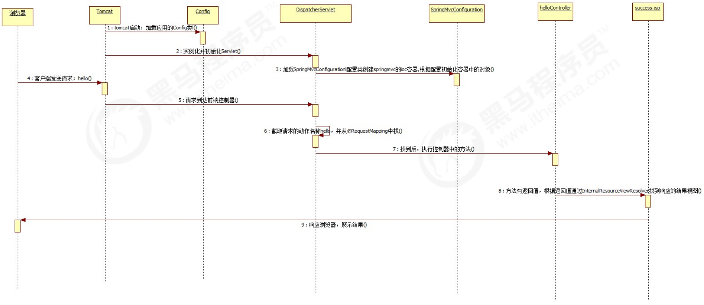

#### 2.3、官方流程图

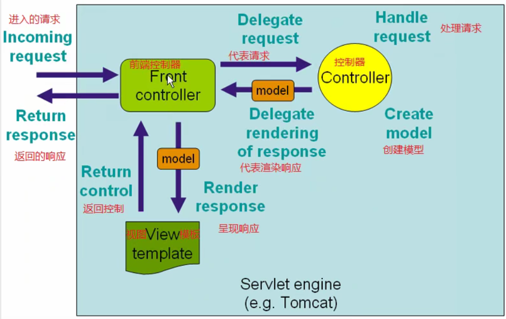

## 二、常用注解说明

### 1、基础注解

#### 1.1、@Controller

##### 1.1.1、源码

```java
/**
* 此注解用用于修饰表现层控制器的注解
*/
@Target({ElementType.TYPE})
@Retention(RetentionPolicy.RUNTIME)
@Documented
@Component
public @interface Controller {
    /**
    * 用于指定存入IOC容器是Bean的唯一标识
    */
    @AliasFor(annotation = Component.class)
    String value() default "";
}
```

##### 1.1.2、示例

```java
@Controller
public class HelloController {
}
```


#### 1.2、@RequesetMapping 

##### 1.2.1、源码

```java
/**
* 作用：
* 用于建立请求URL和处理请求方法之间的对应关系。
* 注意：
* 属性只要出现2个或以上时，他们的关系是与的关系。表示必须同时满足条件。
* 出现位置：
* 写在类上：
* 请求URL的第一级访问目录。此处不写的话，就相当于应用的根目录。
* 它出现的目的是为了使我们的URL可以按照模块化管理，使我们的URL更加精细:
* 例如：
* 账户模块：
* /account/add
* /account/update
* /account/delete
* ...
* 订单模块：
* /order/add
* /order/update
* /order/delete
* 方法上：
* 请求URL的第二级访问目录。
*/
@Target({ElementType.METHOD, ElementType.TYPE})
@Retention(RetentionPolicy.RUNTIME)
@Documented
@Mapping
public @interface RequestMapping {
    /**
    * name：给请求URL提供一个名称。
    */
    String name() default "";
    /**
    * value：用于指定请求的URL。它和path属性的作用是一样的。
    * 细节：
    * 在配置此属性时，写不写/都是可以的。
    */
    @AliasFor("path")
    String[] value() default {};
    /**
    * 它是4.2版本中加入的注解，和value属性是一样的。
    * @since 4.2
    */
    @AliasFor("value")
    String[] path() default {};
    /**
    * method：用于指定请求的方式。它支持以下这些类型:
    * GET, POST, HEAD, OPTIONS, PUT, PATCH, DELETE, TRACE.
    * 这些值是通过RequestMethod枚举指定的。
    */
    RequestMethod[] method() default {};
    /**
    * params：用于指定限制请求参数的条件。它支持简单的表达式。要求请求参数的key和value必须
    和配置的一模一样。
    * 例如：
    * params = {"accountName"}，表示请求参数必须有accountName
    * params = {"moeny!100"}，表示请求参数中money不能是100。
    */
    String[] params() default {};
    /**
    * headers：用于指定限制请求消息头的条件。
    * 例如：
    * RequestMapping(value = "/something", headers = "content-type=text/*")
    */
    String[] headers() default {};
    /**
    * consumes：用于指定可以接收的请求正文类型（MIME类型）
    * 例如：
    * consumes = "text/plain"
    * consumes = {"text/plain", "application/*"}
    */
    String[] consumes() default {};
    /**
    * produces：用于指定可以生成的响应正文类型。（MIME类型）
    * 例如:
    * produces = "text/plain"
    * produces = {"text/plain", "application/*"}
    * produces = MediaType.APPLICATION_JSON_UTF8_VALUE
    */
    String[] produces() default {};
}
```

##### 1.2.2、示例

```java
@Controller
@RequestMapping("springmvc")
public class RequestMappingController {
    /**
* 控制器方法
* @param name
* @return
*/
    @RequestMapping(value = "hello",method = RequestMethod.GET,name = "SpringMVC 的第一个请求")
    public String useRequestMapping(){
        return "success";
    }
}
```

##### 1.2.3、衍生注解@GetMapping@PostMapping@PutMapping@DeleteMapping

```java
@Target(ElementType.METHOD)
@Retention(RetentionPolicy.RUNTIME)
@Documented
@RequestMapping(method = RequestMethod.GET)
public @interface GetMapping {
//属性略
}
```

```java
@Target(ElementType.METHOD)
@Retention(RetentionPolicy.RUNTIME)
@Documented
@RequestMapping(method = RequestMethod.POST)
public @interface PostMapping {
//属性略
}
```

```java
@Target(ElementType.METHOD)
@Retention(RetentionPolicy.RUNTIME)
@Documented
@RequestMapping(method = RequestMethod.PUT)
public @interface PutMapping {
//属性略
}
```

```java
@Target(ElementType.METHOD)
@Retention(RetentionPolicy.RUNTIME)
@Documented
@RequestMapping(method = RequestMethod.DELETE)
public @interface DeleteMapping {
//属性略
}
```


#### 1.3、@RequestParam

##### 1.3.1、说明

```java
/**
* 此注解是从请求正文中获取请求参数，给控制器方法形参赋值的。
* 当请求参数的名称和控制器方法形参变量名称一致时，无须使用此注解。
* 同时，当没有获取到请求参数时，此注解还可以给控制器方法形参提供默认值。
* 注意：
* 它只能出现在方法的参数上
*/
@Target(ElementType.PARAMETER)
@Retention(RetentionPolicy.RUNTIME)
@Documented
public @interface RequestParam {
    /**
    * 用于指定获取请求参数的名称。它和name属性的作用是一样的，
    */
    @AliasFor("name")
    String value() default "";
    /**
    * 它是在4.2版本中加入的。和value属性互为引用。
    * @since 4.2
    */
    @AliasFor("value")
    String name() default "";
    /**
    * 指定参数是否必须有值。当为true时，参数没有值会报错。
    */
    boolean required() default true;
    /**
    * 在参数没有值时的默认值。
    */
    String defaultValue() default ValueConstants.DEFAULT_NONE;
}
```

##### 1.3.2、示例

```java
@Controller
public class RequestParamController {
    /**
    * 处理请求的控制器方法
    *
    * @return
    */
    @RequestMapping("useRequestParam")
    public String useRequestParam(@RequestParam(value = "username",required = false) String name, Integer age) {
        System.out.println("控制器方法执行了" + name + "," + age);
        return "success";
    }
}
```


#### 1.4、@InitBinder

##### 1.4.1、说明

```java
/**
* 用于初始化表单请求参数的数据绑定器。
*/
@Target({ElementType.METHOD})
@Retention(RetentionPolicy.RUNTIME)
@Documented
public @interface InitBinder {
    /**
    * 指定给哪些参数进行绑定操作。
    */
    String[] value() default {};
}
```

##### 1.4.2、示例

```java
/**
* 用户实体类
*/
public class User implements Serializable {
    private Integer id;
    private String username;
    private String password;
    private Integer age;
    private String gender;
    private Date birthday;
    public Integer getId() {
        return id;
    }
    public void setId(Integer id) {
        this.id = id;
    }
    public String getUsername() {
        return username;
    }
    public void setUsername(String username) {
        this.username = username;
    }
    public String getPassword() {
        return password;
    }
    public void setPassword(String password) {
        this.password = password;
    }
    public Integer getAge() {
        return age;
    }
    public void setAge(Integer age) {
        this.age = age;
    }
    public String getGender() {
    }
    public void setGender(String gender) {
        this.gender = gender;
    }
    public Date getBirthday() {
        return birthday;
    }
    public void setBirthday(Date birthday) {
        this.birthday = birthday;
    }
}
```

```jsp
<form action="${pageContext.request.contextPath}/saveUser" method="post">
    用户名：<input type="text" name="username"></br>
    密码：<input type="text" name="password"></br>
    年龄：<input type="text" name="age"></br>
    生日：<input type="text" name="birthday"></br>
    性别：<input type="radio" name="gender" value="男">男
    <input type="radio" name="gender" value="女">女</br>
    <input type="submit" value="提交">
</form>
```

```java
@Controller
public class InitBinderController {
    @RequestMapping("/saveUser")
    public String saveUser(User user){
        System.out.println("User is "+user);
        return "success";
    }
    @InitBinder("user")
    public void dateBinder(WebDataBinder dataBinder){
        dataBinder.addCustomFormatter(new DateFormatter("yyyy-MM-dd"));
    }
}
```

##### 1.4.3、扩展注解@DateTimeFormat

```java
/**
* 用户实体类
*/
public class User implements Serializable {
    private Integer id;
    private String username;
    private String password;
    private Integer age;
    private String gender;
    @DateTimeFormat(pattern = "yyyy-MM-dd")
    private Date birthday;
    //getters and setters
}
```


#### 1.5、@ControllerAdvice

##### 1.5.1、说明

```java
/**
* 用于给控制器提供一个增强的通知。
* 以保证可以在多个控制器之间实现增强共享。
* 它可以配合以下三个注解来用：
* {@link exceptionhandler@exceptionhandler}
* {@link initbinder@initbinder}
* {@link modeltattribute@modeltattribute}
*/
@Target(ElementType.TYPE)
@Retention(RetentionPolicy.RUNTIME)
@Documented
@Component
public @interface ControllerAdvice {
    /**
    * 用于指定对哪些包下的控制器进行增强
    */
    @AliasFor("basePackages")
    String[] value() default {};
    /**
    * 它是4.0版本新加入的属性，作用和value是一样的。
    * @since 4.0
    */
    @AliasFor("value")
    String[] basePackages() default {};
    /**
    * 它是4.0新加入的注解，可以通过指定类的字节码的方式来指定增强作用范围。
    * @since 4.0
    */
    Class<?>[] basePackageClasses() default {};
    /**
    * 它是4.0新加入的注解，用于指定特定的类型提供增强。
    * @since 4.0
    */
    Class<?>[] assignableTypes() default {};
    /**
    * 它是4.0新加入的注解，用于指定给特定注解提供增强。
    * @since 4.0
    */
    Class<? extends Annotation>[] annotations() default {};
}
```

##### 1.5.2、示例

```java
@ControllerAdvice(basePackageClasses=InitBinderController.class)
public class InitBinderAdvice {
    @InitBinder("user")
    public void dateBinder(WebDataBinder dataBinder){
        dataBinder.addCustomFormatter(new DateFormatter("yyyy-MM-dd"));
    }
}
```


#### 1.6、@RequestHeader

##### 1.6.1、说明

```java
/**
* 此注解是从请求消息头中获取消息头的值，并把值赋给控制器方法形参。
* 注意：
* 它只能出现在方法的参数上
*/
@Target(ElementType.PARAMETER)
@Retention(RetentionPolicy.RUNTIME)
@Documented
public @interface RequestHeader {
    /**
    * 用于指定请求消息头的名称。它和name属性作用一样。
    */
    @AliasFor("name")
    String value() default "";
    /**
    * 它是4.2版本引入的。和value属性互为引用。
    * @since 4.2
    */
    @AliasFor("value")
    String name() default "";
    /**
    * 用于指定是否必须有此消息头。当取默认值时，没有此消息头会报错。
    */
    boolean required() default true;
    /**
    * 用于指定消息头的默认值。
    */
    String defaultValue() default ValueConstants.DEFAULT_NONE;
}
```

1.6.3、示例 

```java
@Controller 
public class RequestHeaderController { 
    @RequestMapping("/useRequestHeader") 
    public String useRequestHeader(@RequestHeader(value="Accept-Language", required=false)String requestHeader){ 
        System.out.println(requestHeader); 
        return "success"; 
    } 
}
```


#### 1.7、@CookieValue 

##### 1.7.1、说明 

```java
/**
* 此注解是从请求消息头中获取Cookie的值，并把值赋给控制器方法形参。
* 注意：
* 它只能出现在方法的参数上
*/
@Target(ElementType.PARAMETER)
@Retention(RetentionPolicy.RUNTIME)
@Documented
public @interface CookieValue {
    /**
    * 用于指定cookie的名称
    */
    @AliasFor("name")
    String value() default "";
    /**
    * 它是4.2版本引入的。和value属性互为引用。
    * @since 4.2
    */
    @AliasFor("value")
    String name() default "";
    /**
    * 用于指定是否必须有此消息头。当取默认值时，没有此消息头会报错。
    */
    boolean required() default true;
    /**
    * 用于指定消息头的默认值。
    */
    String defaultValue() default ValueConstants.DEFAULT_NONE;
}
```

##### 1.7.2、示例

```java
@Controller
public class CookieValueController {
    @RequestMapping("/useCookieValue")
    public String
        useCookieValue(@CookieValue(value="JSESSIONID",required=false) String
                       cookieValue){
        System.out.println(cookieValue);
        return "success";
    }
}
```


#### 1.8、@ModelAttribute

##### 1.8.1、说明

```java
/**
* 它可以用于修饰方法，或者是参数。
* 当修饰方法时，表示执行控制器方法之前，被此注解修饰的方法都会执行。
* 当修饰参数时，用于获取指定的数据给参数赋值。。
*/
@Target({ElementType.PARAMETER, ElementType.METHOD})
@Retention(RetentionPolicy.RUNTIME)
@Documented
public @interface ModelAttribute {
    /**
    * 当注解写在方法上，则表示存入时的名称。（值是方法的返回值）
    * 当注解写在参数上，可以从ModelMap,Model,Map中的获取数据。（前提是之前存入过）
    * 指定的是存入时的key。
    */
    @AliasFor("name")
    String value() default "";
    /**
    * 它和value的作用是一样的。
    */
    @AliasFor("value")
    String name() default "";
    /**
    * 用于指定是否支持数据绑定。它是4.3版本中新加入的属性。
    * @since 4.3
    */
    boolean binding() default true;
}
```

##### 1.8.2、示例

```java
@Controller
public class ModelAttributeController {
    /**
    * 被ModelAttribute修饰的方法
    * @param username
    */
    @ModelAttribute
    public void showModel(String username) {
        System.out.println("执行了showModel方法"+username);
    }
    /**
    * 接收请求的方法
    * @param username
    * @return
    */
    @RequestMapping("/testModelAttribute")
    public String testModelAttribute(String username) {
        System.out.println("执行了控制器的方法"+username);
        return "success";
    }
}

```


#### 1.9、@SessionAttribute和@SessionAttributes

##### 1.9.1、说明

```java
/**
* 此注解是用于让开发者和ServletAPI进行解耦。
* 让开发者可以无需使用HttpSession的getAttribute方法即可从会话域中获取数据。
*/
@Target(ElementType.PARAMETER)
@Retention(RetentionPolicy.RUNTIME)
@Documented
public @interface SessionAttribute {
    /**
    * 用于指定在会话域中数据的名称。
    */
    @AliasFor("name")
    String value() default "";
    /**
    * 它和value属性互为引用
    */
    @AliasFor("value")
    String name() default "";
    /**
    * 用于指定是否必须从会话域中获取到数据。默认值是true，表示如果指定名称不存在会报错。
    */
    boolean required() default true;
}


/**
* 此注解是用于让开发者和ServletAPI进行解耦。
* 通过此注解即可实现把数据存入会话域，而无需在使用HttpSession的setAttribute方法。
* 当我们在控制器方法形参中加入Model或者ModelMap类型参数时，默认是存入请求域的。
* 但当控制器上使用了此注解，就会往会话域中添加数据。
*/
@Target({ElementType.TYPE})
@Retention(RetentionPolicy.RUNTIME)
@Inherited
@Documented
public @interface SessionAttributes {
    /**
    * 指定可以存入会话域中的名称。
    */
    @AliasFor("names")
    String[] value() default {};
    /**
    * 它是4.2版本中加入的属性。作用和value是一样的。
    * @since 4.2
    */
    @AliasFor("value")
    String[] names() default {};
    /**
    * 指定可以存入会话域中的数据类型。
    */
    Class<?>[] types() default {};
}
```

##### 1.9.2、示例

```java
@Controller
@SessionAttributes(value ={"username","password"},types={Integer.class})
public class SessionAttributesController {
    /**
    * 把数据存入SessionAttribute
    * @param model
    * @return
    * Model是spring提供的一个接口，该接口有一个实现类ExtendedModelMap
    * 该类继承了ModelMap，而ModelMap就是LinkedHashMap子类
    */
    @RequestMapping("/testPut")
    public String testPut(Model model){
        model.addAttribute("username", "泰斯特");
        model.addAttribute("password","123456");
        model.addAttribute("age", 31);
        //跳转之前将数据保存到username、password和age中，因为注解@SessionAttribute
        中有这几个参数
            return "success";
    }
    @RequestMapping("/testGet")
    public String testGet(ModelMap model){
        System.out.println(model.get("username")+";"+model.get("password")+";"+model.get("age"));
        return "success";
    }
    @RequestMapping("/testClean")
    public String complete(SessionStatus sessionStatus){
        sessionStatus.setComplete();
        return "success";
    }
    @RequestMapping("/testSessionAttribute")
    public String testSessionAttribute(@SessionAttribute("username")String username){
        System.out.println("username is "+username);
        return "success";
    }
}
```


#### 1.10、@ExceptionHandler

##### 1.10.1、说明

```java
/**
* 用于注释方法，表明当前方法是控制器执行产生异常后的处理方法
*/
@Target(ElementType.METHOD)
@Retention(RetentionPolicy.RUNTIME)
@Documented
public @interface ExceptionHandler {
    /**
    * 指定用于需要捕获的异常类型
    */
    Class<? extends Throwable>[] value() default {};
}
```

##### 1.10.2、示例

```java
@Controller
public class ExceptionHandlerController {
    @RequestMapping("/useExceptionHandler")
    public String useExceptionHandler(){
        System.out.println("控制器方法执行了");
        int i=1/0;
        return "success";
    }
    @ExceptionHandler(Exception.class)
    public String handleException(Exception e){
        System.err.println(e.getMessage());
        return "error";
    }
}
```


### 2、JSON数据交互相关注解

#### 2.1、@RequestBody

##### 2.1.1、说明

```java
/**
* 用于获取全部的请求体
*/
@Target(ElementType.PARAMETER)
@Retention(RetentionPolicy.RUNTIME)
@Documented
public @interface RequestBody {
    /**
    * 用于指定是否必须有请求体。
    */
    boolean required() default true;
}
```

##### 2.1.2、示例

```java
@Controller
public class RequestBodyController {
    /**
    * RequestBody注解
    * @return
    */
    @RequestMapping("/useRequestBody")
    public String useRequestBody(@RequestBody(required=false) String body){
        System.out.println(body);
        return "success";
    }
}
```


#### 2.2、@ResponseBody

##### 2.2.1、说明 

```java
/**
* 用于用流输出响应正文
*/
@Target({ElementType.TYPE, ElementType.METHOD})
@Retention(RetentionPolicy.RUNTIME)
@Documented
public @interface ResponseBody {
}
```

##### 2.2.2、示例

```java
@Controller
public class ResponseBodyController {
    /**
    * 控制器方法
    * @param name
    * @return
    */
    @RequestMapping("useResponseBody")
    public @ResponseBody String useResponseBody(String name){
        return "success";
    }
}
```


#### 2.3、@RestController

##### 2.3.1、说明

```java
/**
* 它具备@Controller注解的全部功能，同时多了一个@ResponseBody注解的功能
*/
@Target(ElementType.TYPE)
@Retention(RetentionPolicy.RUNTIME)
@Documented
@Controller
@ResponseBody
public @interface RestController {
    /**
    * 用于指定存入ioc容器时bean的唯一标识。
    * @since 4.0.1
    */
    @AliasFor(annotation = Controller.class)
    String value() default "";
}
```

##### 2.3.2、示例

```java
@RestController
public class RestHelloController {
    /**
    * 控制器方法
    * @return
    */
    @RequestMapping("resthello")
    public String sayHello(){
        return "success";
    }
}
```


#### 2.4、@RestControllerAdvice

##### 2.4.1、说明

```java
/**
* 它和@ControllerAdvice注解的作用一样，并且支持@ResponseBody的功能
*/
@Target(ElementType.TYPE)
@Retention(RetentionPolicy.RUNTIME)
@Documented
@ControllerAdvice
@ResponseBody
public @interface RestControllerAdvice {
    @AliasFor("basePackages")
    String[] value() default {};
    @AliasFor("value")
    String[] basePackages() default {};
    Class<?>[] basePackageClasses() default {};
    Class<?>[] assignableTypes() default {};
    Class<? extends Annotation>[] annotations() default {};
}
```

##### 2.4.2、示例

```java
@RestControllerAdvice
public class ExceptionHandlerAdvice {
    @ExceptionHandler(Exception.class)
    public String handleException(Exception e){
        System.err.println(e.getMessage());
    }
}
```


### 3、Rest风格URL请求相关注解

#### 3.1、@PathVariable

##### 3.1.1、说明

```java
/**
* 它是springmvc框架支持rest风格url的标识。
* 它可以用于获取请求url映射中占位符对应的值。
*/
@Target(ElementType.PARAMETER)
@Retention(RetentionPolicy.RUNTIME)
@Documented
public @interface PathVariable {
    /**
    * 指定url映射中占位符的名称
    */
    @AliasFor("name")
    String value() default "";
    /**
    * 它是4.3.3版本新加入的属性。作用和value是一样的。
    * @since 4.3.3
    */
    @AliasFor("value")
    String name() default "";
    /**
    * 它是4.3.3版本新加入的属性，用于指定是否必须有此占位符。当取默认值时，没有会报错。
    * @since 4.3.3
    */
    boolean required() default true;
}
```

##### 3.1.2、示例

```java
@Controller
public class PathVariableController {
    /**
    * PathVariable注解
    * @return
    */
    @RequestMapping("/usePathVariable/{id}")
    public String usePathVariable(@PathVariable("id") Integer id){
        System.out.println(id);
    }
}
```


### 4、跨域访问

#### 4.1、关于跨域访问

```tex
	跨域访问即跨站 HTTP 请求(Cross-site HTTP request)，它是指发起请求的资源所在域不同于该请求所指向资源所在的域的 HTTP 请求。
	比如说，域名A(http://www.itheima.example)的某 Web 应用程序中通过标签引入了域名B(http://www.itheima.foo)站点的某图片资源(http://www.itheima.foo/image.jpg)，域名A的那 Web 应用就会导致浏览器发起一个跨站 HTTP 请求。在当今的 Web 开发中，使用跨站 HTTP请求加载各类资源（包括CSS、图片、JavaScript 脚本以及其它类资源），已经成为了一种普遍且流行的方式。
```


#### 4.2、@CrossOrigin

##### 4.2.1、说明

```java
/**
* 此注解用于指定是否支持跨域访问
*/
@Target({ ElementType.METHOD, ElementType.TYPE })
@Retention(RetentionPolicy.RUNTIME)
@Documented
public @interface CrossOrigin {
    /** @deprecated as of Spring 5.0, in favor of {@link
CorsConfiguration#applyPermitDefaultValues} */
    @Deprecated
    String[] DEFAULT_ORIGINS = { "*" };
    /** @deprecated as of Spring 5.0, in favor of {@link
CorsConfiguration#applyPermitDefaultValues} */
    @Deprecated
    String[] DEFAULT_ALLOWED_HEADERS = { "*" };
    /** @deprecated as of Spring 5.0, in favor of {@link
CorsConfiguration#applyPermitDefaultValues} */
    @Deprecated
    boolean DEFAULT_ALLOW_CREDENTIALS = false;
    /** @deprecated as of Spring 5.0, in favor of {@link
CorsConfiguration#applyPermitDefaultValues} */
    @Deprecated
    long DEFAULT_MAX_AGE = 1800;
    /**
    * 它和origins属性一样
    */
    @AliasFor("origins")
    String[] value() default {};
    /**
    * 所有支持域的集合，例如"http://domain1.com"。
    * <p>这些值都显示在请求头中的Access-Control-Allow-Origin
    * "*"代表所有域的请求都支持
    * <p>如果没有定义，所有请求的域都支持
    * @see #value
    */
    @AliasFor("value")
    String[] origins() default {};
    /**
    * 允许请求头中的header，默认都支持
    */
    String[] allowedHeaders() default {};
    /**
    * 响应头中允许访问的header，默认为空
    */
    String[] exposedHeaders() default {};
    /**
    * 用于指定支持的HTTP请求方式列表
    */
    RequestMethod[] methods() default {};
    /**
    * 是否允许cookie随请求发送，使用时必须指定具体的域
    */
    String allowCredentials() default "";
    /**
    * 预请求的结果的有效期
    * 默认值是：1800秒 (30分钟).
    */
    long maxAge() default -1;
}
```

##### 4.2.2、示例

```java
@RestController
@CrossOrigin
public class CrossOriginController {
    @RequestMapping("/useCrossOrigin")
    public String useCrossOrigin()throws Exception{
        System.out.println("支持跨域访问");
        return "success";
    }
}
```


## 三、SpringMVC中各组件详解及源码分析

### 1、前端控制器：DispatcherServlet 

#### 1.1、作用

```tex
	用户请求到达前端控制器，它就相当于mvc模式中的c，dispatcherServlet是整个流程控制的中心，由它调用其它组件处理用户的请求，dispatcherServlet的存在降低了组件之间的耦合性。
```


#### 1.2、执行过程分析

##### 1.2.1、doService方法

```java
/**
* 接收到请求首先执行的方法，它就相当于Servlet中的service方法
*/
@Override
protected void doService(HttpServletRequest request, HttpServletResponse response) throws Exception {
    logRequest(request);
    // Keep a snapshot of the request attributes in case of an include,
    // to be able to restore the original attributes after the include.
    Map<String, Object> attributesSnapshot = null;
    if (WebUtils.isIncludeRequest(request)) {
        attributesSnapshot = new HashMap<>();
        Enumeration<?> attrNames = request.getAttributeNames();
        while (attrNames.hasMoreElements()) {
            String attrName = (String) attrNames.nextElement();
            if (this.cleanupAfterInclude ||
                attrName.startsWith(DEFAULT_STRATEGIES_PREFIX)) {
                attributesSnapshot.put(attrName, request.getAttribute(attrName));
            }
        }
    }
    // Make framework objects available to handlers and view objects.
    request.setAttribute(WEB_APPLICATION_CONTEXT_ATTRIBUTE, getWebApplicationContext());
    request.setAttribute(LOCALE_RESOLVER_ATTRIBUTE, this.localeResolver);
    request.setAttribute(THEME_RESOLVER_ATTRIBUTE, this.themeResolver);
    request.setAttribute(THEME_SOURCE_ATTRIBUTE, getThemeSource());
    if (this.flashMapManager != null) {
        FlashMap inputFlashMap =
            this.flashMapManager.retrieveAndUpdate(request, response);
        if (inputFlashMap != null) {
            request.setAttribute(INPUT_FLASH_MAP_ATTRIBUTE, Collections.unmodifiableMap(inputFlashMap));
        }
        request.setAttribute(OUTPUT_FLASH_MAP_ATTRIBUTE, new FlashMap());
        request.setAttribute(FLASH_MAP_MANAGER_ATTRIBUTE, this.flashMapManager);
    }
    try {
        doDispatch(request, response);
    }
    finally {
        if
            (!WebAsyncUtils.getAsyncManager(request).isConcurrentHandlingStarted()) {
            // Restore the original attribute snapshot, in case of an include.
            if (attributesSnapshot != null) {
                restoreAttributesAfterInclude(request, attributesSnapshot);
            }
        }
    }
}
```

##### 1.2.2、doDispatche方法

```java
/**
* 处理请求分发的核心方法
* 它负责通过反射调用我们的控制器方法
* 负责执行拦截器
* 负责处理结果视图
*/
protected void doDispatch(HttpServletRequest request, HttpServletResponse response) throws Exception {
    HttpServletRequest processedRequest = request;
    HandlerExecutionChain mappedHandler = null;
    boolean multipartRequestParsed = false;
    WebAsyncManager asyncManager = WebAsyncUtils.getAsyncManager(request);
    try {
        ModelAndView mv = null;
        Exception dispatchException = null;
        try {
            processedRequest = checkMultipart(request);
            multipartRequestParsed = (processedRequest != request);
            // Determine handler for the current request.
            mappedHandler = getHandler(processedRequest);
            if (mappedHandler == null) {
                noHandlerFound(processedRequest, response);
                return;
            }
            // Determine handler adapter for the current request.
            HandlerAdapter ha = getHandlerAdapter(mappedHandler.getHandler());
            // Process last-modified header, if supported by the handler.
            String method = request.getMethod();
            boolean isGet = "GET".equals(method);
            if (isGet || "HEAD".equals(method)) {
                long lastModified = ha.getLastModified(request, mappedHandler.getHandler());
                if (new ServletWebRequest(request, response).checkNotModified(lastModified) && isGet) {
                    return;
                }
            }
            if (!mappedHandler.applyPreHandle(processedRequest, response)) {
                return;
            }
            // Actually invoke the handler.
            mv = ha.handle(processedRequest, response, mappedHandler.getHandler());
            if (asyncManager.isConcurrentHandlingStarted()) {
                return;
            }
            applyDefaultViewName(processedRequest, mv);
            mappedHandler.applyPostHandle(processedRequest, response, mv);
        }
        catch (Exception ex) {
            dispatchException = ex;
        }
        catch (Throwable err) {
            // As of 4.3, we're processing Errors thrown from handler
            methods as well,
            // making them available for @ExceptionHandler methods and other scenarios.
            dispatchException = new NestedServletException("Handler  dispatch failed", err);
        }
        processDispatchResult(processedRequest, response, mappedHandler, mv, dispatchException);
    }
    catch (Exception ex) {
        triggerAfterCompletion(processedRequest, response, mappedHandler, ex);
    }
    catch (Throwable err) {
        triggerAfterCompletion(processedRequest, response, mappedHandler,
                               new NestedServletException("Handler processing failed", err));
    }
    finally {
        if (asyncManager.isConcurrentHandlingStarted()) {
            // Instead of postHandle and afterCompletion
            if (mappedHandler != null) {
                mappedHandler.applyAfterConcurrentHandlingStarted(processedRequest, response);
            }
        }
        else {
            // Clean up any resources used by a multipart request.
            if (multipartRequestParsed) {
                cleanupMultipart(processedRequest);
            }
        }
    }
}
```


### 2、处理器映射器HandlerMapping 

#### 2.1、作用

```te
	HandlerMapping负责根据用户请求找到Handler即处理器，SpringMVC提供了不同的映射器实现不同的映射方式，例如：配置文件方式，实现接口方式，注解方式等。
```

#### 2.2、RequestMappingHandlerMapping的执行时机

```java
/**
* DispatcherServlet中的初始化方法
*/
protected void initStrategies(ApplicationContext context) {
    initMultipartResolver(context);
    initLocaleResolver(context);
    initThemeResolver(context);
    initHandlerMappings(context);
    initHandlerAdapters(context);
    initHandlerExceptionResolvers(context);
    initRequestToViewNameTranslator(context);
    initViewResolvers(context);
    initFlashMapManager(context);
}
```

```java
/**
* 初始化处理器映射器方法
*/
private void initHandlerMappings(ApplicationContext context) {
    this.handlerMappings = null;
    if (this.detectAllHandlerMappings) {
        // Find all HandlerMappings in the ApplicationContext, including ancestor contexts.
        Map<String, HandlerMapping> matchingBeans = BeanFactoryUtils.beansOfTypeIncludingAncestors(context, HandlerMapping.class, true, false);
        if (!matchingBeans.isEmpty()) {
            this.handlerMappings = new ArrayList<>(matchingBeans.values());
            // We keep HandlerMappings in sorted order.
            AnnotationAwareOrderComparator.sort(this.handlerMappings);
        }
    }
    else {
        try {
            HandlerMapping hm = context.getBean(HANDLER_MAPPING_BEAN_NAME, HandlerMapping.class);
            this.handlerMappings = Collections.singletonList(hm);
        }
        catch (NoSuchBeanDefinitionException ex) {
            // Ignore, we'll add a default HandlerMapping later.
        }
    }
    // Ensure we have at least one HandlerMapping, by registering
    // a default HandlerMapping if no other mappings are found.
    if (this.handlerMappings == null) {
        this.handlerMappings = getDefaultStrategies(context, HandlerMapping.class);
        if (logger.isTraceEnabled()) {
            logger.trace("No HandlerMappings declared for servlet '" +
                         getServletName() +
                         "': using default strategies from DispatcherServlet.properties");
        }
    }
}
```


### 3、处理器适配器HandlerAdapter

#### 3.1、适配器模式

```tex
	适配器模式就是把一个类的接口变换成客户端所期待的另一种接口，从而使原本因接口原因不匹配而无法一起工作的两个类能够一起工作。适配类可以根据参数返还一个合适的实例给客户端。
	通过HandlerAdapter对处理器进行执行，这是适配器模式的应用，通过扩展适配器可以对更多类型的处理器进行执行。
```

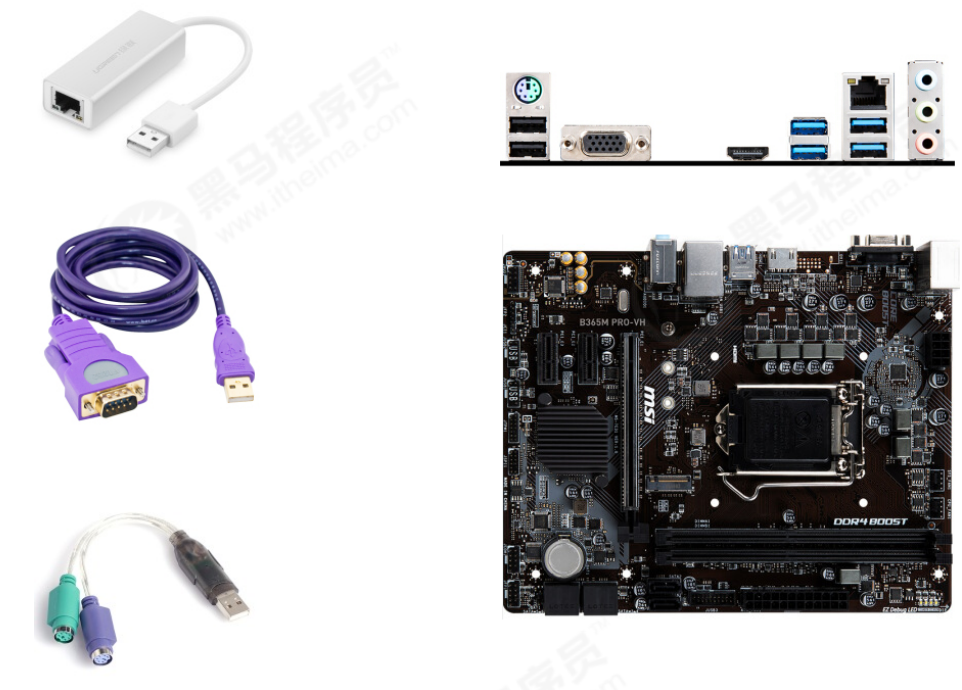

#### 3.2、控制器的三种编写方式

##### 3.2.1、Controller注解

```java
/**
* 用于注释控制器类
*/
@Target({ElementType.TYPE})
@Retention(RetentionPolicy.RUNTIME)
@Documented
@Component
public @interface Controller {
    //指定存入ioc容器中bean的唯一标识
    @AliasFor(annotation = Component.class)
    String value() default "";
}
```

##### 3.3.2、Controller接口

```java
@FunctionalInterface
public interface Controller {
    /**
    * 用于处理请求并返回ModelAndView
    */
    @Nullable
    ModelAndView handleRequest(HttpServletRequest request, HttpServletResponse response) throws Exception;
}

```

##### 3.3.3、HttpRequestHandler接口

```java
@FunctionalInterface
public interface HttpRequestHandler {
    /**
    * 用于处理器请求，并由使用者提供相应
    */
    void handleRequest(HttpServletRequest request, HttpServletResponse response)
        throws ServletException, IOException;
}
```


### 4、视图解析器ViewResovler和View

#### 4.1、View

```te
	首先，我们得先了解一下SpringMVC中的视图。视图的作用是渲染模型数据，将模型里的数据以某种形式呈现给客户。 为了实现视图模型和具体实现技术的解耦，Spring在org.springframework.web.servlet包中定义了一个高度抽象的View接口。我们的视图是无状态的，所以他们不会有线程安全的问题。无状态是指对于每一个请求，都会创建一个View对象。
	在SpringMVC中常用的视图类型：
```

| 分类       | 视图类型                | 说明                                                         |
| ---------- | ----------------------- | ------------------------------------------------------------ |
| URL 视图   | InternalResourceView    | 将JSP或者其他资源封装成一个视图，是InternaleResourceViewResolver默认使用的视图类型。 |
|            | JstlView                | 它是当我们在页面中使用了JSTL标签库的国际化标签后，需要采用的类型。p |
| 文档类视图 | AbstractPdfViewc        | AbstractPdfViewc                                             |
|            | AbstarctXlsViewc        | Excel文档视图的抽象类，该类是4.2版本之后才有的。 <br/>之前使用的是AbstractExcelView。 |
| JSON视图   | MappingJackson2JsonView | 将模型数据封装成Json格式数据输出。它需要借助 Jackson开源框架. |
| XML视图    | MappingJackson2XmlView  | 将模型数据封装成XML格式数据。它是从4.1版本之后 才加入的。    |


#### 4.2、ViewResolver

```tex
	View Resolver负责将处理结果生成View视图，View Resolver首先根据逻辑视图名解析成物理视图名即具体的页面地址，再生成View视图对象，最后对View进行渲染将处理结果通过页面展示给用户。视图对象是由视图解析器负责实例化。
	视图解析器的作用是将逻辑视图转为物理视图，所有的视图解析器都必须实现ViewResolver接口。
	SpringMVC为逻辑视图名的解析提供了不同的策略，可以在Spring WEB上下文中配置一种或多种解析策略，并指定他们之间的先后顺序。每一种映射策略对应一个具体的视图解析器实现类。程序员可以选择一种视图解析器或混用多种视图解析器。可以通过order属性指定解析器的优先顺序，order越小优先级越高，SpringMVC会按视图解析器顺序的优先顺序对逻辑视图名进行解析，直到解析成功并返回视图对象，否则抛出ServletException异常。
```

| 分类               | 解析器类型                   | 说明                                                         |
| ------------------ | ---------------------------- | ------------------------------------------------------------ |
| 解析为 Bean的 名称 | BeanNameViewResolver         | BeanNameViewResolver                                         |
| 解析为 URL文件     | InternalResourceViewResolver | 将视图名解析成一个URL文件，一般就是一个 jsp或者html文件。文件一般都存放在WEBINF目录中。 |
| 解析指定 XML文件   | XmlViewResolver              | 解析指定位置的XML文件，默认在/WEBINF/views.xml               |
| 解析指定 属性文件  | ResourceBundleViewResolver   | 解析properties文件。                                         |


### 5、请求参数封装的源码分析

#### 5.1、传统表单数据封装原理

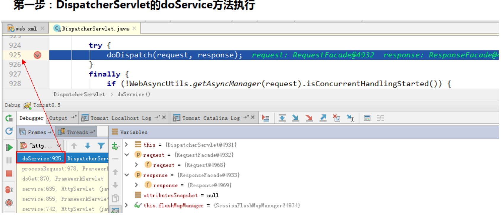

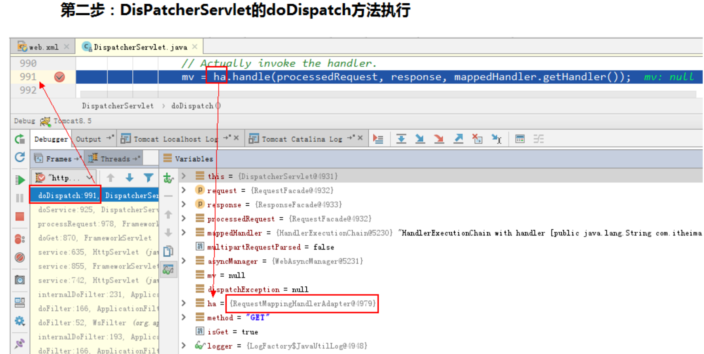

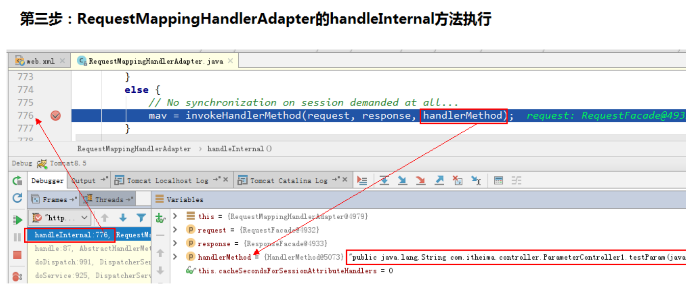

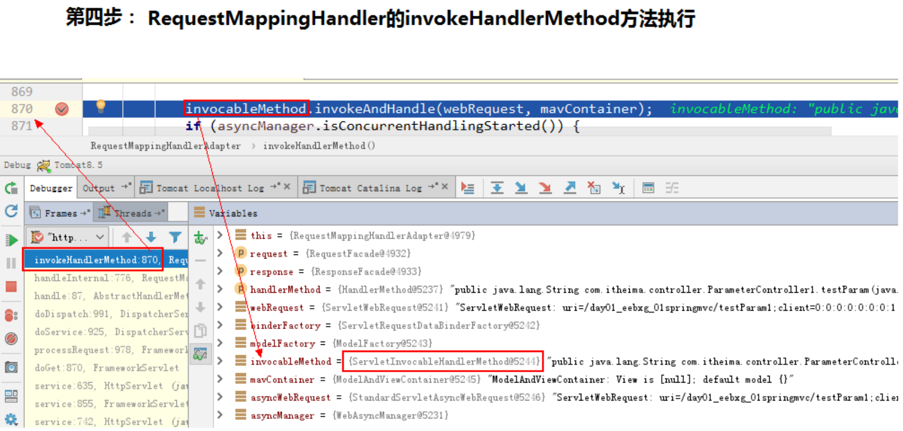

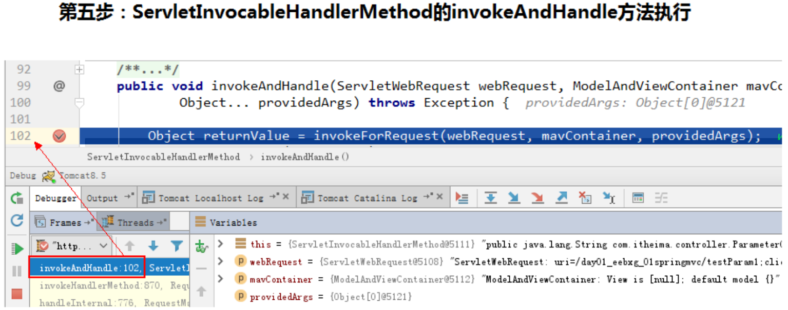

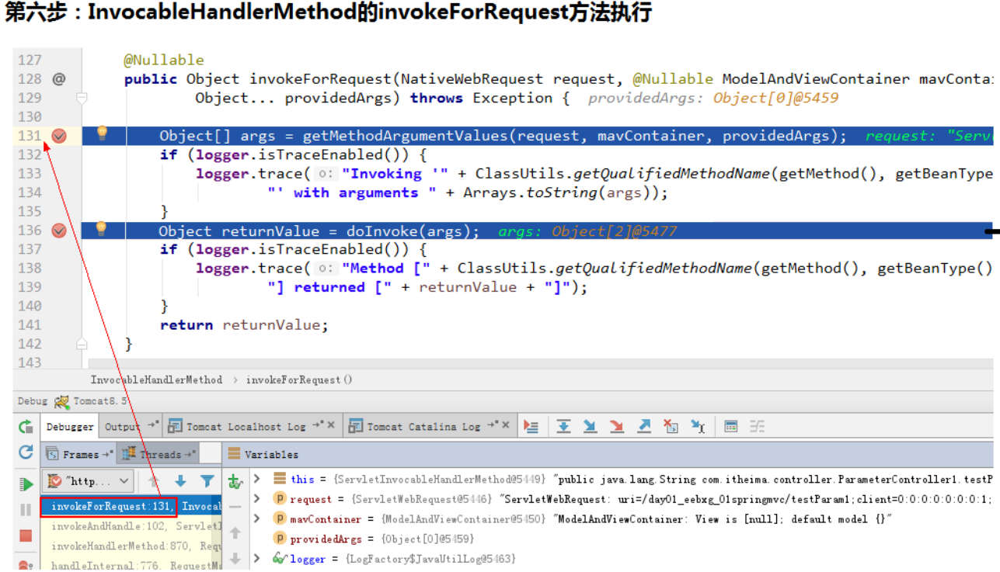

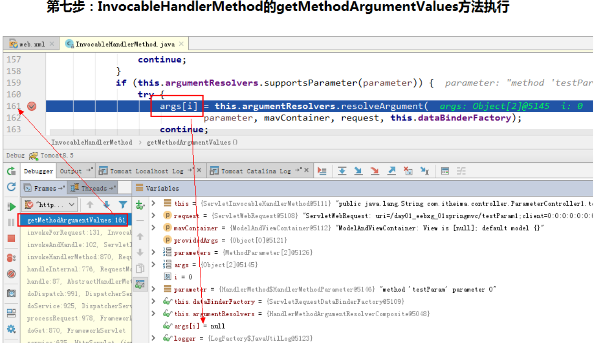

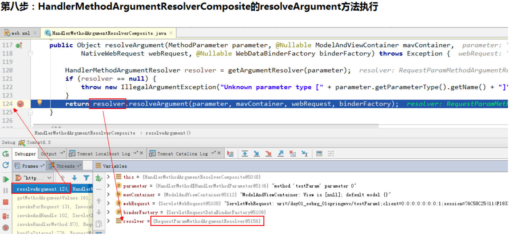

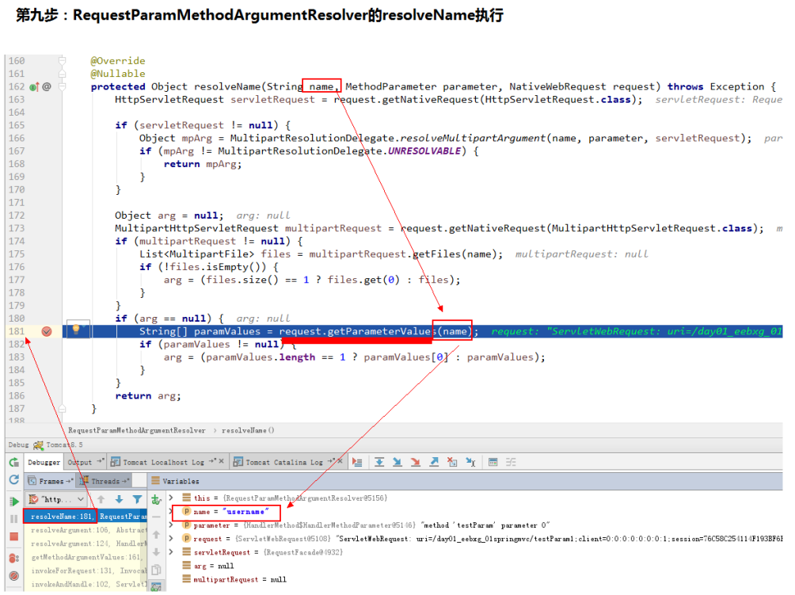

#### 5.2、@RequestBody注解执行原理

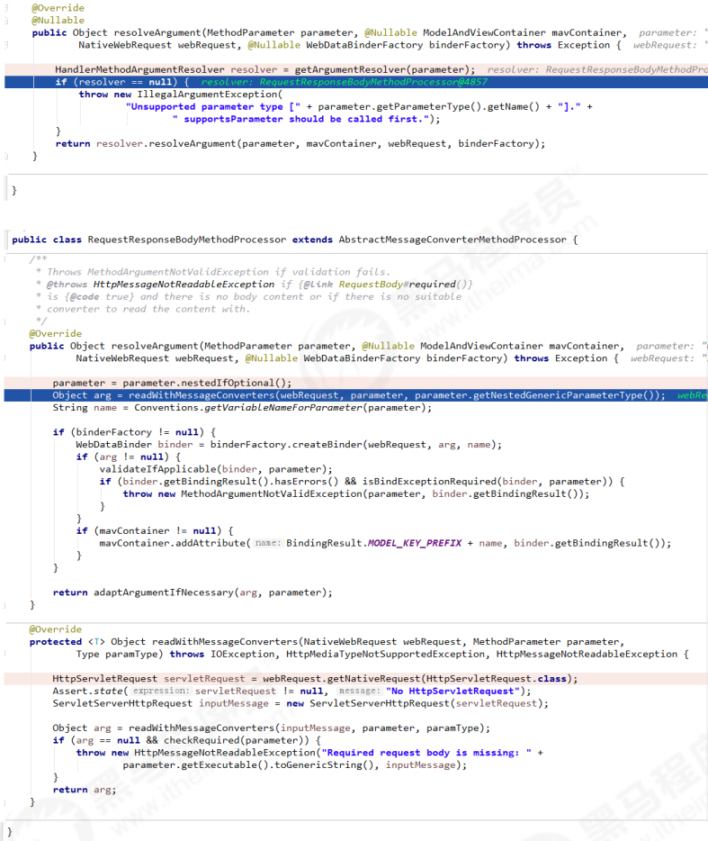

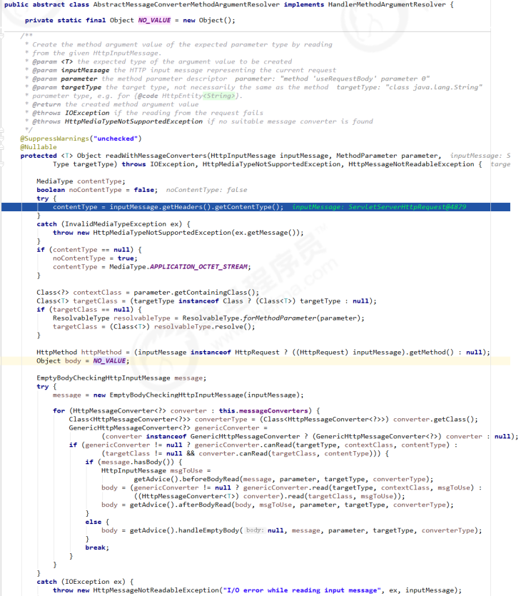

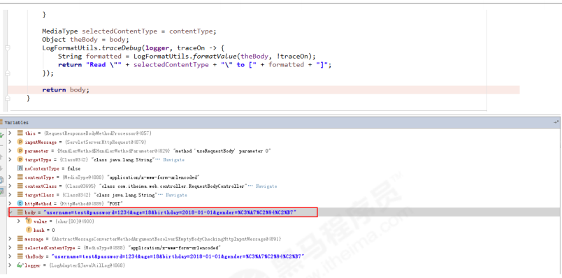

#### 5.3、@PathVariable注解实现原理

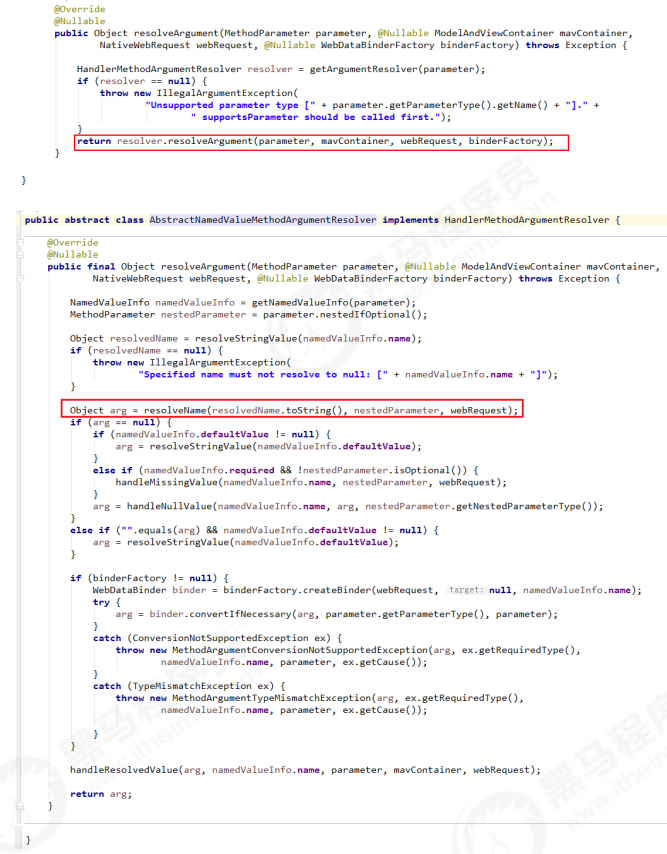

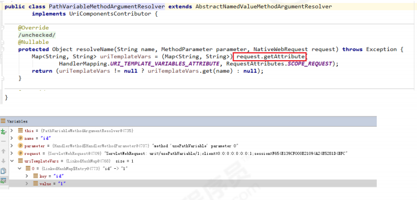

### 6、拦截器的执行时机和调用过程

#### 6.1、执行流程图

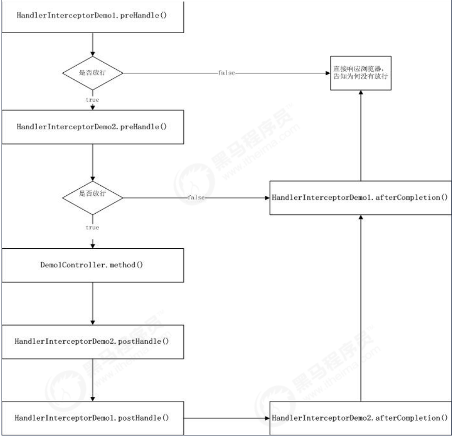

#### 6.2、拦截器的执行过程分析

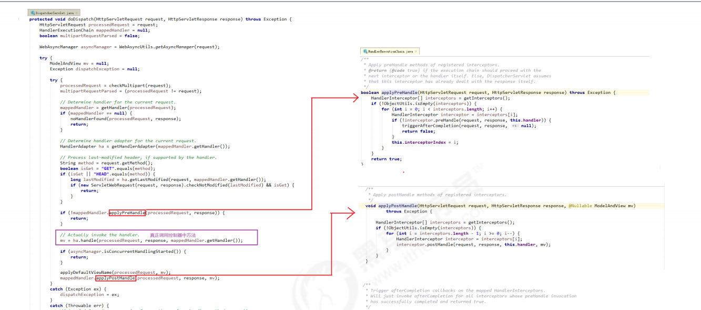

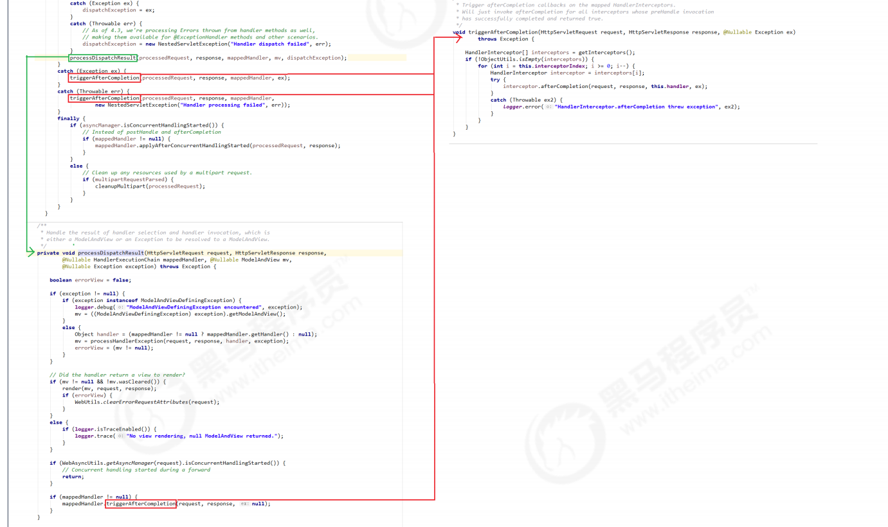

6.3、拦截器的责任链模式

```tex
	责任链模式是一种常见的行为模式。它是使多个对象都有处理请求的机会，从而避免了请求的发送者和接收者之间的耦合关系。将这些对象串成一条链，并沿着这条链一直传递该请求，直到有对象处理它为止。
	优势：
		解耦了请求与处理；
		请求处理者（节点对象）只需关注自己感兴趣的请求进行处理即可，对于不感兴趣的请求，直接转发给下一级节点对象；
		具备链式传递处理请求功能，请求发送者无需知晓链路结构，只需等待请求处理结果；
		链路结构灵活，可以通过改变链路结构动态地新增或删减责任；
		易于扩展新的请求处理类（节点），符合 开闭原则；
	弊端：
		责任链路过长时，可能对请求传递处理效率有影响；
		如果节点对象存在循环引用时，会造成死循环，导致系统崩溃；
```


### 7、类型转换器和异常处理器

#### 7.1、类型转换器

##### 7.1.1、Converter接口

```java
@FunctionalInterface
public interface Converter<S, T> {
    /**
    * 提供类型转换的逻辑
    */
    @Nullable
    T convert(S source);
}
```

##### 7.1.2、自定义Converter

```java
public class StringToDateConverter implements Converter<String,Date>{
    private String pattern;
    public void setPattern(String pattern) {
        this.pattern = pattern;
    }
    private DateFormat format;
    @Override
    public Date convert(String source) {
        try{
            //1.实例化format对象
            if(StringUtils.isEmpty(pattern)){
                pattern = "yyyy-MM-dd";
            }
            format = new SimpleDateFormat(pattern);
            //2.转换字符串
            return format.parse(source);
        }catch (Exception e){
            throw new IllegalArgumentException("给定的日期格式不对！");
        }
    }
}
```

##### 7.1.3、注册类型转换器

```java
/**
* 控制器的通知
*/
@ControllerAdvice
public class InitBinderAdvice {
    @Autowired
    private Converter stringToDateConverter;
    /**
    * 初始化数据绑定器
    * @param dataBinder
    */
    @InitBinder
    public void initBinder(WebDataBinder dataBinder){
        ConversionService conversionService = dataBinder.getConversionService();
        if(conversionService instanceof GenericConversionService){
            GenericConversionService genericConversionService = (GenericConversionService)conversionService;
            genericConversionService.addConverter(stringToDateConverter);
        }
    }
}

```


#### 7.2、异常处理器

##### 7.2.1、HandlerExceptionResovler

```java
/**
* 异常处理器的根接口
*/
public interface HandlerExceptionResolver {
    /**
    * 用于提供异常处理的逻辑
    */
    @Nullable
    ModelAndView resolveException(
        HttpServletRequest request, HttpServletResponse response, @Nullable Object handler, Exception ex);
}
```

##### 7.2.2、自定义异常处理器

```java
@Component
public class CustomeExceptionHandlerResovler implements HandlerExceptionResolver {
    /**
    * 此方法是处理异常的。异常就分为系统异常和业务异常
    * @param request 请求
    * @param response 响应
    * @param handler 当前控制器对象
    * @param ex 异常对象
    * @return
    */
    @Override
    public ModelAndView resolveException(HttpServletRequest request, HttpServletResponse response, Object handler, Exception ex) {
        //1.创建返回值
        ModelAndView mv = new ModelAndView();
        //2.判断当前的ex是系统异常还是业务异常
        CustomeException ce = null;
        if(ex instanceof CustomeException){
            //业务异常
            ce = (CustomeException)ex;
            //设置错误信息
            mv.addObject("errorMsg",ce.getMessage());
        }else{
            //系统异常
            //设置错误信息
            mv.addObject("errorMsg","服务器忙！"+ex.getMessage());
            //只输出系统异到控制台
            ex.printStackTrace();
        }
        //3.设置响应视图
        mv.setViewName("error");
        return mv;
    }
}
```


### 8、SpringMVC中的文件上传

#### 8.1、MultipartFile

##### 8.1.1、源码

```java
/**
* SpringMVC中对上传文件的封装。
*/
public interface MultipartFile extends InputStreamSource {
    /**
    * 获取临时文件名称
    */
    String getName();
    /**
    * 获取真实（原始）文件名称
    */
    @Nullable
    String getOriginalFilename();
    /**
    * 获取上传文件的MIME类型
    */
    @Nullable
    String getContentType();
    /**
    * 是否是空文件
    */
    boolean isEmpty();
    /**
    * 获取上传文件的字节大小
    */
    long getSize();
    /**
    * 获取上传文件的字节数组
    */
    byte[] getBytes() throws IOException;
    /**
    * 获取上传文件的字节输入流
    */
    @Override
    InputStream getInputStream() throws IOException;
    /**
    * 把上传文件转换成一个Resource对象
    */
    default Resource getResource() {
        return new MultipartFileResource(this);
    }
    /**
    * 把临时文件移动到指定位置并重命名，参数是一个文件对象
    */
    void transferTo(File dest) throws IOException, IllegalStateException;
    /**
    * 把临时文件移动到指定位置并重命名，参数是一个文件路径
    */
    default void transferTo(Path dest) throws IOException, IllegalStateException
    {
        FileCopyUtils.copy(getInputStream(), Files.newOutputStream(dest));
    }
}
```

##### 8.1.2、commons-fileupload的实现

```java
package org.springframework.web.multipart.commons;
import java.io.File;
import java.io.IOException;
import java.io.InputStream;
import java.io.Serializable;
import java.nio.file.Files;
import java.nio.file.Path;
import org.apache.commons.fileupload.FileItem;
import org.apache.commons.fileupload.FileUploadException;
import org.apache.commons.fileupload.disk.DiskFileItem;
import org.apache.commons.logging.Log;
import org.apache.commons.logging.LogFactory;
import org.springframework.core.log.LogFormatUtils;
import org.springframework.util.FileCopyUtils;
import org.springframework.util.StreamUtils;
import org.springframework.web.multipart.MultipartFile;
/**
* 通过导包就看出了，它是借助apache的commons-fileupload实现的文件上传。
* 只是无须我们自己定义DiskFileItemFactory,DiskFileItemFactory,ServletFileUpload对象
*/
@SuppressWarnings("serial")
public class CommonsMultipartFile implements MultipartFile, Serializable {
    protected static final Log logger =
        LogFactory.getLog(CommonsMultipartFile.class);
    private final FileItem fileItem;
    private final long size;
    private boolean preserveFilename = false;
    /**
    * Create an instance wrapping the given FileItem.
    * @param fileItem the FileItem to wrap
    */
    public CommonsMultipartFile(FileItem fileItem) {
        this.fileItem = fileItem;
        this.size = this.fileItem.getSize();
    }
    /**
    * Return the underlying {@code org.apache.commons.fileupload.FileItem}
    * instance. There is hardly any need to access this.
    */
    public final FileItem getFileItem() {
        return this.fileItem;
    }
    /**
    * Set whether to preserve the filename as sent by the client, not stripping off
    * path information in {@link CommonsMultipartFile#getOriginalFilename()}.
    * <p>Default is "false", stripping off path information that may prefix the
    * actual filename e.g. from Opera. Switch this to "true" for preserving the
    * client-specified filename as-is, including potential path separators.
    * @since 4.3.5
    * @see #getOriginalFilename()
    * @see CommonsMultipartResolver#setPreserveFilename(boolean)
    */
    public void setPreserveFilename(boolean preserveFilename) {
        this.preserveFilename = preserveFilename;
    }
    @Override
    public String getName() {
        return this.fileItem.getFieldName();
    }
    @Override
    public String getOriginalFilename() {
        String filename = this.fileItem.getName();
        if (filename == null) {
            // Should never happen.
            return "";
        }
        if (this.preserveFilename) {
            // Do not try to strip off a path...
            return filename;
        }
        // Check for Unix-style path
        int unixSep = filename.lastIndexOf('/');
        // Check for Windows-style path
        int winSep = filename.lastIndexOf('\\');
        // Cut off at latest possible point
        int pos = (winSep > unixSep ? winSep : unixSep);
        if (pos != -1) {
            // Any sort of path separator found...
            return filename.substring(pos + 1);
        }
        else {
            // A plain name
            return filename;
        }
    }
    @Override
    public String getContentType() {
        return this.fileItem.getContentType();
    }
    @Override
    public boolean isEmpty() {
        return (this.size == 0);
    }
    @Override
    public long getSize() {
        return this.size;
    }
    @Override
    public byte[] getBytes() {
        if (!isAvailable()) {
            throw new IllegalStateException("File has been moved - cannot be read again");
        }
        byte[] bytes = this.fileItem.get();
        return (bytes != null ? bytes : new byte[0]);
    }
    @Override
    public InputStream getInputStream() throws IOException {
        if (!isAvailable()) {
            throw new IllegalStateException("File has been moved - cannot be read again");
        }
        InputStream inputStream = this.fileItem.getInputStream();
        return (inputStream != null ? inputStream : StreamUtils.emptyInput());
    }
    @Override
    public void transferTo(File dest) throws IOException, IllegalStateException
    {
        if (!isAvailable()) {
            throw new IllegalStateException("File has already been moved - cannot be transferred again");
        }
        if (dest.exists() && !dest.delete()) {
            throw new IOException(
                "Destination file [" + dest.getAbsolutePath() + "] already exists and could not be deleted");
        }
        try {
            this.fileItem.write(dest);
            LogFormatUtils.traceDebug(logger, traceOn -> {
                String action = "transferred";
                if (!this.fileItem.isInMemory()) {
                    action = (isAvailable() ? "copied" : "moved");
                }
                return "Part '" + getName() + "', filename '" +
                    getOriginalFilename() + "'" +
                    (traceOn ? ", stored " + getStorageDescription() : "") +
                    ": " + action + " to [" + dest.getAbsolutePath() + "]";
            });
        }
        catch (FileUploadException ex) {
            throw new IllegalStateException(ex.getMessage(), ex);
        }
        catch (IllegalStateException | IOException ex) {
            // Pass through IllegalStateException when coming from FileItem
            directly,
            // or propagate an exception from I/O operations within
            FileItem.write
                throw ex;
        }
        catch (Exception ex) {
            throw new IOException("File transfer failed", ex);
        }
    }
    @Override
    public void transferTo(Path dest) throws IOException, IllegalStateException
    {
        if (!isAvailable()) {
            throw new IllegalStateException("File has already been moved - cannot be transferred again");
        }
        FileCopyUtils.copy(this.fileItem.getInputStream(),
                           Files.newOutputStream(dest));
    }
    /**
* Determine whether the multipart content is still available.
* If a temporary file has been moved, the content is no longer available.
*/
    protected boolean isAvailable() {
        // If in memory, it's available.
        if (this.fileItem.isInMemory()) {
            return true;
        }
        // Check actual existence of temporary file.
        if (this.fileItem instanceof DiskFileItem) {
            return ((DiskFileItem) this.fileItem).getStoreLocation().exists();
        }
        // Check whether current file size is different than original one.
        return (this.fileItem.getSize() == this.size);
    }
    /**
* Return a description for the storage location of the multipart content.
* Tries to be as specific as possible: mentions the file location in case
* of a temporary file.
*/
    public String getStorageDescription() {
        if (this.fileItem.isInMemory()) {
            return "in memory";
        }
        else if (this.fileItem instanceof DiskFileItem) {
            return "at [" + ((DiskFileItem)
                             this.fileItem).getStoreLocation().getAbsolutePath() + "]";
        }
        else {
            return "on disk";
        }
    }
}
```


#### 8.2、MultipartResolver

##### 8.2.1、源码

```java
/**
* 它是SpringMVC中文件解析器的标准。
* 通过一个接口规定了文件解析器中必须包含的方法
*/
public interface MultipartResolver {
    /**
    * 判断是否支持文件上传
    */
    boolean isMultipart(HttpServletRequest request);
    /**
    * 解析HttpServletRequest
    */
    MultipartHttpServletRequest resolveMultipart(HttpServletRequest request)
        throws MultipartException;
    /**
    * 删除临时文件和一些清理操作
    */
    void cleanupMultipart(MultipartHttpServletRequest request);
}
```

##### 8.2.1、CommonsFileUploadResolver

```java
/**
* 借助apache的commons-fileupload实现的文件上传
* 解析CommonsMultipartFile
*/
public abstract class CommonsFileUploadSupport {
    //日志组件
    protected final Log logger = LogFactory.getLog(getClass());
    //磁盘文件工厂
    private final DiskFileItemFactory fileItemFactory;
    //上传核心类
    private final FileUpload fileUpload;
    //是否明确规定临时文件目录
    private boolean uploadTempDirSpecified = false;
    //是否保留文件名
    private boolean preserveFilename = false;
    /**
    * 默认构造函数
    * 构建commons-fileupload的必要对象
    */
    public CommonsFileUploadSupport() {
        this.fileItemFactory = newFileItemFactory();
        this.fileUpload = newFileUpload(getFileItemFactory());
    }
    /**
    * 获取文件项工厂
    */
    public DiskFileItemFactory getFileItemFactory() {
        return this.fileItemFactory;
    }
    /**
    * 获取上传核心对象
    */
    public FileUpload getFileUpload() {
        return this.fileUpload;
    }
    /**
    * 设置上传文件的总大小
    */
    public void setMaxUploadSize(long maxUploadSize) {
        this.fileUpload.setSizeMax(maxUploadSize);
    }
    /**
    * 设置上传的单个文件大小
    * @since 4.2
    */
    public void setMaxUploadSizePerFile(long maxUploadSizePerFile) {
        this.fileUpload.setFileSizeMax(maxUploadSizePerFile);
    }
    /**
    * 设置在写入磁盘前，内存对象最大允许的大小
    */
    public void setMaxInMemorySize(int maxInMemorySize) {
        this.fileItemFactory.setSizeThreshold(maxInMemorySize);
    }
    /**
    * 设置解析request的字符集
    */
    public void setDefaultEncoding(String defaultEncoding) {
        this.fileUpload.setHeaderEncoding(defaultEncoding);
    }
    /**
    * 获取字符集
    */
    protected String getDefaultEncoding() {
        String encoding = getFileUpload().getHeaderEncoding();
        if (encoding == null) {
            encoding = WebUtils.DEFAULT_CHARACTER_ENCODING;
        }
        return encoding;
    }
    /**
    * 设置上传时临时文件目录
    */
    public void setUploadTempDir(Resource uploadTempDir) throws IOException {
        if (!uploadTempDir.exists() && !uploadTempDir.getFile().mkdirs()) {
            throw new IllegalArgumentException("Given uploadTempDir [" + uploadTempDir + "] could not be created");
        }
        this.fileItemFactory.setRepository(uploadTempDir.getFile());
        this.uploadTempDirSpecified = true;
    }
    /**
    * 获取是否使用具体临时文件目录
    */
    protected boolean isUploadTempDirSpecified() {
        return this.uploadTempDirSpecified;
    }
    /**
    * 设置要保留的文件名
    */
    public void setPreserveFilename(boolean preserveFilename) {
    }
    /**
    * 创建磁盘文件项工厂
    */
    protected DiskFileItemFactory newFileItemFactory() {
        return new DiskFileItemFactory();
    }
    /**
    * 创建核心上传对象的抽象方法
    */
    protected abstract FileUpload newFileUpload(FileItemFactory
                                                fileItemFactory);
    /**
    * 预处理上传核心对象
    */
    protected FileUpload prepareFileUpload(@Nullable String encoding) {
        FileUpload fileUpload = getFileUpload();
        FileUpload actualFileUpload = fileUpload;
        // Use new temporary FileUpload instance if the request specifies
        // its own encoding that does not match the default encoding.
        if (encoding != null &&
            !encoding.equals(fileUpload.getHeaderEncoding())) {
            actualFileUpload = newFileUpload(getFileItemFactory());
            actualFileUpload.setSizeMax(fileUpload.getSizeMax());
            actualFileUpload.setFileSizeMax(fileUpload.getFileSizeMax());
            actualFileUpload.setHeaderEncoding(encoding);
        }
        return actualFileUpload;
    }
    /**
    * 解析得到的FileItem集合
    */
    protected MultipartParsingResult parseFileItems(List<FileItem> fileItems,
                                                    String encoding) {
        MultiValueMap<String, MultipartFile> multipartFiles = new
            LinkedMultiValueMap<>();
        Map<String, String[]> multipartParameters = new HashMap<>();
        Map<String, String> multipartParameterContentTypes = new HashMap<>();
        // Extract multipart files and multipart parameters.
        for (FileItem fileItem : fileItems) {
            if (fileItem.isFormField()) {
                String value;
                String partEncoding =
                    determineEncoding(fileItem.getContentType(), encoding);
                try {
                    value = fileItem.getString(partEncoding);
                }
                catch (UnsupportedEncodingException ex) {
                    if (logger.isWarnEnabled()) {
                        logger.warn("Could not decode multipart item '" + fileItem.getFieldName() +
                                    "' with encoding '" + partEncoding + "': using platform default");
                    }
                    value = fileItem.getString();
                }
                String[] curParam =
                    multipartParameters.get(fileItem.getFieldName());
                if (curParam == null) {
                    // simple form field
                    multipartParameters.put(fileItem.getFieldName(), new
                                            String[] {value});
                }
                else {
                    // array of simple form fields
                    String[] newParam = StringUtils.addStringToArray(curParam,
                                                                     value);
                    multipartParameters.put(fileItem.getFieldName(), newParam);
                }
                multipartParameterContentTypes.put(fileItem.getFieldName(),
                                                   fileItem.getContentType());
            }
            else {
                // multipart file field
                CommonsMultipartFile file = createMultipartFile(fileItem);
                multipartFiles.add(file.getName(), file);
                LogFormatUtils.traceDebug(logger, traceOn ->
                                          "Part '" + file.getName() + "', size " + file.getSize() +
                                          " bytes, filename='" + file.getOriginalFilename() + "'" +
                                          (traceOn ? ", storage=" + file.getStorageDescription() : "")
                                         );
            }
        }
        return new MultipartParsingResult(multipartFiles, multipartParameters,
                                          multipartParameterContentTypes);
    }
    /**
    * 用FileItem创建MultipartFile对象
    */
    protected CommonsMultipartFile createMultipartFile(FileItem fileItem) {
        CommonsMultipartFile multipartFile = new CommonsMultipartFile(fileItem);
        multipartFile.setPreserveFilename(this.preserveFilename);
        return multipartFile;
    }
    /**
    * 清理临时文件
    */
    protected void cleanupFileItems(MultiValueMap<String, MultipartFile>
                                    multipartFiles) {
        for (List<MultipartFile> files : multipartFiles.values()) {
            for (MultipartFile file : files) {
                if (file instanceof CommonsMultipartFile) {
                    CommonsMultipartFile cmf = (CommonsMultipartFile) file;
                    cmf.getFileItem().delete();
                    LogFormatUtils.traceDebug(logger, traceOn ->
                                              "Cleaning up part '" + cmf.getName() + "', filename '" + cmf.getOriginalFilename()
                                              + "'" +
                                              (traceOn ? ", stored " + cmf.getStorageDescription() : ""));
                }
            }
        }
    }
    private String determineEncoding(String contentTypeHeader, String
                                     defaultEncoding) {
        if (!StringUtils.hasText(contentTypeHeader)) {
            return defaultEncoding;
        }
        MediaType contentType = MediaType.parseMediaType(contentTypeHeader);
        Charset charset = contentType.getCharset();
        return (charset != null ? charset.name() : defaultEncoding);
    }
    /**
    * Holder for a Map of Spring MultipartFiles and a Map of
    * multipart parameters.
    */
    protected static class MultipartParsingResult {
        private final MultiValueMap<String, MultipartFile> multipartFiles;
        private final Map<String, String[]> multipartParameters;
        private final Map<String, String> multipartParameterContentTypes;
        public MultipartParsingResult(MultiValueMap<String, MultipartFile>
                                      mpFiles,
                                      Map<String, String[]> mpParams, Map<String, String>
                                      mpParamContentTypes) {
            this.multipartFiles = mpFiles;
            this.multipartParameters = mpParams;
            this.multipartParameterContentTypes = mpParamContentTypes;
        }
        public MultiValueMap<String, MultipartFile> getMultipartFiles() {
            return this.multipartFiles;
        }
        public Map<String, String[]> getMultipartParameters() {
            return this.multipartParameters;
        }
        public Map<String, String> getMultipartParameterContentTypes() {
            return this.multipartParameterContentTypes;
        }
    }
}

```

