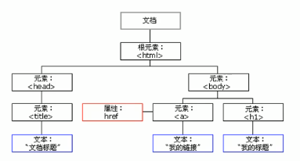
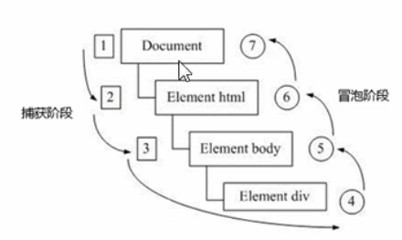

### JavaScript初识
1. JavaScript是一种运行在客户端的脚本语言
2. 脚本语言不需要编译，运行过程中由js解释器（js引擎）逐行来进行解释并执行
3. 目前也可以基于Node.js进行服务器端的开发
4. 浏览器分成两部分：渲染引擎和js引擎
   * 渲染引擎：用来解析HTML与CSS，俗称内核，如chrome浏览器的blink，老版本的webkit
   * js引擎：也称为JS解释器。用来读取网页中的JavaScript代码，对其处理后运行，如chrome浏览器的V8
5. 浏览器本身并不会执行JS代码，而是通过内置的JS引擎来执行JS代码。JS引擎执行代码时逐行解释每一句源码（转换为机器语言），然后由计算机去执行，所以JavaScript语言归为脚本语言，会逐行解释执行。
6. JavaScript分为三个部分：JavaScript语法（ECMAScript）、页面文档对象模型（DOM）、浏览器对象模型（BOM）
7. 三种书写位置：行内、内嵌和外部引入
8. 注释：                  
``` 
   // 当行注释
   /*
   多行注释
   */
```
9. 输入输出语句：
   * alert(msg)浏览器弹出警示框
   * console.log(msg)浏览器在控制台打印输出信息
   * prompt(info)浏览器弹出输入框，用户可以输入
### 基础语法（ECMAScript）
#### 变量
1. 变量：就是用于存放数据的容器，可以通过变量名来获取和修改数据，其本质是程序在内存中申请的一块用来存放数据的空间
2. 变量的命名规范
   * 由字母、数字、下划线、美元符组成，不能以数字开头
   * 严格区分大小写
   * 不能是关键字和保留字，如var、if、for等
   * 变量名最好有意义，并且遵守驼峰命名规范
   * name变量名尽量不要直接使用，在某些浏览器是有使用的
3. 变量的使用：
   * 声明变量：`var age;// 声明一个名为age的变量`
   * 赋值：`age = 10; // 给age这个变量赋值为10`
   * 变量初始化：`var age = 10 // 声明和赋值一起`
4. 变量语法扩展
   * 更新变量：一个变量被重新赋值后，它原有的值就会被覆盖，变量值将以最后一次赋的值为准
   * 同时声明多个变量：`var age = 18, address = ''`
   * 声明变量的特殊情况：
     * 不声明不赋值结果直接报is not defined
     * 只声明不赋值结果为undefined 
     * 不声明直接赋值是可以正常使用的，会变成全局变量
#### 数据类型
1. 在计算机中不同的数据所需占用的存储空间不同，为了便于把数据分成所需内存大小不同的数据，充分利用存储空间，于是定义了不同的数据类型
2. JavaScript是一种弱类型或者动态类型的语言，变量没有数据类型，值才有数据类型，也就是根据值的类型来确认变量的类型，变量的类型可以根据值的类型变化而变化
3. 简单数据类型 (值类型)
   * 数字型（Number）：包含整型和浮点型
     * 最大值（Number.MAX_NUMBER）、最小值(Number.MIN_NUMBER)
     * 特殊值：无穷大(Infinity)、负无穷大(-Infinity)、非数字(NaN)
     * 判断是否是数字：isNaN()，是数字返回false，不是数字返回true`isNaN('hello')`
   * 字符串（String）
     * 转义字符以反斜杠（\）开头，如\n，\b
     * length属性可以获取字符串的长度`'hello'.length'
     * 字符串使用加号（+）进行拼接，任何类型的数据和字符创相加结果都是字符串
   * 布尔型（Boolean）：值为true和false，在参与加法运算时当1和0来计算
   * Undefined：声明了变量但是未赋值，即没有数据类型的变量，NaN、undefined和数字相加最后结果为NaN
   * 空值（Null）：和数字相加等于数字本身
4. 复杂数据类型（引用类型）
   * object
   * Array
   * Date
5. 使用typeof检测变量当前的值为那种数据类型`typeof num`，在检测Null、对象和数组时结果都为object
6. 字面量：用来为变量赋值时的常数量
7. 数据类型转换：
   * 转成字符串：
     * toString()：`num.toString()`
     * String()：`String(num)`
     * 使用加法拼接字符创的方法实现类型转换：`'' + num`
   * 转换为数字：
     * parseInt()：`parseInt('78')`，会直接小数点后面的内如直接截去，同时也会把数字后面不认识的字符直接舍去
     * parseFloat()：`parseFloat('78.12')`，同样也会把数字后面不认识的字符直接舍去
     * Number()：`Number('12')
     * js隐式转换（- * /）：利用算数隐式转换为数字
   * 转换为布尔型：Boolean()，代表空或否定值的（''、0、NaN、null、undefined）转换为false，其它全部转换为ture
#### 运算符
1. 运算符（operator）也被称为操作符，用于实现赋值、比较和执行算数运算等功能的符号
2. 表达式和返回值：由数字、运算符、变量等组成的式子为表达式，其结果为返回值
3. 算数运算符：浮点数最高精度为17位，但在进行算数计算时其精确度远远不如整数，很容易会出现问题，尽量避免
   * 加（+）
   * 减（-）
   * 乘（*）
   * 除（/）
   * 取模（%）
4. 递增和递减：
   * 前置递增：`++i`，先加1后返回值
   * 前置递减：`--i`，先减1后返回值
   * 后置递增：`i++`，先返回原值后加1
   * 后置递减：`i--`，先返回原值后减1
5. 比较运算符：返回布尔值
   * 小于(<)
   * 大于(>)
   * 小于等于(<=)
   * 大于等于(>=)
   * 等于-会转型(==)
   * 不等于-会转型(!=)
   * 全等-不会转型(===)
   * 不等-不会转型(!==)
6. 逻辑运算符：用来进行布尔值运算的运算符，结果也是布尔值，有多个表达式（值）参与时，可以使用短路运算进行输出值
   * 逻辑与(&&)：短路运算时如果前面的表达式为真则输出第二个表达式，如果前面的表达式为假，则返回前面的值
   * 逻辑或(||)：短路运算时，如果前面为真时直接输出，如果前面表达式为假则继续取后面的表达式
   * 非(!)
7. 赋值运算符：=、+=、-=、*=、/=、%=
8. 三元表达式：有三元运算符组成的式子，`条件表达式 ? 表达式1 : 表达式2`
9. 优先级                   

#### 流程控制
1. 流程控制：控制代码按照什么结构顺序来执行
   * 顺序结构
   * 分支结构
   * 循环结构
                  
2. 分支流程控制：根据不通的条件，执行不同的路径代码，得到不同的结果
   * if语句
   ``` 
    if (条件表达式) {
        执行语句
   }else if{
   
   }else{
   
   }
   ```
   * switch语句
   ``` 
     // case中的值匹配的时候是全等，不使用break会穿透case
     switch(表达式) {
        case value1:
           执行语句1
            break；
        case value2:
           执行语句2
            break；
        default：
            执行最后的语句
     } 
   ```
3. 循环结构：可以重复执行某些代码，continue跳出本次循环继续下一次循环，break直接跳出整个循环
   * for循环
   ``` 
        // 三个表示都可以放空，如果全部放空则为死循环
        for(初始化变量; 条件表达式; 操作表达式（每次循环最后执行的代码-通常用于计数器变量的更新）) {
            // 循环体
       }
   ```
   * while循环
   ``` 
       while(条件表达式) {
            // 循环体
            // 操作表达式，如果没有就成为了死循环
       } 
   ```
   * do...while循环
   ``` 
        // 至少执行一次
       do{
            // 循环体
            // 操作表达式，如果没有就成为了死循环
       } while(条件表达式)
   ```
#### 数组
1. 数组（Array）：一组数据的集合，其中每个数据被称为元素，在数组中够可以存放任意类型的元素。数组是一种将一组数据存储在单个变量名下的优雅方式。
2. 创建数组
   * new：`var arr = new Array() // 创建一个空数组`
   * 直接使用字面量创建数组：
   ```
       // 创建一个空数组
       var arr = []; 
   
      // 创建一个带初始值的数值
       var arr = [1, 2, 3, 4, 5]
   ```
3. 访问数组元素：通过索引（下标）：`arr[index] // 索引从0开始，索引超出后返回undefined`
4. 获取数组长度：`arr.length`
5. 遍历数组
   ```  
       for(var i = 0; i < arry.lenth; i++) {
            arr[i]
       }
   ```
6. 新增元素
   * 通过修改length长度来实现数组扩容来新增元素：`arr.length = 6; arr[5] = 6; // length属性是可写的`
   * 通过索引增加来新增元素：`arr[6] = 7; // 不修改length直接增长index也是可以的，index为原先就有的元素则为替换`
#### 函数
1. 函数：就是封装了一段可被重复调用执行的代码块，通过此代码块可以实现大量代码的重复使用
2. 函数的使用：
   ``` 
        // 声明函数
        // 命名函数
        function 函数名() {
            // 函数体
        }
   
       //  另一种声明方式，函数表达式（匿名函数-var后的是一个变量名并不是函数名）
       var 变量名 = function(){}
   
        // function 声明函数的关键字
        // 声明函数本身并不会执行代码，只有调用函数时才会执行函数体代码
        // 调用函数
        函数名()
   
        // 函数也可以调用函数
        function 函数1（） {
            函数名（）
        }
   ```
3. 函数的封装：把一个或多个功能通过函数的方式封装起来，对外只提供一个简单的函数接口
4. 函数的参数：
   * 使用参数实现函数重复不同的代码
   * 参数：
   ```  
        // 函数的参数可以有，也可以没有，个数没有限制
        // 形参接受实参，类似于一个变量
       function 函数名(形参1, 形参2, 形参3...) {}
   
        // 调用，实参为实际值
        函数名(实参1， 实参2， 实参3...) 
   ```
   * 形参和实参匹配：
     * 形参和实参个数一致，正常匹配到函数，形参和实参正确匹配
     * 实参的个数多于形参的个数，依然能匹配到函数，但是超出形参的个数的实参会被丢弃
     * 实参的个数小于形参个数，还是可以匹配到函数，缺失的实参为undefined
   * 函数的返回值
   ```  
        // 通过返回值把结果返回给调用者，
        // return 后直接终止函数，返回调用处，也是函数的正常出口，没有返回值的方法相当return undefined
        // return 只能返回一个变量
        function 函数名() {
              return 需要返回的结果
        } 
   
        var result = 函数名()
        // break：跳出当前的循环体
        // continue：跳出本次循环继续下次循环
        // return：不仅可以退出循环，还能够返回语句中的值，同时还可以结束当前的函数体内的代码
   ```
   * 当不确定有几个参数传递时，可以使用arguments来获取实参。在js中，arguments实际上是当前函数的一个内置对象，内部存储了传递的所有实参
   ``` 
        // 不写形参和不定参数的写法，arguments都可以正确取到值，只不过不定参数的写法形参是一个数组
        // arguments并不是真正意义上的数组而是一个伪数组
        // 它具有数组的length属性
        // 按照索引的方式进行存储
        // 但是它没有真正数组的一些方法pop() push()等
        function test1() {
            console.log(arguments)
       }
   
        test1(1, 2);
   
       function test2(...args) {
            console.log(arguments)
       } 
   
        test2(3, 4)
   ```
#### 作用域
1. 作用域：限定变量的可用性代码范围，其提高了程序逻辑的局部性，减少了名字冲突
2. js的作用域（es6之前）：
   * 全局作用域：整个script标签内或者一个单独的js文件
   * 局部作用域（函数作用域）：在函数内部就是局部作用域，这个变量只在函数内部起效果和作用
3. 变量的作用域：
   * 全局变量：在全局作用域下的变量，在函数内部没有声明直接赋值的变量`function test() {num = 1}`
   * 局部变量：在局部作用域下的变量，形参也可以看做是局部变量
4. 全局变量只有浏览器关闭的时候才会销毁，比较占内存资源
5. 局部变量在程序执行完毕就会销毁，比较节约内存资源
6. 在es6之前没有块级作用域，块级作用域就是在{}内
7. 作用域链：根据在内部函数可以访问外部函数变量的机制，用链式查找决定哪些数据能被内部函数访问，就称为作用域链
   ```  
       var num = 10;
        function test() {
            var num = 20;
            function test1() {
                // 根据链式的向外层查找，此处为20
                console.log(num)
            }
        }
   ```
#### 预解析
js引擎在运行js代码的时候分为两步：
    * 预解析：js引擎会把js里面所有的var还有function提升到当前作用域的最前面
        * 变量预解析（变量提升）：就是把所有的变量声明提升到当前作用域的最前面，不会提升赋值操作
        * 函数提升：把所有函数的声明提升到当前作用域的最前面
    * 代码执行：按照代码书写的顺序从上往下执行
   ```  
       // 报错，num is not defined 
       console.log(num)
   
       // 不报错，值为undefined
       console.log(num)
       var num = 10
   
       // 正常调用
        fn()
        function fn() {
             console.log(11)
        }
   
        // 报错，fn is not a function
         fn()
        var fn = function() {
             console.log(11)
        }
   ```
#### 对象
1. 对象：一个具体的事物，万事万物皆对象。在js中对象是一组无序的相关属性和方法的集合，所有事物都是对象，如字符串、数值、数组、函数等
2. 对象是有属性和方法组成
   * 属性：事物的特征
   * 方法：事物的行为
3. 对象表达事物的结构比数组更清晰更强大
4. 创建对象的三种方式
   * 利用字面量创建对象
   ``` 
      // 里面的属性或者方法采取键值对的形式，属性名: 属性值
      // 多个属性或者方法以逗号隔开
      // 方法冒号后面跟的是一个匿名函数
      var obj = {
          uname: 'lisi',
          age: 18,
          sayHi: function() {
              cosole.log('hi~')
          }
      } 
   
      // 1. 调用属性的属性采取对象名.属性名
      console.log(obj.name)
      // 2. 另一种方式类似于数组，对象名['属性名']
      console.log(obj['name'])
      // 3. 调用对象的方法，对象名.属性名()
      obj.sayHi()
   ```
   * 利用new Object创建对象
   ```  
      var obj = new Object()
      obj.uname = 'lisi'
      obj.age = 18
      obj.sayHi = function(){}
   ```
   * 利用构造函数创建对象
   ```  
       // 使用上面两种方式创建对象一次只能创建一个对象
       // 使用构造函数就是利用函数的方法，封装重复的代码，此处的代码为构造对象的函数
       function 构造函数名() {
             this.属性 = 值
             this.方法 = function() {}
       }
   
       // 构造函数可以不使用return就有返回值，返回值就是一个对象
        function Constructor(uname, age, sex) {
            this.name = uname
            this.age = age
            this.sex = sex
            this.sing = function(sang) {
                 console.log(sang)
            }
        }
   
        var obj = new Constructor('lisi', 18, '男')
         obj.sing('song')
   ```
5. 构造函数和对象的区别
   * 构造函数泛指的是某一大类，类似于java中的类
   * 对象特指某一个具体的事务也称为对象实例化
   * 利用构造函数来创建对象
6. new的执行过程
   * 在内存中创建一个空的对象
   * this就会指向刚才创建的空对象
   * 执行构造函数里面的代码，给这个空对象添加属性和方法
   * 返回这个对象（所以构造函数里面不需要return，new就包含了返回的操作）
7. 遍历对象
   ```  
       var obj = {
             name: 'lisi',
             age: 18
        }
   
         // 遍历对象时变量为属性名
        // 也可用于遍历数组，此时变量为index
        for (var 变量 in 对象) {}
   
       for (var k in obj) {
           // 得到的是属性名
           console.log(k)
           // 得到属性值
           console.log(obj[k])
       }
   ```
#### 内置对象
1. js对象分为三种：自定义对象、内置对象、浏览器对象，前两者是js基础内容，属于ECMAScript，浏览器对象属于JavaScript独有
2. 内置对象就是指js语言自带的一些对象，这些对象供开发者使用并提供了一些常用的或是最基本而必要的功能（属性和方法），帮助开发者快速开发
3. 网站：
   * https://zh.javascript.info/
   * https://developer.mozilla.org/zh-CN/docs/Web/JavaScript
   * https://codesandbox.io/
   * https://jsbin.com/
   * https://codepen.io/pen/
4. Math对象：具有数学常数和函数的属性和方法
   * 圆周率：PI
   * 最大值：max()
   * 最小值：min()
   * 绝对值：abs()
   * 向下取整：floor()，往小区
   * 向上取整：ceil()，往大取
   * 四舍五入（就近取整）：round()，.5往大取
   * 随机数：random()，返回一个随机的小数[0, 1)
5. 日期对象（Date）：处理日期和时间，是一个构造函数，
   * 使用new来调用创建我们的日期对象，如果没有参数返回当前时间
   * new 参数写法：数字型 2019, 10, 01，字符串写法：'2019-10-01 8:8:8'
   * 格式化：
     * 返回年份：getFullYear()
     * 返回月份：getMonth()，其从0开始[0-11]
     * 返回当天日期：getDate()
     * 返回星期几：getDay()，[0-6]
     * 小时、分钟、秒、毫秒：getHours()，getMinutes()，getSeconds()，getMilliseconds()
     * 返回毫秒数(时间戳)：valueOf(),getTime(),+new Date(),Date.now()
6. 数组对象（Array）：
   * 检测是否为数组：isArray()
   * push()/pop()/shift/unshift()/splice()/reverse()/sort()
   * indexOf()/lastIndexOf()
   * toString()/join()
7. 字符串对象：
   * 包装类型的长度属性：length
   * indexOf('', starterIndex)/lastIndexOf()
   * charAt(index)/charCodeAt(index)/str[index]
   * concat('str1', 'str2'...)/substr(start, length)/slice(start, end)/substring(start,end)
   * replace('被替换的字符', '替换为的字符') 只替换第一个字符/split('分隔符')
8. instanceof运算符用来检测Constructor.prototype是否存在于参数object的原型链上，可以检测数组、对象等
### DOM-页面文档对象
#### DOM基础知识
1. DOM：Document Object Model，是W3C组织推荐的处理可扩展标记语言的标准编程接口，通过这些接口可以改变页面的内容、结构和样式
2. DOM树，以下三个都是对象
   * 文档：一个页面就是一个文档，DOM中使用document表示
   * 元素：页面中的所有标签都是元素，DOM中使用element表示
   * 节点：网页中的所有内容都是节点（标签、属性、文本、注释等），DOM中使用node表示
   
3. 获取元素，使用console.dir可以打印返回的元素对象，更好的查看里面的属性和方法
   * 根据id获取，返回对象：document.getElementById('id')
   * 根据标签获取，以伪数组的形式返回元素对象的集合：document.getElementByTagName('tagName')，也可以通过父元素来获取：element.getElementByTagName('tagName')
   * H5新增的方法获取：
     * 通过类名来获取，返回集合：document.getElementByClassName('className')
     * 根据选择器获取，返回的是符合条件的第一个元素对象，ie9及以上：document.querySelector('selector')
     * 根据选中器获取所有元素对象，ie9及以上：document.querySelectorAll('selector')
   * 快速获取body元素：document.body
   * 获取html元素：document.documentElement
4. 事件基础：事件是可以被js侦测到的行为，触发--响应机制
   * 事件源：事件被触发的对象
   * 事件类型：如何触发，如鼠标点击、经过、键盘按下
   * 事件处理程序：通过一个函数赋值的方式完成
   ``` 
      // 点击事件绑定
      // 1.获取事件源
      var element = doucument.getElementById('id')
      // 2.绑定事件
      element.onclick
      // 3.添加处理程序
      element.onclick = function() {
         // 执行代码
      }
   ```
   
5. 操作元素：通过DOM操作改变网页内容、结构和样式，即通过DOM操作元素来改变元素里面的内容、属性等，属性通常都是可读写-即可读取元素中的内容也可以修改
   * 改变内容，两者都是属性：element.innerText、element.innerHTML
   * 常用的元素属性：src、href、title、alt、id
   * 修改表单属性：type、value、checked、selected、disabled
   * 样式属性操作：
     * 行内样式操作：[element].style `element.style.fontSize // 样式名为驼峰命名`
     * 类名样式操作：[element].className
6. 自定义属性：
   * [element].getAttribute('属性名')也可获取内置属性
   * [element].setAttribute('属性名', '属性值')也可修改内置属性
   * H5自定义属性使用data-开头作为属性名，并可以使用[element].dataset.[data-后面的名字]或[element].dataset['data-后面的名字']如果data-后有多个-连接的字符，那么采取驼峰命名来获取，ie11才支持
7. 节点操作
   * 父节点，没有父节点就返回null：[node].parentNode
   * 子节点，会返回所有子节点包含元素节点、文本节点等等：[node].childNodes
     * nodeType：1-元素节点，3-文本节点
   * 获取所有子元素节点：[node].children
   * 获取第一个子节点：[node].firstChild
   * 获取最后一个子节点：[node].lastChild
   * 获取第一个子元素，ie9及以上才支持：[node].firstChildren
   * 获取最后一个子元素，ie9及以上才支持：[node].lastChildren
   * 下一个兄弟节点：[node].nextSibling
   * 上一个兄弟节点：[node].previousSibling
   * 下一个兄弟元素节点，ie9及以上才支持：[node].nextElementSibling
   * 上一个兄弟元素节点，ie9及以上才支持：[node].previousElementSibling
   * 创建元素节点：document.createElement('tagName')
   * 添加节点：
     * [node].appendChild(child)
     * [node].insertBefore(child, '指定元素')
   * 删除节点：[node].removeChild(child)
   * 赋值节点：[node].cloneNode()，参数为空默认为false则为浅拷贝-只复制元素没有复制里面的内容，参数为true则为深拷贝会把里面内容一起拷贝
8. 创建元素还有一种方式为document.write()，其如果在window.onload后调用会导致重绘页面，createElement加appendChild方式创建节点比innerHTML效率会低，但是innerHTML不要用拼接字符串的形式要采用数组拼接的形式
#### 事件高级
1. 注册事件
   * 传统注册方式，特点是注册事件具有唯一性，即一个元素的一个事件只能有一个处理函数，即使写了多个后面注册的会把前面的覆盖掉
   ``` 
        // 利用on开头的事件属性
        <button onclick=""></button>
        btn.onclick=function(){}
        btn['onclick']=function(){}
   ```
   * 方法监听注册方式，w3c推荐，同一个元素同一个事件可以注册多个监听器，触发时按照注册顺序依次执行，ie9及以上支持，之前的可用attachEvent()代替
   ``` 
        // 参数一  事件类型字符串，如click、mouseover等，其不要带on
        // 参数二  事件处理函数，事件发生时会调用该监听函数
        // 参数三  可选参数，是一个布尔值，默认为false-处于冒泡阶段，设置为true-处于捕获阶段
        eventTarget.addEventListener(type, listener[, useCapture])
   ```
2. 删除事件
   ``` 
      // 传统方式删除事件
      btn.onclick = null
   
      // addEventListener对应的删除事件
      btn.addEventListener('click', fn)
      btn.removeEventListener('click', fn)
   
      function fn(){}
   ```
3. DOM事件流：描述的是从页面中接收事件的顺序。事件发生时会在元素节点之间按照特定的顺序传播，这个传播过程即DOM事件流。
   * 捕获阶段：由DOM最顶层节点开始，然后逐级向下传播到最具体的元素接收的过程
   * 当前目标阶段
   * 冒泡阶段：事件最开始由最具体的元素接收，然后逐级像上传播到DOM最顶层节点的过程
   
   ``` 
      // 1. js代码中只能执行捕获或者冒泡其中的一个阶段
      // 2. onclick和attachEvent只能得到冒泡阶段
      // 捕获节点会先执行father，后执行son
      <div class='father'>
         <div class='son'>son盒子</div>
      </div>
   
      var son = document.querySeletor('.son')
      son.addEventListener('click', function() {
         alert('son')
      }, true) 
   
      var father = document.querySeletor('.father')
      father.addEventListener('click', function() {
         alert('father')
      }, true) 
   
      // 冒泡阶段会先执行son，再执行father
      var son = document.querySeletor('.son')
      son.addEventListener('click', function() {
         alert('son')
      }) 
   
      var father = document.querySeletor('.father')
      father.addEventListener('click', function() {
         alert('father')
      }) 
   ```
4. 实际开发中很少使用事件捕获，更关注事件冒泡
5. 有些事件没有冒泡，如onblur、onfocus、onmouseenter、onmouseleave
6. 事件对象：
   * event就是一个事件对象，在注册函数中使用形参传入
   * 只有有了事件才会有事件对象，系统自动创建，不需要我们传递参数
   * 事件对象是一系列和事件相关的数据集合，如鼠标点击则里面包含了鼠标的相关信息、鼠标坐标等，如果是键盘事件则包含了键盘事件的信息
   * 事件对象可以自己命名，ie9以下要使用window.event
   * 常见属性和方法
     * 返回触发事件的对象（标准）：e.target
     * 返回触发事件的对象（非标准，ie9以下使用）：e.srcElement
     * 返回事件类型：e.type
     * 阻止冒泡（非标准，ie9以下使用）：e.cancelBubble
     * 阻止默认事件（非标准，ie9以下使用）：e.returnValue
     * 阻止冒泡（标准）：e.stopPropagation()
     * 阻止默认事件（标准）：e.preventDefault()
   ``` 
      son.onclick = function(event) {
         alert('son')
      }
   
      son.addEventListener('click', function(event) {
         alert('son')
      }) 
   
      // 自己命名
      son.addEventListener('click', function(e) {
         // 兼容性写法
         e = e || window.event
         alert('son')
      }) 
   ```
