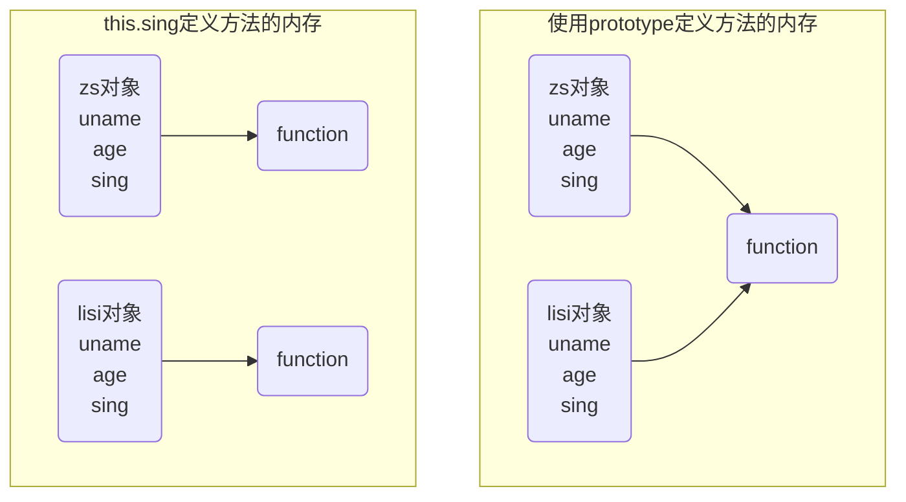
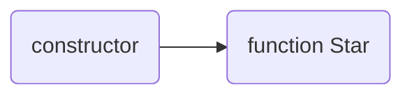
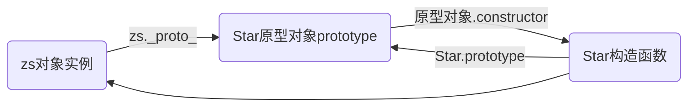
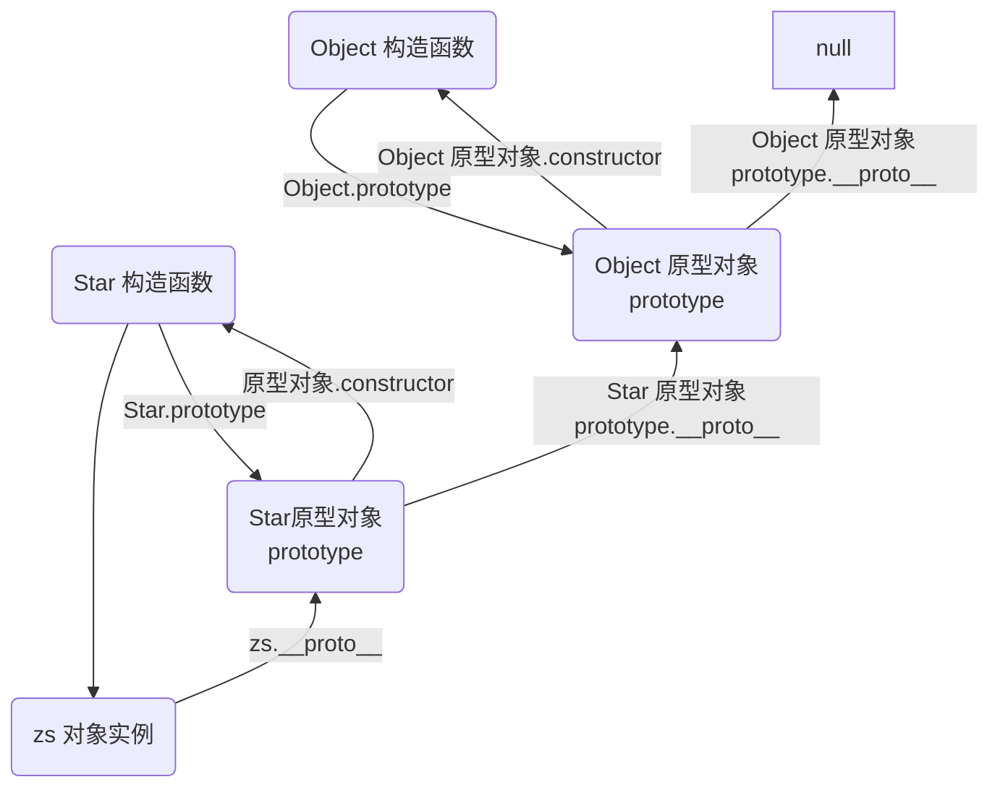

## 一、面向对象

### 1. 编程思想

#### 1.1 面向过程编程（POP — Process-oriented programming ）

​		面向过程就是分析出解决问题所需要的步骤，然后用函数把这些步骤一步一步实现，使用的时候再一个一个的依次调用。

#### 1.2 面向对象（OOP — Object Oriented Programming）

面向对象是把事务分解成为一个个对象，然后由对象之间分工与合作解决需要解决的问题。在面向对象程序开发思想中，每一个对象都是功能中心，具有明确的分工。面向对象编程具有灵活、代码可复用、容易维护和开发的优点，更适合于多人合作的大项目。

面向对象的特性：

* 封装性
* 继承性
* 多态性

### 2. ES6中的类和对象

#### 2.1 面向对象的思维特点：

- 抽取（**抽象**）对象共有的属性和行为组织（**封装**）成一个类（**模板**）
- 对类进行**实例化**，获取类的对象

#### 2.2 对象

在JavaScript中，对象是一组无序的相关属性和方法的集合，所有事物都是对象，例如字符串、数值、数值、函数等。

对象是由属性和方法组成：

- 属性：事物的**特征**，在对象中用**属性**来表示
- 方法：事物的**行为**，在对象中用**方法**来表示

#### 2.3 类（class）

在ES6中新增了类的概念，可以使用class关键字声明一个类，之后以这个类来实例化对象。

- **类**抽象了对象的公共部分，它**泛指**某一大类（class）
- **对象**特指某一个，通过类**实例化**一个具体的对象

#### 2.4 创建类

``` javascript
// 创建类
class name {
	// class body
}

// 创建实例，必须使用new来实例化
var xx = new name()
```

#### 2.5 constructor — 构造函数

**constructor()**方法是类的构造函数（默认方法），**用于传递参数，返回实例对象**，通过new命令生成对象实例时，自动调用该方法。如果没有显示定义，类内部会自动给我们创建一个**constructor()**

```javascript
class Star {
	// 构造函数
	constructor(uname) {
		this.uname = uname
	}
}


//利用类创建对象
var curry = new Star('Curry')
var kobe = new Star('Kobe')
console.log(curry.uname)
console.log(kobe.uname)
```

#### 2.6 添加方法

```javascript
class Star {
	// 构造函数
	constructor(uname) {
		this.uname = uname
	}
	
	// 类中所有的函数不需要写function，并且多个函数之间不需要添加逗号分隔
	sing(song) {
		console.log(song)
	}
}

var curry = new Star('Curry')
var kobe = new Star('Kobe')

curry.sing('haha')
kobe.sing('hehe')
```

### 3. 类的继承

#### 3.1 继承

* 现实中的继承：子承父业
* 程序中的继承：子类可以继承父类的一些属性和方法

```javascript
// 父类
class Father {}

// 子类
class Son extends Father {}
```

#### 3.2 super

**super关键字**用于访问和调用对象父类上的函数。可以调用**父类的构造函数**，也可以调用**父类的普通函数**。

``` javascript
class Father {
    constructor(x, y) {
        this.x = x
        this.y = y
    }
    
    sum() {
        return this.x + this.y
    }
}

class Son extends Father {
	constructor(x, y) {
		// 调用父类中的构造函数,否则直接调用sum时，父类中的this.x和this.y找不到
		super(x, y)
	}
    
    sum() {
        console.log(super.sum)
    }
}

var son = new Son(1, 2)
// 继承中的属性或者方法查找原则：就近查找，先查找子类，子类有就执行，否则查找父类
son.sum()
```

#### 3.3 super必须放在this之前

``` javascript
class Father {
	constructor(x, y) {
		this.x = x
		this.y = y
	}
	
	sum() {
		console.log(x + y)
	}
}

class Son extends Father {
	constructor(x, y) {
		// super必须放在this之前，否则报错
		super(x, y)
		this.x = x
		this.y = y
	}
	
	substract() {
		console.log(this.x - this.y)
	}
}

var son = new Son(5, 6)

son.substract()
son.sum()
```

#### 3.4 🧨注意点：

* 在ES6中类没有变量提升，所以必须先定义类，才能通过类实例化对象
* 类里面的共有的属性和方法一定要加this
* constructor里面的this指向实例对象，方法里面的this指向这个方法的调用者

``` javascript
// 用于保存实例对象的this
var _that;

class Star {
	constructor(uname) {
		// 此处this指向的是实例对象
		this.uname = uname
		this.btn = document.querySelector('button')
		this.btn.onclick = this.sing
		_that = this
	}
	
	sing() {
		// 此处son方法的调用者应该是this.btn，则this为btn，因此this.uname会undefined
		console.log(this.uname)
		
		// 可以再constructor中将this赋值给一个变量再使用
		console.log(_that.uname)
	}
	
	dance() {
		// 此处this指向的是实例对象
		console.log(this)
	}
	
}
```

## 二、构造函数和原型

### 1.  构造函数

#### 1.1 概述

在典型的OOP的语言中都存在类的概念，其就是对象的模板，对象就是类的实例，但是在ES6之前JS中并没有引入类的概念。

在ES6之前，对象不是基于类创建的，而是用一种称为**构造函数**的特殊函数来定义对象和它们的特征。

 - 利用new Object()创建对象  `var object = new Object()`

 - 利用对象字面量创建对象  `var object = {}`

 - 由构造函数创建对象

   ```javascript
   function Star(uname, age) {
   	this.uname = uname
   	this.age = age
   	this.sing = function() {
   		console.log('我会唱歌')
   	}
   }
   
   var zs = new Star('zhangsan', 18)
   var ls = new Star('lis', 19)
   
   zs.sing()
   ls.sing()
   ```

#### 1.2 实例成员和静态成员

- 实例成员就是构造函数内部通过this添加的成员，如1中的uname、age、sing，实例成员只能通过实例化的对象来访问，不可以通过构造函数本身来访问实例成员

  ```javascript
  console.log(zs.uname)
  
  // 此uname为undefined
  console.log(Star.uname)
  ```

- 静态成员是在构造函数自身上添加的成员，静态成员只能通过构造函数来访问

  ```
  Star.sex = '男'
  
  console.log(Star.sex)
  
  //此时为zs.sex为undefined，静态成员只能通过构造函数来访问
  console.log(zs.sex)
  ```

#### 1.3 构造函数的问题

构造函数方法很好用，但是**存在浪费内存的问题**，因为其中定义方法也是使用this来指向实例对象，也就是说每次实例化对象时都会开辟一块空间来存储这些方法方法



### 2. 原型

#### 2.1 💡构造函数原型 prototype

构造函数通过原型分配的函数是所有对象所共享的。

JavaScript规定，**每一个构造函数都有一个prototype属性**，指向另一个对象。注意这个prototype就是一个对象，这个对象的所有属性和方法，都会被构造函数所拥有。

``` javascript
function Star(uname, age) {
    this.uname = uname
    this.age = age
    
   // this.sing = function() {}
}

// 使用prototype来定义sing方法就可以使实例化对象时不需要每个对象都维护一份
Star.prototype.sing = function() {
    console.log('haha')
}

var zs = new Star('zhangsan', 18)
var lisi = new Star('lisi', 19)

zs.sing()
lisi.sing()
```

#### 2.2 `_proto_`对象

JS中每个对象都有一个属性**`_proto_`**指向构造函数的prototype原型对象，之所以我们对象可以使用构造函数prototype原型对象的属性和方法，就是因为其的存在。

 * `_proto_`—对象的原型和原型对象prototype是等价的

 * `_proto_`是非标准属性，在实际开发中不可以直接使用它，它只是为对象的查找机制提供一个方向，内部指向原型对象prototype
* 方法的查找规则：首先查看对象上是否有sing方法，如果有就执行这个对象上的sing，如果没有那么就去构造函数原型对象prototype上去查找sing这个方法

#### 2.3 constructor构造函数

对象原型和构造函数(prototype)原型对象里面都有一个属性constructor属性，它指回构造函数本身。

主要用来记录该对象引用于哪个构造函数，它可以让原型对象重新指向原来的构造函数。



```javascript
function Star(uname, age) {
	this.uname = uname
	this.age = age
}

// 使用prototype添加公共方法，其不会改变constructor的指向
Star.prototype.sing = function() {
    console.log('我会唱歌')
}

Star.prototype.movie = function() {
    console.log('我会演电影')
}

// 直接使用对象定义会覆盖constructor，此时constructor指向该对象
Star.prototype = {
    // 手动指回原来的构造函数
    constuctor: Star,
    sing: function() {
        console.log('我会唱歌')
    },
    movie: function() {
         console.log('我会演电影')
    }
}

var zs = new Star('zhangsan', 18)
var ls = new Star('lisi', 19)

console.log(Star.prototype)
console.log(zs.__proto__)
```

#### 2.4 构造函数、实例、原型对象三者之间的关系



#### 2.5 💡原型链



#### 2.6 JavaScript的成员查找机制

- 当访问一个对象的属性（包括方法）时，首先查找这个对象自身有没有该属性
- 如果没有就查找它的原型（也就是`__proto__`指向的**prototype**原型对象）
- 如果还没有就查找原型对象的原型（**Object的原型对象**）
- 依此类推一直找到Object为止（**null**）

#### 2.7 原型对象中this指向

原型对象函数里面的this指向的还是函数的调用者。

#### 2.8 扩展内置对象方法

```javascript
console.log(Array.prototype)

Array.prototype.sum = function() {
	var sum = 0
	
	for(var i = 0; i < this.length; i++) {
		sum += this[i]
	}
	
	return sum
}

var arr = [1, 2, 3]
console.log(arr.sum())
console.log(Array.prototype)
```

### 3. 继承

#### 3.1 ES6之前

ES6之前并没有提供**extends**继承，可以通过**构造函数（继承属性）+ 原型对象（继承方法）**模拟实现继承，被称为**组合继承**。

#### 3.2 借用构造函数继承父类型属性

通过**call()**把父类型的**this**指向子类型的**this**，实现子类型继承父类型的属性。

``` javascript
// 借用父构造函数继承属性
function Father(uname, age) {
    // this 指向父构造函数的对象实例
	this.uname = uname
	this.age = age
}

function Son(uname, age, score) {
	// this 指向父构造函数的对象实例
    Father.call(this, uname, age)
    this.score = score
}

var son = new Son('zhangsan', 18)
console.log(son)
```

#### 3.3 借用原型对象继承方法

```javascript
// 借用父构造函数继承属性
function Father(uname, age) {
    // this 指向父构造函数的对象实例
	this.uname = uname
	this.age = age
}

Father.prototype.money = function() {
	console.log(123456)
}

function Son(uname, age, score) {
	// this 指向父构造函数的对象实例
    Father.call(this, uname, age)
    this.score = score
}

// 不能直接把父原型对象直接赋值给子原型对象，否则会出现给子类新增方法后父类也有
// Son.prototype = Father.prototype

// 使用Father的实例对象来继承，因为其实例对象中有对象原型__proto__指向父类的原型对象，就可以间接引用过来，并且在给子类新增方法时，挂载的也是实例对象而不是父类
Son.prototype = new Father()

// 修改原型后，一定要把constructor指向修改回来
Son.prototype.constructor = Son

// 子类专有
Son.prototype.exam = function() {
    console.log('exam')
}

var son = new Son('zhangsan', 18)
console.log(son)
```

### 4. 类（class）的本质

#### 4.1 💡本质

- 类（class）的本质其实还是一个函数，可以简单认为类就是构造函数的另外一种写法
- 类的所有方法都定义在类的prototype属性上
- 类创建实例也有`__proto_`指向类的prototype原型对象
- ES6的类绝大部分功能ES5都可以做到，新的class写法只是让对象原型的写法更加清晰、更像面向对象编程的语法而已
- ES6的类看起来就是面向对象编程的语法糖

#### 4.2 ES6之前（构造函数 + 原型）实现面向对象

- 构造函数有原型对象prototype
- 构造函数原型对象prototype里面有constructor指向构造函数本身
- 构造函数可以通过原型对象添加方法
- 构造函数创建的实例对象有`__proto__`原型指向构造函数的原型对象

#### 4.3 ES6通过类（class）实现面向对象编程

- 类有原型对象prototype
- 类原型对象prototype里面有constructor指向类本身
- 类可以通过原型对象添加方法
- 类创建的实例对象有`__proto__`原型指向类的原型对象

```javascript
class Star {

}

console.log(typeof Star)
// 类有原型对象prototype
console.log(Star.prototype)
// 类原型对象prototype里面有constructor指向类本身
console.log(Star.prototype.constructor)

// 类可以通过原型对象添加方法
Star.prototype.sing = function() {
	console.log(123456)
}

var star = new Star();
console.dir(star)
// 类创建的实例对象有__proto__原型指向类的原型对象
console.log(star.__prototype__)
```

### 5. ES5中新增方法

#### 5.1 数组方法

迭代方法：forEach()、map()、filter()、some()、every()、reduce()

```javascript
// 循环遍历数组，注意其真正操作是回调函数在进行，所以break或return只是跳出回调函数，而不是中断循环，可以使用try...catch捕获异常实现跳出循环
// currentValue：数组当前项的值
// index：数组当前项的索引
// arr：数组对象本身
// thisArg：回调函数的this指向
array.forEach(function(currentValue, index, arr), thisArg)

// 遍历数组并根据返回值创建一个新的数组，通过回调函数的返回值来构造新数组
// currentValue：数组当前项的值
// index：数组当前项的索引
// arr：数组对象本身
// thisArg：回调函数的this指向
array.map(function(currentValue, index, arr), thisArg)

// 筛选数组，返回一个新数组，通过回调函数的return true|false来判断是否满足条件
// currentValue：数组当前项的值
// index：数组当前项的索引
// arr：数组对象本身
// thisArg：回调函数的this指向
array.filter(function(currentValue, index, arr), thisArg)

// 查找数组中是否有满足条件的元素，返回值为ture|false，通过回调函数的return true|false来判断是否满足条件
// 此方法如果查找到第一个满足条件的元素就终止循环不再继续查找
// currentValue：数组当前项的值
// index：数组当前项的索引
// arr：数组对象本身
// thisArg：回调函数的this指向
array.some(function(currentValue, index, arr), thisArg)

// 检查数组中所有元素是否都满足条件，返回值为ture|false，通过回调函数的return true|false来判断是否满足条件
// currentValue：数组当前项的值
// index：数组当前项的索引
// arr：数组对象本身
// thisArg：回调函数的this指向
array.ervery(function(currentValue, index, arr), thisArg)


// 对数组中的每个元素执行一个回调函数，将其结果汇总为单个返回值
// accumulator：累计器累计回调的返回值; 它是上一次调用回调时返回的累积值，或initialValue
// currentValue：数组当前项的值
// index：数组当前项的索引
// arr：数组对象本身
// initialValue：作为第一次调用 callback函数时的第一个参数的值。 如果没有提供初始值，则将使用数组中的第一个元素。 在没有初始值的空数组上调用 reduce 将报错。
array.reduce(function(accumulator, currentValue, index, arr), initialValue)
```

#### 5.2 字符串方法

```javascript
// trim()方法会从一个字符串的两端删除空白字符，其并不影响原字符串本身，它返回的是一个新的字符串
str.trim()
```

#### 5.3  💡Object方法

```javascript
// 定义对象中新属性或修改原有的属性，返回值为被传递给函数的对象
// obj：要定义属性的对象
// prop：要定义或修改的属性的名称
// descriptor：要定义或修改的属性描述符，描述符有两种主要形式：数据描述符和存取描述符，其都是对象


// 描述符共享的可选键值：
// 1. configurable：当且仅当该属性的configurable键值为true时，该属性的描述符才能够被改变，同时该属性也能从对应的对象上被删除，默认值为false
// 2. enumerable：当且仅当该属性的enumerable键值为true时，该属性才会出现在对象的枚举属性中，默认为false


// 数据描述符的可选键
// 1. value：该属性对应的值。可以是任何有效的 JavaScript 值（数值，对象，函数等）。默认为undefined
// 2. writable：当且仅当该属性的 writable 键值为 true 时，属性的值，也就是上面的 value，才能被赋值运算符改变。默认为false


// 存取描述符的可选键
// 1. get：属性的 getter 函数，如果没有 getter，则为 undefined。当访问该属性时，会调用此函数。执行时不传入任何参数，但是会传入 this 对象，该函数的返回值会被用作属性的值。默认为undefined。
// 2. set：属性的 setter 函数，如果没有 setter，则为 undefined。当属性值被修改时，会调用此函数。该方法接受一个参数，会传入赋值时的 this 对象。默认为undefined
Object.defineProperty(obj, prop, descriptor)

var obj = {};

// 在对象中添加一个属性与数据描述符的示例
Object.defineProperty(obj, "key", {
  enumerable: false,
  configurable: false,
  writable: false,
  value: "static"
});


// 在对象中添加一个设置了存取描述符属性的示例
Object.defineProperty(obj, "name", {
  // 下面两个缩写等价于：
  // get : function() { return bValue; },
  // set : function(newValue) { bValue = newValue; },
  get() { return bValue; },
  set(newValue) { bValue = newValue; },
  enumerable : true,
  configurable : true
});
```

## 三、函数进阶

### 1. 函数的定义和调用

#### 1.1 函数的定义方式

```javascript
// 所有函数都是Function的实例，因此所有函数也属于对象
// 自定义函数（命名函数）
function fn() {}

// 函数表达式（匿名函数）
var fun = function() {}

// 利用 new Function('参数1', '参数2', '函数体')
// 无论是参数还是函数体都需要用引号包起来，不常用
var f = new Function('a', 'b', 'console.log(a + b)')
f(1, 2)
console.log(f)
```

#### 1.2 函数的调用方式

```javascript
// 1. 普通函数
function fn() }{
    console.log('normal')
}
fn()
// 2. 对象的方法
var o = {
    fn: function() {
        console.log('method')
    }
}
o.fn()
// 3. 构造函数
function constructor(){
}
new constructor()
// 4. 绑定事件函数，点击按钮触发就调用函数
btn.onclick = function() {}
// 5. 定时器函数，时间到自动调用
setTimeout(function() {
    console.log('timeout')
}, 0)
// 6. 立即执行函数，自动调用
(function() {
    console.log('test')
})()
```

### 2. this

#### 2.1 函数内this的指向

this的指向是当我们调用函数的时候确定的，调用方式的不同决定了this的指向不同。

一般指向：

| 调用方式     | this指向                                                 |
| ------------ | -------------------------------------------------------- |
| 普通函数调用 | window                                                   |
| 构造函数调用 | 实例对象、原型对象里面的方法也指向实例对象               |
| 对象方法调用 | 该方法所属对象，此处指的是普通对象方法，主要还是看调用者 |
| 事件绑定方法 | 绑定事件的对象                                           |
| 定时器函数   | window                                                   |
| 立即执行函数 | window                                                   |

#### 2.2 💡改变函数内部this指向（call()、apply()、bind()）

- **call**方法

  调用函数，并且使用这个方法可以修改函数运行时的this指向

  ```javascript
  // 主要作用可以实现继承
  // thisArg：当前调用函数this的指向对象
  // arg1，arg2：传递的其他参数
  fun.call(thisArg, arg1, atg2,...)
  
  function fn(x, y) {
  	console.log('hahah')
  	console.log(x + y)
  	console.log(this)
  }
  
  var o = {
  	name: 'test'
  }
  
  // call()可以调用函数
  // fn.call()
  
  // 改变this的指向
  fn.call(o, 1, 2)
  ```

- **apply**方法

  也可以在调用一个函数时改变函数的this指向

  ```javascript
  // 主要应用操作数组
  // thisArg：当前调用函数this的指向对象
  // argsArry：传递的其他参数，必须包含在数组里面
  fun.apply(thisArg, [argsArry])
  
  var o = {
      name: 'test'
  }
  
  function fn(arr) {
      console.log(this)
      console.log(arr)
  }
  
  fn.apply(o, ['pink'])
  
  // 借用数学内置对象求数组中的最大值
  var arr = [1, 66, 3, 99, 4]
  var max = Math.max.apply(Math, arr)
  console.log(max)
  ```

- **bind**方法

  其**不会调用函数**但是能改变函数内部this指向

  ```javascript
  // 主要应用如果有函数不需要立即调用，又想改变这个函数内部的this指向，如点击按钮后立即禁用，几秒后开启这个按钮，在定时器回调函数中把按钮元素传入为this
  // 不会调用函数返回值由指定的this值和初始化参数改造的原函数拷贝
  // thisArg：当前调用函数this的指向对象
  // arg1，arg2：传递的其他参数
  fun.bind(thisArg, arg1, arg2,...)
     
  var o = {
      name: 'test'
  }
  
  function fn(){
      console.log(this)
  }
  var f = fn.bind(o)
  f()
  ```

### 3. 严格模式

#### 3.1 严格模式

JavaScript除了提供政策模式外，还提供了**严格模式（stict mode）**。ES5的严格模式是采用具有限制性JavaScript变体的一种范式，即在严格的条件下运行JS代码。

严格模式在IE10以上的浏览器中才会被支持，旧版本浏览器中会被忽略。严格模式对正常的JavaScript语义做了一些更改：

- 消除JavaScript语法的一些不合理、不严谨之处，减少一些怪异行为
- 消除代码运行的一些不安全之处，保证代码运行的安全
- 提高编译器效率，增加运行速度
- 禁用了在ECMA的未来版本中可能会定义的一些语法，为未来新版本的JavaScript做好铺垫。如一些保留字：class、enum、export、extends、import、super不能做变量名

#### 3.2 开启严格模式

严格模式可以应用到**整个脚本**或**个别函数**中，因此使用时，可以将严格模式分为**为脚本开启严格模式**和**为函数开启严格模式**两种情况。

- 为脚本开启严格模式

  ```javascript
  'use strict'
  (function () {
      'use strict'
  })()
  // 下面js代码就会按照严格模式执行代码
  ```

- 为某个函数开启严格模式

  ```javascript
  function fn() {
      // 只针对这个函数
  	'use strict'
  }
  ```

#### 3.3 严格模式中的变化

- **变量规定**
  - 在正常模式下如果一个变量没有声明就赋值，默认是全局变量。严格模式禁止这种用法，变量必须先声明然后再使用。
  - 严禁删除已经声明的变量，如delete x
- **严格模式下this指向问题**
  - 以前在全局作用域函数中的this指向window对象
  - **严格模式下全局作用域中函数中的this是undefined**
  - 以前构造函数不加new也可以当成普通函数来调用，this指向全局对象window
  - **严格模式下如果构造函数不加new调用，this会报错**
  - new实例化的构造函数指向创建的对象实例
  - 定时器this还是指向window
  - 事件、对象还是指向调用者
- **函数变化**
  - 在函数中不能有**重名的参数**
  - 函数必须声明在顶层，ES6引入了块级作用域，因此为了与新版本接轨，不允许在非函数的代码块内声明函数。如if、for中

### 4. 高阶函数

**高阶函数**是对其他函数进行操作的函数，它**接收函数作为参数**或**将函数作为返回值输出**。

### 5. 💡 闭包

#### 5.1 变量作用域

变量根据作用域的不同分为两种：全局变量和局部变量

- 函数内部可以使用全局变量
- 函数外部不能使用局部变量
- 当函数执行完毕，本作用域内的局部变量会销毁

#### 5.2 闭包

**闭包（closure）**指有权**访问**另一个函数作用域中**变量**的**函数**。

简单理解就是一个作用域可以访问另外一个函数内部的局部变量。

```javascript
function fn() {
	var num = 10
    // fun函数的作用域访问了另一个函数fn里面的局部变量num，此时fun里面就会产生一个闭包指向fn函数，闭包就是一个函数
	function fun() {
		console.log(num)
	}
	
	fun()
}

fn()
```

#### 5.3  闭包作用

```javascript
// 使用闭包保留作案现场，即延伸了变量的作用范围，使得在全局作用域中能够访问局部作用域中的变量
function fn() {
	var num = 10
	
	return function() {
		console.log(num)
	}
}

// 在全局作用域中访问fn局部作用域的num
var f = fn()
f()
```

#### 5.4 闭包案例

```javascript
// 1. 循环注册点击事件
var lis = document.querySelector('li')
for (var i = 0; i < lis.length; i++) {
    // 使用立即执行函数+闭包来保留现场，否则正常循环注册后，调用时i已经变成了lis.length
    // 立即执行函数也称为小闭包，立即执行函数里面的任何一个函数都可以使用它的value变量
    (function(value) {
        lis[value].onclick = function(){
            console.log(value)
        }
    })(i)
}

// 2. 定时器中的闭包
var lis = document.querySelector('li')
for (var i = 0; i < lis.length; i++) {
    (function(value) {
        setTimeout(function() {
            console.log(lis[value].innerHTML)
        }, 3000)
    })(i)
}

// 3. 闭包应用-计算打车价格
// 打车起步价13（3公里内），之后每公里5元，用户输入公里数就可以计算打车价格
// 如果有拥堵勤快，总价格多收取10元
var car = (function() {
    // 局部变量
    var start = 13
    var total = 0
    
    return {
        // 正常总价
        price: function(n) {
            // 使用了立即执行函数的局部变量
            if(n <= 3) {
                total = start
            }else{
                total = start + (n - 3) * 5
            }
            return total
        },
        // 拥堵之后的费用
        yd: function(flag) {
            // 使用了立即执行函数的局部变量
            return flag ? total + 10 : total
        }
    }
})()
console.log(car.price(5))
console.log(car.yd(true))
```

### 6. 递归

#### 6.1 递归

一个函数在内部可以**调用其本身**，那么这个函数就是**递归函数**。

递归函数的作用和循环效果类似，由于递归很容易发生“栈溢出”错误，所以**必须要加退出条件return**。

```javascript
// 无限调用，类似于循环结构，必须要有结束条件
function fn() {
	fn()
}
fn()

// 使用return退出
var num = 1
function fn() {
    console.log(1)
    if(num == 6) {
        return
    }
    num++
	fn()
}
fn()
```

#### 6.2 利用递归求解数学问题

```javascript
// 利用递归函数求1~n的阶乘1 * 2 * 3 * 4
function fn(n) {
    // 结束条件
    if(n == 1) {
        return 1
    }
    return n * fn(n -1);
}

console.log(fn(4))

// 利用递归函数求斐波那契数列（兔子序列） 1、1、2、3、5、8.....
function fb(n) {
    if(n === 1 || n === 2) {
        return 1
    }
    return fb(n - 1) + fb(n - 2)
}

console.log(fb(8))
```

#### 6.3 使用递归遍历数据

```javascript
// 利用递归遍历数据
var data = [{
    id: 1,
    name: '家电',
    goods: [{
        id: 11,
        gname: '冰箱'
    },{
        id: 12,
        gname: '洗衣机'
    }]
}, {
    id: 2,
    name: '服饰'
}]

// 输入id返回数据对象
function getById(json, id, subName) {
    var o = {}
    
    json.forEach(function(item) {
        if(item.id === id) {
            console.log(item)
            o = item
        }else if(item[subName] && item[subName].length > 0){
            o = getById(item[subName], id, subName)
        }
    })
    
    return o
}

getById(data, 1, 'goods')
```

#### 6.4 浅拷贝和深拷贝

- 浅拷贝只是拷贝一层，更深层次对象级别的只拷贝引用
- 深拷贝会拷贝多层，每一级别的数据都会拷贝

``` javascript
var obj = {
    id: 1,
    name: 'andy',
    msg: {
        age: 18
    }
}

var o = {}
// 浅拷贝，Object.assign(o, obj)
for(var k in obj) {
    o[k] = obj[k]
}

o.msg.age = 19
console.log(obj)
console.log(o)

// 深拷贝
function deepCopy (srcObj, tarObj) {
    for(var k in srcObj) {
        // Array判断要放在前面，因为数组也是对象
        if(srcObj[k] instanceof Array) {
            tarObj[k] = []
            deepCopy(srcObj[k], tarObj[k])
        }else if(srcObj[k] instanceof Object) {
             tarObj[k] = {}
            deepCopy(srcObj[k], tarObj[k])
        }else {
             tarObj[k] = srcObj[k]
        }
    }
}

console.log(deepCopy(obj, o))
```

## 四、正则表达式

### 1. 正则表达式概述

**正则表达式（Regular Expression）**是用于匹配字符串中字符组合的模式。在JS中，正则表达式也是**对象**。

正则表达式通常被用来**检索、替换**那些**符合某个模式（规则）**的文本，例如表单校验中根据条件去**匹配**。此外正则表达式还常用于过滤掉页面内容中的一些敏感词**（替换）**，或从字符串中换区想要的特定部分**（提取）**等。

### 2. 正则表达式在JavaScript中的使用

#### 2.1 创建正则表达式

[测试工具](https://c.runoob.com)

- 通过调用RegExp对象的构造函数创建

  ```javascript
  var 变量名 = new RegExp(/表达式/)
  ```

- 通过字面量创建

  ```javascript
  var 变量名 = /表达式/
  ```

#### 2.2 测试正则表达式

利用**test()**测试字符串是否符合正则表达式规则，返回ture|false，参数是测试字符串。

```javascript
// regexObj：正则表达式
// str：测试的文本
regexObj.test(str)

var rg = /123/
console.log(rg.test(342))
```

### 3. 正则表达式中的特殊字符

#### 3.1 正则表达式的组成

一个正则表达式可以由简单的字符构成，比如/abc/，也可以是简单合特殊字符的组合，比如/ab*c/。其中特殊字符也被称为**元字符**，在正则表达式中是具有**特殊**意义的专用**符号**，如^、$、+等。

#### 3.2 边界符

边界符表示精确的开头或结尾匹配，无边界符时表示只要内部有满足条件的串就可以

| 边界符 | 说明                           |
| ------ | ------------------------------ |
| ^      | 表示匹配行首的文本（以谁开始） |
| $      | 表示匹配行尾的文本（以谁结束） |

#### 3.3 字符类

- 表示有一系列字符可供选择，只要匹配其中一个就行，使用**[ ]**表示。
- **[-]**方括号内部范围符**–**
- 字符组合：方括号内可以为任意类型的组合，即不同规则可以直接拼接
- 🧨方括号中的 **^** 为取反的意思，注意与边界符区分

```javascript
// 只要包含abc就符合
// var rg = /abc/
// 表示只要匹配的串中有abc中任意一个就符合
var rg = /[abc]/

// true
console.log(rg.test('andy'))
console.log(rg.test('baby'))
console.log(rg.test('color'))
// false
console.log(rg.test('red'))

// 26个英文字母任何一个字母返回 true，表示a到z的范围
var reg = /^[a-z]$/

// 字符组合
// 26个英文字母任何一个大小写字母返回 true
var reg = /^[a-zA-Z]$/

// 取反
var reg = /^[^a-zA-Z]$/
```

#### 3.4 量词符

量词符用来设定某个模式出现的次数

| 量词  | 说明                   |
| ----- | ---------------------- |
| *     | 重复零次或多次，>=0    |
| +     | 重复一次或多次，>=1    |
| ？    | 重复零次或一次，0 \| 1 |
| {n}   | 重复n次                |
| {n,}  | 重复n次或更多次        |
| {n,m} | 重复n到m次             |

#### 3.5 分组

使用小括号**( )**表示，也可以理解为优先级

#### 3.6 预定义类

| 预定义类 | 说明                                                         |
| -------- | ------------------------------------------------------------ |
| \d       | 匹配0-9之间的任一数字，相当于[0-9]                           |
| \D       | 匹配所有0-9以外的字符，相当于[ ^0-9]                         |
| \w       | 匹配任意的字母、数字和下划线，相当于[a-zA-Z0-9_]             |
| \W       | 除所有字母、数字和下划线以外的字符，相当于[ ^a-zA-Z0-9_]     |
| \s       | 匹配空格（包括换行符、制表符、空格符等），相当于[\t\r\n\v\f] |
| \S       | 匹配非空格，相当于[ ^\t\r\n\v\f]                             |

### 4. 正则表达式中的替换

#### 4.1 replace替换

replace()方法可以实现替换字符串操作，用来替换的参数可以是一个字符串或是一个正则表达式

```javascript
// regexp：一个RegExp 对象或者其字面量。该正则所匹配的内容会被第二个参数的返回值替换掉。/表达式/[switch]，switch有三种模式：
// g：全局匹配
// i：忽略大小写
// gi：全局匹配+忽略大小写

// substr：一个将被 newSubStr 替换的 字符串。其被视为一整个字符串，而不是一个正则表达式。仅第一个匹配项会被替换。
// newSubStr：用于替换掉第一个参数在原字符串中的匹配部分的字符串。该字符串中可以内插一些特殊的变量名。
// function：一个用来创建新子字符串的函数，该函数的返回值将替换掉第一个参数匹配到的结果。
stringObject.replace(regexp/substr, newSubStr|function)
```

## 五、ES6

### 1. 关键字

#### 1.1 let

ES6中新增的用于声明变量的关键字

- let声明的变量只有所处于的块级有效，一个大括号就是一个块级作用域

  ```javascript
  if(true) {
  	let a = 10
  }
  
  // 报错
  console.log(a)
  ```

- 防止循环变量变成全局变量

- let关键字声明的变量不存在变量提升，必须先声明再使用

- 具有暂时性死区特性

  ```javascript
  var num = 123
  
  if(true) {
  	// 由于内声明了let num变量则块内的num不会像上级作用域查找，此处会报错
  	console.log(num)
  	let num = 20
  }
  ```

#### 1.2 const

声明常量，常量就是值不能变化的量，实际上保证的是变量的那块内存所保存的数据不得改动，简单数据变量内存空间保存但就是数据，引用数据类型该空间保存的是指向堆内存中对象的地址。

- 具有块级作用域
- 声明常量时必须赋值
- 不存在变量提升
- 常量赋值后，值（内存中保存的数据）不能修改

### 2. 解构赋值

ES6中允许从数组、对象中提取值，按照对应位置，对变量赋值。

#### 2.1 数组解构赋值

```javascript
// 从数组中提取值按照对应位置分别给a、b、c赋值
let [a, b, c] = [1, 2, 3]
console.log(a)
console.log(b)
console.log(c)

// 如果解构不成功，值为undefined
let arr = [1,2]
let [a, b, c, d] = arr
```

#### 2.2 对象解构赋值

```javascript
let person = {
	name: 'zhangsan',
	age: 20
}

// 对象中的匹配规则不是位置，而是按照变量名进行匹配，匹配不成功为undefined
// 从对象中提取值按照对应变量名分别给name，age赋值
let {name, age} = person

// 别名形式
let {name: myName, age: myAge} = person
```

### 3. 箭头函数

#### 3.1 箭头函数

```javascript
// 形参为单个时小括号可以省略
// 函数体中只有一句代码，包括returny，可以省略大括号
() => {}
const fn = () => {}
```

#### 3.2 箭头函数中的this

箭头函数不绑定this关键字，没有自己的this关键字，箭头函数中的this指向的是**函数定义位置的上下文this**，也就是相当于变量作用域根据作用域链向上查找，不再是指向调用者。

```javascript
const obj = {name: 'zhangsan'}
function fn() {
	console.log(this)
	
	return () => {
		console.log(this)
	}
}

// 此时两个this都是window
fn()

// 两个this都指向obj
const resFn = fn.call(obj)
resFn()

// 对象不产生作用域
var uname = 'lisi'
const obj = {
    uname: 'zhangsan',
    say: () => {
    	console.log(this.uname)
	}
}

// 输出的为lisi
obj.say()
```

### 4. 剩余参数（可变参数）

#### 4.1 函数中使用

可变参数语法运行将一个不定数量的参数表示为一个数组

```javascript
function sum(first, ...args) {
	// 10
	console.log(first)
	
	// [20, 30]
	console.log(args)
    // [10, 20, 30]
    console.log(arguments)
}

sum(10, 20, 30)

// 箭头函数不能使用arguments
const sum = (...args) => {
    console.log(args)
    
    // 报错，未定义
    console.log(arguments)
}

sum(10, 20, 30)
```

#### 4.2 可变参数和解构

```javascript
let arr = [1, 2, 3, 4]
let [s1, ...s2] = arr

// 1
console.log(s1)
// [2, 3, 4]
console.log(s2)
```

### 5. 扩展运算符（展开语法）

#### 5.1 扩展运算符

扩展运算符可以将数组或者对象转为用逗号分隔的参数序列，与不定参数的转为数组相反。

#### 5.2 数组

- 拆分为逗号隔开的序列

  ```javascript
  let arr = [1, 2, 3]	
  // 1, 2, 3
  ...arr
  console.log(...arr)
  ```

- 合并数组

  ```javascript
  let arr1 = [1, 2, 3]
  let arr2 = [3, 4, 5]
  let arr3 = [...arr1, ...arr2]
  
  arr1.push(...arr2)
  ```

- 将伪数组转化为数组

  ```javascript
  var divs = document.querySelector('div')
  var arr = [...divs]
  ```

### 6. 数组新增方法

#### 6.1 构造函数方法：Array.from()

将伪数组或可遍历对象转换为真正的数值

```javascript
// 第一个参数为要转换的对象
// 第二个参数作用类似于数组的map方法，用来对每个元素进行处理，将处理后的值放入返回数组
// 第三个为执行回调函数时this的对象
Array.from(obj, function, thisArgs)


let arryLike = {
	'0': 'a',
	'1': 'b',
	'2': 'c',
	length: 3
}

// ['a', 'b', 'c']
let arr = Array.from(arrayLike)
```

#### 6.2 实例方法：find、findIndex、includes

```javascript
// find：方法返回数组中满足提供的测试函数的第一个元素的值
// currentValue：数组当前项的值
// index：数组当前项的索引
// arr：数组对象本身
// thisArg：回调函数的this指向
arr.find(function(currentValue, index, arr), thisArg)

// findIndex：方法返回数组中满足提供的测试函数的第一个元素的索引。若没有找到对应元素则返回-1
// currentValue：数组当前项的值
// index：数组当前项的索引
// arr：数组对象本身
// thisArg：回调函数的this指向
arr.findIndex(function(currentValue, index, arr), thisArg)

// includes：方法用来判断一个数组是否包含一个指定的值，根据情况，如果包含则返回 true，否则返回false
// valueToFind：需要查找的元素值
// fromIndex： 从fromIndex 索引处开始查找 valueToFind。如果为负值，则按升序从 array.length + fromIndex 的索引开始搜 （即使从末尾开始往前跳 fromIndex 的绝对值个索引，然后往后搜寻）。默认为 0
arr.includes(valueToFind[, fromIndex])
```

### 7. 字符串新增方法

#### 7.1 模板字符串

ES6新增的创建字符串的方式，使用反引号定义，其换行、解析变量等可不使用加号连接，并且在其中该可以调用函数

```javascript
let name = `zhangsan`

// 模板字符串中解析变量
let sayHello = `hello, my name is ${name}`

// 调用函数
const fn = () => {
    return 'haha'
}

let test = `fn${fn()}`
```

#### 7.2 startsWith和endsWith

```javascript
// startsWith：用来判断当前字符串是否以另外一个给定的子字符串开头，并根据判断结果返回 true 或 false
// searchString：要搜索的子字符串
// position：在 str 中搜索 searchString 的开始位置，默认值为 0
str.startsWith(searchString[, position])

// endsWith：用来判断当前字符串是否是以另外一个给定的子字符串“结尾”的，根据判断结果返回 true 或 false
// searchString：要搜索的子字符串
// length：作为 str 的长度。默认值为 str.length
str.endsWith(searchString[, length])

```

#### 7.3 repeat

```javascript
// repeat：构造并返回一个新字符串，该字符串包含被连接在一起的指定数量的字符串的副本
// count：介于 0 和 +Infinity 之间的整数。表示在新构造的字符串中重复了多少遍原字符串
str.repeat(count)
```

### 8. Set

ES6提供了新的数据结构Set，类似于数组，但是成员的值是唯一的，没有重复值。

```javascript
// 可以利用set做数组去重
const set = new Set(['a', 'b']);
console.log(set.size)

// 用来向一个 Set 对象的末尾添加一个指定的值，返回Set 对象本身
mySet.add(value);

// 可以从一个 Set 对象中删除指定的元素。成功删除返回 true，否则返回 false
mySet.delete(value);

// 返回一个布尔值来指示对应的值value是否存在Set对象中。如果指定的值（value）存在于Set对象当中，返回true；否则返回 false
mySet.has(value);

// 方法用来清空一个 Set 对象中的所有元素
mySet.clear();

// forEach：会根据集合中元素的插入顺序，依次执行提供的回调函数
// currentValue：正在被操作的元素
// currentKey：由于集合没有索引，所以 currentKey 也表示这个正在被操作的元素
// set：调用当前 forEach 方法的集合对象
mySet.forEach(function(currentValue, currentKey, set), thisArg)
```

### 9. for…of

```javascript
// variable：在每次迭代中，将不同属性的值分配给变量
// iterable：被迭代枚举其属性的对象
for (variable of iterable) {
    //statements
}
```

