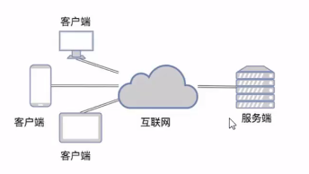
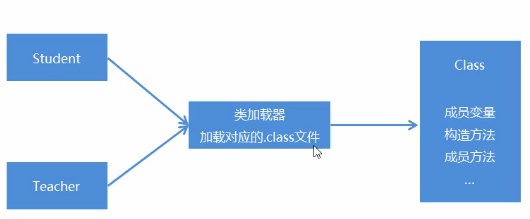

## 十五、 网络编程

### 1. 入门

#### 1.1 概述



计算机网络：

- 是指将地理位置不同的具有独立工能的多态计算机及外部设备，通过通信线路连接起来，在网络操作系统，网络管理软件即网络通信协议的管理和协调下，实现资源共享和信息传递的计算机系统

网络编程：

- 在网络通信协议下，实现网络互连的不同计算机上运行的程序间进行数据交换

#### 1.2 网络编程三要素

- IP地址
  - 要想让网络中的计算机能够互相通信，必须为每台计算机指定一个标识号，通过这个标识号来指定要接收数据的计算机和识别发送的计算机，而IP地址就是这个标识号，也就是设备的标识
- 端口
  - 网络的通信，本质上是两个应用程序的通信。每台计算机都有很多的应用程序，通过端口号可以唯一标识设备中的应用程序，也就是应用程序的标识
- 协议
  - 通过计算机网络可以使多台计算机实现连接，位于同一个网络中的计算机在进行连接和通信时需要遵守一定的规则，这就好比在道路中行驶的汽车一定要遵守交通规则一样。在计算机网络中，这些连接和通信的规则被称为网络通信协议，它对数据的传输格式、传输速率、传输步骤等做了统一规定，通信双方必须同时遵守才能完成数据交换，常见的协议有UDP和TCP协议

#### 1.3 IP地址

IP地址：是网络中设备的唯一标识

IP地址分为两大类：

- IPv4：是给每个连接在网络上的主机分配一个32bit地址。按照TCP/IP规定，IP地址用二进制来表示，每个IP地址长32bit，也就是4个字节。如一个采用二进制形式的IP地址是“11000000 10101000 00000001 01000010”，这么长的地址，处理起来不够方便，为了方便使用，IP地址经常被写成十进制形式，中间使用符号“.”分隔不同的字节。于是上面的地址可以表示为“192.168.1.66”。IP地址的这种表示法叫作“点分十进制表示法”，显然比0和1容易记忆
- IPv6：由于互联网的蓬勃发展，IP地址的需求量越来越大，但是网络地址资源有限，使得IP的分配越发紧张。为了扩大地址空间，IPv6重新定义地址空间，采用128位地址长度，每16个字节一组，分成8组十六进制数，这样就解决了网络地址资源数量不够的问题

常用命令：

- ipconfig：查看本机IP地址
- ping IP地址：检查网络是否连通

特殊IP地址：

- 127.0.0.1：是回送地址，可以代表本机地址，一般用来测试使用

#### 1.4 InetAddress的使用

为了方便对IP地址的获取和操作，JAVA提供了InetAddress类

InetAddress：表示Internet协议(IP)地址

| 方法名                                    | 说明                                                         |
| ----------------------------------------- | ------------------------------------------------------------ |
| static InetAddress getByName(String host) | 确定主机名称的IP地址。主机名称可以是机器名称，也可以是IP地址 |
| String getHostName()                      | 获取IP地址的主机名                                           |
| String getHostAddress()                   | 返回文本显示中的IP地址字符串                                 |

```java
InetAddress address = InetAddress.getByName("localhost");
// InetAddress address = InetAddress.getByName("127.0.0.1");

// localhost
System.out.println(address.getHostName());
// 127.0.0.1
System.out.println(address.getHostAddress());

InetAddress address1 = InetAddress.getByName("DESKTOP-5KH0KPQ");

// DESKTOP-5KH0KPQ
System.out.println(address1.getHostName());
// 192.168.2.4
System.out.println(address1.getHostAddress());
```

#### 1.5 端口

端口：设备上应用程序的唯一标识

端口号：用两个字节表示的整数，它的取值范围是0~65535。其中，0~1023之间的端口号用于一些知名的网络服务和应用，普通的应用程序需要使用1024以上的端口号。如果端口号被另外一个服务或应用所占用，会导致当前程序启动失败

#### 1.6 协议

协议：计算机网络中，连接和通信的规则被称为网络通信协议

UDP协议：

- 用户数据报协议
- UDP是无连接通信协议，即在数据传输时，数据的发送端和接收端不建立逻辑连接。简单来说，当一台计算机向另外一台计算机发送数据时，发送端不会确认接收端是否存在，就会发出数据，同样接收端在收到数据时，也不会向发送端反馈是否收到数据
- 由于UDP协议消耗资源小，通信效率高，所以通常会用于音频、视频和普通数据的传输，如视频通话、音频通话等不会因为少量丢包产生较大影响的场景

TCP协议：

- 传输控制协议
- TCP协议是**面向连接**的通信协议，即传输数据之前，在发送端和接收端建立逻辑连接，然后再传输数据，它提供了两台计算机之间**可靠无差错**的数据传输。在TCP连接中必须要明确客户端与服务器端，由客户端向服务端发送连接请求，每次连接的创建都需要经过”三次握手“
- 三次握手：TCP协议中，在发送数据的准备阶段，客户端与服务器之间的三次交互，以保证连接的可靠
  - 第一次握手，客户端向服务器端发出连接请求，等待服务器确认
  - 第二次握手，服务器端向客户端回送一个响应，通知客户端收到了连接请求
  - 第三次握手，客户端再次向服务器端发送确认信息，确认连接
- 完成三次握手，连接建立后，客户端和服务器就可以开始进行数据传输了。由于这种面向连接的特性，TCP协议可以保证传输数据的安全，如上传文件、下载文件、浏览网页等

### 2. UDP通信程序

#### 2.1 概述

UDP协议是一种不可靠的网络协议，它在通信的两端个建立一个Socket对象，但是这两个Socket只是发送，接收数据的对象。

因此对于基于UDP协议的通信双方而言，没有所谓的客户端和服务器端的概念。

Java提供了DatagramSocket类作为基于UDP协议的Socket

#### 2.2 UDP发送数据

```java
// 创建发送端的Socket对象
DatagramSocket datagramSocket = new DatagramSocket();

// 创建数据，并把数据打包
byte[] bys = "hello,UDP".getBytes(StandardCharsets.UTF_8);
int length = bys.length;
InetAddress address = InetAddress.getByName("192.168.2.4");
int port = 10086;
// 构造数据报
DatagramPacket dp = new DatagramPacket(bys, length, address, port);

// 调用DatagramSocket发送数据
datagramSocket.send(dp);

// 关闭发送端
datagramSocket.close();
```

#### 2.3 UDP接收数据

```java
 // 创建接收端的Socket对象
DatagramSocket datagramSocket = new DatagramSocket(10086);

// 调用DatagramSocket接收数据
byte[] bytes = new byte[1024];
DatagramPacket datagramPacket = new DatagramPacket(bytes, bytes.length);
datagramSocket.receive(datagramPacket);

// 解析数据报，并把数据打印在控制台
// 返回的是数据缓冲区
byte[] datas = datagramPacket.getData();
// 获取数据报实际长度
int len = datagramPacket.getLength();
String dataStr = new String(datas, 0, len, StandardCharsets.UTF_8);
System.out.println("数据是：" + dataStr);
// 关闭接收端
datagramSocket.close()
```

### 3. TCP通信程序

#### 3.1 TCP通信原理

TCP通信协议是一种可靠的网络协议，它在通信的两端各建立一个Socket对象，从而在通信的两端形成网络虚拟链路，一旦建立了虚拟的链路，两端的程序就可以通过虚拟链路进行通信。

Java对基于TCP协议的网络提供了良好的封装，使用Socket对象来代表两端的通信端口，并通过Socket产生IO流来进行网络通信。

Java为客户端提供了Socket类，为服务器端提供了ServerSocket类

#### 3.2 TCP发送数据

```java
// 创建socket对象
// Socket socket = new Socket(InetAddress.getByName("192.168.2.4"), 9000);
Socket socket = new Socket("192.168.2.4", 9000);

// 获取输出流，写数据
OutputStream stream = socket.getOutputStream();
stream.write("hello, server".getBytes(StandardCharsets.UTF_8));

// 释放资源
socket.close();
```

#### 3.3 TCP接收数据

```java
// 创建serverSocket对象
ServerSocket socket = new ServerSocket(9000);

// 等待连接，获取输入流
InputStream input = socket.accept().getInputStream();

// 打印输入流中数据
byte[] bytes = new byte[1024];
int len = input.read(bytes);
System.out.println("数据是" + new String(bytes, 0, len, StandardCharsets.UTF_8));

//释放资源
socket.close();
```

## 十六、 Lambda表达式

### 1. 函数式编程思想概述

在数学中，函数就是有输入量、输出量的一套计算方案，也就是“拿数据做操作”

面向对象思想强调“必须通过对象的形式来做事情”

函数式思想则尽量忽略面向对象的复杂语法：“强调做什么，而不是以书面形式做”

而Lambda表达式就是函数式思想的体现

### 2. 体验Lambda表达式

```java
// 实现类方式实现需求
MyRunnable my = new MyRunnalde();
Thread t = new Thread(my);
t.start();

// 匿名内部类的方式改进
new Thread(new Runable() {
    @Overide
    public void run() {
        System.out.println("多线程启动")
    }
}).start();

// lambda表达式
new Thread(() -> {
     System.out.println("多线程启动");
}).start();
```

### 3. Lambda表达式的标准格式

组成Lambda表达式的三要素：形式参数，箭头，代码块

- ()：为方法形式参数，如果有多个参数，参数之间用逗号隔开；如果没有参数，留空即可
- ->：用箭头指向后面要做的事情，固定写法，代表指向动作
- {}：包含一段代码，称之为代码块，可以看成是方法体中的内容

Lambda表达式的使用前提：

- 有一个接口

- 接口中有且仅有一个抽象方法

  ```java
  // 接口
  public interface Eatable {
  
      void eat();
  }
  
  // 使用
  public static void main(String[] args) {
      // 匿名内部类
      useEatable(new Eatable() {
          @Override
          public void eat() {
              System.out.println("hahaha");
          }
      });
  
      // lambda表达式
      useEatable(() -> {
          System.out.println("hahahah");
      });
  }
  
  private static void useEatable(Eatable e) {
      e.eat();
  }
  ```

  ### 4. Lambda表达式的省略方式

  ```java
  public static void main(String[] args)
      useEatable((int x, int y) -> {
          return x + y;
      });
      
      // lambda表达式的形参的参数类型可以省略，但是有过个参数的情况下，不能只省略一个或部分
  	useEatable((x, y) -> {
          return x + y;
      });
  
  	useFlyable((s) -> {
          System.out.println(s);
      });
  
  	// 如果参数有且仅有一个，那么小括号可以省略
  	useFlyable(s -> {
          System.out.println(s);
      });
  
  	// 如果代码块只有一条语句，那么大括号和分号可以省略
  	useFlyable(s -> System.out.println(s));
  
  	// 如果代码块只有一条语句，那么大括号和分号可以省略，如果有return，return也要省略掉
  	useEatable((x, y) -> x + y);
  }
  
  private static void useAddable(Addable a) {
      int sum = a.add(10, 20);
      System.out.println(sum);
  }
  
  public static void useFlyable(Flyable f) {
      f.fly("hehehhehehe")
  }
  ```

### 4. 注意事项

- 使用Lambda表达式必须要有接口，并且要求接口中有且仅有一个抽象方法
- 必须要有上下文环境，才能推导出Lambda对应的接口，即不能单独使用
  - 根据**局部变量的赋值**可以得知其对应的接口：`Runable r = () -> System.out.println("Lambda表达式");`
  - 根据**调用方法的参数**可以得知其对应的接口：`new Thread(() -> System.out.println("Lambda表达式")).start();`

### 5. Lambda表达式和匿名内部类的区别

所需类型不同

- 匿名内部类：可以是接口、抽象类、具体类
- Lambda表达式：只能是接口

使用限制不同

- 如果接口中有且仅有一个抽象方法，可以使用Lambda表达式，也可以使用匿名内部类
- 如果接口中多于一个抽象方法，只能使用匿名内部类，而不能使用Lambda表达式

实现原理不同

- 匿名内部类：编译之后，产生一个单独的.class字节码文件
- Lambda表达式：编译之后，没有一个单独的.class字节码文件，对应的字节码会在运行的时候动态生成

## 十七、 接口组成更新

### 1. JDK8后接口组成

- 常量
- 抽象方法
- 默认方法(Java8)
- 静态方法(Java8)
- 私有方法(Java9)

### 2. 接口中默认方法

- 默认方法不是抽象方法，所以不强制被重写。但是可以被重写，重写的时候去掉default关键字
- public 可以省略，default不能省略

```java
// public default 返回值类型 方法名(参数列表) {}
public interface MyInterface {

    void show1();

    void show2();

    // 默认方法，如果新增接口方法时就可以不影响之前写的实现类，提高了代码的可维护性
    default void show3() {
        System.out.println("show3 is default");
    }
}
```

### 3. 接口中静态方法

- 静态方法只能通过接口名调用，不能通过实现类或者对象名调用
- public 可以省略，static不能省略

```java
// public static 返回值类型 方法名(参数列表) {}

public interface MyInterface {

    void show1();

    void show2();
    
    static void show3() {
        System.out.println("show3 is static");
    }
}

// 使用,接口中的静态方法只能被接口调用，不能被对象或者实现类调用
MyInterface.show3();
```

### 4. 接口中私有方法

Java9中新增了带方法体的私有方法，其实在Java8中就埋下了伏笔：Java8运行在接口中定义带方法体的默认方法和静态方法。这样可能会引发一个问题：当两个默认方法或者静态方法中包含一段相同的代码实现时，程序必然考虑将这段实现代码抽取成一个共性方法，而这个共性方法是不需要让别人使用的，因此用私有给隐藏起来，其是Java9增加私有方法的必然性

- 默认方法可以调用私有的静态方法和非静态方法
- 静态方法只能调用私有的静态方法

```java
// private 返回值类型 方法名(参数列表) {}

public interface MyInterface {

    void show1();

    default void show2(){
        show3();
        show4();
    }

    private void show3() {
        System.out.println("show3 is private");
    }
    
    private static void show4() {
        System.out.println("show3 is private static");
    }
}
```

## 十八、 方法引用

### 1. 方法引用初识

```java
public interface Printable {

    void printString(String s);
}

public class PrintableDemo {

    public static void main(String[] args) {
        // lambda表达式
        usePrintable(s -> System.out.println(s));

        // lambda表达式结合方法引用
        // 当lambda表达式代码块中的操作有现成的实现方案，没有必要自己再实现一遍，可以直接引用该方法
        // 方法引用符：::
        // 可推导的就是可引用的，隐含的就是将lambda表达式的参数传递给了方法
        usePrintable(System.out::println);
    }

    private static void usePrintable(Printable p) {
        p.printString("hell, java");
    }
}
```

### 2. 方法引用符

**::**该符号位引用运算符，而它所在的表达式被称为方法引用

推导与省略

- 如果使用Lambda，那么根据“可推导就是可省略”的原则，无需指定参数类型，也无需指定重载形式，它们都将被自动推导
- 如果使用方法引用，也是同样可以根据上下文进行推导
- 方法引用是Lambda的孪生兄弟，即Lambda表达式中的操作有现场方案就可用方法引用替代

### 3. Lambda表达式支持的方法引用

#### 3.1 引用类方法（实例方法）

```java
// 类名::静态方法
// Lambda表达式被类方法替代的时候，它的形式参数全部被传递给静态方法作为参数
// Integer::parseInt
```

#### 3.2 引用对象的实例方法

```java
// 对象::成员方法
// Lambda表达式被对象实例方法替代的时候，它的形式参数全部被传递给该方法作为参数
// "HelloWorld"::toUppercase
// 接口定义
public interface Printer {
    void printUpperCase(String s);
}

// 实现操作的类
public class PrintString {

    public void printUpper(String s) {
        System.out.println(s.toUpperCase());
    }
}

public class PrinterDemo {

    public static void main(String[] args) {
        usePrinter(s -> System.out.println(s.toUpperCase()));

        // 使用对象实例方法引用
        usePrinter(new PrintString()::printUpper);
    }

    private static void usePrinter(Printer p) {
        p.printUpperCase("hello, java");
    }
}
```

#### 3.3 引用类的实例方法

```java
// 类名::成员方法
// Lambda表达式被类的实例方法替代的时候，它的形式参数全部被传递给该方法作为参数
// 第一个参数作为调用者
// 后面的参数全部传递给方法作为参数
// String::substring
public interface MyString {
    String mySubString(String s, int x, int y);
}

public class MyStringDemo {
    public static void main(String[] args) {
        useMyString((s, x, y) -> s.substring(x, y));

        // 使用类的实例方法
        useMyString(String::substring);
    }

    private static void useMyString(MyString myString) {
        String s = myString.mySubString("hello, java", 0, 6);
        System.out.println(s);
    }
}
```

#### 3.4 引用构造器

```java
// 类名::new
// Lambda表达式被构造器方法替代的时候
// Student::new
public interface StrundentBuilder {
    Student build(String name, Integer age);
}

public class StudentDemo {

    public static void main(String[] args) {
        useStudentBuilder((s, i) -> new Student(s, i));

        // 引用构造器方法替代
        useStudentBuilder(Student::new);
    }

    private static void useStudentBuilder(StrundentBuilder s) {
        Student curry = s.build("curry", 18);
        System.out.println(curry);
    }
}
```

## 十九、 函数式接口

### 1. 概述

函数式接口：有且仅有一个抽象方法的接口

Java中的函数式编程体现就是Lambda表达式，所以函数式接口就是可以适用于Lambda使用的接口，只有确保接口中有且仅有一个抽象方法，Java中的Lambda才能顺利地进行推导

```java
// 该注释注明该接口为函数式接口，并会校验该接口是否符合函数式接口的标准
// 建议都加上该注解，可以帮助识别是否为函数式接口
@FunctionalInterface
public interface MyInterface {
    void show();
}

public class MyInterfaceDemo {
    public static void main(String[] args) {
        // 作为局部变量使用
        MyInterface my = () -> System.out.println("函数式接口");

        my.show();
    }
}
```

### 2. 函数式接口作为方法的参数

```java
public class RunnableDemo {

    public static void main(String[] args) {
        // 采用匿名内部类实现
        startThread(new Runnable() {
            @Override
            public void run() {
                System.out.println("匿名内部类实现");
            }
        });

        // 采用lambda表达式作为方法参数实现
        startThread(() -> System.out.println("lambda表达式实现"));
    }

    // Runnable为函数式接口
    private static void startThread(Runnable r) {
        /*Thread t = new Thread(r);
        t.start();*/
        new Thread(r).start();
    }
}
```

### 3. 函数式接口作为方法的返回值

```java
public class ComparatorDemo {

    public static void main(String[] args) {
        List<String> arry = new ArrayList<>();

        arry.add("aaa");
        arry.add("a");
        arry.add("aa");
        arry.add("aaaa");
        arry.add("aaaaa");

        System.out.println("排序前：" + arry);

        arry.sort(getComparator());
        System.out.println("排序后：" + arry);
    }

    // 匿名内部类实现
    /*private static Comparator<String> getComparator() {
        return new Comparator<String>() {
            @Override
            public int compare(String o1, String o2) {
                return o1.length() - o2.length();
            }
        };
    }*/

    // lambda表达式实现
    private static Comparator<String> getComparator() {
        // return Comparator.comparingInt(String::length);
        return (o1, o2) -> o1.length() - o2.length();
    }
}
```

### 4. 常用的函数式接口

Java 8在java.util.function包下预定义了大量的函数式接口

以下为四个常用接口：

- Supplier接口
  - 主要是用来生成数据，方法：**get()**，返回值为泛型
  - Supplier<T>接口也被称为生产型接口，如果我们指定了接口的泛型是什么类型，那么接口中的get方法就会生产什么类型的数据
- Consumer接口
  - void accept(T t)：对给定的参数执行此操作
  - default Consumer<T> andThen(Consumer after)：返回一个组合的Consumer，一次执行此操作，然后执行after操作
  - 此接口也被称为消费型接口，它消费的数据的数据类型为泛型执行
- Predicate接口
  - boolean test(T t)：对给定的参数进行判断（判断逻辑由Lambda表达式实现，返回一个布尔值）
  - default Predicate<T> negate()：返回一个逻辑的否定，对应非
  - default Predicate<T> and(Predicate other)：返回一个组合判断，对应短路与
  - default Predicate<T> or(Predicate other)：返回一个组合判断，对应短路或
  - 此接口通常用于判断参数是否满足指定的条件
- Function接口
  - R apply(T t)：将此函数应用于给定的参数
  - default <V> Function andThen(Function after)：返回一个组合函数，首先该函数应用于输入，然后将after函数应用于结果
  - 此接口通常用于对参数进行处理，转换（处理逻辑由Lambda表达式实现），然后返回一个新的值

## 二十、 Stream流

### 1. 初识

```java
List<String> list = new ArrayList<>();

list.add("zhangsan");
list.add("lisi");
list.add("wangwu");
list.add("zhaoliu");

// Stream流把真正的函数式编程风格引入到了java中
// 将集合中z开头的元素存储到一个新的集合
List<String> zList = list.stream().filter(s -> s.startsWith("z")).collect(Collectors.toList());

System.out.println(zList);
```

### 2. Stream流的使用

- 生成流
  - 通过数据源(集合，数组等)生成流：`list.stream`
- 中间操作
  - 一个流后面可以跟随零个或多个中间操作，其目的主要是打开流，做出某种程度的数据过滤/映射，然后返回一个新的流交给下一个操作使用：`filter()`
- 终结操作
  - 一个流只能有一个终结操作，当这个操作执行后，流就被使用“光”了，无法再被操作，所以这必定是流的最后一个操作：`forEach()`

### 3. Stream流的生成方式

常见的生成方式：

- Collection体系的集合可以使用默认方法`stream()`生成流

- Map体系的集合间接的生成流

- 数组可以通过Stream接口的静态`of(T… values)`生成流

  ```java
  // Collection体系生成流
  List<String> list = new ArrayList<>();
  HashSet<String> set = new HashSet<>();
  
  Stream<String> listStream = list.stream();
  Stream<String> setStream = set.stream();
  
  // Map体系的集合间接生成流
  HashMap<String, Integer> map = new HashMap<>();
  Stream<String> keyStream = map.keySet().stream();
  Stream<Integer> valueStream = map.values().stream();
  Stream<Map.Entry<String, Integer>> entryStream = map.entrySet().stream();
  
  // 数组生成流
  String[] strings = new String[20];
  Stream<String> stringStream = Stream.of(strings);
  ```

### 4. Stream流的常见中间操作方法

| 方法名                                                       | 说明                                                         |
| ------------------------------------------------------------ | ------------------------------------------------------------ |
| Stream<T> filter(Predicate predicate)                        | 用于对流中的数据进行过滤                                     |
| Stream<R> map(Function<? super T,? extends R> mapper)        | 返回一个流，该流包含将给定函数应用于此流的元素的结果         |
| IntStream mapToInt(ToIntFunction<? super T> mapper)          | 返回`IntStream`其中包含将给定函数应用于此流的元素的结果      |
| Stream<T> limit(long maxSize)                                | 返回由此流的元素组成的流，截取前指定个参数                   |
| Stream<T> skip(long n)                                       | 在丢弃流的前`n`个元素后，返回由此流的其余元素组成的流        |
| static <T> Stream<T> concat(Stream<? extends T> a, Stream<? extends T> b) | 合并a和b两个流为一个流                                       |
| Stream<T> distinct()                                         | 返回由此流的不同元素（根据[`Object.equals(Object)`](https://www.apiref.com/java11-zh/java.base/java/lang/Object.html#equals(java.lang.Object)) ）组成的流 |
| Stream<T> sorted()                                           | 返回由此流的元素组成的流，按照自然顺序排序                   |
| Stream<T> sorted(Comparator<? super T> comparator)           | 返回由此流的元素组成的流，根据提供的`Comparator`进行排序     |

### 5. Stream流的常见终结操作方法

| 方法名                                   | 说明                     |
| ---------------------------------------- | ------------------------ |
| void forEach(Consumer<? super T> action) | 对此流的每个元素执行操作 |
| long count()                             | 返回此流中元素的数量     |

### 6. Stream流的收集操作（将流又转回集合）

- R collect(Collector collector)：收集方法的参数是一个Collector接口
- 工具类Collectors提供了具体的收集方式：
  - public static <T> Collector toList()：把元素收集到List集合中
  - public static <T> Collector toSet()：把元素收集到Set集合中
  - public static Collector toMap(Function keyMapper, Function valueMapper)：把元素收集到Map集合中

## 二十一、 反射

### 1. 类加载器

#### 1.1 类加载

当程序要使用某个类时，如果该类还未被加载到内存中，则系统会通过类的加载、连接、初始化这三个步骤来对类进行初始化。如果不出现意外情况，JVM将会连续完成这三个步骤，所以有时也把这三个步骤统称为类加载或者类初始化

- 类的加载
  - 就是指将class文件读入内存，并为之创建一个java.lang.Class对象
  - 任何类被使用时，系统都会为之建立一个java.lang.Class对象
- 类的连接
  - 验证阶段：用于检验被加载的类是否有正确的内部结构，并和其他类协调一致
  - 准备阶段：负责为类的类变量分配内存，并设置默认初始化值
  - 解析阶段：将类的二进制数据中的符号引用替换为直接引用
- 类的初始化
  - 该阶段，主要是对类变量进行初始化

类的初始化步骤：

- 假如类还未被加载和连接，则程序先加载并连接该类
- 假如该类的直接父类还未被初始化，则先初始化其直接父类
- 假如类中有初始化语句，则系统依次执行这些初始化语句

类的初始化时机：

- 创建类的实例
- 调用类的类方法
- 访问类或者接口的类变量，或者为该类变量赋值
- 使用反射方式来强制创建某个类或者接口对应的java.lang.Class对象
- 初始化某个类的子类
- 直接使用java.exe命令来运行某个主类

#### 1.2 类加载器

类加载器的作用

- 负责将.class文件加载到内存中，并为之生成对应的java.lang.Class对象

JVM的类加载机制：

- 全盘负责：就是当一个类加载器负责加载某个Class时，该Class所依赖的和引用的其他Class也将由该类加载器负责载入，除非显示使用另外一个类加载器来载入
- 父类委托：就是当一个类加载器负责加载某个Class时，先让父类加载器试图加载该Class，只有在父类加载器无法加载该类时才尝试从自己的类路径中加载该类
- 缓存机制：保证所有加载过的Class都会被缓存，当程序需要使用某个Class对象时，类加载器先从缓存区中搜索该Class，只有当缓存区中不存在该Class对象时，系统才会读取该类对应的二进制数据，并将其转换成Class对象，存储到缓存区

ClassLoader是负责加载类的对象，Java运行时具有以下内置类加载器：

- Bootstrap class loader（null）：它是虚拟机的内置类加载器，通常表示为null，并且没有父null

- Platform class loader（PlatformClassLoader）：平台类加载器可以看到所有平台类，平台类包括由平台类加载器或其祖先定义的Java SE平台API的实现类和JDK特定的运行时类

- System class loader（AppClassLoader）：它也被称为应用程序类加载器，与平台类加载器不同，系统类加载器通常用于定义应用程序类路径，模块路径和JDK特定工具上的类

  | 方法名                                    | 说明                       |
  | ----------------------------------------- | -------------------------- |
  | static ClassLoader getSystemClassLoader() | 返回用于委派的系统类加载器 |
  | ClassLoader getParent()                   | 返回父类加载器进行委派     |

### 2. 反射



#### 2.1 概述

Java反射机制：是指在运行时去获取一个类的变量和方法信息。然后通过获取到的信息来创建对象，调用方法的一种机制。由于这种动态性可以极大的增强程序的灵活性，程序不用再编译期就完成确定，在运行期仍然可以扩展。

#### 2.2 获取Class类的对象

要想通过反射去使用一个类，首先要获取到该类的字节码文件对象，也就是类型为Class类型的对象

三种方式获取Class类型的对象：

- 使用类的class属性来获取该类的Class对象，如Student.class将会返回Student类对应的Class对象

- 调用对象的getClass()方法，返回该对象所属类对应的Class对象，该方法是Object类中的方法，所有Java对象都可以调用该方法

- 使用Class类中的静态方法forName(String className)，该方法需要传入字符串参数，该字符串参数的值是某个类的全路径，也就是完整包的路径

  ```java
  // 全部相等，即各种方法获取的同一个类的Class对象为同一个
  // 使用类的class属性获取该类对应的Class对象
  Class<Student> c1 = Student.class;
  System.out.println(c1);
  
  Class<Student> c2 = Student.class;
  System.out.println(c1 == c2);
  System.out.println("--------------");
  
  // 使用getClass方法获取class对象
  Student student = new Student();
  Class<? extends Student> c3 = student.getClass();
  System.out.println(c1 == c3);
  System.out.println("-----------");
  
  // 使用静态方法forName获取
  Class<?> c4 = Class.forName("org.lql.test.Student");
  System.out.println(c1 == c4);
  ```

#### 2.3 反射获取构造方法并使用

| 方法名                                                       | 说明                             |
| ------------------------------------------------------------ | -------------------------------- |
| Constructor<?>[] getConstructors()                           | 返回所有公共构造函数对象数组     |
| Constructor<?>[] getDeclaredConstructors()                   | 返回类声明的所有构造函数对象数组 |
| Constructor<T> getConstructor(Class<?>... parameterTypes)    | 返回一个公共构造函数对象         |
| Constructor<T> getDeclaredConstructor(Class<?>... parameterTypes) | 返回一个构造函数对象             |

```java
// 获取class对象
Class<Student> c = Student.class;

// 获取构造方法
// 此方法获取到所有公有构造方法
// Constructor<?>[] cs = c.getConstructors();

// 此方法获取所有构造方法
Constructor<?>[] cs = c.getDeclaredConstructors();
for (Constructor<?> con : cs) {
System.out.println(con);
}

System.out.println("----------------");
// 获取指定构造方法
// 获取指定的公共构造方法，参数是要获取的构造方法的参数的个数和数据类型对应的字节码文件对象
Constructor<Student> con = c.getConstructor();
// 根据构造方法来创建对象，参数为构造函数对应的参数
Student student = con.newInstance();
System.out.println(student);

System.out.println("----------------");

// 通过setAccessible(boolean flag)：设置值为true时，方法取消访问检查
con1.setAccessible(true);
//返回任意的构造方法，包括私有和默认
Constructor<Student> con1 = c.getDeclaredConstructor(String.class, int.class);
// 创建对象
Student curry = con1.newInstance("curry", 18);
System.out.println(curry);
```

#### 2.4 反射获取成员变量和使用

| 方法名                              | 说明                                                         |
| ----------------------------------- | ------------------------------------------------------------ |
| Field[] getFields()                 | 返回所有可访问公共字段对象数组                               |
| Field[] getDeclaredFields()         | 返回所有字段对象数组                                         |
| Field getField(String name)         | 返回指定公共成员字段对象， `name`参数是`String`指定所需字段的简单名称 |
| Field getDeclaredField(String name) | 返回指定成员字段对象                                         |

```java
 // 获取class对象
 Class<Student> c = Student.class;

// 获取所有公共成员变量
Field[] fields = c.getFields();
System.out.println(Arrays.toString(fields));
System.out.println("---------------");

// 获取所有成员变量
Field[] fields1 = c.getDeclaredFields();
System.out.println(Arrays.toString(fields1));
System.out.println("---------------");

// 根据名称获取所有成员变量
// c.getDeclaredField("name")

// 根据名称获取获取单个公共成员变量
Field address = c.getField("address");
// 通过反射使用成员变量
Constructor<Student> constructor = c.getConstructor();
Student student = constructor.newInstance();

// 给address成员变量赋值
address.set(student, "西安");
```

#### 2.5 反射获取成员方法并使用

| 方法名                                                       | 说明                                         |
| ------------------------------------------------------------ | -------------------------------------------- |
| Field[] getMethods()                                         | 获取所有公共成员方法对象数组，包含继承的方法 |
| Field[] getDeclaredMethods()                                 | 获取所有成员方法对象数组，只有本类的方法     |
| Field getMethod(String name, Class<?>… parameterTypes)       | 返回指定公共成员方法对象                     |
| Field getDeclaredMethod(String name, Class<?>… parameterTypes) | 返回指定成员方法对象                         |

```java
// 获取class对象
Class<Student> c = Student.class;

// 获取所有公共成员方法，包含继承的方法
Method[] methods = c.getMethods();
System.out.println(Arrays.toString(methods));
System.out.println("---------------");

// 获取所有成员方法，只有本类的方法
Method[] methods1 = c.getDeclaredMethods();
System.out.println(Arrays.toString(methods1));
System.out.println("---------------");

// 根据名称获取所有成员方法
// c.getDeclaredMethod("name", .....)

// 根据名称及参数类型列表获取单个公共成员方法
Method method2 = c.getMethod("method2", String.class);
// 通过反射使用成员变量
Constructor<Student> constructor = c.getConstructor();
Student student = constructor.newInstance();

// 调用方法
method2.invoke(student, "西安");
```


