## 一、java概述

### 1. Java语言发展史

#### 1.1 Java语言

- 语言：人与人交流沟通的表达方式
- 计算机语言：人与计算机之间进行信息交流沟通的一种特殊语言
- Java语言：Sun公司1995年推出

#### 1.2 Java语言发展史

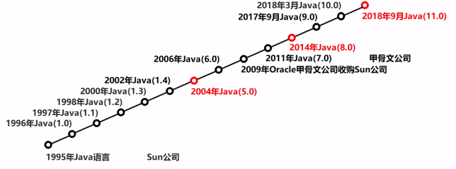

### 2. Java语言跨平台原理

#### 2.1 平台

指的是操作系统

- windows
- linux

#### 2.2 跨平台

在需要运行**Java应用**程序的操作系统上，安装一个与操作系统对应的Java虚拟机（**JVM—Java Virtual Machine**）即可。

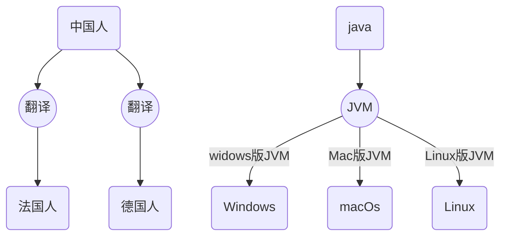

### 3. JRE和JDK

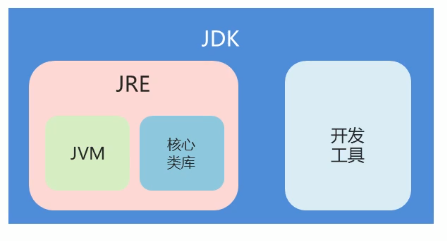

#### 3.1 JRE

- Java Runtime Environment：是Java程序的运行时环境，包含**JVM**和运行时所需要的核心类库
- **运行**一个已有的Java程序，只需要安装**JRE**即可

#### 3.2 JDK

- Java Development Kit：是Java程序开发工具包，包含**JRE**和开发人员使用的工具
- 开发工具：**编译工具（javac.exe）**和**运行工具(java.exe)**
- **开发**一个全新的Java程序必须安装**JDK**

### 4. JDK的下载和安装

#### 4.1 下载地址

```
https://www.oracle.com/java/technologies/javase-jdk11-downloads.html
```

#### 4.2 安装后目录

| 目录名称 | 说明                                           |
| -------- | ---------------------------------------------- |
| bin      | 该路径下存放了JDK的各种工具命令。如javac和java |
| conf     | 该路径下存放了JDK的相关配置文件                |
| include  | 该路径下存放了一些平台特定的头文件             |
| jmods    | 该路径下存放了JDK的各种模块                    |
| legal    | 该路径下存放了JDK各模块的授权文档              |
| lib      | 该路径下存放了JDK工具的一些补充JAR包           |

#### 4.3 环境变量配置

要使用的工具都在jdk安装目录下，使用时必须每次都指定到安装目录的路径，可以将此路径配置到环境变量，这样就能能方便的在全局下直接使用jdk的各种工具：

- 将安装后的**bin**目录路径配置到操作系统的**path环境变量**中
- 将安装后的**jre/bin**目录路径也配置到操作系统的**path环境变量**中
- 将安装后的**lib和lib/tool.jar**路径配置到操作系统的**classpath环境变量**中
- 在命令行使用`java -version`及`javac -version`来测试是否安装及配置成功

### 5. Java开发初识

Java程序开发流程：**编写程序、编译程序、运行程序**

- 编写java程序的.java文件
- 编译：**javac** HelloWorld.java
- 运行：**java**  HelloWorld

### 6. 常用DOS命令

#### 6.1 打开命令提示符

- 按下win + R
- 输入cmd

#### 6.2 常用命令

| 操作                | 说明                               |
| ------------------- | ---------------------------------- |
| 盘符名称:           | 盘符切换。如E: 回车，表示切换到E盘 |
| dir                 | 查看当前路径下的内容               |
| cd 目录             | 进入单级目录                       |
| cd ..               | 回退到上一级目录                   |
| cd 目录1\目录2\ ... | 进入多级目录                       |
| cd \                | 回退到盘符目录                     |
| cls                 | 清屏                               |
| exit                | 退出命令提示符                     |
| ipconfig            | 查看本机的相关网络配置             |

## 二、 基础语法

### 1. 注释

#### 1.1 概述

- 注释是在程序**指定位置**添加的**说明信息**
- 注释不参与程序运行，仅起到**说明作用**

#### 1.2 注释分类

- 单行注释

  ```java
  // 注释信息
  ```

- 多行注释

  ```java
  /* 注释信息 */
  ```

- 文档分类

  ```java
  /** 注释信息 */
  ```

### 2. 关键字

#### 2.1 概述

**关键字**：就是被Java语言赋予了特定含义的单词

#### 2.2 关键字特点

关键字的字母**全部小写**

### 3. 常量

#### 3.1 定义

**常量**：在程序运行中，其值不可以发生改变的量。

#### 3.2 常量分类

| 常量类型   | 说明                           |
| ---------- | ------------------------------ |
| 字符串常量 | 用双引号括起来的内容           |
| 整数常量   | 不带小数的数字                 |
| 小数常量   | 带小数的数字                   |
| 字符常量   | 用单引号括起来的内容           |
| 布尔常量   | 布尔值，表示真假               |
| 空常量     | 一个特殊的值，空值，值是：null |

### 4. 数据类型

#### 4.1 计算机的存储单元

计算机可以用来存储数据，但是无论是内存还是硬盘，计算机存储设备的**最小信息单元**叫**位（bit）**，称之为**比特位**，通常用小写的字母**b**表示。而计算机中**最小的存储单元**叫**字节（byte）**，通常用大写字母**B**表示，字节是有连续的8个位组成。

存储单位换算：

```
1B = 8bit
1KB = 1024B
1MB = 1024KB
1GB = 1024MB
1TB = 1024GB
```

#### 4.2 数据类型

JAVA语言是强类型语言，对于每一种数据都给出了明确的数据类型，不同的**数据类型**也分配了不同的**内存空间**，表示的**数据大小**也是不一样的。

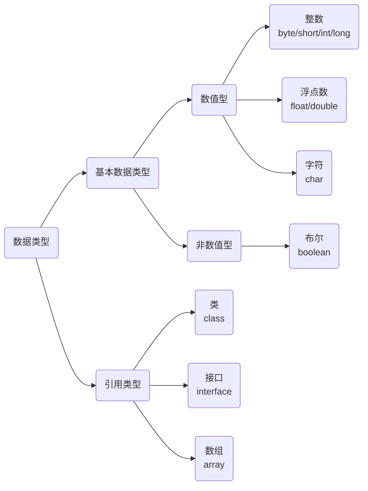

#### 4.3 数据类型占用和取值范围

<table>
    <thead>
    	<tr>
        	<th>数据类型</th>
            <th>关键字</th>
            <th>内存占用</th>
            <th>取值范围</th>
        </tr>
    </thead>
    <tbody>
    	<tr>
        	<td rowspan="4" style="vertical-align:middle">整数</td>
            <td>byte</td>
            <td>1</td>
            <td>-128~127</td>
        </tr>
        <tr>
            <td>short</td>
            <td>2</td>
            <td>-32768~32767</td>
        </tr>
        <tr>
            <td>int（默认）</td>
            <td>4</td>
            <td>-2<sup>31</sup>~2<sup>31</sup>-1</td>
        </tr>
        <tr>
            <td>long</td>
            <td>8</td>
            <td>-2<sup>63</sup>~2<sup>63</sup>-1</td>
        </tr>
        <tr>
        	<td rowspan="2" style="vertical-align:middle">浮点数</td>
            <td>float</td>
            <td>4</td>
            <td>
                负数：-3.402823E+38~-1.401298E-45<br>
                正数：1.401298E-45~3.402823E+38
            </td>
        </tr>
        <tr>
            <td>double（默认）</td>
            <td>8</td>
            <td>
                负数：-1.797693E+308~-4.9000000E-324<br>
                正数：4.9000000E-324~1.797693E+308
            </td>
        </tr>
        <tr>
        	<td>字符</td>
            <td>char</td>
            <td>2</td>
            <td>
                0~65535
            </td>
        </tr>
        <tr>
        	<td>布尔</td>
            <td>boolean</td>
            <td>1</td>
            <td>
                ture，false
            </td>
        </tr>
    </tbody>
</table>

### 5. 变量

#### 5.1 概述

**变量**：在程序运行过程中，其值可以发送改变的量

本质上，变量是内存中一小块区域

#### 5.2 变量定义

格式：数据类型 变量名 = 变量值，如`int a  = 10;`

#### 5.3 变量的使用

- 取值：直接使用变量名
- 修改值：变量名 = 变量值，如`a = 20;`

#### 5.4 变量使用的注意事项

- 变量名不能重复
- 定义变量必须初始化值才能使用
- 整数定义默认为int，要定义long时要在值后面跟上L或l
- 浮点数定义默认为double，定义float是在值后面加上F或f

### 6. 标识符

#### 6.1 概述

**标识符**：就是给类、方法、变量等起名字的**符号**

#### 6.2 标识符定义规则

- 由数字、字母、下划线、美元符组成
- 不能以数字开头
- 不能是关键字
- 区分大小写

#### 6.3 常见命名约定

- 小驼峰命名：针对**方法、变量**
  - 标识符是一个单词时，首字母小写
  - 标识符由多个单词组成时，第一个单词首字母小写，其他单词首字母大写，即驼峰命名

- 大驼峰命名：**类、接口**
  - 标识符是一个单词时，首字母大写
  - 标识符由多个单词组成时，每个单词首字母大写

### 7. 类型转换

#### 7.1 自动类型转换

把一个表示**数据范围小的数值**或者**变量**赋值给另一个表示**数据范围大的变量**

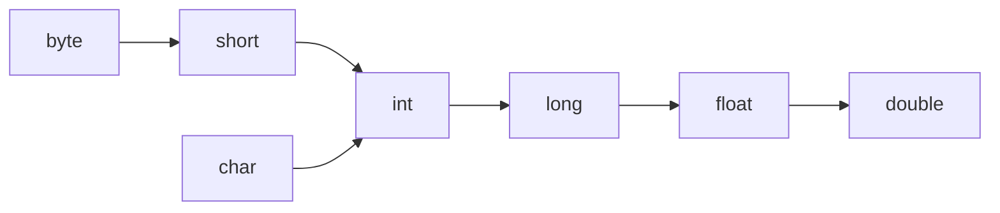

#### 7.2 强制类型转换

把一个表示**数据范围大的数值**或者**变量**赋值给另一个表示**数据范围小的变量**

- 格式： **目标数据类型**   **变量名** = **(目标数据类型)** **值或者变量**
- 强制类型转换会造成精度丢失

## 三、运算符

### 1. 算数运算符

#### 1.1 运算符和表达式

- 运算符：对常量或者变量进行操作的**符号**
- 表达式：用**运算符**把常量或者变量连接起来**符合java语法的式子**。不同运算符连接的表达式体现的是不同类型的表达式

#### 1.2 运算符优先级

| 优先级 | 运算符                                           | 结合性   |
| ------ | ------------------------------------------------ | -------- |
| 1      | ()、[]、{}                                       | 从左向右 |
| 2      | !、+、-、~、++、--                               | 从右向左 |
| 3      | *、/、%                                          | 从左向右 |
| 4      | +、-                                             | 从左向右 |
| 5      | «、»、>>>                                        | 从左向右 |
| 6      | <、<=、>、>=、instanceof                         | 从左向右 |
| 7      | ==、!=                                           | 从左向右 |
| 8      | &                                                | 从左向右 |
| 9      | ^                                                | 从左向右 |
| 10     | \|                                               | 从左向右 |
| 11     | &&                                               | 从左向右 |
| 12     | \|\|                                             | 从左向右 |
| 13     | ?:                                               | 从右向左 |
| 14     | =、+=、-=、*=、/=、&=、\|=、^=、~=、«=、»=、>>>= | 从右向左 |

#### 1.2 算数运算符

| 符号 | 作用 |
| ---- | ---- |
| +    | 加   |
| -    | 减   |
| *    | 乘   |
| /    | 除   |
| %    | 取余 |

- 整数操作只能得到整数，要想得到小数，必须有浮点数参与运算
- 字符“+”操作：拿字符在计算机底层**对应的数值**来进行计算，即使用字符的ASCII码来进行计算
- 字符串“+”操作：字符串参与加操作时并不是进行**加法操作**，而是进行字符串**拼接操作**，此时加号为**字符串连接符**
- 算数表达式中**包含多个基本数据类型**的值时，整个算数表达式的**类型**会自动提升
  - byte类型，short类型和char类型将被提升到int类型
  - 整个表达式的类型自动提升到表达式中最高等级操作数同样的类型

### 2. 赋值运算符

扩展的赋值运算符底层隐含了**强制类型转换**，注意与算数运算符的自动提升区别

```java
short s = 10;
// 两者并不等价
// 此时隐含了20从int强转为short
s += 20;
// 此时会报错，因为运算符操作会有类型自动提升，s + 20结果为int
s = s + 20;
// 必须强转
s = (short)(s + 20)
```

| 符号 | 说明                                           |
| ---- | ---------------------------------------------- |
| =    | 把常量或变量的值赋值给运算符左边的变量         |
| +=   | 把左边和右边的数据做加法操作，结果赋值给左边， |
| -=   | 把左边和右边的数据做减法操作，结果赋值给左边   |
| *=   | 把左边和右边的数据做乘法操作，结果赋值给左边   |
| /=   | 把左边和右边的数据做除法操作，结果赋值给左边   |

### 3. 自增自减运算符

自增、自减运算符单独使用时，放在前面和放在后面并没有区别

| 符号 | 说明                            |
| ---- | ------------------------------- |
| ++i  | 参与操作时，先自增1，后返回结果 |
| - -i | 参与操作时，先自减1，后返回结果 |
| i++  | 参与操作时，先返回结果，后自增1 |
| i- - | 参与操作时，先返回结果，后自减1 |

### 4. 关系运算符

| 符号 | 说明                                                      |
| ---- | --------------------------------------------------------- |
| ==   | a == b，判断a和b的值是否相等，成立为true，不成立为false   |
| !=   | a != b，判断a和b的值是否不相等，成立为true，不成立为false |
| >    | a > b，判断a是否大于b，成立为true，不成立为false          |
| >=   | a >= b，判断a是否大于等于b，成立为true，不成立为false     |
| <    | a < b，判断a是否小于b，成立为true，不成立为false          |
| <=   | a <= b，判断a是否小于等于b，成立为true，不成立为false     |

### 5. 逻辑运算符

**逻辑运算符**是用来**连接关系表达式**的运算符，逻辑运算符也可以直接**连接布尔类型的常量或者变量**。

逻辑运算符有短路效果。

| 符号 | 作用   | 说明                                                         |
| ---- | ------ | ------------------------------------------------------------ |
| &&   | 逻辑与 | 当且仅当两个操作数都为真，条件才为真                         |
| \|\| | 逻辑或 | 如果任何两个操作数任何一个为真，条件为真                     |
| !    | 非     | 用来反转操作数的逻辑状态。如果条件为true，则逻辑非运算符将得到false。 |

### 6. 位运算符

位运算符作用在所有的位上，并且按位运算

| 符号 | 作用           | 说明                                                         |
| ---- | -------------- | ------------------------------------------------------------ |
| &    | 按位与         | 如果相对应位都是1，则结果为1，否则为0                        |
| \|   | 按位或         | 如果相对应位都是 0，则结果为 0，否则为 1                     |
| ^    | 按位异或       | 如果相对应位值相同，则结果为0，否则为1                       |
| ~    | 按位取反       | 按位取反运算符翻转操作数的每一位，即0变成1，1变成0。         |
| <<   | 按位左移       | 按位左移运算符。左操作数按位左移右操作数指定的位数。左移一位相当于乘以2 |
| >>   | 按位右移       | 按位右移运算符。左操作数按位右移右操作数指定的位数。右移一位相当于除以2 |
| >>>  | 无符号按位右移 | 按位右移补零操作符。左操作数的值按右操作数指定的位数右移，移动得到的空位以零填充。正数和按位右移一样除以2 |

### 7. 三元运算符

格式：关系表达式 ? 表达式1 ：表达式2

- 首先计算**关系表达式的值**
- 如果值为**true**，返回**表达式1的值**
- 如果值为**false**，返回**表达式2的值**

### 8. 数据输入

Scanner使用的基本步骤

- 导包

  ```java
  // 导包的动作必须出现在类定义的上面
  import java.util.Scanner;
  ```

- 创建对象

  ```java
  Scanner s = new Scanner(Systm.in);
  ```

- 接收数据

  ```java
  int i = s.nextInt()
  ```

## 四、 流程控制

### 1. 流程控制分类

- 顺序结构：以分号结尾，表示一条语句的结束
- 分支结构（if、switch）：
  - 一对大括号表示if的整体结构，整体描述一个完整的if语句
  - 一对大括号表示switch的整体结构，整体描述一个完整的switch语句
- 循环结构（for、while、do…while）：
  - 一对大括号表示for的整体结构，整体描述一个完整的for语句
  - 一对大括号表示while的整体结构，整体描述一个完整的while语句
  - do…while以分号结尾，整体描述一个完整的do…while语句

### 2. 顺序结构

顺序机构是程序中最简单最基本的流程控制，没有特定的语法结构，按照代码的先后顺序依次执行，程序中大多数的代码都是这样执行。

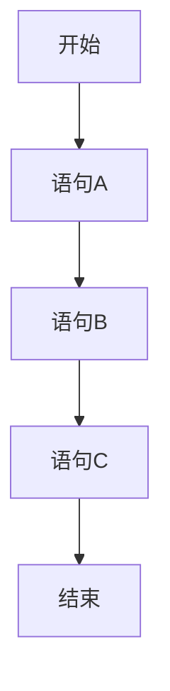

### 2. 分支结构

#### 2.1 if语句

```java
// 格式1
if(关系表达式) {
    语句体;
}

// 格式2
if(关系表达式) {
    语句体1;
}else{
    语句体2;
}

// 格式3
if(关系表达式) {
    语句体1;
}else if(关系表达式) {
    语句体2;
}else {
    语句体3;
}
```

执行流程：

- 首先从第一个关系表达式开始计算关系表达式的值
- 如果关系表达式的值为true就执行该if块中的语句体，并且不会在进入其他else if或else块
- 如果关系表达式的值为false就不执行该if块中的语句体，继续执行后面的else if或else块
- 继续执行后续语句

#### 2.2 switch语句

- 表达式取值为byte、short、char，JDK5以后可以是枚举，JDK7以后可以是String
- case后面跟的是要和表达式进行比较的值
- break表示中断、结束的意思，用来结束switch语句，如果case中没有使用break中断，会继续穿透到下一个case中，直到碰到break
- default表示所有情况都不匹配的时候，就执行该处的内容

```java
swtich(表达式) {
    case 值1:
    	语句体1;
    	break;
    case 值2:
    	语句体2;
    	break;
    ...
    default:
    	语句体n+1;
    	break;
}
```

### 3.  循环结构

循环结构的组成：

- **初始化语句**：用于表示循环开启时的起始状态
- **条件判断语句**：用于表示循环执行的条件
- **循环体结构**：用于表示循环执行的内容
- **条件控制语句**：用于表示循环执行中每次变化的内容，并使用该内容在**条件判断语句**中进行判断是否结束循环

#### 3.1 for循环

```java
// 如果初始化语句、条件判断语句、条件控制语句都为空则此时为死循环，即循环不会停止
for(初始化语句;条件判断语句;条件控制语句) {
	循环体语句;
}
```

执行流程：

- 执行初始化语句
- 执行条件判断语句，
  - 结果为true则执行循环体语句
  - 结果为false则结束循环
- 执行条件控制语句
- 回到条件判断语句，继续进行判断及后续步骤

#### 3.2 while循环

```java
初始化语句
while(条件判断语句) {
    循环体语句;
    条件控制语句;
}
```

执行流程：

- 执行初始化语句
- 执行条件判断语句，
  - 结果为true则执行循环体语句
  - 结果为false则结束循环
- 执行条件控制语句
- 回到条件判断语句，继续进行判断及后续步骤

#### 3.3 do…while循环

```java
// 至少执行一次
初始化语句
do{
	循环体语句;
	条件控制语句;
}while(条件判断语句)
```

执行流程：

- 执行初始化语句
- 执行循环体语句
- 执行条件控制语句
- 执行条件判断语句，
  - 结果为true则继续执行循环体语句
  - 结果为false则结束循环

#### 3.4 三种循环的区别

- for循环和while循环先判断条件是否成立，然后决定是否执行循环体
- do…while循环先执行一次循环体，然后判断条件是否成立，决定是否继续执行循环体

#### 3.5 跳转控制语句

- continue用在循环中，基于条件控制，跳过某次循环体内容的执行，继续下一次的执行
- break用在循环中，基于条件控制，终止循环体内容的执行，直接结束当前的整个循环

#### 3.6 循环嵌套

任何语句语句对外都可以看成语句话，一条代码，分支语句中包含分支语句称为**分支嵌套**，循环语句中包含循环语句称为**循环嵌套**

```java
for(;;){
	for(;;) {
	
	}
}
```

### 4. Random

该类用于产生一个随机数，使用步骤：

- 导包

  ```java
  import java.util.Random;
  ```

- 创建对象

  ```java
  Random random = new Random();
  ```

- 获取随机数

  ```java
  // 获取数据的范围：[0, 10)
  int number = random.nextInt(10)
  ```

## 五、 数组

### 1. 数组定义格式

#### 1.1 概述

数组（array）是一种用于存储**多个相同类型**数据的存储模型。

#### 1.2 数组的定义格式

```java
// 两种格式使用上没什么区别，只是读的时候有些许区别
// 格式一
// 定义了一个int类型的数组，数组名是arr
// 数据类型[] 变量名
int[] arr;

// 格式二
// 定义了一个int类型的变量，变量名是arr数组
// 数据类型 变量名[]
int arr[];
```

### 2. 数组初始化

#### 2.1 初始化概述

Java中的数组必须先初始化，然后才能使用。

所谓的**初始化**就是为数组中的**数组元素分配内存空间**，并为**每个数组元素赋值**。

数组在初始化时，会为内存空间添加默认值：

- 整数：默认值0
- 浮点数：默认值0.0
- 布尔值：默认值false
- 字符：默认值是空字符
- 引用数据类型：默认值是null，表示不指向任何对象

#### 2.2 动态初始化

初始化时只指定数组长度，由系统为数组分配初始化值。

```java
// 数据类型[] 变量名 = new 数据类型[数组长度]
int[] arr = new int[3];
```

#### 2.3 静态初始化

初始化时指定每个数组元素的初始值，由系统决定数组长度

```java
// 数据类型[] 变量名 = new 数据类型[]{数据1, 数据2,....}
int[] arr = new int[]{1, 2, 3};

// 可简化为
// 数据类型[] 变量名 = {数据1, 数据2,....}
int[] arr = {1, 2, 3};
```

### 3. 数组元素访问

- 数组变量访问方式：`数组名`
- 数组内部保存的数据的访问方式：`数组名[索引]`
- 索引是数组中数据的编号方式，用于访问数组中的数据，**数组名[索引]**等同于变量名，是一种特殊的变量名
  - 索引从0开始
  - 索引是连续的
  - 索引逐一递增，每次加1

### 4. 内存分配

#### 4.1 Java中内存分配

Java程序在运行时，需要在内存中分配空间。为了提高运算效率，就对空间进行了不同区域的划分，每一片区域都有特定的处理数据方式和内存管理方式。

- 栈内存：存储局部变量，即定义在方法中的变量，使用完毕，立即销毁，如每一个new出来的东西都有一个地址值，使用完毕会在垃圾回收器空闲时被回收
- 堆内存：存储new出来的内容（实体，对象）

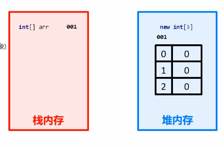

#### 4.2 数组内存图（单个数组）

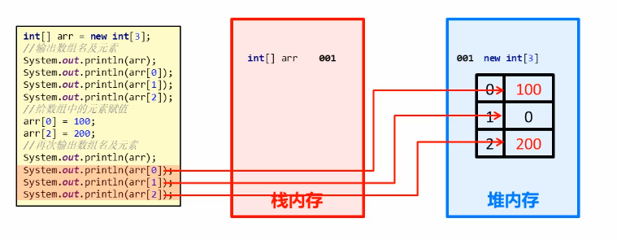

#### 4.3 数组内存图（多个数组）

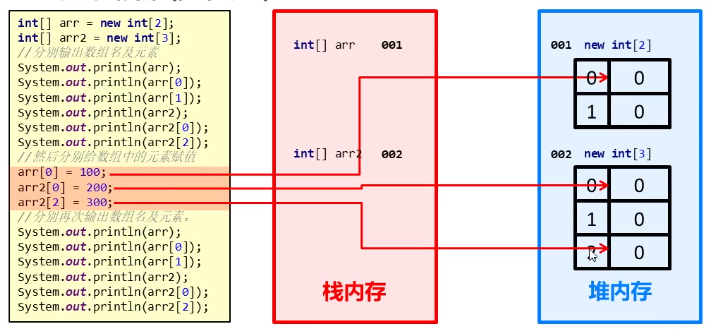

4.4 多个数值指向相同内存图

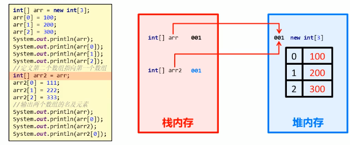

### 5. 数组操作的两个常见小问题

- 索引越界（ArrayIndexOutOfBoundsException）

  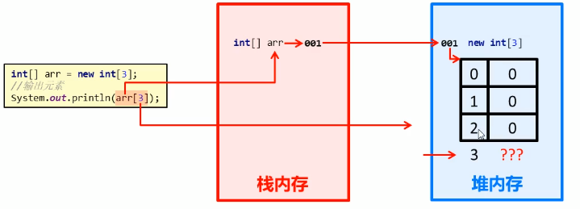

- 空指针异常（NullPointerException）

  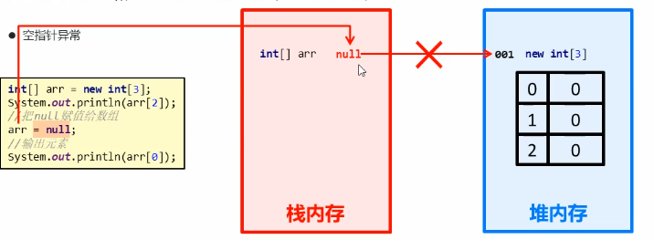

### 6. 数组常见操作

#### 6.1 遍历

```java
// 遍历数组中的元素
int[] arr = new int[3];

// arr.length获取数组的元素个数
for (int i = 0; i < arr.length; i++) {
    System.out.println("arr[i] = " + arr[i]);
}

 for (int item : arr) {
     System.out.println("item = " + item);
 }
```

#### 6.2 获取最值

```javascript
int[] arr = {12, 45, 98, 73, 60};
int max = arr[0];
int min = arr[0];
for (int i = 0; i < arr.length; i++) {
    if (arr[i] > max) {
        max = arr[i];
    }

    if (arr[i] < min) {
        min = arr[i];
    }
}

System.out.println("max = " + max);
System.out.println("min = " + min);
```

