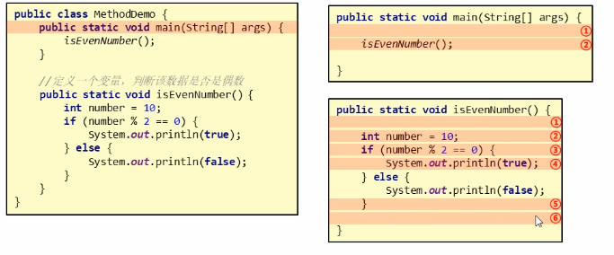
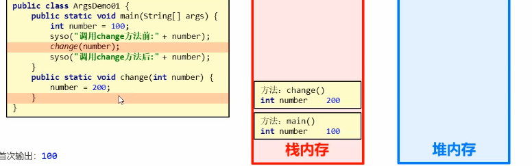
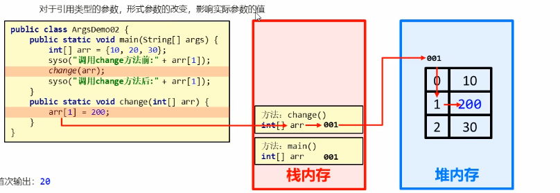
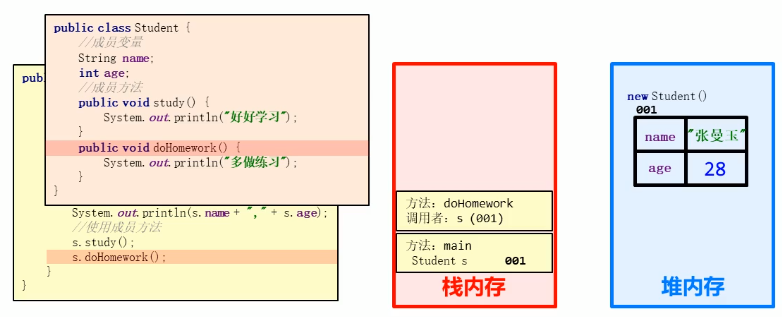
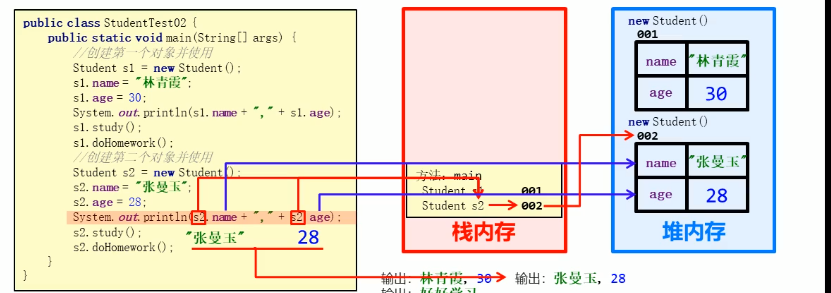
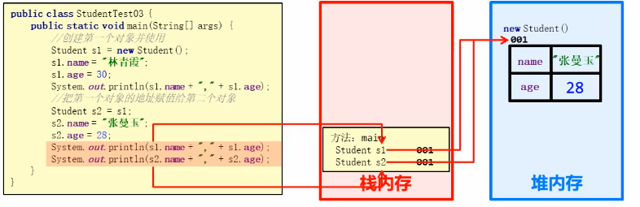

## 六、 方法

### 1. 概述

- **方法（method）**是将具有独立功能的**代码块**组织成一个整体，使其具有特殊功能的**代码集**

- 方法必须先创建才可以使用，该过程称为方法定义

- 在同一个类中方法名不能重复，重载除外

- 方法创建后并不是直接运行的，需要手动使用后才执行，该过程称为方法调用

- 定义方法的通用格式

  ```java
  // public static：修饰符
  // 返回值类型：方法操作完毕之后返回数据的数据类型，如果没有数据返回，此处写void，而且方法体中一般不写return
  // 方法名：调用方法时使用的标识
  // 参数：由数据类型和变量名组成，多个参数之间用逗号隔开
  // 方法体：完成功能的代码块
  // return：如果方法操作完毕，有数据返回，用于把数据返回给调用者，同时也是方法的出口
  public static 返回值类型 方法名(参数) {
  	方法体;
  	return 数据;
  }
  ```

### 2. 方法的定义和调用

#### 2.1 方法定义

```java
public static void 方法名() {
	// 方法体
}
```

#### 2.2 方法调用

```java
// 方法名();
public static void test() {
	// 方法体
}

test();
```

#### 2.3 方法调用过程



### 3. 带参方法的定义和调用

#### 3.1 带参方法的定义

- 方法定义时参数中的**数据类型**与**变量名**都不能缺少，缺少任意一个程序都将报错
- 方法定义时多个参数使用**逗号（,）**分隔

```java
// public static void 方法名(数据类型  变量名1, 数据类型  变量名2,....) {... ...}
public static void demo(int number) {}
```

#### 3.2 带参方法调用

方法调用时，**参数的数量和类型**必须与**方法定义中的数量、类型一一对应**，否则程序报错

```java
// 方法名(变量名1/常量值1, 变量名2/常量值2....)
demo(1)
```

#### 3.3 形参和实参

- 形参：方法定义中的参数，等同于变量定义
- 实参：方法调用中的参数，等同于使用变量或常量

### 4. 带返回值方法的定义和调用

#### 4.1 带返回值方法的定义

方法定义时return后面的返回值与方法定义上的数据类型要匹配，否则报错

```java
// public static 数据类型 方法名(数据类型  变量名1, 数据类型  变量名2,....) {
//	return 数据;
// }
public static int demo(int number) {
    // 方法体语句
	return number;
}
```

#### 4.2 带返回值方法的调用

方法的返回值通常使用变量接收，否则该返回值将无意义

```java
// 数据类型 变量名 = 方法名(参数);
int number = demo(5);
```

### 5. 方法的注意事项

- 方法不能嵌套定义
- void表示无返回值，可以省略return，也可以单独书写return，后面不加数据，表示从方法返回，即方法的出口
- 定义方法时要明确返回值类型，如果无返回值写void，如果有返回值，写返回值对应的数据类型
- 定义方法时必须要明确参数的类型和数量
- 方法调用时，void类型的方法，直接调用即可；非void类型的方法，推荐用变量接收调用

### 6. 方法重载

#### 6.1 概述

方法重载指同一个类中定义的多个方法之间的关系，满足下列条件的多个方法相互构成重载：

- 多个方法在同一个类中
- 多个方法具有相同的方法名
- 多个方法的参数不同，类型不同或者数量不同

#### 6.2 方法重载特点

- 重载仅对应方法的定义，与方法的调用无关，调用方式不变
- 重载仅针对同一个类中方法名称和参数进行识别，与返回值无关，即不能通过返回值来判定两个方法是否相互构成重载

### 7. 方法的参数传递

#### 7.1 传递基本类型

对于基本数据类型的参数，形式参数的改变，不影响实际参数的值。本质上是将实参的值拷贝了一份给形参，二者互不影响。



#### 7.2 传递引用类型

对于引用类型的参数，形参的改变，影响实参的值。这里的形参改变仅仅指的改变堆内存中元素的变化，并非是整体改变。本质上还是跟基本类型传递一样，是将实参的值拷贝了一份给形参，而实参的值正是引用的地址指向，当形参发生了整体改变时，即new或者其它操作，改变了它的地址指向并不会影响实参。



## 七、 面向对象基础

### 1. 类和对象

#### 1.1 什么是对象

万物皆对象，客观存在的事务皆为对象。

#### 1.2 什么是面向对象

面向一个具体的对象来进行操作。

#### 1.3 什么是类

类是对现实生活中一类具有**共同属性**和**行为**的事物的抽象。

类的特点：

- 类是对象的数据类型
- 类是具有相同属性和行为的一组对象的集合

#### 1.4 什么是对象的属性

**属性**：对象具有的各种特征，每个对象的每个**属性**都拥有特定的**值**。

#### 1.5 什么是对象的行为

**行为**：对象能够执行的操作。

#### 1.6 类和对象的关系

**类**是**对象**的**抽象**，**对象**是**类**的**实体**。**类**可以理解为**生产对象**的**模板**，对象为模板生产出的**具体事物**。

#### 1.7 类的定义

- 类是Java程序的基本组成单位。
- 类的组成：**属性**和**行为**
  - 属性：在类中通过**成员变量**来体现（类中方法外的变量）
  - 行为：在类中通过成员方法来体现（与第六节说的方法相比去掉static关键字即可）
- 类的定义步骤：
  - 定义类
  - 编写类的成员变量
  - 编写类的成员方法

```java
public class 类名 {
	// 成员变量
    // 成员变量系统会帮忙初始化，根据数据类型来进行初始化赋值
    // 局部变量必须自己进行初始化
	变量1的数据类型 变量1;
	变量2的数据类型 变量2;
	...
	
	// 成员方法
	方法1;
	方法2;
	...
}

public class Phone {
    // 成员变量
    String brand;
    
    int price;
    
    // 成员方法
    public void call() {}
    
    public void sendMessage() {}
}
```

#### 1.8 对象的使用

- 创建对象

  ``` java
  // 类名 对象名 = new 类名();
  Phone p = new Phone();
  ```

- 使用对象

  ```java
  // 使用成员变量
  // 对象名.变量名
  p.brand;
  
  // 使用成员方法
  // 对象名.方法名()
  p.call();
  ```

### 2. 对象内存图

#### 2.1 单个对象内存图



#### 2.2 对个对象内存图



#### 2.3 多个对象指向同一内存



### 3. 成员变量和局部变量

### 4. 封装

### 5. 构造方法