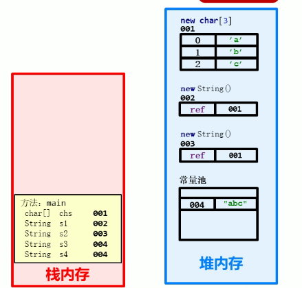
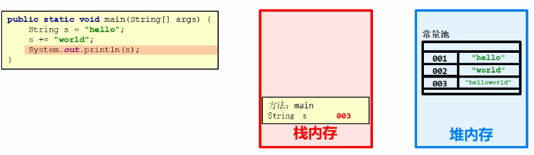

## 六、 方法

### 1. 概述

- **方法（method）**是将具有独立功能的**代码块**组织成一个整体，使其具有特殊功能的**代码集**

- 方法必须先创建才可以使用，该过程称为方法定义

- 在同一个类中方法名不能重复，重载除外

- 方法创建后并不是直接运行的，需要手动使用后才执行，该过程称为方法调用

- 定义方法的通用格式

  ```java
  // public static：修饰符
  // 返回值类型：方法操作完毕之后返回数据的数据类型，如果没有数据返回，此处写void，而且方法体中一般不写return
  // 方法名：调用方法时使用的标识
  // 参数：由数据类型和变量名组成，多个参数之间用逗号隔开
  // 方法体：完成功能的代码块
  // return：如果方法操作完毕，有数据返回，用于把数据返回给调用者，同时也是方法的出口
  public static 返回值类型 方法名(参数) {
  	方法体;
  	return 数据;
  }
  ```

### 2. 方法的定义和调用

#### 2.1 方法定义

```java
public static void 方法名() {
	// 方法体
}
```

#### 2.2 方法调用

```java
// 方法名();
public static void test() {
	// 方法体
}

test();
```

#### 2.3 方法调用过程


### 3. 带参方法的定义和调用

#### 3.1 带参方法的定义

- 方法定义时参数中的**数据类型**与**变量名**都不能缺少，缺少任意一个程序都将报错
- 方法定义时多个参数使用**逗号（,）**分隔

```java
// public static void 方法名(数据类型  变量名1, 数据类型  变量名2,....) {... ...}
public static void demo(int number) {}
```

#### 3.2 带参方法调用

方法调用时，**参数的数量和类型**必须与**方法定义中的数量、类型一一对应**，否则程序报错

```java
// 方法名(变量名1/常量值1, 变量名2/常量值2....)
demo(1)
```

#### 3.3 形参和实参

- 形参：方法定义中的参数，等同于变量定义
- 实参：方法调用中的参数，等同于使用变量或常量

### 4. 带返回值方法的定义和调用

#### 4.1 带返回值方法的定义

方法定义时return后面的返回值与方法定义上的数据类型要匹配，否则报错

```java
// public static 数据类型 方法名(数据类型  变量名1, 数据类型  变量名2,....) {
//	return 数据;
// }
public static int demo(int number) {
    // 方法体语句
	return number;
}
```

#### 4.2 带返回值方法的调用

方法的返回值通常使用变量接收，否则该返回值将无意义

```java
// 数据类型 变量名 = 方法名(参数);
int number = demo(5);
```

### 5. 方法的注意事项

- 方法不能嵌套定义
- void表示无返回值，可以省略return，也可以单独书写return，后面不加数据，表示从方法返回，即方法的出口
- 定义方法时要明确返回值类型，如果无返回值写void，如果有返回值，写返回值对应的数据类型
- 定义方法时必须要明确参数的类型和数量
- 方法调用时，void类型的方法，直接调用即可；非void类型的方法，推荐用变量接收调用

### 6. 方法重载

#### 6.1 概述

方法重载指同一个类中定义的多个方法之间的关系，满足下列条件的多个方法相互构成重载：

- 多个方法在同一个类中
- 多个方法具有相同的方法名
- 多个方法的参数不同，类型不同或者数量不同

#### 6.2 方法重载特点

- 重载仅对应方法的定义，与方法的调用无关，调用方式不变
- 重载仅针对同一个类中方法名称和参数进行识别，与返回值无关，即不能通过返回值来判定两个方法是否相互构成重载

### 7. 方法的参数传递

#### 7.1 传递基本类型

对于基本数据类型的参数，形式参数的改变，不影响实际参数的值。本质上是将实参的值拷贝了一份给形参，二者互不影响。


#### 7.2 传递引用类型

对于引用类型的参数，形参的改变，影响实参的值。这里的形参改变仅仅指的改变堆内存中元素的变化，并非是整体改变。本质上还是跟基本类型传递一样，是将实参的值拷贝了一份给形参，而实参的值正是引用的地址指向，当形参发生了整体改变时，即new或者其它操作，改变了它的地址指向并不会影响实参。


## 七、 面向对象基础

### 1. 类和对象

#### 1.1 什么是对象

万物皆对象，客观存在的事务皆为对象。

#### 1.2 什么是面向对象

面向一个具体的对象来进行操作。

#### 1.3 什么是类

类是对现实生活中一类具有**共同属性**和**行为**的事物的抽象。

类的特点：

- 类是对象的数据类型
- 类是具有相同属性和行为的一组对象的集合

#### 1.4 什么是对象的属性

**属性**：对象具有的各种特征，每个对象的每个**属性**都拥有特定的**值**。

#### 1.5 什么是对象的行为

**行为**：对象能够执行的操作。

#### 1.6 类和对象的关系

**类**是**对象**的**抽象**，**对象**是**类**的**实体**。**类**可以理解为**生产对象**的**模板**，对象为模板生产出的**具体事物**。

#### 1.7 类的定义

- 类是Java程序的基本组成单位。
- 类的组成：**属性**和**行为**
  - 属性：在类中通过**成员变量**来体现（类中方法外的变量）
  - 行为：在类中通过成员方法来体现（与第六节说的方法相比去掉static关键字即可）
- 类的定义步骤：
  - 定义类
  - 编写类的成员变量
  - 编写类的成员方法

```java
public class 类名 {
	// 成员变量
    // 成员变量系统会帮忙初始化，根据数据类型来进行初始化赋值
    // 局部变量必须自己进行初始化
	变量1的数据类型 变量1;
	变量2的数据类型 变量2;
	...
	
	// 成员方法
	方法1;
	方法2;
	...
}

public class Phone {
    // 成员变量
    String brand;
    
    int price;
    
    // 成员方法
    public void call() {}
    
    public void sendMessage() {}
}
```

#### 1.8 对象的使用

- 创建对象

  ``` java
  // 类名 对象名 = new 类名();
  Phone p = new Phone();
  ```

- 使用对象

  ```java
  // 使用成员变量
  // 对象名.变量名
  p.brand;
  
  // 使用成员方法
  // 对象名.方法名()
  p.call();
  ```

### 2. 对象内存图

#### 2.1 单个对象内存图


#### 2.2 对个对象内存图


#### 2.3 多个对象指向同一内存


### 3. 成员变量和局部变量

- 成员变量：类中方法外的变量

- 局部变量：方法中的变量、

  | 区别           | 成员变量                                   | 局部变量                                       |
  | -------------- | ------------------------------------------ | ---------------------------------------------- |
  | 类中位置不同   | 类中方法外                                 | 方法内或方法声明上                             |
  | 内存中位置不同 | 堆内存                                     | 栈内存                                         |
  | 生命周期不同   | 随着对象的存在而存在，随着对象的消失而消失 | 随着方法的调用而存在，随着方法的调用完毕而消失 |
  | 初始化值不同   | 有默认的初始化值                           | 没有默认的初始化值，必须先定义，赋值，才能使用 |

### 4. 封装

#### 4.1 private关键字

- 是一个权限修饰符
- 可以修饰成员变量和成员方法
- 作用是保护成员不被别的类使用，被private修饰的成员只在本类中才能访问
- 针对**private**修饰的成员变量，如果需要被其他类使用，一般提供相应的方法：
  - 提供**get变量名()**方法，用于获取成员变量的值，方法用**public**修饰
  - 提供**set变量名()**方法，用于设置成员变量的值，方法用**public**修饰
  - 在**get/set**方法中可以做相应的限制，保证了成员变量的安全

#### 4.2 this关键字

- this修饰的变量用于指向成员变量

  - 方法的形参如果与成员变量同名，不带this修饰的比变量指的是形参，而不是成员变量
  - 方法的形参没有与成员变量同名，不带this修饰的变量指的成员变量

- this在**解决局部变量隐藏成员变量**的问题

- this代表所在类的对象引用，那个对象调用方法，this就指向那个对象

  

#### 4.3 封装

- 概述
  - 封装是面向对象三大特征之一（**封装、继承、多态**）
  - 是面向对象编程语言对客观事件的模拟，客观世界里成员变量都是隐藏在对象内部的，外界无法直接操作
- 封装原则
  - 将类的某些信息隐藏在类内部，不允许外部程序直接访问，而是通过该类提供的方法来实现对隐藏信息的操作和访问**private**成员变量，提供对应的**getXxx()/setXxx()**方法
- 封装的意义
  - 通过方法来控制成员变量的操作，提高了代码的安全性
  - 把代码用方法进行封装，提高了代码的复用性

### 5. 构造方法

#### 5.1 概述

构造方法是一种特殊的方法，用于创建对象，完成对象数据的初始化

```java
public class 类名{
    修饰符 类名(参数) {
        
    }
}

public class Demo {
    public Demo() {
        
    }
}
```

#### 5.2 注意事项

- 构造方法的创建
  - 如果没有定义构造方法，系统将给出一个**默认**的**无参构造方法**
  - 如果定义了构造方法，系统将不再提供默认的构造方法
- 构造方法的重载
  - 如果自定义了带参构造方法，还要使用无参构造方法，就必须再写一个无参构造方法
- 推荐无论是否使用，都手工书写无参构造方法

### 6. 字符串

#### 6.1 API

API(Application Programming Interface)：应用程序编程接口。

Java API：指的就是JDK中提供的各种功能的Java类，这些类将底层的实现封装了起来，我们不需要关心这些类是如何实现的，只需要知道这些类如何使用即可。[码工具](https://www.matools.com/#)

java.lang包中的类可以直接使用不需要导包。

#### 6.2 String

String类在**java.lang**包下，其代表**字符串**，Java程序中的所有字符串文字（如"abv"）都被实现为此类的实例，也就是说，**Java程序中所有双引号字符串，都是String类的对象**。

字符串的特点：

- 字符串不可变，它们的值在创建后不能被更改，一旦修改就变成了另一个对象
- 虽然String的值不可变，但它们可以被共享
- 字符串效果相当于字符数组(char[ ])，但是底层原理**在jdk8及以前是字符数组，jdk9及以后是字节数组(byte[ ])。**

#### 6.3 String构造方法

| 方法名                     | 说明                                                      |
| -------------------------- | --------------------------------------------------------- |
| public String()            | 创建一个空白字符串对象，不含有任何内容                    |
| public String(char[ ] chs) | 根据字符数组内容来创建字符串对象                          |
| public String(byte[ ] bys) | 根据字节数组的内容来创建字符串对象                        |
| String s = "abc";          | 直接赋值的方式创建字符串对象，内容是abc，**常用这种方式** |

#### 6.4 String对象的特点

- 通过new创建的字符串对象，每一次new都会申请一个内存空间，虽然内容相同，但是地址值不同

  ```java
  // JVM会首先创建一个字符数组，然后每一次new的时候都会有一个新的地址，只不过s1和s2的字符串内容是相同的而已
  char[] chs = {'a', 'b', 'c'};
  String s1 = new String(chs);
  String s2 = new String(chs);
  ```

- 以双引号(" ")方式创建的字符串，只要字符序列相同（顺序和大小写），无论在程序代码中出现几次，JVM都只会建立一个String对象，并在字符串池中维护

  ```java
  // 以下情况，第一行代码，JVM会建立一个String对象放在字符串池中，并给s3引用
  // 第二行代码则直接让s4引用字符串池中的String对象，也就是说它们本质上是同一个对象
  String s3 = "abc";
  String s4 = "abc";
  ```

  

#### 6.5 字符串的比较

- 使用==做比较

  - 基本数据类型：比较的是**数据值**是否相同
  - 引用类型：比较的是**地址值**是否相同

- 字符串是对象，如要比较内容是否相同，是通过**equals()**方法来比较：

  - public boolean equals(Object anObject)：比较的是字符串，所以参数直接传入一个字符串

  ```java
  char[] chs = {'a', 'b', 'c'};
  String s1 = new String(chs);
  String s2 = new String(chs);
  String s3 = "abc";
  String s4 = "abc";
  
  // false
  System.out.println(s1 == s2);
  // false
  System.out.println(s1 == s3);
  // true
  System.out.println(s3 == s4);
  
  //全为true
  System.out.println(s1.equals(s2));
  System.out.println(s1.equals(s3));
  System.out.println(s3.equals(s4);
  ```

#### 6.6 字符串方法使用

| 方法名                                 | 说明                             |
| -------------------------------------- | -------------------------------- |
| public boolean equals(Object anObject) | 比较字符串的内容，严格区分大小写 |
| public char charAt(int index)          | 返回指定索引处都是char值         |
| public int length()                    | 返回此字符串的长度               |

```java
String s = "abc";

// 遍历字符串
// s.length()获取字符串长度
for(int i = 0; i < s.length(); i++) {
    // s.charAt(index)根据索引获取字符串中的字符，索引值从0开始
    System.out.println(s.charAt(i));
}

// 统计字符次数
// 统计三种类型的字符个数
int bigCount = 0;
int smallCount = 0;
int numberCount = 0;
for(int i = 0; i < s.length(); i++) {
    char ch = s.charAt(i);
    
    // 判断字符属于哪种类型
    if(ch >= 'A' && ch <= 'Z'){
        bigCount++;
    }else if(ch >= 'a' && ch <= 'z') {
        smallCount++;
    }else if(ch >= '0' && ch <= '9') {
        numberCount++;
    }
}

// 按照格式拼接字符串
int[] arr = {1, 2, 3};
String s1 = "";

s1 += "[";
for(int i = 0; i < arr.length; i++) {
    if(i == arr.length - 1) {
        s += arr[i];
    }else {
        s += arr[i];
        s += ", ";
    }
}

s1 += "]"
```

#### 6.7 StringBuilder



1. 对字符串进行拼接操作，每次拼接都会构建一个新的String对象，既耗时，又浪费空间，而这种操作还不可避免，可以通过Java提供的**StringBuilder**类来解决这个问题。

2. StringBuilder是一个可变的字符序列，可以将其看成是一个容器，这里的可变只的是StringBuilder对象中的内容是可以变的：

   - String：内容不可变，任何改变都将创建一个新的字符串对象
   - StringBuilder：内容是可变的

3. 构造方法

   | 方法名                           | 说明                                     |
   | -------------------------------- | ---------------------------------------- |
   | public StringBuilder()           | 创建一个空白可变的字符序列，不含任何内容 |
   | public StringBuilder(String str) | 根据字符串内容来创建一个可变的字符序列   |

4. 添加和反转方法

   | 方法名                                | 说明                     |
   | ------------------------------------- | ------------------------ |
   | public StringBuilder append(任意类型) | 添加数据，并返回对象本身 |
   | public StringBuilder reverse()        | 返回相反的字符序列       |

   ```java
   // 由于append方法返回的是对象的本身所以可以直接使用链式编程
   StringBuilder sb = new StringBuilder();
   sb.append("java").append("C++").append("python");
   
   sb.reverse();
   ```

5. StringBuilder和String相互转换

   - StringBuilder转换为String：直接通过StringBuilder的toString()方法即可
   - String转换为StringBuilder：使用StringBuilder的构造方法

### 7. 集合基础（ArrayList）

#### 7.1 概述 

集合类的特点：提供一种存储空间可变的存储模型，存储的数据内容可以发生改变

ArrayList<E>：

- 可调整大小的数组实现
- <E>是一种特殊的数据类型，泛型，用于限定集合中存储数据的类型，在出现E的地方使用引用数据类型替换即可，如ArrayList<String>，在此集合中只能存储字符串类型的数据

#### 7.2 ArrayList构造方法和常用方法

| 方法名                                | 说明                                                         |
| ------------------------------------- | ------------------------------------------------------------ |
| public ArrayList()                    | 创建一个空的集合对象                                         |
| public boolean add(E e)               | 将指定的元素追加到此集合的末尾                               |
| public void add(int index, E element) | 在此集合中的指定位置插入指定的元素                           |
| public boolean remove(Object o)       | 从该列表中删除指定元素的第一个匹配项（如果存在），返回删除是否成功 |
| public E remove(int index)            | 删除此列表中指定位置的元素。 将任何后续元素向左移位（从索引中减去一个元素）。返回从列表中删除的元素 |
| public E set(int index, E element)    | 用指定的元素替换此列表中指定位置的元素。返回先前在指定位置的元素 |
| public E get(int index)               | 返回此列表中指定位置的元素。                                 |
| public int size()                     | 返回此列表中的元素数。                                       |

```java
// 创建集合对象
ArrayList<String> array = new ArrayList<String>();

// 往集合中添加字符串对象
array.add("kobe");
array.add("curry");
array.add("james");

// 遍历集合
// array.size()获取集合大小
for(int i = 0; i < array.size(); i++) {
    System.out.println(array.get(i));
}
```

### 8. 继承

#### 8.1 概述

继承是面向对象三大特征之一。可以使得子类具有父类的属性和方法，还可以在子类中重新定义，追加属性和方法。

继承中子类的特点：

- 子类可以有父类的内容
- 子类还可以有自己特有的内容

```java
// java中使用extends关键字实现继承
public class 子类名 extends 父类名 {}

// Fu：是父类，也被称为基类、超类
// Zi：是子类，也被称为派生类
public class Zi extends Fu {}
```

#### 8.2 继承的好处与弊端

- 继承的好处
  - 提高了代码的**复用性**（多个类相同的成员可以放到同一个类中）
  - 提高了代码的**可维护性**（如果方法的代码需要修改，修改一处即可）
- 弊端
  - 继承让类与类之间产生了关系，类的耦合性增强了，当父类发生变化时子类实现也不得不跟着变化，削弱了子类的独立性
- 使用继承的情况：
  - 继承体现的关系：**is a**
  - 两个类A和B，如果他们满足A是B的一种，或者B是A的一种，就说明他们存在继承关系，可以考虑使用继承来体现，否则就不滥用继承

