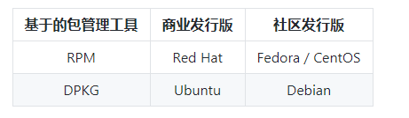
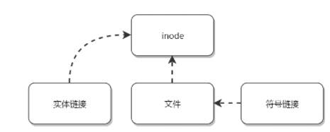

## 常用操作
### 快捷键
* Tab：命令和文件名补全
* Ctrl+C：中断正在运行的程序
* Ctrl+D：结束键盘输入
### 帮助
* --help：指令的基本用法
* man：manual的缩写，将指令的具体信息显示出来
* info：与man类似但是info将文档分成一个个页面，每个页面可以跳转
* doc：/usr/share/doc存放着软件的一整套说明文件
### 关机
1. who：关机前先使用who命令查看是否有其他用户在线
1. sync：为了加快磁盘文件的读写速度，位于内存中的文件数据不会立即同步到磁盘，因此关机之前需要先进行sync同步操作
1. shutdown [-krhc]：
    * -k：不会关机，只是发出警告，通知所有在线用户
    * -r：将系统的服务停掉后就重启
    * -h：将系统的服务停掉后就立即关机
    * -c：取消已经在进行的shutdown
### PATH
可以在环境变量PATH中声明可执行文件的路径，路径之间用:分隔
### sudo
sudo允许一般用户使用root可执行的命令，不过只有在/etc/sudoers配置文件中添加的用户才能使用该指令
### 包管理工具
RPM和DPKG为最常见的两类软件包管理工具：     
* RPM全称为Redhat Package Manager，最早由Red Hat公司制定实施，随后被GNU开源操作系统接受并成为许多Linux系统的既定软件标准。YUM基于RPM，具有依赖管理和软件升级功能。
* 与RPM竞争的是基于Debian操作系统的DEB软件包管理工具DPKG，全称为Debian Package，功能方面与RPM相似。
### 发行版
Linux发行版是Linux内核及各种应用软件的集成版本。           

### VIM三个模式
     
* 一般指令模式（command mode）：VIM的默认模式，可以用于移动游标查看内容
* 编辑模式（insert mode）：按下“i”等按键之后进入，可以对文本进行编辑
* 指令列模式（bottom-line mode）：按下“:”按键之后进入，用于保存退出操作          

## 磁盘
### 磁盘文件名
Linux中每个硬件都被当做一个文件，包括磁盘。磁盘以磁盘接口类型命名，常见磁盘的文件名如下：     
* IDE磁盘：/dev/hd[a-d]
* SATA/SCSI/SAS磁盘：/dev/sd[a-p]
### 分区
#### 分区表
磁盘分区表主要有两种格式，一种是限制较多的MBR分区表，一种是较新且限制较少的GPT分区表。      
1. MBR：在MBR中，第一个扇区最重要，里面有主要开机记录（master boot record，MBR）及分区表（partition table），其主要开机记录占446bytes，分区表占64bytes。
   分区表只有64bytes，最多只能存储4个分区，这4个分区为主分区和扩展分区。其中扩展分区只有一个，它使用其他扇区来记录额外的分区表，因此通过扩展分区可以分出更多分
   区，这些分区称为逻辑分区。
   Linux也把分区当成文件，分区文件的命名方式为：磁盘文件名 + 编号，如/dev/sda1，逻辑分区的编号从5开始。
1. GPT：扇区是磁盘的最小单位，旧磁盘的扇区通常为512bytes，而最新的磁盘支持4k。GPT为了兼容所有磁盘，在定义扇区上使用逻辑区块地址（logical block address，LBA），
   LBA默认大小为512bytes。GPT第一个区块记录了主要开机记录，紧接着是33个区块记录分区信息，并把最后的33个区块用于对分区信息进行备份。这33个区块第一个为GPT表头记录，
   这个部分记录了分区表本身的位置与大小和备份分区的位置，同时放置了分区表的校验码（CRC32），操作系统可以根据这个校验码来判断GPT是否正确。若有错误，可以使用备份分区
   进行恢复。GPT 没有扩展分区概念，都是主分区，每个 LBA 可以分 4 个分区，因此总共可以分 4 * 32 = 128 个分区。MBR 不支持 2.2 TB 以上的硬盘，GPT 则最多支持到 
   233 TB = 8 ZB。
### 开机检测程序
1. BIOS：base input/output system，基本输入输出系统，它是一个固件（嵌入在硬件中的软件），BIOS程序存放在断电后内容不会丢失的只读内存中。Bios是开机的时候计算机执行
   的第一个程序，这个程序知道可以开机的磁盘，并读取磁盘第一个扇区的主要开机记录，由主要开机记录执行其中的开机管理程序，这个开机管理程序会加载操作系统的核心文件。
1. UEFI：BIOS不能读取GPT分区表，而UEFI可以
## 文件系统
### 分区与文件系统
对分区进行格式化是为了在分区上建立文件系统。一个分区通常只能格式化为一个文件系统，但是磁盘阵列等技术可以将一个分区格式化为多个文件系统
### 组成
最主要的几个组成部分如下：
* inode：一个文件占用一个inode，记录文件的属性，同时记录此文件的内容所在的block编号
* block：记录文件内容，文件太大时，会占用多个block

除此之外还包括：
* superblock：记录文件系统的整体信息，包括inode和block的总量、使用量、剩余量，以及文件系统的格式与相关信息等
* block bitmap：记录block是否是被使用的位图
### 文件读取
对于Ext2文件系统，当要读取一个文件的内容时，写在inode中查找文件内容所在的block，然后把block的内容读出来。          
         
而对于FAT文件系统它没有inode，每个blocak中存储着下一个block的编号          
     
## 文件
### 文件属性
用户分为三种：文件拥有者、群组以及其它人，对不同的用户有不同的文件权限。        
使用 ls 查看一个文件时，会显示一个文件的信息，例如 drwxr-xr-x 3 root root 17 May 6 00:14 .config，对这个信息的解释如下：       
* drwxr-xr-x：文件类型以及权限，第 1 位为文件类型字段，后 9 位为文件权限字段
* 3：链接数
* root：文件拥有者
* root：所属群组
* 17：文件大小
* May 6 00:14：文件最后被修改的时间
* .config：文件名

常见的文件类型及其含义有：
* d：目录
* -：文件
* l：链接文件

9 位的文件权限字段中，每 3 个为一组，共 3 组，每一组分别代表对文件拥有者、所属群组以及其它人的文件权限。一组权限中的 3 位分别为 r、w、x 权限，表示可读、可写、可执行。
### 文件与目录的基本操作
1. ls        
   列出文件或者目录的信息，目录的信息就是其中包含的文件
   ```
   ## ls [-aAdfFhilnrRSt] file|dir
   -a ：列出全部的文件
   -d ：仅列出目录本身
   -l ：以长数据串行列出，包含文件的属性与权限等等数据
   ```
1. cd    
   更换当前目录      
   ```cd [相对路径或绝对路径]```
1. mkdir    
   创建目录        
   ```
   ## mkdir [-mp] 目录名称
   -m ：配置目录权限
   -p ：递归创建目录
   ```
1. rmdir    
   删除目录，目录必须为空
   ```
   rmdir [-p] 目录名称
   -p ：递归删除目录
   ```
1. touch    
   更新文件时间或者建立新文件
   ```
   ## touch [-acdmt] filename
   -a ： 更新 atime
   -c ： 更新 ctime，若该文件不存在则不建立新文件
   -m ： 更新 mtime
   -d ： 后面可以接更新日期而不使用当前日期，也可以使用 --date="日期或时间"
   -t ： 后面可以接更新时间而不使用当前时间，格式为[YYYYMMDDhhmm]
   ```
1. cp
   复制文件。如果源文件有两个以上，则目的文件一定要是目录才行
   ``` 
   cp [-adfilprsu] source destination
   -a ：相当于 -dr --preserve=all
   -d ：若来源文件为链接文件，则复制链接文件属性而非文件本身
   -i ：若目标文件已经存在时，在覆盖前会先询问
   -p ：连同文件的属性一起复制过去
   -r ：递归复制
   -u ：destination 比 source 旧才更新 destination，或 destination 不存在的情况下才复制
   --preserve=all ：除了 -p 的权限相关参数外，还加入 SELinux 的属性, links, xattr 等也复制了
   ```
1. rm    
   删除文件
   ``` 
   ## rm [-fir] 文件或目录
   -r ：递归删除
   ```
1. mv    
   移动文件
   ``` 
   ## mv [-fiu] source destination
   ## mv [options] source1 source2 source3 .... directory
   -f ： force 强制的意思，如果目标文件已经存在，不会询问而直接覆盖
   ```
### 修改权限
可以将一组权限用数字来表示，此时一组权限的3个位当作二进制数字的位，从左到右每个位的权值为4、2、1，即
每个权限对应的数字权值为r:4,w:2,x:1。      
``` 
## chmod [-R] xyz dirname/filename
#示例：将 .bashrc 文件的权限修改为 -rwxr-xr--
## chmod 754 .bashrc

#也可以使用符号来设定权限
## chmod [ugoa]  [+-=] [rwx] dirname/filename
- u：拥有者
- g：所属群组
- o：其他人
- a：所有人
- +：添加权限
- -：移除权限
- =：设定权限

#示例：为 .bashrc 文件的所有用户添加写权限。
## chmod a+w .bashrc
```
### 默认权限
* 文件默认权限：文件默认没有可执行权限，因此为 666，也就是 -rw-rw-rw- 。
* 目录默认权限：目录必须要能够进入，也就是必须拥有可执行权限，因此为 777 ，也就是 drwxrwxrwx。

可以通过 umask 设置或者查看默认权限，通常以掩码的形式来表示，例如 002 表示其它用户的权限去除了一个 2 的权限，
也就是写权限，因此建立新文件时默认的权限为 -rw-rw-r--
### 目录权限
文件名不是存储在一个文件的内容中，而是存储在一个文件所在的目录中。因此，拥有文件的 w 权限并不能对文件名进行修改。

目录存储文件列表，一个目录的权限也就是对其文件列表的权限。因此，目录的 r 权限表示可以读取文件列表；w 权限表示可以
修改文件列表，具体来说，就是添加删除文件，对文件名进行修改；x 权限可以让该目录成为工作目录，x 权限是 r 和 w 权限
的基础，如果不能使一个目录成为工作目录，也就没办法读取文件列表以及对文件列表进行修改了。
### 链接
       
``` 
## ln [-sf] source_filename dist_filename
-s ：默认是实体链接，加 -s 为符号链接
-f ：如果目标文件存在时，先删除目标文件
```      
1. 实体链接        
在目录下创建一个条目，记录着文件名与 inode 编号，这个 inode 就是源文件的 inode。
删除任意一个条目，文件还是存在，只要引用数量不为 0。
有以下限制：不能跨越文件系统、不能对目录进行链接。     
   ```
   ## ln /etc/crontab .
   ## ll -i /etc/crontab crontab
   34474855 -rw-r--r--. 2 root root 451 Jun 10 2014 crontab
   34474855 -rw-r--r--. 2 root root 451 Jun 10 2014 /etc/crontab
   ```
1. 符号链接     
   符号链接文件保存着源文件所在的绝对路径，在读取时会定位到源文件上，可以理解为 Windows 的快捷方式。
   当源文件被删除了，链接文件就打不开了。因为记录的是路径，所以可以为目录建立符号链接。      
   ``` 
   ## ll -i /etc/crontab /root/crontab2
   34474855 -rw-r--r--. 2 root root 451 Jun 10 2014 /etc/crontab
   53745909 lrwxrwxrwx. 1 root root 12 Jun 23 22:31 /root/crontab2 -> /etc/crontab
   ```
### 获取文件内容
1. cat      
   取得文件内容      
   ``` 
   ## cat [-AbEnTv] filename
   -n ：打印出行号，连同空白行也会有行号，-b 不会
   ```
1. tac      
   是cat的反向操作，从最后一行开始打印
1. more
   和cat不同的是他可以一页一页查看文件内容，比较适合大文件的查看
1. less
   和more类似，但是多了一个向前翻页的功能。
1. head
   取得文件前几行
   ``` 
   ## head [-n number] filename
   -n ：后面接数字，代表显示几行的意思
   ```
1. tail
   是head的反向操作，只是取得是后几行
1. od
   以字符或者十六进制的形式显示二进制文件
### 指令与文件搜索
1. which
   指令搜索
   ``` 
   ## which [-a] command
   -a ：将所有指令列出，而不是只列第一个
   ```
1. whereis
   文件搜索，速度比较快，因为它只搜索几个特定的目录
   ``` 
   ## whereis [-bmsu] dirname/filename
   ```
1. lcate
   文件搜索。可以用关键字或者正则表达式进行搜索。locate使用/var/lib/mlocate/这个数据库进行搜索，它存储在内存中并且每天更新一次，所以无法用 locate 搜索新建的文件。可以使用 updatedb 来立即更新数据库。
   ``` 
   ## locate [-ir] keyword
   -r：正则表达式 
   ```
1. find
   文件搜索。可以使用文件的属性和权限进行搜索
   ``` 
   ## find [basedir] [option]
   example: find . -name "shadow*"
   ```
## 压缩与打包
### 压缩文件名
Linux底下有很多压缩文件名      

### 压缩指令
1. gzip
   gzip是Linux使用最广的压缩指令，可以解开compress、zip和gzip所压缩的文件。经过gzip压缩过，源文件就不存在了。有9个不同的压缩登记可以使用，可以使用zcat、zmore、zless来读取压缩文件的内容        
   ``` 
   $ gzip [-cdtv#] filename
   -c ：将压缩的数据输出到屏幕上
   -d ：解压缩
   -t ：检验压缩文件是否出错
   -v ：显示压缩比等信息
   -# ： # 为数字的意思，代表压缩等级，数字越大压缩比越高，默认为 6
   ```
1. bzip2
   提供不gzip更高的压缩比，查看命令：bzcat、bzmore、bzless、bzgrep      
   ``` 
   $ bzip2 [-cdkzv#] filename
   -k ：保留源文件
   ```
1. xz
   提供比bzip2更佳的压缩比，可以看到gzip、bzip2、xz的压缩比不断优化，不过要注意的是，压缩比越高，压缩的时间也越长。查看命令：xzcat、xzmore、xzless、xzgre     
   ```$ xz [-dtlkc#] filename```
### 打包
压缩指令只能对一个文件进行压缩，而打包能够将多个文件打包成一个大文件。tar 不仅可以用于打包，也可以使用 gzip、bzip2、xz 将打包文件进行压缩。      
``` 
$ tar [-z|-j|-J] [cv] [-f 新建的 tar 文件] filename...  ==打包压缩
$ tar [-z|-j|-J] [tv] [-f 已有的 tar 文件]              ==查看
$ tar [-z|-j|-J] [xv] [-f 已有的 tar 文件] [-C 目录]    ==解压缩
-z ：使用 zip；
-j ：使用 bzip2；
-J ：使用 xz；
-c ：新建打包文件；
-t ：查看打包文件里面有哪些文件；
-x ：解打包或解压缩的功能；
-v ：在压缩/解压缩的过程中，显示正在处理的文件名；
-f : filename：要处理的文件；
-C 目录 ： 在特定目录解压缩。
```      

## Bash
可以通过Shell请求内核提供服务，Bash正是Shell的一种
### 特性
* 命令历史：记录使用过的命令
* 命令与文件补全：快捷键：tab
* 命令别名：例如ll是ls -al的别名
* shell scripts
* 通配符：如ls -l /usr/bin/X*列出/usr/bin下面所有以X开头的文件
### 变量操作
对一个变量赋值直接使用=。对变量取用需要在变量前加上$，也可以使用${}的形式，输出变量使用ehco命令     
``` 
$ x=abc
$ echo $x
$ echo ${x}
```      
变量内容如果有空格，必须使用双引号或者单引号
* 双引号内的特殊字符可以保留原本特性，如x="lang is $LANG"，则 x 的值为 lang is zh_TW.UTF-8；
* 单引号内的特殊字符就是特殊字符本身，例如 x='lang is $LANG'，则 x 的值为 lang is $LANG。

可以使用 `指令` 或者 $(指令) 的方式将指令的执行结果赋值给变量。例如 version=$(uname -r)，则 version 的值为 4.15.0-22-generic。

可以使用 export 命令将自定义变量转成环境变量，环境变量可以在子程序中使用，所谓子程序就是由当前 Bash 而产生的子 Bash。

Bash 的变量可以声明为数组和整数数字。注意数字类型没有浮点数。如果不进行声明，默认是字符串类型。变量的声明使用 declare 命令：
``` 
$ declare [-aixr] variable
-a ： 定义为数组类型
-i ： 定义为整数类型
-x ： 定义为环境变量
-r ： 定义为 readonly 类型
```      
使用 [ ] 来对数组进行索引操作：
``` 
$ array[1]=a
$ array[2]=b
$ echo ${array[1]}
```
### 指令搜索顺序
* 以绝对或相对路径来执行指令，如/bin/ls或者./ls
* 由别名找到该指令来执行
* 由Bash内置的指令来执行
* 按$PATH变量指定的搜索路径的顺序找到第一个指令来执行
### 数据流重定向
重定向指的是使用文件代替标准输入、标准输出和标准错误输出     
    
其中，有一个箭头的表示以覆盖的方式重定向，而有两个箭头的表示以追加的方式重定向。

可以将不需要的标准输出以及标准错误输出重定向到 /dev/null，相当于扔进垃圾箱。

如果需要将标准输出以及标准错误输出同时重定向到一个文件，需要将某个输出转换为另一个输出，例如 2>&1 表示将标准错误输出转换为标准输出。      
```$ find /home -name .bashrc > list 2>&1```
## 管道指令
管道是将一个命令的标准输出作为另一个命令的标准输入，在数据需要经过多个步骤的处理之后才能得到我们想要的内容时就可以使用管道。

在命令之间使用 | 分隔各个管道命令。        
```$ ls -al /etc | less```
### 提取指令
cut对数据进行切分，去除想要的部分.切分过程一行一行地进行      
``` 
$ cut
-d ：分隔符
-f ：经过 -d 分隔后，使用 -f n 取出第 n 个区间
-c ：以字符为单位取出区间
```      
如last 显示登入者的信息，取出用户名。      
``` 
$ last
root pts/1 192.168.201.101 Sat Feb 7 12:35 still logged in
root pts/1 192.168.201.101 Fri Feb 6 12:13 - 18:46 (06:33)
root pts/1 192.168.201.254 Thu Feb 5 22:37 - 23:53 (01:16)

$ last | cut -d ' ' -f 1
```      
如将 export 输出的信息，取出第 12 字符以后的所有字符串。        
``` 
$ export
declare -x HISTCONTROL="ignoredups"
declare -x HISTSIZE="1000"
declare -x HOME="/home/dmtsai"
declare -x HOSTNAME="study.centos.vbird"
.....(其他省略).....

$ export | cut -c 12-
```
### 排序指令
sort用于排序    
``` 
$ sort [-fbMnrtuk] [file or stdin]
-f ：忽略大小写
-b ：忽略最前面的空格
-M ：以月份的名字来排序，例如 JAN，DEC
-n ：使用数字
-r ：反向排序
-u ：相当于 unique，重复的内容只出现一次
-t ：分隔符，默认为 tab
-k ：指定排序的区间

$ cat /etc/passwd | sort -t ':' -k 3
root:x:0:0:root:/root:/bin/bash
dmtsai:x:1000:1000:dmtsai:/home/dmtsai:/bin/bash
alex:x:1001:1002::/home/alex:/bin/bash
arod:x:1002:1003::/home/arod:/bin/bash
```      
uniq可以将重复的数据只取一个     
``` 
$ uniq [-ic]
-i ：忽略大小写
-c ：进行计数

$ last | cut -d ' ' -f 1 | sort | uniq -c
1
6 (unknown
47 dmtsai
4 reboot
7 root
1 wtmp
```
### 双向输出重定向
输出重定向会将输出内容重定向到文件中，而 tee 不仅能够完成这个功能，还能保留屏幕上的输出。也就是说，使用 tee 指令，一个输出会同时传送到文件和屏幕上。        
```$ tee [-a] file```
### 字符转换指令
tr 用来删除一行中的字符，或者对字符进行替换。      
``` 
$ tr [-ds] SET1 ...
-d ： 删除行中 SET1 这个字符串

#将 last 输出的信息所有小写转换为大写。
$ last | tr '[a-z]' '[A-Z]'
```      
col 将 tab 字符转为空格字符。     
``` 
$ col [-xb]
-x ： 将 tab 键转换成对等的空格键
```      
expand 将 tab 转换一定数量的空格，默认是 8 个。     
``` 
$ expand [-t] file
-t ：tab 转为空格的数量
```      
join 将有相同数据的那一行合并在一起。      
``` 
$ join [-ti12] file1 file2
-t ：分隔符，默认为空格
-i ：忽略大小写的差异
-1 ：第一个文件所用的比较字段
-2 ：第二个文件所用的比较字段
```         
paste 直接将两行粘贴在一起。    
```
$ paste [-d] file1 file2
-d ：分隔符，默认为 tab
```
### 分区指令
split 将一个文件划分成多个文件。     
``` 
$ split [-bl] file PREFIX
-b ：以大小来进行分区，可加单位，例如 b, k, m 等
-l ：以行数来进行分区。
- PREFIX ：分区文件的前导名称
```
## 正则表达式
### grep
g/re/p（globally search a regular expression and print)，使用正则表示式进行全局查找并打印。      
``` 
$ grep [-acinv] [--color=auto] 搜寻字符串 filename
-c ： 统计匹配到行的个数
-i ： 忽略大小写
-n ： 输出行号
-v ： 反向选择，也就是显示出没有 搜寻字符串 内容的那一行
--color=auto ：找到的关键字加颜色显示

$ grep -n 'the' regular_express.txt
8:I can't finish the test.
12:the symbol '*' is represented as start.
15:You are the best is mean you are the no. 1.
16:The world Happy is the same with "glad".
18:google is the best tools for search keyword

#正则表达式 a{m,n} 用来匹配字符 a m~n 次，这里需要将 { 和 } 进行转义，因为它们在 shell 是有特殊意义的。
$ grep -n 'a\{2,5\}' regular_express.txt
```
### printf
用于格式化输出。它不属于管道命令，在给 printf 传数据时需要使用 $( ) 形式。
``` 
$ printf '%10s %5i %5i %5i %8.2f \n' $(cat printf.txt)
    DmTsai    80    60    92    77.33
     VBird    75    55    80    70.00
       Ken    60    90    70    73.33
```
### awk
是由 Alfred Aho，Peter Weinberger 和 Brian Kernighan 创造，awk 这个名字就是这三个创始人名字的首字母。

awk 每次处理一行，处理的最小单位是字段，每个字段的命名方式为：$n，n 为字段号，从 1 开始，$0 表示一整行。    
``` 
#取出最近五个登录用户的用户名和 IP。首先用 last -n 5 取出用最近五个登录用户的所有信息，可以看到用户名和 IP 分别在第 1 列和第 3 列，我们用 $1 和 $3 就能取出这两个字段，然后用 print 进行打印。
$ last -n 5
dmtsai pts/0 192.168.1.100 Tue Jul 14 17:32 still logged in
dmtsai pts/0 192.168.1.100 Thu Jul 9 23:36 - 02:58 (03:22)
dmtsai pts/0 192.168.1.100 Thu Jul 9 17:23 - 23:36 (06:12)
dmtsai pts/0 192.168.1.100 Thu Jul 9 08:02 - 08:17 (00:14)
dmtsai tty1 Fri May 29 11:55 - 12:11 (00:15)

$ last -n 5 | awk '{print $1 "\t" $3}'
dmtsai   192.168.1.100
dmtsai   192.168.1.100
dmtsai   192.168.1.100
dmtsai   192.168.1.100
dmtsai   Fri
```
## 进程管理
### 查看进程
1. ps
   查看某个时间点的进程信息。
   ``` 
   #查看自己的进程
   ## ps -l
   
   #查看系统所有进程
   ## ps aux
   
   #查看特定的进程
   ## ps aux | grep threadx
   ```      
1. pstree
   查看进程树    
   ``` 
   #查看所有进程树
   ## pstree -A
   ```      
1. top
   实时显示进程信息       
   ``` 
   #两秒钟刷新一次
   ## top -d 2
   ```
1. netstat
   查看占用端口的进程      
   ``` 
   #查看特定端口的进程
   ## netstat -anp | grep port
   ```
### 进程状态
    
     

