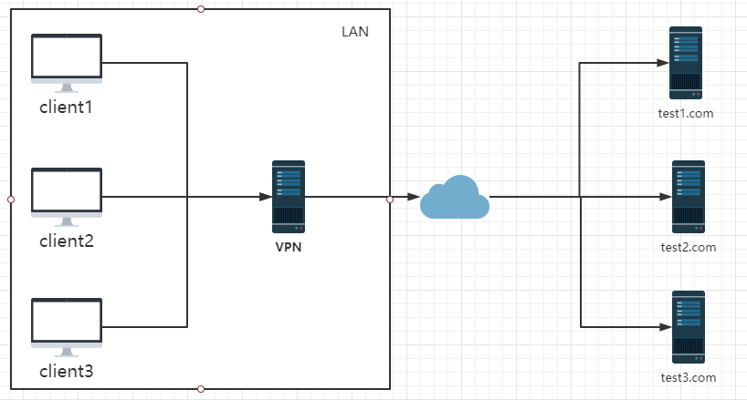
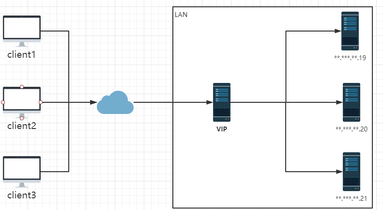

## nginx是什么
    nginx是一个高性能http和反向代理服务器，主要功能代理、负载均衡、动静分离。
## 正向代理
    
    正向代理是在用户端，比如访问某些国外网站时vpn设置在用户浏览器端，浏览器先访问vpn地址，vpn再转发请求，并最后将请求结果原路返回。
## 反向代理
    
    反向代理是作用子啊服务器端，是一个虚拟IP。对于一个用户的请求会转发到多个后端服务器中的一台来处理具体请求。
## nginx配置文件（nginx.conf）
```
#全局块
#user  nobody;
worker_processes  1;

#event块
events {
    worker_connections  1024;
}

#http块
http {
    #http全局块
    include       mime.types;
    default_type  application/octet-stream;
    sendfile        on;
    keepalive_timeout  65;
    #server块
    server {
        #server全局块
        listen       8000;
        server_name  localhost;
        #location块
        location / {
            root   html;
            index  index.html index.htm;
        }
        error_page   500 502 503 504  /50x.html;
        location = /50x.html {
            root   html;
        }
    }
    #这边可以有多个server块
    server {
      ...
    }
}
```
### 反向代理配置
```
    #http块
    http {
        #http全局块
        include       mime.types;
        default_type  application/octet-stream;
        sendfile        on;
        keepalive_timeout  65;
        #server块
        #首先在http中添加upstream节点（负载均衡）
        #upstream upstreamName {}
        upstream testUpstream {
            #weight为权重
            server 192.168.30.1 weight=3;
            server 192.168.30.2 weight=1;
        }
        
        server {
            #server全局块
            listen       8000;
            server_name  localhost;
            #location块
            location / {
                root   html;
                index  index.html index.htm;
                #加入代理
                proxy_pass http://testUpstream
            }
            error_page   500 502 503 504  /50x.html;
            location = /50x.html {
                root   html;
            }
        }
        #这边可以有多个server块
        server {
          ...
    }
```
## nginx命令
```
    #检查配置文件是否正确
    nginx -t
    
    #重新加载配置文件
    nginx -s reload
    
    #退出
    nginx -s stop
    
    #安全退出
    nginx -s quit
```