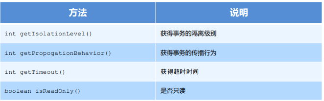

## 一、概述

​		Spring是分层的 Java SE/EE应用 full-stack 轻量级开源框架，以 IoC（Inverse Of Control：反转控制）和 AOP（Aspect Oriented Programming：面向切面编程）为内核。

​		 提供了展现层 SpringMVC 和持久层 Spring JDBCTemplate 以及业务层事务管理等众多的企业级应用技术 ，还能整合开源世界众多著名的第三方框架和类库，逐渐成为使用最多的Java EE 企业应用开源框架。

优势：

1. 方便解耦，简化开发 

   通过 Spring 提供的 IoC容器，可以将对象间的依赖关系交由 Spring 进行控制，避免硬编码所造成的过度耦合。 用户也不必再为单例模式类、属性文件解析等这些很底层的需求编写代码，可以更专注于上层的应用。

2. AOP 编程的支持 

   通过 Spring的 AOP 功能，方便进行面向切面编程，许多不容易用传统 OOP 实现的功能可以通过 AOP 轻松实现。

3. 声明式事务的支持 

   可以将我们从单调烦闷的事务管理代码中解脱出来，通过声明式方式灵活的进行事务管理，提高开发效率和质量。 

4. 方便程序的测试

   可以用非容器依赖的编程方式进行几乎所有的测试工作，测试不再是昂贵的操作，而是随手可做的事情。

5. 方便集成各种优秀框架 

   Spring对各种优秀框架（Struts、Hibernate、Hessian、Quartz等）的支持

6. 降低 JavaEE API 的使用难度 

   Spring对 JavaEE API（如 JDBC、JavaMail、远程调用等）进行了薄薄的封装层，使这些 API 的使用难度大为降低。

7. Java 源码是经典学习范例 

   Spring的源代码设计精妙、结构清晰、匠心独用，处处体现着大师对Java 设计模式灵活运用以及对 Java技术的高深 造诣。它的源代码无意是 Java 技术的最佳实践的范例。

体系结构：


## 二、快速入门

### 1. Spring程序开发步骤

1. 导入Spring开发的基本包坐标
2. 编写Dao接口和实现类
3. 创建Spring核心配置文件
4. 在Spring配置文件中配置UserDaoImpl
5. 使用Spring的API获得Bean实例


### 2. 导入Spring开发的基本包坐标

```xml
<dependencies>
    <!--   context依赖core、beans、expression     -->
    <dependency>
        <groupId>org.springframework</groupId>
        <artifactId>spring-context</artifactId>
        <version>${spring.version}</version>
    </dependency>
</dependencies>
```

### 3. 编写Dao接口

```java
public interface UserDao {

    void save();
}

public class UserDaoImpl implements UserDao {

    @Override
    public void save() {
        System.out.println("UserDao save method running....");
    }
}
```

### 4. 创建Spring核心配置文件并配置Dao

在类路径下（resources）创建applicationContext.xml配置文件

```xml
<?xml version="1.0" encoding="UTF-8"?>
<beans xmlns="http://www.springframework.org/schema/beans"
       xmlns:xsi="http://www.w3.org/2001/XMLSchema-instance"
       xsi:schemaLocation="http://www.springframework.org/schema/beans http://www.springframework.org/schema/beans/spring-beans.xsd">
    <bean id="userDao" class="org.lql.dao.impl.UserDaoImpl"/>
</beans>
```

### 5. 使用Spring的API获得Bean实例

```java
public class UserDaoTest {

    @Test
    public void test() {
        ApplicationContext applicationContext = new ClassPathXmlApplicationContext("applicationContext.xml");
        UserDao userDao = (UserDao) applicationContext.getBean("userDao");
        userDao.save();
    }
}
```

## 三、Spring配置文件

### 1. Bean标签基本配置

用于配置对象交由Spring来创建

默认情况下它调用的是类中的**无参构造函数**，如果没有无参构造函数则创建不成功

基本属性：

- id：Bean实例在Spring容器中的唯一标识
- class：Bean的全限定名称

### 2. Bean标签范围配置

scope：指对象的作用范围，取值如下


1. 当scope的取值为**singleton**时 

   Bean的实例化个数：1个 

   Bean的实例化时机：当Spring核心文件被加载时，实例化配置的Bean实例 

   Bean的生命周期： 

   - 对象创建：当应用加载，创建容器时，对象就被创建了 
   - 对象运行：只要容器在，对象一直活着 
   - 对象销毁：当应用卸载，销毁容器时，对象就被销毁了 

2. 当scope的取值为**prototype**时 

   Bean的实例化个数：多个 

   Bean的实例化时机：当调用getBean()方法时实例化Bean

   - 对象创建：当使用对象时，创建新的对象实例
   - 对象运行：只要对象在使用中，就一直活着
   - 对象销毁：当对象长时间不用时，被 Java 的垃圾回收器回收了

### 3. Bean生命周期配置

- init-method：指定类中的初始化方法名称
- destroy-method：指定类中销毁方法名称

### 4. Bean实例化三种方式

- 无参构造方法实例化

  根据默认无参构造方法来创建类对象，如果bean中没有默认无参构造方法，将会创建失败

  ```xml
  <bean id="userDao" class="org.lql.dao.impl.UserDaoImpl"/>
  ```

- 工厂静态方法实例化

  ```java
  public class StaticFactoryBean {
      
      public static UserDao createUserDao() {
          return new UserDaoImpl();
      }
  }
  
  <bean id="userDao" class="org.lql.factory.StaticFactoryBean" factory-method="createUserDao"/>
  
  ```

- 工厂实例方法实例化

  ```java
  public class DynamicFactoryBean {
  
      public UserDao createUserDao() {
          return new UserDaoImpl();
      }
  }
  
  
  <bean id="factoryBean" class="org.lql.factory.DynamicFactoryBean"/>
  <bean id="userDao" factory-bean="factoryBean" factory-method="createUserDao"/>
  ```

### 5. Bean的依赖注入

1. 创建 UserService，UserService 内部在调用 UserDao的save() 方法

   ```java
   public class UserServiceImpl implements UserService {
       @Override
       public void save() {
           ApplicationContext applicationContext = new ClassPathXmlApplicationContext("applicationContext.xml");
           UserDao userDao = (UserDao) applicationContext.getBean("userDao");
           userDao.save();
       }
   }
   ```

2. 创建 UserService，UserService 内部在调用 UserDao的save() 方法

   ```xml
   <bean id="userService" class="org.lql.service.impl.UserServiceImpl"/>
   ```

3. 从 Spring 容器中获得 UserService 进行操作

   ```java
   ApplicationContext applicationContext = new 
   ClassPathXmlApplicationContext("applicationContext.xml");
   UserService userService = (UserService) applicationContext.getBean("userService");
   userService.save();
   ```

4. 依赖注入分析

   ​		因为UserService和UserDao都在Spring容器中，而最终程序直接使用的是UserService，所以可以在 Spring容器中，将UserDao设置到UserService内部。

   

### 6. Bean的依赖注入概念

依赖注入（Dependency Injection）：它是 Spring 框架核心 IOC 的具体实现。 

在编写程序时，通过控制反转，把对象的创建交给了 Spring，但是代码中不可能出现没有依赖的情况。 

IOC 解耦只是降低他们的依赖关系，但不会消除。例如：业务层仍会调用持久层的方法。 

那这种业务层和持久层的依赖关系，在使用 Spring 之后，就让 Spring 来维护了。 

简单的说，就是坐等框架把持久层对象传入业务层，而不用我们自己去获取

### 7. Bean的依赖注入方式

- 构造方法注入

  ```java
  // 创建有参构造
  public class UserServiceImpl implements UserService {
  
      private UserDao userDao;
  
      public UserServiceImpl(UserDao userDao) {
          this.userDao = userDao;
      }
  
      @Override
      public void save() {
          userDao.save();
      }
  }
  ```

  ```xml
  <!-- 配置Spring容器调用有参构造时进行注入 -->
   <bean id="userDao" class="org.lql.dao.impl.UserDaoImpl"/>
  
  <bean id="userService" class="org.lql.service.impl.UserServiceImpl">
      <constructor-arg name="userDao" ref="userDao"/>
  </bean>
  ```

- set方法注入

  ```java
  // 在UserServiceImpl中添加setUserDao方法
  public class UserServiceImpl implements UserService {
  
      private UserDao userDao;
  
      public void setUserDao(UserDao userDao) {
          this.userDao = userDao;
      }
  
      @Override
      public void save() {
          userDao.save();
      }
  }
  ```

  ```xml
  <bean id="userDao" class="org.lql.dao.impl.UserDaoImpl"/>
  
  <bean id="userService" class="org.lql.service.impl.UserServiceImpl">
      <property name="userDao" ref="userDao"/>
  </bean>
  
  <!-- P命名空间注入本质也是set方法注入，但比起上述的set方法注入更加方便，主要体现在配置文件中，如下：首先，需要引入P命名空间，其次，需要修改注入方式
   -->
  xmlns:p="http://www.springframework.org/schema/p"
  
  <bean id="userService" class="org.lql.service.impl.UserServiceImpl" p:userDao-ref="userDao"/>
  ```

### 8. Bean的依赖注入的数据类型

注入数据的三种数据类型  

- 普通数据类型 

  ```java
  public class UserDaoImpl implements UserDao {
      private String company;
      private int age;
      public void setCompany(String company) {
          this.company = company;
      }
      public void setAge(int age) {
          this.age = age;
      }
      public void save() {
          System.out.println(company+"==="+age);
          System.out.println("UserDao save method running....");
      }
  }
  ```

  ```xml
  <bean id="userDao" class="org.lql.service.impl.UserServiceImpl">
      <property name="company" value="curry"></property>
      <property name="age" value="15"></property>
  </bean>
  ```

- 引用数据类型 

  之前的操作都是此类型 

- 集合数据类型 

  - 集合数据类型（List）的注入

    ```java
    public class UserDaoImpl implements UserDao {
        private List<String> strList;
        public void setStrList(List<String> strList) {
            this.strList = strList;
        }
        public void save() {
            System.out.println(strList);
            System.out.println("UserDao save method running....");
        }
    }
    ```

    ```xml
    <bean id="userDao" class="org.lql.service.impl.UserServiceImpl">
        <property name="strList">
            <list>
                <value>aaa</value>
                <value>bbb</value>
                <value>ccc</value>
            </list>
        </property>
    </bean>
    ```

  - 集合数据类型（List）的注入

    ```java
    public class UserDaoImpl implements UserDao {
        private List<User> userList;
        public void setUserList(List<User> userList) {
            this.userList = userList;
        }
        public void save() {
            System.out.println(userList);
            System.out.println("UserDao save method running....");
        }
    }
    ```

    ```xml
    <bean id="u1" class="org.lql.domainUser"/>
    <bean id="u2" class="org.lql.domain.User"/>
    <bean id="userDao" class="org.lql.service.impl.UserDaoImpl">
        <property name="userList">
            <list>
                <bean class="org.lql.domain.User"/>
                <bean class="org.lql.domain.User"/>
                <ref bean="u1"/>
                <ref bean="u2"/>
            </list>
        </property>
    </bean>
    ```

  - 集合数据类型（ Map ）的注入

    ```java
    public class UserDaoImpl implements UserDao {
        private Map<String,User> userMap;
        public void setUserMap(Map<String, User> userMap) {
            this.userMap = userMap;
        }
        public void save() {
            System.out.println(userMap);
            System.out.println("UserDao save method running....");
        }
    }
    ```

    ```xml
    <bean id="u1" class="org.lql.domain.User"/>
    <bean id="u2" class="org.lql.domain.User"/>
    <bean id="userDao" class="org.lql.dao.impl.UserDaoImpl">
        <property name="userMap">
            <map>
                <entry key="user1" value-ref="u1"/>
                <entry key="user2" value-ref="u2"/>
            </map>
        </property>
    </bean>
    ```

  - 集合数据类型（Properties）的注入

    ```java
    public class UserDaoImpl implements UserDao {
        private Properties properties;
        public void setProperties(Properties properties) {
            this.properties = properties;
        }
        public void save() {
            System.out.println(properties);
            System.out.println("UserDao save method running....");
        }
    }
    ```

    ```xml
    <bean id="userDao" class="org.lql.dao.impl.UserDaoImpl">
        <property name="properties">
            <props>
                <prop key="p1">aaa</prop>
                <prop key="p2">bbb</prop>
                <prop key="p3">ccc</prop>
            </props>
        </property>
    </bean>
    ```

### 9. 引入其他配置文件

​		实际开发中，Spring的配置内容非常多，这就导致Spring配置很繁杂且体积很大，所以，可以将部分配置拆解到其他 配置文件中，而在Spring主配置文件通过import标签进行加载

```xml
<import resource="applicationContext-xxx.xml"/>
```

## 四、Spring相关API

### 1. ApplicationContext的继承体系

applicationContext：接口类型，代表应用上下文，可以通过其实例获得 Spring 容器中的 Bean 对象


### 2. ApplicationContext的实现类

- ClassPathXmlApplicationContext

  它是从类的根路径下加载配置文件 推荐使用这种

- FileSystemXmlApplicationContext

  它是从磁盘路径上加载配置文件，配置文件可以在磁盘的任意位置

- AnnotationConfigApplicationContext

  当使用注解配置容器对象时，需要使用此类来创建 spring 容器。它用来读取注解

### 3. getBean()方法使用

```java
public Object getBean(String name) throws BeansException {
	assertBeanFactoryActive();
	return getBeanFactory().getBean(name);
}

public <T> T getBean(Class<T> requiredType) throws BeansException {
	assertBeanFactoryActive();
	return getBeanFactory().getBean(requiredType);
}
```

​		其中，当参数的数据类型是字符串时，表示根据Bean的id从容器中获得Bean实例，返回是Object，需要强转。 当参数的数据类型是Class类型时，表示根据类型从容器中匹配Bean实例，当容器中相同类型的Bean有多个时， 则此方法会报错

```java
ApplicationContext applicationContext = new 
ClassPathXmlApplicationContext("applicationContext.xml");
UserService userService1 = (UserService) 
applicationContext.getBean("userService");
UserService userService2 = applicationContext.getBean(UserService.class);
```

## 五、Spring配置数据源

### 1. 数据源（连接池）的作用

- 数据源(连接池)是提高程序性能如出现的
- 事先实例化数据源，初始化部分连接资源
- 使用连接资源时从数据源中获取
- 使用完毕后将连接资源归还给数据源

常见的数据源(连接池)：**DBCP、C3P0、BoneCP、Druid**等

开发步骤：

1. 导入数据源的坐标和数据库驱动坐标
2. 创建数据源对象
3. 设置数据源的基本连接数据
4. 使用数据源获取连接资源和归还连接资源

### 2. 数据源的手动创建

1. 导入c3p0和druid的坐标

   ```xml
   <!-- C3P0连接池 --> 
   <dependency> 
       <groupId>c3p0</groupId> 
       <artifactId>c3p0</artifactId> 
       <version>0.9.1.2</version>
   </dependency>
   <!-- Druid连接池 --> 
   <dependency> 
       <groupId>com.alibaba</groupId> 
       <artifactId>druid</artifactId> 
       <version>1.1.10</version>
   </dependency>
   ```

2. 导入mysql数据库驱动坐标

   ```xml
   <!-- mysql驱动 --> 
   <dependency> 
       <groupId>mysql</groupId> 
       <artifactId>mysql-connector-java</artifactId> 
       <version>5.1.39</version>
   </dependency>
   ```

3. 创建连接池

   ```java
   // C3P0
   @Test
   public void testC3P0() throws Exception {
       //创建数据源
       ComboPooledDataSource dataSource = new ComboPooledDataSource();
       //设置数据库连接参数
       dataSource.setDriverClass("com.mysql.jdbc.Driver");
       dataSource.setJdbcUrl("jdbc:mysql://localhost:3306/test");
       dataSource.setUser("root");
       dataSource.setPassword("root");
       //获得连接对象
       Connection connection = dataSource.getConnection();
       System.out.println(connection);
   }
   
   // druid
   @Test
   public void testDruid() throws Exception {
       //创建数据源
       DruidDataSource dataSource = new DruidDataSource();
       //设置数据库连接参数
       dataSource.setDriverClassName("com.mysql.jdbc.Driver");
       dataSource.setUrl("jdbc:mysql://localhost:3306/test");
       dataSource.setUsername("root");
       dataSource.setPassword("root");
       //获得连接对象
       Connection connection = dataSource.getConnection();
       System.out.println(connection);
   }
   ```

4. 提取jdbc.properties配置文件

   ```properties
   jdbc.driver=com.mysql.jdbc.Driver
   jdbc.url=jdbc:mysql://localhost:3306/test
   jdbc.username=root
   jdbc.password=root

5. 读取jdbc.properties配置文件创建连接池

   ```java
   @Test
   public void testC3P0ByProperties() throws Exception {
       //加载类路径下的jdbc.properties
       ResourceBundle rb = ResourceBundle.getBundle("jdbc");
       ComboPooledDataSource dataSource = new ComboPooledDataSource();
       dataSource.setDriverClass(rb.getString("jdbc.driver"));
       dataSource.setJdbcUrl(rb.getString("jdbc.url"));
       dataSource.setUser(rb.getString("jdbc.username"));
       dataSource.setPassword(rb.getString("jdbc.password"));
       Connection connection = dataSource.getConnection();
       System.out.println(connection);
   }
   ```

### 3. Spring配置数据源

可以将DataSource的创建权交由Spring容器去完成

- DataSource有无参构造方法，而Spring默认就是通过无参构造方法实例化对象的
- DataSource要想使用需要通过set方法设置数据库连接信息，而Spring可以通过set方法进行字符串注入

```xml
<bean id="dataSource" class="com.mchange.v2.c3p0.ComboPooledDataSource"> 		<property name="driverClass" value="com.mysql.jdbc.Driver"/>
    <property name="jdbcUrl" value="jdbc:mysql://localhost:3306/test"/>
    <property name="user" value="root"/>
    <property name="password" value="root"/>
</bean>
```

测试从容器当中获取数据源

```java
ApplicationContext applicationContext = new 
    ClassPathXmlApplicationContext("applicationContext.xml");
DataSource dataSource = (DataSource) 
    applicationContext.getBean("dataSource");
Connection connection = dataSource.getConnection();
System.out.println(connection);
```

### 4. 抽取jdbc配置文件

applicationContext.xml加载jdbc.properties配置文件获得连接信息。

首先，需要引入context命名空间和约束路径：

- 命名空间：`xmlns:context="http://www.springframework.org/schema/context"`
- 约束路径：`http://www.springframework.org/schema/contextm   http://www.springframework.org/schema/context/spring-context.xsd`

```xml
<context:property-placeholder location="classpath:jdbc.properties"/>
<bean id="dataSource" class="com.mchange.v2.c3p0.ComboPooledDataSource"> <property name="driverClass" value="${jdbc.driver}"/>
    <property name="jdbcUrl" value="${jdbc.url}"/>
    <property name="user" value="${jdbc.username}"/>
    <property name="password" value="${jdbc.password}"/>
</bean>
```

## 六、Spring注解开发

### 1. Spring原始注解

Spring是轻代码而重配置的框架，配置比较繁重，影响开发效率，所以注解开发是一种趋势，注解代替xml配置文件可以简化配置，提高开发效率。

Spring原始注解主要是替代<Bean>的配置


**注意：**

- 使用注解进行开发时，需要在applicationContext.xml中配置组件扫描，作用是指定哪个包及其子包下的Bean需要进行扫描以便识别使用注解配置的类、字段和方法。

  ```xml
  <!--注解的组件扫描--> 
  <context:component-scan base-package="org.lql"></context:component-scan>
  ```

1. 使用@Compont或@Repository标识UserDaoImpl需要Spring进行实例化。

   ```java
   //@Component("userDao")
   @Repository("userDao")
   public class UserDaoImpl implements UserDao {
       @Override
       public void save() {
           System.out.println("save running... ...");
       } 
   }
   ```

2. 使用@Compont或@Service标识UserServiceImpl需要Spring进行实例化，使用@Autowired或者@Autowired+@Qulifier或者@Resource进行userDao的注入

   ```java
   //@Component("userService")
   @Service("userService")
   public class UserServiceImpl implements UserService {
       /*@Autowired
   	@Qualifier("userDao")*/
       @Resource(name="userDao")
       private UserDao userDao;
       @Override
       public void save() {
           userDao.save();
       } 
   }

3. 使用@Value进行字符串的注入

   ```java
   @Repository("userDao")
   public class UserDaoImpl implements UserDao {
       @Value("注入普通数据")
       private String str;
       @Value("${jdbc.driver}")
       private String driver;
       @Override
       public void save() {
           System.out.println(str);
           System.out.println(driver);
           System.out.println("save running... ...");
       } 
   }
   ```

4. 使用@Scope标注Bean的范围

   ```java
   //@Scope("prototype")
   @Scope("singleton")
   public class UserDaoImpl implements UserDao {
   
   }
   ```

5. 使用@PostConstruct标注初始化方法，使用@PreDestroy标注销毁方法

   ```java
   @PostConstruct
   public void init(){
       System.out.println("初始化方法....");
   }
   @PreDestroy
   public void destroy(){
       System.out.println("销毁方法.....");
   }
   ```

### 2. Spring新注解

使用上面的注解还不能全部替代xml配置文件，还需要使用注解替代的配置如下：

- 非自定义的Bean的配置：**<bean>**
- 加载properties文件的配置：**<context:property-placeholder>**
- 组件扫描的配置：**<context:component-scan>**
- 引入其他文件：**<import>**


1. @Configuration、@ComponentScan、@Import

   ```java
   @Configuration
   @ComponentScan("com.itheima")
   @Import({DataSourceConfiguration.class})
   public class SpringConfiguration { }
   ```

2. @PropertySource、@value

   ```java
   @PropertySource("classpath:jdbc.properties")
   public class DataSourceConfiguration {
       @Value("${jdbc.driver}")
       private String driver;
       @Value("${jdbc.url}")
       private String url;
       @Value("${jdbc.username}")
       private String username;
       @Value("${jdbc.password}")
       private String password;
   }
   ```

3. @Bean

   ```java
   @Bean(name="dataSource")
   public DataSource getDataSource() throws PropertyVetoException {
       ComboPooledDataSource dataSource = new ComboPooledDataSource();
       dataSource.setDriverClass(driver);
       dataSource.setJdbcUrl(url);
       dataSource.setUser(username);
       dataSource.setPassword(password);
       return dataSource; 
   }
   ```

### 3. 注解测试

```java
@Test
public void testAnnoConfiguration() throws Exception {
    ApplicationContext applicationContext = new 
        AnnotationConfigApplicationContext(SpringConfiguration.class);
    UserService userService = (UserService) 
        applicationContext.getBean("userService");
    userService.save();
    DataSource dataSource = (DataSource) 
        applicationContext.getBean("dataSource");
    Connection connection = dataSource.getConnection();
    System.out.println(connection);
}
```

## 七、Spring集成Junit

### 1. 原始Junit测试Spring的问题

在测试类中，每个测试方法都有以下两行代码：

```java
// 这两行代码的作用是获取容器，如果不写的话，直接会提示空指针异常。所以又不能轻易删掉
ApplicationContext ac = new ClassPathXmlApplicationContext("bean.xml");
IAccountService as = ac.getBean("accountService",IAccountService.class);
```

### 2. Spring集成Junit步骤

1. 导入spring集成Junit的坐标

   ```xml
   <!--此处需要注意的是，spring5 及以上版本要求 junit 的版本必须是 4.12 及以上--> <dependency> 
       <groupId>org.springframework</groupId> 
       <artifactId>spring-test</artifactId> 
       <version>5.0.2.RELEASE</version>
   </dependency> 
   <dependency> 
       <groupId>junit</groupId> 
       <artifactId>junit</artifactId> 
       <version>4.12</version> 
       <scope>test</scope>
   </dependency>
   ```

2. 使用@Runwith注解替换原来的运行期

   ```java
   @RunWith(SpringJUnit4ClassRunner.class)
   public class SpringJunitTest {
   }
   ```

3. 使用@ContextConfiguration指定配置文件或配置类

   ```java
   @RunWith(SpringJUnit4ClassRunner.class)
   //加载spring核心配置文件
   //@ContextConfiguration(value = {"classpath:applicationContext.xml"})
   //加载spring核心配置类
   @ContextConfiguration(classes = {SpringConfiguration.class})
   public class SpringJunitTest {
   }
   ```

4. 使用@Autowired注入需要测试的对象

   ```java
   @RunWith(SpringJUnit4ClassRunner.class)
   @ContextConfiguration(classes = {SpringConfiguration.class})
   public class SpringJunitTest {
       @Autowired
       private UserService userService; 
   }
   ```

5. 创建测试方法进行测试

   ```java
   @RunWith(SpringJUnit4ClassRunner.class)
   @ContextConfiguration(classes = {SpringConfiguration.class})
   public class SpringJunitTest {
       @Autowired
       private UserService userService;
       @Test
       public void testUserService(){
           userService.save();
       } 
   }
   ```

## 八、Spring JdbcTemplate基本使用

### 1. 概述

​		它是spring框架中提供的一个对象，是对原始繁琐的Jdbc API对象的简单封装。spring框架为我们提供了很多的操作模板类。例如：操作关系型数据的JdbcTemplate和HibernateTemplate，操作nosql数据库的RedisTemplate，操作消息队列的JmsTemplate等等。

### 2. JdbcTemplate开发步骤

1. 导入spring-jdbc和spring-tx坐标

   ```xml
   <!--导入spring的jdbc坐标--> 
   <dependency> 
       <groupId>org.springframework</groupId> 
       <artifactId>spring-jdbc</artifactId> 
       <version>5.0.5.RELEASE</version>
   </dependency>
   <!--导入spring的tx坐标--> 
   <dependency>
       <groupId>org.springframework</groupId>
       <artifactId>spring-tx</artifactId>
       <version>5.0.5.RELEASE</version>
   </dependency>
   ```

2. 创建数据库表和实体

   ```java
   public class Account {
       private String name;
       private double money;
       //省略get和set方法
   }
   ```

3. 创建JdbcTemplate对象，执行数据库操作

   ```java
   //1、创建数据源对象
   ComboPooledDataSource dataSource = new ComboPooledDataSource();
   dataSource.setDriverClass("com.mysql.jdbc.Driver");
   dataSource.setJdbcUrl("jdbc:mysql://localhost:3306/test");
   dataSource.setUser("root");
   dataSource.setPassword("root");
   //2、创建JdbcTemplate对象
   JdbcTemplate jdbcTemplate = new JdbcTemplate();
   //3、设置数据源给JdbcTemplate
   jdbcTemplate.setDataSource(dataSource);
   //4、执行操作
   jdbcTemplate.update("insert into account values(?,?)","tom",5000);
   ```

### 3.  Spring产生JdbcTemplate对象

可以将JdbcTemplate的创建权交给Spring，将数据源DataSource的创建权也交给Spring，在Spring容器内部将数据源DataSource注入到JdbcTemplate模版对象中，配置如下：

```xml
<bean id="dataSource" class="com.mchange.v2.c3p0.ComboPooledDataSource"> 
    <property name="driverClass" value="com.mysql.jdbc.Driver"></property> 
    <property name="jdbcUrl" value="jdbc:mysql:///test"></property> 
    <property name="user" value="root">
    </property> <property name="password" value="root"></property>
</bean>
<!--JdbcTemplate--> 
<bean id="jdbcTemplate" class="org.springframework.jdbc.core.JdbcTemplate"> 
    <property name="dataSource" ref="dataSource"></property>
</bean>
```

从容器中获得JdbcTemplate进行添加操作

```java
public void testSpringJdbcTemplate() throws PropertyVetoException {
    ApplicationContext applicationContext = new 
        ClassPathXmlApplicationContext("applicationContext.xml");
    JdbcTemplate jdbcTemplate = applicationContext.getBean(JdbcTemplate.class);
    jdbcTemplate.update("insert into account values(?,?)","lucy",5000);
}
```

## 九、AOP简介

### 1. 什么是 AOP

**AOP** 为 **A**spect **O**riented **P**rogramming 的缩写，意思为面向切面编程，是通过预编译方式和运行期动态代理实现程序功能的统一维护的一种技术。

AOP 是 OOP 的延续，是软件开发中的一个热点，也是Spring框架中的一个重要内容，是函数式编程的一种衍生范型。利用AOP可以对业务逻辑的各个部分进行隔离，从而使得业务逻辑各部分之间的耦合度降低，提高程序的可重用性，同时提高了开发的效率。

### 2. AOP 的作用及其优势

- 作用：在程序运行期间，在不修改源码的情况下对方法进行功能增强
- 优势：减少重复代码，提高开发效率，并且便于维护

### 3. AOP 的底层实现

实际上，AOP 的底层是通过 Spring 提供的的动态代理技术实现的。在运行期间，Spring通过动态代理技术动态的生成代理对象，代理对象方法执行时进行增强功能的介入，在去调用目标对象的方法，从而完成功能的增强。

### 4. AOP 的动态代理技术

常用的动态代理技术

- JDK 代理 : 基于接口的动态代理技术
- cglib 代理：基于父类的动态代理技术


### 5. JDK 的动态代理

1. 目标类接口

   ```java
   public interface TargetInterface {
       public void method();
   }
   ```

2. 目标类

   ```java
   public class Target implements TargetInterface {
       @Override
       public void method() {
           System.out.println("Target running....");
       } 
   }
   ```

3. 动态代理代码

   ```java
   Target target = new Target(); //创建目标对象
   //创建代理对象
   TargetInterface proxy = (TargetInterface) Proxy.newProxyInstance(target.getClass().getClassLoader(), target.getClass().getInterfaces(), new InvocationHandler() {
       @Override
       public Object invoke(Object proxy, Method method, Object[] args) 
           throws Throwable {
           System.out.println("前置增强代码...");
           Object invoke = method.invoke(target, args);
           System.out.println("后置增强代码...");
           return invoke;
       } 
   }
                                                                   );
   ```

4. 调用代理对象的方法测试

   ```java
   // 测试,当调用接口的任何方法时，代理对象的代码都无序修改
   proxy.method();
   ```

### 6. cglib 的动态代理

1. 目标类

   ```java
   public class Target {
       public void method() {
           System.out.println("Target running....");
       } 
   }
   ```

2. 动态代理代码

   ```java
   Target target = new Target(); //创建目标对象
   Enhancer enhancer = new Enhancer(); //创建增强器
   enhancer.setSuperclass(Target.class); //设置父类
   enhancer.setCallback(new MethodInterceptor() { //设置回调
       @Override
       public Object intercept(Object o, Method method, Object[] objects, MethodProxy methodProxy) throws Throwable {
           System.out.println("前置代码增强....");
           Object invoke = method.invoke(target, objects);
           System.out.println("后置代码增强....");
           return invoke;
       }
   });
   Target proxy = (Target) enhancer.create(); //创建代理对象
   ```

3. 调用代理对象的方法测试

   ```java
   //测试,当调用接口的任何方法时，代理对象的代码都无序修改
   proxy.method();
   ```

### 7. AOP 相关概念

Spring 的 AOP 实现底层就是对上面的动态代理的代码进行了封装，封装后我们只需要对需要关注的部分进行代码编写，并通过配置的方式完成指定目标的方法增强。

AOP 常用的术语如下：

- Target（目标对象）：代理的目标对象
- Proxy （代理）：一个类被 AOP 织入增强后，就产生一个结果代理类
- Joinpoint（连接点）：所谓连接点是指那些被拦截到的点。在spring中,这些点指的是方法，因为spring只支持方法类型的连接点
- Pointcut（切入点）：所谓切入点是指我们要对哪些 Joinpoint 进行拦截的定义
- Advice（通知/ 增强）：所谓通知是指拦截到 Joinpoint 之后所要做的事情就是通知
- Aspect（切面）：是切入点和通知（引介）的结合
- Weaving（织入）：是指把增强应用到目标对象来创建新的代理对象的过程。spring采用动态代理织入，而AspectJ采用编译期织入和类装载期织入

### 8. AOP 开发明确的事项

1. 需要编写的内容
   - 编写核心业务代码（目标类的目标方法）
   - 编写切面类，切面类中有通知(增强功能方法) 
   - 在配置文件中，配置织入关系，即将哪些通知与哪些连接点进行结合

2. AOP 技术实现的内容

   ​		Spring 框架监控切入点方法的执行。一旦监控到切入点方法被运行，使用代理机制，动态创建目标对象的代理对象，根据通知类别，在代理对象的对应位置，将通知对应的功能织入，完成完整的代码逻辑运行。

3. AOP 底层使用哪种代理方式

   在 spring 中，框架会根据目标类是否实现了接口来决定采用哪种动态代理的方式。

## 十、基于 XML 的 AOP 开发

### 1. 快速入门

1. 导入 AOP 相关坐标

   ```xml
   <!--导入spring的context坐标，context依赖aop-->
   <dependency> 
       <groupId>org.springframework</groupId> 
       <artifactId>spring-context</artifactId>
       <version>5.0.5.RELEASE</version>
   </dependency>
   <!-- aspectj的织入 --> 
   <dependency> 
       <groupId>org.aspectj</groupId> 
       <artifactId>aspectjweaver</artifactId> 
       <version>1.8.13</version>
   </dependency>
   ```

2. 创建目标接口和目标类（内部有切点）

   ```java
   public interface TargetInterface {
       public void method();
   }
   
   public class Target implements TargetInterface {
       @Override
       public void method() {
           System.out.println("Target running....");
       } 
   }
   ```

3. 创建切面类（内部有增强方法）

   ```java
   public class MyAspect {
       //前置增强方法
       public void before(){
           System.out.println("前置代码增强.....");
       } 
   }
   ```

4. 将目标类和切面类的对象创建权交给 spring

   ```xml
   <!--配置目标类--> 
   <bean id="target" class="com.itheima.aop.Target"></bean>
   <!--配置切面类--> 
   <bean id="myAspect" class="com.itheima.aop.MyAspect"></bean>
   ```

5. 在 applicationContext.xml 中配置织入关系

   ```xml
   <!-- 导入aop命名空间 -->
   <beans xmlns="http://www.springframework.org/schema/beans"
   xmlns:xsi="http://www.w3.org/2001/XMLSchema-instance"
   xmlns:context="http://www.springframework.org/schema/context"
   xmlns:aop="http://www.springframework.org/schema/aop"
   xsi:schemaLocation="
   http://www.springframework.org/schema/context
   http://www.springframework.org/schema/context/spring-context.xsd
   http://www.springframework.org/schema/aop
   http://www.springframework.org/schema/aop/spring-aop.xsd
   http://www.springframework.org/schema/beans
   http://www.springframework.org/schema/beans/spring-beans.xsd">
       
       <!-- 配置切点表达式和前置增强的织入关系 -->
       <aop:config>
           <!--引用myAspect的Bean为切面对象--> <aop:aspect ref="myAspect">
           <!--配置Target的method方法执行时要进行myAspect的before方法前置增强--> 
           <aop:before method="before" pointcut="execution(public void com.itheima.aop.Target.method())"></aop:before>
           </aop:aspect>
       </aop:config>
   ```

6. 测试代码

   ```java
   @RunWith(SpringJUnit4ClassRunner.class) @ContextConfiguration("classpath:applicationContext.xml")
   public class AopTest { @Autowired
       private TargetInterface target;
       @Test
       public void test1(){
           target.method();
       }
   }
   ```

### 2. XML 配置 AOP 详解

1.  切点表达式的写法

   表达式语法：`execution([修饰符] 返回值类型 包名.类名.方法名(参数))`

   - 访问修饰符可以省略
   - 返回值类型、包名、类名、方法名可以使用星号* 代表任意
   - 包名与类名之间一个点 . 代表当前包下的类，两个点 .. 表示当前包及其子包下的类
   - 参数列表可以使用两个点 .. 表示任意个数，任意类型的参数列表

   如：

   ```xm
   execution(public void com.itheima.aop.Target.method())
   execution(void com.itheima.aop.Target.*(..))
   execution(* com.itheima.aop.*.*(..))
   execution(* com.itheima.aop..*.*(..))
   execution(* *..*.*(..))
   ```

2. 通知的类型

   `<aop:通知类型 method=“切面类中方法名” pointcut=“切点表达式"></aop:通知类型>`

   

3. 切点表达式的抽取

   当多个增强的切点表达式相同时，可以将切点表达式进行抽取，在增强中使用 pointcut-ref 属性代替 pointcut 属性来引用抽取后的切点表达式。

   ```xml
   <aop:config>
       <!--引用myAspect的Bean为切面对象--> 
       <aop:aspect ref="myAspect"> 
           <aop:pointcut id="myPointcut" expression="execution(* com.itheima.aop.*.*(..))"/>
           <aop:before method="before" pointcut-ref="myPointcut"></aop:before>
       </aop:aspect>
   </aop:config>
   ```

## 十一、基于注解的 AOP 开发

### 1. 快速入门

1. 创建目标接口和目标类（内部有切点）

   ```java
   public interface TargetInterface {
       public void method();
   }
   
   public class Target implements TargetInterface {
       @Override
       public void method() {
           System.out.println("Target running....");
       } 
   }
   ```

2. 创建切面类（内部有增强方法）

   ```java
   public class MyAspect {
       //前置增强方法
       public void before(){
           System.out.println("前置代码增强.....");
       } 
   }
   ```

3. 将目标类和切面类的对象创建权交给 spring

   ```java
   @Component("target")
   public class Target implements TargetInterface {
       @Override
       public void method() {
           System.out.println("Target running....");
       }
   }
   @Component("myAspect")
   public class MyAspect {
       public void before(){
           System.out.println("前置代码增强.....");
       } 
   }
   ```

4. 在切面类中使用注解配置织入关系

   ```java
   @Component("myAspect")
   @Aspect
   public class MyAspect {
       @Before("execution(* com.itheima.aop.*.*(..))")
       public void before(){
           System.out.println("前置代码增强.....");
       } 
   }
   ```

5. 在配置文件中开启组件扫描和 AOP 的自动代理

   ```xml
   <!--组件扫描--> 
   <context:component-scan base-package="com.itheima.aop"/>
   <!--aop的自动代理--> 
   <aop:aspectj-autoproxy></aop:aspectj-autoproxy>
   ```

6. 测试

   ```java
   @RunWith(SpringJUnit4ClassRunner.class) @ContextConfiguration("classpath:applicationContext.xml")
   public class AopTest { @Autowired
       private TargetInterface target;
       @Test
       public void test1(){
           target.method();
       } 
   }
   ```

### 2. 注解配置 AOP 详解

1. 注解通知的类型

   通知的配置语法：@通知注解("切点表达式")

   

2. 切点表达式的抽取

   同 xml 配置 aop 一样，我们可以将切点表达式抽取。抽取方式是在切面内定义方法，在该方法上使用@Pointcut注解定义切点表达式，然后在在增强注解中进行引用。具体如下：

   ```java
   @@Component("myAspect")
   @Aspect
   public class MyAspect {
       @Before("MyAspect.myPoint()")
       public void before(){
           System.out.println("前置代码增强.....");
       }
       
       @Pointcut("execution(* com.itheima.aop.*.*(..))")
       public void myPoint(){}
   }
   ```

## 十二、声明式事务控制

### 1. 编程式事务控制相关对象

#### 1.1 PlatformTransactionManager

PlatformTransactionManager 接口是 spring 的事务管理器，它里面提供了我们常用的操作事务的方法。


​		PlatformTransactionManager 是接口类型，不同的 Dao 层技术则有不同的实现类，例如：Dao 层技术是jdbc  或 mybatis 时：org.springframework.jdbc.datasource.DataSourceTransactionManager  

Dao 层技术是hibernate时：org.springframework.orm.hibernate5.HibernateTransactionManager

#### 1.2 TransactionDefinition

TransactionDefinition 是事务的定义信息对象，里面有如下方法：



1. 事务隔离级别： 事务隔离级别
   - ISOLATION_DEFAULT
   - ISOLATION_READ_UNCOMMITTED
   - ISOLATION_READ_COMMITTED
   - ISOLATION_REPEATABLE_READ
   - ISOLATION_SERIALIZABLE
2. 事务传播行为
   - REQUIRED：如果当前没有事务，就新建一个事务，如果已经存在一个事务中，加入到这个事务中。一般的选择（默认值）
   - SUPPORTS：支持当前事务，如果当前没有事务，就以非事务方式执行（没有事务）
   - MANDATORY：使用当前的事务，如果当前没有事务，就抛出异常
   - REQUERS_NEW：新建事务，如果当前在事务中，把当前事务挂起。
   - NOT_SUPPORTED：以非事务方式执行操作，如果当前存在事务，就把当前事务挂起
   - NEVER：以非事务方式运行，如果当前存在事务，抛出异常
   - NESTED：如果当前存在事务，则在嵌套事务内执行。如果当前没有事务，则执行 REQUIRED 类似的操作
   - 超时时间：默认值是-1，没有超时限制。如果有，以秒为单位进行设置
   - 是否只读：建议查询时设置为只读

#### 1.3 TransactionStatus

TransactionStatus 接口提供的是事务具体的运行状态，方法介绍如下


### 2. 基于 XML 的声明式事务控制

#### 2.1 声明式事务控制

Spring 的声明式事务顾名思义就是采用声明的方式来处理事务。这里所说的声明，就是指在配置文件中声明 ，用在 Spring 配置文件中声明式的处理事务来代替代码式的处理事务。

声明式事务处理的作用：

- 事务管理不侵入开发的组件。具体来说，业务逻辑对象就不会意识到正在事务管理之中，事实上也应该如 此，因为事务管理是属于系统层面的服务，而不是业务逻辑的一部分，如果想要改变事务管理策划的话， 也只需要在定义文件中重新配置即可
- 事务管理不侵入开发的组件。具体来说，业务逻辑对象就不会意识到正在事务管理之中，事实上也应该如 此，因为事务管理是属于系统层面的服务，而不是业务逻辑的一部分，如果想要改变事务管理策划的话， 也只需要在定义文件中重新配置即可

#### 2.2 声明式事务控制的实现

1. 引入tx命名空间

   

2.  配置事务增强

   ```xml
   <!--平台事务管理器-->
   <bean id="transactionManager" class="org.springframework.jdbc.datasource.DataSourceTransactionManager">
       <property name="dataSource" ref="dataSource"></property>
   </bean>
   <!--事务增强配置-->
   <tx:advice id="txAdvice" transaction-manager="transactionManager">
       <tx:attributes>
           <tx:method name="*"/>
       </tx:attributes>
   </tx:advice>
   ```

3. 配置事务 AOP 织入

   ```xml
   <!--事务的aop增强-->
   <aop:config>
       <aop:pointcut id="myPointcut" expression="execution(* com.itheima.service.impl.*.*(..))"/>
       <aop:advisor advice-ref="txAdvice" pointcut-ref="myPointcut"></aop:advisor>
   </aop:config>
   ```

4. 测试事务控制转账业务代码

   ```java
   @Override
   public void transfer(String outMan, String inMan, double money) {
   	accountDao.out(outMan,money);
   	int i = 1/0;
   	accountDao.in(inMan,money);
   }
   ```

#### 2.3 切点方法的事务参数的配置

```xml
<!--事务增强配置-->
<tx:advice id="txAdvice" transaction-manager="transactionManager">
    <tx:attributes>
        <tx:method name="*"/>
    </tx:attributes>
</tx:advice>
```

其中， `<tx:method>`代表切点方法的事务参数的配置，例如：

`<tx:method name="transfer" isolation="REPEATABLE_READ" propagation="REQUIRED" timeout="-1" read-only="false"/>`

- name：切点方法名称 
- isolation:事务的隔离级别 
- propogation：事务的传播行为 
- timeout：超时时间 
- read-only：是否只读

#### 3. 基于注解的声明式事务控制

#### 3.1 使用注解配置声明式事务控制

1. 编写 AccoutDao

   ```java
   @Repository("accountDao")
   public class AccountDaoImpl implements AccountDao {
       @Autowired
       private JdbcTemplate jdbcTemplate;
       
       public void out(String outMan, double money) {
           jdbcTemplate.update("update account set money=money-? where name=?",money,outMan);
       }
       
       public void in(String inMan, double money) {
            jdbcTemplate.update("update account set money=money+? where name=?",money,inMan);
       }
   }
   ```

2. 编写 AccoutService

   ```java
   @Service("accountService")
   @Transactional
   public class AccountServiceImpl implements AccountService {
       @Autowired
       private AccountDao accountDao;
       
       @Transactional(isolation = Isolation.READ_COMMITTED,propagation = Propagation.REQUIRED)
       public void transfer(String outMan, String inMan, double money) {
           accountDao.out(outMan,money);
           int i = 1/0;
           accountDao.in(inMan,money);
       }
   }
   ```

3. 编写 applicationContext.xml 配置文件

   ```xml
   <!--之前省略datsSource、jdbcTemplate、平台事务管理器的配置-->
   <!--组件扫描-->
   <context:component-scan base-package="com.itheima"/>
   <!--事务的注解驱动-->
   <tx:annotation-driven/>
   ```

#### 3.2 注解配置声明式事务控制解析

1. 使用 @Transactional 在需要进行事务控制的类或是方法上修饰，注解可用的属性同 xml 配置方式，例如隔离 级别、传播行为等。
2. 注解使用在类上，那么该类下的所有方法都使用同一套注解参数配置。
3. 使用在方法上，不同的方法可以采用不同的事务参数配置。
4. Xml配置文件中要开启事务的注解驱动`<tx:annotation-driven />`

