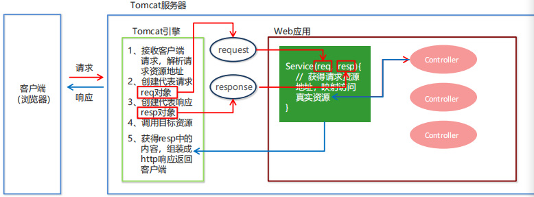
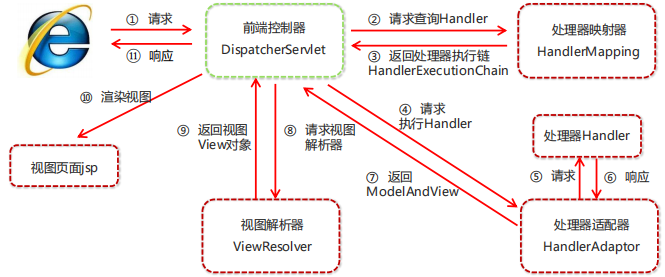
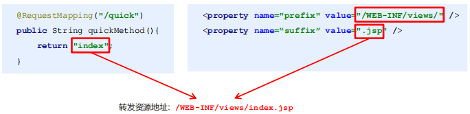
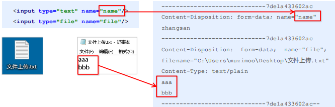
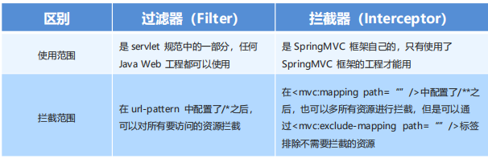
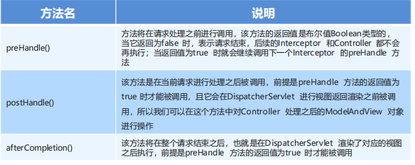

## 一、Spring集成web环境

### 1. ApplicationContext应用上下文获取方式

​		应用上下文对象是通过**new ClasspathXmlApplicationContext(spring配置文件)** 方式获取的，但是每次从容器中获得Bean时都要编写**new ClasspathXmlApplicationContext(spring配置文件)** ，这样的弊端是配置文件加载多次，应用上下文对象创建多次。

​		在Web项目中，可以使用**ServletContextListener**监听Web应用的启动，我们可以在Web应用启动时，就加载Spring的配置文件，创建应用上下文对象**ApplicationContext**，在将其存储到最大的域**servletContext**域中，这样就可以在任意位置从域中获得应用上下文**ApplicationContext**对象了。

### 2. Spring提供获取应用上下文的工具

Spring提供了一个监听器**ContextLoaderListener**就是对上述功能的封装，该监听器内部加载Spring配置文件，创建应用上下文对象，并存储到**ServletContext**域中，提供了一个客户端工具**WebApplicationContextUtils**供使用者获得应用上下文对象。

所以需要做的只有两件事：

1. 在**web.xml**中配置**ContextLoaderListener**监听器（导入spring-web坐标）
2. 使用**WebApplicationContextUtils**获得应用上下文对象**ApplicationContext**

### 3. 导入Spring集成web的坐标

```xml
<dependency> 
    <groupId>org.springframework</groupId> 
    <artifactId>spring-web</artifactId> 
    <version>5.0.5.RELEASE</version>
</dependency
```

### 4. 配置ContextLoaderListener监听器

```xml
<!--全局参数--> 
<context-param> 
    <param-name>contextConfigLocation</param-name> 
    <param-value>classpath:applicationContext.xml</param-value>
</context-param>
<!--Spring的监听器--> 
<listener> 
    <listener-class>
		org.springframework.web.context.ContextLoaderListener
	</listener-class>
</listener>
```

### 5. 通过工具获得应用上下文对象

```java
ApplicationContext applicationContext = 
WebApplicationContextUtils.getWebApplicationContext(servletContext);
Object obj = applicationContext.getBean("id");
```

## 二、SpringMVC

### 1. 概述

​		**SpringMVC** 是一种基于 Java 的实现 **MVC 设计模型**的请求驱动类型的轻量级 **Web 框架**，属于**SpringFrameWork** 的后续产品，已经融合在 Spring Web Flow 中。

​		SpringMVC 已经成为目前最主流的MVC框架之一，并且随着Spring3.0 的发布，全面超越 Struts2，成为最优秀的 MVC 框架。它通过一套注解，让一个简单的 Java 类成为处理请求的控制器，而无须实现任何接口。同时它还支持 **RESTful** 编程风格的请求。

### 2. 快速入门

1. 导入SpringMVC相关坐标

   ```xml
   <!--Spring坐标--> 
   <dependency> 
       <groupId>org.springframework</groupId> 
       <artifactId>spring-context</artifactId>
       <version>5.0.5.RELEASE</version>
   </dependency>
   <!--SpringMVC坐标--> 
   <dependency> 
       <groupId>org.springframework</groupId> 
       <artifactId>spring-webmvc</artifactId> 
       <version>5.0.5.RELEASE</version>
   </dependency>
   
   <!--Servlet坐标--> 
   <dependency> 
       <groupId>javax.servlet</groupId> 
       <artifactId>servlet-api</artifactId> 
       <version>2.5</version>
   </dependency>
   <!--Jsp坐标--> 
   <dependency> 
       <groupId>javax.servlet.jsp</groupId> 
       <artifactId>jsp-api</artifactId> 
       <version>2.0</version>
   </dependency>
   ```

2. 在web.xml配置SpringMVC核心控制器DispathcerServlet

   ```xml
   <servlet> 
       <servlet-name>DispatcherServlet</servlet-name> 
       <servlet-class>org.springframework.web.servlet.DispatcherServlet</servlet-class> <init-param> 
       <param-name>contextConfigLocation</param-name> 
       <param-value>classpath:spring-mvc.xml</param-value>
       </init-param> 
       <load-on-startup>1</load-on-startup>
   </servlet> 
   <servlet-mapping> 
       <servlet-name>DispatcherServlet</servlet-name> 
       <url-pattern>/</url-pattern>
   </servlet-mapping>
   ```

3. 创建Controller类和视图页面

   ```java
   public class QuickController {
       public String quickMethod(){
           System.out.println("quickMethod running.....");
           return "index"; } 
   }
   ```

   ```html
   <html> 
       <body>
           <h2>Hello SpringMVC!</h2>
       </body>
   </html>
   ```

4. 使用注解配置Controller类中业务方法的映射地址

   ```java
   @Controller
   public class QuickController {
       @RequestMapping("/quick")
       public String quickMethod(){
           System.out.println("quickMethod running.....");
           return "index"; } 
   }
   ```

5. 配置SpringMVC核心文件 spring-mvc.xml

   ```xml
   <beans xmlns="http://www.springframework.org/schema/beans"
   xmlns:mvc="http://www.springframework.org/schema/mvc"
   xmlns:context="http://www.springframework.org/schema/context"
   xmlns:xsi="http://www.w3.org/2001/XMLSchema-instance"
   xsi:schemaLocation="http://www.springframework.org/schema/beans
   http://www.springframework.org/schema/beans/spring-beans.xsd
   http://www.springframework.org/schema/mvc
   http://www.springframework.org/schema/mvc/spring-mvc.xsd
   http://www.springframework.org/schema/context
   http://www.springframework.org/schema/context/spring-context.xsd">
   <!--配置注解扫描--> 
       <context:component-scan base-package="com.itheima"/>
   </beans>
   ```

6. 客户端发起请求测试

   `http://localhost:8080/itheima_springmvc1/quick`

### 3. SpringMVC流程图示



## 三、SpringMVC 组件解析

### 1. SpringMVC的执行流程



1. 用户发送请求至前端控制器DispatcherServlet。 
2.  DispatcherServlet收到请求调用HandlerMapping处理器映射器。
3. 处理器映射器找到具体的处理器(可以根据xml配置、注解进行查找)，生成处理器对象及处理器拦截器(如果有则生成)一并返回给DispatcherServlet。 
4. DispatcherServlet调用HandlerAdapter处理器适配器。
5. HandlerAdapter经过适配调用具体的处理器(Controller，也叫后端控制器)。 
6. Controller执行完成返回ModelAndView。 
7. HandlerAdapter将controller执行结果ModelAndView返回给DispatcherServlet。 
8. DispatcherServlet将ModelAndView传给ViewReslover视图解析器。
9. ViewReslover解析后返回具体View。 
10. DispatcherServlet根据View进行渲染视图（即将模型数据填充至视图中）。DispatcherServlet响应用户。

### 2. SpringMVC组件解析

1. 前端控制器：DispatcherServlet

   ​		用户请求到达前端控制器，它就相当于 MVC 模式中的 C，DispatcherServlet 是整个流程控制的中心，由它调用其它组件处理用户的请求，DispatcherServlet 的存在降低了组件之间的耦合性。

2. 处理器映射器：HandlerMapping

   ​		HandlerMapping 负责根据用户请求找到 Handler 即处理器，SpringMVC 提供了不同的映射器实现不同的映射方式，例如：配置文件方式，实现接口方式，注解方式等。

3.  处理器适配器：HandlerAdapter

   ​		通过 HandlerAdapter 对处理器进行执行，这是适配器模式的应用，通过扩展适配器可以对更多类型的处理器进行执行。

4. 处理器：Handler

   ​		它就是我们开发中要编写的具体业务控制器。由 DispatcherServlet 把用户请求转发到 Handler。由Handler 对具体的用户请求进行处理。

5. 视图解析器：View Resolver

   ​		View Resolver 负责将处理结果生成 View 视图，View Resolver 首先根据逻辑视图名解析成物理视图名，即具体的页面地址，再生成 View 视图对象，最后对 View 进行渲染将处理结果通过页面展示给用户。

6.  视图：View

   ​		SpringMVC 框架提供了很多的 View 视图类型的支持，包括：jstlView、freemarkerView、pdfView等。最常用的视图就是 jsp。一般情况下需要通过页面标签或页面模版技术将模型数据通过页面展示给用户，需要由程序员根据业务需求开发具体的页面

### 3. SpringMVC注解解析

1. 配置

   ```xml
   命名空间：
   xmlns:context="http://www.springframework.org/schema/context"
   xmlns:mvc="http://www.springframework.org/schema/mvc"
   约束地址：
   http://www.springframework.org/schema/context
   http://www.springframework.org/schema/context/spring-context.xsd
   http://www.springframework.org/schema/mvc 
   http://www.springframework.org/schema/mvc/spring-mvc.xsd
   ```

   ​		SpringMVC基于Spring容器，所以在进行SpringMVC操作时，需要将Controller存储到Spring容器中，如果使用@Controller注解标注的话，就需要使用`<context:component-scan base-package="org.lql.controller"/>`进行组件扫描。

2. 注解

   **@RequestMapping**

   作用：用于建立请求 URL 和处理请求方法之间的对应关系

   位置：

   - 类上，请求URL 的第一级访问目录。此处不写的话，就相当于应用的根目录
   - 方法上，请求 URL 的第二级访问目录，与类上的使用@ReqquestMapping标注的一级目录一起组成访问虚拟路径

   属性：

   - **value**：用于指定请求的URL。它和path属性的作用是一样的

   - **method**：用于指定请求的方式

   - **params**：用于指定限制请求参数的条件。它支持简单的表达式。要求请求参数的key和value必须和配置的一模一样

   例如：

   - **params = {"accountName"}**，表示请求参数必须有accountName
   - **params = {"moeny!100"}**，表示请求参数中money不能是100

### 4.  SpringMVC的XML配置解析

 视图解析器

​		SpringMVC有默认组件配置，默认组件都是**DispatcherServlet.properties**配置文件中配置的，该配置文件地址**org/springframework/web/servlet/DispatcherServlet.properties**，该文件中配置了默认的视图解析器，如下

```properties
org.springframework.web.servlet.ViewResolver=org.springframework.web.servlet.view.InternalResourceViewResolver
```

到该解析器的默认设置，如下

```properties
REDIRECT_URL_PREFIX = "redirect:" --重定向前缀
FORWARD_URL_PREFIX = "forward:" --转发前缀（默认值）
prefix = ""; --视图名称前缀
suffix = ""; --视图名称后缀
```

可以通过属性注入的方式修改视图的的前后缀

```xml
<!--配置内部资源视图解析器--> 
<bean class="org.springframework.web.servlet.view.InternalResourceViewResolver"> 		<property name="prefix" value="/WEB-INF/views/">
    </property> <property name="suffix" value=".jsp"></property>
</bean>
```

## 四、SpringMVC的数据响应

### 1. 页面跳转

- 直接返回字符串

  直接返回字符串：此种方式会将返回的字符串与视图解析器的前后缀拼接后跳转

  

  返回带有前缀的字符串：

  转发：**forward:/WEB-INF/views/index.jsp**

  重定向：**redirect:/index.jsp**

- 通过ModelAndView对象返回

  ```java
  @RequestMapping("/quick2")
  public ModelAndView quickMethod2(){
      ModelAndView modelAndView = new ModelAndView();
      modelAndView.setViewName("redirect:index.jsp");
      return modelAndView;
  }
  @RequestMapping("/quick3")
  public ModelAndView quickMethod3(){
      ModelAndView modelAndView = new ModelAndView();
      modelAndView.setViewName("forward:/WEB-INF/views/index.jsp");
      return modelAndView;
  }
  
  // 在进行转发时，往往要向request域中存储数据，在jsp页面中显示
  // 通过SpringMVC框架注入的request对象setAttribute()方法设置
  @RequestMapping("/quick")
  public String quickMethod(HttpServletRequest request){
      request.setAttribute("name","zhangsan");
      return "index"; 
  }
  
  //通过ModelAndView的addObject()方法设置，也可以向request域存储数据
  @RequestMapping("/quick3")
  public ModelAndView quickMethod3(){
      ModelAndView modelAndView = new ModelAndView();
      modelAndView.setViewName("forward:/WEB-INF/views/index.jsp");
      modelAndView.addObject("name","lisi");
      return modelAndView;
  }
  ```

### 2. 回写数据

- 直接返回字符串

  ​		Web基础阶段，客户端访问服务器端，如果想直接回写字符串作为响应体返回的话，只需要使用response.getWriter().print(“hello world”) 即可，在springMVC中有以下两种方式：

  ```java
  // 通过SpringMVC框架注入的response对象，使用response.getWriter().print(“hello world”) 回写数据，此时不需要视图跳转，业务方法返回值为void
  @RequestMapping("/quick4")
  public void quickMethod4(HttpServletResponse response) throws 
      IOException {
      response.getWriter().print("hello world");
  }
  
  // 将需要回写的字符串直接返回，但此时需要通过@ResponseBody注解告知SpringMVC框架，方法返回的字符串不是跳转是直接在http响应体中返回
  @RequestMapping("/quick5")
  @ResponseBody
  public String quickMethod5() throws IOException {
      return "hello springMVC!!!"; 
  }
  
  // 在异步项目中，客户端与服务器端往往要进行json格式字符串交互，此时我们可以手动拼接json字符串返回
  @RequestMapping("/quick6")
  @ResponseBody
  public String quickMethod6() throws IOException {
      return "{\"name\":\"zhangsan\",\"age\":18}"; 
  }
  ```

- 返回对象或集合

  ​		通过SpringMVC帮助我们对对象或集合进行json字符串的转换并回写，为处理器适配器配置消息转换参数，指定使用jackson进行对象或集合的转换，因此需要在spring-mvc.xml中进行如下配置：

  ```xml
  <!--jackson--> 
  <dependency> 
      <groupId>com.fasterxml.jackson.core</groupId> 
      <artifactId>jackson-core</artifactId> 
      <version>2.9.0</version>
  </dependency>
  <dependency> 
      <groupId>com.fasterxml.jackson.core</groupId> 
      <artifactId>jackson-databind</artifactId> 
      <version>2.9.0</version>
  </dependency> 
  <dependency> 
      <groupId>com.fasterxml.jackson.core</groupId> 
      <artifactId>jackson-annotations</artifactId>				    	<version>2.9.0</version>
  </dependency>
  
  <bean class="org.springframework.web.servlet.mvc.method.annotation
  .RequestMappingHandlerAdapter"> 
      <property name="messageConverters"> 
          <list>
              <bean class="org.springframework.http.converter.json
  .MappingJackson2HttpMessageConverter"></bean>
          </list>
  	</property>
  </bean>
  ```

  ```java
  @RequestMapping("/quick8")
  @ResponseBody
  public User quickMethod8() throws IOException {
      User user = new User();
      user.setUsername("zhangsan");
      user.setAge(18);
      return user;
  }
  ```

  ​		在方法上添加**@ResponseBody**就可以返回json格式的字符串，但是这样配置比较麻烦，配置的代码比较多，因此，我们可以使用mvc的注解驱动代替上述配置。

  ```xml
  <!--mvc的注解驱动--> 
  <mvc:annotation-driven/>
  ```

  ​		在 SpringMVC 的各个组件中，**处理器映射器**、**处理器适配器**、**视图解析器**称为 SpringMVC 的三大组件。使用`<mvc:annotation-driven>`自动加载 RequestMappingHandlerMapping（处理映射器）和RequestMappingHandlerAdapter（ 处 理 适 配 器 ），可用在Spring-xml.xml配置文件中使用`<mvc:annotation-driven>`替代注解处理器和适配器的配置。

  ​		同时使用`<mvc:annotation-driven>`默认底层就会集成jackson进行对象或集合的json格式字符串的转换

## 五、SpringMVC 获得请求数据

### 1. 获得请求参数

客户端请求参数的格式是：**name=value&name=value… …**

服务器端要获得请求的参数，有时还需要进行数据的封装，SpringMVC可以接收如下类型的参数：

- 基本类型参数
- POJO类型参数
- 数组类型参数
- 集合类型参数

### 2. 获得基本类型参数

Controller中的业务方法的参数名称要与请求参数的name一致，参数值会自动映射匹配。

`http://localhost:8080/itheima_springmvc1/quick9?username=zhangsan&age=12`

```java
@RequestMapping("/quick9")
@ResponseBody
public void quickMethod9(String username,int age) throws IOException {
    System.out.println(username);
    System.out.println(age);
}
```

### 3. 获得POJO类型参数

Controller中的业务方法的POJO参数的属性名与请求参数的name一致，参数值会自动映射匹配。

`http://localhost:8080/itheima_springmvc1/quick9?username=zhangsan&age=12`

```java
public class User {
    private String username;
    private int age;
    getter/setter…
}

@RequestMapping("/quick10")
@ResponseBody
public void quickMethod10(User user) throws IOException {
    System.out.println(user);
}
```

### 4. 获得数组类型参数

Controller中的业务方法数组名称与请求参数的name一致，参数值会自动映射匹配。

`http://localhost:8080/itheima_springmvc1/quick11?strs=111&strs=222&strs=333`

```java
@RequestMapping("/quick11")
@ResponseBody
public void quickMethod11(String[] strs) throws IOException {
    System.out.println(Arrays.asList(strs));
}
```

### 5. 获得集合类型参数

获得集合参数时，要将集合参数包装到一个POJO中才可以。

```html
<form action="${pageContext.request.contextPath}/quick12" method="post"> 		<input type="text" name="userList[0].username"><br> 
    <input type="text" name="userList[0].age"><br> 
    <input type="text" name="userList[1].username"><br> 
    <input type="text" name="userList[1].age"><br> 
    <input type="submit" value="提交"><br>
</form>
```

```java
@RequestMapping("/quick12")
@ResponseBody
public void quickMethod12(Vo vo) throws IOException {
    System.out.println(vo.getUserList());
}
```

当使用ajax提交时，可以指定contentType为json形式，那么在方法参数位置使用@RequestBody可以直接接收集合数据而无需使用POJO进行包装。

```javascript
//模拟数据
var userList = new Array();
userList.push({username: "zhangsan",age: "20"});
userList.push({username: "lisi",age: "20"});
$.ajax({
    type: "POST",
    url: "/quick13",
    data: JSON.stringify(userList),
    contentType : 'application/json;charset=utf-8'
});
```

```java
@RequestMapping("/quick13")
@ResponseBody
public void quickMethod13(@RequestBody List<User> userList) throws 
    IOException {
    System.out.println(userList);
}
```

### 6. 拦截静态资源问题

​		通过谷歌开发者工具抓包发现，没有加载到jquery文件，原因是SpringMVC的前端控制器DispatcherServlet的url-pattern配置的是/,代表对所有的资源都进行过滤操作，我们可以通过以下两种方式指定放行静态资源：

- 在spring-mvc.xml配置文件中指定放行的资源

  `<mvc:resources mapping="/js/**" location="/js/"/> `

  使用`<mvc:default-servlet-handler/>`标签

### 7. 请求数据乱码问题

当post请求时，数据会出现乱码，我们可以设置一个过滤器来进行编码的过滤

```xml
<filter> 
    <filter-name>CharacterEncodingFilter</filter-name> 
    <filter-class>
        org.springframework.web.filter.CharacterEncodingFilter
    </filter-class> 
    <init-param> 
        <param-name>encoding</param-name> 
        <param-value>UTF-8</param-value>
    </init-param>
</filter> 
<filter-mapping> 
    <filter-name>CharacterEncodingFilter</filter-name> 
    <url-pattern>/*</url-pattern>
</filter-mapping>
```

### 8. 参数绑定注解@requestParam

注解@RequestParam还有如下参数可以使用：

- **value**：与请求参数名称
- **required**：此在指定的请求参数是否必须包括，默认是true，提交时如果没有此参数则报错
- **defaultValue**：当没有指定请求参数时，则使用指定的默认值赋值

```java
@RequestMapping("/quick14")
@ResponseBody
public void quickMethod14(@RequestParam(value="name", required = false, defaultValue = "itcast") String username) throws IOException {
    System.out.println(username);
}
```

### 9. 获得Restful风格的参数

​		**Restful**是一种软件**架构风格**、**设计风格**，而不是标准，只是提供了一组设计原则和约束条件。主要用于客户端和服务器交互类的软件，基于这个风格设计的软件可以更简洁，更有层次，更易于实现缓存机制等。

​		**Restful**风格的请求是使用**“url+请求方式”**表示一次请求目的的，HTTP 协议里面四个表示操作方式的动词如下：

- GET：用于获取资源
- POST：用于新建资源
- PUT：用于更新资源
- DELETE：用于删除资源

例如：

- /user/1 GET ： 得到 id = 1 的 user
- /user/1 DELETE： 删除 id = 1 的 user
- /user/1 PUT： 更新 id = 1 的 user
- /user POST： 新增 user

上述url地址/user/1中的1就是要获得的请求参数，在SpringMVC中可以使用占位符进行参数绑定。地址/user/1可以写成/user/{id}，占位符{id}对应的就是1的值。在业务方法中我们可以使用@PathVariable注解进行占位符的匹配获取工作。

`http://localhost:8080/itheima_springmvc1/quick19/zhangsan`

```java
@RequestMapping("/quick19/{name}")
@ResponseBody
public void quickMethod19(@PathVariable(value = "name",required = true) String name){
    System.out.println(name);
}
```

### 10.  自定义类型转换器

- SpringMVC 默认已经提供了一些常用的类型转换器，例如客户端提交的字符串转换成int型进行参数设置。
- 但是不是所有的数据类型都提供了转换器，没有提供的就需要自定义转换器，例如：日期类型的数据就需要自定义转换器。

自定义类型转换器的开发步骤：

1. 定义转换器类实现Converter接口

   ```java
   public class DateConverter implements Converter<String,Date>{
       @Override
       public Date convert(String source) {
           SimpleDateFormat format = new SimpleDateFormat("yyyy-MM-dd");
           try {
               Date date = format.parse(source);
               return date;
           } catch (ParseException e) {
               e.printStackTrace();
           }
           return null; 
       } 
   }
   ```

2. 在配置文件中声明转换器

   ```xml
   <bean id="converterService" class="org.springframework.context.support.ConversionServiceFactoryBean"> <property name="converters"> 
       <list>
           <bean class="com.itheima.converter.DateConverter"/>
       </list>
       </property>
   </bean>
   ```

3. 在<annotation-driven>中引用转换器

   `<mvc:annotation-driven conversion-service="converterService"/>`

### 11. 获得Servlet相关API

SpringMVC支持使用原始ServletAPI对象作为控制器方法的参数进行注入，常用的对象如下：

- HttpServletRequest
- HttpServletResponse
- HttpSession

```java
@RequestMapping("/quick16")
@ResponseBody
public void quickMethod16(HttpServletRequest request, HttpServletResponse response, HttpSession session){
    System.out.println(request);
    System.out.println(response);
    System.out.println(session);
}
```

### 12.  获得请求头

1.  @RequestHeader

   使用@RequestHeader可以获得请求头信息，相当于web阶段学习的request.getHeader(name)

   @RequestHeader注解的属性如下：

   - **value**：请求头的名称

   - **required**：是否必须携带此请求头

     ```java
     @RequestMapping("/quick17")
     @ResponseBody
     public void quickMethod17(
     @RequestHeader(value = "User-Agent",required = false) String 
     headerValue){
     System.out.println(headerValue);
     }
     ```

2. @CookieValue

   使用@CookieValue可以获得指定Cookie的值

   @CookieValue注解的属性如下：

   - **value**：指定cookie的名称
   - **required**：是否必须携带此cookie

### 13. 文件上传

1.  文件上传客户端三要素

   - 表单项type=“file”

   - 表单的提交方式是post

   - 表单的enctype属性是多部分表单形式，及enctype=“multipart/form-data”

     ```html
     <form action="${pageContext.request.contextPath}/quick20" method="post" enctype="multipart/form-data">
         名称：<input type="text" name="name"><br>
         文件：<input type="file" name="file"><br> 
         <input type="submit" value="提交"><br>
     </form>
     ```

2. 文件上传原理

   - 当form表单修改为多部分表单时，request.getParameter()将失效。

   - enctype=“application/x-www-form-urlencoded”时，form表单的正文内容格式是：

     **key=value&key=value&key=value**

   - 当form表单的enctype取值为Mutilpart/form-data时，请求正文内容就变成多部分形式：

     

3. 单文件上传步骤

   - 导入fileupload和io坐标

     ```xml
     <dependency> 
         <groupId>commons-fileupload</groupId> 
         <artifactId>commons-fileupload</artifactId>
         <version>1.2.2</version>
     </dependency> 
     <dependency> 
         <groupId>commons-io</groupId> 
         <artifactId>commons-io</artifactId> 
         <version>2.4</version>
     </dependency>
     ```

   - 配置文件上传解析器

     ```xml
     <bean id="multipartResolver" class="org.springframework.web.multipart.commons.CommonsMultipartResolver">
         <!--上传文件总大小--> <property name="maxUploadSize" value="5242800"/>
         <!--上传单个文件的大小--> <property name="maxUploadSizePerFile" value="5242800"/>
         <!--上传文件的编码类型--> <property name="defaultEncoding" value="UTF-8"/>
     </bean>
     ```

   - 编写文件上传代码

     ```java
     @RequestMapping("/quick20")
     @ResponseBody
     public void quickMethod20(String name,MultipartFile uploadFile) throws 
         IOException {
         //获得文件名称
         String originalFilename = uploadFile.getOriginalFilename();
         //保存文件
         uploadFile.transferTo(new File("C:\\upload\\"+originalFilename));
     }
     ```

4. 多文件上传实现

   多文件上传，只需要将页面修改为多个文件上传项，将方法参数MultipartFile类型修改为MultipartFile[]即可

   ```html
   <h1>多文件上传测试</h1> <form action="${pageContext.request.contextPath}/quick21" method="post" enctype="multipart/form-data">
       名称：<input type="text" name="name"><br>
       文件1：<input type="file" name="uploadFiles"><br>
       文件2：<input type="file" name="uploadFiles"><br>
       文件3：<input type="file" name="uploadFiles"><br> <input type="submit" value="提交"><br>
   </form>
   ```

   ```java
   @RequestMapping("/quick21")
   @ResponseBody
   public void quickMethod21(String name,MultipartFile[] uploadFiles) throws 
       IOException {
       for (MultipartFile uploadFile : uploadFiles){
           String originalFilename = uploadFile.getOriginalFilename();
           uploadFile.transferTo(new File("C:\\upload\\"+originalFilename));
       } 
   }
   ```

## 六、SpringMVC拦截器

### 1.  拦截器（interceptor）的作用

​		Spring MVC 的**拦截器**类似于 Servlet 开发中的过滤器 Filter，用于对处理器进行**预处理**和**后处理**。

​		将拦截器按一定的顺序联结成一条链，这条链称为**拦截器链（Interceptor Chain）**。在访问被拦截的方法或字段时，拦截器链中的拦截器就会按其之前定义的顺序被调用。拦截器也是AOP思想的具体实现。

### 2. 拦截器和过滤器区别



### 3. 拦截器是快速入门

1. 创建拦截器类实现HandlerInterceptor接口

   ```java
   public class MyHandlerInterceptor1 implements HandlerInterceptor {
       public boolean preHandle(HttpServletRequest request, HttpServletResponse response, Object handler) {
           System.out.println("preHandle running...");
           return true; }
       public void postHandle(HttpServletRequest request, HttpServletResponse response, Object handler, ModelAndView modelAndView) {
           System.out.println("postHandle running...");
       }
       public void afterCompletion(HttpServletRequest request, HttpServletResponse response, Object handler, Exception ex) {
           System.out.println("afterCompletion running...");
       } 
   }
   ```

2. 配置拦截器

   ```xml
   <!--配置拦截器--> 
   <mvc:interceptors> 
       <mvc:interceptor> 
           <mvc:mapping path="/**"/>
           <bean class="org.lql.interceptor.MyHandlerInterceptor1"/>
       </mvc:interceptor>
   </mvc:interceptors>
   ```

3. 测试拦截器的拦截效果

   ```java
   @RequestMapping("/quick23") @ResponseBody
   public ModelAndView quickMethod23() throws IOException, ParseException {
       System.out.println("目标方法执行....");
       ModelAndView modelAndView = new ModelAndView();
       modelAndView.addObject("name","itcast");
       modelAndView.setViewName("index");
       return modelAndView; 
   }
   ```

### 4. 拦截器方法说明



## 七、SpringMVC异常处理机制

### 1. 异常处理的思路

系统中异常包括两类：**预期异常**和**运行时异常RuntimeException**，前者通过捕获异常从而获取异常信息，后者主要通过规范代码开发、测试等手段减少运行时异常的发生。

系统的**Dao**、**Service**、**Controller**出现都通过throws Exception向上抛出，最后由SpringMVC前端控制器交由异常处理器进行异常处理，如下图：


### 2. 异常处理两种方式

- 使用Spring MVC提供的简单异常处理器SimpleMappingExceptionResolver

  SpringMVC已经定义好了该类型转换器，在使用时可以根据项目情况进行相应异常与视图的映射配置

  ```xml
  <!--配置简单映射异常处理器--> 
  <bean class=“org.springframework.web.servlet.handler.SimpleMappingExceptionResolver”> 
      <property name=“defaultErrorView” value=“error”/> 默认错误视图
      <property name=“exceptionMappings”>
          <map> 异常类型 错误视图
              <entry key="org.lql.exception.MyException" value="error"/>
              <entry key="java.lang.ClassCastException" value="error"/>
          </map>
      </property>
  </bean>
  ```

- 实现Spring的异常处理接口HandlerExceptionResolver 自定义自己的异常处理器

  - 创建异常处理器类实现HandlerExceptionResolver

    ```java
    public class MyExceptionResolver implements HandlerExceptionResolver {
        @Override
        public ModelAndView resolveException(HttpServletRequest request, HttpServletResponse response, Object handler, Exception ex) {
            //处理异常的代码实现
            //创建ModelAndView对象
            ModelAndView modelAndView = new ModelAndView();
            modelAndView.setViewName("exceptionPage");
            return modelAndView;
        } 
    }
    ```

  - 配置异常处理器

    ```xml
    <bean id="exceptionResolver" class="org.lql.exception.MyExceptionResolver"/>
    ```

  - 编写异常页面

    ```html
    <%@ page contentType="text/html;charset=UTF-8" language="java" %>
        <html> 
            <head>
                <title>Title</title>
            </head>
            <body>
                这是一个最终异常的显示页面
            </body>
        </html>
    ```

  - 测试异常跳转

    ```java
    @RequestMapping("/quick22")
    @ResponseBody
    public void quickMethod22() throws IOException, ParseException {
        SimpleDateFormat simpleDateFormat = new SimpleDateFormat("yyyy-MM-dd");
        simpleDateFormat.parse("abcde");
    }
    ```

    